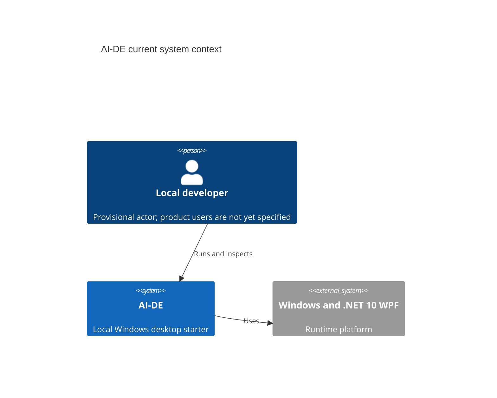
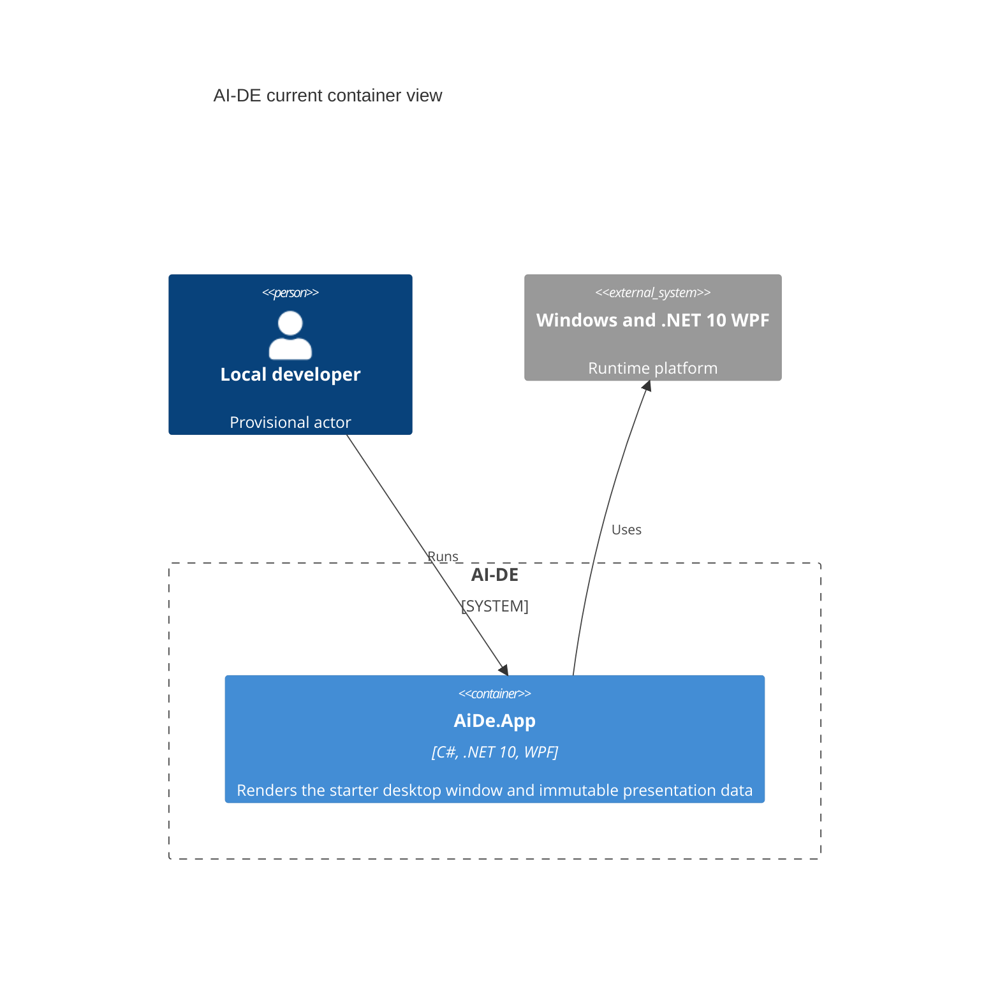
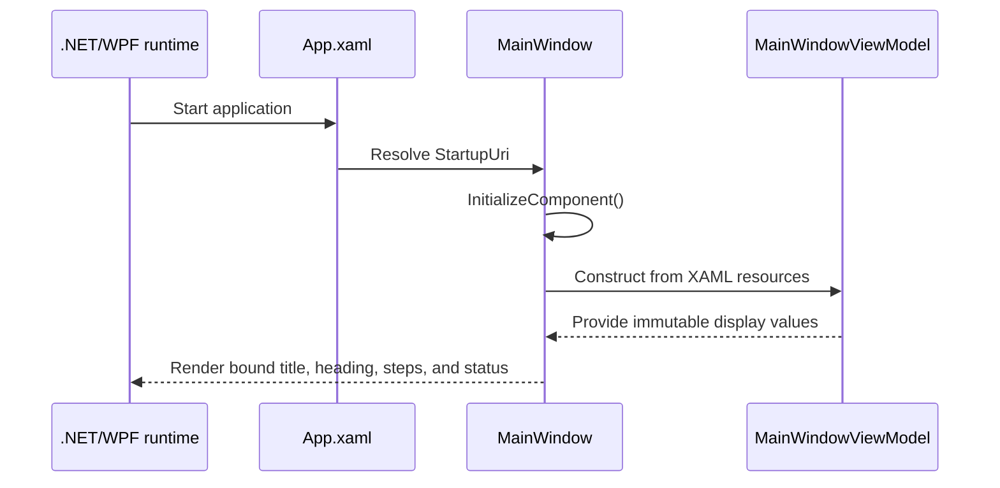

# AI-DE Current Architecture

- **Recovery date:** 2026-08-23
- **Status:** In review
- **Evidence base:** source, project files, active workflows, tests, and commits through `ef30e96`
- **Confidence:** claims are labeled **Verified**, **Inferred**, or **Flagged**

## Scope

This document records the architecture that exists now. It does not prescribe a
future product architecture.

- **Verified:** AI-DE currently has one runtime executable, `AiDe.App`, built as
  a .NET 10 Windows WPF `WinExe`
  (`src/AiDe.App/AiDe.App.csproj:4-8`; `AiDe.sln:6-12`).
- **Verified:** beyond the Windows/.NET WPF runtime platform, the runtime source
  contains no network client, persistence adapter, background worker, model
  client, or external-service integration.
- **Flagged:** the eventual product actor and business capability are not yet
  specified. The only current user evidence is starter copy for a local
  developer (`src/AiDe.App/MainWindow.xaml:47-50`).

## C4 context

- **Verified:** Windows and WPF are the only runtime platform boundary
  (`src/AiDe.App/AiDe.App.csproj:4-8`).
- **Flagged:** "Local developer" is provisional until `/specify` records the
  target user and core scenario.
- **Verified:** no external service or integration is present beyond the
  Windows/.NET WPF runtime platform.

## C4 container

- **Verified:** `AiDe.App` is the only runtime container.
- **Verified:** `AiDe.App.Tests` is a development-time xUnit project that
  references the application; it is not a runtime container
  (`tests/AiDe.App.Tests/AiDe.App.Tests.csproj:4-23`).
- **Verified:** `.claude`, `.github`, and `docs/ai-forward-pack` are
  engineering-workflow assets, not runtime participants.

## Startup and rendering path

- **Verified:** `App.xaml` sets `StartupUri="MainWindow.xaml"`
  (`src/AiDe.App/App.xaml:1-5`).
- **Verified:** `MainWindow` calls `InitializeComponent()`
  (`src/AiDe.App/MainWindow.xaml.cs:5-9`).
- **Verified:** XAML constructs `MainWindowViewModel` as the window
  `DataContext` and binds `WindowTitle`, `Heading`, `GettingStartedSteps`, and
  `StatusMessage`
  (`src/AiDe.App/MainWindow.xaml:8,15-17,37,51,66`).

## Current patterns and boundaries

| Shape | Current implementation | Confidence |
|---|---|---|
| Minimal view-first MVVM seam | `MainWindow` is the View; `MainWindowViewModel` supplies presentation values. No separate domain Model is present. | **Verified** - `src/AiDe.App/MainWindow.xaml:15-17`; `src/AiDe.App/ViewModels/MainWindowViewModel.cs:3-16` |
| WPF data binding | XAML binds the window and content to four view-model properties. | **Verified** - `src/AiDe.App/MainWindow.xaml:8,37,51,66` |
| WPF data template | The getting-started collection uses an `ItemsControl.DataTemplate`. | **Verified** - `src/AiDe.App/MainWindow.xaml:51-58` |
| WPF bootstrap | `StartupUri` and generated partial classes start the window. | **Verified** - `src/AiDe.App/App.xaml:1-5`; `src/AiDe.App/MainWindow.xaml.cs:5-9` |

The following labels are intentionally rejected because their required
participants do not exist: Clean Architecture, Hexagonal Architecture, Onion
Architecture, Repository, Service Layer, dependency injection, reactive MVVM,
Observer, and Command.

## Current runtime layer

AI-DE has one runtime presentation layer: WPF `MainWindow` plus the bounded,
immutable `MainWindowViewModel` seam. There is no separate domain, application
service, integration, persistence, or background-processing layer.

The current runtime is deterministic T0. No runtime AI participant exists, so
no LOA archetype applies.

Development support consists of one xUnit test project, solution-wide MSBuild
policy, and GitHub Actions build/docs workflows. These are not runtime layers.

## Public and load-bearing contracts

| Contract | Consumer | Current proof |
|---|---|---|
| `App` WPF application type | WPF generated startup | Build-time only |
| `MainWindow` and its public constructor | `StartupUri` / WPF runtime | Build-time only |
| `MainWindowViewModel` | XAML `DataContext`, unit test | One direct unit test |
| `WindowTitle`, `Heading`, `GettingStartedSteps`, `StatusMessage` | String-based XAML bindings | Three scalar values and collection non-emptiness tested; binding resolution and step contents untested |

The public types are visible at
`src/AiDe.App/App.xaml.cs:5-12`,
`src/AiDe.App/MainWindow.xaml.cs:3-9`, and
`src/AiDe.App/ViewModels/MainWindowViewModel.cs:3-16`.

## Build, test, and CI reality

- **Verified:** SDK `10.0.303` is pinned with `latestFeature` roll-forward
  (`global.json:1-7`).
- **Verified:** latest analysis/language settings and warnings-as-errors apply
  solution-wide (`Directory.Build.props:1-7`).
- **Verified by execution on 2026-08-23:** restore succeeded, Release build
  completed with zero warnings and zero errors, and the one test passed.
- **Verified:** the build workflow restores, builds, and tests on Windows.
- **Verified:** docs-health validates graph defects and warns on freshness.

## Cross-cutting concerns

- **Identity and trust:** **Verified** - no authentication, authorization,
  credential, or external trust boundary exists in runtime code.
- **Data and privacy:** **Verified** - no persisted or transmitted user data
  exists in runtime code.
- **Failure and resilience:** **Verified** - no external dependency or retry
  boundary exists. WPF startup and binding failures remain uncovered.
- **Observability:** **Verified** - no runtime telemetry is present.
- **Packaging and release:** **Flagged** - no packaging, signing, installer, or
  release workflow is defined.

## Decision archaeology

| Commit | Evidence recovered | Confidence |
|---|---|---|
| `57531ea` | Scaffolded the .NET 10 WPF application, test project, minimal MVVM seam, and build workflow. | **Verified action; rationale not recorded** |
| `95ed869` | Installed AI-Forward Pack revision 45. | **Verified action; rationale recorded only as installation intent** |
| `ef30e96` | Added public licensing/provenance and pinned active GitHub Actions revisions. | **Verified action and commit message** |

No historical product specification, architecture decision record, component
design, or proof pack was recovered. Their absence is a gap, not permission to
reconstruct fictional history.

## Flagged risks and residual unknowns

1. Product purpose, target user, and core scenario are unspecified.
2. XAML startup, `DataContext`, and binding resolution are not tested.
3. Public C# members do not yet have API documentation.
4. No accessibility, rendered-surface, packaging, signing, release, runtime
   telemetry, threat-model, or privacy-review evidence exists.
5. The intended Windows 10 support floor is not encoded in project metadata.

## Gate record

Pending the independent adoption gate.
