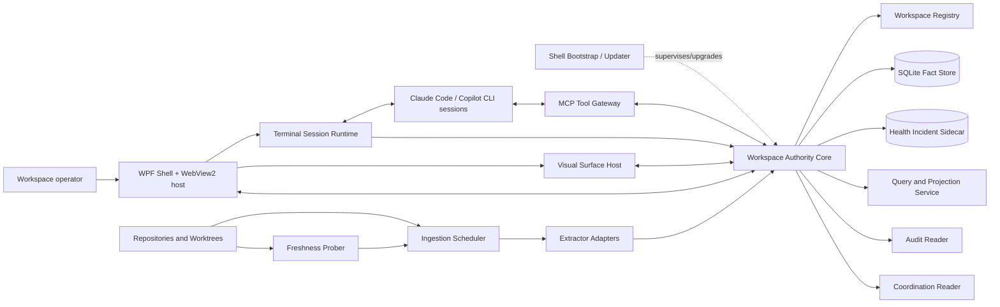

# Architecture: AI-DE

- **Status:** In review
- **Tier:** T2
- **Driving spec:** [`docs/specs/ai-native-ide.md`](specs/ai-native-ide.md)
- **Author(s) / date:** @timianmalloo · 2026-08-26 (v2)
- **Baseline:** `src/AiDe.App` is a .NET 10 WPF starter with no daemon, persistence, runtime AI,
  terminal, or extraction components. This architecture is the target shape; it does not claim the
  target is implemented.
- **Supersedes:** the 2026-08-25 architecture draft. This revision resolves the ten-persona
  adversary review of that draft ([`docs/notes/council-review-ai-ide-arch.md`](notes/council-review-ai-ide-arch.md)):
  the three hard vetoes (write-ahead dispatch receipt; committed spike evidence; US-4 verification
  path plus MCP egress governance), the two soft vetoes (release/rollback mechanism; Phase-1
  right-sizing), and the verified internal contradictions. Each change is traced to its finding in
  **Review resolution** below.

## Context and constraints

A developer directing several coding agents across worktrees must inspect architecture, domain/data,
process/dependency, knowledge, audit, prompt, and coordination evidence **without creating editable
models that compete with source artifacts** (spec Problem; US-1..US-8). The architecture makes the
repository the authority and every visual claim a labelled projection of attributable evidence.

| Constraint (spec source) | Architectural response |
|---|---|
| Derived facts must state provenance and confidence (US-1, US-2, domain AC). | Store immutable evidence assertions separately from derived relationship claims and views; every projection carries source revision, provenance, and a `Verified`/`Inferred`/`Unverified` label. |
| Coordination is advisory unless a resource accepts fencing (spec constraint 4, US-5). | Render claims as advisory evidence; no daemon operation treats a lease as exclusive authority. |
| Workspace and audit content may be sensitive; egress-deny by default (spec privacy, US-7). | One local authority core + one database per workspace; **MCP tool authorization is bound to the target session's declared processing class**; no automatic terminal capture or model-context attachment. |
| Graph and model context must be bounded (US-3). | Every query, view, and MCP tool returns a capped neighborhood with **node, edge, and byte** counts, omissions, and continuation — never a full graph. |
| Current WPF shell is a supported .NET 10 baseline (spec Part C). | Retain WPF as the shell frame; host visual surfaces in an embedded WebView2 and terminals in a renderer-independent runtime, both behind contracts (ADR-0008). |
| Kuzu is archived; no direct replacement meets the seed's criteria (spec constraint 3). | Relational fact store and query interface behind `IWorkspaceStore`, not a Kuzu/Cypher dependency (ADR-0002). |
| MCP 2026-07-28 is stateless; security is host responsibility (spec constraint 5). | Every request is self-contained; authority is server-derived from the connection and bound to workspace/session context; typed tools; no ambient identity (ADR-0004). |
| Single-user local desktop tool, Windows-first (spec NFR Compatibility). | Start simple: a Phase-1 **in-process** authority core, promoted to a separate daemon process only when the terminal runtime creates the first real need (ADR-0009). Fleet-scale release machinery is deferred to the phase that ships a second binary. |

### System shape

The boxes below are **logical roles**, not a process count. Phase 1 runs the authority core
in-process inside the shell; from Phase 2 the core runs as a separate per-workspace daemon (ADR-0009).
Every role keeps the same contract across that move, so the split is a deployment change, not a
redesign.

## Archetype and rationale

**Primary archetype: F — Copilot Aside Hot Path.** Repository indexing, storage, query, projection,
prompt staging, dispatch authorization, and rendering are deterministic (T0). An agent or model can
consume bounded context and propose annotations, but it cannot block the workspace hot path or make
artifact-derived truth. v1 ships **no model call at all** (M1, below), so F here describes the
*shape the hot path is built to*, and the AI-aside channel is dormant until the optional capability
contract is met — recorded so the fork is explicit, not aspirational.

**Composed archetypes:**
- **C — Tool-Mediated Constructor:** the MCP gateway exposes declared, typed graph/knowledge
  operations instead of asking a model to generate API calls or code.
- **D — Grounded Synthesizer (bounded, optional, later):** the optional explanation capability is a
  *bounded* D instance over workspace-scoped evidence — retrieval + synthesis with a Grounded
  Context Injector — not global GraphRAG. Recorded here to keep spec and architecture aligned
  (spec allocates bounded D; the earlier draft rejected D on a GraphRAG strawman).
- **H — Long-Horizon Agent (external):** external coding sessions can be long-running; their state
  is Agent Operations / Coordination facts, not a held model context.

**Rejected:** **D as the *primary/global* shape** (GraphRAG global queries have high cost and weaker
privacy/determinism than bounded direct queries); **B — Adversarial Ensemble** (no model judges
architecture facts; deterministic evidence and human review are the authority); **A — Cascade
Pipeline** as the workspace shape (individual extractors may internally cascade; the workspace does
not require one).

## Capability-tier allocation

| Capability | Tier | Why this tier |
|---|---|---|
| Workspace membership, path validation, session binding, prompt dispatch receipt, coordination fold | T0 | Identity, authorization, and audit invariants; a model would make them less deterministic. |
| Extractor scope replacement, evidence ingestion, fact constraints, impact traversal, DSL generation | T0 | Compiler/parser/SQL behavior is authoritative and reproducible. |
| Visual layout, filtering, diagram rendering, accessibility alternatives | T0 | Renderer output must be testable and stable. |
| MCP tool schema validation, read/write authorization, **result truncation and byte-bounding** | T0 | Typed boundary, least-privilege, and context bounding are deterministic; a model never chooses what is omitted. |
| Optional local **reorder-only** ranking within a T0-selected, T0-truncated result set | T1/T2, later | Only after a measured need beats a deterministic baseline; never selects which evidence is dropped and never a source-of-truth path. |
| Optional agent explanation/synthesis (bounded D) | T3, opt-in | May explain bounded evidence; disclosed, cited, budgeted; cannot mutate artifact facts or dispatch prompts. |

This implements LOA P1–P5: deterministic work at the floor, cognition separated from execution, a
deterministic verifier behind every consequential operation. **The capability gate below governs any
capability above T0 — ranking included — not only "explanation."**

## Component map and boundaries

| Component | Responsibility | Owns | Boundary contract |
|---|---|---|---|
| **WPF Shell + WebView2 host** | Window, docking/layout, keyboard routing, pane lifecycle, user confirmation; hosts visual surfaces in an embedded WebView2 (ADR-0008). | No repository truth or agent authority. | Authenticated local control client to exactly one authority core; WebView2 receives only inert projection documents under a strict CSP. |
| **Shell Bootstrap / Updater** | Owns installed binary layout, launches the authority core, performs upgrade preflight, and executes rollback; the actor that "keeps the previous binary." | Installed-version directories and the update channel. | Named in ADR-0009 and the release plan; from Phase 2 it supervises a separate daemon process and reaps orphans via a Windows Job Object. |
| **Terminal Session Runtime** | Owns ConPTY handles/streams and separate I/O service loops; parses advisory OSC state; exposes session generation/lifecycle. | Process handles and ephemeral terminal output. | `ITerminalSession`; a renderer never owns PTY lifecycle; terminal processes live in a Job Object killed on core exit. |
| **Visual Surface Host** | Renders graph/diagram/audit/work/prompt views and an equivalent accessible list/tree. | View-local selection and layout only. | Projection document + stable node IDs/provenance; all artifact strings are inert data. |
| **Workspace Authority Core** | Workspace-local authority boundary and orchestration root: registry, lifecycle, policy, one write pipeline. | Registry, store, policy, single writer. | In-process module (Phase 1) or OS-local authenticated IPC (Phase 2+), same command contract either way; all calls carry workspace, epoch, and server-derived caller context. |
| **Ingestion Scheduler** | Debounces file/event signals, schedules scope replacement, reports stale/failed state. | Job state only. | `ExtractionRequest(scope, artifactRevision, trigger)` and versioned results; two prioritized writer classes, control preempting ingestion. |
| **Freshness Prober** | Periodically compares each scope's repository-observed revision to its indexed revision to detect **silent watcher loss**. | Probe checkpoints. | Emits `scope.observed_revision` vs `scope.indexed_revision`; divergence raises a health incident and re-enqueues the scope. |
| **Extractor Adapter** | Reads one declared artifact scope; emits evidence assertions/snapshot. | No durable state. | Phase 1 in-process fixture adapter; a versioned process/JSON boundary is added only when an extractor needs language/runtime isolation. |
| **Workspace Fact Store** | Persists dimensions, append-only facts, transactionally derived current-state cache, export. | Workspace data only. | `IWorkspaceStore`; `recursive_triggers=ON` + no REPLACE/UPSERT on fact tables; read connections `query_only=1`; no renderer/agent bypass (ADR-0002, spike-verified). |
| **Query and Projection Service** | Bounded graph queries → C4, class, ER, sequence/activity, dependency, knowledge, work, audit projections. | Derived projections/caches. | Every result carries limits (node/edge/**byte**), returned/omitted counts, source revision, provenance, confidence. |
| **Audit and Coordination Readers** | Fold audited source records and per-session coordination logs into classified facts. | Reader checkpoint and classification state. | Versioned inputs; unsafe/unknown audit content fails closed; coordination fold orders **per-session writer sequence first, daemon ingress sequence only across sessions**. |
| **Health Incident Sidecar** | Durable, bounded incident channel **independent of the fact store**, so a store-unwritable failure is still recordable. | Incident ring with dedup + occurrence counts. | Fixed-size append file (not the workspace DB); dedup key `{class, scope}`; unacknowledged incidents evict last. |
| **MCP Tool Gateway** | Bounded read tools and narrowly-authorized knowledge/coordination writes to agents. | Tool authorization/audit receipt. | JSON-Schema tools; **authorization bound to the target session's processing class** (ADR-0011); no artifact-fact writes; results carry authorship origin; agent text is untrusted data. |

### Fact, extractor, and projection rules

1. **Immutability is a store control, not a wish.** Fact tables carry `BEFORE UPDATE`/`BEFORE DELETE`
   `RAISE(ABORT)` triggers; every writer connection sets `PRAGMA recursive_triggers=ON` (without it,
   `INSERT OR REPLACE` silently deletes a fact — spike S4) and **REPLACE/UPSERT conflict resolution
   is forbidden in the writer**; read connections set `PRAGMA query_only=1`. The real boundary is the
   single-writer core process; triggers/pragmas are defense-in-depth (spike `sqlite-fact-store` S3–S6).
2. The scheduler transactionally assigns a monotonically increasing **desired generation** and
   authoritative artifact revision to every scope before enqueue. A worker commits only when its
   generation **and** observed revision equal the durable desired pair; the same transaction records
   a `ScopeSnapshotCompleted` fact (assertion count/hash/completeness), the committed pair, the
   assertions, and projection-cache invalidation. Current evidence derives only from the latest
   complete snapshot. A late/older/incomplete extractor is rejected or retained as diagnostics, never
   allowed to remove prior evidence. Core recovery re-scans each desired scope; the Freshness Prober
   catches missed watcher events **between** recoveries, not only at startup.
3. `EvidenceAssertion` is the fact grain. A claim needs one or more assertions; no assertion is
   `not recorded`, never a speculative edge.
4. C# symbol IDs use Roslyn documentation-comment IDs when a semantic extractor is selected. Bounded
   contexts are declared by a human/configuration, not inferred from namespaces.
5. Static DI, routes, and ORM approximations are `Inferred`; runtime traces are `Observed`; neither
   becomes `Verified` because a visualization renders.
6. Generated diagram DSL is committed/reviewable; rendered image output is not committed until
   renderer byte determinism is separately established.

### Command, concurrency, and delivery protocol

Every mutating command is a versioned envelope: `{protocolVersion, workspaceId, workspaceEpoch,
callerId, commandType, commandId, dispatchKey?, deadline, cancellation, traceparent, payload}`.
**`callerId` is a stable principal** — the workspace-owner shell identity or an enrolled MCP client
identity — server-derived from the authenticated connection, **invariant across connections and core
epochs**, and never taken from the payload or from a connection-scoped value (this closes the receipt
dedup gap across a crash/reconnect). In-process (Phase 1) the caller is the shell identity directly;
over IPC (Phase 2+) the core owns a named-pipe endpoint restricted to the workspace-owner SID and
issues a capability bound to `{connection, shell process, workspace, epoch}`, validated and revoked
per command. The core validates epoch and caller, then atomically records a command receipt keyed by
`{workspace, callerPrincipal, commandType, commandId}`. A timeout/retry reads that receipt first; it
never repeats a completed mutation. **`dispatchKey` for a prompt transfer is derived deterministically
from `commandId`**, so the two are one idempotency namespace, and MCP "exactly-once" is stated
precisely as *idempotent per client-supplied `commandId`*, with same-key-on-retry documented as the
client's obligation in the tool schema.

The **core epoch** is a store-persisted monotonic integer, incremented inside the ownership-lock
acquisition transaction on startup (never random or wall-clock derived, so "stale" is decidable and
ABA-free). A shell reconnects only after reading the current epoch; a stale core or stale client
command is rejected.

**Writer scheduling (one SQLite writer).** Two work classes share one prioritized writer loop:

| Class | Capacity | Admission and overload |
|---|---:|---|
| Control: lifecycle, receipts, user-confirmed dispatch, authorization | bounded channel | Never dropped. The control path **waits**; it is not an error surface in v1. Control transactions preempt *between* ingestion transactions. |
| Ingestion: file/event-triggered scope extraction | 256 | Coalesces same-scope work to newest desired generation; superseded work becomes a visible stale/pending state; **snapshot commits are chunked to a stated maximum transaction duration** so a large snapshot cannot priority-invert a pending dispatch receipt. |
| Read projection | not queued behind writes | Executes against a snapshot with deadline and bounded result; cancellation returns explicit partial/limit state. |

**Prompt delivery is a write-ahead two-phase receipt** (the core correctness change this revision
makes — ADR-0010). Terminal-stream transfer remains **at-most-once with outcome possibly unknown**;
it is not exactly-once, because a terminal cannot atomically acknowledge a write and persist a core
receipt. The sequence is normative:

1. Revalidate the binding `{workspace epoch, draft revision, session ID, session generation,
   dispatchKey}`.
2. **Commit a `Pending` delivery receipt for the dispatch key, before any PTY byte is written.**
3. On the session's single owner (the runtime's per-session serialized loop), compare the bound
   generation to the live generation **atomically with the write** against the generation-specific
   PTY handle; a mismatch finalizes `Rejected` and writes no byte (closes the revalidation→write
   TOCTOU).
4. Finalize the outcome (`PtyWriteAccepted` / `Rejected` / `TimedOut` / `Failed`) as an appended
   event on the dispatch key.
5. **Core recovery sweeps any receipt left `Pending` to `DeliveryUnknown`.** A retry that reads any
   existing receipt — `Pending` included — returns it and never re-executes. `DeliveryUnknown` blocks
   automatic resend and requires a human-confirmed new dispatch command.

The delivery receipt is therefore an **append-only event series per dispatch key** with a
deterministic fold to the displayed outcome; a late authenticated `AgentAccepted` (only where a
supported adapter exists — ADR-0007) appends without rewriting a prior "immutable" row. MCP annotation
writes are idempotent per `commandId`. The **coordination fold** orders per-session writer sequence
first (intra-session causality — a release cannot fold before its claim) and daemon ingress sequence
only to totalize across sessions; wall-clock is display metadata. Concurrent/expired/stale/contradictory
claims remain visible states and never fold silently to `Done`, and a `Done` assessment additionally
**requires corroborating non-claim evidence** (an artifact-revision change or receipt), never a single
uncontradicted agent claim alone.

Phase-2 terminal adapter exposes only `TerminalReady` and `PtyWriteAccepted`; OSC state is advisory
and never agent acceptance. `AgentAccepted` arrives only through an authenticated, versioned agent-side
acknowledgement contract (ADR-0007). The v1 fallback is truthful terminal paste.

**Version compatibility is phase-appropriate.** In Phase 1 the core is in-process and co-deployed:
shell↔core calls **fail fast on exact-version mismatch** — no negotiation protocol for a boundary
that cannot span versions. Persisted store/export schemas still carry a version and migrate
expand→migrate→move-reads→contract. The **dual-major IPC handshake, the previous-binary rollback
orchestrator, and the upgrade health gate are introduced in Phase 2**, when a separate daemon binary
first makes cross-version pairing real; they are specified in the release plan and proven by
`P2-UPGRADE-01` (not fabricated against a nonexistent prior version in Phase 1).

## Durable representation

**Decision (ADR-0002):** one integrated operational SQLite store per workspace — dimensions for
stable entities, append-only facts for change over time. A property-graph DB and Cypher are not
required. The full grain, key, ordering, history-rule, immutability, migration, and deletion contract
is the [conceptual model](design/conceptual-model.md); the load-bearing points here:

| Shape | Grain and history rule |
|---|---|
| Dimensions (Workspace, Repository, Worktree, Artifact, Node, Session, Agent, Tool, View) | One current versioned descriptor per identity; a new version only when a change alters the meaning of past facts. History rule is declared **per attribute** (Type-0/1/2) in the Phase-1 schema, not per table. |
| `EvidenceAssertion` fact | One extractor/observer assertion about one normalized relation at one source revision/observation time; append-only, uniqueness prevents duplicate replay. |
| `ClaimAssessment` fact | One relationship-claim assessment from a named assertion set at one ingress sequence; append-only, rebuildable, labelled cache-equivalent (rebuild-equality tested). |
| `DispatchAttempt` / `DispatchOutcome` facts | The dispatch receipt is **two event grains** — one attempt (the `Pending` write-ahead) and one or more outcomes — folded deterministically per dispatch key; this is what makes at-most-once truthful. |
| `CoordinationClaim`, `WorkStateAssessment` facts | One advisory claim or assessment at one recorded instant; append-only, never a lock. |
| `PromptRevision`, `AuditReference`, `TraceObservation` facts | One immutable revision, classified audit reference, or trace observation at one recorded instant. |

Version intervals on dimensions are defined in **ingress-sequence terms**, and the ingester's as-of
lookup uses the assertion's event time only to select the version whose ingress interval contains it —
one deterministic function, so a backdated trace binds to the correct version instead of being
rejected. The current graph is a deterministic, indexed projection; latest-per-key indexes and
materialized summaries are labelled, rebuildable caches. SQLite's single-writer characteristic is
handled by the core's prioritized writer loop; reads use snapshot transactions.

## Contracts at seams (sourced)

Every **Verified** row cites a committed, re-runnable spike under [`spikes/`](../spikes/) with its
captured `RESULT.md` (this is the review condition that a Verified label must rest on inspectable
evidence).

| Seam / dependency | Contract relied on | Evidence | Confidence |
|---|---|---|---|
| SQLite provider | `Microsoft.Data.Sqlite` 10.0.11: WAL, unique-constraint rejection, recursive CTE, no nested transactions; **`INSERT OR REPLACE` bypasses immutability triggers unless `recursive_triggers=ON`; `query_only` rejects writes.** | `spikes/sqlite-fact-store` — 8 cases PASS, 2026-08-26 (S1–S8). | Verified (cases only; 50k-edge scale is P1-PERF, Inferred until run) |
| MCP SDK (stdio) | `ModelContextProtocol` 2.2.0 registers typed tools; stdio initialize negotiates protocol 2026-07-28; valid call succeeds; invalid call returns in-protocol `isError`. | `spikes/mcp-server -- client` — M1–M4 PASS, 2026-08-26. | Verified |
| MCP HTTP security | AspNetCore HTTP transport **accepts hostile `Origin` with HTTP 200 by default.** | `spikes/mcp-server -- http` — H1 CONFIRMED, 2026-08-26. | Verified — HTTP disabled in v1; explicit guard is a code-level precondition with a red-first test before any HTTP phase |
| ConPTY | `CreatePseudoConsole`/`Resize`/`Close` available; create→resize→close lifecycle HRESULT 0. | `spikes/conpty-foundation` — C1–C3 PASS, 2026-08-26. | Verified for availability/lifecycle; I/O-loop separation is a documented contract exercised in Phase 2 |
| Shell host | WPF frame + embedded WebView2 for visual surfaces; renderer-independent terminal runtime. | ADR-0008; WebView2/airspace and terminal-control risk documented in shell knowledge. | Inferred — WebView2 airspace/perf/a11y and graph-renderer selection are Phase-2 prototype spikes |
| Extractor protocol | Phase-1 in-process adapter returns deterministic scope/assertion identities and diagnostics. | Project knowledge; schema owned by this architecture. | Inferred until `P1-EXT` contract tests |

## Cross-cutting concerns

### Identity and trust boundaries
- The shell runs as the local signed-in workspace owner. Registration canonicalizes path/file
  identity and revalidates containment (by handle) before every privileged use.
- The authority core is workspace-scoped; no request crosses a workspace without explicit user-owned
  registration and policy approval.
- Terminal output, repository content, graph values, audit text, diagram labels, and MCP results are
  **untrusted data — inbound and outbound.** They never become instructions, active markup, or
  automatic tool calls in AI-DE's own surfaces, and AI-DE emits repo-derived strings to agents **only
  in typed data fields, never blended free-text**, and cannot bind agent behavior. A Phase-1 negative
  seeds hostile symbol labels through `describe`/`find` and asserts inert structured arrival.
- Prompt delivery binds `{workspace epoch, draft revision, session ID, session generation, dispatch
  key}`, revalidates, and writes under the session-owner lock (above). Dispatch-command receipts are
  idempotent; terminal-byte delivery is at-most-once; `DeliveryUnknown` requires a new human-confirmed
  key.
- **MCP authorization is bound to the target session's declared processing class** (ADR-0011). A
  `LocalOnly` session receives bounded results; an `ExternalProcessing`/`UnknownProcessing` session is
  denied rich reads/writes or served minimum metadata only — from **Phase 1**, as a T0 gateway rule,
  because `describe` ships in Phase 1 and an externally-processing agent would otherwise forward
  workspace facts to its provider. This is the LINDDUN egress flow now modelled in the privacy
  review and proven by `P1-MCP-EGRESS`.
- MCP read tools require workspace context and return bounded data with authorship origin. Write tools
  create only user/agent-attributed `Decision`, `Note`, `Term`, or advisory coordination records after
  deterministic authorization; artifact-derived facts remain extractor-owned.
- Streamable HTTP, if enabled after v1, binds only to loopback, validates an explicit Origin/Host
  allowlist as a **code-level precondition** owned by the core (a default-deny policy fact requiring
  user confirmation, surviving upgrade), and is denied until the host-identity/caller test passes.
- The [threat model](security/ai-native-ide-threat-model.md) defines the pipe ACL/capability/epoch
  protocol, handle-based path validation, inert terminal/render policies, the write-ahead receipt
  integrity chain, per-tool authorization matrix, and supply-chain gate — architecture constraints,
  each with a red-first negative in the proof plan.

### Failure and resilience
- The ingestion scheduler treats watcher overflow, parser failure, partial load, and tool
  unavailability as explicit stale/failed facts; it never reports an empty graph as clean.
- **Silent watcher loss** is caught by the Freshness Prober comparing repository-observed to indexed
  revision, not by the daemon's own last-event view (which would read fresh while the graph rots).
- **Daemon crash does not orphan agents.** Terminal processes live in a Windows **Job Object** with
  kill-on-close tied to core lifetime; the Shell Bootstrap is the crash-detection/restart owner and
  raises `aide.core.restart`. On restart the core scans for orphaned handles.
- The in-process **extractor timeout** is enforced by a cooperative-cancellation contract now, with
  process isolation as the escalation path; a per-scope failure-count **breaker** quarantines a
  pathological scope after K timeouts (so two wedged workers cannot silently halt all ingestion), and
  `ingestion.workers.busy_duration` raises an incident when a worker exceeds N× its budget.
- Read projections degrade to the last successful revision with source age and failure reason.
- An agent/model outage never blocks a terminal, source query, graph update, or dispatch receipt.

### Observability
- W3C `traceparent`/`tracestate` propagates through every command, extractor-process JSON, and any
  enabled loopback MCP HTTP; structured logs inside each span carry trace/span IDs. The core emits
  spans `aide.workspace.command`, `aide.ingestion.scope`, `aide.store.transaction`,
  `aide.projection.query`, `aide.terminal.session`, `aide.mcp.request`, `aide.freshness.probe`.
- Required attributes are pseudonymous `workspace.id`, `core.epoch`, `command.id`, `scope.id`,
  `artifact.revision`, `schema.version`, `outcome`, `error.code`, duration, requested/returned/omitted
  node/edge/**byte** counts. Paths, prompts, source/terminal text, credentials, and personal/work
  identifiers are prohibited. **Pseudonymous IDs rotate per core epoch** (the spec's rotating-opaque-ID
  requirement); a stable ID is used only where a recorded accepted-risk rationale exists.
- SLIs are **event-pair histograms**, not point gauges: per-command queue age at dequeue; scope
  **settlement** = first triggering event → committed snapshot for the *final* generation (superseded
  chains attributed to the surviving generation's start), so coalescing cannot censor slow scopes.
  Required metrics: queue depth/oldest age, extraction duration/failure, worker busy-duration, store
  transaction latency/lock retry, projection duration/stale age, database/WAL bytes + checkpoint lag,
  PTY output/dropped bytes, active handles/processes, MCP outcome, migration/schema version, freshness
  drift. Telemetry-sink failure is non-blocking and increments `telemetry.not_recorded`; it never
  fabricates a value.
- **Telemetry storage is simple** (right-sized for one local operator): a size-capped rolling
  structured log plus the named metrics, local-only, no remote exporter in v1. **Health incidents are
  facts of record and live in the Health Incident Sidecar**, a fixed-size append channel independent
  of the fact store — so a disk-full/read-only store, the very failure that must be recorded, does not
  make its own incident unwritable. Incidents dedup on `{class, scope}` with occurrence counts and an
  explicit cap; unacknowledged incidents evict last.
- The operator's **3-a.m. questions** are answered by the workspace health view: which scope is stale
  (against the repo, via freshness drift), which extractor failed or is quarantined, what revision is
  rendered, whether the session is disconnected, whether a prompt was acknowledged, **and the core's
  own health** — daemon mode (normal/read-only/write-paused/rebuilding), last-upgrade outcome, watcher
  liveness, checkpoint lag, and whether telemetry itself is dropping.

### Data governance and privacy
The [privacy review](security/ai-native-ide-privacy-review.md) is binding: local-first processing,
field-level classification, category retention/deletion, audit classification, no automatic terminal
capture, local-only telemetry. **Egress is deny-by-default and enforced, not promised:** no model
provider is called, and a dependency/SBOM gate **forbids remote-exporter packages** with a
network-egress probe test — so a later dependency cannot silently add an OTLP exporter. Rich context
transfer is supported only to `LocalOnly` sessions; MCP results to non-`LocalOnly` sessions are denied
or minimized at the gateway (ADR-0011). **Retention has one definition per category** (the privacy
review's finite ceilings; the spec's "until explicit deletion" for prompt drafts is superseded to the
90/365-day ceiling). **Deletion respects immutability**: expiry/erasure runs as administrative
rebuild-and-swap compaction (never ad-hoc deletes through the triggers), and **deletion receipts
enumerate surviving DPAPI snapshot generations and their purge-by date** rather than claiming an
instant completeness they cannot have; snapshot restore replays the deletion/expiry ledger before
serving reads, so a rollback cannot resurrect deleted drafts. Agent/user-authored `Decision`/`Note`/
`Term` records carry an inventory row, classification default, retention ceiling, and deletion path.
**User-scoped DPAPI snapshots are undecryptable after profile loss**; that recovery boundary is stated
in the release plan, and non-rebuildable prompts/layouts have a **user-passphrase-wrapped export path**
(the spec's Portability requirement) so irreplaceable knowledge survives a machine rebuild.

### Optional model capability contract
The initial commercial model is **M1 — user-owned external agent/provider account**: AI-DE stores no
provider credential and makes no direct model call. **Any capability above T0 — a local reorder-only
ranker (T1/T2) or an explanation synthesizer (T3) — requires a new ADR and all of:**

1. a versioned prompt/instruction and typed response schema, where the schema **structurally pairs
   each claim element with required `assertionIds[]`** (coverage is schema-enforced, not detected) and
   every ID must resolve in the supplied context;
2. deterministic ID-resolution verification **plus a named A5 faithfulness eval** for claim-entailment
   (deterministic ID membership cannot prove a citation actually supports its sentence);
3. pinned model/provider version, input/output/token receipt, acting principal, quota, data-governance
   posture;
4. a deterministic baseline the capability must measurably beat on the approved query set at a stated
   cost/latency threshold — and, for a ranker, **reorder-only within a T0-selected, T0-truncated set**
   with a ranker-version + score receipt per result (a probabilistic component never chooses what is
   omitted);
5. A4/A5 golden/rubric evaluations **and** A6 prompt/schema/model-version regression gates.

MCP tool schemas are versioned and server-enforced, with **uniform node/edge/byte bounding on every
read tool** and authorship origin on every result:

| Tool | Maximum request/result and required fields |
|---|---|
| `find` | `{workspaceId, term, types?, cursor?, maxResults:1..50}` → matches (with authorship origin), next cursor, omitted count, byte cap + byte-omission state, source revision. |
| `describe` | `{workspaceId, nodeId, maxNeighbors:1..50}` → one node, ≤50 neighbors/≤100 edges/**≤64 KiB with per-label caps**, provenance, confidence, stable error code. |
| `impact` | `{workspaceId, nodeId, maxNodes:1..200, maxEdges:1..500, cursor?}` → graph fragment, node/edge/**byte** limits, returned/omitted counts, continuation. |
| `architecture` | `{workspaceId, scopeId, maxNodes:1..100}` → projection DSL, **byte cap**, source revision, omissions. |
| `record_note`, `record_decision`, `announce_claim` | Caller-bound workspace/session, typed payload, `commandId`, ≤64 KiB; policy validation and actor attribution; decisions/consequential classes require user confirmation. |

The **tool descriptions are the only prompt surface v1 ships**; they carry an **A2 semantic
tool-selection eval against at least one real client model** and an **A6 regression gate** on any
description/schema edit — not only protocol conformance.

## Load-bearing decisions → ADRs

- [ADR-0001](adr/0001-derived-evidence-views.md): code-derived views are authoritative only as
  projections.
- [ADR-0002](adr/0002-workspace-fact-store.md): SQLite dimensions + append-only facts are the durable
  representation.
- [ADR-0003](adr/0003-workspace-daemon-boundary.md): one local authority owns one workspace's
  authority, writer pipeline, and store. *(Refined by ADR-0009 for phasing.)*
- [ADR-0004](adr/0004-mcp-tool-boundary.md): typed, bounded MCP tools; no ambient authority or fact
  writes. *(Refined by ADR-0011 for egress.)*
- [ADR-0005](adr/0005-terminal-runtime-boundary.md): ConPTY lifecycle belongs to a renderer-independent
  runtime.
- [ADR-0006](adr/0006-terminal-delivery-semantics.md): terminal prompt transfer is at-most-once, never
  auto-retried after unknown outcome. *(Refined by ADR-0010 for the write-ahead mechanism.)*
- [ADR-0007](adr/0007-agent-session-adapter.md): v1 supports terminal readiness/paste only; agent
  acceptance needs a future authenticated adapter.
- [ADR-0008](adr/0008-shell-host.md): **WPF frame + embedded WebView2** for visual surfaces; the shell
  host is a recorded decision with the Phase-2 renderer spike as its reversal trigger.
- [ADR-0009](adr/0009-in-process-first-daemon.md): the authority core runs **in-process in Phase 1**
  and splits to a separate daemon process at Phase 2 when the terminal runtime needs it; the Shell
  Bootstrap owns the process/upgrade lifecycle.
- [ADR-0010](adr/0010-two-phase-dispatch-receipt.md): a **write-ahead `Pending` receipt precedes the
  PTY write** and a recovery sweep resolves it to `DeliveryUnknown`, making at-most-once truthful
  across a crash.
- [ADR-0011](adr/0011-session-processing-class-egress.md): **MCP tool authorization is bound to the
  target session's declared processing class from Phase 1**, closing the agent-provider egress path.

## Delivery phasing — vertical slices

Each phase is a thin end-to-end path, deployable and test-validated, with mocked seams defined as
contracts. **Phase 1 runs the authority core in-process** (ADR-0009) — the walking skeleton proves
the composition without a second process, transport auth protocol, or upgrade machinery that nothing
yet needs.

| Phase | End-to-end capability it proves | Real | Mocked / stubbed seam | Human validation | E2E validation | Unblocks |
|---|---|---|---|---|---|---|
| 1 — walking skeleton | Open a workspace with a fixture repo; inspect one source relationship with provenance and a bounded impact result; **navigate one knowledge node**; stage and dispatch a prompt against a fixture session and observe a truthful receipt. | WPF+WebView2 shell, **in-process authority core**, SQLite fact store, in-process fixture extractor, query/projection API, **knowledge projection**, accessible list/provenance pane, MCP `describe`/`find` read tools over **stdio**, write-ahead dispatch receipt, health-incident sidecar, freshness prober. | Separate daemon process + IPC, real terminal/session runtime (fixture session only), browser graph canvas, Roslyn/Bicep/DDL extractors. | Open fixture, select `Order`, see source/revision/confidence + capped impact; open a knowledge node and see its links/health; stage a prompt, dispatch to the fixture session, see `PtyWriteAccepted`, then simulate a crash-before-finalize and see `DeliveryUnknown`. | Fixture extraction → SQLite facts → query/projection → shell; **knowledge fixture (P1-KNOW)**; MCP valid/invalid + **egress-denial (P1-MCP-EGRESS)** + **hostile-label inertness (P1-MCP-INERT)**; fact immutability incl. `INSERT OR REPLACE`/`recursive_triggers`; **write-ahead receipt crash-injection (P1-DISPATCH)**; stale-generation/revision, complete-snapshot, replay equality, command-receipt, local authorization, `P1-EXT` extractor contract, threat-model negatives. | Boundary contracts, fact schema, health states, authorization, MCP egress. |
| 2 — real code, terminal, and process split | Inspect a real C# solution; operate one real terminal beside a derived class/dependency view; **run the core as a separate daemon with upgrade/rollback**. | Roslyn semantic extractor (after source-generator/scip spike); ConPTY runtime + Job Object; OSC parser; terminal renderer (by spike); **separate daemon process, IPC auth protocol, Shell Bootstrap upgrade/rollback + dual-major handshake**. | Bicep/DDL, audit reader, trace import. | Select a source type, launch `pwsh`, observe real session state without terminal text entering the graph; perform an upgrade and an injected-failure rollback. | Real solution fixture, broken-build/partial-load state, ConPTY lifecycle + orphan-reap, renderer keyboard/a11y contract, **P2-UPGRADE-01 (previous→current binary, injected health-gate failure, rollback + projection-equality oracle)**. | C#/session value, renderer decision, release path. |
| 3 — architecture/data/infra joins | Navigate C4, ERM, domain, and dependency projections across C#, DDL, and Bicep evidence. | Bicep JSON-RPC/build adapter; DDL parser; declared bounded-context config; curation policy. | Runtime trace, remote agent processing. | Inspect a declared aggregate, its tables, and a deployed resource with confidence labels. | Scope replacement/idempotency, inferred-vs-verified joins, generated DSL snapshot, no hand-edit persistence. | Cross-artifact visual moat. |
| 4 — coordination, audit, prompt staging at scale | See workboard/audit evidence and stage prompts for classified sessions across worktrees. | Coordination reader, privacy-classified audit reader, prompt revision/receipt across real sessions, local-only transfer. | External-processing transfer, deep agent hooks. | Filter by worktree, inspect advisory claim, stage/confirm a prompt, see its receipt and fold precedence. | Stale/conflict fold + **per-session-first ordering**, redacted audit fixture, dispatch idempotency/generation change, deletion/export incl. snapshot-ledger replay. | Safe multi-agent workflow. |
| 5 — observed flow and bounded local-agent integration | Compare static and runtime flow; use bounded local-agent tools without provider-context injection. | Named trace ingestion, sequence projection, configured MCP transport, local-only policy gate. | External-processing rich transfer. | Select scenario, compare observed/static edges, inspect bounded tool provenance. | Trace origin distinction, Origin/caller authorization (incl. the HTTP guard's red-first test), local-only policy, privacy/security negatives. | Complete v1 scope. |

### Phase-1 proof plan

| Test ID | Fixture / attack | Oracle |
|---|---|---|
| P1-SEC-01..05 | Unauthorized caller, wrong/revoked authorization, stale core epoch, replayed command, cross-workspace command. | Stable denial code; no receipt/fact mutation. |
| P1-FS-01..03 | Path alias, reparse/junction swap, TOCTOU replacement. | Handle-identity containment failure; no extraction runs. |
| P1-STORE-01..11 | Fact update/delete, **`INSERT OR REPLACE` with `recursive_triggers` on/off**, FK violation, interval containment (incl. backdated event time), duplicate assertion, stale scope revision, concurrent writer, cache replay equality, migration down, backup/restore. | Database rejects forbidden state; latest-complete-snapshot/projection equality; restoration report. |
| P1-DISPATCH-01..04 | Stage→dispatch happy path; **crash after PTY write before finalize**; crash after `Pending` before PTY write; retry after each crash; generation change between revalidate and write. | Recovery sweep yields `DeliveryUnknown` not `NotRecorded`; retry returns the existing receipt and never re-sends; generation mismatch finalizes `Rejected` with no byte written. |
| P1-KNOW-01..03 | Knowledge/frontmatter fixture: search, type/repo/confidence filter, bounded-neighbor expansion, backlinks, source location, missing-source health finding. | Expected search/filter/neighborhood + required health fields (the spec US-4 oracle). |
| P1-QUEUE-01..03 | Control saturation (waits, not error), ingestion burst, cancellation/deadline. | Documented wait/coalescing/stale state and queue metric/trace. |
| P1-MCP-01..05 | Unsupported version, malformed schema, limit/**byte** overflow, cross-workspace read, invalid/valid call. | Stable protocol/operational error or bounded response with provenance/omission/byte state. |
| P1-MCP-EGRESS-01..03 | `describe`/`find`/`impact` from a session declared `ExternalProcessing` / `UnknownProcessing` / `LocalOnly`. | Non-`LocalOnly` denied or minimum-metadata; `LocalOnly` bounded; the LINDDUN egress flow's negative fixture. |
| P1-MCP-INERT-01..02 | Hostile symbol labels/provenance seeded through the extractor and returned via `describe`/`find`. | Arrive as inert typed data; no instruction-following; no active markup. |
| P1-EXT-01..03 | In-process extractor: deterministic scope/assertion identity, duplicate-assertion emission, diagnostics. | Contract-conformant identities and stale/failed diagnostics. |
| P1-UI-01..04 | Empty/loading/stale/error provenance pane; keyboard path; focus restoration; accessible list equivalence, **diffed against an expected focus-order/name-role-value sequence** (a trace that cannot fail is not an oracle). | Automated state fixture + keyboard/screen-reader assertion vs expected sequence. |
| P1-STORE-DEL-01 | Workspace/user deletion with retained facts, caches, exports, WAL/snapshots, later command; per-category expiry; **snapshot-ledger replay after restore**. | Purge report, parent-ledger deletion receipt enumerating surviving snapshots, no post-delete command, no resurrected data after restore. |
| P1-PERF-01..05 | Approved 10,000-assertion/50,000-edge corpus, warm/cold 30-sample runs, forced query-plan regression, refresh failure; 32 producers/100 scopes/200 events/s/60s with settlement histograms; **restore/replay wall-clock vs 15-min RTO**. | p50/p95/p99 report, no-full-scan plan, stale-last-successful on failure, settlement p95/p99 with no censored scopes, measured restore duration. |
| P1-PRIV-01..03 | Seeded secret/PII in extractor, audit metadata, trace, coordination fixtures; **network-egress probe**. | Graph/UI/receipt/log/trace/metric allowlists contain no seed; unknown classification denies persistence/export/attachment; no outbound network connection observed. |
| P1-SUPPLY-01..05 | Locked restore, SBOM emit, licence scan, transitive-CVE scan, SHA-pinned CI actions, **remote-exporter package forbidden**. | Each gate fails red before its control, green after; exporter dependency rejected. |

The Phase-1 Proof Pack maps each row to a red-observed test, source fixture, mutation/negative result,
execution environment, and residual risk. **Fixture expected-graph manifests are hand-derived from the
fixture source and reviewed before the extractor first runs against them** (a manifest snapshotted from
extractor output is an implementation mirror that cannot fail); the approver is recorded in the Proof
Pack. Equality oracles are defined as a **canonical normalized form** (sorted node/edge tuples, declared
field set), and each equality test states which claim it proves. A fake/prod extractor, terminal, or
visual adapter shares a versioned conformance suite once it has both an interface and a second
implementation (Phase 2 for terminal/visual; `P1-EXT` establishes the extractor interface in Phase 1).

## LOA conformance check

| Criterion | Status |
|---|---|
| C1 Tier annotation | Every capability above T0 is gated by the capability contract; no v1 deterministic component initiates a model call. |
| C2 Budget propagation | Required at the optional T1–T3 boundary; not applicable to deterministic extraction/query. |
| C3 Receipt emission | Core operational receipts mandatory from Phase 1; model/tool receipts required at the optional boundary. |
| C4 Typed boundaries | Extractor, command, query, projection, MCP, and event schemas are typed/versioned. |
| C5 Side-effect protection | User-confirmed, generation-bound, **write-ahead** prompt dispatch with deterministic authorization. |
| C6 Idempotency keys | Extraction scope/revision and prompt `commandId`≡dispatch-key; MCP idempotent per `commandId`. |
| C7 Fallback declaration | Stale last-successful projections and a no-agent-dependency hot path. |
| C8 Pattern naming | Applied patterns and ADRs named below. |
| C9 Anti-pattern absence | No monolithic model call, unbudgeted loop, free-text tool execution, editable derived truth, or ungated ranker. |
| C10 Audit completeness | Workspace receipts/audit reader required; regulated-audit posture is a later compliance decision. |
| C11 Principal propagation | Stable workspace/session/caller principal on every command, MCP, and write boundary. |

## Applied patterns

| Pattern | Boundary | Invariant / rejected alternative |
|---|---|---|
| Append-Only Evidence Ledger | Fact store | Corrections supersede; `UPDATE`/`DELETE`/`REPLACE` cannot revise evidence (`recursive_triggers=ON`). Rejected mutable graph rows. |
| Snapshot Replacement + Materialized View | Scope ingestion/projection | Only the latest complete snapshot contributes evidence. Rejected deletion from partial output. |
| **Write-Ahead Receipt / Two-Phase Delivery** | Prompt dispatch | `Pending` persists before the side effect; recovery resolves to `DeliveryUnknown`. Rejected side-effect-before-record. |
| Command Receipt / Idempotent Consumer | Commands and MCP writes | `{workspace, callerPrincipal, commandType, commandId}` returns the original outcome. Rejected check-then-act retries. |
| Process Supervisor + Job Object | Bootstrap → core → terminals | Bootstrap owns lifecycle; terminals die with the core. Rejected orphaned agents. |
| Capability-Based Security + Principal Propagation | IPC/MCP | Server-derived stable caller/epoch scopes every command. Rejected caller-supplied identity. |
| Bulkhead + Prioritized Writer | Control vs ingestion | Control preempts between chunked ingestion transactions. Rejected one unbounded FIFO. |
| CQRS / Materialized Read Model | Facts → projections | Reads are rebuildable bounded projections. Rejected renderer querying/mutating raw facts. |
| Policy-Bound Egress | MCP gateway | Tool authorization follows the session processing class. Rejected transport-only (loopback) egress control. |

## Flagged risks and residual unknowns

- Roslyn source-generator visibility and a usable C# SCIP indexer need dedicated Phase-2 spikes.
- WebView2 airspace/perf/accessibility, terminal renderer selection, layout persistence, and the
  visual graph renderer need Phase-2 prototypes and a11y/perf evidence (ADR-0008 reversal trigger).
- ~~SQLite graph-scale limits, query limits, and index design need Phase-1 benchmark data~~
  **Measured 2026-08-26** — see [P1-PERF results](design/phase-1-perf-results.md). On the 50,000-edge
  corpus every bounded read meets its budget with wide margin (describe p95 5.8 ms, impact p95
  23.6 ms, find p95 61.4 ms) and no bounded read scans the fact table. **Two qualifiers stand:**
  (a) **the refresh budget holds only for the first ~5 generations of a scope** — append-only growth
  pushes refresh p95 to 567 ms after 10 generations and 785 ms after 20, against a 500 ms budget, and
  no policy currently triggers the compaction that would mitigate it (Phase-2 work item, defect class
  DC-010); (b) nothing is measured beyond 50,000 edges, so the ceiling has moved rather than gone.
- Scale beyond the approved corpus (500k+ edges), and WAL checkpoint lag under sustained long reads,
  remain unmeasured.
- Generated diagram SVG byte determinism and Bicep/DDL adapter contracts are Phase-3 spikes.
- External model/provider rich transfer, enterprise policy, and cross-platform support are not v1
  assumptions; their privacy/legal posture is Flagged and requires a new decision.
- The prompt-editor (rich-text) candidate and its licence/data-model (Tiptap/BlockNote split licences)
  is a Phase-4 spike with licence review as its exit criterion.

## Status and next action

| | |
|---|---|
| **Completed** | Superseded the 2026-08-25 draft; **executed and committed the SQLite, MCP (stdio + hostile-Origin), and ConPTY spikes**; recovered and committed the release plan; fixed the `.gitignore` rules that hid `docs/release/` and `spikes/`; resolved the three hard and two soft vetoes and the verified contradictions; added ADR-0008..0011; produced the revised component architecture, durable model, phasing, and Phase-1 proof plan. |
| **Remaining** | Phases 1–5 in order; Phase 1 first resolves the in-process core, write-ahead dispatch, knowledge projection, and MCP egress design. |
| **Best next action** | `/design` the Phase-1 walking skeleton: fixture extractor, workspace fact schema, bounded query/projection + knowledge projection contract, in-process command/authorization, write-ahead dispatch receipt, and the accessible provenance pane. |

## Review resolution

Trace from each council finding to its resolution (full review:
[`docs/notes/council-review-ai-ide-arch.md`](notes/council-review-ai-ide-arch.md)).

| Finding | Resolution |
|---|---|
| **Hard — DistSys:** no durable record before PTY write | Write-ahead two-phase receipt + recovery sweep; ADR-0010; P1-DISPATCH crash-injection. |
| **Hard — Test:** spikes cited but not committed | Three spikes committed under `spikes/` with RESULT.md, all re-run green 2026-08-26; Verified rows cite them; `.gitignore` no longer ignores `spikes/`. |
| **Hard — Test:** US-4 has no verification path | Knowledge projection is Phase-1 Real; P1-KNOW rows added; demo/E2E in the phase table. |
| **Hard — Privacy:** MCP results are unanalyzed egress | ADR-0011 binds MCP authorization to session processing class from Phase 1; LINDDUN flow added; P1-MCP-EGRESS. |
| **Soft — Release:** plan dangling; no rollback actor | Release plan recovered/committed; Shell Bootstrap named as the upgrade/rollback actor; dual-version handshake + P2-UPGRADE-01 moved to Phase 2. |
| **Soft — Simplifier:** Phase-1 over-build | In-process core in Phase 1 (ADR-0009); dual-major IPC/rollback deferred to Phase 2; telemetry simplified to rolling log + sidecar incidents; control lane waits instead of an error protocol. |
| **Contradiction:** 60s gate vs 15-min replay | Gate split — fast in-budget subset synchronous; full restore/replay equality is async verification with measured duration (P1-PERF-05). |
| **Contradiction:** prompt-draft retention | One rule: privacy review's 90/365-day ceiling; spec "until explicit deletion" superseded. |
| **Contradiction:** immutability vs `INSERT OR REPLACE` | `recursive_triggers=ON`, REPLACE/UPSERT forbidden, `query_only` reads; spike S4/S5 prove it; P1-STORE case added. |
| **Contradiction:** coordination fold ordering | Per-session writer sequence first, ingress only across sessions; `Done` needs non-claim corroboration. |
| **Contradiction:** receipt grain | Split into `DispatchAttempt`/`DispatchOutcome` event grains with a deterministic fold. |
| **Contradiction:** two clocks in interval trigger | Version intervals defined in ingress-sequence terms; event time only selects the containing version. |
| **Major (multiple):** WPF unrecorded; ranker ungated; byte caps partial; watcher loss; orphaned ConPTY; incident store; DPAPI recovery; tool-desc eval; archetype drift | ADR-0008 (shell host); capability gate rescoped to any capability above T0 + reorder-only ranker; uniform byte caps; Freshness Prober; Job Object; independent incident sidecar; DPAPI recovery boundary + passphrase export; A2/A6 tool-description gates; bounded-D archetype recorded. |

## Gate record

`GATE define-architecture · 2026-08-26 · Enterprise PASS; Distributed Systems PASS (hard veto cleared by ADR-0010 write-ahead receipt + P1-DISPATCH); Security PASS (conditions: P1-MCP-INERT, P1-SUPPLY, HTTP-guard red-first test); Data & Persistence PASS (spike-verified immutability control; per-attribute history in /design); Privacy PASS (hard veto cleared by ADR-0011 + P1-MCP-EGRESS); SRE PASS; AI Systems PASS (capability gate rescoped); Test Architect PASS (hard veto cleared: spikes committed + US-4 path); Simplifier PASS (Phase-1 right-sized, ADR-0009); Release PASS (plan committed, Bootstrap named) · verdict: PASS-WITH-CONDITIONS · conditions: the named Phase-1 Proof Pack evidence (P1-DISPATCH, P1-MCP-EGRESS/INERT, P1-KNOW, P1-STORE immutability, P1-SUPPLY, P1-PRIV egress probe) observed red-first before implementation acceptance; authors did not self-clear.`

---
**Handoff:** `/design` the Phase 1 walking skeleton after the architecture gate clears.
