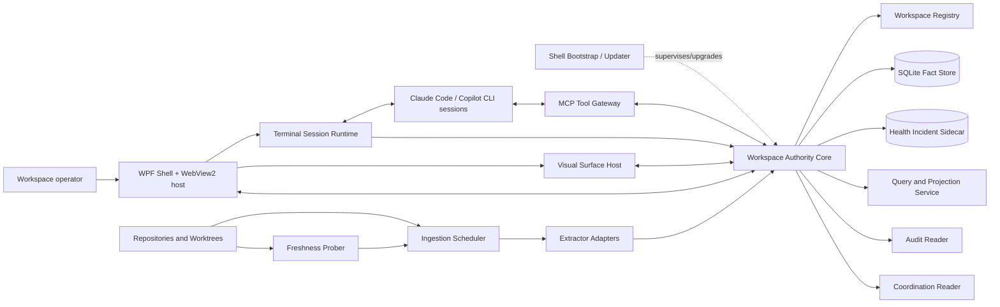
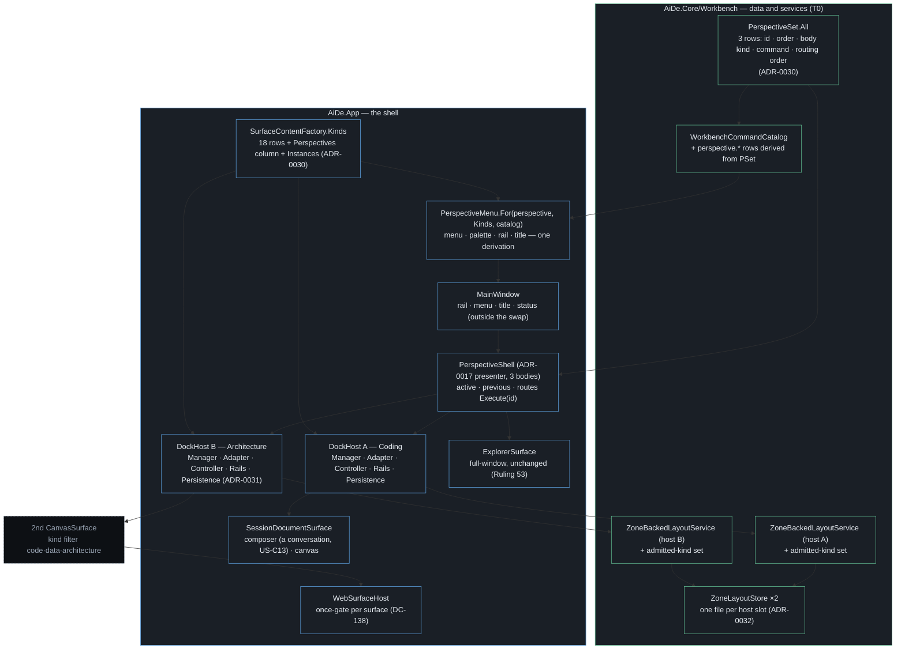

# Architecture: AI-DE

- **Status:** In review
- **Tier:** T2
- **Driving spec:** [`docs/specs/ai-native-ide.md`](specs/ai-native-ide.md)
- **Author(s) / date:** @timianmalloo · 2026-08-26 (v2) · amended 2026-09-11 (Addenda C and D, §Addenda C and D below)
- **Baseline:** `src/AiDe.App` is a .NET 10 WPF starter with no daemon, persistence, runtime AI,
  terminal, or extraction components. This architecture is the target shape; it does not claim the
  target is implemented.
- **Supersedes:** the 2026-08-25 architecture draft. This revision resolves the ten-persona
  adversary review of that draft ([`docs/notes/council-review-ai-ide-arch.md`](notes/council-review-ai-ide-arch.md)):
  the three hard vetoes (write-ahead dispatch receipt; committed spike evidence; US-4 verification
  path plus MCP egress governance), the two soft vetoes (release/rollback mechanism; Phase-1
  right-sizing), and the verified internal contradictions. Each change is traced to its finding in
  **Review resolution** below.

## Context and constraints

A developer directing several coding agents across worktrees must inspect architecture, domain/data,
process/dependency, knowledge, audit, prompt, and coordination evidence **without creating editable
models that compete with source artifacts** (spec Problem; US-1..US-8). The architecture makes the
repository the authority and every visual claim a labelled projection of attributable evidence.

| Constraint (spec source) | Architectural response |
|---|---|
| Derived facts must state provenance and confidence (US-1, US-2, domain AC). | Store immutable evidence assertions separately from derived relationship claims and views; every projection carries source revision, provenance, and a `Verified`/`Inferred`/`Unverified` label. |
| Coordination is advisory unless a resource accepts fencing (spec constraint 4, US-5). | Render claims as advisory evidence; no daemon operation treats a lease as exclusive authority. |
| Workspace and audit content may be sensitive; egress-deny by default (spec privacy, US-7). | One local authority core + one database per workspace; **MCP tool authorization is bound to the target session's declared processing class**; no automatic terminal capture or model-context attachment. |
| Graph and model context must be bounded (US-3). | Every query, view, and MCP tool returns a capped neighborhood with **node, edge, and byte** counts, omissions, and continuation — never a full graph. |
| Current WPF shell is a supported .NET 10 baseline (spec Part C). | Retain WPF as the shell frame; host visual surfaces in an embedded WebView2 and terminals in a renderer-independent runtime, both behind contracts (ADR-0008). |
| Kuzu is archived; no direct replacement meets the seed's criteria (spec constraint 3). | Relational fact store and query interface behind `IWorkspaceStore`, not a Kuzu/Cypher dependency (ADR-0002). |
| MCP 2026-07-28 is stateless; security is host responsibility (spec constraint 5). | Every request is self-contained; authority is server-derived from the connection and bound to workspace/session context; typed tools; no ambient identity (ADR-0004). |
| Single-user local desktop tool, Windows-first (spec NFR Compatibility). | Start simple: a Phase-1 **in-process** authority core, promoted to a separate daemon process only when the terminal runtime creates the first real need (ADR-0009). Fleet-scale release machinery is deferred to the phase that ships a second binary. |

### System shape

The boxes below are **logical roles**, not a process count. Phase 1 runs the authority core
in-process inside the shell; from Phase 2 the core runs as a separate per-workspace daemon (ADR-0009).
Every role keeps the same contract across that move, so the split is a deployment change, not a
redesign.

## Archetype and rationale

**Primary archetype: F — Copilot Aside Hot Path.** Repository indexing, storage, query, projection,
prompt staging, dispatch authorization, and rendering are deterministic (T0). An agent or model can
consume bounded context and propose annotations, but it cannot block the workspace hot path or make
artifact-derived truth. v1 ships **no model call at all** (M1, below), so F here describes the
*shape the hot path is built to*, and the AI-aside channel is dormant until the optional capability
contract is met — recorded so the fork is explicit, not aspirational. *(Superseded for the compile
step by Addenda C/D, 2026-09-11: the agentic compile is a live, gated model call — §C/D.7,
ADR-0035/0036 — behind the capability contract's conditions with condition 3 recorded as a
deviation, §C/D.11.)*

**Composed archetypes:**
- **C — Tool-Mediated Constructor:** the MCP gateway exposes declared, typed graph/knowledge
  operations instead of asking a model to generate API calls or code.
- **D — Grounded Synthesizer (bounded, optional, later):** the optional explanation capability is a
  *bounded* D instance over workspace-scoped evidence — retrieval + synthesis with a Grounded
  Context Injector — not global GraphRAG. Recorded here to keep spec and architecture aligned
  (spec allocates bounded D; the earlier draft rejected D on a GraphRAG strawman).
- **H — Long-Horizon Agent (external):** external coding sessions can be long-running; their state
  is Agent Operations / Coordination facts, not a held model context.

**Rejected:** **D as the *primary/global* shape** (GraphRAG global queries have high cost and weaker
privacy/determinism than bounded direct queries); **B — Adversarial Ensemble** (no model judges
architecture facts; deterministic evidence and human review are the authority); **A — Cascade
Pipeline** as the workspace shape (individual extractors may internally cascade; the workspace does
not require one).

## Capability-tier allocation

| Capability | Tier | Why this tier |
|---|---|---|
| Workspace membership, path validation, session binding, prompt dispatch receipt, coordination fold | T0 | Identity, authorization, and audit invariants; a model would make them less deterministic. |
| Extractor scope replacement, evidence ingestion, fact constraints, impact traversal, DSL generation | T0 | Compiler/parser/SQL behavior is authoritative and reproducible. |
| Visual layout, filtering, diagram rendering, accessibility alternatives | T0 | Renderer output must be testable and stable. |
| MCP tool schema validation, read/write authorization, **result truncation and byte-bounding** | T0 | Typed boundary, least-privilege, and context bounding are deterministic; a model never chooses what is omitted. |
| Optional local **reorder-only** ranking within a T0-selected, T0-truncated result set | T1/T2, later | Only after a measured need beats a deterministic baseline; never selects which evidence is dropped and never a source-of-truth path. |
| Optional agent explanation/synthesis (bounded D) | T3, opt-in | May explain bounded evidence; disclosed, cited, budgeted; cannot mutate artifact facts or dispatch prompts. |

This implements LOA P1–P5: deterministic work at the floor, cognition separated from execution, a
deterministic verifier behind every consequential operation. **The capability gate below governs any
capability above T0 — ranking included — not only "explanation."**

## Component map and boundaries

| Component | Responsibility | Owns | Boundary contract |
|---|---|---|---|
| **WPF Shell + WebView2 host** | Window frame, keyboard routing, user confirmation; hosts visual surfaces in an embedded WebView2 (ADR-0008) and the workbench in AvalonDock (ADR-0012). | No repository truth or agent authority. | Authenticated local control client to exactly one authority core; WebView2 receives only inert projection documents under a strict CSP. |
| **Workbench Layout Service** | Owns the layout tree (splits → dock stacks → surfaces), every layout *operation* as a command, named layouts, and persistence. **Owns the accessibility layer the docking library does not provide** (ADR-0012): a keyboard command for every drag-reachable operation including resize, `AutomationProperties` naming on panes, and an announcement per completed operation. | Layout state only — never repository truth. A layout is user preference and is rebuildable from its default. | `ILayoutService` command surface + a **versioned layout envelope** (ADR-0013); the library's serializer is an implementation detail behind it. |
| **Shell Bootstrap / Updater** | Owns installed binary layout, launches the authority core, performs upgrade preflight, and executes rollback; the actor that "keeps the previous binary." | Installed-version directories and the update channel. | Named in ADR-0009 and the release plan; from Phase 2 it supervises a separate daemon process and reaps orphans via a Windows Job Object. |
| **Terminal Session Runtime** | Owns ConPTY handles/streams and separate I/O service loops; parses advisory OSC state; exposes session generation/lifecycle. | Process handles and ephemeral terminal output. | `ITerminalSession`; a renderer never owns PTY lifecycle; terminal processes live in a Job Object killed on core exit. |
| **Visual Surface Host** | Renders graph/diagram/audit/work/prompt views and an equivalent accessible list/tree. | View-local selection and layout only. | Projection document + stable node IDs/provenance; all artifact strings are inert data. |
| **Workspace Authority Core** | Workspace-local authority boundary and orchestration root: registry, lifecycle, policy, one write pipeline. | Registry, store, policy, single writer. | In-process module (Phase 1) or OS-local authenticated IPC (Phase 2+), same command contract either way; all calls carry workspace, epoch, and server-derived caller context. |
| **Ingestion Scheduler** | Debounces file/event signals, schedules scope replacement, reports stale/failed state. | Job state only. | `ExtractionRequest(scope, artifactRevision, trigger)` and versioned results; two prioritized writer classes, control preempting ingestion. |
| **Freshness Prober** | Periodically compares each scope's repository-observed revision to its indexed revision to detect **silent watcher loss**. | Probe checkpoints. | Emits `scope.observed_revision` vs `scope.indexed_revision`; divergence raises a health incident and re-enqueues the scope. |
| **Extractor Adapter** | Reads one declared artifact scope; emits evidence assertions/snapshot. | No durable state. | Phase 1 in-process fixture adapter; a versioned process/JSON boundary is added only when an extractor needs language/runtime isolation. |
| **Workspace Fact Store** | Persists dimensions, append-only facts, transactionally derived current-state cache, export. | Workspace data only. | `IWorkspaceStore`; `recursive_triggers=ON` + no REPLACE/UPSERT on fact tables; read connections `query_only=1`; no renderer/agent bypass (ADR-0002, spike-verified). |
| **Query and Projection Service** | Bounded graph queries → C4, class, ER, sequence/activity, dependency, knowledge, work, audit projections. | Derived projections/caches. | Every result carries limits (node/edge/**byte**), returned/omitted counts, source revision, provenance, confidence. |
| **Audit and Coordination Readers** | Fold audited source records and per-session coordination logs into classified facts. | Reader checkpoint and classification state. | Versioned inputs; unsafe/unknown audit content fails closed; coordination fold orders **per-session writer sequence first, daemon ingress sequence only across sessions**. |
| **Health Incident Sidecar** | Durable, bounded incident channel **independent of the fact store**, so a store-unwritable failure is still recordable. | Incident ring with dedup + occurrence counts. | Fixed-size append file (not the workspace DB); dedup key `{class, scope}`; unacknowledged incidents evict last. |
| **MCP Tool Gateway** | Bounded read tools and narrowly-authorized knowledge/coordination writes to agents. | Tool authorization/audit receipt. | JSON-Schema tools; **authorization bound to the target session's processing class** (ADR-0011); no artifact-fact writes; results carry authorship origin; agent text is untrusted data. |

### Fact, extractor, and projection rules

1. **Immutability is a store control, not a wish.** Fact tables carry `BEFORE UPDATE`/`BEFORE DELETE`
   `RAISE(ABORT)` triggers; every writer connection sets `PRAGMA recursive_triggers=ON` (without it,
   `INSERT OR REPLACE` silently deletes a fact — spike S4) and **REPLACE/UPSERT conflict resolution
   is forbidden in the writer**; read connections set `PRAGMA query_only=1`. The real boundary is the
   single-writer core process; triggers/pragmas are defense-in-depth (spike `sqlite-fact-store` S3–S6).
2. The scheduler transactionally assigns a monotonically increasing **desired generation** and
   authoritative artifact revision to every scope before enqueue. A worker commits only when its
   generation **and** observed revision equal the durable desired pair; the same transaction records
   a `ScopeSnapshotCompleted` fact (assertion count/hash/completeness), the committed pair, the
   assertions, and projection-cache invalidation. Current evidence derives only from the latest
   complete snapshot. A late/older/incomplete extractor is rejected or retained as diagnostics, never
   allowed to remove prior evidence. Core recovery re-scans each desired scope; the Freshness Prober
   catches missed watcher events **between** recoveries, not only at startup.
3. `EvidenceAssertion` is the fact grain. A claim needs one or more assertions; no assertion is
   `not recorded`, never a speculative edge.
4. C# symbol IDs use Roslyn documentation-comment IDs when a semantic extractor is selected. Bounded
   contexts are declared by a human/configuration, not inferred from namespaces.
5. Static DI, routes, and ORM approximations are `Inferred`; runtime traces are `Observed`; neither
   becomes `Verified` because a visualization renders.
6. Generated diagram DSL is committed/reviewable; rendered image output is not committed until
   renderer byte determinism is separately established.

### Command, concurrency, and delivery protocol

Every mutating command is a versioned envelope: `{protocolVersion, workspaceId, workspaceEpoch,
callerId, commandType, commandId, dispatchKey?, deadline, cancellation, traceparent, payload}`.
**`callerId` is a stable principal** — the workspace-owner shell identity or an enrolled MCP client
identity — server-derived from the authenticated connection, **invariant across connections and core
epochs**, and never taken from the payload or from a connection-scoped value (this closes the receipt
dedup gap across a crash/reconnect). In-process (Phase 1) the caller is the shell identity directly;
over IPC (Phase 2+) the core owns a named-pipe endpoint restricted to the workspace-owner SID and
issues a capability bound to `{connection, shell process, workspace, epoch}`, validated and revoked
per command. The core validates epoch and caller, then atomically records a command receipt keyed by
`{workspace, callerPrincipal, commandType, commandId}`. A timeout/retry reads that receipt first; it
never repeats a completed mutation. **`dispatchKey` for a prompt transfer is derived deterministically
from `commandId`**, so the two are one idempotency namespace, and MCP "exactly-once" is stated
precisely as *idempotent per client-supplied `commandId`*, with same-key-on-retry documented as the
client's obligation in the tool schema.

The **core epoch** is a store-persisted monotonic integer, incremented inside the ownership-lock
acquisition transaction on startup (never random or wall-clock derived, so "stale" is decidable and
ABA-free). A shell reconnects only after reading the current epoch; a stale core or stale client
command is rejected.

**Writer scheduling (one SQLite writer).** Two work classes share one prioritized writer loop:

| Class | Capacity | Admission and overload |
|---|---:|---|
| Control: lifecycle, receipts, user-confirmed dispatch, authorization | bounded channel | Never dropped. The control path **waits**; it is not an error surface in v1. Control transactions preempt *between* ingestion transactions. |
| Ingestion: file/event-triggered scope extraction | 256 | Coalesces same-scope work to newest desired generation; superseded work becomes a visible stale/pending state; **snapshot commits are chunked to a stated maximum transaction duration** so a large snapshot cannot priority-invert a pending dispatch receipt. |
| Read projection | not queued behind writes | Executes against a snapshot with deadline and bounded result; cancellation returns explicit partial/limit state. |

**Prompt delivery is a write-ahead two-phase receipt** (the core correctness change this revision
makes — ADR-0010). Terminal-stream transfer remains **at-most-once with outcome possibly unknown**;
it is not exactly-once, because a terminal cannot atomically acknowledge a write and persist a core
receipt. The sequence is normative:

1. Revalidate the binding `{workspace epoch, draft revision, session ID, session generation,
   dispatchKey}`.
2. **Commit a `Pending` delivery receipt for the dispatch key, before any PTY byte is written.**
3. On the session's single owner (the runtime's per-session serialized loop), compare the bound
   generation to the live generation **atomically with the write** against the generation-specific
   PTY handle; a mismatch finalizes `Rejected` and writes no byte (closes the revalidation→write
   TOCTOU).
4. Finalize the outcome (`PtyWriteAccepted` / `Rejected` / `TimedOut` / `Failed`) as an appended
   event on the dispatch key.
5. **Core recovery sweeps any receipt left `Pending` to `DeliveryUnknown`.** A retry that reads any
   existing receipt — `Pending` included — returns it and never re-executes. `DeliveryUnknown` blocks
   automatic resend and requires a human-confirmed new dispatch command.

The delivery receipt is therefore an **append-only event series per dispatch key** with a
deterministic fold to the displayed outcome; a late authenticated `AgentAccepted` (only where a
supported adapter exists — ADR-0007) appends without rewriting a prior "immutable" row. MCP annotation
writes are idempotent per `commandId`. The **coordination fold** orders per-session writer sequence
first (intra-session causality — a release cannot fold before its claim) and daemon ingress sequence
only to totalize across sessions; wall-clock is display metadata. Concurrent/expired/stale/contradictory
claims remain visible states and never fold silently to `Done`, and a `Done` assessment additionally
**requires corroborating non-claim evidence** (an artifact-revision change or receipt), never a single
uncontradicted agent claim alone.

Phase-2 terminal adapter exposes only `TerminalReady` and `PtyWriteAccepted`; OSC state is advisory
and never agent acceptance. `AgentAccepted` arrives only through an authenticated, versioned agent-side
acknowledgement contract (ADR-0007). The v1 fallback is truthful terminal paste.

**Version compatibility is phase-appropriate.** In Phase 1 the core is in-process and co-deployed:
shell↔core calls **fail fast on exact-version mismatch** — no negotiation protocol for a boundary
that cannot span versions. Persisted store/export schemas still carry a version and migrate
expand→migrate→move-reads→contract. The **dual-major IPC handshake, the previous-binary rollback
orchestrator, and the upgrade health gate are introduced in Phase 2**, when a separate daemon binary
first makes cross-version pairing real; they are specified in the release plan and proven by
`P2-UPGRADE-01` (not fabricated against a nonexistent prior version in Phase 1).

## Durable representation

**Decision (ADR-0002):** one integrated operational SQLite store per workspace — dimensions for
stable entities, append-only facts for change over time. A property-graph DB and Cypher are not
required. The full grain, key, ordering, history-rule, immutability, migration, and deletion contract
is the [conceptual model](design/conceptual-model.md); the load-bearing points here:

| Shape | Grain and history rule |
|---|---|
| Dimensions (Workspace, Repository, Worktree, Artifact, Node, Session, Agent, Tool, View) | One current versioned descriptor per identity; a new version only when a change alters the meaning of past facts. History rule is declared **per attribute** (Type-0/1/2) in the Phase-1 schema, not per table. |
| `EvidenceAssertion` fact | One extractor/observer assertion about one normalized relation at one source revision/observation time; append-only, uniqueness prevents duplicate replay. |
| `ClaimAssessment` fact | One relationship-claim assessment from a named assertion set at one ingress sequence; append-only, rebuildable, labelled cache-equivalent (rebuild-equality tested). |
| `DispatchAttempt` / `DispatchOutcome` facts | The dispatch receipt is **two event grains** — one attempt (the `Pending` write-ahead) and one or more outcomes — folded deterministically per dispatch key; this is what makes at-most-once truthful. |
| `CoordinationClaim`, `WorkStateAssessment` facts | One advisory claim or assessment at one recorded instant; append-only, never a lock. |
| `PromptRevision`, `AuditReference`, `TraceObservation` facts | One immutable revision, classified audit reference, or trace observation at one recorded instant. |

Version intervals on dimensions are defined in **ingress-sequence terms**, and the ingester's as-of
lookup uses the assertion's event time only to select the version whose ingress interval contains it —
one deterministic function, so a backdated trace binds to the correct version instead of being
rejected. The current graph is a deterministic, indexed projection; latest-per-key indexes and
materialized summaries are labelled, rebuildable caches. SQLite's single-writer characteristic is
handled by the core's prioritized writer loop; reads use snapshot transactions.

## Contracts at seams (sourced)

Every **Verified** row cites a committed, re-runnable spike under [`spikes/`](../spikes/) with its
captured `RESULT.md` (this is the review condition that a Verified label must rest on inspectable
evidence).

| Seam / dependency | Contract relied on | Evidence | Confidence |
|---|---|---|---|
| SQLite provider | `Microsoft.Data.Sqlite` 10.0.11: WAL, unique-constraint rejection, recursive CTE, no nested transactions; **`INSERT OR REPLACE` bypasses immutability triggers unless `recursive_triggers=ON`; `query_only` rejects writes.** | `spikes/sqlite-fact-store` — 8 cases PASS, 2026-08-26 (S1–S8). | Verified (cases only; 50k-edge scale is P1-PERF, Inferred until run) |
| MCP SDK (stdio) | `ModelContextProtocol` 2.2.0 registers typed tools; stdio initialize negotiates protocol 2026-07-28; valid call succeeds; invalid call returns in-protocol `isError`. | `spikes/mcp-server -- client` — M1–M4 PASS, 2026-08-26. | Verified |
| MCP HTTP security | AspNetCore HTTP transport **accepts hostile `Origin` with HTTP 200 by default.** | `spikes/mcp-server -- http` — H1 CONFIRMED, 2026-08-26. | Verified — HTTP disabled in v1; explicit guard is a code-level precondition with a red-first test before any HTTP phase |
| ConPTY | `CreatePseudoConsole`/`Resize`/`Close` available; create→resize→close lifecycle HRESULT 0. | `spikes/conpty-foundation` — C1–C3 PASS, 2026-08-26. | Verified for availability/lifecycle; I/O-loop separation is a documented contract exercised in Phase 2 |
| Shell host | WPF frame + embedded WebView2 for visual surfaces; renderer-independent terminal runtime. | ADR-0008; WebView2/airspace and terminal-control risk documented in shell knowledge. | Inferred — WebView2 airspace/perf/a11y and graph-renderer selection are Phase-2 prototype spikes |
| Extractor protocol | Phase-1 in-process adapter returns deterministic scope/assertion identities and diagnostics. | Project knowledge; schema owned by this architecture. | Inferred until `P1-EXT` contract tests |

## Cross-cutting concerns

### Identity and trust boundaries
- The shell runs as the local signed-in workspace owner. Registration canonicalizes path/file
  identity and revalidates containment (by handle) before every privileged use.
- The authority core is workspace-scoped; no request crosses a workspace without explicit user-owned
  registration and policy approval.
- Terminal output, repository content, graph values, audit text, diagram labels, and MCP results are
  **untrusted data — inbound and outbound.** They never become instructions, active markup, or
  automatic tool calls in AI-DE's own surfaces, and AI-DE emits repo-derived strings to agents **only
  in typed data fields, never blended free-text**, and cannot bind agent behavior. A Phase-1 negative
  seeds hostile symbol labels through `describe`/`find` and asserts inert structured arrival.
- Prompt delivery binds `{workspace epoch, draft revision, session ID, session generation, dispatch
  key}`, revalidates, and writes under the session-owner lock (above). Dispatch-command receipts are
  idempotent; terminal-byte delivery is at-most-once; `DeliveryUnknown` requires a new human-confirmed
  key.
- **MCP authorization is bound to the target session's declared processing class** (ADR-0011). A
  `LocalOnly` session receives bounded results; an `ExternalProcessing`/`UnknownProcessing` session is
  denied rich reads/writes or served minimum metadata only — from **Phase 1**, as a T0 gateway rule,
  because `describe` ships in Phase 1 and an externally-processing agent would otherwise forward
  workspace facts to its provider. **WITHDRAWN by ADR-0022 (2026-09-04):** the agent holds a
  terminal in that workspace and can read the same files directly, so the gate constrained the
  polite interface while the impolite one stood open. `P1-MCP-EGRESS` is retired and replaced by
  a test asserting the gate is gone, so re-adding one is deliberate.
- MCP read tools require workspace context and return bounded data with authorship origin. Write tools
  create only user/agent-attributed `Decision`, `Note`, `Term`, or advisory coordination records after
  deterministic authorization; artifact-derived facts remain extractor-owned.
- Streamable HTTP, if enabled after v1, binds only to loopback, validates an explicit Origin/Host
  allowlist as a **code-level precondition** owned by the core (a default-deny policy fact requiring
  user confirmation, surviving upgrade), and is denied until the host-identity/caller test passes.
- The [threat model](security/ai-native-ide-threat-model.md) defines the pipe ACL/capability/epoch
  protocol, handle-based path validation, inert terminal/render policies, the write-ahead receipt
  integrity chain, per-tool authorization matrix, and supply-chain gate — architecture constraints,
  each with a red-first negative in the proof plan.

### Failure and resilience
- The ingestion scheduler treats watcher overflow, parser failure, partial load, and tool
  unavailability as explicit stale/failed facts; it never reports an empty graph as clean.
- **Silent watcher loss** is caught by the Freshness Prober comparing repository-observed to indexed
  revision, not by the daemon's own last-event view (which would read fresh while the graph rots).
- **Daemon crash does not orphan agents.** Terminal processes live in a Windows **Job Object** with
  kill-on-close tied to core lifetime; the Shell Bootstrap is the crash-detection/restart owner and
  raises `aide.core.restart`. On restart the core scans for orphaned handles.
- The in-process **extractor timeout** is enforced by a cooperative-cancellation contract now, with
  process isolation as the escalation path; a per-scope failure-count **breaker** quarantines a
  pathological scope after K timeouts (so two wedged workers cannot silently halt all ingestion), and
  `ingestion.workers.busy_duration` raises an incident when a worker exceeds N× its budget.
- Read projections degrade to the last successful revision with source age and failure reason.
- An agent/model outage never blocks a terminal, source query, graph update, or dispatch receipt.

### Observability
- W3C `traceparent`/`tracestate` propagates through every command, extractor-process JSON, and any
  enabled loopback MCP HTTP; structured logs inside each span carry trace/span IDs. The core emits
  spans `aide.workspace.command`, `aide.ingestion.scope`, `aide.store.transaction`,
  `aide.projection.query`, `aide.terminal.session`, `aide.mcp.request`, `aide.freshness.probe`.
- Required attributes are pseudonymous `workspace.id`, `core.epoch`, `command.id`, `scope.id`,
  `artifact.revision`, `schema.version`, `outcome`, `error.code`, duration, requested/returned/omitted
  node/edge/**byte** counts. Paths, prompts, source/terminal text, credentials, and personal/work
  identifiers are prohibited. **Pseudonymous IDs rotate per core epoch** (the spec's rotating-opaque-ID
  requirement); a stable ID is used only where a recorded accepted-risk rationale exists.
- SLIs are **event-pair histograms**, not point gauges: per-command queue age at dequeue; scope
  **settlement** = first triggering event → committed snapshot for the *final* generation (superseded
  chains attributed to the surviving generation's start), so coalescing cannot censor slow scopes.
  Required metrics: queue depth/oldest age, extraction duration/failure, worker busy-duration, store
  transaction latency/lock retry, projection duration/stale age, database/WAL bytes + checkpoint lag,
  PTY output/dropped bytes, active handles/processes, MCP outcome, migration/schema version, freshness
  drift. Telemetry-sink failure is non-blocking and increments `telemetry.not_recorded`; it never
  fabricates a value.
- **Telemetry storage is simple** (right-sized for one local operator): a size-capped rolling
  structured log plus the named metrics, local-only, no remote exporter in v1. **Health incidents are
  facts of record and live in the Health Incident Sidecar**, a fixed-size append channel independent
  of the fact store — so a disk-full/read-only store, the very failure that must be recorded, does not
  make its own incident unwritable. Incidents dedup on `{class, scope}` with occurrence counts and an
  explicit cap; unacknowledged incidents evict last.
- The operator's **3-a.m. questions** are answered by the workspace health view: which scope is stale
  (against the repo, via freshness drift), which extractor failed or is quarantined, what revision is
  rendered, whether the session is disconnected, whether a prompt was acknowledged, **and the core's
  own health** — daemon mode (normal/read-only/write-paused/rebuilding), last-upgrade outcome, watcher
  liveness, checkpoint lag, and whether telemetry itself is dropping.

### Data governance and privacy
The [privacy review](security/ai-native-ide-privacy-review.md) is binding: local-first processing,
field-level classification, category retention/deletion, audit classification, no automatic terminal
capture, local-only telemetry. **Egress is deny-by-default and enforced, not promised:** no model
provider is called, and a dependency/SBOM gate **forbids remote-exporter packages** with a
network-egress probe test — so a later dependency cannot silently add an OTLP exporter. Rich context
transfer is supported only to `LocalOnly` sessions; MCP results to non-`LocalOnly` sessions are denied
or minimized at the gateway (ADR-0011). **Retention has one definition per category** (the privacy
review's finite ceilings; the spec's "until explicit deletion" for prompt drafts is superseded to the
90/365-day ceiling). **Deletion respects immutability**: expiry/erasure runs as administrative
rebuild-and-swap compaction (never ad-hoc deletes through the triggers), and **deletion receipts
enumerate surviving DPAPI snapshot generations and their purge-by date** rather than claiming an
instant completeness they cannot have; snapshot restore replays the deletion/expiry ledger before
serving reads, so a rollback cannot resurrect deleted drafts. Agent/user-authored `Decision`/`Note`/
`Term` records carry an inventory row, classification default, retention ceiling, and deletion path.
**User-scoped DPAPI snapshots are undecryptable after profile loss**; that recovery boundary is stated
in the release plan, and non-rebuildable prompts/layouts have a **user-passphrase-wrapped export path**
(the spec's Portability requirement) so irreplaceable knowledge survives a machine rebuild.

### Optional model capability contract
The initial commercial model is **M1 — user-owned external agent/provider account**: AI-DE stores no
provider credential and makes no direct model call. **Any capability above T0 — a local reorder-only
ranker (T1/T2) or an explanation synthesizer (T3) — requires a new ADR and all of:**

1. a versioned prompt/instruction and typed response schema, where the schema **structurally pairs
   each claim element with required `assertionIds[]`** (coverage is schema-enforced, not detected) and
   every ID must resolve in the supplied context;
2. deterministic ID-resolution verification **plus a named A5 faithfulness eval** for claim-entailment
   (deterministic ID membership cannot prove a citation actually supports its sentence);
3. pinned model/provider version, input/output/token receipt, acting principal, quota, data-governance
   posture;
4. a deterministic baseline the capability must measurably beat on the approved query set at a stated
   cost/latency threshold — and, for a ranker, **reorder-only within a T0-selected, T0-truncated set**
   with a ranker-version + score receipt per result (a probabilistic component never chooses what is
   omitted);
5. A4/A5 golden/rubric evaluations **and** A6 prompt/schema/model-version regression gates.

MCP tool schemas are versioned and server-enforced, with **uniform node/edge/byte bounding on every
read tool** and authorship origin on every result:

| Tool | Maximum request/result and required fields |
|---|---|
| `find` | `{workspaceId, term, types?, cursor?, maxResults:1..50}` → matches (with authorship origin), next cursor, omitted count, byte cap + byte-omission state, source revision. |
| `describe` | `{workspaceId, nodeId, maxNeighbors:1..50}` → one node, ≤50 neighbors/≤100 edges/**≤64 KiB with per-label caps**, provenance, confidence, stable error code. |
| `impact` | `{workspaceId, nodeId, maxNodes:1..200, maxEdges:1..500, cursor?}` → graph fragment, node/edge/**byte** limits, returned/omitted counts, continuation. |
| `architecture` | `{workspaceId, scopeId, maxNodes:1..100}` → projection DSL, **byte cap**, source revision, omissions. |
| `record_note`, `record_decision`, `announce_claim` | Caller-bound workspace/session, typed payload, `commandId`, ≤64 KiB; policy validation and actor attribution; decisions/consequential classes require user confirmation. |

The **tool descriptions are the only prompt surface v1 ships** *(superseded for the compile step
by Addenda C/D: `compile-prompt/1` is a second prompt surface, host-embedded, hashed as
`prompt_sha`, and gated by ADR-0036's A6 ring — §C/D.5)*; they carry an **A2 semantic
tool-selection eval against at least one real client model** and an **A6 regression gate** on any
description/schema edit — not only protocol conformance.

## Load-bearing decisions → ADRs

- [ADR-0001](adr/0001-derived-evidence-views.md): code-derived views are authoritative only as
  projections.
- [ADR-0002](adr/0002-workspace-fact-store.md): SQLite dimensions + append-only facts are the durable
  representation.
- [ADR-0003](adr/0003-workspace-daemon-boundary.md): one local authority owns one workspace's
  authority, writer pipeline, and store. *(Refined by ADR-0009 for phasing.)*
- [ADR-0004](adr/0004-mcp-tool-boundary.md): typed, bounded MCP tools; no ambient authority or fact
  writes. *(Refined by ADR-0011 for egress.)*
- [ADR-0005](adr/0005-terminal-runtime-boundary.md): ConPTY lifecycle belongs to a renderer-independent
  runtime.
- [ADR-0006](adr/0006-terminal-delivery-semantics.md): terminal prompt transfer is at-most-once, never
  auto-retried after unknown outcome. *(Refined by ADR-0010 for the write-ahead mechanism.)*
- [ADR-0007](adr/0007-agent-session-adapter.md): v1 supports terminal readiness/paste only; agent
  acceptance needs a future authenticated adapter.
- [ADR-0008](adr/0008-shell-host.md): **WPF frame + embedded WebView2** for visual surfaces; the shell
  host is a recorded decision with the Phase-2 renderer spike as its reversal trigger.
- [ADR-0009](adr/0009-in-process-first-daemon.md): the authority core runs **in-process in Phase 1**
  and splits to a separate daemon process at Phase 2 when the terminal runtime needs it; the Shell
  Bootstrap owns the process/upgrade lifecycle.
- [ADR-0010](adr/0010-two-phase-dispatch-receipt.md): a **write-ahead `Pending` receipt precedes the
  PTY write** and a recovery sweep resolves it to `DeliveryUnknown`, making at-most-once truthful
  across a crash.
- [ADR-0011](adr/0011-session-processing-class-egress.md): **MCP tool authorization is bound to the
  target session's declared processing class from Phase 1**, closing the agent-provider egress path.
- [ADR-0012](adr/0012-docking-shell-library.md): **AvalonDock for the workbench shell, with an owned
  accessibility layer** — the library supplies docking and serialization; we supply the keyboard
  commands and announcements it does not have.
- [ADR-0013](adr/0013-layout-persistence-envelope.md): **the workbench layout is persisted inside our
  own versioned envelope**, outside the workspace fact store, and degrades to the default arrangement
  rather than to a broken window.
- [ADR-0017](adr/0017-primary-view-mode.md): **a full-window surface is a primary *view mode*** the
  shell holds (Workbench | Explorer), realised as a **body-content swap** of the docking-host region
  with the rail as the mode selector — not a dock pane and not a modal overlay; the non-active mode's
  state is retained, never rebuilt. *(Amends ADR-0013 with a per-mode persistence slot and ADR-0015
  with the graph↔reader keyboard-cycle contract.)*
- [ADR-0018](adr/0018-node-content-reader-contract.md): **the Explorer reader fetches a node's content
  on demand via a bounded Core query** (a sibling of `OverviewAsync`), not by fattening the graph
  payload — content is paid for only for the selected node and is transport-bounded like every other
  query.
- [ADR-0025](adr/0025-code-viewer-renderer.md): **the read-only code viewer renders with native
  AvalonEdit (MIT), not Monaco-in-WebView2** — the deciding factor is the repo's own documented
  WebView2 airspace/float-crash cost (ADR-0015); a read-only viewer does not need Monaco's VS-Code
  parity, so it should not pay a second WebView2's cost. Markdown via Markdig; rich content reuses the
  one existing canvas WebView2.
- [ADR-0026](adr/0026-class-diagram-architecture.md): **the class diagram is an App-side type-hierarchy
  view derived from the existing graph** (classes/interfaces + `inherits`→generalization,
  `implements`→realization), dependency-free and Core-ungated for Phase 1; **members and a
  notation-valid Mermaid `classDiagram` render defer to Phase 2**, gated on a Core `has_member`
  extractor enhancement (a Mermaid classDiagram with empty compartments is not worth vendoring ~3 MB
  of mermaid.js).
- [ADR-0017 — amended 2026-09-11](adr/0017-primary-view-mode.md) (Ruling 52): the closed set is the
  **Perspective** set (Coding · Explore · Architecture); a body may be a docking host; the second-host
  clause discharged by `spikes/second-dock-host-unparent`. [ADR-0013](adr/0013-layout-persistence-envelope.md)
  amended in the same change: one slot per host perspective.
- [ADR-0030](adr/0030-perspective-registry-and-allow-lists.md): **the Perspective set is a closed Core
  row set; the allow-list is a column on the App's kind rows; menu, palette, rail and routing are
  derived from the join** — never a second list.
- [ADR-0031](adr/0031-second-docking-host.md): **Architecture's body is a second AvalonDock host
  composed as a `DockHost` unit under one presenter** — one controller per host, one catalog, one
  factory (the Owner's residual decided).
- [ADR-0032](adr/0032-perspective-layout-slots.md): **one zone-envelope file per host perspective**
  in the existing schema; drop-with-report at restore; a one-time `.bak`; rollback is a golden
  round-trip.
- [ADR-0033](adr/0033-prompt-compilation-bounded-context.md): **Prompt Compilation is a bounded
  context in `AiDe.Core/Compilation` with one seam and one projection** — `Project()` is the sole
  assembler at the composer's unchanged send site; budget is an optional cap projected onto the
  unchanged `RunBudget`; the default task class is `free-form`.
- [ADR-0034](adr/0034-envelope-event-store.md): **the compiled-envelope store is an append-only,
  exclusively written, sha-chained JSONL sidecar per session**; the eval corpus and the Proof Pack are
  projections; purge deletes the file; the Session's delete cascades by containment.
- [ADR-0035](adr/0035-compile-session-binding-and-pin.md): **the agentic compile is one pinned ACP
  session on the session's bound engine, composed by `CompileCallHost` apart from the run root** —
  `tools: []` through Ruling 71's typed argument; `compile-call.compose`, never
  `governed-run.compose`.
- [ADR-0036](adr/0036-compile-mode-ladder-deployment-gates.md): **the compile-mode ladder is a set
  of runtime deployment gates behind an eval** — the pin artifact with a matching adapter sha, then
  the 50/50 holdout report meeting fixed floors; the A6 ring; the drift detector.
- [ADR-0037](adr/0037-family-craft-profile-dimension.md): **the family craft profile is a Type-2
  dimension — one immutable pack-owned file per version**, pinned by `(family, version, sha)`,
  applied as a template in v1.

## Delivery phasing — vertical slices

Each phase is a thin end-to-end path, deployable and test-validated, with mocked seams defined as
contracts. **Phase 1 runs the authority core in-process** (ADR-0009) — the walking skeleton proves
the composition without a second process, transport auth protocol, or upgrade machinery that nothing
yet needs.

| Phase | End-to-end capability it proves | Real | Mocked / stubbed seam | Human validation | E2E validation | Unblocks |
|---|---|---|---|---|---|---|
| 1 — walking skeleton | Open a workspace with a fixture repo; inspect one source relationship with provenance and a bounded impact result; **navigate one knowledge node**; stage and dispatch a prompt against a fixture session and observe a truthful receipt. | WPF+WebView2 shell, **in-process authority core**, SQLite fact store, in-process fixture extractor, query/projection API, **knowledge projection**, accessible list/provenance pane, MCP `describe`/`find` read tools over **stdio**, write-ahead dispatch receipt, health-incident sidecar, freshness prober. | Separate daemon process + IPC, real terminal/session runtime (fixture session only), browser graph canvas, Roslyn/Bicep/DDL extractors. | Open fixture, select `Order`, see source/revision/confidence + capped impact; open a knowledge node and see its links/health; stage a prompt, dispatch to the fixture session, see `PtyWriteAccepted`, then simulate a crash-before-finalize and see `DeliveryUnknown`. | Fixture extraction → SQLite facts → query/projection → shell; **knowledge fixture (P1-KNOW)**; MCP valid/invalid + **egress-denial (P1-MCP-EGRESS)** + **hostile-label inertness (P1-MCP-INERT)**; fact immutability incl. `INSERT OR REPLACE`/`recursive_triggers`; **write-ahead receipt crash-injection (P1-DISPATCH)**; stale-generation/revision, complete-snapshot, replay equality, command-receipt, local authorization, `P1-EXT` extractor contract, threat-model negatives. | Boundary contracts, fact schema, health states, authorization, MCP egress. |
| **1b — workbench shell** | Arrange the workbench: resize, dock, float, collapse, maximize, stack surfaces as tabs, save and switch a named layout, and do every one of those from the keyboard with an announcement. Phase-1's evidence surfaces become *surfaces inside stacks* rather than fixed grid cells. | AvalonDock host (ADR-0012), layout tree/stack/surface model, the **layout command set incl. `ResizePane`**, `AutomationProperties` naming, announcement channel, named layouts, versioned layout envelope (ADR-0013), partial-restore and unreadable-layout recovery. | Real terminal runtime (fixture session still), Roslyn/Bicep/DDL extractors, browser graph canvas — unchanged from Phase 1. | Open the fixture workspace; split the Explore pane; drag Provenance to the bottom and watch the drop target before releasing; float the terminal; **unplug the mouse** and repeat every one of those with the keyboard; save the arrangement as "Investigate"; restart and see it return; delete a surface from the layout file and see the partial-restore report name it. | Layout-tree invariant after a scripted operation sequence (no gap, no overlap, no empty stack); **keyboard path and drag path produce an identical resulting tree** (SC 2.5.7); announcement emitted per operation without focus movement (SC 4.1.3); focus lands unobscured after move/float/collapse (SC 2.4.11); envelope round-trip incl. mutated and unreadable files; minimum-size refusal; locked-layout refusal. | Every later phase's surfaces — each new view is a surface in a stack, not a new grid cell. |
| 2 — real code, terminal, and process split | Inspect a real C# solution; operate one real terminal beside a derived class/dependency view; **run the core as a separate daemon with upgrade/rollback**. | Roslyn semantic extractor (after source-generator/scip spike); ConPTY runtime + Job Object; OSC parser; terminal renderer (by spike); **separate daemon process, IPC auth protocol, Shell Bootstrap upgrade/rollback + dual-major handshake**. | Bicep/DDL, audit reader, trace import. | Select a source type, launch `pwsh`, observe real session state without terminal text entering the graph; perform an upgrade and an injected-failure rollback. | Real solution fixture, broken-build/partial-load state, ConPTY lifecycle + orphan-reap, renderer keyboard/a11y contract, **P2-UPGRADE-01 (previous→current binary, injected health-gate failure, rollback + projection-equality oracle)**. | C#/session value, renderer decision, release path. |
| 3 — architecture/data/infra joins | Navigate C4, ERM, domain, and dependency projections across C#, DDL, and Bicep evidence. | Bicep JSON-RPC/build adapter; DDL parser; declared bounded-context config; curation policy. | Runtime trace, remote agent processing. | Inspect a declared aggregate, its tables, and a deployed resource with confidence labels. | Scope replacement/idempotency, inferred-vs-verified joins, generated DSL snapshot, no hand-edit persistence. | Cross-artifact visual moat. |
| 4 — coordination, audit, prompt staging at scale | See workboard/audit evidence and stage prompts for classified sessions across worktrees. | Coordination reader, privacy-classified audit reader, prompt revision/receipt across real sessions, local-only transfer. | External-processing transfer, deep agent hooks. | Filter by worktree, inspect advisory claim, stage/confirm a prompt, see its receipt and fold precedence. | Stale/conflict fold + **per-session-first ordering**, redacted audit fixture, dispatch idempotency/generation change, deletion/export incl. snapshot-ledger replay. | Safe multi-agent workflow. |
| 5 — observed flow and bounded local-agent integration | Compare static and runtime flow; use bounded local-agent tools without provider-context injection. | Named trace ingestion, sequence projection, configured MCP transport, local-only policy gate. | External-processing rich transfer. | Select scenario, compare observed/static edges, inspect bounded tool provenance. | Trace origin distinction, Origin/caller authorization (incl. the HTTP guard's red-first test), local-only policy, privacy/security negatives. | Complete v1 scope. |

### Phase-1 proof plan

| Test ID | Fixture / attack | Oracle |
|---|---|---|
| P1-SEC-01..05 | Unauthorized caller, wrong/revoked authorization, stale core epoch, replayed command, cross-workspace command. | Stable denial code; no receipt/fact mutation. |
| P1-FS-01..03 | Path alias, reparse/junction swap, TOCTOU replacement. | Handle-identity containment failure; no extraction runs. |
| P1-STORE-01..11 | Fact update/delete, **`INSERT OR REPLACE` with `recursive_triggers` on/off**, FK violation, interval containment (incl. backdated event time), duplicate assertion, stale scope revision, concurrent writer, cache replay equality, migration down, backup/restore. | Database rejects forbidden state; latest-complete-snapshot/projection equality; restoration report. |
| P1-DISPATCH-01..04 | Stage→dispatch happy path; **crash after PTY write before finalize**; crash after `Pending` before PTY write; retry after each crash; generation change between revalidate and write. | Recovery sweep yields `DeliveryUnknown` not `NotRecorded`; retry returns the existing receipt and never re-sends; generation mismatch finalizes `Rejected` with no byte written. |
| P1-KNOW-01..03 | Knowledge/frontmatter fixture: search, type/repo/confidence filter, bounded-neighbor expansion, backlinks, source location, missing-source health finding. | Expected search/filter/neighborhood + required health fields (the spec US-4 oracle). |
| P1-QUEUE-01..03 | Control saturation (waits, not error), ingestion burst, cancellation/deadline. | Documented wait/coalescing/stale state and queue metric/trace. |
| P1-MCP-01..05 | Unsupported version, malformed schema, limit/**byte** overflow, cross-workspace read, invalid/valid call. | Stable protocol/operational error or bounded response with provenance/omission/byte state. |
| ~~P1-MCP-EGRESS-01..03~~ | **Retired by ADR-0022.** Replaced by `McpRead_IsNotReducedByProcessingClass`, which asserts the gate is absent for every class. | The retirement is the assertion: a security test deleted without a replacement reads as an oversight. |
| P1-MCP-INERT-01..02 | Hostile symbol labels/provenance seeded through the extractor and returned via `describe`/`find`. | Arrive as inert typed data; no instruction-following; no active markup. |
| P1-EXT-01..03 | In-process extractor: deterministic scope/assertion identity, duplicate-assertion emission, diagnostics. | Contract-conformant identities and stale/failed diagnostics. |
| P1-UI-01..04 | Empty/loading/stale/error provenance pane; keyboard path; focus restoration; accessible list equivalence, **diffed against an expected focus-order/name-role-value sequence** (a trace that cannot fail is not an oracle). | Automated state fixture + keyboard/screen-reader assertion vs expected sequence. |
| P1-STORE-DEL-01 | Workspace/user deletion with retained facts, caches, exports, WAL/snapshots, later command; per-category expiry; **snapshot-ledger replay after restore**. | Purge report, parent-ledger deletion receipt enumerating surviving snapshots, no post-delete command, no resurrected data after restore. |
| P1-PERF-01..05 | Approved 10,000-assertion/50,000-edge corpus, warm/cold 30-sample runs, forced query-plan regression, refresh failure; 32 producers/100 scopes/200 events/s/60s with settlement histograms; **restore/replay wall-clock vs 15-min RTO**. | p50/p95/p99 report, no-full-scan plan, stale-last-successful on failure, settlement p95/p99 with no censored scopes, measured restore duration. |
| P1-PRIV-01..03 | Seeded secret/PII in extractor, audit metadata, trace, coordination fixtures; **network-egress probe**. | Graph/UI/receipt/log/trace/metric allowlists contain no seed; unknown classification denies persistence/export/attachment; no outbound network connection observed. |
| P1-SUPPLY-01..05 | Locked restore, SBOM emit, licence scan, transitive-CVE scan, SHA-pinned CI actions, **remote-exporter package forbidden**. | Each gate fails red before its control, green after; exporter dependency rejected. |

The Phase-1 Proof Pack maps each row to a red-observed test, source fixture, mutation/negative result,
execution environment, and residual risk. **Fixture expected-graph manifests are hand-derived from the
fixture source and reviewed before the extractor first runs against them** (a manifest snapshotted from
extractor output is an implementation mirror that cannot fail); the approver is recorded in the Proof
Pack. Equality oracles are defined as a **canonical normalized form** (sorted node/edge tuples, declared
field set), and each equality test states which claim it proves. A fake/prod extractor, terminal, or
visual adapter shares a versioned conformance suite once it has both an interface and a second
implementation (Phase 2 for terminal/visual; `P1-EXT` establishes the extractor interface in Phase 1).

## Addenda C and D — the perspective shell and the compile step (2026-09-11)

*Amendments and additions to the architecture above, from `/define-architecture` of
`spec-addendum-c-perspectives` and `spec-addendum-d-compile-step` (node A1 of
`plan-addendum-c-modes`, session `addendum-c-chain`). Rulings 50–71 (`note-addendum-c-council-rulings`)
are binding inputs; two operator decisions of 2026-09-11 relayed by the conductor (audit
`al-01M297VC0HTFJP761D9BVE9Z72`, being filed by the Owner) are folded in and labelled. Every
load-bearing claim carries **[Verified]**, **[Inferred]** or **[Flagged]**; a citation is not a
promotion.*

### C/D.1 Context, and the two bounded contexts touched

Two specs, two contexts, one shell:

| Context | What it decides | Spec | Owner persona at the gate |
|---|---|---|---|
| **Shell presentation** (Addendum C) — *the use case the tool is in* | The **Perspective** set (Coding · Explore · Architecture) as ADR-0017's primary-view-mode set; a second docking host; allow-lists; the derived menu; one layout slot per host; the composer as a conversation (US-C13) | `spec-addendum-c-perspectives` (accepted) | UX & Accessibility (census), Test Architect |
| **Prompt Compilation** (Addendum D) — *everything between the typed text and the run request* | An append-only compiled-envelope stream, a mechanical pre-compile, an agentic compile behind an eval gate, Prepare, and projections onto the unchanged spawn contract | `spec-addendum-d-compile-step` (accepted; its Part A domain model passed by the Data & Persistence Architect — architected to, not re-modelled) | Data & Persistence, Security & Identity, AI Systems Engineer |

The decisions below are recorded as **ADR-0030…0037** plus in-place amendments to **ADR-0017**
(status `proposed` → accepted-as-amended, Ruling 52) and **ADR-0013** (per-perspective slots).

### C/D.2 The system as a system

- **Stocks:** three retained bodies (host A, host B, the Explore surface) and their layout slots;
  the open session documents (shell-owned); the **envelope-events stream** per session (append-only);
  the draft store; the craft-profile set (pack-owned, versioned); the two committed proof artifacts
  that gate the compile-mode ladder.
- **Flows:** a perspective switch (a body swap, ≤ 150 ms p95 retained — measured, US-C12); a routed
  kind-open (Architecture · Coding); typed text → pre-compile (in memory, debounced) → Send gesture →
  envelope opened → agentic call (one `session/prompt`, ≤ 60 s) → Prepare → Send → `Project()` →
  `GovernedRunRequest` → the run root; `consumed` on the run result.
- **Feedback loops:** the eval corpus is the product's own record (kept/edited/emptied/absent per
  line) and feeds the admission report; the drift detector demotes `agentic` on a golden regression;
  `inputs_sha` reuse makes a re-prepare after a success zero requests; the account's
  `quota-degraded` health is the observable of "bounded by the subscription".
- **Delays:** the model call (bounded 60 s); the debounce (750 ms layout save; the draft's settle);
  the first entry of a lazy body (recorded, no budget until measured).
- **Boundary drawn:** the shell (App) composes hosts and the compile call; Core holds the perspective
  rows, the layout services, the Prompt Compilation context (fold · projection · validator · store);
  the agent plane is **unchanged in contract** (fourteen `GovernedRunRequest` parameters, two named
  construction sites); the adapter process is outside, pinned at 0.75.1. **Excluded:** Use Case 4
  (Tests), the deferred understanding views D-0…D-6, a second engine (D-D4), lifecycle/expiry of the
  envelope file (D-D5), any model-authored decoration beyond the three structure lines (D-D2/D-D3).

### C/D.3 Candidate shapes considered (Stage 1), and the leverage point

| Shape | Where it lost |
|---|---|
| **Perspectives as N docked "views" in one host** (option A of ADR-0017, re-opened) | The clutter Addendum C exists to remove; a mode cannot be expressed as a pane; Ruling 52 cuts it. |
| **Perspectives as N bodies under one presenter, hosts where a host is warranted** (chosen; ADR-0017 amended, ADR-0031) | — |
| **The compile step inside the composer's WPF surface** | Headless tests become STA; the eval harness couples to the App; rejected in ADR-0033. |
| **The compile step as a second request type through the run root** | US-D12 fixes the contract; a compile is not a run — ADR-0033/0035. |
| **The compile call in-process through the Agent SDK** | A direct-API path spec v1 §4.2 forbids; `SpawnContract.Authorize` refuses `direct-api` by design — ADR-0035. |

**The high-leverage structural decision** is not the rail or the menu — it is that **`Project()` is
the one function that assembles a run request from an envelope, and the envelope is the fold of
append-only events** (ADR-0033/0034). Everything the operator sees in Prepare and everything the
conductor receives read the same fold, so the "what was sent" question has one answer and the eval
corpus is free. The merely visible decision — which kinds go in which perspective — is a data row
(ADR-0030).

### C/D.4 Component map — the perspective shell

| Component | Responsibility | Boundary contract | Decision |
|---|---|---|---|
| `PerspectiveSet` (Core) | The closed row set, order, body kind, command id, the routing order | Pure data; three rows; a fourth fails the build test | ADR-0030 |
| `SurfaceKind.Perspectives` + `Instances` (App row column) | Which perspectives admit the kind; one/many instances | Explicit, non-empty per row; the menu/palette/routing derive from it | ADR-0030 |
| `PerspectiveMenu.For` (App) | The one derivation of menu · palette · rail · title from the join | §B3's literal table is the oracle; the mutation test needs no builder edit | ADR-0030 |
| `PerspectiveShell` (App; today's `ShellModeController`, generalised) | Active perspective, previous slot, three retained bodies, command routing, entry-verb transaction (document first, then Coding) | Retain-never-rebuild across three bodies; `Assert.Same` and P-4 | ADR-0017 (amended), ADR-0031 |
| `DockHost` ×2 (App) | Manager · Adapter · zone service · controller · rails · persistence, composed per host | One controller per host; shared factory, catalog, announcer, palette | ADR-0031 |
| `ZoneBackedLayoutService` + admitted kinds (Core) | Enforces the Perspective Layout invariant at open, restore, every mutation | An inadmissible surface is refused and reported | ADR-0031 |
| `ZoneLayoutStore` per host file (Core) | One zone-envelope file per host slot, schema 1 | Coding = today's file; `.pre-perspectives.bak` once; refusal reported | ADR-0032 |
| `WebSurfaceHost` (App) | Once-gated WebView2 initialisation for every web surface in either host | `InitialisationsStarted == 1` across cycles | `note-addendum-cd-web-surface-host-sharing` |

**`ShellViewMode → Perspective`** is renamed only in the implementing commit (Ruling 50). The
composer's conversation shape (US-C13) is Addendum C's; its Prepare states are Addendum D's inside
the same regions (D §B2) — one composer, no second surface.

### C/D.5 Component map — the compile step

```mermaid
flowchart LR
  classDef core fill:#1A1F26,stroke:#5FB98F,color:#E4E9EF
  classDef app fill:#1A1F26,stroke:#5B9DD9,color:#E4E9EF
  classDef ext fill:#0D1014,stroke:#98A3B2,stroke-dasharray:4 3,color:#98A3B2
  classDef store fill:#0D1014,stroke:#D8A650,color:#D8A650

  Editor["Composer editor<br/>source_text (the only lease source — Ruling 66)"]:::app
  Pre["PreCompile (T0, debounced, in memory)<br/>shape · tier rule · cap · lease display · profile ·<br/>constitution manifest · history window · snapshots"]:::core
  Send1["Send gesture #1<br/>opens the envelope"]:::app
  Call["CompileCallHost (App/Conductor, T3)<br/>ResolveLaunch → process → handshake → Authorize →<br/>session/new tools:[] → prompt ≤ 60 s → counts<br/>(ADR-0035)"]:::app
  TB{{"CompileOutputValidator (T0)<br/>schema · allow-list · open lines · type ·<br/>mention scan · spans (ADR-0033)"}}:::core
  Env[("EnvelopeStore<br/>envelope-events.jsonl · append-only ·<br/>FileShare.None · prev_sha (ADR-0034)")]:::store
  Prep["Prepare (App, WPF controls)<br/>marks · tier control · what-was-read ·<br/>operator rows"]:::app
  Proj["Project(Fold(events)) (T0)<br/>shape · tier+rationale · cap · GoalBlock ·<br/>lease · prompt · task class · projection_sha"]:::core
  Gate["ComposerSendGate.Send<br/>the 2nd named construction site of<br/>GovernedRunRequest — unchanged"]:::app
  Root["GovernedRunHost.RunAsync<br/>the one run root (agent-plane §4)"]:::app
  Adapter["claude-agent-acp 0.75.1<br/>sha pinned"]:::ext
  Profile["craft-profiles/<family>@<version>.md<br/>pack-owned Type-2 (ADR-0037)"]:::store
  Gates["Deployment gates (ADR-0036)<br/>compile-pin-spike.json ·<br/>compile-eval-admission.json"]:::store

  Editor --> Pre --> Send1 --> Env
  Send1 -->|"mode admits"| Call --> Adapter
  Adapter --> Call --> TB --> Env
  Env --> Prep --> Env
  Env --> Proj --> Gate --> Root
  Profile -.-> Pre
  Gates -.->|"settings model reads"| Send1
  Root -.->|"consumed {run_id}"| Env
```

| Component | Home | Responsibility | Boundary contract | Decision |
|---|---|---|---|---|
| `PreCompile` | Core/Compilation | The mechanical stage: projections and snapshots, pure and total, ≤ 1 s (a defect signal) | Golden-file: identical canonical payloads for identical inputs (US-D2) | ADR-0033 |
| `EnvelopeStore` + `Fold` / `Current` / `Confirmed` / `EffectiveMode` | Core/Compilation | The append-only stream and its one fold | `Append` + reader only; exclusive writer; chain check | ADR-0034 |
| `Project` | Core/Compilation | **The sole assembler** of shape · tier · cap · `GoalBlock` · lease · prompt · task class | A closed, named set of call sites by census (ADR-0033 rule 2 — the count lives there, not here); `projection_sha` rebuilds | ADR-0033 |
| `CompileOutputValidator` + `CompilePromptAssembler` | Core/Compilation | The typed boundary; the host header and template as embedded resources | Nothing downstream sees raw text; `prompt_sha` over embedded bytes | ADR-0033 |
| `CompileCallHost` | App/Conductor | The one model call, composed apart from the run root | `compile-call.compose`, never `governed-run.compose`; a negative-reference census | ADR-0035, `note-addendum-cd-second-entry-point-ledger` |
| `AcpLaneClient.NewSessionAsync(cwd, SessionTools)` | Core/AgentPlane (Ruling 71's delivery, reused) | The typed `session/new` tools argument — a sealed two-value type (`None` · `Lane`) | `tools: []` + the `settings` deny belt + `disallowedTools` + `mcpServers: []` on the wire, exact key set asserted (`disableBuiltInTools` dropped as dead) | ADR-0035 |
| Prepare (states, marks, tier control) | App/Workbench/Composer | The human gate inside Addendum C's composer | Send is the confirmation; every override an `operator` row | D §A11, Addendum C §C4 |
| Settings model (compile mode, ceiling, `budget_cap`, default task class) | Core/Sessions (no code home today — F-6) | Reads the two gate artifacts; exposes the ladder | A rung is selectable only when its artifact verifies | ADR-0036 |
| `tools/compile-eval/` | tools (Python, stdlib) | Golden set from real rows; metrics with denominators; the A6 ring | The report contract test | ADR-0036 |
| Craft profiles | pack (`.claude/knowledge/craft-profiles/`) | One immutable file per version | `(family, version, sha)` pinned; deployment map append-only | ADR-0037 |
| `aide session purge` | CLI | Deletes the envelope file only | Id grammar; confirmation contents; the Session delete cascades by containment | ADR-0034 |

**The seam, in three lines.** *In:* `Compile(sourceText, settings, context) → Envelope` (the
pre-compile's mechanical rows; the agentic stage's `called` + `derived` rows; Prepare's `operator`
rows). *Out:* `Project(Fold(events)) → (shape, tier + rationale, fan-out cap, GoalBlock, lease,
prompt, task class, projection_sha)`. *Contract:* `ComposerSendGate.Send` passes the projection into
the **unchanged** `GovernedRunRequest`; `SpawnContract`, `LeaseDerivation`, `TemplateCompiler` and
`GovernedRunHost` do not change.

### C/D.6 The three columns after the operator's decisions of 2026-09-11

| Value | Home | Default | Per prompt | On the wire (`GoalBlock`) |
|---|---|---|---|---|
| Fan-out **ceiling** | session setting (Ruling 56) | workspace default | never (Ruling 64) | `FanOutCap = min(cap(tier), ceiling)`, computed by `Project()` |
| **Budget** | session setting — **an optional cap** (`budget_cap: {requests, tokens} \| none`); the draft's per-block field is the interim writer and is retired when the setting lands (one home) | **none — bounded by the subscription** (the operator: *"budgets should be max … by default and then optionally I can enforce a cap"*) | never | a cap projects as `RunBudget(requests, tokens)`; none projects as the declared constant **`RunBudget.SubscriptionBounded`** (`int.MaxValue`, `long.MaxValue`; `IsSubscriptionBounded` a *value* predicate) — positive, so the tier-blind six-field `Validate` passes unchanged; **the sentinel is rendered in words, never as a number, in the sent bytes and in Prepare**; `Project()` reads it from the `ceilings` row only (never a live setting — an incomplete fold goes `stale` and appends a fresh row); **spend is measured per turn regardless** (`RunEventCost` from the usage frames; `called.cost`); cap utilisation exists only when a cap does |
| **Tier** | a projection (Ruling 63/64) | the §A9 rule | overridable in Prepare (an `operator` row) | `Tier` from `Current(tier)` or the rule |
| **Task class** | a per-prompt mechanical decoration with a session **default** (Ruling 70) — one constant `TaskClasses.FreeForm`, one home (the session config's `default_task_class`) | **`free-form`** — an explicit, operator-visible value (the operator: *"the basic should be free-form upon open and then I can change it"*) | changeable (source `operator`) | `GovernedRunRequest.TaskClass = Current(task_class)`, required and non-null; **no refusal for a missing class** (none can be missing — Ruling 70's refusal is overruled by the later decision); **an amendment of ADR-0028's explicitness rule, recorded as such** — the provenance rides an expand-only cohort attribute `task_class_source` beside `ScoreSegment`, never inside it, and `free-form` is a comparable class (a defaulted episode ranks — a decision, not an accident) |
| Compile mode | session setting | `mechanical-only` | never | — (the ladder, ADR-0036) |
| Lease | a projection of the editor's `source_text` only (Ruling 66) | — | via mentions only | `LeaseDerivation.Derive(source_text)` |

`ComposerSendContext.TaskClass` is therefore **populated from** the session's `default_task_class`
(still non-null; never a second literal); the request's value comes from the envelope. DC-110's
concern is met by provenance, not denied: `free-form` at the composer door *is* structurally a door
default (the D&P Architect's finding), chosen by the operator and visible, and every episode carries
`task_class_source` so the board can tell chosen from defaulted (ADR-0033 rule 4; ADR-0028's
amendment pointer).

### C/D.7 Tier allocation (LOA) for every new capability

| Capability | Tier | Why |
|---|---|---|
| Perspective set, allow-lists, menu/palette/rail derivation, routing, the second host, layout slots | **T0** | Registry, join, projection — deterministic and testable without a window |
| Pre-compile: shape, the tier rule, `min(cap, ceiling)`, lease display, profile selection, constitution manifest (frontmatter line-scan), history window, snapshots, template application | **T0** | "Models are never asked to do arithmetic, enforce policy, or replay logic that a function can express" (P2) |
| `Fold`, `Project`, `EnvelopeStore`, `CompileOutputValidator`, the deployment-gate checks, the eval harness | **T0** | The verifier and the ledger must be deterministic (P5, P10) |
| **The agentic compile — the three structure lines, open lines only** | **T3** (the session's bound model, one call, tools pinned to none) | The one row where a T0 rule is insufficient (extraction from prose); behind the typed boundary, Prepare, and ADR-0036's gates |
| Tier recommendation, framing rewrite, skill relevance, mention suggestions | — (not built) | D-D2/D-D3: each admitted only by its own eval and a `contract_version` bump |

Archetype for the addition: **F — Copilot Aside Hot Path**, unchanged from the primary — the shell
and the pre-compile are the hot path (0 % AI); the agentic compile is the advisory channel whose
output cannot reach the run except through the human gate (and, pre-admission, cannot reach it at
all). **The hot path is the run root (`GovernedRunHost.RunAsync`) and the shell; the Send gesture
is the advisory channel's human gate** — F's composition here is 1.4 Hot Path Bypass (the
mechanical path needs no model), 6.5 Graceful Degradation and 4.3 Receipt Ledger. Rejected for the
compile: **E — Generate-Verify-Select** (no population, one proposal per call,
the human is the selector), **D — Grounded Synthesizer** (the model does not synthesise over
evidence; it structures the operator's own text), and **C — Tool-Mediated Constructor** (the nearest
alternative after F on the selection table: a `set_goal` tool the model calls; rejected because the
compile session's whole posture is `tools: []` — P4's tool-surface rule is met by giving the model
*no* surface and validating its text at a typed boundary, not by giving it one typed tool).
**Principles deviated from, recorded (the Enterprise Architect's finding):** F's defining clause —
*the AI never blocks the hot path* — is **bounded, not upheld, under the agentic rungs**: the Send
gesture is serialised behind the ≤ 60 s compile (a Send during `preparing` is ignored with its
reason), and under `agentic` the model's rows reach `GoalBlock.Goal` on the second gesture. The
bound is the linked deadline, cancel-by-edit, C7 degradation (the send always proceeds), and the
rung being opt-in behind ADR-0036's gates; F holds unbounded for the run root and under
`mechanical-only`. A mechanical *Send now* during `preparing` would make the aside truly parallel —
the Owner's call, recorded as a finding. **DDD relationships (named):** `Compilation` is a
**Conformist** to `AgentPlane`'s `GoalBlock`/`RunBudget`/`SpawnContract` (it adopts their shapes
unchanged) and shares a **Shared Kernel** with `Sessions` (`SessionConfig`); identity-only reference
holds for the *data* (`session_id`, `run_id`), not for the code.

### C/D.8 Durable representation (DM13) — the additions

| Shape | Grain and history rule | Decision |
|---|---|---|
| Layout slot per host perspective | One zone-envelope file per host; Type-1 (preference, rebuildable); a one-time `.bak` at migration | ADR-0032 (ADR-0013 amended) |
| `envelope-events.jsonl` | **One row is exactly one event on one envelope**, `(envelope_id, seq)`, recorded when it occurs; append-only; `prev_sha` chains the file; the envelope is the fold; lease/shape/tier/cap/counts are projections | ADR-0034 |
| Craft profile | Dimension, natural key `family`; version identity `(version, sha)`; content Type-2 as one immutable file per version; envelopes pin the triple | ADR-0037 |
| The two gate artifacts | Machine-level records under `~/.aide/proof/` the settings model verifies (the pin triple; the holdout report's tuple), each committed under `docs/proof/` as the Proof Pack's citation carrying the machine artifact's sha | ADR-0036 |
| `task_class_source` cohort attribute | One row per scored episode; an **expand-only** `TEXT NULL` column on `scored_episode_cell` beside `ScoreSegment`, never inside it (the `mode` column's pattern, ADR-0028: schema v6 → v7); old rows read *not recorded*; the migration test lands in D-1 with the D&P Architect's sign-off | ADR-0033 rule 4, ADR-0028 amendment |
| Session settings (ceiling, `budget_cap`, compile mode, default task class) | Additive fields on the session config with explicit defaults (`none`, `mechanical-only`, `free-form`); an old file reads with the defaults | ADR-0033 (the home is P1's; F-6) |

The workspace fact store (ADR-0002) is untouched: none of the above is repository evidence.

### C/D.9 Contracts at seams — the spikes

| Seam / dependency | Contract relied on | Evidence | Confidence |
|---|---|---|---|
| A second AvalonDock host under the ADR-0017 presenter | Unparenting a `DockingManager` holding a live `WebView2` (and a raw `HwndHost`) hides and re-shows it without destroying the native window; `CoreWebView2` identity, one initialisation, page state and scroll survive A→B→A→B ×3 and B→Explore→B; `Loaded` is per attach | `spikes/second-dock-host-unparent` — 2026-09-11, exit 0, all checks PASS | **Verified** (this cycle shape; floats are the airspace spike's) |
| Adapter `session/new` `_meta` contract (0.75.1, sha `c22424c2…`) | `_meta.claudeCode.options.tools` primary, `disableBuiltInTools` a dead shorthand beside it, `disallowedTools` concatenated, `settingSources` from the cwd, `_meta` spread after it, permission mode from settings, a leading `/` executes as a CLI command | `spikes/compile-session-tool-pin` — 2026-09-11, 8/8 adapter-side facts hold (source read; **no model call**) | **Verified in source; Flagged on the wire** until P-D5 — except "bypass before `canUseTool`", which is the adapter's *comment* about CLI behaviour: **Inferred**, Flagged until P-D5 |
| The Claude Code CLI binary the SDK launches (the pin's **enforcement** point) | `tools: []` honoured by the CLI; launched at `CLAUDE_CODE_EXECUTABLE ?? claudeCliPath()` (`acp-agent.js:6003`) with AI-DE's environment inherited | Not read; the pin is a **triple** (adapter sha · SDK version · CLI binary sha) and `CLAUDE_CODE_EXECUTABLE` is stripped from the child (ADR-0035) | **Flagged** until P-D5 records the triple |
| Ruling 71's typed tools argument on `AcpLaneClient.NewSessionAsync` | Reused by the compile with `tools: []` | Not landed on `feature/exit-evidence` at `757af057` (`AcpLaneClient.cs:152-189` unchanged) | **Flagged** — P1 sequences it before the compile host |
| Ruling 66's lease-source fix | `ComposerSendGate.cs:164` and `ComposerSurface.cs:449` pass the editor's text | Not on `main` at `a3f760a3` (`Derive(compiled.Text)` still) | **Flagged** — P1's first Addendum D node |

### C/D.10 Cross-cutting concerns

- **Identity and trust (P11):** the compile runs as the operator's own subscription through
  `SpawnContract.AuthorizeBinding` (the identity half of `Authorize`, factored out because
  `Authorize` validates a goal block the compile exists to fill), minimum authority — `tools: []`
  through a sealed two-value `SessionTools`, the `settings` deny belt, no MCP, permissions refused,
  the pin triple verified at every call; the
  repository's hooks see the compile prompt (accepted, measured by P-D9); `providers.json` values
  never reach a model (P-D3's redaction assertion). **The operator keeps `Bash(git push:*)` in the
  committed settings, so the `session/new` pin is the only tool control for lanes and compiles alike**
  (agent-plane §12). The lease is derived from the editor's `source_text` and nothing else (Ruling
  66; the seven closed paths of D §A13.3; the census holds `new Lease(` at two named sites).
- **Idempotency (P8):** a re-prepare with an unchanged `inputs_sha` after a *succeeded* call makes
  zero requests; a failed call is never reused; one compile in flight per draft; a Send gesture during
  `preparing` is ignored with its reason; `submitted.text_sha256` and `projection_sha` witness what
  went out.
- **Failure modes (C7):** a body that fails to build leaves the other perspectives usable and the
  rail item in its error state; a restore that drops surfaces reports them; a locked or corrupt
  envelope file degrades Prepare to mechanical-only and keeps the session; every non-success compile
  outcome (`unavailable · refused · timed_out · malformed · suspect · cancelled`) is a visible
  mechanical envelope with a *Prepare again* control and the send proceeds; a missing gate artifact
  leaves a rung unselectable with the reason.
- **Observability (IO1–IO12):** perspective switches emit `{from, to, trigger, first_entry,
  duration_ms}` with named start/stop edges **and an `outcome ∈ {switched, failed, refused}` plus
  `error_code`** — a body that fails to build never raises the new body's `Loaded`, so the failed
  switch's stop edge is the rail's error state being set, and the failure is in the telemetry, not
  only on the rail (the SRE's finding; extends US-C12's attribute set); drop-with-report carries
  count and kinds; the compile
  emits `compile.stage{stage, duration_ms, outcome}` and `compile.degraded` on the normal path, with
  the `called` row as the durable receipt (model configured/observed, cost, latency, counts,
  `inputs_sha`, `prompt_sha`, `contract_version`); every percentile carries `n_measured / n_total`;
  `prefix_measured` is read from the wire; spend is measured per turn whether or not a cap exists;
  nothing degrades to `0`, only to *not recorded*. Latency figures are recorded SLOs, never CI
  assertions (ADR-0029; `verify-perf-assertions.py`).
- **The census gate as the UI acceptance floor:** every surface Addenda C and D add or restyle names
  the runtime contrast census (Addendum C §C7, P-11) as its acceptance test; a surface the census
  cannot walk reports *not measured*, never a pass; the interim floor is `ContrastFloorTests`'
  pairing list with *census-pending* rows.
- **`WebSurfaceHost` is shared by every web surface in either host** (DC-138;
  `note-addendum-cd-web-surface-host-sharing`).

### C/D.11 LOA conformance for the additions

| Criterion | Status |
|---|---|
| C1 Tier annotation | `CompileCallHost` carries `[CapabilityTier(T3)]`; nothing else initiates a model call. **Recorded deviation:** no `[CapabilityTier]` or `[Pattern]` attribute exists in `src/` today; `CompileCallHost` is the first, and the attribute types are defined in `Core/AgentPlane` in slice D-2. **Capability-contract condition 3 (a pinned model version) is a recorded deviation:** the wire reports no model identity this client can read (`model_observed` is *not recorded* until it does — agent-plane §12), so the compensating controls are `model_configured` in ADR-0036's gate tuple, drift trigger (ii) on any observed change, and the identity labelled Inferred on every report. |
| C2 Budget propagation | The 60 s compile bound and the token thresholds (`opened.constants`, the admission floors) are the compile's budget; the run's budget is the projected `RunBudget` (validated, never enforced in Phase 1). |
| C3 Receipt emission | Every compile is a `called` row inside a `compile.stage` activity; every run root a `governed-run.compose`; a compile a `compile-call.compose`. |
| C4 Typed boundaries | `compile-output/1` → `DerivedDecoration[]` through `CompileOutputValidator`; `Perspective`, `SurfaceKind`, `EnvelopeEvent` are records. |
| C5 Side-effect protection | No model output reaches a run without the validator, `Project()` and Send; pre-admission, none reaches it at all. |
| C6 Idempotency keys | `inputs_sha` (compile), `envelope_id` + `seq` (store), `commandId`/dispatch key (unchanged). |
| C7 Fallback declaration | Every compile outcome degrades to a mechanical envelope; every gate refusal names its reason; a failed body leaves the shell usable. |
| C8 Pattern naming | Named per ADR, as corrected by the Patterns Expert at the gate (descriptor rows / Smart Enum, Table-Driven Method, Presenter, State + Command Router, parameterised Factory Method, Parallel Change expand-only, Atomic Replace with backup, Event Store + Hash Chain + Projection, ACL/Translator at the seam, Special Case, Deterministic Verifier as the enforcement of a Schema-Constrained-Output contract, Receipt Ledger, Facade + Gateway + typed Parameter Object, memoized model call, Promotion/Admission Gate + Shadow Mode, Circuit Breaker with manual reset + high-water-mark cursor, Graceful Degradation, least-privilege capability restriction + Policy-Bound Egress — **not** Sandboxed Executor, Confidence-Calibrated Gating, Red Team Probe, Composite or Mediator, each of which was named and withdrawn). **Recorded SHOULD-deviation, house-wide:** patterns are named in prose (ADR "LOA mapping" sections), not by a `[Pattern]` attribute; the first attribute lands with C1's above. |
| C9 Anti-pattern absence | No second list (55b), no stored projection (DM7), no ungated model output, no flag-gated capability, no second run root. |
| C10 Audit completeness | The envelope stream is queryable from `envelope_id` to `consumed.run_id`; the Proof Pack cites `envelope_id + projection_sha`. |
| C11 Principal propagation | The operator's subscription is the acting principal on every compile and run (`Authorize` at the boundary; `AccountLabel` on the receipt). |

### C/D.12 Delivery phasing — vertical slices for P1 to carry

Defined whole above; delivered as thin end-to-end slices, each deployable, test-validated and
human-validatable, in Ruling 54's order for C and the spec's for D. Ordered gates:
**spike → advisory → measured → agentic**; the two spikes above are done (one Verified, one
Verified-in-source); P-D5 is the first runtime gate.

| Slice | Proves end to end | Real | Mocked / stubbed seam | Human validation | E2E checks | Unblocks |
|---|---|---|---|---|---|---|
| **C-0 — prerequisites** | Ruling 66's lease-source fix; Ruling 71's typed `session/new` tools argument (from `feature/exit-evidence`); INV-0006 merged | the two argument changes; the `NewSessionAsync` record | — | none (headless) | red-first: an attached body with `@src/` adds no pattern; the lane's `session/new` carries `disallowedTools: ["Bash"]` | every later slice |
| **C-1 — the perspective mechanism (walking skeleton)** | The rail's three destinations swap three retained bodies; the derived menu and palette follow the allow-list; one slot per host; the drop-with-report restore | `PerspectiveSet`, the kind-row columns, `PerspectiveMenu.For`, `PerspectiveShell`, `DockHost` extracted and composed twice, `ZoneLayoutStore` per host, host B with the §B4 default | host B's surfaces are today's (no `view`/`inspector` selection wire yet); Explore unchanged | switch with a terminal live and a run streaming; restore today's saved layout and read the report; press `Ctrl+3` with focus inside the Explore body's WebView2 page, then inside the terminal (P-7, re-targeted: the terminal is WPF-drawn; the WebView2 pages are the real `HwndHost`s) | US-C1–C4, C7–C10, C12 headless + P-1, P-2, P-3, P-4, P-8, P-9 | C-2, C-3 |
| **C-2 — the Coding default and the Evidence pair** | The Coding host opens with §B4's layout; `view`/`inspector` render master and detail in Architecture | `WorkbenchLayout.Default()` per perspective; the selection-source seam | — | open a fresh workspace; select an evidence row and read its provenance | US-C6, US-C8 headless + P-6 | D-1 (the composer) |
| **C-3 — the composer as a conversation** | One editor, no boxes, no compiled text at rest; empty editable structure lines; the write-scope line; the refusal that names `@path` | Addendum C's composer regions; the Prepare regions as WPF controls; session settings with defaults (ceiling, `budget_cap: none`, compile mode, `free-form`) — F-6's home | the deriver (D-5 → D's compile); the census's WebView2 half (*not measured*) | type the US-C13 fixture; send at defaults with one gesture; read the inherited line (*bounded by your subscription*) | US-C13, US-C5 headless + P-11 (WPF half), P-12, P-13; the census-pending rows in `ContrastFloorTests` | D-1 |
| **D-1 — the mechanical compile + the store + Prepare + purge** | Send opens an envelope, the projections read from the fold, `GovernedRunRequest` is byte-identical to today's for the same text, the store chains, purge deletes the file, `aide compile fold` recomputes the projection from rows | `AiDe.Core/Compilation` (pre-compile, fold, `Project`, validator, store), `ComposerSendGate.Send` via `Project()`, `aide compile fold` (the third named `Project(` site; the eval's fold), Prepare's four states, `aide session purge`, the instrumentation | `CompileCallHost` (a fake peer); the profile (`none`) | send a prompt and diff the compiled disclosure against the sent bytes; purge and confirm | US-D1–D4, D6, D7, D9, D10, D12, D13 headless; P-D1, P-D2 (real rows), P-D3, P-D6 | D-2 |
| **D-2 — the compile call and the first gate** | A pinned compile session on the bound engine returns typed proposals into Prepare under `agentic-advisory`; the pin observed on the wire | `CompileCallHost`, the typed tools argument with `tools: []`, the ledgers, the settings model reading `compile-pin-spike.json`, the eval harness's derive/score | the admission report (absent → `agentic` unselectable) | run P-D5 attended; prepare a prompt under advisory; keep one line and send | US-D5, D8, D11 (b1, b2) headless; **P-D5, P-D8, P-D9 runtime**; P-D4's first 50 | D-3 |
| **D-3 — admission** | 50 scored + 50 holdout meet the floors; `agentic` selectable; the A6 ring runs | `compile-eval-admission.json`, `ring.py`, the drift detector, `anthropic@1.0.0` (from `/collectknowledge`) | — | read the report; open settings and see `agentic` selectable with its reason | US-D11 (b3, b4); P-D7 | D-D2 (forced-choice subset) |

**Planned reds, per slice — each observed red before the behaviour lands (CI6; Addendum C §A12,
Addendum D §A22):**

| Slice | Red first (test, and why it goes red) |
|---|---|
| C-0 | the attachment-body / template-body lease tests (Ruling 66); the lane's `session/new` exact-key wire test (`disallowedTools: ["Bash"]`, Ruling 71) |
| C-1 | `MainMenuTests.TheMenuCoversEveryCatalogCommand` (one menu no longer covers every command → re-scoped to ≥ 1 perspective ∪ entry verbs); `MainMenuTests.EveryMenuItemShowsItsKeyboardChord` (bound-only); `ExplorerModeTests.Toggle_FlipsModeAndRaisesModeChanged` (three-row set; activate-the-active is a no-op); the announced-gesture uniqueness collector (four collisions today, US-C10 b2); the `Perspectives` non-empty-set build test; the §B3 literal-table menu oracle; the US-C3 routing table; ADR-0032's tests 1–7 |
| C-2 | `SurfaceContentTests.TheJoinsSurfaceIsBuilt_AndIsInTheDefaultLayout` and the four sibling `*IsInTheDefaultLayout` tests (re-scoped to "reachable from the derived menu of the perspective that admits it" + §B4's per-perspective defaults); the US-C6 positive master/detail oracle (both trees identical today); the US-C8 recording-fake kind filter |
| C-3 | `TheComposerRendersItsFieldLevelErrorsTests.ARequiredFieldGapBlocksSend…` (six fields on screen), `TheComposerIsOneValidationMechanismTests.Ruling26b_…`, `GoalBlockTemplateTests.TheTemplatesFieldsAreTheSameSetAsGoalBlockFields` (tier / fan-out / budget leave the per-prompt set); the positive send with nothing typed for tier/fan-out/budget ("'tier' is required" today); the `"free-form"` quoted-literal census (zero today); the numeral-absence render test for `SubscriptionBounded` |
| D-1 | P-D1's fourteen tier inputs (no rule exists); the `Projection.Project(` named-call-site census (zero today); the `LeaseDerivation.Derive(`/`Patterns(` named-site census with the `source_text` argument (the display site still passes the render today); the `RunBudget` named-member cap; ADR-0034's tests 1–3, 5, 6; the `HasMention` shared-regex test; the `projection_sha` domain test (an `operator` `task_class` row changes the sha) |
| D-2 | the compile `session/new` exact-key-set wire test; `Roots == 0` for a compile; the `Conductor/Compile*.cs` negative-reference census (non-empty set asserted); `AuthorizeBinding`'s R0 case; the linked-deadline test (silent at `initialize`); the gate-1 artifact tests (missing / triple mismatch / recount ≠ 0) |
| D-3 | the report contract test (num/den only; split witness; `carried` floors; `--affirm`); the drift watermark test; the canonicalisation fixture asserted by both sha implementations |

**Spec oracles whose test is the spec's own criterion (no ADR test; the slice's red-first list
names them so red-first is traceable):** US-C1 b3/b4 (activate-the-active no-op; Escape's scope),
US-C3 b4 (routing target fails to build), US-C5 (all bullets; P-1 for the rendered rail), US-C8
b3/b4 (in-host opens; the drill-to-node return), US-C10 b2/b3 (the collector; copy derived from
bindings), US-C11 (ADR-0031 test 3), US-C12 b1 (the switch event), **P-5** (the permission overlay
while Architecture is active — C-1), US-D3 b3/b4, US-D5 b4–b7, US-D6 b1–b5, US-D9, US-D13's *"history
purged"* / *purged* resolution. Each is assigned to the slice that builds the behaviour, and each
lands red before green.

**Non-goals carried (never in these slices):** Use Case 4; D-0…D-6 of Addendum C; D-D2…D-D5 of
Addendum D; a per-prompt task-class *refinement* by a model; a numeric budget required anywhere; a
second graph store; a chord-prefix key handler; the census's design.

### C/D.13 The E7 surface list for the whole refactor (written once; P1 carries it)

**Perspectives:** store (`ZoneLayoutStore` ×2, file per host) → model (`PerspectiveSet`;
`SurfaceKind.Perspectives/Instances`; `ZoneBackedLayoutService` admitted kinds) → service
(`PerspectiveShell`, `DockHost` ×2, `WorkbenchController` ×2, `LayoutPersistence` ×2) →
projection/wire (`PerspectiveMenu.For`; `RestoreResult` with drop report; the switch event) → client
type (`MainWindow` rail items, menu radio, title suffix, status strip) → UI (rail states; empty
states; the drop-with-report string; the census rows) → compute reader (`MainMenuTests`' successor;
the palette; P-1's UIA walk; the switch-event consumer in the profiler).

**Compile:** store (`envelope-events.jsonl`; the two gate artifacts; craft-profile files) → model
(`Envelope`, five event records, `RunBudget.SubscriptionBounded`, `task_class` decoration) → service
(`PreCompile`, `Fold`, `Project`, `CompileOutputValidator`, `EnvelopeStore`, `CompileCallHost`,
settings model) → projection/wire (`GovernedRunRequest` unchanged; `session/new` `_meta`;
`compile.*` run events) → client type (`ComposerSendContext.TaskClass` default; Prepare's marks and
compile line) → UI (the derived structure, compile line, inherited line, write-scope line, compiled
disclosure; the census rows) → compute reader (`Project()`'s three named call sites — the render,
`Send`, and `aide compile fold`; the eval harness over the CLI's JSON; the Proof Pack's
`projection_sha` citation; `aide session purge`'s confirmation).

### C/D.14 Confidence ledger

| Claim | Label | Basis |
|---|---|---|
| A second docking host survives the presenter swap with a live HwndHost | Verified | `spikes/second-dock-host-unparent`, exit 0 |
| The adapter honours `_meta.claudeCode.options.{tools, disallowedTools}` and passes them to the SDK | Verified (source) | `spikes/compile-session-tool-pin`, 8/8 |
| `tools: []` yields zero tool calls on the wire with a repository `.mcp.json` | Flagged | P-D5 not run |
| The spec's quoted adapter comment (*"canUseTool is not guaranteed…"*) | Corrected | not in 0.75.1; the mechanism is at `:5274-5279`, `:5856` |
| Ruling 71's typed tools argument exists | Flagged | not on `feature/exit-evidence` at `757af057` |
| Ruling 66's fix is on `main` | Flagged | `ComposerSendGate.cs:164` still `Derive(compiled.Text)` at `a3f760a3` |
| `free-form` is a comparable `ScoreSegment` class | Verified | `Leaderboard.cs:36, 55-70` — only `Unclassified` is incomparable |
| `RunBudget.SubscriptionBounded` passes `Validate` | Verified (by reading `Validate`) | `GoalBlock.cs:146-157` refuses only null and non-positive |
| `SpawnContract.Authorize` cannot be reused for a compile as-is | Verified | `GoalBlock.cs:207` calls `RequireGoalBlock` → `Validate`; an R0 compile has no block — hence `AuthorizeBinding` (ADR-0035) |
| `disableBuiltInTools` adds no control beside `tools: []` | Verified (source) | `acp-agent.js:5883-5884` — `??` never evaluates its right-hand side when `tools` is present |
| The `settings` deny belt's key names and precedence | Inferred | P-D5 runs with and without it |
| Windows share-mode: a recursive delete fails on the locked envelope file after removing siblings | Inferred | ADR-0034 rule 6's acquire-first rule; the cascade test proves it |
| The retained-switch p95 ≤ 150 ms | Inferred | US-C12's budget; measured at P-8, never a CI assert |
| N = 50, X = 10 %, Δ = 20 %, K = 5, 32 KiB, 60 s, 1 s | Inferred | first values (IO7); K and the bounds on `opened.constants`, N/X/Δ in the host floor table; N only upward, floors only stricter |
| The `anthropic@1.0.0` profile exists | Flagged | it does not; compiles run with `none` |

### C/D.15 Residual architectural risk (the additions)

- **P-7 (a gesture from inside a hosted HWND — the WebView2 pages, not the terminal, which is
  WPF-drawn)** may never reach WPF; if so the web surface
  forwards the perspective gestures — `/design-slice`'s decision.
- **The `WorkbenchShell` extraction** is the largest edit in Addendum C (2,967 lines; DC-135's
  70:19 test ratio must not widen).
- **The hooks residual:** a repository hook sees the compile prompt and can egress it; accepted for
  the operator's own repository and measured (P-D9), never assumed.
- **A single-author corpus** for the first 100 envelopes; floors fixed in advance, judged on a
  holdout, labelled.
- **The envelope file's growth** beyond 10 MiB is unmeasured (D-D5's trigger).
- **The ruling being filed** for the two operator decisions of 2026-09-11 is cited here by audit
  id; when the Owner numbers it, ADR-0033 and this section gain the number (a citation edit, not a
  decision).

### C/D.16 Gate record — Addenda C and D

`GATE define-architecture (Addenda C and D) · 2026-09-11 · node A1, session addendum-c-chain ·
council in Adversary Mode, ≤ 3 concurrent, loop variant = unresolved Blockers, floor 0, cap 2 ·
authors did not self-clear any veto.`

| Persona | Pass 1 | Pass 2 | Conditions (all folded into the ADRs and this section) |
|---|---|---|---|
| **Data & Persistence Architect** (hard veto — the store and the migrations) | **HELD**: two Blockers — a writer opening a broken chain could duplicate `(envelope_id, seq)`; `Project()` reading a live setting broke DM11 b/c — plus 12 Majors (the `.bak` copy/refusal paths; the frozen-DTO rollback oracle; the Session delete acquiring the file first; the sha domain and the `manifest.json` registry row; the sentinel rendered in words; the `ParseBudget` contract step; one constant/one home for `free-form`; the ADR-0028 amendment recorded) | **CLEARED** — both Blockers closed by text + test; three soft conditions applied (`constitution_delivery` — later cut; the canonicalisation fixture; the writer's schema-agnostic key walk); the delete-under-held-handle ordering | ADR-0032, 0033, 0034, 0037, 0013, 0028 |
| **Security & Identity Architect** (hard veto — the compile session's tool set, the lease source, the envelope's history) | **CLEARED with nine conditions** — `AuthorizeBinding` factored out (`Authorize` validates a block the compile exists to fill); the pin is a triple (adapter sha · SDK version · CLI binary sha) verified per call, `CLAUDE_CODE_EXECUTABLE` stripped; the dead `disableBuiltInTools` belt replaced by a `settings` deny belt (key names Inferred; P-D5 with/without); a sealed two-value `SessionTools` with an exact-key-set wire test; the ledger note's "pin loosened ⇒ ungoverned lane"; Gate 1 as a staleness gate with a frame-log recount; P-D9 on a never-trusted fixture with a conditional trust affirmation; committed fixtures affirmed | — | ADR-0035, 0036, 0033, the ledger note, agent-plane §12 |
| **AI Systems Engineer** (hard veto — the eval gate and non-determinism containment) | **CLEARED with eight conditions** — floors recomputed from num/den by the reader; the sample/holdout witness; the bound model in the gate tuple; a degraded-rate floor over every `called` row and one treatment-arm definition; the deterministic baseline named with a measurable; the drift trigger demotes and the re-run re-admits; `suspect` post-admission reads advisory and triggers drift; the `reused` receipt row and eval dedup | — | ADR-0036, 0035, 0033 |
| **Test Architect** (hard — every ADR names its falsifying test) | **HELD**: one Blocker — the `projection_sha` domain hashed `opened.task_class` while the projection reads `Current(task_class)` — plus eight Majors (two oracles for `disableBuiltInTools`; `HasMention` public vs the reflection test; a vacuous `RunBudget` census; a one-file negative census; X and Δ unvalued; P-7's premise — the terminal is WPF-drawn; the eval's Python `Project()`; planned reds not carried per slice) | **CLEARED** — the Blocker closed (the domain member is `Current(task_class).value ‖ source`; US-D1 b2 superseded as a finding); three conditions applied (`aide compile fold` as the third named `Project(` site; `GoalBlock.cs` in the `RunBudget` cap with two named exemptions; ADR-0035's summary) | ADR-0033, 0035, 0031, this section §C/D.12 |
| **SRE & Systems Diagnostician** | **PASS-WITH-CONDITIONS** — one linked 60 s deadline over Start → close; correlation keys on the `compile.*` events (later made pun-free); the open-time walk measured and off the UI thread; the drift watermark; the switch event's `outcome`; the hidden host's footprint measured at P-4; plus minors (reap-before-append, `error_code`, censored latency, `reused` cost zero, `session.spend`) | — | ADR-0035, 0034, 0036, 0033, 0031, §C/D.10 |
| **Enterprise Architect** (soft veto — LOA conformance) | **PASS-WITH-CONDITIONS** — F's non-blocking clause recorded as a bounded deviation; capability-contract condition 3 recorded as a deviation with compensating controls; a Cost Model on ADR-0035; the `task_class_source` column in the durable table; Archetype C named as rejected; DDD relationship types named; two top-level pointers; spec supersessions recorded; the cross-repo contract owned | — | §C/D.7, §C/D.8, §C/D.11, ADR-0035, 0030, 0033, 0034, 0037 |
| **Patterns Expert** | **PASS-WITH-CONDITIONS** — five patterns renamed (6.4 → Promotion/Admission Gate + Shadow Mode; "5.1 inverted" → least-privilege restriction; 5.2 → Policy-Bound Egress, no sandbox claim; 3.4 → eval-harness adversarial cases; Composite → parameterised Factory Method; Mediator → State + Command Router; Strategy/Registry → Table-Driven Method / Smart Enum); `File.Replace` atomic writes with backup; no key pun on `RunEvent.RunId/AgentId` (origin in `Ext`); ACL/Facade/Gateway/Special Case named | — | every ADR's LOA mapping; ADR-0032 rules 3–4; ADR-0033 rule 6 |
| **The Simplifier** (soft veto) | **HELD on six Majors** — four cuts taken (`CompileCallLedger`; the mode-ledger file; the `constitution_delivery` special case; the `compile.inflight` gauge) and the two drifted duplicates reduced to pointers (ADR-0013's mechanism prose; the ledger note's census); the presenter-router question referred to the Tech Lead; minors: N/X/Δ in one home; `DeniedToolNames` once with a removal rule; a "realised as" line on ADR-0033; the header render of spend as a finding; the two `.bak` suffixes defended in writing; the spec's latency floor not thinned (a finding) | cleared by the cuts and the written rationales above | ADR-0035, 0036, 0037, 0033, 0013, the ledger note, the P1 note |
| **Tech Lead** (casting vote) | **PASS-WITH-CONDITIONS** — one three-path constant for the `Project()` census (every "two" struck); one lifetime rule for the envelope store (the document's; one `consumed` per envelope); the opener delegates' fate named (one routed `OpenKind`, wired once); the four tension calls ruled: shared handshake **deferred** with a drift control; `CompileCallLedger` **cut**, the ledger fold tracked debt; the router **stays in the presenter, bounded** (a `switch` on any other command id is the falsifier); the `DockHost` record **kept**; `[CapabilityTier]` kept only with a reader test; N only upward, floors only stricter; the frame log machine-level | — | ADR-0033, 0034, 0031, 0035, 0036 |

**Verdict: PASS-WITH-CONDITIONS — every hard veto cleared by its holder (none self-cleared); the
soft vetoes cleared by cuts or written rationale; the cap (2) fired for two holders (D&P, Test
Architect) and did not exceed it.** Residual risks: §C/D.15. Conditions that are *tests* land
red-first in the slices named in §C/D.12; conditions that are *runtime measurements* are the Proof
Pack items named there (P-4, P-7, P-D4, P-D5, P-D8, P-D9). Findings for the Owner and for
`/design-slice` are consolidated in `note-addendum-cd-architecture-p1-inputs` §6.

## LOA conformance check

| Criterion | Status |
|---|---|
| C1 Tier annotation | Every capability above T0 is gated by the capability contract; no v1 deterministic component initiates a model call. |
| C2 Budget propagation | Required at the optional T1–T3 boundary; not applicable to deterministic extraction/query. |
| C3 Receipt emission | Core operational receipts mandatory from Phase 1; model/tool receipts required at the optional boundary. |
| C4 Typed boundaries | Extractor, command, query, projection, MCP, and event schemas are typed/versioned. |
| C5 Side-effect protection | User-confirmed, generation-bound, **write-ahead** prompt dispatch with deterministic authorization. |
| C6 Idempotency keys | Extraction scope/revision and prompt `commandId`≡dispatch-key; MCP idempotent per `commandId`. |
| C7 Fallback declaration | Stale last-successful projections and a no-agent-dependency hot path. |
| C8 Pattern naming | Applied patterns and ADRs named below. |
| C9 Anti-pattern absence | No monolithic model call, unbudgeted loop, free-text tool execution, editable derived truth, or ungated ranker. |
| C10 Audit completeness | Workspace receipts/audit reader required; regulated-audit posture is a later compliance decision. |
| C11 Principal propagation | Stable workspace/session/caller principal on every command, MCP, and write boundary. |

## Applied patterns

| Pattern | Boundary | Invariant / rejected alternative |
|---|---|---|
| Append-Only Evidence Ledger | Fact store | Corrections supersede; `UPDATE`/`DELETE`/`REPLACE` cannot revise evidence (`recursive_triggers=ON`). Rejected mutable graph rows. |
| Snapshot Replacement + Materialized View | Scope ingestion/projection | Only the latest complete snapshot contributes evidence. Rejected deletion from partial output. |
| **Write-Ahead Receipt / Two-Phase Delivery** | Prompt dispatch | `Pending` persists before the side effect; recovery resolves to `DeliveryUnknown`. Rejected side-effect-before-record. |
| Command Receipt / Idempotent Consumer | Commands and MCP writes | `{workspace, callerPrincipal, commandType, commandId}` returns the original outcome. Rejected check-then-act retries. |
| Process Supervisor + Job Object | Bootstrap → core → terminals | Bootstrap owns lifecycle; terminals die with the core. Rejected orphaned agents. |
| Capability-Based Security + Principal Propagation | IPC/MCP | Server-derived stable caller/epoch scopes every command. Rejected caller-supplied identity. |
| Bulkhead + Prioritized Writer | Control vs ingestion | Control preempts between chunked ingestion transactions. Rejected one unbounded FIFO. |
| CQRS / Materialized Read Model | Facts → projections | Reads are rebuildable bounded projections. Rejected renderer querying/mutating raw facts. |
| Policy-Bound Egress | MCP gateway | Tool authorization follows the session processing class. Rejected transport-only (loopback) egress control. |

## Flagged risks and residual unknowns

- Roslyn source-generator visibility and a usable C# SCIP indexer need dedicated Phase-2 spikes.
- WebView2 airspace/perf/accessibility, terminal renderer selection, layout persistence, and the
  visual graph renderer need Phase-2 prototypes and a11y/perf evidence (ADR-0008 reversal trigger).
- ~~SQLite graph-scale limits, query limits, and index design need Phase-1 benchmark data~~
  **Measured 2026-08-26** — see [P1-PERF results](design/phase-1-perf-results.md). On the 50,000-edge
  corpus every bounded read meets its budget with wide margin (describe p95 5.8 ms, impact p95
  23.6 ms, find p95 61.4 ms) and no bounded read scans the fact table. **Two qualifiers stand:**
  (a) **an uncompacted scope leaves the refresh budget after ~5 generations** — append-only growth
  pushes refresh p95 to 567 ms after 10 generations and 785 ms after 20, against a 500 ms budget
  (defect class DC-010). **Resolved 2026-08-26:** `StoreCompactor` restores it by rebuild-and-swap
  (654.64 ms → 333.11 ms measured), and `WorkspaceCore.CheckCompactionNeeded` raises a
  `store.compaction_due` health incident so the condition surfaces itself. The policy **reports
  rather than auto-compacts** — compaction replaces the database file — so the residual is an
  operator who ignores the incident; (b) nothing is measured beyond 50,000 edges, so the ceiling has
  moved rather than gone.
- Scale beyond the approved corpus (500k+ edges), and WAL checkpoint lag under sustained long reads,
  remain unmeasured.
- Generated diagram SVG byte determinism and Bicep/DDL adapter contracts are Phase-3 spikes.
- External model/provider rich transfer, enterprise policy, and cross-platform support are not v1
  assumptions; their privacy/legal posture is Flagged and requires a new decision.
- The prompt-editor (rich-text) candidate and its licence/data-model (Tiptap/BlockNote split licences)
  is a Phase-4 spike with licence review as its exit criterion.

## Status and next action

| | |
|---|---|
| **Completed** | Superseded the 2026-08-25 draft; **executed and committed the SQLite, MCP (stdio + hostile-Origin), and ConPTY spikes**; recovered and committed the release plan; fixed the `.gitignore` rules that hid `docs/release/` and `spikes/`; resolved the three hard and two soft vetoes and the verified contradictions; added ADR-0008..0011; produced the revised component architecture, durable model, phasing, and Phase-1 proof plan. |
| **Remaining** | Phases 1–5 in order; Phase 1 first resolves the in-process core, write-ahead dispatch, knowledge projection, and MCP egress design. **Addenda C and D (2026-09-11):** slices C-0 → C-1 → C-2 → C-3 → D-1 → D-2 → D-3 (§C/D.12), gated spike → advisory → measured → agentic. |
| **Best next action** | `/prepare-for-coordination` (P1) over §C/D.12 and `note-addendum-cd-architecture-p1-inputs`, then `/design-slice` of C-0 + C-1 (the prerequisites and the perspective mechanism — the walking skeleton of the perspective shell). |

## Review resolution

Trace from each council finding to its resolution (full review:
[`docs/notes/council-review-ai-ide-arch.md`](notes/council-review-ai-ide-arch.md)).

| Finding | Resolution |
|---|---|
| **Hard — DistSys:** no durable record before PTY write | Write-ahead two-phase receipt + recovery sweep; ADR-0010; P1-DISPATCH crash-injection. |
| **Hard — Test:** spikes cited but not committed | Three spikes committed under `spikes/` with RESULT.md, all re-run green 2026-08-26; Verified rows cite them; `.gitignore` no longer ignores `spikes/`. |
| **Hard — Test:** US-4 has no verification path | Knowledge projection is Phase-1 Real; P1-KNOW rows added; demo/E2E in the phase table. |
| **Hard — Privacy:** MCP results are unanalyzed egress | ~~ADR-0011~~ **superseded by ADR-0022 (owner override):** an MCP gate cannot mitigate egress by an agent that already holds a shell in the tree. The concern stands; the control moves to whether a provider-backed agent gets a terminal. Residual risk: a remote or sandboxed agent, named in ADR-0022. |
| **Soft — Release:** plan dangling; no rollback actor | Release plan recovered/committed; Shell Bootstrap named as the upgrade/rollback actor; dual-version handshake + P2-UPGRADE-01 moved to Phase 2. |
| **Soft — Simplifier:** Phase-1 over-build | In-process core in Phase 1 (ADR-0009); dual-major IPC/rollback deferred to Phase 2; telemetry simplified to rolling log + sidecar incidents; control lane waits instead of an error protocol. |
| **Contradiction:** 60s gate vs 15-min replay | Gate split — fast in-budget subset synchronous; full restore/replay equality is async verification with measured duration (P1-PERF-05). |
| **Contradiction:** prompt-draft retention | One rule: privacy review's 90/365-day ceiling; spec "until explicit deletion" superseded. |
| **Contradiction:** immutability vs `INSERT OR REPLACE` | `recursive_triggers=ON`, REPLACE/UPSERT forbidden, `query_only` reads; spike S4/S5 prove it; P1-STORE case added. |
| **Contradiction:** coordination fold ordering | Per-session writer sequence first, ingress only across sessions; `Done` needs non-claim corroboration. |
| **Contradiction:** receipt grain | Split into `DispatchAttempt`/`DispatchOutcome` event grains with a deterministic fold. |
| **Contradiction:** two clocks in interval trigger | Version intervals defined in ingress-sequence terms; event time only selects the containing version. |
| **Major (multiple):** WPF unrecorded; ranker ungated; byte caps partial; watcher loss; orphaned ConPTY; incident store; DPAPI recovery; tool-desc eval; archetype drift | ADR-0008 (shell host); capability gate rescoped to any capability above T0 + reorder-only ranker; uniform byte caps; Freshness Prober; Job Object; independent incident sidecar; DPAPI recovery boundary + passphrase export; A2/A6 tool-description gates; bounded-D archetype recorded. |

## Gate record

`GATE define-architecture · 2026-08-26 · Enterprise PASS; Distributed Systems PASS (hard veto cleared by ADR-0010 write-ahead receipt + P1-DISPATCH); Security PASS (conditions: P1-MCP-INERT, P1-SUPPLY, HTTP-guard red-first test); Data & Persistence PASS (spike-verified immutability control; per-attribute history in /design); Privacy PASS (hard veto cleared by ADR-0011 + P1-MCP-EGRESS); SRE PASS; AI Systems PASS (capability gate rescoped); Test Architect PASS (hard veto cleared: spikes committed + US-4 path); Simplifier PASS (Phase-1 right-sized, ADR-0009); Release PASS (plan committed, Bootstrap named) · verdict: PASS-WITH-CONDITIONS · conditions: the named Phase-1 Proof Pack evidence (P1-DISPATCH, P1-MCP-EGRESS/INERT, P1-KNOW, P1-STORE immutability, P1-SUPPLY, P1-PRIV egress probe) observed red-first before implementation acceptance; authors did not self-clear.`

---
**Handoff:** `/design` the Phase 1 walking skeleton after the architecture gate clears.
