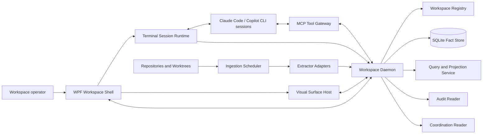

# Architecture: AI-DE

- **Status:** In review
- **Tier:** T2
- **Driving spec:** [`docs/specs/ai-native-ide.md`](specs/ai-native-ide.md)
- **Baseline:** `src/AiDe.App` is presently a .NET 10 WPF starter with no daemon, persistence,
  runtime AI, terminal, or extraction components. This architecture supersedes that intentionally
  minimal description as the target shape; it does not claim the target has been implemented.

## Context and constraints

The architecture answers the spec’s core requirement: a developer must inspect architecture,
domain/data, process/dependency, knowledge, audit, prompt, and coordination evidence across
isolated worktrees **without creating editable models that compete with source artifacts**.

| Constraint | Architectural response |
|---|---|
| Derived facts must state provenance and confidence. | Store immutable evidence assertions separately from derived relationship claims and views. |
| Worktree/session coordination is advisory unless a resource accepts fencing. | Render claims as advisory evidence; no daemon operation treats a lease as exclusive authority. |
| Workspace data and audit content may be sensitive. | One local daemon/database per workspace; egress deny by default; classified audit reader; no automatic terminal capture or model-context attachment. |
| Graph and model context must be bounded. | Queries, views, and MCP tools return capped neighborhoods with counts, omissions, and continuation, never a full graph by default. |
| Current WPF shell is a supported .NET 10 baseline. | Retain WPF; isolate terminal and web rendering behind contracts so unsupported UI controls do not own session state. |
| Kuzu is archived and no direct replacement meets the seed’s criteria. | Use a relational fact store and query interface behind `IWorkspaceStore`, not a dependency on Kuzu/Cypher. |
| MCP 2026-07-28 is stateless and security is host responsibility. | Treat every request as self-contained; bind tool authority to workspace/session context; use typed tools and no ambient service identity. |

### System shape

## Archetype and rationale

**Primary archetype: F — Copilot Aside Hot Path.** Repository indexing, storage, query, projection,
prompt staging, dispatch authorization, and rendering are deterministic. An agent or model can
consume bounded context and propose annotations, but it cannot block the workspace hot path or make
artifact-derived truth.

**Composed archetypes:**

- **C — Tool-Mediated Constructor:** the MCP gateway exposes declared, typed graph and knowledge
  operations instead of asking a model to generate API calls or code.
- **H — Long-Horizon Agent (external):** external coding sessions can be long-running, but their
  state is represented by the Agent Operations/Coordination facts, not held in a model context.

**Rejected:**

- **D — Grounded Synthesizer as the primary shape:** rejected for v1 because GraphRAG/global
  queries have high cost and weaker privacy/determinism than direct bounded graph queries.
- **B — Adversarial Ensemble:** rejected because the product does not use a model to judge
  architecture facts; deterministic evidence and human review are the authority.
- **A — Cascade Pipeline:** not the dominant request pattern. Individual extraction adapters may
  later use a cascade, but the workspace architecture does not require one.

## Capability-tier allocation

| Capability | Tier | Why this tier |
|---|---|---|
| Workspace membership, path validation, session binding, prompt dispatch receipt, coordination fold | T0 | These are identity, authorization, and audit invariants. A model would make them less deterministic. |
| Extractor scope replacement, evidence assertion ingestion, fact constraints, impact traversal, DSL generation | T0 | Compiler/parser/SQL behavior is authoritative and reproducible. |
| Visual layout, filtering, diagram rendering, accessibility alternatives | T0 | UI computation and renderer output must be testable and stable. |
| MCP tool schema validation and read/write authorization | T0 | Typed boundary and least-privilege enforcement. |
| Optional local ranking of a bounded result set | T1/T2, later | Only after a measured need; not a source-of-truth path. |
| Agent explanation/synthesis | T3, opt-in | May explain bounded evidence but is disclosed, cited, budgeted, and cannot mutate artifact facts or dispatch prompts. |

This allocation implements LOA P1–P5: deterministic work stays at the floor, cognition is
separated from execution, and every consequential operation has a deterministic verifier.

## Component map and boundaries

| Component | Responsibility | Owns | Boundary contract |
|---|---|---|---|
| **WPF Workspace Shell** | Window, docking/layout preferences, keyboard routing, pane lifecycle, user confirmation. | No repository truth or agent authority. | Authenticated local control client to exactly one workspace daemon. |
| **Daemon Process Supervisor** | Launches/ends terminal runtimes, owns ConPTY handles/streams, parses advisory OSC state, and exposes session generation/lifecycle. | Process handles and ephemeral terminal output. | The shell reconnects to daemon-owned session lifecycle; a renderer is never the process owner. |
| **Visual Surface Host** | Renders graph/diagram/audit/work/prompt views and an equivalent accessible list/tree. | View-local selection and layout preference only. | Projection document plus stable node IDs/provenance; all artifact strings are inert data. |
| **Workspace Daemon** | Workspace-local authority boundary and orchestration root. | Workspace registry, lifecycle, policy evaluation, one write pipeline. | OS-local authenticated IPC; all calls carry workspace and caller context. |
| **Ingestion Scheduler** | Debounces file/event signals, detects watcher loss, schedules scope replacement, and reports stale/failed state. | Job state only. | `ExtractionRequest(scope, artifactRevision, trigger)` and versioned extractor results. |
| **Extractor Adapter** | Reads one declared artifact scope and emits evidence assertions/snapshot. | No durable state. | Phase 1 uses an in-process fixture adapter. A versioned process/JSON boundary is introduced only when an extractor needs language/runtime isolation or independent hosting. |
| **Workspace Fact Store** | Persists dimensions, append-only facts, transactionally derived current-state cache, and export. | Workspace data only. | `IWorkspaceStore` fact/claim/query/export contract; no renderer or agent bypass. |
| **Query and Projection Service** | Applies bounded graph queries and transforms results into C4, class, ER, sequence/activity, dependency, knowledge, work, and audit projections. | Derived projections/caches. | Query result includes limits, returned/omitted counts, source revision, provenance, and confidence. |
| **Audit and Coordination Readers** | Folds audited source records and per-session coordination logs into classified facts. | Reader checkpoint and classification state. | Versioned input adapters; unsafe/unknown audit content fails closed for full detail/context use. |
| **MCP Tool Gateway** | Exposes bounded read tools and narrowly-authorized knowledge/coordination writes to agents. | Tool authorization/audit receipt. | JSON Schema tools; no artifact-fact writes; agent-returned text is untrusted data. |

### Extractor and projection rules

1. The scheduler transactionally assigns a monotonically increasing **desired generation** and
   authoritative artifact revision to every scope before enqueue. A worker may commit only when
   its generation **and** observed artifact revision equal the durable desired pair; the same
   SQLite transaction records a `ScopeSnapshotCompleted` fact with assertion count/hash/completeness,
   the committed pair, assertions, and projection-cache invalidation. Current evidence derives only
   from the latest complete snapshot. A late/retried older or incomplete extractor is rejected or
   retained as diagnostics, never allowed to remove prior evidence. Daemon recovery re-scans each
   desired scope to reconcile missed watcher events before accepting work.
2. `EvidenceAssertion` is the fact grain. A claim needs one or more assertions; no assertion is
   `not recorded`, never a speculative edge.
3. C# symbol IDs use Roslyn documentation-comment IDs when a semantic extractor is selected.
   Bounded contexts are declared by a human/configuration, not inferred from namespaces.
4. Static DI, routes, and ORM approximations are `Inferred`; runtime traces are `Observed`; neither
   becomes `Verified` merely because a visualization renders.
5. Generated diagram DSL is committed/reviewable; rendered image output is not committed until
   renderer byte determinism is separately established.

### Daemon command and concurrency protocol

Every mutating local IPC or MCP command is a versioned envelope:
`{protocolVersion, workspaceId, daemonEpoch, callerId, commandType, commandId, deadline, cancellation, traceparent, payload}`.
`callerId` is derived from an authenticated connection, never trusted from the payload. The daemon
owns a named-pipe endpoint restricted to the workspace owner SID. On an `OpenWorkspace` handshake,
it issues a random in-memory capability bound to `{connection, shell process, workspace, daemon
epoch}`; it validates and revokes that capability on every command. The daemon validates ownership
epoch and caller capability, then atomically records a command
receipt keyed by `{workspace, caller, commandType, commandId}`. A timeout/retry first reads that
receipt; it never repeats a completed mutation.

The daemon holds an OS-level workspace ownership lock before opening its store and publishes a new
daemon epoch on startup. A shell reconnects only after reading the current epoch. A stale daemon or
stale client command is rejected. Control commands and ingestion have separate bounded lanes:

| Lane | Capacity | Admission and overload behavior |
|---|---:|---|
| Control: lifecycle, receipts, user-confirmed dispatch, authorization | 64 | Never silently dropped. New work returns `AIDE-QUEUE-CONTROL-FULL` with retry-after status. |
| Ingestion: file/event-triggered scope extraction | 256 | Coalesces only the same scope to its newest desired generation; superseded work becomes a visible stale/pending state. |
| Read projection | Not queued behind writes | Executes against a snapshot with deadline and bounded result; cancellation returns an explicit partial/limit state. |

Terminal stream transfer is an **at-most-once delivery attempt with outcome unknown**, not
exactly-once: an actual terminal cannot atomically acknowledge a write and
persist a daemon receipt. A `DeliveryUnknown` outcome blocks automatic resend and requires a human
to confirm a new dispatch key. MCP annotation writes
are exactly-once at the daemon fact boundary through the command receipt key.
Coordination folds order claims by daemon ingress sequence then per-session writer sequence; observed
wall-clock time is display metadata only. Concurrent, expired, stale, and contradictory claims remain
visible states and cannot be silently folded into `Done`.

The Phase-2 terminal adapter exposes only `TerminalReady` (process/PTY can receive user-confirmed bytes)
and `PtyWriteAccepted`; OSC prompt state is advisory and never agent acceptance. A later,
per-client adapter may expose `AgentAccepted` only through an authenticated, versioned agent-side
acknowledgement contract. The v1 fallback is truthful terminal paste: it does not claim an agent
received or acted on a prompt.

Persisted store/export schemas, shell-daemon IPC, and MCP tools carry a version. The daemon
handshake publishes supported current and previous major IPC versions; it rejects unsupported
versions with a stable error. Co-deployed internal calls fail fast rather than carrying a
compatibility protocol. Extractor process snapshots gain a version only when the process boundary
is introduced. Upgrade uses expand → migrate → switch reads → contract and keeps the previous
daemon binary until health checks and rollback criteria pass.

## Durable representation

**Decision:** one integrated operational SQLite store per workspace, using dimensions for stable
entities and append-only facts for changes over time. This is deliberately a relational
implementation of the fact/derivation model; a property-graph database and Cypher are not
requirements.

| Shape | Grain and history rule |
|---|---|
| Dimensions: Workspace, Repository, Worktree, Artifact, Node Identity, Session, Agent, Tool, View Definition | One current identity/versioned descriptor per business identity; attributes that alter historical meaning use a new version. |
| `EvidenceAssertion` fact | One extractor/observer assertion about one normalized relation at one source revision/observation time; append-only. |
| `ClaimAssessment` fact | One relationship-claim assessment from a named assertion set at one time; append-only and rebuildable. |
| `CoordinationClaim`, `WorkStateAssessment` facts | One advisory claim or assessment at one recorded time; append-only, never a lock. |
| `PromptRevision`, `DeliveryReceipt`, `AuditReference`, `TraceObservation` facts | One immutable revision, outcome, classified audit reference, or trace observation at one recorded time. |

The current graph is a deterministic projection. Its latest-per-key indexes and materialized
summaries are labelled caches and rebuildable from facts. SQLite’s single-writer characteristic is
handled by the daemon’s bounded writer queues; reads use snapshot transactions. The linked
conceptual model defines the aggregate boundaries, fact grains, Type-1/Type-2 history rules,
ordering, store-enforced immutability, migrations, replay equality, and workspace-deletion
contract. There is no separate analytical source of truth. Future analytics are derived
projections of the operational facts.

## Contracts at seams

| Seam / dependency | Contract relied on | Evidence | Confidence |
|---|---|---|---|
| SQLite provider | `Microsoft.Data.Sqlite` 10.0.11 supports a WAL mode command, constraints, transactions, and recursive CTEs. Nested transactions are unsupported. | `spikes/sqlite-fact-store` executed: WAL, unique-constraint rejection, and recursive impact query. | Verified |
| MCP SDK | `ModelContextProtocol.AspNetCore` 2.2.0 registers typed tools; HTTP requests at protocol 2026-07-28 require protocol/method headers plus `_meta` protocol version and client capabilities. Tool validation returns HTTP 200 with `isError: true`. | `spikes/mcp-server` compiled and executed discovery, tools/list, valid tools/call, and invalid tools/call. | Verified |
| MCP HTTP security | SDK HTTP transport accepted an `Origin: https://evil.example` request in the spike. | `spikes/mcp-server` hostile-Origin probe returned 200. | Verified — explicit application guard required |
| ConPTY | `CreatePseudoConsole` is available on the current Windows host. Terminal input/output lifecycle needs separate service loops. | `spikes/conpty-foundation` executed a successful pseudo-console creation; shell knowledge documents the I/O constraint. | Verified for availability; Verified source contract for I/O separation |
| Extractor protocol | Phase 1 in-process adapter returns deterministic scope/assertion identities and diagnostics. A versioned JSON snapshot is required only for a future isolated/independently hosted extractor. | Project knowledge on artifact-only extraction; implementation schema is owned by this architecture. | Inferred until Phase 1 contract tests |
| Terminal renderer | Renderer consumes `ITerminalSession` streams only and never owns PTY lifecycle. | Existing terminal knowledge identifies unsupported WPF control risk. | Verified boundary; renderer selection Flagged |

## Cross-cutting concerns

### Identity and trust boundaries

- The WPF shell runs as the local signed-in workspace owner. Workspace registration canonicalizes
  path/file identity and revalidates containment before use.
- The daemon is workspace-scoped. No request may cross a workspace without explicit user-owned
  registration and policy approval.
- Terminal output, repository content, graph values, audit text, diagram labels, and MCP tool
  results are untrusted data. They never become instructions, active markup, or automatic tool
  calls.
- Prompt delivery binds `{workspace, draft revision, session ID, session generation, dispatch key}`
  and revalidates before delivery. Dispatch-command receipts are idempotent; terminal-byte delivery
  is an at-most-once attempt, and `DeliveryUnknown` requires a new human-confirmed dispatch key.
- MCP read tools require workspace context and return bounded data. Write tools can create only
  user/agent-attributed `Decision`, `Note`, `Term`, or advisory coordination records after
  deterministic authorization. Artifact-derived facts remain extractor-owned.
- Streamable HTTP, if enabled after Phase 1, binds only to loopback, validates an explicit Origin
  allowlist, and is denied until the host identity/caller authorization test passes.
- The linked threat model defines the named-pipe ACL/capability/epoch protocol, handle-based path
  validation, inert terminal/render policies, receipt-integrity chain, per-tool authorization
  matrix, and supply-chain gate. These are architecture constraints, not deferred hardening.

### Failure and resilience

- The ingestion scheduler treats watcher overflow, parser failure, partial load, and tool
  unavailability as explicit stale/failed facts; it never reports an empty graph as a clean graph.
- Per-workspace writer work is bounded. Extraction requests are coalesced by scope/revision, and
  any retry reuses the same idempotency key.
- Read projections degrade to the last successful revision with source age and failure reason.
- An agent/model outage never blocks a terminal, source query, graph update, or dispatch receipt.

### Observability

- W3C `traceparent`/`tracestate` propagates in every local IPC, extractor-process JSON, and
  enabled loopback MCP HTTP contract; structured logs emitted inside each span carry trace/span
  identifiers. Propagation-negative tests reject missing/invalid context at boundary adapters.
  The daemon emits spans
  `aide.workspace.command`, `aide.ingestion.scope`, `aide.store.transaction`,
  `aide.projection.query`, `aide.terminal.session`, and `aide.mcp.request`.
- Required structured attributes are pseudonymous `workspace.id`, `daemon.epoch`, `command.id`,
  `scope.id`, `artifact.revision`, `schema.version`, `outcome`, `error.code`, duration, requested
  and returned/omitted node/edge counts. Paths, prompts, source text, terminal text, credentials,
  and personal/work identifiers are prohibited.
- Required metrics are queue depth/oldest age/coalesced/rejected, extraction duration/failure,
  store transaction latency/lock retry, projection duration/stale age, database/WAL bytes, PTY
  output bytes/dropped bytes, active handles/processes, MCP request outcome, and migration/schema
  version. Telemetry-sink failure is non-blocking and increments a local `telemetry.not_recorded`
  metric/log; it never fabricates a value.
- Telemetry storage is capped at 64 MiB/workspace and 100 events/second/component. Metric labels
  never contain workspace, session, command, artifact, node, path, or caller IDs; those values
  remain trace/log attributes. On pressure, debug then informational events are sampled/dropped
  first. Eight MiB is reserved as a critical-event ring for security/integrity/health-error
  receipts; on sustained critical overflow it evicts the oldest critical receipt deterministically,
  emits `aide.telemetry.critical_overflow`, and creates a persisted health incident. Health exposes
  telemetry bytes, event-rate, sampled/dropped counts, critical-overflow count, and oldest retained
  event.
- Receipts include workspace/session pseudonymous IDs, artifact revision, component/version,
  source origin, confidence, duration, outcome, and limits; they exclude paths, prompts, source
  text, terminal output, and secrets.
- The operator’s 3-a.m. questions are answered by the workspace health view: which scope is stale,
  which extractor failed, what revision is rendered, whether the session is disconnected, and
  whether a prompt was acknowledged.

### Performance, resource, and recovery contract

The following are **Inferred Phase-1 acceptance targets**, not measured claims. The first benchmark
must state hardware/OS, corpus revision, 30+ samples, warm/cold state, and measured p50/p95/p99.

| Budget / SLI | Phase-1 target and action |
|---|---|
| Fixture refresh | p95 <500ms for 10,000 assertions / 50,000 edges; a failure keeps a stale last-successful projection. |
| Real C# refresh | Phase 2 p95 <2s on the approved C# corpus; Phase 1 does not claim this target. |
| Local command and queue age | p95 command completion <250ms excluding extraction; p99 control-queue age <5s; p95 scope settlement <10s and p99 <30s; rejection/oldest-age/stale escalation at 80% capacity or 30s age. |
| Extraction | At most two extractor workers per workspace, 60s per scope, one transient retry with bounded backoff; timeout marks only that scope stale. |
| Query/projection | `describe` p95 <100ms and `impact` p95 <250ms on the fixture corpus; no full scan in the approved `EXPLAIN QUERY PLAN`. |
| Resources | ≤4 MiB PTY ring buffer/session; ≥1 MiB/s sustained output triggers truncation state; maximum 8 terminal processes/workspace, 4,096 owned handles/workspace, 64 MiB renderer input/view, and 512 MiB renderer process working set. Breach rejects a new session/view or enters an explicit degraded state. WAL warning at 128 MiB / write pause at 512 MiB. |
| Recovery | RPO: zero for rebuildable source facts with accessible repositories; 24h for local prompts/layouts. RTO: restore/replay a 50,000-edge fixture within 15 minutes. |

SQLite snapshots occur before migration and daily while the workspace is open, encrypted with
user-scoped DPAPI. Disk-full, WAL-full, corruption, or failed restore moves the daemon to
read-only/rebuild state, exposes a stable error code, and offers a documented restore/rebuild
runbook. Upgrade preflight verifies binary/schema/IPC compatibility; rollback keeps the prior
binary and last compatible snapshot until the health gate is green. A weekly scheduled
restore/replay verification records its outcome/age; a failed verification or age over 8 days
creates a persisted health incident. Queue saturation, extraction failure, and resource-limit
events likewise persist bounded health incidents until displayed and acknowledged by the operator.
The upgrade health gate has a 60-second budget and requires successful schema/version preflight,
forward migration, store integrity, snapshot restore/replay equality, current/previous IPC
handshake, and projection comparison. Any failure records `AIDE-UPGRADE-HEALTH-FAILED`, restores
the prior binary/snapshot, and verifies the previous projection before declaring rollback success.

### Data governance and privacy

The linked privacy review is binding: local-first processing, field-level classification,
category retention/deletion, audit classification, no automatic terminal capture, and
**local-only telemetry** with no remote exporter in v1. Version 1 supports rich context transfer
only to `LocalOnly` sessions. An externally processing terminal can be operated independently by a
user but receives no AI-DE-injected rich context. External rich-transfer requires a future,
human-approved provider/purpose/residency/processor/rights record; an unknown session class blocks it.

### Optional model capability contract

The initial commercial model is **M1 — user-owned external agent/provider account**: AI-DE stores no
provider credential and makes no direct model call. Before an optional direct explanation capability
can ship, it must add a new ADR and all of the following:

1. a versioned prompt/instruction and typed response schema;
2. evidence-assertion IDs for every factual claim, verified deterministically against the supplied
   context;
3. pinned model/provider version, input/output/token receipt, acting principal, quota, and
   data-governance posture;
4. a deterministic baseline ranker; T1/T2 is admitted only when an evaluation shows it beats that
   baseline on the approved query set at the stated cost/latency threshold;
5. A4/A5 golden/rubric evaluations and A6 prompt/schema/model-version regression gates.

MCP schemas are versioned and server-enforced:

| Tool | Maximum request/result and required fields |
|---|---|
| `find` | `{workspaceId, term, types?, cursor?, maxResults:1..50}` → matches, next cursor, omitted count, source revision. |
| `describe` | `{workspaceId, nodeId, maxNeighbors:1..50}` → one node, ≤50 neighbors/≤100 edges/≤64 KiB, provenance, confidence, stable error code. |
| `impact` | `{workspaceId, nodeId, maxNodes:1..200, maxEdges:1..500, cursor?}` → graph fragment, limits, returned/omitted counts, continuation. |
| `architecture` | `{workspaceId, scopeId, maxNodes:1..100}` → projection DSL plus source revision and omissions. |
| `record_note`, `record_decision`, `announce_claim` | Caller-bound workspace/session, typed payload, `commandId`, request size ≤64 KiB; policy validation and actor attribution. Decisions/consequential classes require user confirmation. |

## Load-bearing decisions → ADRs

- [ADR-0001](adr/0001-derived-evidence-views.md): code-derived, provenance-labelled views are
  authoritative only as projections.
- [ADR-0002](adr/0002-workspace-fact-store.md): SQLite dimensions plus append-only facts are the
  durable workspace representation.
- [ADR-0003](adr/0003-workspace-daemon-boundary.md): one local daemon owns one workspace’s
  authority, writer pipeline, and store.
- [ADR-0004](adr/0004-mcp-tool-boundary.md): typed, bounded MCP tools expose graph knowledge and
  constrained annotations; no ambient authority or fact writes.
- [ADR-0005](adr/0005-terminal-runtime-boundary.md): direct ConPTY lifecycle belongs to a
  renderer-independent terminal runtime.
- [ADR-0006](adr/0006-terminal-delivery-semantics.md): terminal prompt transfer is an at-most-once
  attempt and never automatically retried after an unknown outcome.
- [ADR-0007](adr/0007-agent-session-adapter.md): v1 supports terminal readiness/paste only;
  agent acceptance requires a future authenticated adapter contract.

## Delivery phasing — vertical slices

| Phase | End-to-end capability it proves | Real | Mocked / stubbed seam | Human validation | E2E validation | Unblocks |
|---|---|---|---|---|---|---|
| 1 — walking skeleton | Open a workspace containing a fixture repository; inspect one source relationship with provenance and a bounded impact result in the shell. | WPF shell, workspace daemon, SQLite fact store, in-process fixture extractor, query/projection API, accessible list/provenance pane, MCP `describe` read tool. | Real terminal/session runtime, browser graph canvas, Roslyn/Bicep/DDL extractors. | Open fixture, select `Order`, see source/revision/confidence and its capped impact path. | Fixture extraction → SQLite facts → query/projection → shell list; MCP valid/invalid tool calls; fact immutability, stale-generation/revision, complete-snapshot, replay equality, command-receipt, local IPC authorization, and threat-model negative cases. | Boundary contracts, fact schema, health states, local IPC, MCP authorization. |
| 2 — real code and terminal evidence | Inspect a real C# solution and operate one real terminal session beside a derived class/dependency view. | Roslyn semantic extractor after source-generator/scip decision spike; ConPTY runtime; OSC state parser; terminal renderer selected by spike. | Bicep/DDL, audit reader, trace import. | Select a source type, launch `pwsh`, observe real session state without terminal text entering the graph. | Real solution fixture, broken-build/partial-load state, ConPTY lifecycle, renderer keyboard/accessibility contract. | C#/session user value and renderer decision. |
| 3 — architecture/data/infra joins | Navigate C4, ERM, domain, and dependency projections across C#, DDL, and Bicep evidence. | Supported Bicep JSON-RPC/build adapter; DDL parser; declared bounded-context configuration; curation policy. | Runtime trace and remote agent processing. | Inspect a declared aggregate, its tables, and deployed resource with confidence labels. | Scope replacement/idempotency, inferred-versus-verified joins, generated DSL snapshot, no hand-edit persistence. | Cross-artifact visual moat. |
| 4 — coordination, audit, and prompt staging | See workboard/audit evidence and stage a prompt for a classified session. | Coordination log reader, privacy-classified audit reader, prompt revision/delivery receipt, local-only session transfer. | External-processing transfer and deep agent hooks. | Filter by worktree, inspect advisory claim, stage/confirm a prompt, and see its receipt. | Stale/conflict fold, redacted audit fixture, dispatch idempotency/generation change, deletion/export paths. | Safe multi-agent workflow. |
| 5 — observed flow and bounded local-agent integration | Compare static and runtime flow; use bounded local-agent tools without provider-context injection. | Named trace ingestion, sequence projection, configured MCP transport, local-only policy gate. | External-processing rich transfer. | Select scenario, compare observed/static edges, inspect bounded tool provenance. | Trace origin distinction, Origin/caller authorization, local-only policy, privacy/security negative fixtures. | Complete v1 product scope. |

### Phase-1 proof plan

| Test ID | Fixture / attack | Oracle |
|---|---|---|
| P1-SEC-01..05 | Unauthorized SID, wrong/revoked capability, stale daemon epoch, replayed command, cross-workspace command. | Stable denial code; no receipt/fact mutation. |
| P1-FS-01..03 | Path alias, reparse/junction swap, TOCTOU replacement. | Handle-identity containment failure; no extraction request runs. |
| P1-STORE-01..09 | Fact update/delete, FK violation, interval containment violation, duplicate assertion, stale scope revision, concurrent writer, cache replay, migration down, backup/restore. | Database rejects forbidden state; latest complete snapshot/projection equality; restoration report. |
| P1-QUEUE-01..03 | Control saturation, ingestion burst, cancellation/deadline. | Documented rejection/coalescing/stale state and queue metric/trace. |
| P1-MCP-01..05 | Unsupported version, malformed schema, limit overflow, cross-workspace read, invalid/valid tool call. | Stable protocol/operational error or bounded response with provenance/omission. |
| P1-UI-01..04 | Empty/loading/stale/error provenance pane; keyboard path; focus restoration; accessible list equivalence. | Automated state fixture plus keyboard and screen-reader trace. |
| P1-STORE-10 | Workspace/user deletion with retained facts, caches, exports, WAL/snapshots, and later command attempt. | Purge report, parent-ledger deletion receipt, no post-delete command; source/backup limitation explicitly reported. |
| P1-PERF-01..04 | Approved 10,000-assertion/50,000-edge corpus, warm/cold 30-sample runs, forced query-plan regression, refresh failure. | p50/p95/p99 report, no-full-scan plan, and stale-last-successful state on failure. |
| P1-PRIV-01..03 | Seeded secret/PII in extractor, audit metadata, trace, and coordination fixtures. | Graph/UI/receipt/log/trace/metric allowlists contain no seed; unknown classification denies persistence/export/attachment. |
| P1-PERF-05 | 32 producers over 100 scopes, 200 events/s for 60s; 95% 100ms and 5% 1s simulated extraction service time. | p95 control command <250ms, p99 control-queue age <5s, p95 scope settlement <10s/p99 <30s, persisted stale-health escalation, and no silent loss. |
| P1-UPGRADE-01 | Previous daemon/schema → forward migration → current daemon, with injected health-gate failure. | 60-second health gate or stable failure; prior binary/snapshot rollback, IPC handshake, and projection-equality oracle. |

The Phase-1 Proof Pack maps each row to a red-observed test, source fixture, mutation/negative
result, execution environment, and residual risk. Any future fake/prod extractor, terminal, or
visual adapter must share a versioned conformance suite only once it has both an interface and a
second implementation/consumer; Phase 1 deliberately has neither for terminal/visual rendering.

## Applied patterns

| Pattern | Boundary | Invariant / rejected alternative |
|---|---|---|
| Append-Only Evidence Ledger | Fact store | Corrections supersede; `UPDATE`/`DELETE` cannot revise evidence. Rejected mutable graph rows. |
| Snapshot Replacement + Materialized View | Scope ingestion/projection | Only latest complete scope snapshot contributes evidence. Rejected deletion from partial extractor output. |
| Command Receipt / Idempotent Consumer | IPC and MCP writes | `{workspace, caller, command type, command ID}` returns original outcome. Rejected check-then-act retries. |
| Process Supervisor | Daemon → terminal runtime | Daemon owns process lifecycle; shell reconnects. Rejected UI-owned PTY lifecycle. |
| Capability-Based Security + Principal Propagation | IPC/MCP | Server-derived caller/capability/epoch scopes every command. Rejected caller-supplied identity. |
| Bulkhead queues | Control vs ingestion | User control/receipts are isolated from extraction bursts. Rejected one unbounded FIFO. |
| CQRS / Materialized Read Model | Facts → projections | Reads are rebuildable bounded projections. Rejected renderer querying/mutating raw facts. |

## LOA conformance check

| Criterion | Status |
|---|---|
| C1 Tier annotation | Required for any future model-initiating component. No v1 deterministic component initiates a model call. |
| C2 Budget propagation | Required at the optional T1–T3 synthesis boundary; not applicable to deterministic extraction/query. |
| C3 Receipt emission | Required for model/tool calls; daemon operational receipts are mandatory from Phase 1. |
| C4 Typed boundaries | Satisfied: extractor, IPC, query, projection, MCP, and event schemas are typed/versioned. |
| C5 Side-effect protection | Satisfied by user-confirmed, generation-bound prompt dispatch and deterministic authorization. |
| C6 Idempotency keys | Satisfied by extraction scope/revision and prompt delivery dispatch keys. |
| C7 Fallback declaration | Satisfied by stale last-successful projections and no-agent-dependency hot path. |
| C8 Pattern naming | Architecture names the applied patterns and ADRs. |
| C9 Anti-pattern absence | No monolithic model call, unbudgeted loop, free-text tool execution, or editable derived truth. |
| C10 Audit completeness | Workspace receipts/audit reader required; formal regulated-audit posture remains a later compliance decision. |
| C11 Principal propagation | Workspace/session/caller context is required on every prompt, MCP, and write boundary. |

## Flagged risks and residual unknowns

- Roslyn source-generator visibility and a usable C# SCIP indexer require dedicated spikes before
  Phase 2’s extractor selection.
- Terminal renderer selection, WebView surface implementation, layout persistence, and visual
  graph renderer require prototype and accessibility/performance evidence before Phase 2.
- SQLite graph-scale limits, graph query limits, and index design require Phase 1 benchmark data.
- Generated diagram SVG byte determinism and Bicep/DDL adapter contracts remain Phase 3 spikes.
- External model/provider rich transfer, enterprise policy, and cross-platform support are not v1
  assumptions; their privacy/legal posture remains explicitly Flagged and requires a new decision.

## Status and next action

| | |
|---|---|
| **Completed** | Merged the specification; executed SQLite, MCP, and ConPTY spikes; produced the component architecture, durable fact model, ADRs, and vertical delivery plan. |
| **Remaining** | Phases 1–5 in order; first resolve Phase 1’s local IPC/projection design, then Phase 2 extractor/renderer spikes. |
| **Best next action** | `/design` the Phase 1 walking skeleton: fixture extractor, workspace fact schema, bounded query/projection contract, local IPC, and accessible provenance pane. |

## Gate record

`GATE define-architecture · 2026-08-25 · Enterprise Architect PASS; Distributed Systems PASS; Security PASS; SRE PASS; AI Systems PASS; Patterns PASS; Simplifier PASS; Data/Privacy/Test/Release PASS-WITH-CONDITIONS · criteria: data model, revision/command delivery semantics, threat/LINDDUN/release plans, bounded MCP schemas, observability/resource budgets, and Phase-1 proof paths independently reviewed · verdict: PASS-WITH-CONDITIONS · vetoes→resolution: Distributed Systems and Security hard vetoes cleared; Data, Privacy, Test, and Release require the named Phase-1 real-SQLite, privacy, Proof Pack, CI, and internal-ring evidence before implementation/release acceptance.`

---
**Handoff:** `/design` the Phase 1 walking skeleton after the architecture gate clears.
