# Architecture: AgentPlane

- **Status:** Accepted (Phase 1 exit run scored `Partial: 15/15 observed`; see the E18 close)
- **Tier:** T2 (subprocess spawn, bidirectional async protocol, `mode` migration, model-backed
  capability spawned — all four hard-veto triggers present, per `plan-conductor-programme`)
- **Driving spec:** [`docs/specs/conductor/ai-de-conductor-spec-v1.html`](../specs/conductor/) (byte-frozen; see
  `note-conductor-spec-errata-policy`)
- **Author / date:** @timianmalloo · 2026-09-09
- **Baseline:** AgentPlane is a **subsystem of the AI-DE workbench** ([`docs/architecture.md`](../architecture.md))
  and a **sibling of Loomkeeper** ([`docs/architecture/loomkeeper.md`](loomkeeper.md)), not a
  replacement for either. It reuses Loomkeeper's fact store, ingest path, trusted registrar and
  scorer; it adds the one thing that did not exist before Phase 1 — a governed, ACP-speaking coding
  lane the plane itself spawns, drives and closes, rather than one that arrives already running in a
  terminal. This document is the Phase 1 shape, proven by the exit run in
  `docs/proof/conductor-agent-plane.md`; it does not claim Phase 2's conductor exists.
- **Grounding traversal:** `spec-conductor` (implements) → `plan-conductor-programme` (depends-on) →
  `architecture` (refines) → `adr-0007-agent-session-adapter` / `adr-0023-watcher-observation-projection`
  (relates-to, reused rather than re-derived) → the eleven-plus `note-conductor-*` decision notes
  (each cited at its load-bearing point below). No stale or orphaned nodes found: the run-event
  store, the delivery/identity/egress questions AgentPlane touches each already had an accepted
  decision to extend.

## 1. Context and the load-bearing constraint

Spec §12 assigns Phase 1 of the Conductor programme `R1 R2 R4(core)`: prove that a real coding
engine can be **governed** — spawned by AI-DE itself, run inside a scope it enforces, and scored by
the same watcher that already scores an **observed** terminal session — without touching the
terminal stack that observed sessions depend on. The Agent Client Protocol (ACP) is the mechanism:
a JSON-RPC-over-stdio protocol in which the agent is the caller as often as the callee
(`session/request_permission`, `fs/read_text_file`, `terminal/create`, …), so a .NET client is a
**server loop**, not a request/response call.

The load-bearing structural fact, established by execution rather than by reading the spec: **ACP's
persistence contract is the exact opposite of the terminal stack's.** `ITerminalSession.Output` is
documented as bounded, ephemeral, and **never** entering the fact store, an audit entry, a log or
telemetry (`src/AiDe.Core/Dispatch/ITerminalSession.cs:68-72`) — that is the terminal privacy
invariant. §7.2 requires every ACP run event **persisted** to the run log. Folding one channel into
the other would route persist-forbidden bytes through a persist-required channel, or vice versa.
This single fact is why AgentPlane is a **new, separate component tree**
(`src/AiDe.Core/AgentPlane/`, `src/AiDe.App/Conductor/`) rather than a widening of
`ITerminalSession` — see `adr-0027-acp-lane-separate-shape` and §3 below.

## 2. The system as a system (stocks, flows, feedback, delays, boundary)

- **Stocks (what accumulates):** the append-only run-event envelope (`RunEvent`, one per mapped ACP
  frame); the closed episode and its `ScoreSegment` cell; the engine catalog and provider registry
  (small, versioned, human-edited); the worktree the lane wrote in, until it is released or parked.
- **Flows:** catalog resolution → engine process spawn → ACP handshake → observed-auth read → spawn
  authorization → worktree provisioning → episode open → prompt turn → per-frame mapping → lease
  monitoring → episode close → scoring → terminal-hosting count → result.
- **Feedback loops:** an edit outside the lease raises a seam, and an open seam at close **forces**
  the episode `Blocked` regardless of the declared outcome (§7 below) — the one loop AgentPlane
  closes on its own signal rather than the caller's. There is no retry loop and no learning loop in
  Phase 1: the plane runs one lane once and reports what happened.
- **Delays:** a bounded handshake timeout (60 s) and a bounded prompt-turn timeout, both named
  constants on `AcpPeerOptions`; a bounded worktree-command timeout (60 s, `ProcessRunner`). No
  unbounded wait exists anywhere in the composed path — every await that crosses a process boundary
  has a stated bound.
- **Boundary drawn:** one governed lane, one engine (`claude-code`), one launch path (adapter), one
  process, per run. **Inside:** spawn, handshake, one prompt turn, close, score. **Outside, by
  ruling:** a conductor that plans/reviews/dispatches multiple lanes (Phase 2); a live `codex` or
  `copilot` lane (deferred, each enforced by its own refusal — §3); a rendered leaderboard rank (the
  composer's cohort minimum of 5 is not met by two episodes); any change to `weave/1`'s dimensions,
  weights or partition.

**Leverage point:** the highest-leverage decision is **where the ACP run-event envelope's identity
comes from** (`AcpRunEventMapper` stamps `Seq` and `Ts`; ACP frames carry neither), because every
later consumer — the lease monitor, the scorer, a Phase-2 conductor — reads events in that order.
Everything else here (the catalog, the provider registry, the worktree provisioner) is a replaceable
data table or a swappable process wrapper behind a narrow seam.

## 3. Candidate shapes considered

1. **Widen `ITerminalSession` to a generic lane interface, per spec §10's "generalizes to lanes...
   behind one interface" reading.** *Rejected* — this is the privacy-contract collision in §1: an
   ACP lane's events must persist and a terminal lane's output must not, so one interface would need
   a per-implementation escape hatch from its own contract. Also: the consumer that would benefit is
   hard-typed to the concrete `ConPtyTerminalSession` today
   (`src/AiDe.App/Workbench/TerminalSurface.cs:39`), so widening buys nothing at the one call site
   that exists. **Ruled in `note-conductor-acp-lane-separate-shape`**; formalized in
   `adr-0027-acp-lane-separate-shape`.
2. **Invent an `IEpisodeSource` interface so `GovernedLaneSource` and `AuditLogEpisodeSource`
   share one shape**, reading spec §6.2's "implements the same source seam as `AuditLogEpisodeSource`"
   literally. *Rejected* — no such seam exists to implement: `AuditLogEpisodeSource` is a `public
   static class`, a batch importer with no interface, called only from `WatcherHost`. An interface
   over one static batch reader and one live streaming source would have exactly two implementers of
   genuinely different shapes — the standing Simplifier objection — and is deferred until a
   **third** implementer (`BenchImportSource`) exists. **Ruled in
   `note-conductor-episode-source-seam`**; `GovernedLaneSource` (renamed from `GovernedSessionSource`
   by Ruling 15/A3) instead enters through the live
   `IngestHost.OpenEpisode` / `DeclareEpisodeArtifacts` / `CloseEpisode` path under a
   `ITrustedRegistrar` capability — the same path `InjectedContractIngest` already uses, so the
   watcher's existing sweep (`ClosedEpisodeScoring`) needs no new source type to score it.
3. **A live `grok-build` observed lane alongside the governed `claude-code` lane in Phase 1**, per
   spec R4 bullet 1's literal text. *Rejected for Phase 1* — the readiness profile and terminal
   binding it needs is R11, assigned to Phase 4. **Ruled in `note-conductor-r4-core-phase1-scope`**:
   R4-core in Phase 1 is the *coexistence* claim (a governed episode and an audit-imported observed
   episode land in one store, scored by the unchanged `ScoringService`, in one test), proved without
   a live second engine.
4. **Chosen — a separate ACP lane component tree, entering the existing watcher through its live
   ingest path, governed by its own catalog/registry/lease types.** This is the smallest shape that
   adds a genuinely new capability (a lane the plane itself drives) without duplicating or
   destabilizing either of the two subsystems it touches.

## 4. Components and boundaries

```mermaid
flowchart TB
  classDef ext fill:#0D1014,stroke:#98A3B2,stroke-dasharray:4 3,color:#98A3B2
  classDef app fill:#1A1F26,stroke:#5B9DD9,color:#E4E9EF
  classDef plane fill:#1A1F26,stroke:#5FB98F,color:#E4E9EF
  classDef watcher fill:#1A1F26,stroke:#2A313B,color:#E4E9EF
  classDef frozen fill:#0D1014,stroke:#D8A650,stroke-dasharray:4 3,color:#D8A650

  subgraph app["AiDe.App / Conductor — the one composition root"]
    ConductorEntry["ConductorEntry<br/>headless launcher: run file → result file"]
    GovernedRunHost["GovernedRunHost.RunAsync<br/>catalog → process → handshake →<br/>observed auth → authorize → worktree →<br/>episode → prompt → seams → close → score"]
  end

  subgraph plane["AiDe.Core/AgentPlane — new"]
    EngineCatalog["EngineCatalog<br/>3 data rows, 1 launch path, 3 named refusals"]
    ProviderRegistry["ProviderRegistry<br/>accounts, observed health, ObservedAuthLabel"]
    GoalBlock["GoalBlock / SpawnContract<br/>6-field goal + fail-closed auth gate"]
    AcpEngineProcess["AcpEngineProcess<br/>child spawn, env inspection, tree reap"]
    AcpPeer["AcpPeer<br/>NDJSON framing, correlation, backpressure"]
    AcpLaneClient["AcpLaneClient<br/>handshake · session · prompt · permission"]
    AcpRunEventMapper["AcpRunEventMapper<br/>ACP frame → RunEvent, one mapper"]
    WorktreeProvisioner["WorktreeProvisioner<br/>namespaced branch, coord install inside it"]
    GovernedSessionSource["GovernedLaneSource<br/>opens/closes the episode"]
    LeaseAndSeams["Lease / LeaseMonitor<br/>out-of-lease edit → seam → forces Blocked"]
    LaneCohort["LaneMode / LaneScoring<br/>stamps the mode cohort, requires taskClass"]
    TerminalHostingLedger["TerminalHostingLedger<br/>counts terminal.start; oracle for == 0"]
    RunTriage["RunTriage<br/>Stage-0: skip plan/council for T0/T1"]
  end

  subgraph watcher["AiDe.Core/Watcher — existing, unchanged semantics"]
    IngestHost["IngestHost<br/>OpenEpisode / DeclareArtifacts / CloseEpisode"]
    Registrar["ITrustedRegistrar"]
    ClosedScoring["ClosedEpisodeScoring"]
    ScoringService["ScoringService / WeaveScorer<br/>R4-core: byte-unchanged"]
    Store["SqliteWatcherObservationStore<br/>v6: + mode TEXT NULL, expand-only"]
  end

  subgraph frozen["AiDe.Core/Terminal — frozen for Phase 1"]
    ITerminalSession["ITerminalSession<br/>Output never persisted"]
    ConPty["ConPtyTerminalSession<br/>emits terminal.start on aide.terminal.runtime"]
  end

  Adapter["claude-agent-acp adapter<br/>node process, wraps Claude Code Agent SDK"]
  Repo[("Repository + worktrees")]

  ConductorEntry --> GovernedRunHost
  GovernedRunHost --> EngineCatalog
  GovernedRunHost --> ProviderRegistry
  GovernedRunHost --> AcpEngineProcess
  AcpEngineProcess --> AcpPeer
  AcpPeer --> AcpLaneClient
  GovernedRunHost --> AcpLaneClient
  GovernedRunHost --> GoalBlock
  GovernedRunHost --> WorktreeProvisioner
  GovernedRunHost --> GovernedSessionSource
  GovernedRunHost --> TerminalHostingLedger
  GovernedRunHost --> LaneCohort
  AcpLaneClient --> AcpRunEventMapper
  AcpRunEventMapper --> LeaseAndSeams
  GovernedSessionSource --> IngestHost
  IngestHost --> Registrar
  LaneCohort --> ClosedScoring
  ClosedScoring --> ScoringService
  LaneCohort -.writes mode.-> Store
  ScoringService --> Store

  AcpEngineProcess -.spawns.-> Adapter
  AcpLaneClient -.stdio ACP.-> Adapter
  WorktreeProvisioner -.git worktree add.-> Repo
  TerminalHostingLedger -.listens, never calls.-> ConPty

  class app,ConductorEntry,GovernedRunHost app
  class plane,EngineCatalog,ProviderRegistry,GoalBlock,AcpEngineProcess,AcpPeer,AcpLaneClient,AcpRunEventMapper,WorktreeProvisioner,GovernedSessionSource,LeaseAndSeams,LaneCohort,TerminalHostingLedger,RunTriage plane
  class watcher,IngestHost,Registrar,ClosedScoring,ScoringService,Store watcher
  class frozen,ITerminalSession,ConPty frozen
  class Adapter,Repo ext
```

| Component | Responsibility | Boundary contract |
|---|---|---|
| `GovernedRunHost` (`AiDe.App/Conductor`) | The **one** composition root for a governed lane — catalog → process → handshake → observed auth → authorize → worktree → episode → prompt → seams → close → score, in that order because a refused spawn must leave nothing behind. | `static RunAsync(GovernedRunRequest, CancellationToken)`; the deferred Conductor Surface and the headless `ConductorEntry` call the **same** method — N7's floor makes a hand-assembled harness a failure, not an alternative path. |
| `ConductorEntry` (`AiDe.App/Conductor`) | Headless door: read a run file, call `GovernedRunHost`, write a result file. A door, not a second composition root. | Exit codes are the contract: `0` scored comparable, `1` completed but evidence fails, `3` did not complete, `64` bad arguments. |
| `EngineCatalog` | Engines are **data, not code paths** (spec §4.1): three rows, one launch path (adapter), three named refusals (unknown id, non-adapter mode, unobserved entry module). | `ResolveLaunch(engineId)` never defaults; an unresolvable row is a refusal with a stable `AgentPlaneErrorCodes` value. |
| `ProviderRegistry` | Accounts, per-account observed health (`ready`/`needs-login`/`quota-degraded`), and the declared `ObservedAuthLabel` correspondence. | Unknown provider/account refused, never substituted even when exactly one is configured. |
| `GoalBlock` / `SpawnContract` | CT19's goal state as a spawn precondition (six named fields); the fail-closed auth gate (`AP-0009`–`AP-0013`). | `Validate` names the missing field; `Authorize` refuses an explicit direct-api spawn, an absent/non-subscription observed auth, and a contradicting `ObservedAuthLabel` — before any process exists. |
| `AcpEngineProcess` | Starts, inspects (PATH-length probe, DC-027), and **reaps the whole process tree** — the adapter spawns a `claude` CLI grandchild. | `IDisposable`; `ProcessId` is captured at start so it is answerable after disposal (the regression this phase found — §11). |
| `AcpPeer` | NDJSON framing, request/notification correlation, backpressure — works over any pair of streams, tested with no subprocess. | Bounded queue depth, bounded frame size (measured against the corpus, not guessed), two named timeouts (handshake, prompt turn). |
| `AcpLaneClient` | What the ACP messages *mean*: handshake, session, prompt, permission answer (defaults to reject). | Separate from `AcpPeer` on purpose — protocol semantics testable with no process, framing testable with no handshake. |
| `AcpRunEventMapper` | The **one** mapper from ACP wire frames to `RunEvent` (spec §7.2's one envelope). Recognition is a table (four kinds with a Phase-1 producer); everything else is namespaced `acp.*` and carried whole in `Ext`, never dropped. | `Seq` and `Ts` are stamped here, never read from the wire — an ACP frame carries neither. |
| `WorktreeProvisioner` | Provisions a namespaced-branch worktree, runs `coord install` **inside** it; releases fail-safe (parks anything not provably safe, never deletes). | `IProcessRunner` seam exists so "which directory did this run in" is assertable without a real repository on disk. |
| `GovernedLaneSource` (renamed from `GovernedSessionSource`, Ruling 15/A3) | Opens/declares/closes the episode over the **live** `IngestHost` path under an `ITrustedRegistrar` capability — no new interface (§3.2). | The episode's open attributes are byte-for-byte the goal block; an incomplete block opens nothing. |
| `Lease` / `LeaseMonitor` | The lane's exclusive write scope (glob patterns, case-sensitive, repository-relative); an edit outside it raises a **seam** (a ledger entry, not a `RunEvent` — minting one here would need a second `Seq` writer). | An empty lease is refused, not read as "covers nothing" or "covers everything." An open seam at close **forces** `Blocked`. |
| `LaneMode` / `LaneScoring` | Stamps which door an episode came through (`Governed` / `Observed`) as a **cohort attribute**; requires `taskClass` explicitly, no default. | Neither underlying scoring path (`ClosedEpisodeScoring`, `AuditLogEpisodeSource` import) changes; `mode` is never a `ScoreSegment` member. |
| `TerminalHostingLedger` | Counts `terminal.start` activities on `aide.terminal.runtime` while open — the positive oracle for "zero terminal hosting." | Listens to an activity `ConPtyTerminalSession` already emits unconditionally; `src/AiDe.Core/Terminal/` gains no line for it. |
| `RunTriage` | Stage-0 triage: whether a run's declared tier/fan-out skips plan and council on the way to dispatch (spec §5.3, R2 bullet 3). | Decided from the goal block's declared fields alone; absence degrades toward **more** ceremony, never less. |

## 5. Durable data representation

AgentPlane adds **no new store** and **no new writer contention**. It reuses Loomkeeper's dimensions
+ append-only-facts store (`ADR-0002`, extended for the watcher by `adr-0023-watcher-observation-projection`)
through exactly one additive change:

- **`mode` as a nullable, expand-only column** on `scored_episode_cell` (`SqliteWatcherObservationStore`
  schema v5 → v6): `RecordEpisodeMode` / `FindEpisodeMode`, no backfill. A pre-migration fixture
  database's row count and scores are byte-identical after migration; every legacy row reads `mode`
  as `NULL`, meaning **"not recorded,"** never inferred as `Observed`. See
  `adr-0028-mode-cohort-not-partition`.
- **R4-core is "unchanged by diff", measured over the whole phase**: `src/AiDe.Core/Dispatch/` and
  `src/AiDe.Core/Terminal/` are byte-unchanged (zero files); `src/AiDe.Core/Watcher/` is
  **+104/−2** across two files, and the two removed lines are additive in effect — the schema
  constant moving 5→6, and a trailing comma so `mode` can follow the last column. `ScoringService`,
  `ClosedEpisodeScoring`, `Leaderboard` and `WeaveScore` are untouched; the watcher gained **callers**
  (`LaneScoring.ScoreGoverned`, `LaneScoring.ImportObserved`), not new semantics. Verified by
  `git diff --numstat` in `docs/proof/conductor-agent-plane.md`.
- **`RunEvent` itself is not persisted by a new writer.** Phase 1's run-event envelope lives for the
  duration of one run (mapped, monitored for lease violations, then discarded); nothing here adds a
  table for it. A Phase-2 conductor that must replay run events across a longer-lived session is a
  **new durable-representation decision**, not an extension of this one.

## 6. Identity and spawn-order discipline

A governed lane's identity is `LaneId` (the lane registers as the watcher's **terminal id**, not a
new identity axis) plus `Harness`/`Model` as cohort attributes it may not yet know at spawn time.
`GovernedRunHost.RunAsync` composes in an order that is itself a control, not an implementation
detail:

1. **Catalog resolution and process spawn** — before any authority is granted, because refusing a
   bad engine id must not touch a subprocess at all.
2. **Handshake and observed-auth read** — the client reads what the adapter *says about itself*
   (`_auth/status_update`) before anything is authorized against configuration, because the gate is
   on a measurement, not a claim (§7.2).
3. **Spawn authorization** (`SpawnContract.Authorize`) — refuses before a worktree is cut, so a
   refused spawn leaves nothing behind to clean up.
4. **Worktree provisioning** — only after authorization succeeds.
5. **Episode open, ACP session rooted in that worktree, one prompt turn, lease monitoring, close,
   score.**

## 7. The two riskiest surfaces (front and centre)

### 7.1 The ACP/terminal privacy-contract boundary (`adr-0027-acp-lane-separate-shape`)

This is the surface §1 exists to name: `ITerminalSession.Output` must never be persisted;
ACP run events must always be. AgentPlane keeps them apart by construction — no shared interface, no
shared serialization path, and `TerminalHostingLedger` only **listens** to the terminal stack's
existing activity source rather than calling into it. The one place they meet is spec §7.2's
run-event envelope, which is Phase 1's **only** shared surface, and it currently has exactly one
producer (ACP). A second producer (a terminal-backed lane) is `ObservedLaneBinding`, explicitly
deferred to the phase that needs Phase 4's `R11`.

### 7.2 The fail-closed subscription-billing gate

`SpawnContract.Authorize` exists because an environment API key, an `apiKeyHelper`, or a managed
key **outranks** a configured subscription inside the adapter — a lane can believe it is on the
subscription and be silently billed to the API, with no explicit direct-api spawn to reject. The
gate therefore keys on the adapter's **observed** auth status, not on configuration:

- Absent or unparseable observed auth → refused. Never assumed subscription (IO12).
- Present but not `kind: account` → refused.
- `kind: account` and a recorded `ObservedAuthLabel` that **contradicts** the configured account's →
  refused (`AP-0013`) — closing the gap where two configured logins could bill the wrong one
  silently. No recorded label → `kind` alone authorizes, which is **"not recorded," not a guessed
  mapping** (`note-conductor-observed-auth-label-correspondence`).
- An explicit Anthropic direct-api spawn attempt is rejected with the ToS reason, checked **before**
  goal-block validation, so an incomplete goal block cannot mask it.

This protects the operator's **money**; it is a separate concern from the operator's **permission**
to use their own subscription at all, which is a human ruling
(`note-conductor-subscription-use-authorised`) and is not re-litigated by this gate.

## 8. Cross-cutting concerns

- **Idempotency / backpressure:** `AcpPeer`'s event queue applies backpressure on overflow (a full
  queue blocks the publisher) rather than dropping silently — the ACP event stream is the run log,
  which §7.1 of the spec calls the truth, so a drop there is data loss in the durable record, unlike
  a terminal byte. Every abandonment is counted and named, never silent.
- **Failure modes:** a dead child fails every pending request with a named reason; a hung child times
  out rather than waiting forever; disposal reaps the whole process tree (the adapter's own `claude`
  CLI grandchild included); one malformed or over-long frame is counted and the read loop continues.
- **Observability:** per-event normalization latency is emitted and recorded on the normal path,
  degrading to `"not recorded"` — never `0` — when the receipt timestamp is absent (§9,
  `adr-0029-latency-slo-recorded-not-asserted`); `TerminalHostingLedger`'s count travels on the run
  result rather than living only in a log line.
- **Determinism at the floor (LOA P2):** the scorer, the lease monitor, the catalog and the
  provider registry are all T0 — deterministic and testable without a live adapter. The only
  process-in-the-loop surface is the ACP child itself, and its failure modes are bounded and named
  rather than absorbed.

## 9. Latency: recorded SLO, not a CI assertion (`adr-0029-latency-slo-recorded-not-asserted`)

Spec R1 requires run events within 250 ms of receipt. `tools/verify-perf-assertions.py` is a
fail-closed gate (the control for DC-107) that refuses any test asserting a measured duration is
under a constant — a literal `elapsed < 250` would re-create a registered defect class, not thin a
floor. Phase 1 therefore asserts a **deterministic ordinal** (the normalized run event is observable
**before** the client's response to the next inbound ACP request for the same call id — no guard
band to mis-size) as the required test, emits and records the latency metric on the normal path, and
evaluates the 250 ms figure as an **operator SLO** at the exit run, with the host named: p50
**0.022 ms**, p95 **0.0641 ms** over 287 events on `TIMMALLSTRIX` — in-process normalization only, no
evidence about a loaded machine or a lane whose events cross a process boundary.

## 10. Vertical delivery phasing

Phase 1 is the walking skeleton for AgentPlane: eight serial nodes (N0 frame corpus → N1 envelope →
N2 catalog → N3 plane services → N4 ACP client → N5 integration+scoring → N6 leases/seams → N7
headless launcher + exit evidence), run at **width 1** after both council vetoes (Test Architect
hard, Simplifier soft) returned BLOCK and converged on going serial — see
`note-conductor-phase1-plan-approval`. The full graph, its exit conditions, and the loop bounds are
recorded in `docs/plans/conductor-programme.md`; this document does not repeat them.

| Phase | Proves | Real | Mocked / deferred | Unblocks |
|---|---|---|---|---|
| **1 (this document)** | A real governed run on `claude-code`, in a provisioned worktree, scored end-to-end, zero terminal hosting, launched through the real App composition root. | Full component set in §4; one live exit run against a Max subscription. | The Conductor Surface (UI), a live `grok-build` observed lane, Budget/FanOutCap enforcement, shell-write lease coverage. | Phase 2. |
| **2 — Conductor** | `ConductorHost`, tools, plan/council/dispatch/steward, board + seams, converge. | — (not yet built) | — | Phase 3. |

## 11. Confidence ledger

| Claim | Evidence | Label |
|---|---|---|
| ACP is bidirectional; a .NET client needs a server loop, not a request/response client | `spikes/acp-subscription-lane/` — 88 real captured frames, both directions | Verified |
| `ITerminalSession.Output` must never be persisted | `src/AiDe.Core/Dispatch/ITerminalSession.cs:68-72`, read directly | Verified |
| The mode migration is expand-only and legacy rows read NULL | `ScoredEpisodeModeMigrationTests` against a pre-migration fixture DB | Verified |
| `Dispatch/` and `Terminal/` are byte-unchanged over the whole phase | `git diff --numstat aa48321..HEAD` in the Proof Pack | Verified |
| Zero terminal hosting during the exit run | `TerminalHostingLedger` reads 0; a companion test shows the same counter reading 1 for a real ConPTY session | Verified |
| The exit run's latency figures generalize beyond one host / in-process normalization | — | **Not established — explicitly Flagged**, §9 |
| Budget and FanOutCap are enforced, not merely validated | — | **Not true — recorded as a residual, not claimed** |
| A governed lane in the operator's own linked worktree can be credited for its own committed evidence | `RepositoryCorrection` rebinds the session to the parent checkout; `ProofPackVerifier` reads that tree | **False — DC-115, uncontrolled; see §12** |

## 12. Residual architectural risk

- **DC-115 (uncontrolled).** A governed lane running in the operator's own linked worktree cannot be
  credited for the evidence it commits there: `RepositoryCorrection` rebinds the session to the
  parent checkout, and `ProofPackVerifier` reads *that* checkout's tree, which sits on `main`. The
  Phase-1 exit run avoided this by rooting in a clone; the shape spec §6.4 describes is not yet
  usable for a governed lane in the operator's own tree. Phase 2's mandatory first node is required
  to carry a control for this before any scored governed episode may run in a linked worktree (see
  `note-conductor-phase1-e18-close` condition 1).
- **The lease is enforced over announced edits only.** `LeaseMonitor` recognizes `kind:"edit"` tool
  calls; a write performed through a shell command carries no `locations[]` and raises no seam.
- **Budget and FanOutCap are validated, never enforced.** `SpawnContract` refuses a non-positive
  value; nothing thereafter meters requests or tokens against it, and Phase 1 spawns no sub-lane for
  a cap to bound. Deliberately not closed at this node — adding enforcement now would make the
  exit-run evidence describe a binary nobody actually ran.
- **The two evidence doors disagree on what "has evidence" means.** `AuditLogEpisodeSource.HasProofPackArtifact`
  credits a declared path by substring; the governed door (`ProofPackVerifier`) requires the file to
  exist. The stricter one applies to the lane this product drives.
- **The ACP frame corpus is an incomplete oracle, not a flaw.** Live traffic newer than the 88-line
  corpus carried `session_info_update` and `usage_update`, both absent from the committed frames;
  they survived correctly under `Ext`, which is the strongest evidence the open-`kind`-string design
  was right — and simultaneous proof that "every frame round-trips" is bounded to what was captured.
- **`authStatus.account.plan` is not a stable value** across observations on the same pinned adapter
  (`"max"` in the corpus, `"Claude Max"` live). Nothing may key on it; the spawn gate keys on `kind`
  plus the declared `ObservedAuthLabel` correspondence only.
- **The model is a declared cohort label, not an observed fact.** The adapter reports modes and
  commands but no model identity this client reads; Phase 3's standings work needs an observed model
  and today's declared value would rank two different models in one cohort.
- **A governed lane is not toolless, and the operator keeps the repository's `Bash(git push:*)`
  auto-allow — so the lane pin is the only control.** Adapter 0.75.1 resolves the permission mode
  from `settingSources: ["user","project","local"]` and gives the SDK the `claude_code` tool preset
  unless `session/new` `_meta` says otherwise; auto-allowed tools never reach the host's
  `canUseTool` (`spikes/compile-session-tool-pin`, source-verified). Ruling 71 makes the typed
  `session/new` tools argument on `AcpLaneClient.NewSessionAsync` the standing control
  (`disallowedTools: ["Bash"]` for a governed lane; `tools: []` for a compile session —
  `adr-0035-compile-session-binding-and-pin`), with the P-D5 wire spike as its observation. The
  operator has decided (2026-09-11, relayed by the conductor) to **keep** `.claude/settings.json:4`'s
  `Bash(git push:*)` allow rather than drop it; the lane control therefore does not rely on the
  repository's settings and must not — a lane whose `session/new` lacks the pin holds a shell that
  can push. The `NewSessionAsync` argument had **not** landed on `feature/exit-evidence` at
  `757af057` (`AcpLaneClient.cs:152-189` still sends `{cwd, mcpServers: []}`); the F5 exit run may
  not proceed without it (Ruling 71 (a)). **A related path, named:** a governed lane's merged edit to
  `.claude/settings.json` becomes a hook the next compile session runs (ADR-0035) — model output
  reaching executable configuration across sessions. Mitigated by the lease (`ToPattern` drops a
  leading `.`, `LeaseDerivation.cs:124-133`, so `.claude/` is unleasable and any edit there is out of
  lease and raises a seam), by Ruling 71's `disallowedTools: ["Bash"]` (no unannounced shell write),
  and by the operator's merge; the control's test: a lane `Edit` to `.claude/settings.json` raises a
  seam that forces `Blocked`.

## 13. Gate record

`GATE define-architecture (retrospective, Phase 2 N0) · 2026-09-09 · this document assembles the
Phase-1 exit evidence and the accepted decision notes into one architecture view; it authors no new
decision · verdict: the recorded rulings are internally consistent when read together (§3's three
rejections trace to three separate notes and do not conflict), with the inconsistencies and gaps
found during assembly named in §11/§12 rather than smoothed over.`

---
**Handoff:** Phase 2's conductor design (`/design-slice`) builds on §4's component seams — the
run-event envelope (§2's leverage point) and the live `IngestHost` path (§3.2) are what a
multi-lane conductor will compose over, not replace.
