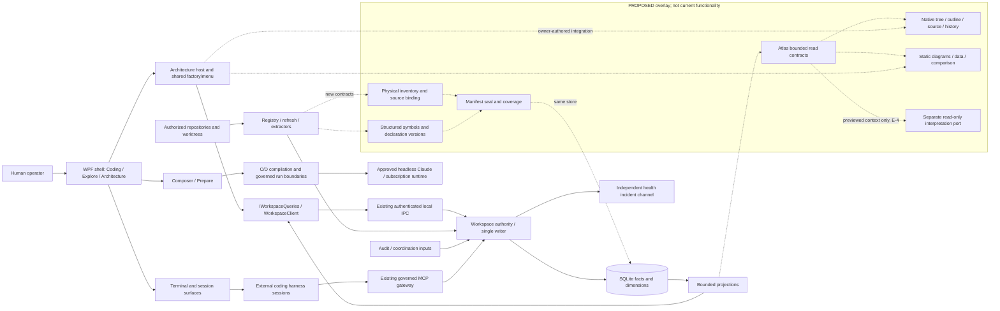
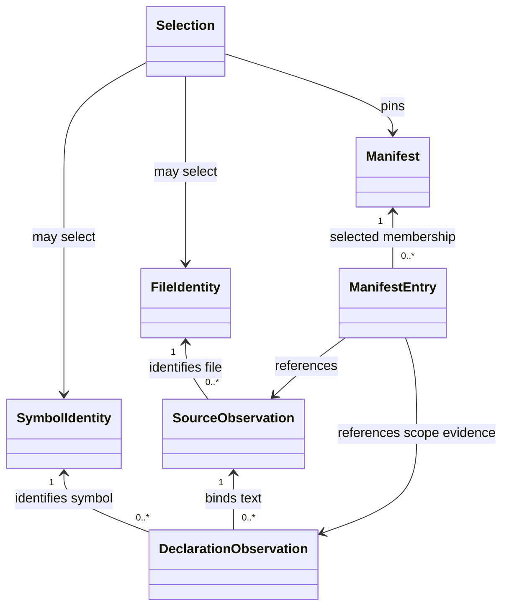
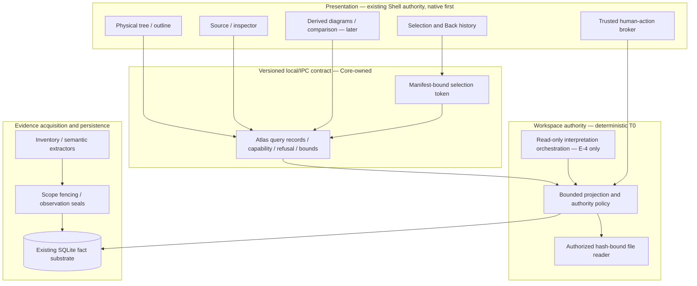

# Code Atlas — PROPOSED, not accepted

**Author:** `atlas-architecture-astra`, 2026-09-12. **Risk tier:** T2.
This is the full architectural proposal, not a claim that Atlas is implemented.
The first delivery horizon is **E-0**, called “E1” in the Owner identity note.
Subsequent **E-1…E-4** names follow the candidate spec. These are different numbering contexts.

## 1. Authority, provenance and document status

| Input | Pinned evidence and how used |
|---|---|
| Existing authority architecture and Core | Worktree base `e42298455b91712b3e8be48201cba005ad5b5003`; `docs/architecture.md`, especially the original component map and §§C/D.1–C/D.5. Its original starter-baseline paragraph is historical, not a current implementation inventory. |
| Candidate specification | Integrated Conductor commit `a50329b23cfebee6e84e2fcf54474fd6e57030dd`, `docs/specs/addendum-e-code-atlas.md`. Initially read at clean `atlas/specification` commit `4b78b2414e6a357a4af17d12258a8d02656e78e3`; then directly compared that exact file to `a50329b2`. The delta splits SourceOnly, 79 Core, 40 Store/IPC and synthetic Roslyn evidence and explicitly denies native/full-suite/registration/production implications; no functional or native-phase requirement changed. Final content verdicts are **not** inferred from a commit. |
| Owner decisions | `docs/notes/atlas-owner/{delivery-horizon,e1-identity,contract-probes,draft-content-while-blocked,reference-custody,lane-admission}.md`, read in Conductor worktree whose HEAD was observed at `e4229845`. Drafting exception permits this document, not acceptance. |
| Contract evidence | `docs/proof/code-atlas-contract-grounding.md` at `e4229845`, including the correction probe and separately executed Store/IPC batch. Embedded results are reviewed evidence, **not this author's independent test execution**. |
| Data constraints and resume | `docs/reviews/code-atlas-data-constraints.md` and `docs/coordination/code-atlas-resume.md`, read as Conductor working-tree inputs on 2026-09-12; no separate committed revision asserted for the resume note. |
| Safe requirements provenance | `docs/notes/code-atlas-proposal-provenance.md` in this branch. No private proposal source, session capture, JSON fixture or proposal history was imported or used as a product fixture. |
| Governing LOA | `.github/knowledge/layered-optimized-architecture.md`, Parts I, II and VII; P1–P11 and C1–C11 use those definitions. |

Graphify output was absent. Grounding followed the available document links:
candidate E → C/D → canonical architecture; Owner identity → K0 → Data constraints;
provenance → reference custody; draft exception → lane admission → blocked-resume ledger.
External candidate/Conductor links resolve only after Conductor joins them. This branch does not
regenerate or alter global indices, registries, audit files or site counters.

**Status is four separate questions:** content review pending; normative registration/acceptance
pending; ownership acknowledgment pending; runtime delivery not admitted. A complete proposal
does not answer any of the other three. The separate Owner, never this author, rules on forks.

**Conductor checkpoint, 2026-09-12:** all spec-content gates on candidate `a50329b2` are clear
for proposed architecture: Security prior blockers cleared; Test Architect PASS-with-conditions
(no blocking fix; one optional redundant row); UX/IA/UI PASS; Data PASS-with-concerns (no blockers).
These are **Conductor-reported review outcomes**, not independent reviews performed by this author.
Final architecture/ADR content gates remain pending and are separate from spec-content clearance,
normative Addendum E acceptance/registration and Core/Claude code acknowledgment.
E-0 still has no mandatory WebView dependency where native WPF suffices; later WebView proof applies
only where the admitted design uses it. The architecture's existing evidence split and phase ledger
already conform to the inspected candidate delta.

The Data concerns are interpreted by the stronger contracts below: a source line is a
version-bound location, **never a logical ID**; supported physical inventory means the authorized
physical scope, **not only extractor-supported languages**; every usable SourceAnchor retains its
content hash/decoder and declaration-version binding. The grain/history/coherence/live-source/
cache/evolution decisions in §§4–6 and the ADRs are proposed choices under final content convergence,
not unresolved concepts delegated to UI code and not already accepted implementation contracts.

**Final content-refinement checkpoint, Conductor-reported:** Data, Security, Distributed Systems
and AI architecture-content gates passed with future implementation conditions. Enterprise,
Patterns and SRE advisory findings are incorporated below; this author does not self-clear their
review or normative acceptance. The separate Owner's turn-5 choices are recorded in §15.1.
Conductor also reports SH2 merged on current main at **`b4e61022`**. This branch's earlier source
map is not evidence of that newer host implementation: after acknowledgment, reconcile the actual
factory/menu/host/SH2 seams against current main **before E-0 design or dispatch**.
E-1…E-4 remain roadmap stages, not work implicitly admitted into E-0.

### 1.1 Decision index

These native IDs were supplied by Conductor after `verify-id-allocators.py` at 37 existing ADRs
with no current duplicate. This author did not independently issue them. Their registration
remains pending. They do not take over the numbered accepted-ADR sequence.

| Exact ID | Isolated PROPOSED document | Decision |
|---|---|---|
| `adr-01M2BBCC9EHCWVR1R4ZCZ7502T` | [identity.proposed.md](../adr/proposed/code-atlas/identity.proposed.md) | Logical file/type/member keys distinct from declaration and content versions. |
| `adr-01M2BBCCAYMNMM1MFH0653Z0XF` | [inventory-source-manifest.proposed.md](../adr/proposed/code-atlas/inventory-source-manifest.proposed.md) | Independent physical inventory, explicit manifests, hash-validated live source. |
| `adr-01M2BBCCCDC207J5KQW74WX2M2` | [fact-substrate.proposed.md](../adr/proposed/code-atlas/fact-substrate.proposed.md) | Reuse generic SQLite facts/dimensions; additive evolution only after proof. |
| `adr-01M2BBCCDZT9CGP0W5YE3YKXDW` | [bounded-native-queries.proposed.md](../adr/proposed/code-atlas/bounded-native-queries.proposed.md) | Typed bounded queries and native Architecture consumption, not shell takeover. |
| `adr-01M2BBCCFJ34ZR3ND7HMHP5QA6` | [comparison-authority-ai.proposed.md](../adr/proposed/code-atlas/comparison-authority-ai.proposed.md) | Pinned comparison, separate authority/origin, governed read-only model port. |

## 2. Frame, scope and alternatives

The user needs two entrances to one evidence space: a real project/folder/file explorer and
visual system/component understanding. Both must lead to the same type/member/source identity
and reversible history. Later views reconstruct static behavior, domain/data and Azure
declarations, then correspondence with authorized intent, without inventing runtime or authority.

The load-bearing question is not which diagram library to use. It is whether every view can name
**which observation, of which source, under which authority and limits** it displays.

| Candidate | Disposition and falsifier |
|---|---|
| Index-node reader with a tree-like skin | Rejected: an unsupported authorized file has no semantic node and disappears. Existing `NodeContent` cannot supply complete physical inventory. |
| Separate graph database and captured repository mirror | Rejected as default: two authoritative stores, unnecessary sensitive retention and synchronization; no measured need. |
| Core-owned physical inventory and structured symbols over existing facts | Proposed: independent inventory, one substrate, bounded projections and explicit source binding. Must survive mixed-generation and live-edit tests. |
| Deliver the whole vision in one release | Rejected: couples independent risk gates and makes E-0 impossible to review as a native journey. Architecture is whole; releases are vertical. |
| Reuse prompt compilation as generic analysis | Rejected: Addendum D's compiled envelope and spawn contract do a different job; development model choice grants no runtime-provider change. |

**Systems sketch:** append-only observations and version records are stocks; enumeration,
extraction, projection, navigation and interpretation are flows. Watcher/freshness feedback can
refresh a scope but cannot declare cross-scope coherence. Delays include extraction, live source
reads, IPC and optional model calls. All loops consume bounded worklists or budgets; interruption
is a disclosed state, never evidence that a complete scan found nothing.

**Exclusions:** code editing, a fourth perspective, replacement of Coding/Explore/Composer,
new graph engine, cloud discovery credentials, fabricated runtime traces, model tool execution,
private-corpus publication, source dispatch before acknowledgment.

## 3. AS-IS whole-system map and Atlas overlay

The following is a **source-grounded logical map**, not a new deployment or runtime test report.
K0 establishes current Core/query/store/IPC seams. Canonical architecture establishes the
surrounding contracts; C/D distinguishes planned/amended shell and compile pieces.
Unexecuted native/compile integration remains Flagged.



| Existing boundary | Evidence / disposition |
|---|---|
| Workspace authority, scopes, freshness and fencing | K0 `WorkspaceCore.cs:127–210`, `StoreWriter.cs:64–95`; complete per-scope commit, not workspace snapshot. Reuse and extend through Core ownership. |
| C# extraction and display members | K0 `CSharpExtractor.cs:170–215,505–568`; `has_member` is capped compartment text, not identity. Preserve old consumers. |
| Source read | Direct read of `NodeContent.cs:1–44` and `ProjectionService.cs:1126–1245`: live file bytes, 256 KiB cap, current result lacks indexed/read hash binding. New contract required; do not relabel this one as version-safe. |
| Generic persistence | Direct `WorkspaceSchema.cs:1–125`: schema v1, generic assertions, append-only desired/committed scope facts, dimension intervals and natural assertion key. ADR substrate conforms to this, not an imagined graph schema. |
| Query and local/remote composition | K0 `IWorkspaceQueries.cs:20–160`, `WorkspaceOperations.cs`, `WorkspaceClient.cs`, `IpcContract.cs`. Atlas extends this seam compatibly, not an App-only reader. |
| Shell and runtime | Canonical architecture §§C/D.1–C/D.5: three perspectives, shared factory/menu, retained Architecture host, separate compile/run boundaries. Existing owners implement integration. The active SH2 lane is not reassigned. |
| Peripheral system | Terminal lifecycle, agent gateway, audit/coordination, incident sidecar and updater remain governed by the canonical architecture. Atlas consumes evidence; it does not claim those subsystems were independently run here. |

## 4. Conceptual and logical model — decided before storage

### 4.1 Bounded contexts and small aggregates

The names refine candidate E §A2, rather than replacing its domain. A “snapshot” below is a
**manifest of observations**, not an atomic operating-system snapshot.

| Bounded context | Aggregate root / invariant | References outside aggregate |
|---|---|---|
| Repository Evidence Inventory | **InventoryObservation**: one authorized enumeration run has a declared root/policy boundary and completion state; absence of semantics cannot erase a visible file. Individual **SourceObservation**: any active anchor is bound to the exact decoded bytes it describes. | Workspace/root, file logical IDs, policy revision. |
| Repository Evidence Inventory — semantic membership | **DeclarationObservation**: one logical symbol's declaration locations belong to named content observations and compiler scope. **WorkspaceManifest**: a sealed manifest references an explicit immutable scope/observation set; it never substitutes a newer scope silently. | Symbol, file, scope snapshot IDs; manifest entries by identity, not an in-memory workspace object graph. |
| Code Atlas Views | **NavigationSession**: tree, outline, source and diagrams share one accepted selection token; a late response cannot overwrite newer selection. View preferences are disposable state, not evidence. | Manifest, file/symbol/declaration and lens IDs. |
| Static Behavior Reconstruction | **BehaviorObservation**: every static call/control/data-flow assertion cites an originating declaration and source version, or names an unresolved target. | Declaration versions and evidence IDs. |
| Architecture Resource Model | **ResourceDeclaration**: one evidenced resource root per canonical identity; aliases do not create additional roots or grants. | Scope, declaration, software component and alias IDs. |
| Specification Correspondence | **Assessment**: immutable input vector and rule version explain its state. **DecisionRecord**: one accepted/effective statement has a verified authorizing actor or accepted delegation chain and explicit scope; unresolved authority stays unresolved. | Source manifest, clause versions, authority references, predecessor/supersession IDs. |
| Bounded Interpretation Harness | **InterpretationRun**: exactly the previewed, authorized, bounded context may cross the model boundary; origin cannot be upgraded by acceptance. | Context manifest, processing authorization, model/prompt/validator/eval versions. |

Roots do not contain each other. Each append transaction protects one root's invariant.
Manifest entries may be staged as immutable observations; a small seal records their digest,
count and references after completeness checks. Orphaned unsealed entries are not a visible manifest.
This uses eventual consistency across scope observations without claiming a distributed transaction.

### 4.2 One identity vocabulary

| Concept | PROPOSED logical key / meaning |
|---|---|
| Workspace/root | Stable registered WorkspaceId and RepositoryRootId, including the selected worktree identity. Branch name, commit and physical root path are versioned attributes, not substitutes for identity. |
| FileLogicalId | Versioned canonical tuple `(workspace, root, normalized root-relative path)`. No revision, hash, line or display name in the key. Windows path/case behavior must follow the registered root's measured filesystem policy; no unconditional lowercase. Rename means a new path identity unless an explicit evidenced correspondence links versions. |
| CompilationScopeId | `(workspace, root, project logical identity, TFM, declared compilation variant)`. Variant distinguishes relevant configurations; reference/options hashes are observation metadata. Do not use transient Roslyn project IDs or fold two project/TFM compilations together. |
| TypeLogicalId | `(identity-schema, CompilationScopeId, language, symbol kind, Roslyn documentation ID)`. Nested/generic type identity comes from the compiler, not display text. |
| MemberLogicalId | Same scoped tuple with member kind and canonical declaration ID. Overloads remain distinct. Definition/implementation of one partial member share one logical identity and have separate declaration records. |
| DeclarationObservationId | Immutable observation of a symbol declaration: logical ID, file content identity, role, full syntax span, optional body span, identifier span and extractor version. A line shift creates a new declaration observation, not a new logical symbol. |
| SourceContentIdentity | Hash algorithm/version + exact byte hash + byte length; encoding/decoder version separately identifies the decoded text used by Roslyn and UI. A source-read observation also records file, time, read mode and verification state. |
| ManifestId | Immutable selected inventory and scope-snapshot vector, seal revision and policy identity. Git revision is optional context; dirty/mixed state cannot be reduced to a single commit. |

Keys use an unambiguous versioned canonical tuple encoding, not string concatenation with
unescaped separators. If compact hashes are used as indexes, retain/check the full tuple on a
collision; the tuple, not accidental hash equality, defines identity.

**C# E-0 mandatory symbol floor, Owner turn 5:** source-declared types; ordinary methods and
overloads; constructors; properties and addressable accessors; partial type/member declaration
navigation, including distinct definition and implementation locations. These cannot be removed
to obtain a passing type-only demonstration. The existing probe covers representative cases,
not every boundary; the admitted design must test the full mandatory floor.

Other unprobed kinds — indexers, fields/constants, events/explicit event accessors, operators/
conversions, destructors and any additional compiler-specific kind — are explicit **staged
obligations**, not advertised E-0 capabilities. Their later semantic-stage admission requires
kind-specific declaration-ID/span tests. Do not convert a future obligation into an E-0 promise
by listing it beside a probed kind.

Implicit/synthesized members, metadata-only symbols, locals, lambdas, local functions, malformed
syntax, unresolved symbols and null declaration-ID creation receive typed capability/availability
states. No display-derived fallback logical member key. Syntax-only occurrences may be navigable
as **version-bound occurrences**, not passed off as stable semantic members. Missing lookup was
executed by K0; null-ID **creation** was not. Partial implementations must traverse both
definition and implementation references, deduplicate identical syntax locations, and never
choose an arbitrary first declaration.

Spans use zero-based half-open UTF-16 text offsets for Roslyn-compatible syntax identity.
Line/column is a derived one-based display, not a key. `identifierSpan`, `declarationSpan`
(syntax excluding unrelated trivia) and `bodySpan` (block or expression, nullable for declarations
without bodies) are distinct. Full syntax references are not proof that every member has a body.
Tabs, CRLF, non-BMP text, BOM, accessor bodies and expression bodies require explicit round-trip
tests. Byte offsets and character offsets must never be interchanged.



This is a conceptual relationship diagram, not proposed C# inheritance or physical table layout.
An empty workspace manifest has zero data entries and a separate required completion seal.
No mutable diagram is a source of truth.

## 5. Inventory, source binding and workspace coherence

Detailed invariant owner: [inventory/source/manifest ADR](../adr/proposed/code-atlas/inventory-source-manifest.proposed.md).

### 5.1 Physical inventory is its own evidence

The authority enumerates **authorized selected physical roots**, not graph nodes. A root's
inclusion policy is versioned and visible. Proposed default: tracked files plus policy-permitted
nonignored untracked working-tree files; ignored categories are disclosed and can be included
through an explicit authorized inventory policy. Git membership is a classification input, not
permission to read or proof of filesystem presence. Missing tracked files remain tombstone
entries; non-Git roots use physical enumeration and mark VCS context unavailable.

Generated, vendor, migration and unsupported are categories, **not blanket physical exclusions**.
A tracked generated/migration/vendor file is still present under this default. Physical pages
carry all allowed records eventually; a page cap is not an omission from the inventory.
Policy may prohibit even metadata: do not leak paths/counts through “excluded” disclosures.
Show a policy limitation with withheld denominator where necessary.

One physical file has one file record; linked/project memberships are distinct relations.
Two projects including the same file do not produce two physical files. Missing tracked files,
inaccessible paths, directory/symlink cycles, case collisions, unreadable directories, deleted files and scan interruption prevent a
false `complete`. No OS shell command is built from a path read from repository data.

### 5.2 Manifest grain and state

**One manifest is one sealed selection of one inventory observation and a finite named vector
of scope generation/revision/content bindings under one visibility policy.**
It records observation window, selected roots, inventory membership digest, extractor versions,
per-scope desired/committed generations, content-binding availability and completion disclosures.
The selector runs against one committed store read boundary; mutable filesystem state is outside it.

Coherence and freshness are separate axes:

| State | Meaning |
|---|---|
| `coherent` | All selected scope observations bind to the declared content set and supported contract versions; no known contradiction. **Not** simultaneous OS capture. |
| `mixed` | Selected scopes or overlapping file hashes disagree, or come from differing refresh targets; retain per-scope revisions. |
| `partial` | Inventory or required scope observations are missing/incomplete; name permitted gaps. |
| `unknown` | Binding or policy facts cannot establish coherence; no inferred coherent default. |
| `current-at-observation` / `stale` / `last-successful` | Freshness relative to known desired/observed revisions; separate from the above coherence state. Wall-clock recency alone does not establish currentness. |

A refresh of A followed by failure in B cannot produce a “new workspace revision” badge.
Existing per-scope fencing is retained; the manifest is the additional cross-scope read contract.
Old complete observations remain available while the new manifest is mixed/partial.

### 5.3 Proposed source policy: hash-validated live reads

**Owner turn-5 content choice: do not persist raw source bodies by default.** Store minimal identity/hash/span/provenance;
read authorized bytes on demand at Core, hash and decode the same bounded buffer used for rendering.
This avoids a private repository mirror and ongoing body-retention cost. It deliberately cannot
promise historical bodies after files change. Back preserves old identities and unavailable/stale
states rather than substituting current source under an old anchor.

Content result variants:

- `IndexedMatch`: read hash/decoder binding matches the indexed declaration; old spans are usable.
- `LiveChanged`: readable current bytes with a different hash; old anchor inactive, optional
  explicit “open live file” action. Re-indexing can produce a new declaration observation.
- `LiveUnindexed`: authorized readable file without matching semantic evidence.
- `Unavailable`, `UnsupportedEncoding`, `TooLargeToVerify`, `Refused`, `ReadUnstable`: typed
  reasons and permitted recovery; no active stale anchor.

Source text is returned only after authorization/path checks; no partial data on a refused read.
The contract carries indexed hash, read hash (nullable only with explicit verification state),
read time, encoding, byte/character bounds, content state and optional validated spans.

The existing contracts supply a 256 KiB content ceiling and a 5,000-node graph-query ceiling,
not permission to allocate that much in every new operation. E-0 design must set
`max_verified_file_bytes`, `max_inventory_rows_per_page`, `initial_graph_nodes`,
`initial_graph_edges` and effective response limits from the admitted workload and real IPC
framing. These values are **unset admission blockers**, not arbitrary new defaults or measured
production constants. Reconcile response-envelope overhead and decoder allocation before code.
Above verification bounds, no whole-file hash is fabricated from a prefix. Content can be shown
only as explicitly unverified live text without semantic highlighting, subject to policy; larger
verified historical reading requires a separately admitted chunk/snapshot strategy.

Within the bound, hold only the returned file buffer and hash state for the request. Validate
post-open resolved file/root identity and policy, use the same opened object through read/hash,
and detect/reject concurrent mutation rather than reopening by string path. Root/junction/symlink,
hard-link policy and Windows replacement races need an **executed native file-handle spike**.
Path-prefix validation alone is insufficient; the concrete safe API is **Flagged**, not invented.
Until that spike passes, this source reader is not admitted.

Strict decoder behavior supports UTF-8 and BOM-declared UTF-16 only after tests; invalid or unknown
encodings are explicit unsupported states, never silent replacement text under a valid anchor.
Continuation tokens bind manifest/file/read hash/decoder/range/query and policy; each continuation
revalidates. Any change invalidates continuation. Limits apply before allocation and parsing.

## 6. Durable representation and evolution

Detailed decision owner: [fact-substrate ADR](../adr/proposed/code-atlas/fact-substrate.proposed.md).
Use the existing per-workspace SQLite generic evidence substrate; no second graph database.
This continues the canonical architecture's intentional dimensional operational-store choice:
history is primary data, not an analytical warehouse and not a shadow audit copy.

| Logical durable record | Grain / key | History and measures |
|---|---|---|
| Identity dimension | One version of workspace/root/file/symbol identity attributes; natural logical ID plus existing surrogate node/workspace version key | Type-2 for meaning-changing kind/root/classification; cosmetic current label may remain existing Type-1. Historically meaningful signature/path display is in immutable observations. |
| Inventory observation fact | One run observing one allowed file/path membership, including absence/category, under one root policy | Append-only; manifest file counts/bytes are semi-additive over observation time, additive only over disjoint files in one manifest. |
| Declaration/source-binding fact | One symbol declaration occurrence on one content observation, with role/span/producer version | Append-only; declaration counts are not symbol counts. Hashes/spans non-additive; no count across partials mistaken for distinct logical symbols. |
| Manifest membership/seal fact | One named observation selected into one manifest; one terminal seal per manifest | Append-only; coverage is derived, non-additive ratio with numerator/denominator and withheld/unknown states. |
| Behavior/resource/clause facts, later | One attributable static relationship, declaration or clause observation at a pinned source version | Append-only; target-state/current-state and static/observed remain separate predicates and origins. |
| Assessment/decision/interpretation facts, later | One assessment of one immutable input vector; one authority/review event; one model invocation/result disposition | Append-only; never mutate origin. Call volume/bytes/tokens/spend additive per unique run; latency distributions and state proportions non-additive. |

E-0 proposes versioned generic predicates and canonical relation values within
`evidence_assertion_fact` and existing node dimensions. Observation identities are immutable
subjects; record fields are attributable typed predicates/objects, never `has_member` parsing.
The existing natural key includes scope/revision/subject/predicate/object/extractor but **not
generation**: observation identity/revision must distinguish different observations; retries
of the same observation must resolve to the same existing assertion, not use `REPLACE`.
A completion/seal record makes a compound observation consumable only when all required fields
exist and validate. This is a logical proposal; exact encoding belongs to the admitted design.

Existing dimensions may expose mutable cosmetic display labels. Historical queries must read
display/signature attributes from their pinned immutable observation, not today's label.
Do not assume the generic assertion table already enforces new dimension-version references.
Producer/reader consistency and interval checks are required now; new FK/table shape is considered
only if real query plans or integrity evidence demonstrate generic facts cannot hold the invariant.

`claim_current_cache` and any Atlas view/materialized index are labelled **rebuildable caches**.
Their cache key includes manifest, policy, query, schema/producer/rule versions and requested
bounds. Drop/replay must reproduce canonical results, including omissions and unknowns, from
retained facts. Source bytes are not a cache-rebuild promise. Compacted/unavailable historical
facts yield explicit history unavailability, not reconstruction from newer facts.

**Evolution:** reuse schema v1 first. If a new physical table/index/migration becomes necessary,
require an executed upgrade/down/replay spike: expand additive shape; compatible reads;
deterministic backfill or unknown; move reads behind capability; compare old/new; contract in a
separate admitted release. Never drop tables or reinterpret old facts here. Rollback disables
Atlas capability and returns to old readers while preserving the appended evidence and original
store. App/daemon compatibility is checked before open; unknown fact vocabulary is not authority.

## 7. Composition and complete read contract

### 7.1 Layered architecture



No renderer reads files, SQL or model providers. No model result calls the broker.
Core computes counts/labels/authority; UI renders the result including inconvenient bounds.

### 7.2 Proposed operations, not existing method signatures

Extend the `IWorkspaceQueries` boundary with versioned operation records or a negotiated Atlas
query facet implemented identically by local and IPC clients. Exact C# names below are
**proposed seams**, not assertions that the methods already exist.

| Operation | Input identity | Required result |
|---|---|---|
| `AtlasCapabilities` | Authenticated workspace/root and caller | Schema/capability versions, permitted roots and supported inventory/language/member/read/view classes; unavailable reasons. |
| `AtlasInventory` | Manifest request or pinned manifest, parent/filter/cursor/bounds | Physical file/folder/project-membership rows, categories, source availability, scan status, continuation and coverage basis. |
| `AtlasOutline` | Manifest + FileLogicalId + optional CompilationScopeId | Independently addressable types/members and all declaration alternatives; no display parsing. |
| `AtlasSource` | Manifest + FileLogicalId + optional DeclarationObservationId + range/cursor | Version-bound source result from §5.3; changed-source refusal/recovery without stale highlight. |
| `AtlasView`, E-1/E-2 | Manifest + altitude/lens + selected IDs + bounds | Typed class/concept/behavior/data/resource projections, edge provenance and unknowns. |
| `AtlasComparison`, E-3 | Left/right manifests + pinned clause/decision set + rule/version | Input vector, direction-correct differences/impact, authority-qualified assessment states, continuation. |

Every successful or partial result preserves **WorkspaceId, RootId, ScopeId(s), manifest/revision
vector, request/selection generation, content state, declaration/span binding, coverage and bounds**.
Common envelope: operation/schema versions, correlation, capability state, `Complete|Partial|
Cancelled|Refused|Unavailable`, stable error code/recovery and typed data. No successful empty
array stands for a timeout, absent capability or policy refusal.

Bounds include requested/effective limit, returned rows/nodes/edges/bytes, known total, omitted
count **or explicit unknown/withheld denominator**, and reason/cursor. Do not claim exact totals
that require an unauthorized or unbounded scan. Sorting is stable by canonical identity after
the semantic filter, before pagination. Tokens cannot broaden policy or be replayed against a
different manifest. Scope IDs are validation input, not client-supplied authority.

Existing operation names and payload behavior stay intact. Negotiate capability and schema
before new requests; unknown operation/version produces the existing refusal model with supported
versions. A legacy daemon disables Atlas with a reason; it cannot silently fall back to a type-only
inventory. Wire payload tests must independently assert every field above across actual serialization.
Raw model/repository exceptions and sensitive paths are not reflected verbatim to unauthorized peers.

### 7.3 Native journey and selection

**Memento-backed navigation history** retains immutable selection snapshots, not source bodies.
A **Generation-Token/request-correlation guard** protects every asynchronous result application.
An immutable selection contains manifest, root/file, optional compilation scope/symbol/declaration,
altitude/lens and navigation generation. View-local focus/scroll, selected partial declaration and
branch/worktree context are carried in bounded Back/Forward entries. New selection cancels old
requests; results are applied only to the matching generation and manifest. Back does not rebind an
old symbol to whichever declaration happens to resolve first today.

E-0 uses native WPF tree/list/source/inspector where existing approved controls suffice. It does
not require a WebView dependency to demonstrate physical source navigation. Shared `CodeViewerView`
can be reused only after its Core owner agrees an explicit binding-aware adapter. Its current
`NodeContent` payload alone is insufficient. Future graph/diagram surfaces use the accepted host,
not an Atlas-specific second docking host or a fourth perspective.

Only a typed **CommandGateway / TrustedGestureCommandBroker** handling an actual human gesture
may navigate, copy or export. This is a closed command boundary, **not an event bus**.
It validates typed object IDs and policy again. Content text, Markdown links, command URIs,
session messages, specs and model output cannot invoke it. Where WebView is later used, no host
objects/direct SDK bridge; deny scripts/navigation from content and use a closed allow-listed
event schema. The App owns the OS clipboard/file picker, not an extractor or model.

Required native evidence: real rail → tree → tabs → inspector → source, file/outline identity
agreement, overload/partial choice, Back restoring focus/scroll, pointer and keyboard, UIA roles/
names/values, high contrast/light/dark, DPI/window sizes, loading/empty/filter-zero/unsupported/
refused/live-changed/error/cancel states. Diagram phases additionally prove synchronized selectable
text alternatives and WebView focus only if they actually use WebView.

### 7.4 Source journey sequence

```mermaid
sequenceDiagram
  actor Human
  participant UI as Native Architecture view
  participant Client as Query client
  participant Core as Authority projection
  participant DB as SQLite
  participant Reader as Authorized source reader
  Human->>UI: Select physical file / member
  UI->>Client: Manifest + IDs + selection generation
  Client->>Core: Versioned AtlasSource request
  Core->>DB: Read pinned declaration and policy evidence
  DB-->>Core: Scope/content binding + spans
  Core->>Reader: Resolve, authorize, read/hash same opened object
  Reader-->>Core: Exact bytes/hash or typed unavailable/refusal
  alt Indexed hash and decoding match
    Core-->>Client: IndexedMatch + validated span + bounds
  else Changed/unverifiable
    Core-->>Client: LiveChanged/unavailable + no active old span
  end
  Client-->>UI: Preserve all identity/coverage/bounds fields
  UI->>UI: Apply only matching generation; retain history
  Human->>UI: Back
  UI->>Client: Previous manifest/selection, never guessed rebinding
```

## 8. Later views: one source of truth at every altitude

**E-1:** system/component responsibility maps are not concrete UML. Concrete class/member
compartments are derived from structured identity and supported syntax. Method-level call sites
reference caller declaration, target member or unresolved target, source span and ordinal;
recursive/repeated calls remain occurrences, not deduplicated type edges. Branch, loop, exception,
cancellation and async continuations are typed static control-flow relations. Depth/path/node
limits produce explicit gap nodes. Dispatch ambiguity produces alternatives, not an invented call.
Source order is not runtime order; no timing/frequency unless separately ingested observed traces.
Existing `Interaction` remains labelled type-level; no renaming it to method execution.

**E-2:** conceptual domain entities/aggregates/invariants require source or accepted specification
evidence; namespace grouping does not invent DDD boundaries. ER keys/cardinalities distinguish
declared schema/ORM facts from inferred conventions; associative entities preserve many-to-many
meaning. Azure resource identity includes declaration scope and supported resource identity;
aliases group only with evidence. Deployment dependency, parent/child, configuration reference,
network rule, explicit grant and observed runtime use are different predicates. A lookup/comment
does not create a grant. A Bicep resource is not automatically a C4 software container.
Absent services stay absent; unresolved identities remain symbolic rather than guessed.

**E-3:** input vector = left/right source manifests, clause/document versions and statuses,
applicable scope, accepted decision lineage, assessment-rule version and coverage basis.
States remain `aligned|planned|contrary|unknown|deferred|not-assessed`, never compliance percentages.
Direction-correct impact follows the declared predicate orientation with an explicit
`dependencies|dependents` direction; reversing the comparison reverses additions/removals, not
the meaning of arrows. Tours are ordered references to pinned selections, not executable scripts.
Export includes versions, origin, authority, source references, bounds and limitations and is
re-authorized for **publication**, independently of processing permission.

Diagrams in this architecture are maintained source alongside their contract sections. Product
views are generated from typed projection records; native diagrams, accessible lists, exported DSL
and inspectors derive from that same result. No editable “derived model” writes back graph truth.
HTML/image generation or renderer byte determinism is not established by authoring Mermaid here.

## 9. Authority, privacy and read-only interpretation

Detailed decision owner: [comparison/authority/AI ADR](../adr/proposed/code-atlas/comparison-authority-ai.proposed.md).

**Origin**, **evidence confidence**, **review disposition** and **authority** are separate fields.
Immutable origin identifies extractor/observed/human/model production. A human accepting an
AI-origin statement adds a human decision/annotation referencing it; the model-origin record
does not become extracted or observed evidence.

An authority resolver evaluates trusted actor provenance, direct root-human authority **or**
an accepted delegation chain rooted in that human, scope, acceptance/effective order and
supersession/conflict. The root human requires no invented delegation. Audit/commit/session
records are carriers; timestamps only order records. An unverified actor name inside a file is
not authentication. Missing acceptance or unresolved competing decisions produces unknown/conflict.
Neither model summary nor today's document status retroactively changes a past assessment.

### 9.1 Complete abstract port, provider unselected

PROPOSED semantic operation:
`InterpretReadOnly(AuthorizedContextManifest, Question, OutputSchemaVersion, Budget, Cancellation)
→ InterpretationOutcome`.
This is not a compiled-envelope operation, a tool gateway or a vendor method signature.

The request names:

- Exact manifest/file/clause/decision versions, hashes and permitted ranges; omitted/redacted
  material and denominator; ordered context bytes or digests with an authorized reproducibility basis.
- Principal and processing authorization, destination/provider/account/model identity, required
  residency/retention/training terms, purpose and consent/confirmation bound to that manifest.
- Prompt/template/schema/validator versions, input/output token and byte ceilings, deadline,
  permitted call count, and spend or explicitly subscription-based budget with quota semantics.
  Unknown required destination/retention terms block dispatch. Estimated tokens/cost are labelled;
  unavailable actual spend is “not recorded,” not zero or a fictional per-token price.
- No tools, no write/navigate/export/clipboard capability, no ambient repository access.

Outcomes are `Proposal|Cancelled|Unavailable|Refused|Invalid|QuotaExceeded|Failed`, with
attributable receipt, measured usage where available, termination reason and citation set.
The validator checks the output schema, bounds and that each citation belongs to previewed context;
unsupported semantic claims remain interpretation, even if their citation syntax is valid.
Quarantine is access-controlled and minimized; rejected raw output is not retained by default.
The user may dismiss/review a valid proposal; any accepted annotation is a separate deterministic
command with principal, idempotency key and audit receipt.

One invocation per explicitly admitted request; no automatic provider fallback, recursive agent
loop or retry on uncertain billing outcome. If a future adapter supports safe retries, its spike
must establish idempotency/cost/cancellation semantics before adding them. Deterministic Atlas
continues when AI is unavailable.

**E-4 gates:** separate external read+run spike for the approved runtime adapter and no-tools
behavior; privacy processing basis and publication distinction; testable budget/cancel behavior;
independent eval against a deterministic/no-model baseline. Include invented/out-of-preview
citations, hostile source instructions, hidden tool requests, conflicting authority, changed
context after confirmation, quota failure, cancellation and model drift. Required security cases
have zero accepted violations in the admission corpus; quality threshold/corpus/version and
sample-size limitations require independent AI/Test/Owner agreement before exposure.

Development Astra/GPT choice does not amend the product headless-Claude/subscription contract.
The architecture selects **no new SDK, provider or transport**. E-4 may adapt an accepted runtime
boundary only after its separate contract is established; C/D compilation's executed contract, if
available, is not evidence for this new interpretation contract.

## 10. Concurrency, failure and trust controls

| Concern | Proposed control and adversarial input |
|---|---|
| Ordering / stale writers | Retain durable desired scope generation+revision fence; manifest references immutable committed observations. A late generation must not replace a newer desired extraction. |
| Backpressure | Bounded enumeration/extraction/query queues; one workspace writer; control requests retain canonical priority. Coalesce obsolete refreshes by scope, never distinct accepted observations. Return busy/retry-after where safe, not empty results. Concurrency values need measured design budgets. |
| Cancellation | Propagate request cancellation across UI/client/Core/read/extraction; no complete seal after cancelled work. Remove queued obsolete reads; ignore stale response generations even if remote cancellation arrives late. |
| Idempotency | Same extraction observation/retry does not double-count assertions; manifest seals and later review/export receipts carry operation identity. A retry that collides with a different payload is a conflict, not overwrite. |
| Query snapshot lifetime | Bound read transaction/request lifetime and avoid holding DB reads while waiting on model/UI. Source reading binds independently; no long-lived SQLite transaction claims filesystem consistency. |
| Disk failure | Existing incident channel reports store failures independently. Preserve last valid manifest; do not report successful refresh when persistence failed. |
| File churn / permission changes | Recheck authorized root/handle and version; cancel or return changed/refused. No stale range applied to new bytes; policy is re-evaluated on continuation, Back, export and model dispatch. |
| Malformed / giant / hostile inputs | Byte/row/depth/deadline limits before parse; strict decoder; typed syntax failure; source/spec/model strings inert. No generated code execution. |
| Unsupported client/daemon | Negotiated capability disabled with stable code; old query endpoints keep behavior. No result shape coercion into plausible defaults. |
| Restart / crash | Replay committed observations/seals; unsealed work invisible; resume freshness checks; cursor expiration explicit. Last successful is labelled. |

### 10.1 E-0 bounded-work admission table

The design must complete every field below **before code admission**, using the agreed workload,
benchmark evidence and Owner/appropriate reviewer ruling. `design-required` means an admission
blocker, not infinity, a library default or a measured number. Queue exhaustion returns an explicit
operator-visible `BudgetExceeded`/busy outcome with affected scope, limiting dimension and permitted
recovery. It must not silently drop work and report a complete scan.

| Work class | `queue_capacity` | `full_mode` | `coalescing_key` | `control_priority` | `max_in_flight` | `deadline` | `metric` |
|---|---|---|---|---|---|---|---|
| Inventory enumeration | design-required, count + buffered bytes | Reject/defer new run visibly; partial current run disclosed | Workspace/root/policy; only superseded unstarted run, never accepted observation | Below control operations; starvation bound design-required | design-required | Run/page/cancel bounds design-required | queue depth/wait, visible refusals, run duration/bytes |
| Semantic extraction | design-required, count + estimated memory | Backpressure/reject explicitly; keep last-successful | Scope + latest desired target; only obsolete unstarted work | Existing control-first rule; fairness bound design-required | design-required by memory/CPU measurement | Scope and cancellation bounds design-required | queue depth/wait, obsolete coalesces, duration, stale rejects |
| Interactive query/source read | design-required, requests + response/buffer bytes | Busy/BudgetExceeded; no successful empty substitute | Navigation session + selection generation + operation; discard obsolete request | Interactive admission cannot starve authority control | design-required | Query/read/cancel bounds design-required | active reads, queue wait, hashed/returned bytes, late drops |
| Writer/manifest seal | design-required, queued requests + payload bytes | Backpressure/refuse before acceptance; never drop accepted command | Same idempotency ID only; differing payload is conflict | Preserve existing control priority; fairness bound design-required | One workspace writer; prove no bypass | Admission/transaction/cancel bounds design-required | commit wait/duration, rejected seals, command conflicts |

Changing a queue bound or `full_mode` after design is a recorded admission change. Tests saturate
each queue, race cancellation/replacement and verify terminal outcomes, fairness and unchanged
complete-manifest semantics. No timing guarantee is inferred from a cancellation token alone.

### 10.2 STRIDE and policy boundaries

| Threat | Boundary / concrete control | Falsifier to execute before admission |
|---|---|---|
| Spoofing | Core derives caller/workspace authority; claims in repo text never grant actor identity. | Forge root-human label in an audit line; authority remains unresolved. |
| Tampering | Content hashes, scoped IDs, versioned canonical records and manifest seals; append-only facts. | Modify file after indexing, mutate a fact, alter cursor query binding. |
| Repudiation | Principal, effective decision lineage, operation ID and receipt; carrier and authority separate. | Duplicate accepted command or cite unaccepted session text as decision. |
| Information disclosure | Authorization before enumeration/read, withheld totals, metadata minimization, separate egress/publication gates. | Symlink/junction/TOCTOU escape; hidden path inferred from count; private export without consent. |
| Denial of service | Bounded queues/reads/graphs/context, cancellation, stable busy result and resource teardown. | Huge file, cyclic symlinks, graph fan-out, model deadline, stalled reader. |
| Elevation of privilege | Trusted gesture broker, inert content, no model tools, no SDK/host-object bridge. | `command:` URI or Markdown/script in source invokes clipboard, navigation, shell or model tool. |

## 11. Instrumentation and cost budget

Extend existing Activity-based query telemetry (`ProjectionService.NodeContent` starts
`aide.projection.query`) rather than inventing a parallel observability stack. Proposed Atlas
spans/counters below are **delivery requirements**, not observed emissions.

| Operator question | Normal-path emitting source | Measures / privacy |
|---|---|---|
| What was scanned, skipped and why? | `aide.atlas.inventory` observation and completion | duration, visible row count, permitted category counts, partial/error/cancel; no raw paths in metric labels. |
| Which revision is this view showing? | `aide.atlas.manifest` seal/projection | state/freshness, scope counts, conflicting binding count; manifest ID in controlled trace, not metric label. |
| Why is source unavailable or stale? | `aide.atlas.source.read` | bytes read/hashed/returned, encoding/state, hash duration, limits, refusal code; hashes only in authorized records, no source body logs. |
| Does IPC/UI lose metadata or run late? | query Activity → client → native render completion | request/selection correlation, cancellation/late-drop count, returned bounds, query/render latency. |
| Is the native journey responsive? | `aide.atlas.navigation` and render measurement | tree open/filter/switch latency histograms, UI-thread stall measurement, history size. |
| How expensive is interpretation? | `aide.atlas.interpretation` receipt, E-4 | model/version/tier, context volume, measured tokens/spend where available, quota, duration, outcome, validator result; unavailable = not recorded. |
| Is persistent growth bounded and recoverable? | store/cache/compaction diagnostics | fact/cache bytes, replay duration, retained observation range, failures and denied purge; no silent history deletion. |

### 11.1 Telemetry contract and privacy budget

Allowed **aggregate metric attributes** are a closed, versioned vocabulary: operation/work class,
phase, outcome, stable error-code category, content/coherence state, capability/schema version and
bounded language/member category with `other/unsupported` buckets. Attributes have a declared
maximum value set and cardinality budget before admission. Workspace/root/file/symbol/manifest/
session/request IDs, hashes, model prompts and arbitrary exception text are not metric labels.

Default emissions are aggregate counters/histograms plus one privacy-minimized run/query completion
record. No default per-file logs, raw paths, source bodies, source excerpts or session/model content.
Controlled traces may carry correlation/request/manifest references only under access-controlled
retention and redaction policy; these are not permission to emit raw paths or bodies.
Per-file diagnostic sampling is off by default. A controlled debug mode requires explicit purpose,
authorization, finite duration, sample/byte caps, retention, redaction and teardown; those values
are design admission fields. Redaction applies before sink emission, including failures.
An aggregate count or bound used to explain completeness is never sampled; optional traces may be
sampled with the sampling decision recorded. Missing measurements remain `not recorded`, not zero.

### 11.2 Store/cache-growth, replay and performance admission

Use the candidate spec's approved workload (approximately 2,500 authorized visible paths or an
Owner-approved equivalent) and existing targets below. No additional numeric success threshold is
invented here. Before E-0 code, record dataset/policy/member counts, machine, warm/cold protocol,
sample count and accepted values for each currently **design-required** field:

| Budget field | What is bounded / admission evidence |
|---|---|
| `max_store_bytes`, `store_growth_bytes_per_manifest` | Retained fact/dimension volume and growth on representative repeated refreshes; counts distinguish unchanged reuse from new observations. |
| `max_cache_bytes`, `cache_growth_bytes_per_manifest` | Rebuildable cache volume separately from primary evidence; cache eviction/rebuild must preserve results and disclose cold-read cost. |
| `retained_manifest_range`, `retention_policy_version` | Authorized queryable history and deletion basis, not an automatic purge target to make a benchmark pass. |
| `max_replay_duration`, `max_replay_peak_memory` | Drop-cache/replay measurements from retained facts, with canonical result/bounds equality. |
| `max_query_p95`, `max_query_peak_memory` | Warm/cold bounded inventory/outline/source queries and their actual SQLite query plans. |
| `max_ui_thread_block`, `max_history_entries`, `max_history_bytes` | Native responsiveness and bounded Memento state; history eviction is explicit and never deletes evidence. |
| `min_free_disk_bytes`, `growth_warning_threshold` | Early warning and safe admission refusal before storage failure; no automatic evidence deletion. |

Every unset value is an E-0 design/Owner admission blocker. On breach, emit the limiting dimension,
observed value/limit where known and scope in a typed **BudgetExceeded** result/health state; preserve
last-successful evidence and offer retry, authorized narrower scope, or a separately approved budget/
maintenance decision. Never auto-drop/purge evidence, hide included files or weaken a required test
to fit a budget. Scope changes create a new disclosed request/manifest, not a silent partial success.

Dedicated schema evolution is triggered only by recorded repeated benchmark failure or an integrity
failure **and** the actual query-plan/replay evidence identifying generic representation as the
cause. First assess existing indexes/bounded query shape. If those cannot meet the accepted budget,
take the additive-schema alternative through Data/Owner review, migration/replay/rollback proof;
database size or a slow UI alone is not evidence that a second graph database is needed.

Candidate E §A10 supplies **targets**, not achieved values: approximately 2,500 authorized paths
on an Owner-approved safe real workspace; tree open p95 ≤2 s, filter and retained switch p95
≤150 ms. E-0 design sets a measurable UI-thread frame budget and resource bounds before code.
Record machine, warm/cold protocol, sample count, percentile calculation and content/policy size.
Do not “meet” latency by omitting allowed files, dropping metadata or silently narrowing fixtures.

## 12. LOA mapping — design obligations, not conformance certification

**Primary F — Copilot Aside Hot Path.** All authoritative work is T0.
**Optional D — bounded Grounded Synthesizer** only in E-4. Existing **C — Tool-Mediated Constructor**
belongs to the wider MCP system, not permission for the read-only port to call tools.
Existing external **H** sessions remain external; Atlas does not implement a T4 planner.

| Capability tier | Atlas allocation |
|---|---|
| T0 deterministic | Inventory, identities, extraction, hashing, policy, persistence/replay, query bounds, authority evaluation, native routing, comparison-rule application and exports. |
| T1 embedded specialist | None admitted. Optional measured reorder-only suggestion later; cannot choose omitted evidence or authority. |
| T2 small model | None admitted. A future suggestion engine needs its own eval and privacy admission. |
| T3 / T3+ model reasoning | E-4 bounded explanation/candidate correspondence; cheapest model meeting independently evaluated quality, no automatic escalation. No provider selected. |
| T4 composed ensemble | Not required for product Atlas; reject until a separate demonstrated need and architecture admission. The development fleet is not a runtime tier. |

Named patterns: **Ports and Adapters** (existing local/IPC query boundary), **CQRS** (one writer,
read-only derived projections), **ImmutableObservation + ManifestSeal** (versioned evidence selection,
not an unproved Event Sourcing system), **Memento** (bounded navigation snapshots),
**Generation-Token/request correlation** (late-result guard), **CommandGateway /
TrustedGestureCommandBroker** (typed human-action boundary, not an event bus),
**LOA 1.4 Hot Path Bypass**, **3.1 Deterministic Verifier**, **4.1 Grounded Context Injector**,
**4.3 Receipt Ledger**, **2.4 Token Budget Throttle**, **2.5 Schema-Constrained Output**,
**5.3 Idempotent Action**, **6.3 Audit Trail**, **6.5 Graceful Degradation**.
No event-sourcing framework, repository abstraction or new dependency is selected just to name a pattern.

| Principle | Proposed realization / proof gate |
|---|---|
| P1 cheapest sufficient tier | T0 everywhere except admitted interpretation; E-4 compares cheaper/no-model baselines. |
| P2 deterministic floor | Hash/identity/authority/coverage/assessment rules never model decisions; mutation tests. |
| P3 cognition vs execution | Model port returns proposals only; broker/acceptance commands independent. |
| P4 tool surface over codegen | Existing typed Core query surface; no generated integration code executed. |
| P5 verification over plausibility | Byte binding, schema/citation checks and independent claim review; valid citation is not truth promotion. |
| P6 adversarial high-stakes review | Separate Data/Security/Distributed/AI/Test/native reviewers after spec repair; still pending. |
| P7 state at edges | SQLite observations, query identity and navigation state; model receives bounded context only. |
| P8 idempotency | Observation/manifest/review operation identity; duplicate and conflicting-payload tests. |
| P9 typed boundaries | Versioned operations, results, states and model schema; unknown variants refused. |
| P10 audit | Normal-path correlated receipts, privacy-minimized inputs/outputs/version references, usage and disposition. |
| P11 delegated identity | Principal and policy at Core/broker/egress; direct human root or accepted scoped delegation, no ambient widening. |

| Criterion | Required implementation evidence / current status |
|---|---|
| C1 tier annotation | E-4 initiator annotated T3/equivalent; no Atlas model initiator exists in this change. |
| C2 budget propagation | Budget reaches every model call/cancel path; E-4 pending. |
| C3 Activity + receipt | Observe every admitted invocation's Activity and receipt including failures; pending. |
| C4 typed boundaries | Golden wire records and schema-refusal tests for local/remote operations; pending. |
| C5 verified side effects | No model side-effect port; human broker/acceptance validates and authorizes; negative tests pending. |
| C6 idempotency keys | Persistent review/manifest commands use IDs; replay/conflict tests pending. |
| C7 fallback declaration | Last-successful, unavailable, unsupported and deterministic-no-AI paths explicit; tests pending. |
| C8 pattern naming | Implemented types identify the applicable patterns without speculative framework; code review pending. |
| C9 anti-pattern absence | No god-context, private fixture, second truth store, prompt-compiler reuse or unbounded agent loop; implementation review pending. |
| C10 audit completeness | Admission receipt join includes input refs/output disposition/model/version/usage/principal; data-retention policy controls raw text; E-4 pending. |
| C11 principal propagation | Core query, broker, export and future egress evaluate requesting principal and record decision; security tests pending. |

## 13. Vertical delivery ledger and proof obligations

**Every row is a user capability, not a horizontal scaffold.** Later stages remain unbuilt and
not admitted when E-0 exits. No static private fixture or screenshot closes a native stage.

| Phase | User capability and dependencies | Real vs mocked seams at exit | End-to-end test and human demo | Admission |
|---|---|---|---|---|
| **E-0 Physical Atlas** | Authorized file tree → scoped type/member → exact source → Back; inventory independent of semantics; manifest/content states. Requires spec/architecture content gates, native source safety spike and Core/Shell acknowledgment. | Real enumeration, Roslyn, SQLite, query serialization and native host. Fault injection may simulate read failures/races; product data is a selectable authorized workspace, not injected fixture JSON. Use actual daemon route if that is deployed composition. | `E0-JOURNEY`: unsupported/generated/vendor/migration + overload/partial + two projects + edit-after-index + A-new/B-failed. Verify same manifest/IDs/bounds through store→wire→tree/outline/source/inspector/history. Human keyboard/pointer demo plus UIA/theme/DPI and measured latency. | Separate Owner design/dispatch and final horizon exit; current drafting exception is insufficient. |
| **E-1 Static views** | Visual overview → component/concept → concrete UML/member → bounded sequence/activity/data flow → source/return. Requires E-0 identity/source foundation and semantic/diagram contract spikes where unfamiliar. | Real supported extraction, query and renderer; unknown dispatch/runtime deliberately unresolved. Safe synthetic cases supplement real-workspace journey. | `E1-BEHAVIOR`: repeated calls, overload targets, recursion, branches/error/cancel/async ambiguity, truncation and accessible alternative agreeing with diagram. Human visual-first drill-down, no runtime-order claim. | Separate Owner admission; UML/modeling, graph UX, native/a11y and Test gates. |
| **E-2 Data/Azure** | Domain/ER/layer/component + named Azure declarations with aliases and distinct relationship types. Requires E-1 presentation and source-bound data/infra producer contracts. | Real schema/source/infra input; no mocked deployed Azure inventory presented as observation, no cloud credentials required by declaration-only mode. | `E2-DATA-RESOURCE`: keys/cardinalities/M:N, alias identity, absent service, unknown resource, config-vs-grant-vs-runtime distinction. Human source/diagram inspection. | Separate Owner admission plus Data/UML/Security/domain contract gates. |
| **E-3 Comparison** | Compare pinned implementation/intent, decisions, directional impact, guided tours and minimal provenance export. Requires stable historical records and authority/retention policy. | Real versions/clauses/authority references; synthetic conflicts exercise negatives. Missing history stays unavailable, no invented source recovery. | `E3-CORRESPONDENCE`: target vs current, unknown authority, direct human and accepted delegation, supersession/conflict, reverse comparison and impact direction, export denial. Human side-by-side review and approved export readback. | Separate Owner authority/retention decision plus Data/Privacy/Security/Test gates. |
| **E-4 Interpretation** | Preview → confirmed read-only explanation/candidate mapping → validated proposal → human disposition. Depends on E-0 and the feature's E-1/E-2/E-3 context; no automatic requirement to send all context. | Real approved runtime adapter with executed no-tools/cancel/quota contract; replay mocks only for deterministic tests, not external conformance proof. | `E4-GOVERNED`: actual sanitized authorized call + receipt, context mutation, malicious content/output, invalid citations, quota/cancel, model drift; independent eval and human preview/reject demo. | Separate provider/processing/eval/model-version admission and Owner exit; no reuse of compile gate as generic evidence. |

### 13.1 Red-first control matrix

Test names below are **proposed**, not files claimed to exist. Every control must first fail on
an intentional violation/old path, then pass through the real seam; this draft ran none.

| Control | Failing input / oracle | Protects |
|---|---|---|
| `InventoryIsNotSemanticNodes` | Authorized unsupported file absent or duplicated under two project memberships. | US-E1.a–d; physical completeness. |
| `ScopedSymbolsAndMovedDeclarations` | Same doc ID in two projects/TFMs; line insertion; partial definition/implementation; overloads/accessors. | US-E2.b–c; no identity conflation. |
| `OldSpanNeverHighlightsNewBytes` | Change source after index or between read steps; CRLF/non-BMP/BOM; decoder mismatch; prefix-only hash. | US-E1.e, SEC-E0-PATH-ESCAPE-SYMLINK-TOCTOU. |
| `MixedScopeManifestIsNotCoherent` | A commits new target, B fails or shares file with differing hash. | US-E13 and manifest invariant. |
| `AtlasWireCarriesBindingsAndBounds` | Delete Scope/revision/span/contentState/coverage/bounds at projection or wire hop. | E2E-A and E2E-D; cross-surface agreement. |
| `NativeSourceJourneyThroughComposition` | Missing factory/menu route, stale response races, Back on unavailable history, focus loss. | US-E2/4 and E2E-C/G. |
| `RebuildFromRetainedFacts` | Delete caches; replay sorted ingress; mutate origin or depend on current labels. | Single substrate, historical meaning and replay. |
| `ContentCannotInvokeBroker` | Script/command URI, Markdown action, crafted session/spec/model text. | SEC-E0-HOSTILE-HTML-URI; native clipboard/navigation/export boundary. |
| `AuthorityIsNotCarrierOrReview` | Timestamp-only note, forged actor, model acceptance upgrading origin, unaccepted delegation. | SEC-E3-FALSE-AUTHORITY / AI-ORIGIN-NOT-UPGRADED. |
| `InterpretationAdmissionAndContext` | Unadmitted model, mismatched preview hash, invented citation/tool request, missing terms or receipt. | SEC-E4-MODEL-CONTEXT-MANIFEST / INVENTED-CITATION-TOOL. |

Testing Strategy union at implementation: deterministic units and boundary/property cases;
real SQLite/IPC integration; schema/wire compatibility; concurrency/cancellation/interleavings;
hostile input and privacy negative cases; real native composition/accessible surface tests;
measured performance; replay/rollback if schema changes; independent model eval only at E-4.
Passing 79+40 existing tests is a baseline, not any of these new controls.

## 14. Exact source/test seam list for Conductor coordination

This is a **change-request list, not a second ownership register**. All broad Core paths remain
Core-owned; all shared factory/menu/host/SH2 files remain with the acknowledged Claude/Shell lanes.
New directories inside an owned tree are not free territory. Acknowledgment must assign exact
authored files and tests; two workers never write the same seam.

| Work item | Existing exact source seams (K0/direct-grounded) | Proposed new authored seams / tests | Required owner |
|---|---|---|---|
| E0 identity/inventory/model | `src/AiDe.Core/WorkspaceCore.cs`; `Extraction/WorkspaceExtractors.cs`, `Extraction/ScopeFingerprints.cs`, `Extraction/SourceRevision.cs` under Core | `src/AiDe.Core/Understanding/AtlasIdentity.cs`, `AtlasInventory.cs`, `AtlasManifest.cs`; `tests/AiDe.Core.Tests/Understanding/AtlasIdentityTests.cs`, `AtlasInventoryTests.cs`, `AtlasManifestTests.cs` | Core carve-out after registration. |
| E0 C# declarations | `src/AiDe.Core/Extraction/CSharpExtractor.cs` | `src/AiDe.Core/Understanding/CSharpDeclarationObservation.cs`; new `tests/AiDe.Core.Tests/Understanding/CSharpDeclarationTests.cs`; regress existing `tests/AiDe.Core.Tests/CSharpExtractorTests.cs`, `TypeMembersTests.cs` | One Core-agreed producer owner. |
| E0 source/bounded projection | `src/AiDe.Core/Projections/IWorkspaceQueries.cs`, `ProjectionService.cs`, `NodeContent.cs`; no incompatible legacy payload rewrite | `src/AiDe.Core/Understanding/AtlasSource.cs`, `AtlasQueryContracts.cs`; `tests/AiDe.Core.Tests/Understanding/AtlasSourceTests.cs`, `AtlasProjectionTests.cs`; regress `tests/AiDe.Core.Tests/NodeContentTests.cs`, `WorkspaceIndexTests.cs` | Core source-policy and query owner. |
| E0 persistence | `src/AiDe.Core/Store/WorkspaceSchema.cs`, `StoreWriter.cs`, `StoreReader.cs` only if design proves needed | `tests/AiDe.Core.Tests/Understanding/AtlasReplayTests.cs`; existing `tests/AiDe.Core.Tests/StoreImmutabilityTests.cs`, `StoreCompactionTests.cs` | Core/Data; no automatic migration task. |
| E0 wire | `src/AiDe.Core/Ipc/WorkspaceOperations.cs`, `WorkspaceClient.cs`, `IpcContract.cs`; daemon composition through existing operation registration | `tests/AiDe.Core.Tests/Understanding/AtlasWireTests.cs`; existing `tests/AiDe.Core.Tests/BoundaryDispatchTests.cs`, `DaemonOperationsTests.cs` | Core/daemon contract owner. |
| E0 native content/history | Core-owned `src/AiDe.App/Workbench/NodeReaderView.cs`, `CodeViewerView.cs` only through agreed adapter | `src/AiDe.App/Workbench/Understanding/AtlasExplorerView.cs`, `AtlasSourceView.cs`; Core model `src/AiDe.Core/Understanding/AtlasNavigation.cs`; new `tests/AiDe.App.Tests/Workbench/Understanding/AtlasJourneyTests.cs` | Explicit Core/presentation carve-out; Shell consumes seam. |
| E0 shared registration/menu/host | `src/AiDe.App/Workbench/SurfaceContentFactory.cs`; actual active `PerspectiveMenu`/`DockHost`/`PerspectiveShell` and SH2 composition files must be resolved against acknowledged current main before dispatch | Existing `tests/AiDe.App.Tests/Workbench/PerspectiveMenuTests.cs`; phase-native tests above. K0's `SurfaceContentTests` exact path was not confirmed here and must be located by Shell, not guessed. | Claude/Shell-authored integration commit; no Atlas edit authority. |
| E1–E3 later views | Existing `Projections/Interaction.cs`, `GraphProjection.cs`, `ProjectionService.cs` under Core; later resource/knowledge producers identified at admission, not broad inventory now | Narrow `Understanding/Behavior`, `Resources`, `Correspondence` contracts/test sets only after their design | Core/Data and registered native view owners. |
| E4 later interpretation | Canonical `src/AiDe.App/Conductor/GovernedRunHost.cs` is a boundary to preserve, not a suggested generic analysis API | Abstract port under `src/AiDe.Core/Understanding/Interpretation/`; concrete adapter path determined only by admitted runtime spike and Conversation agreement | Conversation/runtime owner plus Core/AI/Security/Privacy. |

All “new” names are proposals for the coordination plan, not current symbols.
Do not scan shared files for an unqualified token prohibition that conflicts with C/D:
the negative contract is **no Atlas interpretation routed through compile/envelope/run APIs**,
not “those APIs may not occur anywhere in the shared project.”

## 15. SDK/evidence ledger, gates and remaining forks

**Document checks observed on 2026-09-12:** six isolated files; exact six expected IDs;
proposed status and registry-known types; required metadata; balanced Markdown fences; all
relative Markdown links resolve; no collision with existing tracked document IDs; all P1–P11,
C1–C11 and E-0…E-4 rows present. These are structural checks, not substantive independent review,
Mermaid rendering, a native application run or new product-test proof. The check command did not
write a script into the product tree. Scope readback showed only the six draft artifacts untracked.
Conductor owns audit/index regeneration at join; none ran in this worker.

| Contract | Evidence | What remains unestablished |
|---|---|---|
| Roslyn 4.14.0 | K0 executed loaded assembly 4.14.0.0; overload/project collision, line shift, syntax references and partial definition/implementation output embedded. | Extended member kinds, malformed/null-ID creation, options/TFM normalization, byte/character round-trip. Missing lookup ≠ null ID creation. |
| SQLite `Microsoft.Data.Sqlite 10.0.11` | Direct schema read plus K0's 40 separate Store/IPC tests, including immutability/compaction. | Atlas encoding, sealed compound record/replay/query-plan proof; any migration up/down not run. |
| Existing IPC / query contracts | K0 source citations and separate daemon/boundary suite in that 40-test result. | New Atlas golden payload/capability/refusal/cancel/size-bound behavior. |
| Current Core baseline | K0 79 targeted tests, counts recorded in proof. | Not independent execution here and not a native/Atlas proof. |
| Prior restore | K0 explicitly corrects `--ignore-failed-sources` interpretation. | Network/cache access **NOT RECORDED**; do not call the prior restore offline. |
| Native WPF/source/path controls | Existing host/view source and C/D design read. | Handle-based confinement/TOCTOU spike, full native composition, DPI/a11y/performance and shell acknowledgment. |
| Diagram/data/infra adapters | Existing source architecture and K0 partial projections. | New unfamiliar SDK/renderer/protocol selection requires authoritative read **and run** spike; none selected here. |
| Model/runtime analysis | Product runtime boundary preserved from C/D; abstract port proposed only. | Provider/adapter/no-tools/retention/cancel/quota/eval execution absent; E-4 blocked. |

`GATE atlas-proposed-drafting · 2026-09-12 · separate Owner ruling note-atlas-draft-content-while-blocked · exit criteria: isolated proposed docs only; preserve all barriers · verdict: permitted drafting, not content acceptance.`

`GATE atlas-final-architecture · 2026-09-12 · independent reviews coordinated by Conductor · reported content results: Data/Security/Distributed/AI passed with future conditions; Enterprise/Patterns/SRE refinements incorporated; final convergence/remaining reviews recorded by Conductor · exit criteria: corrected spec verdicts, Owner content choices, complete seam/proof/budget ledger · verdict: PROPOSED CONTENT UNDER FINAL CONVERGENCE, NOT NORMATIVE ACCEPTANCE · vetoes: author cannot clear.`

`GATE atlas-source-dispatch · 2026-09-12 · Claude/Core/Shell acknowledgment plus Owner · exit criteria: req-01M2B86TXF7SHG61B31P4H4173 resolved, section-2 ownership updated, current-main reconciliation, E-0 design/test admission · verdict: BLOCKED.`

### 15.1 Owner content choices — overall architecture remains PROPOSED

**Source:** separate Astra Owner agent `61e506c4-2d12-42e9-85cb-153f2f916811`, **turn 5**,
as relayed by Conductor on 2026-09-12. The five topic titles below identify the choices; Conductor
will record their durable notes. No guessed note path, ruling number or normative acceptance is
introduced. These choices resolve the content forks; they do not grant source permission.

| Owner choice topic | Alternatives considered | Selected content choice and consequence |
|---|---|---|
| E-0 source policy | Hash-validated live reads; captured bodies; commit-object reads with dirty-overlay handling. | **Hash-validated live reads.** Back retains selection/manifest; if matching bytes are gone, old body is Unavailable and anchors disabled. No historical-body guarantee. Captured/commit history requires a future separate admission. |
| Physical inventory boundary | Tracked + authorized nonignored untracked; all authorized including ignored; tracked only. | **Tracked + authorized nonignored untracked, versioned policy.** Non-Git roots enumerate physically. Unsupported/generated/vendor/migration are not blanket exclusions. Missing tracked files, inaccessible paths or cycles prevent a false complete claim; hidden paths/counts remain withheld. |
| Durable representation | Generic versioned facts/seals/replay; dedicated additive fact tables. | **Generic facts + seals + replay first.** Dedicated tables require executed need and additive compatibility/replay/rollback proof; no speculative/destructive migration. |
| E-0 mandatory symbol floor | Mandatory proven-family navigation versus advertising all C# kinds. | **Source-declared types, ordinary methods/overloads, constructors, properties/accessors, partial type/member declaration navigation.** Other unprobed kinds are explicit staged obligations, not advertised E-0 support. |
| E-4 interpretation admission | Separate read-only adapter; product-provider amendment; defer. | **Defer until separate read-only adapter, processing and eval admission.** No product-provider change or prompt-compiler reuse is authorized. |

### 15.2 Resume and handoff

Native request **`req-01M2B86TXF7SHG61B31P4H4173`** remains an acknowledgment blocker.
The request file is a visible log, not injected delivery into another harness. Required parties:
Claude primary conductor (registration/serial integration), Core (inventory/symbol/query/store),
Shell (factory/menu/host/SH2), later Conversation (runtime), and separate Astra Owner
(content/horizon decisions). Silence or lease expiry does not grant authority.

Conductor joins this draft commit with the pinned candidate spec and safe notes, records content
verdicts, the turn-5 Owner choices and allocator provenance, updates the sole ownership register
only after actual acknowledgment, and reconciles actual host seams against current main
(reported SH2 merge `b4e61022`). Only then run E-0 `/design-slice`, settle every design-required
budget field before code admission, and perform
red-first implementation in assigned worktrees. Join serially, append audit through existing
tools, and regenerate derived views after audit. This worker neither edits those shared
artifacts nor claims their gates passed.

**Architecture proof is not production proof.** This document supplies a coherent proposed
contract and falsifiers; only the later executed native/source/store/wire/eval evidence can
establish the product. An explicit future requirement for guaranteed historical bodies would
reopen the selected retention policy. Native safe-reader/query-integrity spikes may still disprove
the minimal implementation of the chosen live-read/generic-fact design; until they pass, no code
admission or runtime guarantee is inferred.

| Completed | Remaining | Best next action |
|---|---|---|
| Whole PROPOSED architecture and five decisions; turn-5 Owner content choices and advisory controls incorporated; Conductor-reported content outcomes recorded. | Final architecture/ADR convergence, normative acceptance/registration/acknowledgment, actual-main host reconciliation, E-0 design budgets/native safety proof and all production delivery. | Conductor join and final proposal convergence against candidate `a50329b2`; preserve the acknowledgment barrier and admit only E-0 design afterward. |
