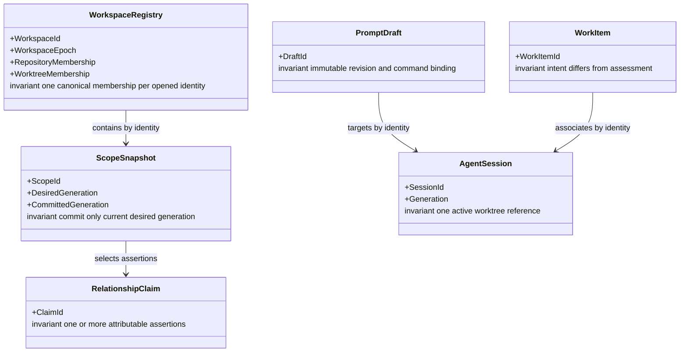

# AI-DE conceptual domain model

## Bounded contexts

| Context | Ubiquitous language | Authority |
|---|---|---|
| Workspace Registry | Workspace, repository membership, worktree membership, workspace epoch | Canonical local scope and daemon ownership. |
| Evidence and Projection | Evidence assertion, scope snapshot, relationship claim, projection | Attributable code/infra/runtime evidence and derived views. |
| Agent Operations | Agent session, session generation, prompt revision, dispatch command, delivery receipt | Terminal lifecycle and user-confirmed prompt transfer. |
| Work Coordination | Work item, coordination claim, assessment | Human work intent plus advisory evidence fold. |
| Audit Reading | Audit reference, classification, integrity state | Privacy-filtered view of source-owned audit records. |

## Aggregates and invariants

| Aggregate root | One invariant it protects | Cross-aggregate rule |
|---|---|---|
| Workspace Registry | A canonical filesystem identity belongs to at most one active membership in a workspace and every command carries the current workspace epoch. | Other aggregates refer only to `WorkspaceId`, membership ID, and epoch. |
| Scope Snapshot | Only the currently desired scope generation **and authoritative artifact revision** can become the committed generation. | Extractors submit immutable assertions by scope/revision; the writer rejects stale generation or revision atomically. |
| Relationship Claim | A displayed claim has one or more attributable assertions with compatible normalized subject/predicate/object. | Claims reference assertions by identity and derive assessment from their selected scope snapshots. |
| Agent Session | An active session has at most one current worktree reference and one generation. | Prompt Dispatch references `{SessionId, Generation}`; a changed generation invalidates a pending command. |
| Prompt Draft | A dispatch command binds exactly one immutable revision, workspace epoch, target session generation, and idempotency key. | Delivery is one at-most-once terminal-stream attempt; a resend after unknown delivery requires human confirmation. |
| Work Item | Declared intent is never overwritten by an evidence-derived assessment. | Claims/receipts are folded into a separate assessment by identity. |

## Logical fact grains and history rules

| Shape | Grain: one row/fact is exactly one… | Key/order | History and additivity |
|---|---|---|---|
| `workspace_dim`, `repository_dim`, `worktree_dim`, `artifact_dim`, `node_dim`, `session_dim`, `agent_dim`, `tool_dim`, `view_dim` | current record for one stable business identity; a version only when history changes a fact’s meaning | natural ID plus mandatory `<Entity>Key` surrogate version key; `valid_from`, `valid_to`; deterministic current flag | Default Type-1 for display-only/current identity attributes. Add Type-2 only for path/root, session generation, or agent/tool policy when existing facts must retain the former meaning. Every fact records the applicable `<Entity>Key`. No stored aggregate measures. |
| `scope_snapshot_fact` | extraction request/commit state for one scope, desired generation, and authoritative artifact revision | `{workspace, scope, generation, artifact revision}`; commit order is daemon ingress sequence | Append-only. The current snapshot is the desired/committed generation and revision pair recorded by the daemon. |
| `evidence_assertion_fact` | extractor/observer statement about one normalized relation at one source revision or observation time | deterministic assertion ID plus `{scope snapshot, source revision}` | Append-only; uniqueness prevents duplicate replay. |
| `claim_assessment_fact` | assessment of one relationship claim from one selected assertion set at one ingress sequence | `{claim, selected scope generation set, ingress sequence}` | Append-only, rebuildable. |
| `command_receipt_fact` | accepted/rejected/completed outcome for one mutating command | `{workspace, caller, command type, idempotency key}` | Append-only; uniqueness makes a retry return the original outcome. |
| `coordination_claim_fact`, `work_assessment_fact`, `prompt_revision_fact`, `delivery_receipt_fact`, `audit_reference_fact`, `trace_observation_fact` | one named advisory claim, assessment, revision, attempted delivery, classified audit record, or observation at one recorded instant | entity identity plus daemon ingress sequence | Append-only. Timestamps are display metadata; folds use ingress sequence and session writer sequence, not wall-clock alone. |

## Store enforcement and rebuild contract

1. SQLite enables foreign keys on every connection.
2. Fact tables reject `UPDATE` and `DELETE` through database triggers/permissions; correction is a
   superseding fact.
3. One writer transaction validates daemon/workspace epoch, scope generation **and artifact
   revision** or command idempotency key, inserts facts/receipts, and updates only labelled
   rebuildable projections.
4. Fact ordering is total: daemon ingress sequence, then deterministic fact ID. Current projections
   replay facts in that order.
5. A fixture replay test rebuilds every current projection from an empty cache and compares it to
   the stored projection. Forbidden-mutation, stale-scope, duplicate-ingest, interval, foreign-key,
   concurrent-writer, backup/restore, and purge tests are required before Phase 1 acceptance.

## Lifecycle

### Migration, query, and retention policy

- Migrations use expand → migrate → move reads → contract. Each version carries forward and down
  scripts; the daemon applies the migration before opening writable workspace commands and
  exercises the down path on a copied fixture database. A backfill that cannot assign a
  deterministic value quarantines the record rather than guessing.
- Dimension tables use a unique natural-ID/current partial index plus non-overlap trigger. A
  database-resident `BEFORE INSERT` trigger rejects a fact whose event time is outside the
  referenced dimension-version interval; the equivalent update trigger exists only for mutable
  projection/cache tables. Fact tables use foreign-key, deterministic assertion/command
  uniqueness, and immutable-row triggers.
- Bounded impact traversal indexes `{workspace, selected scope, subject}` and
  `{workspace, selected scope, object}`; latest-per-key projections index
  `{natural_id, ingress_sequence DESC}`. Phase 1’s fixture corpus contains 10,000 assertions and
  50,000 edges, records `EXPLAIN QUERY PLAN`, and fails if bounded `describe`/`impact` selects
  perform a full fact-table scan or exceed the architecture p95 limits.
- Default retention is workspace lifetime for rebuildable evidence, 30 days for named traces,
  ephemeral for terminal output, and policy-configured for audit metadata/coordination. Deletion
  receipts live in a parent local control ledger retained 90 days, rather than in the deleted
  workspace database.

Workspace deletion is an idempotent command: mark workspace deletion requested, prevent new
commands, remove projections/caches/exports, delete retained local facts according to policy, and
write a deletion receipt. Backups and source repository history are reported separately when they
cannot be purged by the workspace daemon.

Retention expiry and erasure do **not** bypass immutable-fact triggers with ad-hoc row deletes.
They run as an administrative compaction: quiesce the workspace, rebuild a new database from only
retained facts, validate replay/projections, write the deletion receipt to the parent control
ledger, atomically swap database files, then securely remove the former database, WAL, snapshots,
and exports. Restore filters the same expiry/tombstone policy, so a backup cannot resurrect
purged data.
