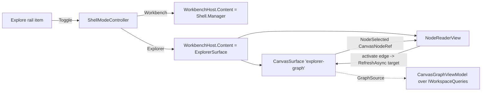

# Knowledge Explorer mode — component design (Phase 1)

Implements `spec-knowledge-explorer-mode` and realises **ADR-0017 Phase 1** (the walking skeleton).
This design resolves the load-bearing mechanism the ADRs deferred to component design, so the
`/implement` is mechanical: the **mode swap**, the **graph hosting in Explorer**, the **selection→reader
seam**, and the **reader stub**, each with its failure modes and its red-first test.

## Scope (Phase 1, per ADR-0017)

**In:** a `ShellViewMode` (Workbench | Explorer); the rail's Explore item becomes the mode toggle; the
body swaps between the docking host and a two-pane Explorer surface (graph | reader) with a splitter;
the reader **follows the graph selection** and shows the node's **metadata + walkable typed edges**;
both panes' empty/loading/error states.

**Out (later phases):** the reader's per-kind **content** (markdown/html/code) — that is ADR-0018's
`NodeContentAsync`, wired in Phase 2 behind the seam this design defines; the full **graph↔reader
keyboard cycle** and **responsive stacking** (US-E8) — Phase 3. This design defines the seams so those
are substitutions, not redesigns.

## Grounding (established, not assumed)

- The composition root (`MainWindow` ctor) sets `WorkbenchHost.Content = Shell.Manager` (the AvalonDock
  `DockingManager`) and holds `Shell` for the window's life (`Closed += Shell.Dispose`). *(Verified —
  `MainWindow.xaml.cs`.)*
- The graph is a `CanvasSurface : ContentControl` — standalone-instantiable as `new CanvasSurface(id,
  title)` — with `GraphSource : Func<string?, CT, Task<CanvasGraph>>`, `RefreshAsync(rootId)`,
  `FocusTarget`, `FocusLeaveRequested`, and `Ready`. `WorkbenchShell.BindCanvas()` finds the pane in the
  layout (`.OfType<CanvasSurface>()`) and wires its `GraphSource` to a `CanvasGraphViewModel` over the
  workspace `IWorkspaceQueries`. *(Verified — `CanvasSurface.cs`, `WorkbenchShell.cs`.)*
- **`CanvasSurface` raises no "node selected" event** to its host today — activation posts `node.activate`
  from the page and the ViewModel refreshes the graph. A reader that follows selection therefore needs a
  **new seam** (below). *(Verified — no such event on `CanvasSurface`.)*

## Decisions

### D1 — The mode swap is a `WorkbenchHost.Content` toggle; `Shell` is never disposed on switch
`ShellViewMode` (a two-value enum) is held by the window (a small `ShellModeController` owns the value,
the toggle, and the body swap, so `MainWindow` stays a thin composition root). Enter Explorer:
`WorkbenchHost.Content = _explorer`. Exit: `WorkbenchHost.Content = Shell.Manager`. **`Shell` is held for
the window's life regardless of mode** (unchanged from today), so switching mode only **unparents** the
`DockingManager` — it does not dispose it.

- **Retain-not-rebuild (the load-bearing invariant, ADR-0017).** When a WPF `HwndHost` (the terminal's
  ConPTY renderer) or a hosted `WebView2` is unparented from the visual tree, WPF **hides the child HWND;
  it does not destroy it** — the ConPTY process and the WebView2 keep running, and re-parenting re-shows
  them. This is the property that makes the swap a view change, not a session loss. **It is stated here as
  a design assumption and is proven, not trusted, by the T1 control below** (a live terminal must survive
  an Explorer round-trip). If the assumption is false for our terminal host, the fallback is to keep the
  `DockingManager` in the tree and overlay the Explorer above it (a `RootLayer` sibling with the docking
  host `Visibility.Collapsed` rather than unparented) — collapse also hides-not-destroys and is strictly
  safer for HwndHost; **prefer collapse-in-place over content-swap if the T1 control is red.**

### D2 — Explorer hosts its **own** `CanvasSurface`; the workbench's graph is not reparented
The Explorer graph region hosts a **dedicated** `new CanvasSurface("explorer-graph", "Graph")` whose
`GraphSource` is bound to a `CanvasGraphViewModel` over the **same** `IWorkspaceQueries` the workbench
uses. **Rejected:** reparenting the workbench's canvas into Explorer — moving a `WebView2`/HwndHost
across visual trees is the airspace/handle-fragility trap, and a surface cannot live in two trees.
- **Rationale:** the graph is **read-only projection data**, so a second view is not a session loss — the
  retain-not-rebuild invariant (D1) is about the *workbench's live processes* (the terminal), which are
  untouched. Cost: a second `WebView2` and a second overview query while Explorer is open — **accepted for
  the skeleton**; a later phase may unify to one canvas if the cost bites (flagged, not solved here).
- The Explorer canvas is created **lazily on first entry** and then **retained** (held by the
  `ExplorerSurface`, `Visibility` toggled with the mode) so re-entering Explorer does not rebuild it
  (US-E6) and its WebView2 initialises once.

### D3 — A new `CanvasSurface.NodeSelected` seam; the reader subscribes to it
Add to `CanvasSurface` (App-owned) a minimal event:
`public event EventHandler<CanvasNodeRef>? NodeSelected;` raised when a node is activated (where the page
posts `node.activate`, alongside the existing navigation). `CanvasNodeRef` is `(string Id, string Label,
string Kind, string? Context)` — the data the page already has. The `ExplorerSurface` wires
`graph.NodeSelected += (_, n) => reader.Show(n, edgesFor(n))`. **This is the Phase-1 seam ADR-0018 sits
behind:** Phase 2 replaces `reader.Show(nodeRef, edges)` with a call that also fetches `NodeContentAsync`,
without changing the event.
- Edges for the selected node come from the **current `CanvasGraph`** the Explorer canvas holds (it
  already carries the neighbourhood's edges), so Phase 1 needs no new query for the edge list.

### D4 — `NodeReaderView` (Phase 1 stub) renders header + metadata + walkable edges
A new `NodeReaderView : ContentControl` with `void Show(CanvasNodeRef node, IReadOnlyList<CanvasEdge>
edges)` and `void Clear()`. It renders, against `DESIGN.md` tokens (chrome + provenance):
- **header** — title (label), a kind chip, a provenance glyph (verified/inferred token, by glyph+label
  never colour alone — US-K5);
- **metadata** — id, kind, context;
- **content area** — the Phase-1 placeholder for a renderable kind (*"Rich content view arrives with the
  node-content query (ADR-0018)."*) — honest about what is not yet wired, not a blank;
- **typed edges** — a keyboard-navigable list; activating an edge calls `explorerCanvas.RefreshAsync(
  targetId)` (the node-walk, US-E4/E5) and the reader follows via D3.
- **empty state** — `Clear()` shows *"Select a node to read it."* (US-E7).

### D5 — The rail Explore item becomes the toggle; active state by more than colour
The existing (decorative) Explore rail button gets a `Click` → `ShellModeController.Toggle()`, and its
active treatment (the accent bar + raised pill already in `MainWindow.xaml`) reflects
`mode == Explorer`. Accessible name and tooltip updated to *"Explorer — graph & reader"*. Escape exits
Explorer **only when no in-surface control owns Escape** (the graph search box). Entering moves focus to
the Explorer graph region.

## Component & data flow

## States (both panes)
- **Graph region:** inherits the CanvasSurface states (loading / empty "nothing indexed" / too-large
  US-K12 / overview) — already built.
- **Reader region:** empty ("Select a node") / showing (header+metadata+edges+placeholder content) /
  **no-workspace** (Explorer entered before a workspace is open → graph shows its empty state, reader
  shows "Open a workspace to explore it").
- **Mode:** entering with no workspace open is valid (both empty states); exiting always restores the
  prior workbench (D1).

## Accessibility (Phase 1 minimal; full cycle **landed in Phase 3**)
- The rail toggle is keyboard-activable, named, active-by-more-than-colour (existing pattern, D5).
- Entering Explorer lands focus in the graph; Escape exits when unclaimed.
- The reader's edge list is keyboard-navigable and edges are keyboard-activable (walk).
- **Phase 3 (DONE):** the graph↔reader **keyboard cycle** is closed. Graph→reader routes the canvas
  boundary `focus.leave` INTO the reader (Forward → reader's first stop; Backward → its last stop).
  Reader→graph returns focus to the canvas when a Tab crosses the reader's boundary — Tab off the last
  stop (Forward) or Shift+Tab off the first stop (Backward) — via `NodeReaderView.HandleTabKey` /
  `BoundaryLeave` (pure, tested) raising `FocusLeaveRequested`, which `ExplorerSurface` routes to
  `graph.FocusTarget.TryFocus()` (guarded on ready/not-obscured). The empty reader (one stop) still
  participates: a Tab either way returns to the graph, so there is no trap in the empty state (US-E7).
  Covered by `Reader_ShiftTabAtFirstStop_LeavesBackward`, `Reader_TabAtLastStop_LeavesForward`,
  `Reader_TabInsideReader_DoesNotLeave`, `Reader_EmptyState_LeavesEitherWay`.
- **Responsive stacking (US-E8) — DONE.** `ExplorerSurface` recomputes its layout on size change: above
  `StackBelowWidth` (760) the panes sit side by side (columns); below it they stack graph-over-reader
  (rows), so both halves stay usable on a narrow single-monitor window. The rule is a pure function of
  width (`ApplyLayoutForWidth`), tested by `Explorer_NarrowWidthStacks_WideWidthIsSideBySide`.

## Test plan (red-first; the union of the applicable Testing-Strategy triggers)
- **T1 — `ExplorerRoundTrip_DoesNotRebuildTheWorkbench` (the key control, mode-level DC-029).** Given a
  live surface in the workbench (a fixture surface whose instance identity is observable — the reconcile
  tests' pattern), When enter Explorer then exit, Then the workbench surface is the **same instance**
  (not rebuilt). Red if the swap disposes/recreates the docking host. *This is the control that proves
  D1's assumption rather than trusting it.*
- **T2 — `EnterExplorer_SetsBodyToExplorerSurface` / `Exit_RestoresManager`.** The `WorkbenchHost.Content`
  is the Explorer surface in Explorer mode and `Shell.Manager` in Workbench mode.
- **T3 — `Reader_FollowsGraphSelection`.** Raising `CanvasSurface.NodeSelected` shows that node's
  metadata + edges in the reader (drives D3/D4). Red before the seam exists.
- **T4 — `Reader_EmptyState_WhenNoSelection`.** `Clear()` / no selection → the "Select a node" state.
- **T5 — `RailToggle_SetsModeAndActiveState`.** Activating the Explore item toggles the mode and the
  active visual/AutomationProperties state.
- **T-focus (if included) — `FocusLeaveForward_FocusesReader`.** From the Explorer canvas, a forward
  boundary leave focuses the reader region (the interim keyboard bridge). Uses the CanvasProbe pattern if
  it needs a real WebView2; otherwise the host-side router test.

The WPF/STA tests use the existing `OnStaThread` / `WithRealizedWorkbench` harness (App.Tests). T1–T5 are
host-side and need no WebView2; T-focus may need the probe.

## Failure modes
- **WebView2 lazy-init on first Explorer entry** — the Explorer canvas initialises its WebView2 the first
  time the surface is shown (D2 lazy create). Handled by the CanvasSurface's own `Ready` gate; the reader
  shows empty until a node is selected.
- **Enter Explorer before a workspace is open** — both panes show empty states (above); no crash.
- **Two overview queries while Explorer is open** — accepted cost (D2); bounded (US-K12) like every query.
- **Assumption D1 false for the terminal host** — caught by T1 (red); fallback is collapse-in-place (D1).

## Handoff
→ `/implement` Phase 1 (this design is the buildable contract). → Phase 2 wires ADR-0018
`NodeContentAsync` behind the D3/D4 seam. → Phase 3 adds the full keyboard cycle and responsive stacking.
The one **cross-session** dependency (ADR-0018's `NodeContentAsync`) is a Core ask already recorded in
`session-contracts.md §4c`; Phase 1 does not need it.

## Gate record
`GATE design-knowledge-explorer-mode · 2026-08-30 · Native-Desktop Developer + Simplifier (peers) / Test Architect + UX & Accessibility (adversaries) · resolves the ADR-deferred mechanism: mode swap (D1, retain-not-rebuild proven by T1 not trusted), own-canvas hosting (D2, no reparenting), the NodeSelected seam (D3), the reader stub (D4); Phase-1 a11y minimal with the focus cycle deferred to Phase 3 · verdict: PASS-WITH-CONDITIONS (D1 fallback to collapse-in-place if T1 red; second-canvas cost accepted for the skeleton) · vetoes: none unresolved — Test Architect's key control (T1) is defined red-first`
