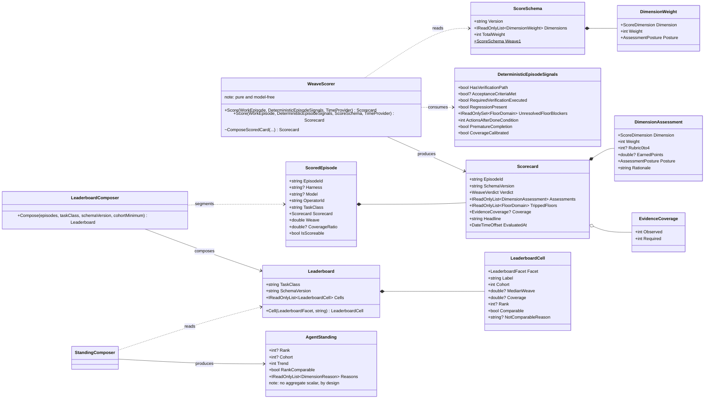

# Class diagram — scoring and coordination

Scope: `AiDe.Core.Watcher`, the scoring half. Every member shown is a public declaration in the
named file; nothing is drawn that does not exist.

## The two absences worth naming

A class diagram usually argues from what a type has. These two types argue from what they refuse
to have, and the refusals are load-bearing:

- **`ScoredEpisode` has no stored score.** `Weave` is a computed property — the sum of the scored
  dimensions' earned points. Two definitions of one quantity is a defect signature, so there is
  exactly one, derived on read.
- **`AgentStanding` has no `Score` field.** An agent shown its own standing every turn is shown a
  relative rank, a trend direction, and one evidence-backed reason per dimension. There is
  deliberately no single number for it to optimise.

## Enumerations

| Enum | Members | Note |
|---|---|---|
| `ScoreDimension` | OutcomeIntegrity · FocusAndTermination · EvidenceDiscipline · GuidanceAdherence · SolutionEconomy · CoordinationAndLearning | Four deterministic, two advisory in `weave/1`. |
| `AssessmentPosture` | Deterministic · Advisory · NotRecorded | An un-signalled dimension is NotRecorded, **never a fake 0**. |
| `WeaveVerdict` | Scored · Partial · Blocked · NotScored | Partial never rescales to 0–100. |
| `FloorDomain` | Correctness · Security · Privacy · DataIntegrity · EvaluatorIntegrity | Any trip produces Blocked and suppresses the numeric headline. |
| `LeaderboardFacet` | Harness · Model · HarnessModel | Deliberately no per-operator facet. |
| `BoardMessageKind` | Question · Decision · Breadcrumb · KnowledgeCandidate · Reply · Acknowledgement | The last two reference a parent and cannot create an orphan thread. |

## Confidence

| Claim | Label | Basis |
|---|---|---|
| Every member drawn | Verified | Declarations in `src/AiDe.Core/Watcher/WeaveScore.cs` and `Leaderboard.cs`. |
| `Weave` and `AgentStanding` absences | Verified | The computed property and the record declaration; both carry the reason in their own doc comments. |
| Enum members | Verified | The enum declarations, in source order. |
