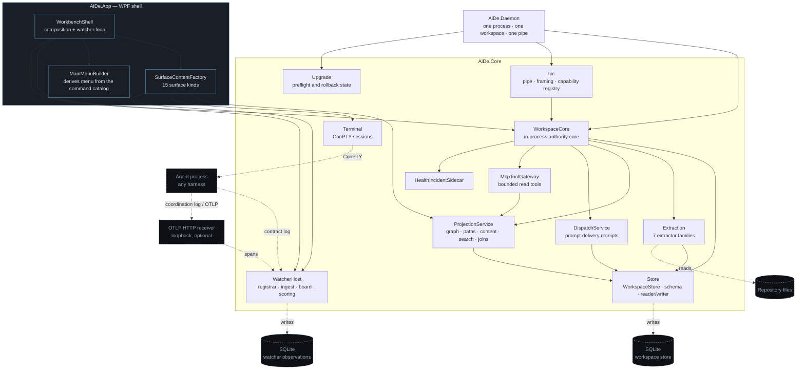

# Component diagram — AI-DE

Every edge below was read from a composition root or a `using` list, not from the architecture
document. Where the architecture names a component that Phase 1 satisfies in-process, the diagram
shows what the code actually does today and the note says what the boundary becomes.

## Boundary notes

| Edge | What it is today | What it becomes |
|---|---|---|
| `AiDe.App` → `WorkspaceCore` | A direct in-process call. `CallerPrincipal` is simply true. | An authenticated local pipe to `AiDe.Daemon`, with the principal established by the transport from the connection and never from anything the caller sends (ADR-0009). |
| `AiDe.Daemon` startup | Takes the workspace lock **before** a pipe exists. | Unchanged — the order is the startup contract. A daemon that served first and discovered second would already have published an endpoint, and two daemons on one workspace are two writers to one store. |
| `Extraction` → repository | In-process adapters, one per language family. | A versioned process/JSON boundary only when an extractor needs language or runtime isolation. |
| `WatcherHost` hosting | In the **same process** as the read surfaces, deliberately: liveness compares monotonic ticks, which are process-relative. | Unchanged while liveness is exact by construction. |

## Confidence

| Claim | Label | Basis |
|---|---|---|
| Assembly and namespace edges | Verified | `WorkspaceCore` constructor, `AiDe.Daemon/Program.cs` using list, `SurfaceContentFactory` constructor parameters, `WatcherHost` fields. |
| External systems at the boundary | Verified | `SqliteWatcherObservationStore`, `WorkspaceSchema`, `ConPtyInterop`, `OtlpReceiver`. |
| The Phase-2 daemon split | Verified as *intent* | Stated in ADR-0009 and in the `AiDe.Daemon` doc comment; the process exists and the split is not yet the shell's default path. |
