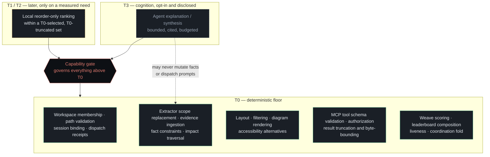

# Layered architecture — capability tiers

AI-DE is a tool for directing models that is itself almost entirely deterministic. That is the
point of this diagram: everything load-bearing is at **T0**, and the tiers above it are optional,
gated, and structurally unable to reach the source of truth.

## Why each capability sits where it does

| Capability | Tier | Why |
|---|---|---|
| Workspace membership, path validation, session binding, prompt dispatch receipt, coordination fold | **T0** | Identity, authorization and audit invariants. A model would make them less deterministic, which is the whole of the objection. |
| Extractor scope replacement, evidence ingestion, fact constraints, impact traversal | **T0** | Compiler, parser and SQL behaviour is authoritative and reproducible. |
| Visual layout, filtering, diagram rendering, accessibility alternatives | **T0** | Renderer output must be testable and stable. |
| MCP tool schema validation, read/write authorization, result truncation and byte-bounding | **T0** | A typed boundary, least privilege and context bounding are deterministic — **and a model never chooses what is omitted**. |
| Weave scoring and leaderboard composition | **T0** | The scorer is pure and model-free by construction: it consumes typed deterministic signals, which is what makes an injection fixture unable to change a score. |
| Reorder-only ranking inside an already-selected result | **T1/T2**, later | Only after a measured need beats a deterministic baseline. It never selects which evidence is dropped and is never on a source-of-truth path. |
| Agent explanation or synthesis over bounded evidence | **T3**, opt-in | May explain what was selected; disclosed, cited and budgeted; cannot mutate artifact facts or dispatch prompts. |

## The rule the diagram exists to make visible

The gate governs **any** capability above T0 — ranking included, not only "explanation". The
distinction that matters is not how clever the tier is but whether it can decide what a human
sees: selection and truncation stay deterministic, so a model can never quietly drop the evidence
that would have changed the reader's mind.

This is LOA P1–P5: deterministic work at the floor, cognition separated from execution, and a
deterministic verifier behind every consequential operation.

## Confidence

| Claim | Label | Basis |
|---|---|---|
| The tier table | Verified | `docs/architecture.md` §"Capability-tier allocation", quoted row for row. |
| Weave scoring is T0 | Verified | `WeaveScorer` takes `DeterministicEpisodeSignals` and a `TimeProvider` and calls no model; `AdvisoryScoring` is the separate, gated path. |
| T1/T2 ranking is not built | Verified | No ranking component exists in `src/`; the architecture marks it "later". |
