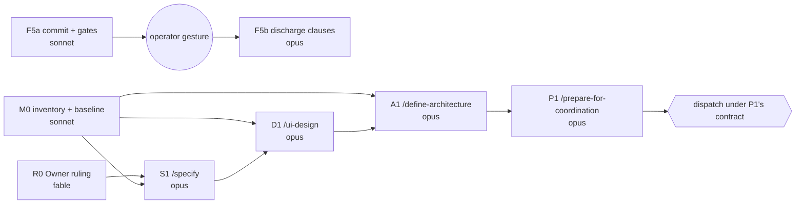

# Execution graph — F5 to the gesture boundary, and Addendum C

## Stage 0 — Triage: plan, do not skip

Two tracks; a fan-out at dispatch; four triggered hard vetoes (**Owner** on a vocabulary collision and
on phasing; **UX Researcher/IA** on the UX layer of a spec; **UX & Accessibility** on a new
user-facing shell; **Test Architect** on every claimed control); one loop with no natural end
(`/ui-design`'s rubric critique). GO16's skip path does not apply.

## Stage 1 — The naive graph

The prompt orders the work as it was thought of: **F5 → specify → ui-design → define-architecture →
prepare-for-coordination → dispatch.** Six nodes in series; the span is the sum; F5 (a docs commit
and a gate run) sits at the head of a chain it has no edge into.

## Stage 2 — Floor nodes, immovable

| Floor | Why it triggers | Node |
| --- | --- | --- |
| **Owner ruling — vocabulary** | Addendum A names *canvas modes* (Console · Artifacts · Profiler · Board) on a **session**. `ShellViewMode { Workbench, Explorer }` (ADR-0017) names a *primary view mode* on the **shell**. Addendum C introduces a third *mode*: the **use case the whole tool is in**. Three meanings of one word is the A3 collision again; a spec that inherits it is wrong on page one. | R0 |
| **Owner ruling — phasing and the F5 boundary** | Addendum C reshapes the shell around the session experience F5 is about to prove. Whether F5's exit stands as Addendum A wrote it, and whether Addendum C is a Phase-1 delivery or the next one, is the Owner's call. | R0 |
| **Owner ruling — ADR-0017** | ADR-0017 makes Explorer a **full-window body swap** that unparents the docking host. Addendum C asks for **every use case inside the same docking architecture** with per-mode surface constraints. That is a supersession, not a refinement. | R0 → A1 |
| **UX Researcher / IA veto** | The UX layer of Addendum C *is* information architecture — what goes where, when. | S1 |
| **UX & Accessibility hard veto** | A new activity bar, contextual menus, and mode switching are keyboard-and-screen-reader surfaces under WCAG 2.2 AA. | D1 |
| **`ui-craft-gate.py` + `design-lint.py`** | The craft floor is a gate (CD1–CD20). It is the *measurement* at D1's Stage 3 and the baseline at M0. | M0, D1 |
| **Simplifier (soft)** | "Mode" is an abstraction that must earn its place against the `ShellModeController` that exists. | S1, A1 |
| **Data & Persistence (hard on migration)** | `LayoutPersistence.cs` persists dock layouts; a per-mode layout changes the persisted shape. Expand-only, with a rollback. | A1 |
| **Test Architect (hard)** | Every spec promise maps to a test; every control is observed red first. | all |
| **Red-first for every claimed control** (CI6) | Including F5's Ruling-49 guard comment: the allowlist test stays at two entries and its *limit* is written down, not asserted away. | F5a, P1's nodes |
| **Audit entries from the node's own worktree** (AL5/AL5b, session-collaboration) | Every substantive node. Never from the primary checkout. | all |
| **Security & Identity** | **Not triggered** — no trust boundary, credential, spawn, or dependency changes in the planning chain. Named so the absence is a decision. Re-check at P1 if an implementation node adds a dependency. | — |

**E7 surface list for the refactor** (written before dispatch, carried by P1 into every implementation
brief): store (`LayoutPersistence`) → model (mode + surface registry) → service
(`ShellModeController` or its successor) → projection (`SurfaceContentFactory`, `MainMenuBuilder`,
the activity bar) → client (`MainWindow.xaml`, `WorkbenchShell`) → UI (the rendered shell) → compute
reader (tests; `ui-craft-gate.py`).

## Stage 3 — Edge classification, and what was deleted

| Edge | Kind | Verdict |
| --- | --- | --- |
| F5 → Addendum C | *assumed ordering* | **DELETED.** F5's Proof Pack is a snapshot citing its sha (the `ui-and-windowing` plan proved this shape once already). F5 writes `docs/proof`, `docs/notes/front-door-*`, one test comment; Addendum C writes `docs/specs`, `DESIGN.md`, `docs/mockups`, `docs/adr`, `docs/plans`. No shared authored file. |
| Owner ruling → specify | **decision edge** | **KEPT — and pulled to the head.** The ruling fixes the vocabulary the spec is written in and the ADR-0017 question. Late, it invalidates the spec; early, it costs one short node. |
| current-state inventory → specify, ui-design | **data edge** | **KEPT — and pulled to the head.** The inventory (surfaces, docks, menus, `ShellModeController`, `LayoutPersistence`, the craft-gate baseline) has no dependency on the ruling or the spec. |
| architecture recovery → define-architecture | **data edge** | **KEPT — collapsed into M0.** Same reader, same files, no independent verification between them (GO13). |
| specify → ui-design | **data edge** | KEPT. Direction before pixels; the design builds to the UX layer. |
| ui-design → define-architecture | **decision edge** | KEPT. The design fixes the surface inventory per mode, which is what the architecture partitions. |
| define-architecture → prepare-for-coordination | **data edge** | KEPT. The plan divides the work by the architecture's components. |
| prepare-for-coordination → dispatch | **data edge** | KEPT. |
| F5a → gesture → F5b | **data edge through a human node** | KEPT. Ruling 49: no harness supplies the gesture. F5b starts when the operator says the run happened. |

## Stage 4 — Work, span, ceiling

**Work `T₁`:** nine nodes plus dispatch. **Span `T∞`:** `R0 → S1 → D1 → A1 → P1 → dispatch`. The
chain is real: every edge on it is data or decision. **The optimization is therefore not width — it is
what came off the chain.** Three nodes that the naive plan ran *inside* S1, D1 and A1 (the ruling, the
inventory, the recovery) now run at the head, concurrently with F5a, so S1 starts with its inputs in
hand rather than discovering them.

**Ceiling check before widening (GO4a):** wave 1's four nodes share no authored file, and three are
read-only. Fan-out overhead is one worktree (already exists for F5) and three agent spawns against
node durations in the tens of minutes. **Widening earns its place; it was not assumed.**

**Cost evidence (audit log `duration_seconds`, this repository):**

| Node shape | Verified | Inferred (model, and the gap that forced it) |
| --- | --- | --- |
| `optimize-graph` | 511 s (n=1) | — |
| `specify` | 65 s (n=1) | **Not credible for a three-layer spec with two vetoes** — the one measured run was a small spec. Model: ~1500 s, from the `skill` median (1374 s, n=5). Gap: one data point. |
| `ui-design` | 1341 s (n=1) | — |
| `define-architecture` | 534 s, 1987 s (n=2) | Plan to the upper figure: this one supersedes an ADR. |
| `prepare-for-coordination` | **no measured run** | Model: ~900 s, by shape (a planning skill reading an architecture). Gap: never run here. |
| implementation node | median 928 s, max 4127 s (n=15) | Per-node budgets are P1's to set. |
| Conductor per node | dispatch + independent verification + commit ≈ 8–10 calls (front-door plan, measured) | — |

**Span, Inferred:** ≈ 300 + 1500 + 1341 + 1987 + 900 ≈ **6,000 s** before dispatch. F5a (Inferred ≈
600 s, a docs commit and a gate set) is entirely off the span.

## Stage 5 — Concurrency, and the contract

**Wave 1 — width 3, at the cap:**

| Node | Goal | Model | Writes | Capability |
| --- | --- | --- | --- | --- |
| **F5a** | Commit the Ruling-49 edits; file Ruling 49 as a note (it is cited in three files and filed in none); gates green; stop at the gesture boundary | sonnet | `ai-de-feature-exit-evidence` only | Deterministic mechanics + reasoning |
| **R0** | Owner rules on: the vocabulary (three "modes"), the phasing (does Addendum C touch Phase 1's exit), and ADR-0017's supersession | **fable** | a decision note, via the conductor | Independent review |
| **M0** | Current-state inventory: every surface in `SurfaceContentFactory`, every menu in `MainMenuBuilder`, the dock zones, `ShellModeController`, `LayoutPersistence`'s schema, and `ui-craft-gate.py` over the built app as the baseline measurement | sonnet | nothing (read-only; a findings note handed to S1) | Independent review |

**Independence test:** no data edge among F5a, R0, M0 (checked: F5a's files vs M0's reads; R0 reads
specs and code, writes nothing in a tree). No shared exclusive resource: M0 runs the craft gate
against the *primary's* built output read-only. **Coupling test:** the three are not explorations of
one question; each answers its own. Parallel is not a multiplier here.

**Fan-out contract:** width **3** · transient failure = **report, never retry a node** · per-branch
exit = each node's own exit condition · join rule = **partial is acceptable** — F5a joins nothing;
S1 needs R0 *and* M0, so if either fails S1 does not start and the conductor reports · containment =
F5a in its own worktree; R0 and M0 write nothing under `src/`; **no node runs a repo-wide destructive
command** (DC-120).

**Waves 2–5 — width 1, by data edge:** S1 → D1 → A1 → P1, each a fresh sub-agent in **one**
worktree (`ai-de-feature-addendum-c`), the conductor-programme's "one worktree, N sessions" shape —
isolation is for *concurrent* writers, and these are serial. The boundary between each pair is a
durable artifact (spec · design + mockup · ADRs · plan), which is the re-groundable kind.

**Wave 6 — dispatch under P1's own contract.** P1's output *is* the fan-out contract for the
refactor: width (≤3), per-node worktrees, ownership per `session-contracts.md` §2, seams, join rule.
This plan does not pre-empt it; it re-plans at that checkpoint.

## Stage 6 — Granularity, determinism, transcription width

**Promoted:** R0, from "a question S1 asks" to its own gate. **Collapsed:** the architecture
recovery into M0. **Not collapsed:** S1/D1 (a veto sits between them), D1/A1 (a decision edge),
A1/P1 (different capability).

**Declared shared surfaces, with jointly-satisfiable fail-clauses (GO14a):**

| Surface | F5a's clause | Addendum-C chain's clause | Jointly satisfiable? |
| --- | --- | --- | --- |
| `docs/notes/front-door-*` | F5a may add `front-door-ruling-49.md` | *Fails if* any Addendum C node writes a `front-door-*` note. Addendum C rulings go to **`docs/notes/addendum-c-council-rulings.md`** | **Yes** — disjoint by filename, not by directory. |
| `docs/audit/audit-log.jsonl` | append-only | append-only | **Yes** — union merge by content (`tools/merge-append-only-log.py`), never by hand. |
| `docs/docs-index.js`, `docs/audit/audit-data.js` | derived | derived | **Yes** — regenerate, never merge (DC-060). |
| `src/**` | *Fails if* F5a changes anything under `src/` (its one code file is a **test** comment) | *Fails if* S1–P1 write under `src/` at all | **Yes** — the planning chain is docs-only by construction. |
| `DESIGN.md` | not touched | D1 owns it | **Yes** — single owner. |

**Every verification node declares its oracle:** F5a — the gate set exits 0 *and*
`verify-ruling-citations.py` sees Ruling 49 filed; M0 — the inventory lists a surface the conductor
can spot-check by opening `SurfaceContentFactory.cs`; S1 — every Gherkin story names a falsifying
input; D1 — `ui-craft-gate.py` over the mockup exits 0 and the rubric reaches zero majors; A1 — each
ADR names the alternative it rejected and the test that would show the chosen one wrong; P1 — every
implementation node carries a fail-clause scoped to a *concern*, not a directory.

## Stage 7 — Loops, bounded

| Loop | Variant | Floor | Exit | Cap |
| --- | --- | --- | --- | --- |
| D1 rubric critique | count of findings at severity ≥ major, strictly decreasing | 0 | 0 majors **∧** `ui-craft-gate.py` exit 0 **∧** a11y floor met | 3 |
| S1 / A1 council review | unresolved Blocker findings | 0 | none unresolved in domain | 2 |
| F5a gate fix | failing gates | 0 | full set exit 0 | 2 |
| Implementation red→green (P1's nodes) | failing tests | 0 | green **and** review clean | 3 |

**A firing cap is a defect signal, never a termination argument.** D1 at cap reports its remaining
ranked findings; it does not lower the craft floor.

## Stage 8 — Disconfirm

**Test Architect:** the optimized plan proves everything the naive one proved, plus two things it did
not — the craft-gate *baseline* before the design (M0), and Ruling 49 *filed* rather than only cited
(F5a). No check is weaker. **Simplifier:** R0's promotion earns its place because a wrong vocabulary
costs the whole chain; M0's collapse removes a boundary that bought nothing; the single worktree for
the serial chain removes three worktree creations that bought nothing. **SRE:** the span figure is
Inferred and labelled; the one Verified figure that matters (ui-design 1341 s) is on the chain; no
parallelism is layered on contention because wave 1 shares no file. **Orchestrator:** every triggered
floor is a node; the plan is executable as written; the Owner's model is `fable` per
`.claude/agents/owner.md` (checked).

## Stage 9 — Before and after

| | Naive | Optimized |
| --- | --- | --- |
| Nodes | 6 | 9 + dispatch |
| Span | 6 in series | R0 → S1 → D1 → A1 → P1 (F5, M0 off it) |
| Width | 1 | 3 at the head, 1 on the chain, P1's cap at dispatch |
| Decision gates | 0 explicit | 1, explicit, at the head |
| Loops bounded | 0 | 4 |
| Floors | discovered at the join | 12 named, 1 named-not-triggered |

**Budget:** ~100 conductor calls (10 nodes at the measured 8–10). **Degradation:** a node that
overruns **reports and stops**; nothing drops a gate; S1 without R0 does not start. **Re-plan
checkpoints (GO17):** ① R0 — if the Owner rules Addendum C touches Phase 1's exit, F5b's oracle is
re-examined before the gesture; ② R0 — if ADR-0017 is *retained* (Explorer stays a body swap), D1's
brief narrows to the docking modes only; ③ after A1 — if the architecture puts the mode registry in
Core rather than App, P1's ownership rows change; ④ after P1 — its own fan-out contract replaces
wave 6 here.

## Re-plan record (GO17) — what changed the shape after wave 1

| When | Checkpoint / event | Outcome | Effect on the graph |
| --- | --- | --- | --- |
| R0 | ① phasing | Addendum C does not touch Phase 1's exit (Ruling 51) | F5b's oracle unchanged |
| R0 | ② ADR-0017 | **A third outcome:** retained *and amended* (Ruling 52) — neither branch the plan named | D1's brief carries the amended shape |
| after F5a | operator's gesture attempt | *"I could not see the entry areas"* — a product defect, not evidence | **Detour:** `investigate/composer-input` → INV-0007 (two verified defects: the compiled view starves the editor; a later render loses the page) → `fix/composer-entry-areas` (phases 1–4, merged `5c132902`, DC-137/138) → merged forward into F5's tree (`fa8edc10`) |
| after F5a | operator: contrast recurrence | *"dark fonts on dark backgrounds… a consistent palette"* | **Detour:** `investigate/contrast-census` (a census of the composed shell: 14 of 180 pairings below floor; root cause the leaf `TextBlock` style overriding container ink; `ContrastFloorTests` green on the same commit — DC-135 recurrence) → `fix/contrast-census` phases 1–5 (live) |
| S1 close | council cap fired (pass 2) | New material entered between passes (two operator directives) — a defect signal about the input, not the loop | One bounded pass each: Simplifier cleared; TA held N1(a)(b) + **NB-1** (empty Not-in-scope could never go green against `SpawnContract.Validate`), substitutions applied, re-read, cleared |
| S1 close | operator: tier | *"shouldn't tier be decided by the compilation of the prompt?"* then *"we haven't thought through the compile step"* | **Ruling 63** files over 56's tier clause; tier is a compile-step decoration; the compile step becomes a **named seam** for A1 |
| S1 close | operator ratifies the compile-step proposal | *"yes I am aligned with Addendum D"* | **New node S2 — `/specify` Addendum D — inserted before A1**, in parallel with D1 (own worktree, disjoint files). A1 now covers both C and D. |

**Span after re-plan:** `R0 → S1 → {D1 ∥ S2} → A1 → P1 → dispatch`, with the two detours off the
span (they gate the *gesture*, not the chain). **Width stayed at 3** throughout; the cap was
reached four times and never exceeded.

**Defects the conductor created on this plan, registered:** DC-136 (a merge resolved by
"regenerate, stage everything" left markers in a figure-patched file); DC-113 recurrence 2 (two
gate lines that could not stop); DC-142 (cleanup removed an open node's tree). Each with its
control in the register.

## Stage 10 — Cost vs delivery (filled at close)

_Planned vs actual, rework passes, floors met — appended when the chain closes._
