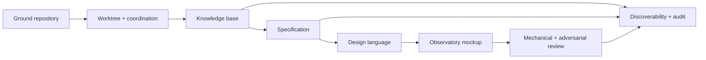

# Execution graph - Loomkeeper session

## Goal state

- **Goal:** establish the watcher concept and give the product owner a reviewable proposal and UI.
- **Done when:** knowledge base, specification, HTML proposal, design language, mockup, review,
  discoverability, and audit/change records exist in a registered worktree.
- **Not in scope:** production architecture or implementation.

## Optimized graph

| Node | Goal | Depends on | Exit condition | Tier |
|---|---|---|---|---|
| G | Ground repo, graph, history, coordination | - | Existing surfaces and active sessions identified | T0 |
| W | Create/register worktree and claims | G | New worktree visible in shared coordination stream | T0 |
| K | Research observability, scoring, learning, coordination | W | Sourced knowledge base passes evidence/privacy/security/simplifier review | T1/T3 research |
| S | Specify Loomkeeper | K | Three-layer spec passes Test/Data/UX/Security/Privacy/AI gates | T2 |
| D | Extend design language | S | Direction, archetype, states, copy, motion, triggers are explicit | T1 |
| M | Build Observatory mockup | D | Self-contained hard-state harness exists | T1 |
| R | Run mechanical and adversarial UI review | M | Token/craft/audit gates pass; residual native risks recorded | T1/T2 |
| C | Connect graph, audit, change, and close coordination | K,S,D,M,R | Derived index valid; append-only records written; claims released | T0 |

## Fan-out contracts

- External research width: 3. Each branch returned cited sources; all joined before synthesis.
- Adversarial review width: maximum 4 per wave. Hard-veto findings blocked the next phase.
- Join rule: all hard-veto reviewers must clear; advisory/soft findings are fixed, recorded with
  rationale, or carried as explicit next-phase conditions.
- Failure containment: one research/reviewer failure does not fabricate a pass; the branch is retried
  or its scope is marked unverified.

## Loop bounds

| Loop | Variant | Floor | Exit | Circuit breaker |
|---|---|---|---|---|
| Knowledge/spec review | unresolved Blockers | 0 | all hard vetoes cleared or recorded as next-phase conditions | 3 correction passes |
| UI refinement | automated Blockers + hard UI findings | 0 | craft/token/in-page audits clean and accessibility veto clears | 3 correction passes |

No cap was used as a termination argument. Each pass reduced the unresolved set.

## Planned vs actual

| Measure | Planned | Actual |
|---|---:|---:|
| Major nodes | 8 | 8 |
| Maximum research/review width | 4 | 4 |
| Hard-gate correction passes | <=3 per artifact | Knowledge 1; spec 2; UI 2 |
| Deterministic controls | docs graph, token lint, craft gate, HTML/JS parse, rendered target/contrast audit | all ran |
| Rework prevented | unknown | identity, score, deletion, keyboard, and partial-state defects found before implementation |
| Completeness/rigor floors | unchanged | met; no hard veto silently dropped |

**Cost status:** wall-clock duration is recorded automatically in the closing audit entry. Model-token
cost is not exposed by the host and remains Not Recorded.

