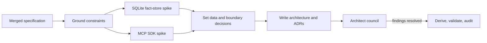

# Execution plan — AI-native IDE architecture

| Node | Goal | Inputs | Exit condition | Tier | Dependency |
|---|---|---|---|---|---|
| M | Merge the reviewed specification. | `docs/ai-ide-specification` branch. | `main` contains `bc50c41`. | T0 | — |
| G | Establish constraints and current baseline. | Spec, knowledge hub, current architecture. | Requirements and conflicts are cited. | T0 | M |
| S1 | Test the embedded durable-store contract. | Isolated SQLite spike. | Transaction, fact constraint, recursive query, and package version are observed. | T0 | G |
| S2 | Test the MCP SDK hosting contract. | Isolated MCP package spike. | Actual package APIs compile and an endpoint starts with a typed tool. | T0 | G |
| D | Set durable representation and component boundaries. | G, S1, S2. | ADR alternatives and consequences are explicit. | T0 | S1, S2 |
| A | Produce the whole architecture and vertical phases. | D, spec. | Architecture plus ADRs satisfy the template. | T0 | D |
| R | Run hard-veto and architecture review. | Architecture/ADRs. | No unresolved Blocker; verdicts recorded. | T3 review | A |
| V | Validate artifacts and record history. | Final docs. | Graph validation, audit/change entries, and proof of document integrity. | T0 | R |

## Bounds

- **Fan-out:** S1 and S2 have width 2, independent working directories, terminal condition per
  spike, no shared production files, and `all-must-succeed` join. A package restore/network
  failure is contained as a Flagged contract rather than retried indefinitely.
- **Review fan-out:** at most 4 reviewers per wave; all hard-veto results are required before
  convergence.
- **Revision loop:** variant = unresolved Blocker/Major review findings; floor = zero; cap = 2
  revision passes. A cap hit is a defect signal, not permission to drop a gate.
- **Cost:** no historic architecture-run timing exists. Time and token estimates are **Inferred**;
  audit start/append records actual wall time.

## Planned versus actual

| Measure | Plan | Actual |
|---|---|---|
| Nodes | 8 | 8 |
| Spike fan-out width | 2 | 2 concurrent SQLite/MCP spikes plus one sequential ConPTY spike after grounding surfaced its load-bearing contract. |
| Review fan-out width | 4 maximum | 4 per wave |
| Rework passes | At most 2 | 4 — cap fired when independent hard-veto findings exposed missing delivery, trust, data, and release contracts; no gate was dropped. |
| Rigor floors | All present | Present: spikes, data model, threat/privacy/release plans, architect council, proof plan, documentation, validation, and audit/change close. |
