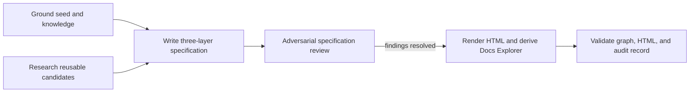

# Execution plan — AI-native IDE specification

## Graph

| Node | Goal | Inputs | Exit condition | Tier | Dependencies |
|---|---|---|---|---|---|
| G | Establish current evidence and invalidate stale seed assumptions. | Seed sketch, knowledge hub, repository architecture. | Claims are labelled and conflicts are recorded. | T0 | — |
| R | Identify reusable, licence-aware candidate projects. | Official repository documentation. | Candidate inventory has official sources and licence notes. | T3 research | — |
| S | State what the AI-native IDE must achieve. | G, R, user scenarios. | One three-layer, testable Markdown spec exists. | T0 | G, R |
| A | Attack scope, model, UX, UI, privacy, and verifiability gaps. | Draft spec. | Mandatory reviewers provide structured verdicts; blocking findings are resolved. | T3 review | S |
| H | Produce a browsable rendering and graph projection. | Accepted Markdown spec. | Self-contained HTML and derived Docs Explorer entry exist. | T0 | A |
| V | Demonstrate artifact integrity. | Markdown, HTML, index, audit log. | Graph validation, HTML structure checks, and audit append succeed. | T0 | H |

## Floors and bounds

- **Immovable floors:** source-grounded claims, a conceptual model, falsifiable functional
  criteria, UX flow/error recovery, WCAG/performance criteria, privacy and trust-boundary
  treatment, adversarial review, derived Docs Explorer index, and an audit entry.
- **Fan-out:** G and R run independently at a width of 2. The review node has a width cap of
  4 per wave; each reviewer returns a PASS, BLOCK, or PASS-WITH-CONDITIONS verdict. A missing
  verdict fails the join.
- **Loop:** review-and-revise has variant `unresolved Blocker/Major findings`; its floor is
  zero; its cap is two revision passes. Hitting the cap is a defect signal and stops with
  unresolved findings reported.
- **Budget and degradation:** no feature scope is dropped to meet the session budget. If a
  source cannot be established, the claim remains Flagged in the spec instead of being
  invented.

## Planned versus actual

| Measure | Plan | Actual |
|---|---|---|
| Nodes | 6 | 6 |
| Parallel width | 2 research/grounding; 4 review maximum | 2 research/grounding; 4 reviewer reassessments |
| Rework passes | At most 2 | 3 — cap exceeded after independent model, UX, security, and privacy review findings; the cap fired as a planning-defect signal, not as a reason to skip the privacy fix. |
| Completeness floors | All present | Present: model, testability, UX recovery, UI/a11y, STRIDE, privacy, graph index, HTML reader, audit pending close. |
| Duration | Inferred: no prior comparable `/specify` duration was read before planning | Measured by the audit start/append pair at close. |
