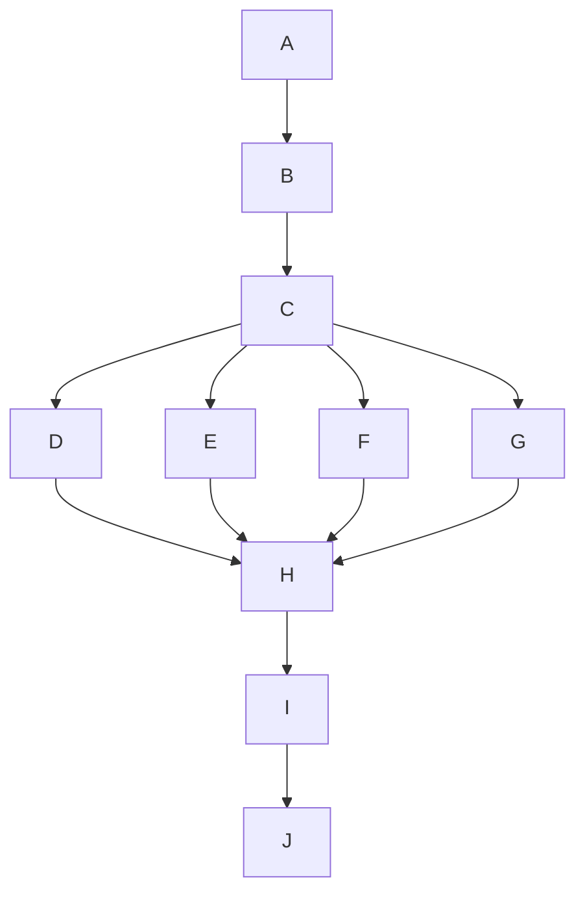

# Completion contract

Goal: clear the exact five integration gates handed off at dd9b338f4670f9ce64d0c38a5e7c196664250d9a.
Done when: actual repairs, negative controls, independent veto clearance, official integrated qualification and prepublication Release are complete; GHCP receives the reviewed candidate for serialized main publication.
Not in scope: E1/E2 expansion, native 46e2f266 qualification, watcher repairs, new ownership policy, peer worktree cleanup or Codex main publication.
Tier T2; fan-out cap four including Astra Owner and Conductor. User explicitly approved the five-gate work-area transfer. Existing Atlas intent and architecture are reused; this graph and the proof record specify the repair slice. No new feature specification is needed.

## Grounding and surface list

Verified: all five supplied gates fail independently in the new tree. Main 901320c4 has four later docs/ruling/audit commits; Owner requires incorporating it before repair freeze. Raw historical qualification remains in the integrator's read-only .artifacts directory. Release was not reached, and no historical green status is substituted for current acceptance.

Affected surfaces: file/handle bounds and filesystem path identity → source authorization → test exception propagation → static scanners → ownership register parsing → audit evidence capture → official integrated test/gate/Release invocation → proof and publisher handoff.

Existing controls and constitution: optimize-graph, prepare-for-coordination, execute-with-coordination; session-contracts §2; session-collaboration; Testing Strategy; Rigor/No-Guessing; end-to-end integrity; continuous improvement. Reuse existing defect classes after source inspection; record class → sweep → derive → prevent in each repair receipt. Invoke investigate for observed failures. Existing UI designs remain frozen; no rendered product change is proposed.

## Execution graph

| Node | Inputs and purpose | Exit / oracle | Dependency |
|---|---|---|---|
| A | Frozen failures, authority, current main; startup records | Scope, exact isolation and measured layer state | None |
| B | Official preparatory docs-only main join | Main ancestor present; merge history and actual failed qualification retained | A |
| C | Audit rows and parser semantics | Exact manifest/design, Owner ruling, independent plan gates | B |
| D | G1 audit capture | Original rows preserved; truthful compliant corrective rows; capture self-tests | C |
| E | G5 ownership parser | Historical non-Path tables accepted; malformed Path rows and prior negative controls rejected | C |
| F | G2/G3 bound and containment | Real cap evidence, at/over-bound oracle, platform path semantics, no broad suppression | C |
| G | G4 harness diagnostics | Assertion headlines and cleanup failures preserved; all STA paths classified truthfully | C |
| H | Returned commits and raw results | Independent Test/Security/SRE/Tech Lead and applicable persona clearance | D,E,F,G |
| I | Official join and current main | Whole required test/gate union and Release; raw outputs inspected | H |
| J | Candidate/proof/empty blocker set | GHCP publication receipt and advertised main ancestry | I |

Naive graph serializes D/E/F/G; optimized graph separates independent artifact work after semantics settle. Schedule at most two worker agents with Owner and Conductor; G follows a freed worker slot. No worker edits shared audit/derived output concurrently. Root coordinates; authors perform repair units. Models: Astra for ownership/path/exception semantics and Owner decisions; Sol high for bounded independent review when adequate. Reviewers never clear their own authored work.

Modeled, not measured: with unit-cost nodes, T1=10, serial span=10, optimized dependency span=7; actual machine/runtime costs are not yet known, so no claimed speedup. Two worker slots and coordination overhead limit realized gain. Main budget initially 60 tool boundaries; each author initially 24, review 16. Budget exhaustion triggers diagnosis/replanning, never dropping gates. No automatic semantic retries; one retry only for a diagnosed transient tool failure. Partial returns remain unaccepted.

Loop variant: unresolved enumerated repair/review predicates decreases toward zero. Two passes without reduction escalate evidence/options to Owner; new findings do not silently enlarge scope. Material main movement, path-manifest change or new gate failure triggers graph reassessment. Final qualification uses GHCP's desktop allocation, never concurrent full App/native runs.

## Planned versus actual

Initial: five red gates reproduced before any code edit. Separate Owner confirmed main-first and sole GHCP publication. Pack doctor: 10 PASS, 3 WARN, 0 FAIL; Python substitution, Copilot context/effort configuration and docs graph freshness warnings retained. Coordination doctor launched; result pending, not a pass. Startup marker began 2026-09-15T22:29:17Z, after initial diagnostics; it does not measure earlier grounding. Independent plan clearance and exact author manifests remain outstanding.
