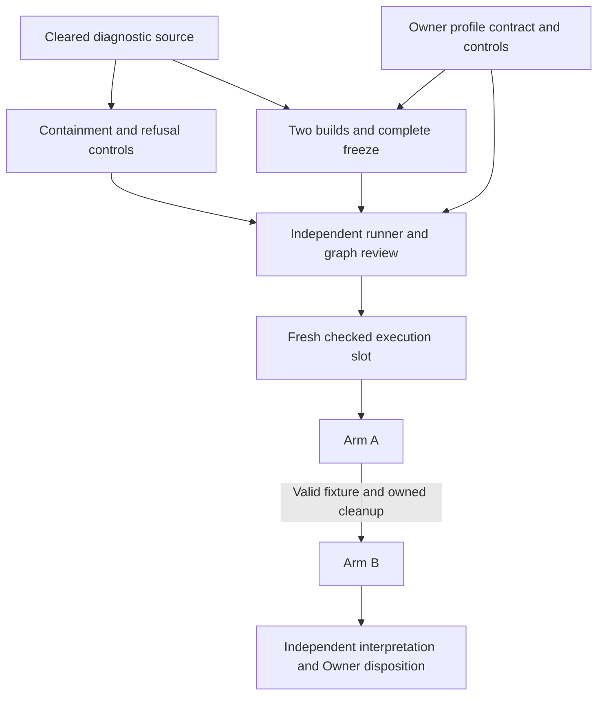
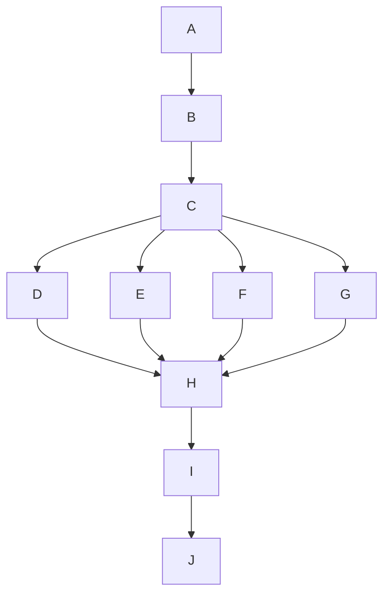
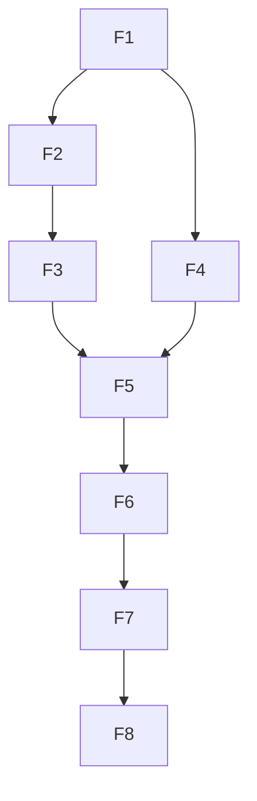
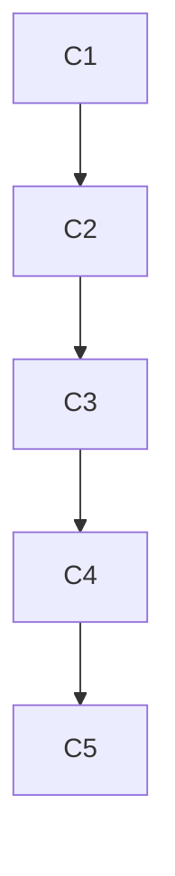
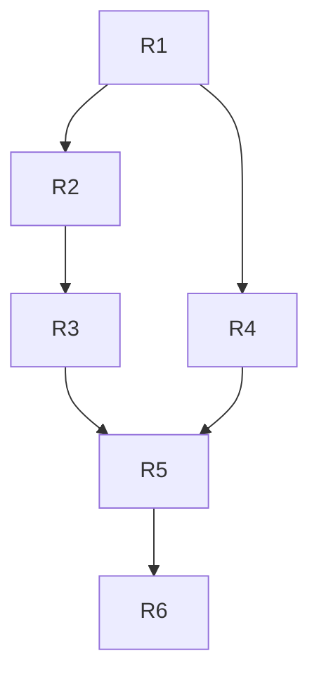

# Current state: A invalid, slot released; bounded observer investigation

Goal: diagnose the process-observer refusal without changing the frozen native experiment.
Done when four bounded harmless fixture cases distinguish observable failure states,
independent review assesses the evidence, and Owner selects the next action.
Not in scope: maintained runner/source edits, native retry, rebuild, manifest refresh,
identity waiver or main publication. Tier T2; fan-out cap4 including Astra Owner
and Conductor. One executing investigation branch; GHCP retains publication.

| Task | Purpose | Verified status |
| --- | --- | --- |
| Five gates and D0 correction | Preserve accepted integration behavior | Reviewed repairs assembled; previous actual gate and 73/73 results retained |
| D1 r3 | Freeze the non-consuming listing boundary | Same-blob producer ACK observed on req-01M2NFTQFRP41JRV68PQSC3AGD; frozen e448383a90bb1ed962c7405af70e16d8cca09fa3 |
| D1 r5 | Freeze proposal authorship with consuming contracts deferred | Consumer and producer ACKs inspected; authorship-only freeze established |
| Native shared receipt | Keep optional observation failures from poisoning original evidence | Source715523d0 independently CLEAR for FR-NO-001 at12c1f883; own21/21 and actual replay inspected |
| Native per-view state | Complete settled loaded/visible evidence for every observed view | Source626d16a2 independently CLEARd31eab23; own21/21 and actual JSON inspected |
| Native qualification / main | Establish combined runtime acceptance before publication | P1-03 App1257/1258; native failure; remaining canonical steps stopped and slot released; independent RCA active |
| Transition experiment | Distinguish loading-time traversal association | One granted attempt stopped A on PROCESS-IMAGE-MISSING; B not run; watcher released; outcome review frozen |
| E1/E2 | Continue admitted Sequence/Activity and architecture view work | Integration remains the priority |

## Current diagnostic outcome

A invalid; B unexecuted. Watcher released the consumed slot. Execution receipt
f8ad3323 and independent outcome receipt 0d8da79160ec8ce3c18b7e857f5b6f3dda8d7f56 are retained.
No native oracle result exists. Owner admits four harmless non-GUI fixture cases
with frozen runner/source/manifests and no retry. The programme Proof Pack records
the material graph re-plan, exact budgets and evidence boundaries.

## Corrected runner clearance

Candidate d679e156 is independently CLEAR at 8e60f415cbb12e3fa15ffe6d315b3b1d5f656e71.
Conductor inspected16/16 controls, nine additional refusals and preserved input
identity. Exact evidence and residuals are in the programme Proof Pack. Next is
a fresh watcher slot; no shown execution or canonical qualification is implied.

## Runner BLOCK and bounded Owner correction — 2026-09-16

Independent receipt 2ab2f0b2bb2ae17ddb9bed5da1da935742bc9873:docs/proof/atlas-p1-03-pair-review.md is BLOCK. Conductor read its
complete text and actual retained probes. Receipt Git-byte SHA256:
c7db15d872ffe87590f4f99c405a5afe983bbee48cc3b567b2baa78ffcf572a2.
Test Architect/SRE findings remain open; Simplifier found no complexity veto.
All ten existing controls also passed independently. The amended graph retained
its real dependencies, independent gates and finite variants; no graph defect
was found and no repeated whole-programme optimization was required.

Verified FR-PAIR-001: harmless process raw creation134340662446557014 versus
CIM134340662446557010. A later sample matched exactly; the defect is precision
dependent, not universal. Verified FR-PAIR-002: injected direct-identity decode
failure propagated without process.json, leaving a Job handle and two retained
process handles open; reviewer explicitly closed them. Flagged FR-PAIR-003:
cmd/git.exe is pinned while installed mingw64/bin/git.exe is absent; actual
downstream dependency consumption still needs measurement. Source inspection
also found that a stack substring is insufficient to classify an original
name-query assertion; emitted-schema classification controls remain required.
Inspected raw probes are retained in local pair-handoff/review-* snapshots.

Astra Owner read the BLOCK and admits one correction unit:16 author calls /
25minutes/checkpoint10, then8 independent-review calls /15minutes. This is a new
bounded unit, not retroactive enlargement of the original18-call preparation.
Official request req-01M2P0VQ6APR7BAG5CBH4ECK2X records the exact boundary.
New session codex-atlas-p1-03-pair-correction uses the ended preparation's isolated
tree under WT1a, preserving its frozen outputs. The same Astra author receives
only run_pair.py, its existing preparation Proof Pack and required own records.
No product/test/tools/shared-runner changes, build/test command, browser/native
execution or canonical/main publication is admitted.

Owner correction contract:
- Identity-record parse/read failures cannot bypass containment, independent
  Job/handle closure, observer shutdown or failure evidence. Preserve primary
  errors and record cleanup errors separately.
- Correlate browser CIM through the same retained Job-owned process handle.
  Require raw creation identity and a nonsignaled process before and after the
  query, plus matching PID and executable. Exit/unavailable/mismatch refuses;
  lossy CIM timestamps remain diagnostic and are never rounded authority.
- Measure harmless Git executable/dependency resolution; add only justified
  consumed mutable installation inputs to the freeze.
- Negative classification requires the exact supported assertion type and
  correlated failed original name-query. Provider, visibility and observer
  faults cannot qualify. Cover emitted-schema order, duplicates, correlation
  and cleanup with actual positive/negative controls.
- Fully verify the old manifest before editing; preserve it and its evidence.
  An explicit successor may change the runner pin and justified dependency
  additions only. Prove every old compiled/runtime input identical. No rebuild
  or silent refresh; unexpected difference returns for Owner disposition.

The independent hard veto is not overridden. Corrected source -> independent
rereview -> fresh watcher execution grant remains the critical path. No human
approval or extra watcher preparation ACK is awaited. Main freshly observed at
bcf4959bc0e0e361736e6a179f05b69fcd0500f8; GHCP retains publication. No native
experiment has run and the canonical P1-03 qualification remains failed.

Reviewer hit the original8-batch budget before administrative close. Conductor
admitted two administrative-only recovery batches without further probes or
source correction; the receipt preserves that overrun. The intermediate claim
of13 nested tools was corrected by the reviewer to10 across the first8 batches.
Root makes no retrospective budget-compliance claim. Historical outgoing r4
notice req-01M2NKJGEJQ2DR9FPKS9T9H403 was resolved as superseded by the already
frozen r5; r4 is never relabeled ACK and no additional peer response is required.

## Frozen pair runner and independent review — 2026-09-16

Verified candidate: 88035753581dd0bab5697e975b6ba1a53543e702 in the isolated
test/atlas-p1-03-uia-pair branch. Conductor read its complete Proof Pack,
actual two Debug build logs (zero warnings/errors), named10/10 harmless controls,
two intended red failures and owned timeout evidence. Timeout control records
three creation-bound identities, lifetime total3/active0, every retained handle
exited and an unrelated sentinel still alive. The earlier7/8 result failed because
job accounting reached zero before the retained handles signaled; the correction
waits on exact handles within the existing cleanup deadline.

Runner SHA2563e816170418907b5b6d624b6e1f6d29950e9e55754284bc1deb3b1356a3f487c;
manifest SHA256ed4f937ba886f57b186ea02b0fa9cf74135bbb7137d5938cf99942d210360314.
Manifest has11625files/1025roots and was frozen after both builds. Conductor ran
the supported full verify command independently and observed PINS-MATCH. Build
source remains1d46d651; src/tests/tools are unchanged between that source and the
runner candidate. Canonical programme source remains626d16a2 and unchanged from
the failed5406ea69 qualification. No experimental source was joined or admitted
to canonical/main. Raw inspected records are snapshotted locally under
artifacts/atlas-five-gates/pair-handoff/; they are not claimed committed payloads.

Author actual17/18calls and1169.24seconds, audit duration1126seconds:
al-01M2P0C59N1VXBZC02CE1DM4QX. Conductor read required audit fields and actual
clean status/own liveness. Author reports all six leases released and session ended.
Independent Astra review is provisioned at the exact candidate in
C:/Projects/ai-de-review-atlas-p1-03-uia-pair, branch review/atlas-p1-03-uia-pair,
session codex-atlas-p1-03-pair-review. Budget8calls/15minutes, no leaf fanout.
Strong reasoning is retained for process custody, cross-API identity and adversarial
evidence parsing. The author cannot clear these Test Architect/SRE/Simplifier gates.

Review targets include actual receipt schema/negative classification, failure
record persistence, complete input boundaries, short-lived process identity,
and the explicitly untested CIM creation-time correlation for actual WebView
runtime/profile consumption. Harmless controls only; no browser/native execution
is admitted during review. The material profile graph remains active; preparation
now exits to independent review, then an exact fresh watcher execution request.
No approval wait from the human or extra watcher preparation grant is introduced.
No slot is active, no native arm has run and P1-03 remains failed.

Operational corrections: the continuation's opening T1 label was wrong; the
existing native unit remains T2. One read-only coord check omitted identity and
returned NOT_CHECKED; it was not used as edit authority and was repeated with the
actual identity, returning ALLOW. Oversized evidence reads and PowerShell collection
count formatting produced truncated output; omitted content was not evidence.
Named bounded rereads recovered the required fields, and this capture validates
JSON object type and scalar counts before recording them. No retrospective root
budget-compliance claim is made. The existing execute marker closes at this handoff.

## Material replan: mutable WebView state versus frozen inputs

Goal: preserve complete immutable inputs and equivalent fresh runtime state for
the two diagnostic arms. Done when the amended runner and its controls receive
independent review; the eventual pair still requires a fresh execution grant.
Not in scope: product/test/shared-runner changes, profile deletion, machine settings,
canonical reproduction or main integration. Tier T2, programme width cap4.

Verified trigger: WebSurfaceHost.cs50-51 uses default WebView2 construction and
EnsureCoreWebView2Async. The prior canonical test output actually contains
testhost.exe.WebView2. A complete immutable-output scan and mutable browser data
there are jointly unsatisfiable during execution. Root read the installed SDK
1.0.3485.44 XML environment-override contract; Microsoft documents both the
executable-adjacent default folder and session sharing for a shared folder:
[user-data-folder contract](https://learn.microsoft.com/en-us/microsoft-edge/webview2/concepts/user-data-folder).

Owner chooses fresh distinct owned absolute profiles outside all immutable roots,
using child-only WEBVIEW2_USER_DATA_FOLDER before launch. Both arms use the same
empty-start policy. Refuse reused paths, overlap and conflicting inherited WebView
configuration. Preserve complete output manifests and added-file refusal; no
.WebView2 exclusion, machine setting or existing-profile deletion. Include selected
WebView runtime path/version/binary identity beside .NET and check across arms.
Actual browser runtime/profile consumption is still a shown-execution obligation;
environment delivery alone cannot prove it. This symmetric setup further limits
canonical comparison and grants no GUI probe. Author retains18calls/25minutes;
any exceeded budget returns precise remaining work, never dropped controls.

Grounding: optimize-graph prompt and GO1-GO7 doctrine read; prior author measured
1430seconds/25of24calls and review about362seconds/12of12calls. New profile/control
durations and token costs are not measured. Named kb-graph-and-loop-engineering
is absent (official context ROOT_NOT_FOUND; file discovery also absent), a flagged
pack gap outside this programme. Official fallback context records the actual edge
plan-atlas-five-gates -> depends-on -> session-contracts. Its bounded packet has
14573bytes,3chunks,141omitted; no complete-history claim. The initial6000byte packet
could not fit the mandatory6268byte envelope;18000bytes admitted the bounded packet.
The optimize-graph marker was started after grounding reads, so its duration omits
those reads; no full-replan timing claim follows.

The naive response stops all preparation for the new profile decision. The optimized
response lets existing harmless Job Object/manifest controls continue: they share
no data, decision or write surface with Owner's read-only profile choice. Profile
environment and runtime-provenance controls wait for that decision. No extra writer
or exploratory agent is added. Every later execution and independent gate remains.

| Node | Inputs and real dependency | Exit oracle | Tier / owner |
| --- | --- | --- | --- |
| F: frozen diagnostic source | cleared c192a7ed/1d46d651 | source pin and43/43 actual independent results | T2 / complete |
| C: containment and input refusal | F | harmless red/green controls; owned-process bound and unrelated-process survival | T2 / Astra author |
| P: profile contract | observed mutable path, installed SDK | explicit Owner decision; child env/freshness/overlap controls and runtime-provenance contract | T2 / Owner + same author |
| M: both builds and freeze | F; final manifest policy consumes P | exact Debug App.Tests and Daemon builds; complete recursive output/runtime/dependency manifest with no exclusions | T2 / same author |
| R: independent runner review | C,P,M and proof/audit | Test/SRE/Simplifier CLEAR, including graph completeness and actual refusal controls | T2 / independent Astra |
| S: fresh checked slot | R, final script/source/binary pins | actual watcher execution grant | T2 / Conductor + watcher |
| A: untreated arm | S | one fresh process, exact original outcome plus fixture/cleanup validity | T2 / future executor |
| B: loading traversal arm | A with proven cleanup | one fresh process; actual Atlas loading ancestry and all pins/validity | T2 / future executor |
| I: interpretation and disposition | both raw outcomes and validity | independent scoped association verdict; Owner scaffold disposition | T2 / reviewer + Owner |

Before: existing seven aggregate stages hid the profile-state conflict. After:
nine explicit nodes; one new state boundary is promoted, no floor removed. Maximum
active width remains4 including Conductor/Owner; actual current working roles are
Conductor, one author and Owner as needed, with review serial after freeze.
Build work may precede P, but final freeze waits for its manifest policy; the diagram
collapses that unverified boundary rather than pretending builds depend on a UI flag.
Inferred symbolic work T1 is the sum of node durations; span Tinf is the longest
dependency path. The only proposed overlap saves at most min(C,P), not a measured
speedup. Tp >= Tinf and ideal bound Tp <= (T1-Tinf)/p+Tinf are models, not timings.
No extra fanout is justified by unmeasured overhead; no reduced verification trades
for speed. Deterministic nodes are C and M; P/R/S/I remain judgment or authority.

Floors: E7 trace source/environment -> immutable manifests + mutable profiles ->
child/job identities -> existing oracle/receipts -> validity classification ->
independent interpretation. Testing-strategy union, red-first controls, refusal
measurement, independent hard veto, audit/change and graph capture remain. Test/SRE
must independently disconfirm this amended graph at R; neither author nor Owner
can self-clear that gate. Scan roots are exact recursively frozen output/runtime
trees, all files, with no wildcard runtime-data exception; mutable profiles are
distinct owned siblings outside those roots. Missing, extra or changed inputs refuse.

Finite control-case count and unreturned node receipts are the decreasing variants.
Arm count is fixed2, each attempted once. A valid negative oracle may lead to B only
after proven owned cleanup. Missing evidence, changed pins, forced cleanup or
180second arm/30second containment expiry invalidate and stop; caps never establish
success. No retry-until-green, automatic dependency install or scope expansion.
Partial outcomes preserve evidence and return precise remaining predicates to Owner.
Transient tool transport may be reported/recovered without replaying an arm.
Replan again only on a concrete incompatible runtime/policy/containment finding.
Actual later timings, cases and budget use are recorded at the author/reviewer join.

## Owner correction: preparation admission is already sufficient

The Owner checked b52c890d and expressly confirmed that its recorded admission,
conditioned on independent CLEAR, authorizes the exact branch-local proof script,
normal builds, manifests and harmless subprocess controls. CLEAR1d46d651 meets
that condition. Authority derives from the user-delegated programme and exact
Owner decision, not an absent ownership entry or watcher silence. The Conductor's
extra watcher-preparation approval gate was an erroneous transcription and is
withdrawn. This paragraph supersedes the earlier "grant must be read" condition.
Request req-01M2NYTSRKJZ22SS0KR0PBKAS6 preserves its original history and is resolved
by the Conductor as a preparation-status notice; no watcher approval is fabricated.
Exact paths,18/25minute author and8/15minute reviewer budgets, isolation and leases
remain. No shown arms/product/test/shared-runner/canonical/main action is admitted.
Independent runner review and a fresh checked watcher EXECUTION slot still gate
every experimental arm. No human response or extra preparation ACK is awaited.

## Independent preparation CLEAR and next runner boundary — 2026-09-16

Verified: independent review1d46d651cd5b6356e05545115757ba7eb7ffbf45 clears
Test Architect/SRE/Simplifier for experiment-only preparation atc192a7ed.
Conductor read the whole committed receipt, source-backed disconfirmation and
actual independent TRX43/43/0, with identical population to author/discovery.
Receipt Git-byte SHA2569b15021378d7587572a1a918fa09eb54398aa402883cc627eb84d053c1b417c7;
working-file SHA256d2bda47ef6ae36efb54f9ca6e45300e25e1f3d1f9c3e0718dda22f6bde466dca.
The capture guard initially stopped before writes: Git stores LF, while the reviewed
working file has161CRLF line endings. Full normalized content equality and both
byte hashes were then measured and enforced; no substantive difference was hidden.
TRX SHA256254600d5f944c04104c38abe9ca06f570c4ef0390b1348dde01fcf21132470bc.
Both are snapshotted under artifacts/atlas-five-gates/transition-source-handoff/.
The speculative Completed-field mismatch was disconfirmed: actual Receipt.Save
serializes Completed && FailureCount==0. No change was needed for that concern.
Reviewer actual12/12tools, approximately362seconds; own regeneration passed.
Doctor separately reports11registry patterns/effective drivers and6global owed
regenerations; no global doctor-clearance or peer cleanup is claimed.

Owner conditionally admitted runner/binary preparation after this final CLEAR;
the condition is now met. Newly provisioned execution preparation tree:
C:/Projects/ai-de-test-atlas-p1-03-uia-pair, branch test/atlas-p1-03-uia-pair,
session codex-atlas-p1-03-pair-preparation, base1d46d651. One Astra author18calls/
25minutes/checkpoint10, independent runner/SRE8calls/15minutes, no fanout by leaves.
Allowed new script docs/proof/records/atlas-p1-03-uia-transition/run_pair.py and
docs/proof/atlas-p1-03-pair-preparation.md plus own official records only.
No test/product/shared-runner/STA/canonical-preflight edit. Exact watcher preparation
request req-01M2NYTSRKJZ22SS0KR0PBKAS6 was filed; its grant must be read before
dispatch. Source preparation CLEAR is not that grant or a shown-execution slot.

Owner contract: normal same-tree Debug App.Tests and Daemon builds, freeze only
after both; full consumed output/dependency/runtime-config and resolved SDK/testhost/
installed runtime identity manifests. Refuse additions, omissions or changes before
each arm and afterwards. Separate fresh processes, one exact Fact and unique label
each, no-build/no-restore, fixedAthenB and no retry/rebuild. Stream raw output;
interpret fixture validity, original-oracle outcome and cleanup separately.
Actual B loading Atlas/placeholder ancestry is required, not merely census-called.
External180seconds per arm plus at most30seconds for owned-process containment is
a new experimental circuit breaker, never a product timeout. Track creation-bound
runner/descendants and recorded daemon IDs; never kill by name. Missing ownership,
pins, unresolved cleanup or containment expiry stops the pair. Prove refusal and
containment with harmless subprocess controls before independent runner review.
A normally completed negative original oracle permits plannedB only when the
fixture and owned cleanup are valid. Forced daemon cleanup invalidates the arm.

The existing serial graph now has preparation review complete; runner/binary
preparation -> independent runner review -> fresh checked watcher slot -> fixed
pair -> independent interpretation remain. This refines the already planned node;
no renewed whole-programme optimize-graph run or new scope is needed. No shown
execution/main publication/source join occurred. P1-03 BLOCK remains; future
scaffolding disposition returns to Owner. Root retained all worktrees/raw evidence.

## Frozen transition preparation and independent review dispatch — 2026-09-16

Verified: watcher preparation request req-01M2NWGFJG89QF0KFBA9W8YGF6 is GRANTED;
the roster-isolation addendum req-01M2NWK8V83BCR3E4DBJ4HFGA9 is acknowledged.
Author c192a7eddab0d794712cd505994ce7858eea86d4 is committed in
C:/Projects/ai-de-test-atlas-p1-03-uia-transition. Conductor inspected the actual
Proof Pack, source, red/final TRXs and discovery inventory. Red:23executed/21pass/
2intended failures; final:43executed/43pass/0skip, exactly21old and22new controls.
The final discovered names equal the TRX population; no shown Facts are included.
Source SHA256914a755d84f82d381fc0c516ac4e0b2257c61cb256545a904e32da35052099bc.
Original methods through EOF compare unchanged after newline normalization.
The red source snapshot was not pinned; its actual failure results are preserved.

Root evidence snapshot: artifacts/atlas-five-gates/transition-source-handoff/,
including conductor-verification.json, red.trx, green-freeze.trx, list-tests.txt,
runtime.json, verification.json, frozen-source.cs and executable verify-handoff.py.
These are retained local artifacts, not implied committed payloads. Author proof:
c192a7ed:docs/proof/atlas-p1-03-uia-transition.md. Installed runtime was10.0.11;
the recorded loaded App/Test/WindowsDesktop identities were read. These identities
are not yet the complete future pair binary manifest.

Conductor caught an original-error masking risk in direct cleanup finally blocks.
The author used a shared failure-recording sequence and two executed controls;
their green results and primary exception identity assertions were inspected.
No cleanup red-first execution is claimed. DC-078 recurrence and DC-222 async
observation recurrence are recorded with those executable controls. Audit close
initially refused missing shortname and stopped; bounded administrative recovery
preserved source/runs. Actual author25/24calls and1430seconds, not budget compliance.
The missing own liveness record was created late and labelled as late; the handoff
validator now refuses missing liveness or missing required persisted audit fields.

Independent Astra review is dispatched in separately provisioned
C:/Projects/ai-de-review-atlas-p1-03-uia-transition, branch
review/atlas-p1-03-uia-transition, session codex-atlas-p1-03-transition-review,
basec192a7ed. Budget12calls/20minutes/checkpoint8, fanout0. Astra is right-sized for
WPF temporal semantics, lease custody races and error fidelity. Allowed receipt:
docs/proof/atlas-p1-03-transition-review.md plus own official records. Same selected
non-GUI filter only; no source repair, full-class selection, shown tests or live UIA.
Reviewer assesses B1-B3 implementation, testing-strategy union, original code,
emitted contract, arm symmetry and containment limits. Its verdict is pending.

The original graph's grant and author nodes are complete. Review -> exact runner/
binary manifest/containment -> fresh watcher slot -> two single fresh-process arms
-> independent interpretation remain serial. No new graph invocation is needed.
The exit oracle is satisfied evidence predicates, not repeated runs or elapsed time.
Root parsing is evidence inspection, not independent gate clearance. Root costs
were not separately bounded at this continuation; no retrospective cost-compliance
claim is made. Oversized read output was narrowed before relying on hidden fields.

Canonical source remains626d16a2; src/tests/tools are unchanged from5406ea69.
No experimental-source join, shown execution or publication happened. Main was
freshly checked atbcf4959bc0e0e361736e6a179f05b69fcd0500f8. P1-03 qualification
still fails; the five component repairs do not establish combined acceptance.
Grok r5 freeze is complete and has no remaining Codex ACK dependency. E1/E2 follow
the existing integration priority. Trees/raw evidence remain retained for review.

## Design clearance and preparation boundary — 2026-09-16

Verified: the watcher delivered independent B1-B3 document-design PASS-WITH-CONDITIONS
on ebfe0761/blob3b6c8153018d1199e669cd519ba1c0bc65547a3d. Runtime notification,
observer teardown, custody races and the two-arm execution remain unproved. The
delivered verdict, exact manifest and Owner decision are preserved in
[the design-review receipt](../proof/atlas-p1-03-transition-design-review.md).

Owner confirms one Astra author24calls/35min/checkpoint12, then independent Test/SRE
12calls/20min/checkpoint8. The official lifecycle provisioned
C:/Projects/ai-de-test-atlas-p1-03-uia-transition at ebfe0761. Exact preparation request
req-01M2NWGFJG89QF0KFBA9W8YGF6 admits no work until its actual grant; the request
names one test file, the task proof, existing investigation updates and official records.
Only selected TransitionControl_ and existing NativeObserver_NonGui_ cases may run
under that proposed grant. Compilation/unshown controls are distinct from shown proof.

Owner roster boundary, sent as req-01M2NWK8V83BCR3E4DBJ4HFGA9: the two experimental
NativeTransition_ Facts and supporting code remain outside canonical/main. Do not join
the experimental branch wholesale or alter canonical filters/skip policy. Canonical
native source remains626d16a2. Later exact-manifest proof/audit transport is separate.

Verified: Grok's producer ACK resolved our original full-blob requestNSZB4; its notice
NWCK30 was read and consumed. The r5 authorship-only contract is now bilaterally frozen
at a3cb0d63b911e85fb357e4273854ed7923f9b06a. Mapping implementation/identity/API and
Sequence activation remain unadmitted. This closes the peer branch of the existing graph.

The native serial spine is now exact preparation grant -> isolated author and observed
red/green controls -> frozen implementation -> independent review -> new checked shown
slot -> fixed pair -> independent interpretation. No old slot is reused. Existing spec,
architecture and frozen design suffice; only task proof/evidence and status records are
new. End-to-end surface list: real admission -> test custody barrier -> host publication
observer -> original HWND query -> append-only receipt -> controls -> independent proof.
No product store/wire/model/UI behavior change is assigned. The remaining predicate
set, not a retry cap, defines termination; a new failure returns to Owner.

## Exact r5 ACK and diagnostic design checkpoint — 2026-09-16

Verified: Grok consumed the r4 deltas in req-01M2NSMA1BE6MNCTX0047HQBP8 and
published r5 at85b6a534ffd16c2b0890172231beaeb1f247e618, exact blob
a3cb0d63b911e85fb357e4273854ed7923f9b06a. The Conductor read the complete text and
its exact commit-to-blob identity. Independent Astra review found all four r4 text
corrections satisfied; its populated receipt is docs/proof/codex-d1-r5-consumer-review.md.
The Test Architect's documentary persistence condition is recorded separately from
product/runtime acceptance. No listing implementation or disabled-state runtime was tested.

Direct request req-01M2NSZB4T6B28MH44DKJSPXE6 uses exact from-role
codex-atlas-five-gates-integration and recipient grok-understanding-views-conductor.
Both contract and reason are exactly:
`CONSUMER ACK AS WRITTEN: r5 blob a3cb0d63b911e85fb357e4273854ed7923f9b06a`.
Incoming req-01M2NSMA1BE6MNCTX0047HQBP8 is resolved with the same exact line.
Root asserted the actual readback. Watcher copy req-01M2NT0GXTH48Z0V19VB1WHRM0
records the disposition. Producer same-blob ACK remains a separate freeze condition;
the consumer ACK alone does not prove bilateral freeze. R3 stays frozen, Grok authors
the mapping proposal, implementation/identity/API remain unadmitted, Sequence disabled.
The exact-role response addressed routing ambiguity; no dropped-delivery cause is claimed.

Owner confirmed T2 for the combined continuation, correcting the earlier T1 front matter.
Independent native design review of74e9976462e822ffcdf1808ba099915ee3a60c7f,
blob5e902f1cba8bf8270a0ed04b0c78f09f7b39c853, returned BLOCK for B1 completed UI
publication, B2 owner-identity versus association claim, and B3 cancellation/failed-release
custody. Natural-only activation differs from the canonical explicit ActivateAsync.
Owner admitted doc-only completion8calls/15min and independent rereview4calls/8min.

Author completion ebfe076125a1200345b806519b733104b3e06ea7 freezes investigation
blob3b6c8153018d1199e669cd519ba1c0bc65547a3d in the separate investigation tree.
Root inspected its full delta, final official audit and source equality against5406ea69.
B1 now proposes descriptor notification plus one dispatcher-tail predicate; B2 narrows
to treatment association with UIA owner:not-recorded; B3 defines custody and failure
recovery. A process-scoped Loaded class observer is proposed and still requires review.
The author has not cleared the original veto. Its final table's peer-held-commit wording
is stale: the exact peer RELEASE at19:02:27Z was observed, corrections/design committed,
all five leases released, tree clean. This status correction does not alter design bytes.

Local Owner followup and replacement spawn both returned `agent thread limit reached`.
No review was bypassed. Existing Owner direction supplied the r5 correction boundary;
its independent text review supported the Conductor's routine acceptance. The new native
mechanism remains unaccepted. Watcher request req-01M2NT8TTYERHMRAFEYJC3Y6TC seeks
external independent rereview of the exact completed blob. No human reply is awaited.

Graph update: r5 review -> consumer ACK -> producer ACK/freeze is independent of native
design completion -> independent rereview -> later exact authoring grant -> controls/review
-> separately scheduled paired diagnostic. Terminate each branch on its actual receipt;
capacity or call caps are defect signals, never approval. No executable/native/main grant
was added. Fresh remote main remains bcf4959bc0e0e361736e6a179f05b69fcd0500f8.

Planned versus actual: first native design reviewer4/4 operations; r5 reviewer4/4 shell
operations, duration unrecorded because no marker was written; its scope was read-only.
Native completion author9/8 operations, measured433seconds, overrun recorded. Root's
continuation had no new numeric call budget and a late19:02:11Z marker; no retrospective
cost compliance or whole-turn duration is claimed. Oversized reads were truncated; only
visible exact excerpts and actual readback support the claims. Failed guessed path/CLI
reads were corrected by discovery/help. The initially unbound coord tail refused rather
than checking; its identity-bound rerun supplied actual release evidence.

Completed: exact consumer ACK, independent receipt, committed doc-only design completion.
Remaining: producer ACK, independent native design rereview, eventual qualification/main.
Next: consume peer/watcher responses at their exact pins; no automatic test rerun.

## Latest P1-03 outcome

Verified: one granted canonical attempt at5406ea69 completed App1258 executed,1257 passed,
1 native Atlas UIA failure and0skipped. The wrapper stopped remaining work and released
the slot18:37:45Z. Core/static gates/Release are not qualified. No resource-limit
intervention occurred; the proposed observation window began after terminal failure.
See [P1-03 Proof Pack](../proof/atlas-p1-03.md) for exact raw hashes, query/observer/pixel
evidence, process stop and limits. Owner admits independent read-only RCA8calls/15min;
reviewer independently assesses the BLOCK boundary. No automatic retry or source edit.
Owner and watcher decide the next exact discriminator/repair scope; no human reply
is being awaited. Main publication remains with GHCP.

## Previous diagnostic and review handoff

Verified: SLOT-CODEX-NATIVE-DIAG-01 ran once at7ccef6d8; actual1/1 passed,
Completed=true/FailureCount0, ten original UIA queries succeeded and both daemons exited
normally. All three screenshots and observer packets were inspected. Slot END/RELEASE
req-01M2NP8A8SKVWC46XHM35T1NJ2 and watcher copy req-01M2NP8AAC5ZPXHX62F0GBS6WD
were sent. The cause of historical P1-02 remains unknown. Full evidence and limits:
[Native diagnostic Proof Pack](../proof/atlas-native-diag-01.md).

Review-only carrier c7ef2da5 and preservation receipt12c1ddd0 are now officially joined;
full parent audit fingerprints are conserved and native/product source is unchanged.
Astra Owner approves requesting a separately granted canonical qualification slot after
this checkpoint. No automatic native retry, full-suite start or main publication.
The full current inbox contains no newer r5 or reply to our r4 changes-required response.
Sending our disposition does not freeze r4.

## Exact r4 disposition

Proposal173aa5a4ad245fda92bcc0bdadafac6ba9f0c8e4:
docs/notes/d1-codex-entry-point-handshake-r4.md has exact blob
a8c05bc77451b0438ebea24eaad9b15db6c99601. Independent Astra review
7e205f5bb8d3ef804a2dd7d30c981838cffd991b:
docs/proof/codex-d1-r4-consumer-review.md returns CHANGES REQUIRED. The Conductor read
the complete proposal and receipt; Astra Owner confirms the four deltas. Codex does not
claim the D1 mapper and has no objection to Grok authoring its proposal. Correct the
existing-E1/API claim, remove graph-fact identity fallback, preserve Core/path authority,
and defer activation until identity/scoping, bounds, ambiguity and navigation are admitted.
The smallest next revision freezes authorship only, with Open Sequence disabled and D1
listing independent. Proposed E1 design and synthetic spike are not admitted product APIs.

Direct response req-01M2NKJGBAWRN4ZF9JCX4WH3Q0 went to
grok-understanding-views-conductor. Current watcher received
req-01M2NKJGCYZV1H33ZBYRVX8G3X and foreground received
req-01M2NKJGEJQ2DR9FPKS9T9H403. OriginalNJA91, remindersNJJM1/NJJM3/NK43/NKGA,
and watcherNJPWX are resolved with that exact semantic response. Actual full readback is
artifacts/atlas-five-gates/d1-r4-consumer-disposition.json. Sending and resolving these
records establishes our disposition, not Grok's receipt or a new freeze.

The missed r4 request was a checkpoint defect: polling known IDs did not discover a new
revision. The response script instead folds the official complete inbox, selects every
current r4 request to both Codex aliases, resolves each, and asserts all readback states.
At future safe checkpoints, enumerate new incoming contracts before inspecting known
responses. The operational control was executed; no general delivery guarantee or new
coordination-framework control is claimed. Delivery was not proved dropped. The separately
authorized cross-harness coordination programme owns general protocol improvements.

## Native observer evidence and next node

Independent review4d005a9e276cc1c3070005f3bc2ecab7eecde997 demonstrated that a
caught formatter error poisoned the shared Receipt and a later original write failed.
Source715523d0bef2db92364f73a6d84ac79290ffae13 now snapshots observer attributes to
immutable JsonElement before admission. Original Mark/Save bodies remain unchanged.
The Conductor inspected the red21/17/4, mutant21/20/1 and final21/21/0 TRXs.
Independent review12c1f88336bc6d640c1dfdd6e76929acdda6b6f2,
docs/proof/atlas-native-observer-sink-review.md, ran its own normal-build21/21 and the
actual same-receipt replay: original.before and original.after both persist despite the
intervening observer format failure. The full receipt was read. This clears FR-NO-001,
not native qualification or complete observer coverage.

That reviewer found the settled design's per-view IsLoaded/IsVisible fields absent from
both ViewObservation and emitted Views JSON. Host/window flags are different objects.
The completed Sol-high author unit in the already-provisioned test/atlas-native-instance-observer
tree corrected only the exact test and proof paths, plus official own audit. Model choice:
concrete public-state projection is small; independent Astra review retains the adversarial
thread/evidence boundary. Budget10calls/15minutes/checkpoint6; context ceiling400k; token
cost not exposed. Red missing-field evidence -> minimal correction -> actual unshown STA
adapter JSON -> frozen commit -> independent review is serial. No shown/loaded=true proof
may be inferred from unshown false values. Existing design/specification are reused; the
omission is an implementation correction. No GUI, HWND activation, private-field access,
layout/focus/refresh, timeout change, fallback root or product repair is permitted.

The programme optimize-graph remains active; peer review and native preparation have no
data edge. The new finding returns the existing implementation node to its author before
review; no acceptance floor is removed. The loop terminates when all settled observer
fields and failure-preservation obligations are independently cleared, not when a budget
expires. A new source or native-cause finding requires Owner disposition, not scope growth.
Reviewed observer source and its design/BLOCK/clearance receipts are now joined. A fresh
native diagnostic slot, later canonical qualification and GHCP publication still follow.

Planned versus actual: shared-receipt author8/8calls; sink reviewer6/6calls/278seconds;
r4 reviewer6/5calls with output-sizing overrun recorded. Root's earlier preparation and
continuation estimates were exceeded; exact harness token/request costs are not exposed
and cap compliance is not claimed. Repeated large output was a real read-sizing defect.
Subsequent inbox checks emit request metadata first, then exact bodies only as needed.
Completed: direct r4 disposition, full observer preparation clearance and native source/review
assembly. Remaining: fresh diagnostic execution and canonical runtime qualification. Next:
request the Owner-selected single native diagnostic from foreground GHCP.

## Assembled native preparation and serialized next step

The native source is exactly626d16a211757db5e4da7515cf234a686f610e6c, SHA256
6af54fc651f355fbf22a4b17ecb256007fe6fa4ca8061b382cf61a45eb59841a. Independent
complete preparation CLEARd31eab23b429da6a7e14d496f1b4fae401f53b15 is now present as
docs/proof/atlas-native-view-state-review.md. Conductor read its full obligation matrix
and actual independent TRX21/21/0, SHA256b98f6abd9f539e12c63ae943993292a35da5f7447853e48168d8273a0c79465a.
The author red1/0/1 and final21/21/0 plus persisted detached view false/false were also
opened. Author16/10calls228seconds; independent reviewer7/8calls376seconds. The author
overrun is recorded, not reclassified as budget compliance. Shown/loaded-true, live UIA,
native cost and P1-02 cause remain unverified.

Official conductor joins composed the final observer, design973afc97, historical
BLOCK4d005a9e and sink CLEAR12c1f883. Each stopped at the reviewed pre-recount barrier
(join exit4/check86), with no qualification/push/Release. Each join's marker was consumed
by an explicit partial audit, then derived files were regenerated and committed. Both
parents' complete audit/change payload fingerprints had zero omissions at each join.
Assembly checkpointb2127168721bd0db88be57907b01349890c787da preserves all e6aed085
source except this exact native test. Four native review receipts needed required summary
metadata; the actual repository validator exposed each omission. Summaries were added
under exact leases with unchanged verdict bodies; their original commits remain in history.
Raw join/regeneration/conservation results are in artifacts/atlas-five-gates/observer-assembly/.

The same manifest guard correctly refused a whole-branch r4 review merge because its Grok
base also carried peer liveness/spec/proposal/coordination files outside this programme.
Those files were not imported. Astra Owner admitted an isolated review-only carrier from
the clean root, transporting exact reviewer commits and their audit additions only.
Final receipt bytes, source identity, selected audit delta conservation and a narrow
manifest are required before its later official join. That evidence transport is independent
of native diagnosis and creates no reason to hold the completed preparation gate.

Astra Owner selects one targeted diagnostic first, conditional on a fresh foreground slot:
FullyQualifiedName=AiDe.App.Tests.AtlasDaemonMainWindowProofTests.MainWindow_RealDaemonReplacement_AcknowledgesHealthyReleaseAndPreservesBorrowedClient.
The existing test, original selector/assertions/waits/cleanup and observer stay unchanged.
Use the admitted same-tree Debug daemon preflight, exact frozen HEAD/source hashes,
fresh ATLAS_PROOF_RUN, unique TRX/output paths, owned process tracking and explicit release.
Exactly one test must actually execute; zero or unexpected selections invalidate the run.
No automatic retry or full-qualification progression. Preserve receipt/observer packets,
screenshots, timings/process evidence and TRX or its absence. A pass proves this execution,
not the previous failure's cause. Either result still precedes the required whole App/Core,
static gate, Release, combined review and foreground publication stages.

This checkpoint freezes preparation for the requested diagnostic. No fresh native slot has
yet been granted or used. The exact resulting commit and request ID are recorded through
the shared request store after this commit, avoiding a self-referential commit claim.

## Earlier checkpoints (historical; current state above supersedes status text)

# Current state: Codex r3 ACK recorded; native observer design review

Verified: Grok supplied corrected boundary17cd8317442f948ca6e0846f02cc06ef9f3a9673,
docs/notes/d1-codex-entry-point-handshake-r3.md, exact blob
e448383a90bb1ed962c7405af70e16d8cca09fa3. Independent Astra review
394d1ff0a2105c5cdb647d2da5151513e6e8e105, docs/proof/codex-d1-r3-consumer-review.md,
clears all five requested corrections and resolves all four consumer pins. The Conductor
opened the complete receipt and proposal. Native qualification is not a dependency of D1.

The incoming r3 request req-01M2NFA6NQKFHN178A9P0JFE2P is now resolved CONSUMER ACK AS
WRITTEN. Direct exact-blob ACK is req-01M2NFTQFRP41JRV68PQSC3AGD to Grok, with
req-01M2NFTQHE06ESQT055MJNH8KC to the watcher and req-01M2NFTQK3AZMTH2YAHFJ37ZDS
to foreground GHCP. The three older incoming requests are resolved CHANGES REQUESTED,
not retroactively ACKed. Readback is artifacts/atlas-five-gates/d1-ack-disposition-readback.json.
Producer same-blob ACK and watcher freeze have not yet been observed. Sending the ACK
does not prove that its recipient consumed it. Implementation remains a separate state.

Native test/proof preparation is expressly admitted by foreground resolution
req-01M2M4FMQW8QWMJX0GFWF54A5X. Author design e41a176cf6bb38a6ff144d857808c106bca180de
extends docs/proof/atlas-p1-02-native-uia.md only, plus official audit. Original native
test SHA256 remains53b792e4775f76279f199ccccee485d9143cb044abfbc3ffdc4f6d34573e2613.
Owner decision cl-01M2NFPQ7KKE1RRH8NAXM09X3H permits existing public/test references;
private generation and view-to-lease ownership remain unobserved. Existing RuntimeId
is explicitly after the original query; WPF brackets do not imply simultaneous UIA state.
Independent Test Architect/SRE/Simplifier design review973afc97a8bcd981e607aa73be0c89247045a3c5,
docs/proof/atlas-native-observer-design-review.md, is CLEAR. The complete receipt was
opened by the Conductor; it justifies bounded local mechanisms and preserves actual-adapter
proof as an implementation obligation. Release-start is an observed event, not an existing
Boolean property. Source implementation and non-GUI controls await Owner settlement.
No new GUI slot exists.

| Task | Purpose | Observed status |
| --- | --- | --- |
| Five static repairs and D0 correction | Restore the admitted integration gates | Reviewed source assembled; prior actual gates and73/73 retained |
| D1 boundary | Separate listing from unassigned method mapping | Codex consumer ACK; producer ACK not yet observed |
| Native observer design | Distinguish actual WPF objects from original UIA result | Independent design CLEAR973afc97; Owner settlement next |
| Native diagnostic and qualification | Establish runtime acceptance | P1-02 remains failed; fresh execution not granted |
| Main publication | Bring main up to the reviewed candidate | GHCP retains publication; main last observedbcf4959b |
| E1/E2 | Complete admitted view work | Queued behind integration priority |

Planned versus actual: the root preparation phase was estimated36calls/45minutes and
included an implementation exit that it has not reached. The manually reconstructed
root boundary count is approximately44; exact harness call/token totals are not exposed
here, and cap compliance is not claimed. Broad reads returned truncation and required
narrower recovery; all load-bearing dispositions above were inspected directly. The
Owner requires a preparation-only partial close, not a raised retrospective budget.
Author design used8/8calls, about7m40s. D1 review used6/6calls and242measured seconds.
Independent design review used6/6calls and247measured seconds. Its result, then Owner
settlement, defines the next separately budgeted implementation unit. Preserve
the original five/D0 source and P1-02 raw failure; no retry-until-green or scope expansion.

Correction class/sweep/derive/prevent: a sent correction was treated as enough response
while three incoming requests stayed open. Sweep found all three and the later r3 request.
The actionable state is the official request disposition plus immutable contract pin,
not the existence of an outbound notice. The existing request resolve/list mechanism
now records and reads back all four responses, and the closing script refuses missing,
open or wrong-blob responses. This is a bounded checkpoint control; a general automatic
response-lifecycle gate is not claimed or introduced into the coordination framework.
The active cross-harness messaging investigator holds the shared lessons register and
three site figure paths. Both lease refusals caused immediate release and narrowing,
not TTL waiting. Exact lesson incorporation and a serialized figure-regeneration handoff
are requested. Foreground has now resolved the exact figure request HANDOFF EFFECTIVE after holder release and fresh path checks. Required own-tree regeneration and commit follow under new short exact leases.

## Earlier checkpoints (historical)

# Current state: P1-02 failed; source preserved, native diagnosis pending

The five repairs and reviewed D0 source remain assembled at f90bdce1; qualification
candidate e6aed085 remains the frozen source/evidence input. Actual independent73/73
D0 and merge-preservation review are CLEAR. Preservation receipt adb328a1 / subsequent
audit-only12c1ddd08202c9b29688dd1acb425300844fa553 is retained in the independent
review tree. Its original commit emitted identity-unchecked and actual11/8; later2/2
administrative recovery records fresh exact checks without relabeling history.

Fresh foreground grant SLOT-CODEX-P1-02 was consumed once. Same-tree Debug daemon
preflight passed with clean inputs and three binary hashes. Canonical PID7888 ran
03:25:44.148310Z to03:29:44.662781Z, finalexit1; its native receipt failed with
Completed=false/FailureCount4. The original Atlas files lookup failed under the verified
owned HWND45680476/process7952; two later daemon forced-cleanup errors remain distinct.
The root verified canonical PID command/creation before stopping only that process tree.
All four leases were released; no matching integration dotnet/testhost/AiDe commands
remained in the observed post-stop census. No completed suite TRX, fullgate or Release
result exists for P1-02. Main publication remains blocked, and the released slot cannot
authorize another run. No product/native-test/runner change was made.

The four-call read-only investigation is complete at docs/proof/atlas-p1-02-native-uia.md.
It identifies the missing element and preserves a diagnostic lead: after-original UIA
census contains Loading Code Atlas. while the captured pixels show loaded member/source.
The census is explicitly truncated atdepth12. Native test bytes are identical to prior
5f651aaa diagnostic checkpoint; prior IQV16/UWQ proof recorded the same failure shape
and later green while explicitly leaving its intermittent cause unknown. No causal fix
is proposed. Foreground diagnostic disposition requested in req-01M2M4FMQW8QWMJX0GFWF54A5X
and paired watcher req-01M2M4FMSHFE4S35KTFTT65PB1; notices are not acknowledgments.

Foreground later reported Grok PID12744 START03:29:33.3644676Z. The original query
failed at03:27:53.4013825Z, 99.963085seconds earlier. Wrapper-lifetime overlap is
not evidence of the earlier failure's cause. The observed taskkill output places12744
as a child of native testhost7952 inside the stopped7888 tree. This is a process-provenance
question, not proof that a named peer was independently running or caused the failure.
The exact command/window identity and authorization route have been requested; all
recorded timings and raw evidence are preserved. No new coordination-policy scope.

Next: foreground/Owner decide a narrowly named diagnostic capture or execution correction
from existing evidence; any implementation requires its exact seam contract and independent
review, and any shown run requires a fresh slot. Then canonical qualification, final review,
GHCP main publication and E1/E2 continuation. The original user-authorized merge conflicts
are resolved; this remaining native verification failure is not labeled a merge conflict.

## Earlier checkpoints (historical)

# Current state: reviewed source joined; qualification pending

The independent D0 clearance e5ee30f30330010395d430c7b43474ad441de550 is merged
at f90bdce143812d86008f14a0aa806ff222bf3b17 in integration/atlas-five-gates.
The official conductor-join completed the merge without unresolved conflicts and
stopped at the reviewed assembly barrier: check exit86, join exit4, before recount,
qualification, acceptance audit or publication. This is an intentional unqualified
assembly stop, not a passing qualification run.

Verified: the only src/tools/tests delta from assembled fe95be86 is
tests/AiDe.App.Tests/SolutionTreeProbeTests.cs, with the exact independently reviewed
SHA2565611216eca8ebcf4f207a853938991886a9401596908730a63afe0973dd4a0de.
Both parents' append-only audit/change entries are conserved by repository fingerprint:
930 merged audit rows and177 change rows, zero missing. Main bcf4959bc0e0e361736e6a179f05b69fcd0500f8
and the reviewed tip are ancestors. Actual remote advertisement still equals that main.
The transient register dirty status had no content diff (CRLF representation); index
refresh made it clean without discarding any content. The earlier record commit omitted
two generated bundle outputs; separate4dc9a799 preserved both before the clean source join.

The component reviews and independent73/73 D0 evidence are clear. Combined App/Core,
native/shown, complete gates and Release remain pending. Request a fresh checked slot
from foreground GHCP and watcher at the final clean committed record HEAD. Neither
the released SLOT-CODEX-P1-01 nor notice sent is a new grant. Reviewed preflight and
canonical wrapper remain unchanged. Foreground GHCP alone performs final main publication.
All source/evidence worktrees are retained; no other-session work was cleaned.

## Historical checkpoints (superseded by the current state above)

# Completion contract

Goal: clear the exact five integration gates handed off at dd9b338f4670f9ce64d0c38a5e7c196664250d9a.
Done when: actual repairs, negative controls, independent veto clearance, official integrated qualification and prepublication Release are complete; GHCP receives the reviewed candidate for serialized main publication.
Not in scope: E1/E2 expansion, native 46e2f266 qualification, watcher repairs, new ownership policy, peer worktree cleanup or Codex main publication.
Tier T2; fan-out cap four including Astra Owner and Conductor. User explicitly approved the five-gate work-area transfer. Existing Atlas intent and architecture are reused; this graph and the proof record specify the repair slice. No new feature specification is needed.

## Grounding and surface list

Verified: all five supplied gates fail independently in the new tree. Main 901320c4 has four later docs/ruling/audit commits; Owner requires incorporating it before repair freeze. Raw historical qualification remains in the integrator's read-only .artifacts directory. Release was not reached, and no historical green status is substituted for current acceptance.

Affected surfaces: file/handle bounds and filesystem path identity → source authorization → test exception propagation → static scanners → ownership register parsing → audit evidence capture → official integrated test/gate/Release invocation → proof and publisher handoff.

Existing controls and constitution: optimize-graph, prepare-for-coordination, execute-with-coordination; session-contracts §2; session-collaboration; Testing Strategy; Rigor/No-Guessing; end-to-end integrity; continuous improvement. Reuse existing defect classes after source inspection; record class → sweep → derive → prevent in each repair receipt. Invoke investigate for observed failures. Existing UI designs remain frozen; no rendered product change is proposed.

## Execution graph

### Exact repair ledger (dispatch contract)

All gate commands are `python tools/<gate>.py`; normal integrated rerun is the same command through `python tools/run-verify-gates.py`. Task receipts are exact authored paths listed below. No checker baseline, watermark or broad allowlist may change.

| Gate / initial red | Author and exact allowed implementation/test paths | Regression and falsification oracle | Returned proof |
|---|---|---|---|
| verify-audit-capture: 18 rows lack evidence | Audit worker: docs/audit/audit-log.jsonl through official writer only | Preserve original semantic payloads; append truthful superseders after inspecting each current failing row. Run existing capture self-test, including duplicate/nonduplicate and superseder negatives. No fabricated retrospective acceptance. | docs/proof/atlas-audit-capture-repair.md |
| verify-surface-ownership: historical rows136/412 called malformed | Parser worker: tools/verify-surface-ownership.py including its existing self-test | Valid historical non-Path table accepted; owner-shaped malformed/missing/mangled Path header still rejected. Recursive census, duplicate basenames, ambiguity, stale exceptions and existing eight mutants retained. Red-first new fixtures must reject old scanner. | docs/proof/atlas-ownership-table-repair.md |
| verify-bounds-are-enforced: MaxIndexBytes | Core worker: tools/verify-bounds-are-enforced.py; tests/AiDe.Core.Tests/Understanding/AtlasGitMembershipTests.cs | Real production caller at declared limit and one over limit, with explicit native support/refusal; over-limit must refuse index-byte-budget before publication. Forwarding long.MaxValue mutant and deleted helper clamp must fail. Mere helper-only proof or reason-only exemption fails acceptance. | docs/proof/atlas-core-gate-repair.md |
| verify-containment-comparisons: two OrdinalIgnoreCase sites | Same Core worker: src/AiDe.Core/Understanding/AtlasGitMembership.cs; src/AiDe.Core/WorkspaceCore.cs; tests/AiDe.Core.Tests/Understanding/AtlasProductionAdmissionTests.cs; preceding membership test file | Existing Windows-native membership contract and portable admission rules inspected; shared filesystem comparison at separator boundary; rooted/traversal refusals preserved. Case-distinct POSIX oracle only where the real API permits such input; no invented exploit. Any fixed Windows-only comparison requires exact evidence and Owner/reviewer decision, not broad suppression. | docs/proof/atlas-core-gate-repair.md |
| verify-harness-diagnostics: wrapper and unclassified STA | Harness worker: tools/verify-harness-diagnostics.py including self-test; tests/AiDe.App.Tests/Workbench/Understanding/AtlasSharedHostAdmissionTests.cs | Correlated original-exception TCS handoff recognized; healthy and wrapped/bad handoffs in SAME file fail. At line599 primary assertion plus cleanup failures must retain assertion headline and both diagnostics. Never ignore AggregateException globally. Inject assertion plus cleanup failure through real helper; no UIA behavior rewrite. | docs/proof/atlas-harness-gate-repair.md |

Exact receipt paths are part of each lane's allowlist; no shared lesson/audit/derived writes by simultaneous workers. Conductor serializes returned lesson recurrences under existing DC-104/DC-118/diagnostic classes after evidence review. Each worker receives its own tree and stable identity. Additional paths require a seam decision before writing.

Owner's audit normalization decision is a C exit before Audit dispatch: official coord-register ignores only id/renumbered_from for its fingerprint; compare both parents by that rule, record mapping and check references. Initial Owner readback found zero lost payloads and no references to33 removed alias IDs; Conductor must independently inspect that result. It is not permission to delete unique history or invent capture signals.

Qualification union: exact five gates plus their self-tests, focused Core membership/admission tests, focused App failure-propagation tests under GHCP desktop scheduling where needed; Testing Strategy D0/D1 plus filesystem/resource/async directives apply to matching changes. Final official join.json runs `python tools/verify-test-run.py --update`, the Core `--filter Platform!=Windows --key AiDe.Core.Tests.portable` and `--filter Platform=Windows --key AiDe.Core.Tests.nonportable` recounts, `--no-run`, regeneration, and every static gate. Final Release is `dotnet build src/AiDe.App/AiDe.App.csproj -c Release -nologo -v q`. No docs-only/no-build shortcut in final qualification. Raw command output, actual TRX paths, exit, test counts and measured duration must be added to the proof after execution; no future path is claimed as evidence. GHCP schedules the desktop and publishes only after qualification. Release does not replace any test/gate.

| Node | Inputs and purpose | Exit / oracle | Dependency |
|---|---|---|---|
| A | Frozen failures, authority, current main; startup records | Scope, exact isolation and measured layer state | None |
| B | Official preparatory docs-only main join | Main ancestor present; merge history and actual failed qualification retained | A |
| C | Audit rows and parser semantics | Exact manifest/design, Owner ruling, independent plan gates | B |
| D | G1 audit capture | Original rows preserved; truthful compliant corrective rows; capture self-tests | C |
| E | G5 ownership parser | Historical non-Path tables accepted; malformed Path rows and prior negative controls rejected | C |
| F | G2/G3 bound and containment | Real cap evidence, at/over-bound oracle, platform path semantics, no broad suppression | C |
| G | G4 harness diagnostics | Assertion headlines and cleanup failures preserved; all STA paths classified truthfully | C |
| H | Returned commits and raw results | Independent Test/Security/SRE/Tech Lead and applicable persona clearance | D,E,F,G |
| I | Official join and current main | Whole required test/gate union and Release; raw outputs inspected | H |
| J | Candidate/proof/empty blocker set | GHCP publication receipt and advertised main ancestry | I |

Naive graph serializes D/E/F/G; optimized graph separates independent artifact work after semantics settle. Schedule at most two worker agents with Owner and Conductor; G follows a freed worker slot. No worker edits shared audit/derived output concurrently. Root coordinates; authors perform repair units. Models: Astra for ownership/path/exception semantics and Owner decisions; Sol high for bounded independent review when adequate. Reviewers never clear their own authored work.

Modeled, not measured: with unit-cost nodes, T1=10, serial span=10, optimized dependency span=7; actual machine/runtime costs are not yet known, so no claimed speedup. Two worker slots and coordination overhead limit realized gain. Main budget initially 60 tool boundaries; each author initially 24, review 16. Budget exhaustion triggers diagnosis/replanning, never dropping gates. No automatic semantic retries; one retry only for a diagnosed transient tool failure. Partial returns remain unaccepted.

Loop variant: unresolved enumerated repair/review predicates decreases toward zero. Two passes without reduction escalate evidence/options to Owner; new findings do not silently enlarge scope. Material main movement, path-manifest change or new gate failure triggers graph reassessment. Final qualification uses GHCP's desktop allocation, never concurrent full App/native runs.

## Planned versus actual

### Qualification failure reconciliation, 2026-09-16

The first canonical run reached App results of **1165 executed, 1163 passed, 2 failed,
0 skipped**. It was stopped on that observed failure and SLOT-CODEX-P1-01 released. No
Core result, final gate union, Release build or acceptance is claimed. Raw receipts are
preserved in `artifacts/atlas-five-gates/failed-slot-p1-01/`; hashes are in the Proof Pack.

Goal: resolve these two bounded integration failures and qualify the combined candidate.
Done when: reviewed D0 boundary repair and native setup preflight precede a fresh checked
slot, unchanged canonical qualification and independent combined clearance. Not in scope:
product behavior, D1/E1/E2 implementation, new ownership policy or Codex main publication.
Tier **T2** remains the integrated programme tier; the resumed conversational T1 label was
incorrect. Fan-out cap4 including Conductor/Owner; at most two workers. New execution
horizon40 Conductor tool boundaries, checkpoint24; exact earlier diagnostic spend is not
claimed. The graph marker starts at00:32:51Z after diagnostic grounding, not before it.

This is a material `/optimize-graph` reassessment of R5, not a repeat of completed assembly.
`investigate` isolated missing process setup and an obsolete global test premise. Existing
D0 specification/ADR0038 and Atlas architecture remain inputs. New artifacts are a bounded
Owner interpretation, exact guard manifest/design and proof; no new feature spec or architecture.

| Node | Exit condition and failure oracle | Dependencies |
|---|---|---|
| F1 preserve and diagnose | Failed TRX retained; both exact failures read; prior slot released | Failed R5 |
| F2 boundary decision/review | Owner and independent Test/architecture agree finite roots and shared ports; no global/transitive overclaim | F1 |
| F3 D0 guard author | Exact source manifest; current coexistence passes; Atlas dependency, missing root and unaccounted helper mutants fail | F2 |
| F4 execution preflight | Missing/invalid/reused label and missing binary refuse; explicit same-tree Debug build; unchanged native proof | F1 |
| F5 independent repair review | Different reviewer reads implementation, roots, raw outcomes and handoffs; all triggered vetoes clear | F3,F4 |
| F6 official join and fresh slot | Reviewed component joined by existing barrier mechanism; exact combined pin and allocated slot | F5 |
| F7 canonical qualification | Full recount/TRXs, all gates and Release inspected; stop/release on any new failure | F6 |
| F8 final review and handoff | Combined review clears; exact candidate/receipts submitted to GHCP publisher | F7 |

Naive plan serializes F4 after F3. The optimized graph permits independent execution setup
and test authoring; no shared source/index/generated output and no concurrent desktop use.
Eight unit-cost nodes, serial span8 versus dependency span7; this is an **Inferred** model,
not a time saving measurement. Full qualification is an observed serialized operation.
The Test Architect/architecture reviewer cleared finite direct-static scope; Owner confirmed
the user's conflict grant. Simplifier: no generic call-graph framework or new dependency.
SRE: fresh slot, measured PID/start/end, no overlapping full/shown runs. Orchestrator: separate
author tree and independent review, official join, no author self-clear.

Variant: enumerated unresolved failure/review predicates decreases to zero. A newly observed
failure stops qualification and requires diagnosis; two non-decreasing repair passes trigger
Owner reassessment, never a retry-until-green loop. One retry only for a diagnosed transient
tool fault. Partial returns remain unaccepted. Main movement forces reconciliation before freeze.
The E1/E2 handshake remains a separate read-only seam and does not delay these repairs.

### D0 independent BLOCK correction, 2026-09-16

**Subsequent design evidence:** spike9206f940 supports source-project Roslyn rebinding but
disproves flattened-all/singleton configuration completeness with an A+B ambiguity masked by
A+B+C. It also records15 source/metadata identity discrepancies, so no correction was authored.
Owner admits finite exhaustive enumeration as the next design candidate ONLY:8 calls/15 minutes,
checkpoint6, in the existing isolated spike session/tree. Census actual compilation inputs and
dependency closure by project/symbol; preserve Roslyn file-local define/undef semantics. Calculate
the full assignment population before choosing a ceiling and measure real corpus cost. Rebuild
affected project references per assignment. Resolve baseline identity discrepancies through
compiler-grounded canonicalization and adversaries, not blanket version stripping or synthetic
exemptions. Prove the A+B ambiguity, extension/import/overload effects, unrelated namespace/receiver
positives and existing root/port refusals. Every assignment must be examined successfully OR
produce a specific incomplete-coverage refusal; overflow/unsupported identity/unresolved binding
cannot be green. Return census, cost, proposed ceiling, identity contract and baseline behavior.
A ceiling that permanently refuses the admitted baseline is a limitation. No SAT/MSBuild
framework, test/product correction, source join or qualification is admitted. This adds a finite
design node before the Owner implementation-contract decision; all later gates remain unchanged.

**Latest material replan:** independent re-review `3d2aa9001fe2afc9dd05c84dc698287acbdb00d0`
of correction `921cc2291f291d2cb6f99de9297dba60b90f0d54` observes37/37 and clears the
original overload and unrelated-member examples. FR-003 remains BLOCK: an inactive
RELEASE-conditional extension in a new owner changes selected D0 ToList binding when activated,
but baseline-owner classification misses it. Conductor opened the executed source/log; an
identical unimported-namespace control is recorded in the frozen review receipt. The reviewer
also read all non-type shared handoffs. No source join or qualification has occurred.

Owner admits A as a design spike ONLY:8 author calls/15 minutes/checkpoint6, cap3 including
Owner/Conductor. Own provisioned tree `spike/d0-inactive-binding` descends from the new BLOCK.
No correction is authored until executable spike evidence supports the exact implementation
contract and Owner decides. Spike oracle: installed Roslyn must expose inactive declarations
and binding context across relevant source-project dependencies, rebind selected D0 roots,
compare exact ReducedFrom/OriginalDefinition identities with source/metadata authority, and
detect changed/ambiguous/unresolved binding without rejecting unrelated conditional code.
Retain existing root/port refusals. Discriminators: actual extension counterexample, unrelated
namespace and incompatible receiver positives, focused import/overload/referenced-project cases.
Retained37 form the later correction floor. An exposed-declaration view is not claimed
configuration-complete; unexamined combinations and finite coverage limits must be explicit.
Handwritten extension-lookup approximation is rejected. No transitive analyzer or MSBuild
framework is admitted. Source-project rebinding APIs require measured spike evidence first.

Revised dependency chain: exact BLOCK → executable design spike → Owner contract decision →
bounded correction/red-first controls → independent re-review → C3/C4/C5 below. This is a
semantic data/decision chain; extra author width cannot shorten it. Variant is the enumerated
unresolved binding/coverage predicates. A spike limitation returns to solution selection,
not silent policy widening or repetition. Previous author16-call correction cap and separate
two-call UTF-8 atomic proof recovery remain recorded, with no budget-compliant-completion claim.

Verified review `bbca8d6edc495b150c502999fd0fcc69fa922c72` blocks author
`97a9e200b5a5b0047e2b42cae931ffd35db02bc0`: a new Atlas-calling `OpenKind(int)`
inherits an existing port's name-only admission, while an unrelated conditional factory
member is refused outside the selected D0 boundary. The Conductor inspected the actual
reflection inputs and emitted results. Passing 20 tests did not establish this missing coverage.

Owner admits one same-scope correction: 16 author calls / 20 minutes, checkpoint12.
Original author24/24 and reviewer16/16 remain actual history; the hard BLOCK is retained.
Conductor phase remains T2, cap3 including Owner, and its existing post-freeze horizon
remains accounted separately. This is a material evidence-driven optimize-graph delta,
not a restart of the programme or permission for broader product work.

Owner subsequently admitted the next root phase24 calls/35 minutes/checkpoint16, width3:
inspect correction, independent re-review, one barrier join, current-main/source freeze and
fresh-slot request. Its audit marker starts prospectively at2026-09-16T01:20:13Z. Previous
phase closed partial in al-01M2KWRZ6Q4MEXHNDZ34JE3TVB,1191 measured seconds, approximate
26-29 calls against30 with exact count unavailable. Canonical execution and combined handoff
remain a separate phase conditional on an actual slot. A rejected record patch used stale
context; it changed no files. Exact-context refusal and readback prevented a misplaced edit.

Freeze the correction in `fix/d0-atlas-correction`, provisioned from the BLOCK receipt.
Only `tests/AiDe.App.Tests/SolutionTreeProbeTests.cs`, its existing proof receipt, own
official audit/liveness and local test/spike evidence are admitted. Parent owns central
lessons and derived union. Correct proof type to `doc` and the integrated failure path
to `artifacts/atlas-five-gates/failed-slot-p1-01` as disclosed clerical changes.

Required design: every admitted shared symbol uses project/source authority and the
Roslyn documentation ID of OriginalDefinition, preserving parameter and generic signature.
Type/member names never establish membership. Missing, ambiguous or unmapped identities
refuse; constructed type arguments still receive Atlas checks. Spike installed Roslyn
directive/disabled-text behavior before relying on it. Refuse conditional branches inside
or enclosing selected roots and those affecting their binding (imports, aliases, relevant
definitions/declarations), including inactive and Release-only branches. Permit provably
unrelated conditional members outside the boundary. No whole-eight-file ban, Debug-only
claim, general transitive analyzer, MSBuild framework, product changes or new dependency.

| Node | Exit oracle | Dependency |
|---|---|---|
| C1 bounded correction | Both exact review examples red first; all retained20 plus root/enclosing/import-alias/Release adversaries pass with observed results | Owner decision and committed BLOCK |
| C2 independent re-review | Test Architect and architecture/security predicates CLEAR on exact correction pin; real shared identities inspected | C1 |
| C3 official barrier join | Review tip contains author; history conserved; source still explicitly unqualified | C2 |
| C4 canonical qualification | Fresh allocated slot, reviewed preflight/wrapper, actual unchanged union plus Release results | C3 and exact clean HEAD |
| C5 combined review and foreground handoff | Independent acceptance, exact main/candidate and receipts supplied to GHCP | C4 |

These nodes are serial data/decision dependencies. Authoring cannot overlap its review;
parent records and peer notices may overlap the author's isolated source work. Astra is
retained for semantic identity/conditional reasoning and adversarial review. No extra research
agent is justified. Inferred unit-cost work/span5, execution width1, floors unchanged; no
measured speedup claim. Variant: two explicit review predicates plus their enumerated
adversaries become independently satisfied. Any new failure stops qualification and invokes
diagnosis; a second non-decreasing correction or a budget cap goes to Owner, never automatic
repetition or a dropped floor. Native setup remains independently CLEAR; no full/shown run
is admitted by this plan. The E1/E2 handshake remains separately pending exact bilateral ACK.

### Resumed current-main assembly, 2026-09-16

Actual checkpoint: R1/R2/R3 complete at sourcefe95be86; R4 checked desktop slot still pending.
Owner and independent Test Architect/Simplifier/SRE/Orchestrator cleared exact barrier artifacts.
Seven official merges (main plus six author/review tips) each stopped at the unconditional
pre-recount barrier. Actual main join had five conflicts; the user's explicit conflict authority
enabled the exact union without another permission wait. All14 reviewed blobs unchanged, all8
required ancestors present, zero ledger payload loss, five focused combined gates passed. R5/R6
remain open. Assembly wrapper stdout needed explicit UTF-8; saved first-stage output proved the
intended stop, so no stage was replayed. These are measured results, not integrated acceptance.

Goal: assemble the reviewed five repairs with current main and deliver the fully qualified
candidate to foreground GHCP. Done when: the unchanged qualification union, independent combined
review and prepublication Release have observed passing results, with exact candidate/base and
history-conservation evidence handed back. Not in scope: main push, live GHCP trees, E1/E2/D1
implementation or outside-manifest semantic resolutions. Tier T2; cap4, actual width3 while Owner
and independent plan reviewer inspect the assembly procedure. Initial continuation budget36 tool
boundaries, checkpoint24; qualification duration is measured, not assumed. Any cap firing causes
diagnosis/replan, never a dropped gate.

Foreground resolved req-01M2KNK3JNSKNTS80YHQAXYPGX and sent req-01M2KR6F0G883DPGFPBJXZTZKK:
Codex is the current-main assembly/qualification executor. The failed background closer is not
a route. Foreground copilot-atlas-recovery-b0d0 resolves precise outside-manifest semantic conflicts
and retains publication. Watcher slot request req-01M2KR9M0180MSWTCYZ2DW77SM remains pending.
Old records saying executor unanswered are superseded by this actual acknowledgment.

Own registered integration tree: C:/Projects/ai-de-integration-atlas-five-gates,
integration/atlas-five-gates, session codex-atlas-five-gates-integration; baseb0625686.
Current local/origin/advertised main independently read asbcf4959bc0e0e361736e6a179f05b69fcd0500f8.
No semantic source editing is planned. Surface list remains the existing repair ledger plus
current-main source reconciliation, history union, derived views and integrated runtime receipts.

| Node | Exit oracle | Dependency |
|---|---|---|
| R1 current state and authority | Exact main/components/leases/foreground response read | None |
| R2 assembly contract review | Owner and independent Test Architect clear exact unconditional pre-recount barrier | R1 |
| R3 official staged joins | All pinned ancestors/source manifests conserved; every stage explicitly unqualified | R2 |
| R4 checked desktop slot | Watcher names current-holder release and bounded START/END allocation | R1 |
| R5 unchanged qualification | Repo join.json checks/recount/gates/Release run; TRXs and full outcomes inspected | R3,R4 |
| R6 independent combined review and handoff | Retained reviewers clear combined evidence; exact candidate/base sent foreground | R5 |

Naive execution runs a whole recount after each incomplete source join. The official script has
one branch argument and no assembly-only flag. Owner permits a temporary copy of join.json with
ONLY an unconditional final checks entry appended; independent Test Architect must inspect it
before use. It refuses before recount and accepted-audit emission. Every original check/recount/
regeneration/gate/Release field remains intact. Each stage uses the official tool with --no-push,
never --docs-only/--no-build. Only the named barrier is an expected stop. Final --continue uses
UNCHANGED repository join.json under the actual watcher slot, all obligations once. No source
join is reported accepted by the staging step. This is scheduling, not a framework change.

Temporary files live under C:/Users/malla/AppData/Local/Temp/atlas-five-gates-assembly/.
Repo join.json SHA25616a55a15c9d56ae365c6a2c9d5729f382a678d00aa9786be23269c508b6b085c;
assembly.join.json SHA25670128acef232f1f856bb8d18149f62cba191f000d538d513ee32e31c134516e6;
assembly_not_qualified.py SHA25620ea4612cb925bd0bebaddc80c7f8129088df3834fe4b07b1939b89947c3002e.
Barrier exits86 unconditionally. Final use of --no-push is mandatory because the stock tool places
push before Release. Independent review is an immovable floor; no author self-clear.

Inferred unit-cost graph:6nodes, span5, width2 for scheduling versus assembly only; not a runtime
or speedup claim. Variant: unjoined pinned components then unverified qualification/review
predicates decreases. An unexpected conflict/failure or main movement triggers replan; two passes
without reduction escalate. E1/E2 peer questions remain a separate pending seam, not extra work.

### Material replan: current main and integration owner

Advertised main advanced from901320c4 tobcf4959bc0e0e361736e6a179f05b69fcd0500f8 while authors worked. The new D0 files do not overlap the exact P1 source manifests; Shell/factory integration remains outside those manifests. Owner confirmed disjoint authoring continues, and the GHCP closer consumes all reviewed repair commits plus then-current main before final integrated qualification. The frozen handoff explicitly retains finalintegration/reviews/publication with GHCP. No docs-only source join or implicit desktop slot is authorized.

All five component repairs and independent reviews have returned; nodes D/E/F/G/H are complete at their pinned component revisions. Nodes I/J remain open. Latest closer request req-01M2KMGS05ZJ5WHGV76KMYVE1K requires current-main PRODUCT reconciliation and regression BEFORE a combined candidate can freeze. This supersedes any reading of the earlier package route as permission to freeze first. Request req-01M2KNK3JNSKNTS80YHQAXYPGX asks whether GHCP executes reconciliation or allocates Codex the exact full/shown slot and outside-P1 conflict owner. No reply is assumed. Source joins, full/shown tests and publication remain outside this records-only close unit.

Original main budget60 tool boundaries was exceeded; exact total was not recorded. New main movement, adversarial scanner rework and coordination grounding consumed extra work. Owner admitted a distinct12-boundary/15-minute records/review/handoff unit with checkpoint8, starting23:00:56Z, followed by bounded close supplements. These also overran during new reviewer blocks, peer requirements, user steering and runtime thread-limit failures. The latest six-boundary records supplement required additional narrow readbacks to correct stale evidence; these are overruns, not retrospective compliance or grounds to drop gates. No exact total or token-cost measurement is claimed. Author units: parser10/24; Core correction6/8 after initial unit; harness and audit costs appear in their receipts. Independent G2 review rejected two implementations before final source-pin clearance; G4 review rejected file-wide EDI recognition before final scoped clearance. Real dependencies and review vetoes determined the schedule, not maximum width.

The user-required direct Grok handshake is a separate bounded records node: pinned proposal → explicit producer reply → inspected consumer acknowledgment → frozen contract → admitted implementation. Only the first transition is complete (req-01M2KP0WB4VEVFMVGNMAYNYVNN). It does not displace five-gate integration or authorize E1/E2 shared-source implementation. Exit requires explicit matching pins and acknowledgment, never elapsed time or notice delivery.

Initial: five red gates reproduced before any code edit. Separate Owner confirmed main-first and sole GHCP publication. Pack doctor: 10 PASS, 3 WARN, 0 FAIL; Python substitution, Copilot context/effort configuration and docs graph freshness warnings retained. Coordination doctor: effective drivers, 11 patterns, four regeneration debts reported; regeneration then verified actual views. Startup marker began 2026-09-15T22:29:17Z, after initial diagnostics; it does not measure earlier grounding. Main901 is an ancestor through official merge4473f260; site conflicts were exclusively generated counts, rebuilt from merged sources. Preparatory join c2f94cb8 failed7/38 gates as recorded in the proof; it is not acceptance. Independent plan review initially BLOCKED missing exact repair predicates; retained clearance preceded author dispatch. Current mainbcf4959b is not joined.

## Exhaustive design evidence checkpoint, 2026-09-16

Conductor inspected frozen spike b76581ae38bb1344457ef161326bb5bc861400a8 in
C:/Projects/ai-de-spike-d0-inactive-binding. Proof docs/proof/d0-inactive-binding-spike.md
SHA256 008C57DA7991484C9C957C6EE685C87775EE4618C7818CB1FFF3E7DD3464F57A matched bytes.
Actual measurement logs and canonicalization/enumeration source were opened. Core240 plus
App106 compiler trees contain zero conditional identifiers: one complete assignment,
1.471713 seconds. Eight full-corpus assignments took7.794592 seconds; population16
refused without sampling. Source-project propagation, project-symbol independence,
unimported/incompatible positives, all eight standalone masking states and unsupported
dynamic identity refusals were read. The canonical BuiltinOperator signature resolved
all15 source/metadata baseline discrepancies. These are design measurements, not new
xUnit or integrated qualification results. The standalone masking fixture is not an
observed bypass of the retained combined root/port guard.

FR-003 remains BLOCK. Owner decision requested before implementation: finite exhaustive
coverage over the fixed current Core/App closure, cap8 or explicit refusal, preserve37
existing cases and add measured discriminators. New source-project/generator/conditional
MSBuild input coverage is not silently certified. No D0 source joined, no fresh desktop
slot requested, no full/shown/native run, no push or main publication. Source remains921.
Independent37/37 TRX was directly parsed; SHA256
a3779cd86cd31565a7faf8c9f5e7eef6799d1b5d5ed50ac99e1f989b49865893.

Graph delta: completed finite-census/identity design unit -> Owner contract decision ->
bounded author correction -> independent veto review -> official staged join -> fresh
scheduled qualification -> GHCP publication. No speculative implementation is admitted.
Two author design runs each returned8/8; current Conductor checkpoint used approximately
16 boundaries against16, with exact count unavailable after context compaction. It is
not recorded as measured compliance. A prior PowerShell interpolation parse error ran
no command; a scratch listing used the integration tree and reported missing path.
Both were corrected by exact literals/known spike paths. Broad output was narrowed
before crediting enumeration and identity results. No source or evidence was discarded.
The current coordination HTML/planning edits are preserved and committed with this
checkpoint. Main publication remains foreground copilot-atlas-recovery-b0d0; Grok r3
handshake remains unacknowledged. E1/E2 implementation follows the main priority.

## Owner decision: admit finite implementation after measured design

Astra Owner admits option A from b76581ae38bb1344457ef161326bb5bc861400a8, subject to
independent review. Author budget20 calls/30 minutes/checkpoint12, exact existing test
tests/AiDe.App.Tests/SolutionTreeProbeTests.cs, docs/proof/d0-atlas-independence.md and
official audit only. Conductor provisions fix/d0-atlas-conditional-closure at that tip.
No product/project or central ledger edits by the author. Astra is retained because
compiler binding, identity and closure semantics require stronger reasoning. Review
is assigned to the independent Astra reviewer after an inspected frozen return.

Acceptance: complete (project,symbol) assignment census, maximum8, overflow refuses
before sampling; Core source reference rebuilt into App per assignment; original37
cases/exact roots/ports and conditional refusals preserved; canonical ReducedFrom /
OriginalDefinition and specific BuiltinOperator signatures; unsupported identity
refuses. Coverage completion is reported separately from acceptance.

Finite reviewed closure manifest is required inside the existing test: App->Core is
the only source-project edge, Daemon/Mcp non-linking dependencies. New source files
under admitted roots enter census automatically; do not pin incidental346 count.
Pin relevant build-control inputs and the four explicit generated-input contract;
missing inputs, imports/project edges, unsupported conditional Compile inclusion or
changed generator assumptions produce named closure refusal. No automatic refresh.
Freeze source text, parse options and metadata throughout enumeration; mutation or
inconsistent reference refuses. Generator/configuration completeness remains outside
the claim. An unrepresentable closure condition returns a limitation, not green.

Independent review must exercise applicable RELEASE extension, Core propagation,
all8 masking states, unrelated positives, overflow, unsupported identities and closure
mutations. No source join or full/native qualification until independent clearance.
Author red -> fix -> minimal existing/new union -> frozen proof is the branch variant;
review vetoes are real exit conditions. A new material failure returns to Owner.

Current Conductor unit:24 boundaries/40 minutes/checkpoint16, width at most3. Goal:
inspect and independently qualify this correction, then stage only if CLEAR. Done:
frozen reviewed candidate or precise unresolved veto handed to Owner, plus preserved
records. Scope excludes main publication and unscheduled native execution. Prior
16-boundary design checkpoint is recorded approximate, not retroactively compliant.

### Conductor cost correction before the cap, implementation checkpoint12

Author reports12/20 boundaries and13 elapsed minutes, valid red31/24/7 then first
implementation56/12/44 with two generated-input text/BOM fingerprint mismatches.
Conductor reads actual TRX counters and extension failures at this checkpoint; no
green or acceptance inferred. Remaining author work is the scoped encoding correction
and permanent discriminator qualification, still within Owner20/30 contract.

Current Conductor calls17/24 at this write, including bounded waits required by the
harness's at-most60-second user update floor. The original24-call/40-minute estimate
omitted that minimum wait/update cadence and cannot cover its own declared duration.
This is a planning correction BEFORE the cap fires: reserve40 boundaries for the same
40-minute unit; do not extend the author budget or drop review/verification. No extra
implementation or policy scope. Report actual work separately; increase is not a
termination argument or retrospective compliance. Future units include heartbeat
costs in their initial envelope. Variant remains unresolved acceptance predicates;
unchanged waiting is an external dependency, not claimed progress.

## Frozen conditional-binding author checkpoint

Author tip d8fe8b1f2da0df053694221d3a26e66026ce66b3 commits only the existing D0 test,
its proof and official audit. Conductor directly parsed closure-green.trx:66 results,
66 executed/passed, zero failures/skips; SHA256
4320d5a0865a9f63c0a72001afed190c29f184bcc653fe79517a5f5bd567aee8.
Source LF SHA25660fa8cccb388e396076787f023694a7c3e4eac377db1c553cb73da3a95528023
matched the inspected source. Root opened closure pins, census, enumeration, comparison
and result reporting. Meaningful red31/24/7 was inspected, including actual empty-error
App/Core RELEASE escapes; earlier fixture exceptions are not credited as that proof.

Author's20th call failed audit due missing required --shortname, before commit/release.
Conductor authorized one administrative recovery with no source/test/rerun change;
actual21/20 is an overrun. Author corrected premature liveness and committed/released.
No independent veto clearance is inferred. Source remains unjoined in integration.
Test/proof author tree and dirty generated audit/raw artifacts are retained.

Independent Astra reviewer is provisioned at C:/Projects/ai-de-review-d0-atlas-conditional-closure,
branch review/d0-atlas-conditional-closure, session codex-d0-atlas-conditional-review,
base d8fe8b1f. Exact new receipt docs/proof/d0-atlas-conditional-review.md plus official
audit only. Budget20 calls/25minutes/checkpoint12. Read-only source; no repairs, main,
join, full/shown/native runs or duplicate ledgers. Rerun the66-case headless class in
the new tree and inspect actual results; independently disconfirm FR003 with applicable
RELEASE extension, Core propagation, project-symbol separation, masking states, unrelated
positives, overflow, unsupported identity and closure changes. Test Architect plus
architecture/security/SRE/Simplifier lenses must return exact pins and BLOCK/CLEAR;
no source join before all triggered vetoes clear. Existing handoff review stays evidence,
but new compiler-input assumptions require scrutiny. Source is frozen during review.

Conductor author-coordination unit closes after27 actual boundaries (initial24, corrected
before cap to40) with author frozen and review provisioned; programme acceptance remains
partial. Next unit handles independent-review results and a staged join only if CLEAR.
The initial monitoring-cost omission, command parse/listing corrections and author
fixture/encoding/audit failures remain visible in receipts; no retroactive compliance.
Preserved prior design/re-review evidence: artifacts/atlas-five-gates/d0-design-b76581ae/manifest.json,
20 files/1154896 bytes, all copied bytes equal; manifest SHA256
935e9e5548c46fbd356ebc3d89006c24d1ad27984fb4a60af103c0002f2df3d9.
Latest independently advertised main remains bcf4959bc0e0e361736e6a179f05b69fcd0500f8.
No fresh slot request or publication yet; foreground GHCP remains publisher.

## Independent-review coordination unit

Goal: inspect independent clearance of d8fe8b1f and stage only a cleared source tip. Done when the exact reviewer evidence has been inspected and the cleared tip is staged for qualification, or a precise veto has returned to Owner. Tier T2; fan-out cap4, actual width2 plus Owner as decisions require. Conductor budget48 boundaries/40minutes/checkpoint30, including mandatory periodic status waits. Reviewer20 calls/25minutes/checkpoint12. Dependency graph is frozen author -> independent review -> Conductor inspection -> official barrier join -> fresh scheduled qualification. No source join before CLEAR; no full/shown/native run without a fresh exact slot. A new veto is an Owner decision, never permission to weaken the gate. Prior author-coordination unit closed27/40 with partial programme acceptance; no prior budget is rewritten.

Record correction: the initial PowerShell append emitted literal backslash-n separators; corrected to real newlines before commit. This was a record-formatting defect, not a source or test change.

## Owner admission: source-capture and refusal-observation correction

Independent reviewer reproduced a remaining capture mismatch after its own66/66 run:
Load's syntax trees contain source A while separately reread disk fingerprints describe B.
The isolated copied-corpus state accepted despite B containing a direct Atlas reference;
matching B syntax rejected two ATLAS references. Conductor opened exact Program.cs/spike.log.
This is deterministic state-seam evidence, not an observed filesystem race or frequency.
Reviewer also measured an overflow refusal with347 loaded trees and0.297008 observer seconds
while the guard printed corpusTrees0/seconds0. Golden generated pins worked in the new tree.

Astra Owner admits8 author calls/12minutes/checkpoint5 AFTER the BLOCK receipt freezes.
Allowed: existing tests/AiDe.App.Tests/SolutionTreeProbeTests.cs, existing proof and official
audit. Parse syntax and fingerprint ONE captured source value, preserving the established
encoding/hash contract. Compare later disk/inventory against that capture; missing/added/
changed/unreadable inputs refuse. Bind immutable captured inputs. Do not claim atomic
filesystem snapshot or measured race frequency. Deterministic fixture must traverse the real
loader seam, not timing-dependent races or an arbitrarily reflection-corrupted object.
Preserve legitimate in-memory mutation fixtures and all66 existing cases.

Every result path reports observed corpus size and measured elapsed when available;
unevaluated fields explicitly say not recorded, and numeric zero means observed zero.
Add focused capture-change and refusal-metric controls. No wider dependency, generator or
runtime policy. Independent re-review must clear the new BLOCK. No source join, slot,
full/native run or publication is granted. Root continues the same review-coordination
unit; graph adds one bounded correction/re-review branch after the frozen new veto.

### Capture correction frozen and independent re-review provisioned

Author c6868e601d057023d01feedbd25b0c3604f9f8ff commits only the same test/proof/audit.
Conductor directly parsed73/73/0skip and7/0/7 red: changed/missing/added inputs returned
empty old errors; unreadable old input threw IOException instead of the named CLOSURE
result, and three refusal-metric checks failed. These are distinct failure predicates,
not seven false-green escapes. Green TRX SHA256
e791a66afe3b7ab2d9f31d7a2dc5007ad2f59868545c0711ddf2d2025d647789;
source SHA2565611216eca8ebcf4f207a853938991886a9401596908730a63afe0973dd4a0de.
Actual Load capture, source-derived fingerprint and nullable/result-finalizer code opened.
Author9/8 after one administrative recovery, approximately8m17s; source/runs unchanged
by recovery. Prior failures and independent BLOCK5364becb preserved.

Independent Astra re-review: C:/Projects/ai-de-review-d0-atlas-capture-consistency,
branch review/d0-atlas-capture-consistency, session codex-d0-atlas-capture-review,
basec6868e60. Budget12 calls/15minutes/checkpoint8. Exact new authored receipt
docs/proof/d0-atlas-capture-review.md plus official own audit only. Normal-build exact
FullyQualifiedName~SolutionTreeProbeTests.ProbeAtlas_ filter, now73 cases; no native
factory/full/shown run. Independently exercise the real capture seam and refusal
measurements, preserve existing predicate coverage and clear all triggered Test Architect,
architecture/Security/SRE vetoes or return a precise BLOCK. No source repairs by reviewer.
No D0 source join before CLEAR, no fresh-slot qualification yet, GHCP remains publisher.

## Current checkpoint: independent D0 clearance e5ee30f3

Verified: independent review e5ee30f30330010395d430c7b43474ad441de550 clears FR004/FR005 and all triggered Test
Architect, architecture/Security, SRE and Simplifier lenses. Conductor opened the full
receipt, independent loader program and final raw log, and parsed the actual TRX:
73 executed / 73 passed / 0 failed / 0 skipped, 73 result elements. TRX SHA256
f45a87fc1a44cd019695241f02d96bf7234c8c45a59700e3540757e18b62ee33.
Source SHA2565611216eca8ebcf4f207a853938991886a9401596908730a63afe0973dd4a0de
matches author c6868e60. Independent real-loader A/A accepts; A/B, missing, added and
unreadable inputs refuse; consistent B/B reports Atlas. Refusal corpus/time measurements
and explicit not-recorded fields were observed. Review12/12 calls,641 measured seconds.
The finite contract still excludes atomic filesystem snapshots, arbitrary generator/
MSBuild configuration completeness, and runtime/transitive dependency claims.

Evidence snapshot: artifacts/atlas-five-gates/d0-cleared-e5ee30f3/manifest.json,
30 files/3888717 bytes, SHA2566f4743231811e64dd607a8a033d709b7db163f7dab848f113739904aa19ed9cb.
All original raw failures/corpora are retained. Earlier BLOCK receipts remain history.
Combined source is not yet joined or qualified at this checkpoint. Main publication
remains with foreground GHCP; a fresh checked scheduling grant is still required.

Next execution graph: clean committed records -> official unqualified source join of
the exact cleared tip -> inspect merge/ancestry/allowlist/ledger conservation -> freeze
combined HEAD -> fresh scheduler grant -> reviewed canonical qualification wrapper ->
independent combined evidence clearance -> GHCP publication. These are real data or
authority edges. No additional authoring fan-out is useful on this serial critical path.
Join oracle: reviewed source unchanged, prior source conserved, all append-only entries
retained; intentional assembly barrier stops before qualification. Qualification oracle:
actual complete TRXs, gate contents, Release result, matching source and native receipt.
Any conflict is resolved within the authorized transfer, with derived data regenerated.
Any new semantic failure returns to Owner, never a retry-until-green loop. Waiting ends
only on actual grant or a reported external blocker; elapsed time is not authorization.
Next assembly/slot-request unit budget24 calls/25minutes, checkpoint16, width1 plus Owner
on decisions; qualification is its own scheduled unit. Cost is a planning estimate.

## Native observer preparation and direct-handshake recovery - 2026-09-16

Goal: prepare the smallest test-only observer that distinguishes actual WPF instance
state from the original UIA result, and close Grok's unanswered-response state.
Done when: Owner-settled observation design, frozen test/proof delta with meaningful
non-GUI controls and independent Test/SRE clearance; exact shown diagnostic request
prepared. Grok gets an explicit disposition and an immediate revised-blob review.
Not in scope: product repair, peer invalidation/refresh, sleeps/retries/fallback roots,
extra focus/layout, GUI/full runs without a fresh grant, helper-attribution framework
repair, new E1/E2 ownership or main publication. Tier T2; fan-out cap4 including Owner
and Conductor. Phase estimate root36calls/45minutes, checkpoint24. Design author8calls/
15minutes/checkpoint5; implementation budget is set only after design is settled.

Foreground grant req-01M2M4FMQW8QWMJX0GFWF54A5X now explicitly admits same-test/proof
diagnostic preparation, compilation and non-GUI controls. The paired resolution grants
no second unit. Exact authorized code path:
tests/AiDe.App.Tests/Workbench/Understanding/AtlasDaemonMainWindowProofTests.cs.
Author proof: docs/proof/atlas-p1-02-native-uia.md; own official audit only otherwise.

Optimize-graph material re-plan: the new observed foreground grant adds a preparation
node before the existing slot gate. Reuse the prior native investigation and product
spec/architecture; no product architecture/spec or UI design change. A small observer
design appendix is needed to declare data grain, identities, bounds and failure modes.
Surface list: existing capture boundary -> original query/result -> same-instance WPF
host/content/reader observation -> bounded structured receipt -> non-GUI fixtures ->
independent Test/SRE review -> fresh shown-run request. No store/wire/product-reader change.

| Node | Dependency | Exit oracle | Assignment |
| --- | --- | --- | --- |
| A: observer design | exact foreground grant and prior failure | original query remains decisive; identity/generation/bounds and unknowns explicit | Astra author,8calls |
| B: scope/semantics decision | A | Owner confirms bounded observation contract | Astra Owner,3calls |
| C: observer implementation | B | frozen exact test/proof, meaningful non-GUI controls, compilation | same author, separately budgeted |
| D: independent review | C | Test/SRE CLEAR or precise counterexample | independent available model selected at dispatch |
| E: shown diagnostic request | D | exact pin, command, preconditions, fresh scheduler grant | Conductor |
| H: Grok handshake recovery | existing r2/r3 records | explicit response disposition; both peers ACK same corrected blob before freeze | Conductor |

H has no data or shared-exclusive-resource edge to A-D and runs while those proceed.
A-B-C-D-E are serial; widening them would create semantic contention. One author owns
the exact native test/proof in a separately provisioned worktree. No author self-clears.
Variant: outstanding design/decision/implementation/review receipts, each closed only
against its oracle; new counterexample triggers an Owner re-plan, never repetition to
obtain green. A missing grant remains an authority dependency, not consent after a timer.
Cost is Inferred plan; actual calls/elapsed are recorded at each close. Tool-return outputs
must be read; truncated broad reads this turn were narrowed before any design assertion.

Coord doctor actually reports registry11patterns and effective coord-regen/register
drivers; six regeneration queue items are owed. Own-tree regenerate-derived.py after
audit remains the reviewed mechanism; coord regen's primary-target behavior is not used.
Codex separate-tree assignment/receipt is observed, filesystem isolation is not a sandbox;
identity-bound leases and real commit hook are the shared floor. Historical other-harness
capability statements in doctor are not a fresh Codex enforcement qualification.

Grok r2 source at62670a0a/blob76e592a3 still assigns Core authority to Codex and promises
an unassigned D1-to-method map. Exact r3 deltas had been sent in KSD1JQG, but incoming
consumer requests stayed open. Three incoming requests are now explicitly resolved
CHANGES REQUESTED, not contract ACK; direct reset req-01M2NF6PN1Q182VKC3ZA4NST29 asks
producer acknowledgment/revised exact blob. No r3 exists in current Grok bde992b4.
This is not yet bilateral contract acceptance. Consumer revised-blob review does not
depend on native qualification; D1's accepted non-consuming boundary can remove that
unnecessary implementation dependency. Actual same-blob peer acknowledgment remains.

Foreground attribution correction M58WB was directly verified in DesktopHold.cs and
SolutionTreeChordTests.cs: shared test code hard-codes Grok agent/from/session/old Claude
recipient and is called by the suite. A suite-emitted name is not an independent peer
identity. The native failed query precedes the later emitted START. Preserve prior alert
as history; do not classify it as verified Grok violation or native cause. Helper repair
is outside this phase and goes to its owning harness with this exact evidence.

## Settled observer implementation dispatch - 2026-09-16

Owner decision cl-01M2NGMZTQHB3K6CJV5CWHS3FW settles author design e41a176c after
independent design CLEAR973afc97 (6/6 calls,247 seconds). The Conductor opened the full
receipt. The original runtime failure remains, and design CLEAR is not source/runtime CLEAR.

Goal: freeze the smallest admitted test-only observer with meaningful observed non-GUI
controls. Done when author returns the exact test/proof commit and actual results, then
independent implementation review returns CLEAR or a bounded counterexample. Not in scope:
product repair, private-field access, GUI/full runs or publication. Tier T2, width cap4
including Owner and Conductor. Author18calls/25minutes/checkpoint12; independent reviewer
10calls/20minutes/checkpoint6. Existing graph A-B is complete; C author -> D review -> E
fresh diagnostic slot remains serial. Peer acknowledgment and figure regeneration have
no implementation data edge. No repeated optimize-graph invocation is needed.

The continuing Astra author owns C:/Projects/ai-de-test-atlas-native-instance-observer,
test/atlas-native-instance-observer, session codex-atlas-native-instance-observer. Only
tests/AiDe.App.Tests/Workbench/Understanding/AtlasDaemonMainWindowProofTests.cs and
docs/proof/atlas-p1-02-native-uia.md plus official own audit/liveness may change. Strong
reasoning is warranted by reference identity, thread timing and original-failure fidelity.
The review author remains separate and is provisioned at the frozen implementation tip.

Non-GUI fixture design uses real unshown WPF objects and an actual local Atlas owner/host
path, with no HWND/Show/UIA/focus/layout. The observer never activates those objects.
Actual adapter rows and shared await/finally/Receipt-sink paths must be tested, not only
synthetic rows or an isolated delegate. Release-start comes from its real emitting event;
new observation work including formatting/sink cannot replace the original result/failure.
Private view-to-lease and generation remain unobserved. Local finite mechanisms only.

The Conductor's prior preparation plan was exceeded, including extra narrowed reads and
two refused shared-file claims. Official partial audit al-01M2NGJCFNQ972708YRRYTK8CJ was
prepared with stale summary text saying38calls/design-review-pending; that summary is
superseded by the correction record accompanying this dispatch. The directly observed
review was already CLEAR973afc97. A manual boundary tally is approximately44, not an exact
harness measurement; cap compliance is not claimed. Current continuation root cost was
not separately declared before work, so no retrospective budget-compliance claim is made.
Remaining coordination/receipt unit is bounded to8calls/20minutes/checkpoint5 from this
record. Gates stay mandatory; a cap is a planning defect, not acceptance or permission.

Exact lease handoff req-01M2NGJCE4DRW8FDZVKFCVA2EQ and lesson incorporation
req-01M2NGJCCFXF09QAV5WJWG9VQY remain pending with cross-harness-messaging-rca-b0d0.
No peer-held path was changed or reclaimed after refusal. A routed copy of the existing
r3 consumer ACK reached the shared request store for currently registered watcher session
copilot-main-watch-b0d0 as req-01M2NGZFZDRKAVGRHY9JYEZPQS. Neither routing nor a request
record establishes peer consumption. Grok's exact same-blob producer ACK is still pending.
Remote main was freshly checked and remains bcf4959bc0e0e361736e6a179f05b69fcd0500f8.
