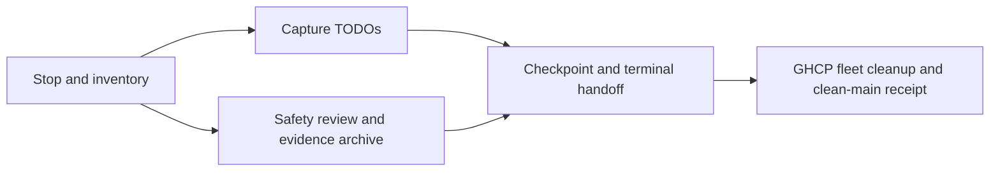

# Codex Atlas shutdown — 2026-09-18

## Goal state

Goal: stop this session safely and leave a concrete resume queue. Done when workers are
stopped, TODOs checkpointed, eligible cleanup is safely executed or explicitly handed to
the fleet cleanup executor, and main's actual state is reported. Not in scope: implementation,
new product reviews, native runs, destructive cleanup of unmerged work or unauthorized main
integration. Tier T1; fan-out cap 2 including the Conductor. No product track resumes after STOP.

## Optimized shutdown graph

| Node | Dependency | Exit oracle |
|---|---|---|
| Stop workers and inventory | User STOP | No product worker active; current shared state read |
| Capture remaining work | Current contracts and exact candidate pins | Named owner, artifact and first resume action for each TODO |
| Cleanup safety and preservation | Current lifecycle inventory | Independent safety receipt; protected ignored bytes retained |
| Checkpoint and terminal receipt | TODO capture and safety result | Clean pushed administrative checkpoint, leases/session ended |
| Fleet cleanup and clean main | GHCP serialized writer disposition | Actual removals and clean status observed, not inferred |

The only parallel unit is a read-only cleanup safety review while the Conductor captures
TODOs. It never writes the candidate or deletes a tree. Required gates are preserved:
current lifecycle classification, independent deletion safety, content-hash preservation,
normal commit hooks and documentation regeneration. No full build or product suite is
triggered by this administrative record. Existing specifications and architecture suffice.
Surface list: live workers -> session/lease state -> worktree/index/raw evidence -> archive
and Git predicates -> TODO records -> publisher handoff. No new data model or policy.

The finite work set is six Codex cleanup candidates and the five TODO rows below. Process
each once; a new dirty state or missing archive holds that tree. No polling loop can turn
silence into consent. Original review budget five calls; archive remediation review three
calls. The initial hold was honored, never self-cleared. A fleet-wide wind-down notice then
made GHCP the single cleanup executor, so Codex will not issue competing removal commands.
No measured speedup is claimed. Actual costs and results are in the linked shutdown proof.

## Resume queue — outstanding, not active Codex work

| TODO | Responsible seat | Exact input / first resume action |
|---|---|---|
| R124 publication | Claude serialized publisher, coordinated by GHCP | `a63de46cb1e67abf4baa8e1b1b2b8f1535031aa3`, `verify/atlas-view-spikes`. Personally read `docs/proof/atlas-behavior-contract.md`, `docs/proof/atlas-architecture-contract.md`, `docs/proof/atlas-view-spikes-combined-verification.md`; reconcile current base and use existing join gates. Request `req-01M2QWRKQNFS17DGDJ91DYCEQV`. Do not repeat the already observed bounded compilation or native Pair03. |
| E2 R122 formal review | Claude, or GHCP under the recorded conditional routing | `39de7428c00ea61cffa9a4a149e81afc44ea5ba9`, design blob `e48d7f4a1d67603447deee97cdd865d116d66edf`, `docs/design/atlas-architecture-views.md` section 4.1. Establish that no equivalent review is already assigned, INCLUDING Claude confirmation, then convene ONE formal D&P review. Local readiness is not that veto. Request `req-01M2RYPK39TN21SY9NQ4TB7SVV`; routing clarification `req-01M2S31X1SC6K9Z37ZE6AJQ5J2`. Foundation, home, producer, bounds and US-E8.b remain unadmitted. |
| Dispose old physical-tree rescue (record publication completed) | Existing publisher | Reviewed conservation commit `53306e9e828648228f90c9d9cc5405f6d9acfcf6` was merged to main at `9fb249ff` during shutdown, followed by derived close `48483dc5` (remote main verified). This administrative close is its descendant; explicit disposition of the accepted two-file rescue in `ai-de-integration-atlas-view-spikes` remains owed. Seven records are already durable; physical originals and their nine staged entries remain untouched. Requests `req-01M2S2FDDWRN35E8CCGCGTDVWX`, `req-01M2QST5RRS35FDG8G4WR54JBF`, `req-01M2QTKPARAXCY76QS9BAMN9ZV`. |
| Clean primary and eligible stale worktrees | GHCP fleet wind-down executor | Conserve all sessions' shared coordination journals without discarding or replacing their contents; apply fresh lifecycle checks to exact cleanup candidates; return actual clean-main and removal receipts. Shutdown request `req-01M2TTE4DQ1NVTMJWH970W3MP4`; execution handoff `req-01M2TTRVV4WQ69DZAJ0A433Y0P`. |
| Confirm CI follow-through on the landed tracked-journal fix | Existing Core/publisher seat | Watcher request `req-01M2RZSWZ18KZYT6ZB6QQYDKJA`: the tracked-journal test fix landed at `52462b64` during shutdown. Inspect the exact next CI result and ensure the closing record distinguishes mutation-set execution from App-suite failures. No new CI success or accepted baseline is inferred here. |

## Closed boundaries and retained work

Grok r7 producer/consumer freeze is complete at blob
`703264e39931f35ca15795b0a8e4fded1f2f41e1`. No Codex ACK is owed. Only the empty stub is
admitted; later exact mapping/consumer evidence is required to activate Sequence. Listing
is independent. Native Pair03 is closed refused/inconclusive; Atlas native qualification
remains BLOCK. These are boundaries, not instructions to resume native experiments.

Retain the clean R124 and E2 candidate worktrees, the original dirty spike and Conductor
trees, native/raw-evidence trees and every unmerged/peer-owned tree. The current administrative
checkpoint is retained for the next publisher. Worktree age alone grants no deletion authority.
