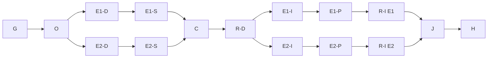

# Goal and completion contract

**Goal:** deliver remaining E1 Sequence/Activity and E2 domain/layer/Azure views from existing
Atlas and repository evidence, using updated Addendum E and mockups.
**Done when:** all five views meet agreed slice acceptance through actual native composition,
source navigation and consistent evidence; triggered independent gates clear; Proof Packs,
audit and coordination records are committed and handed to the serialized integrator.
**Not in scope:** GHCP Class-view qualification or recovery repairs, Grok's Understanding Views,
E3 comparison, E4 model enrichment, execution of analyzed code, live Azure access, new graph
substrates, other sessions' worktrees, or ungranted main publication.
**Tier:** T2 confirmed by Owner decision `8c9fa47cc19574f43f7c206251e19af67553b8be`. **Fan-out cap:** four including Owner and
Conductor; grounding starts at two, then distinct E1/E2 bounded workers after scope review.
ER remains a separate outstanding item; five-view delivery is not completion of all Addendum E E2.

## Grounding and uncertainty

- [Verified] Primary main grounding pin: `c46e112a924a8a0a4c86e4552af1f0e30bfa851c`.
- [Verified] GHCP's supplied intent pin: `92e025ae8cacd0a2fc8580f865a2172c4a9bdeb4`.
  Read `docs/specs/addendum-e-code-atlas.md` US-E6/7/8, its typed links to
  `docs/architecture/code-atlas-proposed.md`, then `docs/design/code-atlas-e1-static-views.md`.
  These are candidate intent, not blanket production acceptance.
- [Verified] Current coordination layer: 11 registry patterns and effective merge drivers;
  pack doctor: 10 PASS, 3 WARN, 0 FAIL. Warnings: python3 alias (use python), Copilot global
  context/effort settings, graph freshness/orphans. Do not reinstall an already effective layer.
- [Verified] Shared session fold: no current file leases; active GHCP native and integration
  sessions and Grok lanes remain registered. Liveness is descriptive, not ownership authority.
- [Verified] `kb-graph-and-loop-engineering` is absent: official context command returned
  ROOT_NOT_FOUND. The referenced evidence directory is absent. Use the installed GO instructions
  and measured local audit history; record the missing graph node as a finding, not repair scope.
- [Verified] Local audit history shows scoped review found real environment/CLI defects and
  re-review cleared them. Native recovery still has its own qualification boundary. This warrants
  independent review and early seam checks; it does not justify an invented duration prediction.
- [Flagged] Implementation foundation pin awaits GHCP's explicit acceptance/handoff; no worker
  consumes a moving candidate as an accepted contract.

## Nodes, dependencies, exits and oracles

| Node | Goal and inputs | Depends on | Exit / falsifier | Tier |
|---|---|---|---|---|
| G | Read constitution, current peers, pinned intent and actual existing views | User assignment | Inventory cites current pins; conflicting or missing authority remains named | T1 |
| O | Owner decides horizon, tier and contested seams | G | Recorded bounded ruling; no self-cleared reviewer veto | T2 |
| E1-D | Separate worker reconciles Sequence/Activity spec, mocks, code and source-to-native trace | O | Every US-E6 obligation mapped; exact proposed paths/signatures; no unsupported runtime claims | T2 |
| E2-D | Separate worker reconciles domain/layer/Azure spec, mocks, code and evidence rules | O | US-E7/8 mapped; grain, identity, provenance, unknowns and declaration semantics explicit | T2 |
| E1-S | Qualify installed Roslyn behavior contract using synthetic source | E1-D, exact spike grant | Explicit occurrence/control-flow fixtures distinguish supported syntax from gaps; source never executed | T2 |
| E2-S | Qualify explicit declaration carrier and resource identity rules | E2-D, Owner57a09ed6, exact spike grant | Positive bound declarations/aliases, duplicate/stale/unknown/partial identity negatives; no real authorization claim | T2 |
| C | Settle shared contracts and exact section-2 grants; choose accepted foundation | E1-S, E2-S, peers | No path has two writers; every cross-lane guard jointly satisfiable; new surfaces assigned | T2 |
| R-D | Independent design/graph/UX/architecture review | C | Trigger union reviewed, falsifiable veto exits satisfied | T2 |
| E1-I | Red-first, minimal Sequence/Activity vertical slices | R-D | Production source→model→wire→native→Source/Back proven; mutants/negative states exercised | T2 |
| E2-I | Red-first domain, layer, Azure vertical slices | R-D | Source-backed meaning, no inferred domain truth or deployed-state claims; actual native path proven | T2 |
| E1-P | Freeze E1 proof and evidence inputs | E1-I | docs/proof/atlas-behavior-views.md names real receipts and exact revision; missing/unexecuted/contradictory observations fail | T2 |
| E2-P | Freeze E2 proof and evidence inputs | E2-I | docs/proof/atlas-architecture-views.md names real receipts and exact revision; missing/unexecuted/contradictory observations fail | T2 |
| R-I | Independent implementation/native review per frozen slice | respective P | Reviewer opens frozen proof and raw results; all triggered vetoes cleared; partial remains unaccepted | T2 |
| J | Integrate dependency order, regenerate after audit, official join checks | R-I, GHCP landing | Integrated proof and actual test results; no failures beyond agreed baseline; Owner close | T2 |
| H | Agreed serialized publication handoff | J | Candidate/base/evidence request acknowledged; no direct main push without grant | T1 |

All arrows are data or decision dependencies. E2 does not wait for E1 behavior implementation
unless contract grounding discovers a genuine dependency. Native shown-window tests and main
joins are exclusive resources and always serialized. Core/Ipc, factory, Shell and shared menu
tests are retained seams; a worker cannot silently grow into them.

## Floor nodes and method

Reuse Addendum E, architecture, accepted ADRs and existing mockups when they supply the needed
contract. Each lane must state what remains valid and what needs a new artifact. New lane design
and evidence records are required. `/specify` resolves missing functional/UX acceptance before UI;
`/define-architecture` is used for actual new model/representation decisions; `/design-slice`
settles the slice; `/ui-design` begins in review mode over existing views/mocks; `/implement`
uses red-first controls; `/investigate` diagnoses observed failures before repair.

Surface list, required before code: source evidence → identity/snapshot/provenance → extraction
or existing facts → query/projection → wire → client type → native view → compute reader →
selection/Source/Back → diagnostics/telemetry → tests → Proof Pack and audit.

Testing trigger union must be computed from actual design. Expected floors: D0; D1 for projections;
D2 for parsing/validation; D3 for composition/layer contracts; D4 for source/store integration;
D5/D6 for query/wire; D7 for any substitute. No generated AI feature is admitted. Native UI,
technical visualization, tokens, accessibility, incomplete/unknown/stale/error/overflow states,
normal-path instrumentation and source-to-render consistency remain mandatory.

Review lenses: Test, UML/ERM/domain, UX/IA and UX/accessibility, data, Security/Privacy where
source/work data crosses boundaries, Distributed Systems for wire/lifetime, native/C#, SRE,
Simplifier, Release. Author never clears its own veto. Exact triggered matrix is lane output.
Each defect uses class → sweep → derive → prevent, existing register/allocator and an executable
red-first control; unrelated findings go to their owner.

## Optimization, budget and loop contract

Naive order: all E1 grounding/design/implementation/review, then all E2 work, then join. Optimized:
one shared authority/foundation pass; independent lane grounding and later implementation only
after fixed shared contracts; independent review as soon as each frozen slice is ready.

Cost model is **Inferred**, in normalized node units, not minutes or tokens: G=1, O=1,
each D=2, each S=2, C=1, R-D=1, each I=3, each P=1, each R-I=2, J=2, H=1.
At grounding, before contract spikes were known, T1=23 and T∞=15. Owner57a09ed6 and the
two lane designs exposed unqualified producer contracts; the re-plan adds E1-S/E2-S.
The revised model has T1=27 and T∞=17.
The independent review required explicit proof nodes; the previous four implementation units
are now split into three implementation plus one evidence unit, not an invented cost reduction.
Two execution lanes yield Brent bound (27−17)/2+17=22 and lower bound17. The ceiling is ten
units before overhead; no measured speedup is claimed. Shared contracts and desktop slots can
erase that ceiling. Four total agents provide only two author slots. Pause completed workers
to admit independent reviewers; Owner does not become an implementer.

Initial Owner grounding budget20 calls/20min/20k tokens; E1/E2 grounding each16 calls/20min/18k
tokens. These are circuit breakers, not acceptance tests. Convergence: every assigned criterion
has code/mock/spec evidence, an exact gap, or a precise seam request. Stop research then.
Implementation budgets are set after design, not guessed before file population is known.
Context ceiling400k per worker, compact or split before reaching it.

Fan-out contract: cap4; no shared authored paths; transient tool timeout/429/529 gets at most
two retries with bounded backoff; deterministic failure invokes investigate. Join all required
evidence, never quorum. A failed lane remains isolated while independent work continues.
Grounding variant: unmapped acceptance obligations. Implementation variant: remaining predeclared
slice obligations. Review variant: unresolved findings on a frozen revision. Non-decrease across
two passes triggers re-plan with evidence; caps never clear gates.

Re-plan at foundation change, newly shared file/decision edge, failed independence, scope change,
or exhausted budget. Do not rerun optimize-graph merely for status. Planned versus actual is
appended at each phase close: calls, exposed tokens, elapsed time, rework, boundaries and gates.

## Plan review

Owner grounding completed at `8c9fa47c`: five-view scope and two design lanes confirmed. Independent review `e07c9e59` cleared design grounding only. This graph authorizes bounded grounding
only. Product implementation is held at C/R-D until accepted foundation, exact grants and
independent design gates exist.

The independent review required explicit proof nodes before implementation. E1-P/E2-P now
name committed Proof Packs, exact revision and raw evidence inputs; missing, unexecuted or
contradictory results prevent review admission. Other implementation barriers remain unresolved,
not waived by this graph amendment. Focused reviewer59bac4ee cleared the evidence-node finding.
The subsequent contract-spike expansion follows Owner57a09ed6 and Ruling121; it does not
remove any implementation barrier.

## Grounding checkpoint actuals

Owner returned19/20 calls,6m53s through commit; audit measured387seconds through close entry.
No product tests or runtime acceptance were claimed. E1 worker uses Sol high for bounded existing
sequence/producer mapping. E2 uses Astra high for domain/resource evidence and architecture semantics.
Both have their own main-based worktrees and16-call design inventories. The harness refused a new
E2 thread at its thread limit; resumed an available completed agent with a new explicit E2 role and
task/session/worktree instead. No fourth concurrent worker was added; E2 never reviews its own work.

E1 design755d0347 completed at24/16 calls; E2 designe2c17251 completed at19/16 including
coordination. Those overruns expose too much artifact/grounding work per initial node. The next
nodes are limited to six named synthetic fixture groups each,12 total calls each with warning
at10; neither repeats broad grounding nor builds production code. They have concrete exit
evidence rather than a larger retry of the old inventory. Separate independent spike review
must check both positive and refusal oracles before evidence enters C.

Ruling121 exact spike grants: req-01M2KBCP7JY9PJTC63PD04WPT2 (E1) and
req-01M2KBCP9A8893CWVDDGKKTBYS (E2). No src/tests/package-version/solution edits;
no desktop; synthetic input never executed. Windows and Linux build evidence and observed
project-coverage walltime comparison precede landing. Production signatures/surfaces require
their own grants after the Atlas foundation lands.

## Spike checkpoint and revised work units

E1-S stopped at 13/12 calls before fixtures, a plan defect. E1-S2 identified the installed BaseMethodDeclarationSyntax overload at 6/8 calls but could not locate coordination tooling. The next 8-call author node corrected only one of two namespace mismatches and again stopped before fixtures. Reassigned the bounded repair plus evidence to Astra (18 calls, checkpoint14), keeping the same lane and exact grants. Independent output inspection and review remain mandatory.

E2-S completed at 10/12 calls, commit55df5b6e. Conductor observed Linux Release build0warnings/errors,1.84s and23 checks. Reviewer8eb44853 BLOCKED alias input-only assertions, confounded scope fixture, constant authority assertion and missing carrier-limit negative tests. Targeted repair precedes re-review and one new Linux run on the corrected commit. Full deployment identity remains unresolved; Owner requested a separately admitted source-bound producer, shared request req-01M2KC9CR6YCH2NRZRYW28JFT3. No product gate waived.

Conductor editing also hit repeated patch-context failures. No partial edit occurred. The control for this checkpoint is to inspect the actual diff and use an append-only checkpoint instead of retrying unchanged patch context; no such retry constitutes progress.

## Qualified spikes, remaining design gates

E1 5d361f2a and E2 90189411 independently cleared by acdf4894 within their bounded feasibility scopes. Both Windows coverage runs40/18/22/0 built22outside in26s; Linux E1 3.49s/sixgroups and E2 1.91s/28checks observed. No combined candidate gate yet.

Owner a766afa8 admits E1-D2 and E2-D2 in existing Markdown paths after shared G6/envelope decision. Each has14-call/20min budget, checkpoint11; exact new mock grants are a separate dependency. Remaining variant: eight independently identified design obligations mapped to frozen evidence; foundation/production DTO/native gates remain unmet. Earlier source spikes do not prove CFG or complete Azure identity. Next join is only reviewed design/spike evidence under the agreed serialized protocol.

## Material re-plan: finite semantic experiments after design review

Independent d062650d41b68f6c14d1fffd9c07228a2846d7ef clears revised design text (E1 83e1139b; E2 15b53fe9), not implementation. Evidence changed the graph: syntax/symbol and carrier feasibility do not prove the now-defined structural paging or typed relation behavior. Programme Owner reviewed original Ruling121 requests and admitted two finite experiments within the existing exact spike paths. This is recorded scope interpretation, not a new Core/product grant.

Graph extension: E1-D2 -> independent expected-node/relation ledger -> E1-S3 -> cross-platform observation -> independent semantic review; E2-D2 -> E2-S3 -> cross-platform observation -> independent semantic review. Those branches are independent and join at C with unchanged foundation/exact-grants/golden-contract/native barriers. New HTML mock and shared-register branches wait for the explicit owner/human grant; elapsed time is not consent. Watch routing moved to copilot-main-watch after user-reported Claude usage cap, with watch-only authority. Request req-01M2KD86D5VE5RG5PAM0B57SR0 carries the finite outstanding decisions and replacement-integration question.

E1-S3 scope: four synthetic groups (branch/repeats, loop, try/finally/await, unsupported/nested-body gap), pages1/2/7/128, bounded closure/stubs, unrepresentable window. Independent ledger precedes authoring; dropped branch, cross-window relation and stable identity mutations must fail. Experimental structural source graph only, not executable CFG. No runtime, producer service, tokens, wire/UI, new paths or package.

E2-S3 scope: typed relation output, declared-target positive, current source dependency only with matched synthetic assertion predicate/endpoints/evidence, missing/wrong endpoint/kind/evidence/assertion negatives, seven-collection caps. Explicit declared Current is still a declaration. No actual authority/provenance/producer claim. Preserve prior controls; new output must be tested, not input fixture readback.

Concurrency remains4 total. Oracle author/reviewer uses Sol high (independent finite expected ledger,6calls/8min); implementation uses Astra for structural/identity semantics. E2 experiment16calls/20min checkpoint12; E1 author budget freezes with ledger. Reviewers do not author the subject; their role in oracle specification is disclosed. Separate trees and exact authored leases; derived/audit files never receive global authored leases.

Variant: unmet finite ledger assertions; each implementation pass must decrease them, and the three deliberately broken subject variants must refute their own dependent oracle. A failed API contract or non-decrease returns to investigate/Owner; no widen-until-green or budget-as-acceptance. The earlier normalized cost estimate described the pre-review graph and is now historical; these evidence-driven nodes add work for correctness, no speedup claim. Planned versus actual receipts and call counts remain the measurement.
