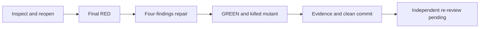
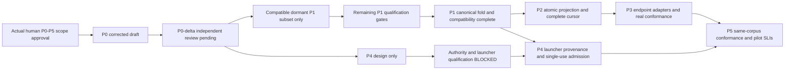

# Durable phase graph

## B5/B6 bounded continuation checkpoint — 2026-09-17

Goal: qualify pre-recovery measurement absence, implement and test bounded
pending UPDATE recovery, and attach producer P1 evidence to the one canonical
Proof Pack. Done when focal receipts, original payload/native-record assertions,
regression preservation and a reviewable commit exist. Not in scope: other
branch edits, live authority, broader P2 closure or P3–P5.
Tier T2; fan-out 0; main-line ceiling 35 calls; context ceiling 150k.

| Node | Capability | Dependency | Actual exit |
|---|---|---|---|
| Ground finite B contract and actual recovery/writer | Reasoning | Existing canonical proof | Four lifecycle skips and inert UPDATE writer established; heartbeat receiver-time behavior excludes blanket enabling |
| Qualify B5 isolated mutant | Deterministic mechanics | Grounding, unchanged retained test | Default false-Completed mutant: focal failure, restored pass; actual streams, logical exits, pins and TRX |
| Pending UPDATE baseline → repair → proof | Reasoning + deterministic mechanics | Grounding; source edit only after focal RED | Pending count 1→0; original raw body/admission, native fields and reopened-store record checked |
| Preserve selected regression union | Deterministic mechanics | Repair | 504 pass; all 502 predecessor occurrences retained |
| Attach producer evidence | Reasoning | Read-only producer commits and receipts | P1 membership evidence plus newly available three-operation test consolidated in canonical pack |
| Independent qualification | Independent review | Candidate commit | **Pending**; cannot be collapsed into author verification |

No fan-out was used. Source mutation/build and native validation share exclusive
build outputs, so their ordering is substantive. The isolated mutant used copied
Core source and copied test binaries, never the main source. Work/span were not
measured as a whole; no parallel speedup is claimed. Inferred serial bound:
`T1 = T∞`, width 1. The script's recorded runner data are measurements, not an
estimate of total session cost.

The finite validation lists terminate when their named receipts and counters
are read; the native oracle uses four pumps before and four after reopening.
The 35-call cap was approached after repeated oversized evidence reads; it is an
estimate failure, not a reason to erase unexecuted obligations. No independent
gate has been self-cleared. See `proof-cross-harness-coordination` for source,
project, test, binary and TRX pins and the lifecycle matrix.

**Completed at author-evidence level:** isolated B5 missing mutation; pending
UPDATE positive/replay candidate; original-body and native-record assertions;
actual process-output capture; 504-result regression union; canonical producer
attachment. **Still unmet:** new-kind lost ACK, explicit source-time assertion,
heartbeat/end historical effects, registration edge cases, authority counters,
GAP/ambiguity matrix, B2/B3/B7/B8, full P2 and P3–P5. The three-operation producer
receipt exists at `ff73f62c071aaf16bd379b494d27df372ff2a7b5`; its independent review
and four producer bounds remain pending. Next: independent review of this
candidate, then finish the named lifecycle evidence before any B6 completion.

## Finite resolved-session / MCP-container repair — 2026-09-16

Goal: repair only F1 actual-session repository drift and F2 pre-handler JSON conversion.
Done when: baseline RED, repaired GREEN, meaningful guard mutation, correlated outer
responses and preserved prior cases are committed for independent re-gate.
Not in scope: P1, canonical bridge or recovery B changes, activation, live data,
endpoints, GUI, configuration/dependencies, main/push or P3–P5.
Tier: T2. Fan-out cap: 0. Main-line budget: 30 tool calls. Context ceiling: 150k.
Assigned worktree/session `xh-p2-projection-b0d0` reopened through the official tool.

| Node | Capability | Dependency → finite exit | Actual |
|---|---|---|---|
| F0 | Reasoning | Supplied independent blockers + fresh source/spec/test contracts → fixed two-item surface list | Native resolved row and real MCP outer router read |
| F1 | Deterministic mechanics | F0 → semantic baseline RED | 21 failures, one legacy control passes |
| F2 | Reasoning | F1 → transaction guard and dispatch-boundary guard | Three production files; no model/schema change |
| F3 | Deterministic mechanics | F2 → restored union, foreign/same-repository mutant, unchanged recovery counterexamples | 26 finite passes; 12 mutant failures; 471 restored passes; separate recovery 3 pass / 2 fail |
| F4 | Deterministic mechanics | F3 → owned proof/phase/audit and pinned evidence commit | Proof and receipt carry counts, exact selector and hashes |
| Gate | Independent review | F4 → Test/Security/Data ruling on these two repairs only | Pending; not author-cleared |

All edges are data or decision dependencies. Shared test/build output couples the
author nodes, so no agents or concurrent writers are added. Normalized equal-node
author work/span is 5/5, speedup ceiling 1× (**Inferred model**, not timing). The
two production blockers decrease to zero at the author checkpoint. The external
gate remains distinct. One fixture-only correction compared persisted state rather
than the pre-write object's reconstructed worktree repository. Oversized grounding
output required bounded reads; this is recorded rework, not hidden elapsed-time proof.
Actual test durations and counts are in unchanged TRX; token totals are not recorded.

Tests apply D0, D1/D2, real SQLite D4, provider/schema D5/D6 and MCP A2. Negative
cases assert refused effects/receipts or correlated typed errors; positive controls
prevent an over-broad generation gate. The comparison mutant fails in both directions.
The failure dispositions and scope qualifications are in the existing Proof Pack.
No more review floors or product permissions were added. Next is independent re-gate;
producer/bridge old-binary evidence, recovery, remaining P2 and P3–P5 remain pending.

## P2.2 finite evidence blocker — 2026-09-16

Goal: provide failure sensitivity for the 23 specified green-only cases.
Done when: unchanged assertions fail focally against isolated targeted faults, restored
compositions and the 202-case candidate pass, and reproducible receipts are committed.
Not in scope: production edits, native R1/R2, schema activation/migration, endpoints,
GUI, slots, upstream research or any of the six approved implementation tasks.
Tier T2; fan-out cap 0; main-line budget 30 tool calls; context ceiling 150k.

| Node | Capability | Data/decision dependency → finite exit |
|---|---|---|
| E1 | Reasoning | Supplied Data/Test findings + pinned test/DDL → enumerate exactly 23 missing oracles |
| E2 | Reasoning | E1 → explicit per-case targeted mutation definitions; preserve assertions |
| E3 | Deterministic mechanics | E2 → release leases, positive/fault/restored TRX and 202-case candidate |
| E4 | Reasoning | E3 → inspect each focal failure, redundancy, counts, pins and residuals |
| E5 | Deterministic mechanics | E4 → commit existing proof/plan and own audit; release/end session |

Serial by schema/fixture and build-output coupling. Equal-node work/span 5/5,
parallel ceiling 1× (**Inferred planning model**, not measured latency). The finite
variant is 23 unclassified mutant/case pairs, floor zero; wrong-oracle results are
blockers, never counted as kills. No delegates, dependency installs, production patches
or extra worktrees. Independent Test re-gate is an external hard gate after E5, not
self-certified here.

First execution observed positive 23/23, focal faults 23/23, restored 23/23 and candidate
202/202. The runner was then tightened to compare exact test-name sets and mark
exception-interrupted receipts incomplete; the second execution retains separate
receipts. The existing Proof Pack's supplemental matrix identifies every fault and
records the three joint guard/index cases honestly. No chronological baseline RED
is invented. Tool-output overflow caused grounding rereads; bounded output/TRX
readback replaced that shape. Cost/token totals are not recorded.

**All six approved implementation tasks remain pending.** Next: independent Test
re-gate of this evidence commit, then only the admitted native-pump implementation.
The author cannot convert this evidence handoff into activation or a wider phase.

## Finite S1–S6 schema repair — 2026-09-16

Goal: repair the six supplied Data/Test schema findings against baseline
`584975f99547f67c2245ac879a47fd44f3f8fcf2`.
Done when: semantic baseline REDs, repaired schema GREENs, isolated payload mutants,
indexed lookup evidence and immutable receipts are committed for independent re-gate.
Not in scope: native R1/R2, activation, live data, canonical writer/capture or P3–P5.
Tier T2; fan-out 0; main-line budget 38 calls; context ceiling 150k.

| Node | Capability | Dependency / exit evidence | Actual |
|---|---|---|---|
| S0 | Reasoning | Supplied Data/Test findings → design/ADR correction before DDL edits | Recorded |
| S1 | Deterministic mechanics | S0 → real baseline semantic failures, not missing tables | 50 cases: 28 pass, 22 fail; classified in Proof Pack |
| S2 | Reasoning | S1 → global order, storage types, key bytes, accounting, index and guard repairs | Two production files; no dependencies |
| S3 | Deterministic mechanics | S2 → prior 129 + new boundaries; clause mutants; native RED preservation | 202 pass; separate native 3 pass / 4 fail |
| S4 | Deterministic mechanics | S3 → source/test/project/binary pins, audit and committed evidence | See Proof Pack and receipts |
| G | Independent review | S4 → Data/Test re-gate of all six repairs | PENDING; not author-cleared |

Edges are data/decision dependencies. The same DDL and database build outputs couple the
implementation/test nodes; no parallel authoring or agent fan-out. Estimated normalized
work and span both equal five author nodes (`T1=T∞=5`, Inferred equal-node model, not time);
parallel speedup ceiling is 1. Rework terminates when the finite failing-case set is empty;
the 38-call cap is an estimate-failure signal, never a waiver. Two baseline findings
required corrections: test error-code calibration and failed-constructor disposal.
Actual test wall time/counts are in TRX; token cost is not recorded.

This narrower schema goal supersedes only the old author's immediate checkpoint below,
not the already approved P0–P5 programme. All native/capture/recovery/rollback gates and
all six upstream actions AFTER VERIFIED remain unchanged. Fresh unreleased v8 only;
upgrading already-created prerelease v8 databases remains unsupported.

## P2.2 author checkpoint — partial, native replay still blocked

Goal: implement durable native replay and close R1/R2.
Done when: real SQLite replay, atomic native effects, immutable receipts and bounded
capture are verified and committed. Tier T2; fan-out 0; main-line budget 45 calls;
context ceiling 150k. No authority, adapter, MCP/UI, live-source or upstream activation.

**Actual:** the author stopped at an independently testable schema checkpoint,
not at the requested P2.2 completion predicate. Repeated oversized grounding output
consumed the main-line budget; this is an execution-estimate failure, not a waiver
of native replay or permission to label P2 complete. No new scope approval is needed
to continue the already-approved remaining graph.

| Node | Capability | Dependency → terminal evidence | State |
|---|---|---|---|
| C1 | Reasoning | Committed §11 / ADR amendment → exact receipt constraints | Read; no contract widening |
| C2 | Deterministic mechanics | C1 → four original replay REDs and 22 new schema REDs | Observed |
| C3 | Reasoning | C2 → additive v8 constructor/cache DDL | Implemented, not independently cleared |
| C4 | Deterministic mechanics | C3 → 32 cache + 91 P2.1 + 6 migration cases | 129 PASS; original full reliability still 3 PASS / 4 RED |
| R1 | Reasoning | Independent Data/DS/Test code gate on C3/C4 → accepted cache foundation | Pending |
| R2 | Reasoning | R1 → inert typed native effect/session observation mapping, same connection/IMMEDIATE transaction, post-commit publication | Pending; all four R1/R2 replay failures remain |
| R3 | Reasoning | R2 → bounded LF/raw-byte capture, scoped occurrence identity, checkpoint revalidation, SOURCE_GAP, 128-file/32-MiB and 64-KiB/128-record/4-MiB bounds | Pending |
| R4 | Deterministic mechanics | R2/R3 → duplicate original admission/mapping, stable conflict refusal, native-effect rollback and post-commit failed-delivery replay | Pending |
| R5 | Reasoning | R4 → bounded late-parent recovery, 401 paging, sole canonical-stream adapter/bridge | Pending |
| R6 | Deterministic mechanics | R5 → OS crash, actual old-binary rollback, query-plan/100× and full recovery/SLI proof | Pending |
| P3 | Reasoning + deterministic mechanics | Full P2 → real harness adapters | Pending |
| P4 | Reasoning + deterministic mechanics | P3 → launcher integration | Pending |
| P5 | Reasoning + deterministic mechanics | P4 → surface consistency and SLIs | Pending |
| Upstream | Deterministic mechanics | AFTER VERIFIED → all six previously deferred upstream actions | All six pending |

Each node consumes the prior node's accepted evidence; none authorizes a source
activation. One connection owns the SQL consistency boundary. There is no nested
agent or new background service. Source/test/data gates remain independent gates,
not author attestations. The v7-shaped fixture test verifies the real constructor's
upgrade and writable historical tables; it does **not** run an old binary.

Remaining instrument sources: native source/effect/receipt/checkpoint spans and
latency/volume/failure SLIs are not implemented. Current evidence is limited to the
normal schema-version row and actual SQL refusals, read back in tests. Full P2 is
not deliverable from a green schema suite.

## P2.1 finite overlap-oracle remediation — 2026-09-16

Base `494b2488fb869846df47d365c5407fd83f8c1556`. One supplied independent
Test/Data/DS finding: the DEFERRED-only mutant survived 90 tests because R3 held
B before allocator entry. No production change or wider P2 repair was admitted
to this unit. The [new receipt](../proof/cross-harness-coordination-proof-pack.md#p21-allocation-overlap-remediation--2026-09-16)
records the installed callback contracts, exact mutated IL/binary identities,
successful commits in both modes, and the independent re-gate still required.

| Node | Capability | Input → exit | Dependency / status |
|---|---|---|---|
| O1 | Reasoning | Review finding + fresh source + installed provider → real contention/trace boundary established | None; complete |
| O2 | Reasoning | Exact owned test lease → one two-service/two-connection scheduling test, no production hook | O1 decision; complete |
| O3 | Deterministic mechanics | Released leases + build → candidate 1 PASS, exact DEFERRED mutant 1 FAIL, candidate regression 91 PASS | O2 data; complete |
| O4 | Deterministic mechanics | Observed receipts → proof/plan/own audit, clean commit and ended session | O3 data; closing |
| G-O | Independent review | Exact author commit and mutation receipt → Test/Data/DS/C# dispositions | O4 data; **pending, not self-cleared** |

No agents. Author work/span before and after **4/4 normalized nodes (Inferred)**,
width one, speedup ceiling one. The chain is data/decision-dependent; no useful
author concurrency is available. Budget **30 tools / 150k context**. The single
missing-oracle worklist decreases **1 → 0** after the killed mutant; the reviewer
veto is a separate pending gate, not a finding the author can erase. No probabilistic
test loop or budget enlargement. Each native/async wait has a 15-second deadlock
cap; the success predicate is actual contention plus complete ordered commits,
never reaching the cap. D0/D1/D4 apply; no SQL semantics are mocked.

Actual shape matches O1–O4. Installed raw trace plus the native busy export avoided
a production hook, dependency or new contract. Two oversized inspection outputs
required bounded follow-up; zero code/test rework passes. Measured test times are
in the Proof Pack; full-turn tokens are not recorded. Audit duration begins at its
19:40:22Z marker, excluding earlier grounding. The final audit records consumed
calls against the declared budget. Shared docs retain their existing typed links;
derived regeneration and formal lesson-register incorporation stay conductor-owned.

**Remaining:** independent gate, the four existing R1/R2 failures, and every full-P2
and later-phase floor. The original 90 green cases are retained; they do not become
retroactive overlap proof. P0–P5 approval and scope are unchanged.

## P2 test-only RED checkpoint - 2026-09-16

New evidence at source base `6b0c00420609ad54bf36fc38e5025c5629bba814`:
`CoordinationReliabilityTests` executed **7 cases, 2 PASS / 5 RED**, against temporary
real SQLite. Exact names, assertions, source/project/test/binary SHA-256 pins and
qualification limits are in the linked
[P2 RED receipt](../proof/cross-harness-coordination-proof-pack.md#p2-real-csqlite-red-receipt---2026-09-16-test-only--unshippable).
The original static receipts below remain historical, not retroactively executed.

| Slice | Progress, not phase completion |
|---|---|
| R1 / partial O11 | One-pump positive control PASS; unchanged-log second pump RED, one original message becomes two |
| R2 / partial O11/O19 | Fresh process composition over same DB/log RED for live and ended sessions: observation duplication, generation and heartbeat refresh. Separate registration-phase RED exposes ended clear; full ended-log replay ends true again. No OS kill or authorization proof |
| R3 / native O14 precursor | Two services/connections plus independent reader, TCS/manual-event interleaving: both allocate Seq 1; after A/read/B commit, B is invisible to `Seq > cursor`. RED. Serial two-service/proxy-fidelity control PASS |
| Data/DS schema and transaction approval | **Still BLOCKED/pending**; prior contradictions and initial-receipt/state-feed enforcement, snapshot and lifecycle seam issues unchanged |
| Remaining P2 implementation/proof | **UNADMITTED/PENDING**, including all O09/O11-O20 refinements, crash atomicity, raw SQL invariants, overflow-before-parent, limit+1/outage, source gaps, paging, tombstones/version, rebuild, query plans/100x and actual rollback |

This is an intentionally **unshippable RED-test commit**, not a full-CI candidate. Do not
join it as a repair. No production/schema/dependency/configuration changes; P1 parallel
work is untouched. All six user-approved phases and every floor remain in scope for
their admitted authors. Next is Data/DS schema approval, then implementation of all P2
floors, not a reduction of P2 to these three reproductions.

### Bounded execution record

| Node | Capability | Input -> exit | Dependency |
|---|---|---|---|
| R-A | Reasoning | Assigned base + scoped contracts/fixtures -> explicit actual-pipeline oracles and test-only boundary | None |
| R-B | Reasoning | Oracles -> one new C# test file under exact TTL300 lease | R-A decision |
| R-C | Deterministic mechanics | Released leases + existing test project -> nonzero selected run with actual assertions and binary pins | R-B data |
| R-D | Deterministic mechanics | Results -> linked receipt/progress, own audit, unshippable checkpoint commit and ended session | R-C data |
| G-P2 | Independent review | Exact RED checkpoint + corrected proposal -> Data/DS approval, then separately admitted implementation | R-D data; future, not self-cleared |

No agents; global width is not increased beyond this reopened author. The author chain
is serial because tests consume contracts and receipts consume observed results.
Inferred normalized work/span: 4/4 author nodes, width 1, speedup ceiling 1; no
measured speedup claim. Budget <=35 tools, 150k context. One analyzer correction was
needed; two no-assets zero-test invocations are explicitly non-evidence. Offline cached
asset materialization preceded the real build; no dependency install/download. Every
interleaving wait fails after 15 seconds, not a sleep or success fallback. The finite
worklist is seven test cases; stop at recorded execution, not green-by-repair.
Independent review and production acceptance are pending, not waived by the budget.

## P2 checkpoint — corrected Data/DS proposal, not code admission

**2026-09-16:** docs-only scribe in separately registered `feature/xh-p2-projection`,
session `xh-p2-projection-b0d0`, based exactly on
`f4109e144d4c56d16b4548013e948d0ba1f50e36`. The P1 checkpoint below remains its own
author's evidence; parallel P1 semantics review is not cleared or rewritten here.
The human's all-six-phase approval remains. P2 RED test-only authoring is allowed,
but no test is authored/run here and solution code is **UNADMITTED** until real C# RED
plus independent Data/DS schema/transaction clearance.

The design §3 and ADR P2 addendum now record the independent DS corrections:
future native transactional Seq/earliest-N reads; capacity-deferred reference-only
obligations that do not block a later parent; explicit logical stream identity and
bounded full-prefix snapshots; historical registration mapping without capability
minting; three additive tables and honest initial-receipt constraint gap; original
admission versus current-state receipts, stable conflicts, last-returned cursors and
semantic rebuild; actual v7/v8 old-binary rollback through WatcherHost.

| P2 gate | Exit condition / current state |
|---|---|
| Independent Data + DS design | Review exact corrected docs including proposed pilot ceilings, source snapshot evidence, DDL/INSERT order, recoverable edges and native lifecycle seam. **PENDING; supplied DS BLOCK not cleared** |
| Real C# RED, test-only | Real SQLite register/post/two pumps, two services/barriers/reader between commits, source-gap/overflow-before-parent and raw SQL violation fixtures fail for the asserted reasons. **NOT RUN** |
| Concrete schema admission | Resolve store-enforced initial receipt and state/feed pairing; verify same-scope applied-parent discriminator, immutable identity/feed, non-deferred transaction and first-registration durable mapping/postcommit publication. **BLOCKED** |
| Implementation + operational proof | O09/O11–O20 refinements, crash/restart/end/tombstones/version, 401 and >401 paging, every limit+1/outage, full-prefix bounded reads, query plan/100x fixtures and actual old-binary rollback/re-enable. **UNADMITTED/PENDING** |
| Activation | Existing authority, live retention/erasure, P1 producer compatibility and P3/P4/P5 gates remain; reference-only deferral is not permission for live sensitive import. **BLOCKED** |

### This scribe's bounded execution graph and handoff

| Node | Capability | Input -> exit condition | Dependency |
|---|---|---|---|
| S1 | Deterministic mechanics | Official help + exact base -> own registered worktree | None |
| S2 | Reasoning | Four docs + scoped exact source -> static contracts and contradictions identified | S1 data |
| S3 | Reasoning | Supplied Data/DS corrections -> coherent four-document draft under exact TTL300 leases | S2 decision |
| S4 | Deterministic mechanics | Draft -> release claims, inspect bounded diff, append own audit, commit, end session clean | S3 data |
| G2 | Independent review | Exact committed proposal -> external Data/DS dispositions, meaningful RED and schema gate | S4 data; outside this scribe |

No agents. Shared schema/transaction context keeps authoring serial; file reads alone
are independent. Inferred normalized work/span before and after: **5/5**, width one,
speedup ceiling one. No measured speedup or runtime cost claim. Budget <=28 tool calls,
150k context ceiling; author refinement worklist is the seven supplied DS corrections,
floor zero. A cap reports remaining gaps, never waives them. No schema/replay test loop
runs here. Actual shape follows S1–S4 with scoped output-paging overhead; G2 remains
external. Audit duration starts at the recorded grounding marker, excluding earlier
help/registration; token usage is not recorded. Final tool usage is recorded in audit.

Mandatory surfaces for later admission are design P2-A–F and the Proof Pack's P2
refinement table. A three-table draft is **not** a cleared physical design: raw INSERT
without an initial receipt is a named still-permitted violation in the one-way candidate.
Do not silently replace that hard floor with a successful application-path test.
No new DB/native-history relocation/workspace.db/cross-DB transaction/second consumed
file; ADR-0023 divergence remains debt. Conductor owns derived regeneration and review
routing, never this scribe's automatic contract clearance.

**Upstream dependency unchanged:** only AFTER verified completion of **all P0–P5**,
produce the separately requested reusable-contract addendum/handoff in its own worktree.
Project-neutral protocol/canonical encoding/CLI contracts may qualify; product-specific
C# watcher-store and WPF code stay separate. No upstream research or push here.

## Current checkpoint — dormant P1 four-finding repair

The Python author repaired independent F1–F4 on
`ec85de0be8713bbd20d2b2035df2c4c5bf4c8126` in the same officially reopened
`xh-p1-responses-b0d0` worktree/session. The linked Proof Pack is the record of
source/test SHA-256 pins, actual CLI receipts, meaningful RED and killed-mutant results.
**Independent re-review is pending; full P1 and every runtime activation remain uncleared.**

| Milestone | Current implementation / next required evidence |
|---|---|
| M0 / P0 | Limited PASS at `62af66ca` admits dormant P1 code only; not authority/runtime approval |
| M1 / P1 | F1 typed legacy conflict, F2 reserved-envelope refusal, F3 explicit collaboration CLI failure and F4 five independent correlation controls repaired. 27 tests GREEN; RED 21 subtest failures/0 errors; correlation mutant killed by 10 subtest failures. Next: independent re-review, then acceptance, consumption, proposal supersession/full immutable reference and authority verification, cross-language vectors, and unchanged mixed-client contention/complete-record/conflict qualification |
| M2 / P2 | Pending real SQLite service/store tests, source effect + receipt/checkpoint transaction, pagination, pending/retry bounds, crash/rebuild and additive migration/rollback; Data/DS coapprove before code |
| M3 / P3 | Pending installed-version/vendor spikes against real supported endpoints; each arrival/consumption/post-turn-wake positive cell remains BLOCKED until actual evidence, not fakes |
| M4 / P4 | Pending qualified launcher actor/generation/worktree/candidate/run binding, PID/creation/parent provenance, single-use admission and real bounded launcher proof |
| M5 / P5 | Pending same-corpus queue/board/MCP/UI conformance, hard-state accessibility and measured cross-surface SLIs; targets are not measurements |

### Finite repair graph and cost ledger

| Node | Capability | Input → exit condition | Dependency |
|---|---|---|---|
| R1 | Reasoning | Assigned tree, actual code and governing spec/design → contracts and official session reopened | None |
| R2 | Deterministic mechanics | Four findings → new tests observed failing against unchanged `ec85de0b` | R1 decision |
| R3 | Reasoning | Final RED → smallest source repair; no new runtime capability | R2 data |
| R4 | Deterministic mechanics | Fixed source → GREEN, actual CLI and pinned old-client rollback, guard-False mutant killed, pristine discovery GREEN | R3 data |
| R5 | Deterministic mechanics | Receipts → proof/plan/audit committed; edit claims released; session ended | R4 data |
| G1 | Independent review | Exact author commit → reviewer dispositions, not author approval | R5 data |

No nested agents; global conductor cap remains three. Per-author budget **35 tool calls**,
context ceiling **150k**. Shared source/test resources keep edits serial. Before/after
normalized work/span are **6/6 nodes, inferred**, width one, speedup ceiling one;
independent review stays outside author completion. No measured speedup claim.
Variant: unaddressed findings `{F1,F2,F3,F4}` → empty after R4; floor zero.
A budget firing stops with explicit evidence gaps, never silently clears a gate.
One fixture-only rework isolated append subcases before final RED. Several oversized
initial read outputs required narrowed reads; these were investigation overhead, not
extra product scope. Runtime tokens were not recorded. The audit start marker was set
at 17:54:38Z, after early reads/session reopen; its duration is not full-turn elapsed time.
The official closing audit records calls consumed through that append against the declared
budget; final lifecycle verification is reported separately if another call is needed.

### Deferred reusable-versus-product inventory — remaining design only

Actual-human approval covers P0–P5. No repeated phase permissions are requested.
The subsequent upstream AI-Forward push is an explicit user request **dependent on
verified P0–P5**, to be performed later from its own worktree. It is not authorized
work in this repair. No upstream repository was discovered, inspected or modified.

| Candidate boundary | Later disposition |
|---|---|
| Shared protocol, portable envelope validation, canonical fold, CLI contracts and synthetic compatibility controls | Keep project-neutral where demonstrated reuse exists; inventory for upstream only after P0–P5 verification |
| AI-DE watcher-store/SQLite integration, WPF projections and composition-root adapters | Keep product-specific and separate from shared contracts |
| Generic layers without a proven second use | Do not introduce speculative abstractions |
| Private/session/customer data, real transcripts, credentials or endpoint state | Exclude from any upstream handoff; use scrubbed synthetic contract fixtures |

Final programme handoff must name verified reusable artifacts, product adapter boundaries,
remaining gaps and evidence before the separately requested upstream push.

## Prior checkpoint — original dormant P1 candidate (historical)

The P0-only account below is historical. Supplied conductor Test/DS P0-delta gate passed
**for dormant P1 only**, with F1 resolved; it does not clear authority/runtime floors.
The Python author now supplies code/tests in `feature/xh-p1-responses`, based on
`62af66ca98ef0fed810b6b07d59f79f2b227176a`. Full receipt, source pins and exact test names
are in the linked Proof Pack. All-six-phase implementation approval remains in force.

| Milestone | Current state |
|---|---|
| M0 / P0 | Limited independent PASS for dormant P1 only |
| M1 / P1 | Dormant response-only subset implemented; independent code review pending; full P1 not complete |
| M2 / P2 | Store implementation pending, Data/DS concrete schema coapproval still required |
| M3 / P3 | Real positive conformance BLOCKED pending supported availability |
| M4 / P4 | Launcher/provenance implementation pending; authority activation blocked |
| M5 / P5 | Same-corpus conformance and SLI implementation pending |

Bounded author execution graph: approved docs → registered isolated tree → discoverable
RED tests → smallest official-helper implementation → GREEN/unchanged-client rollback →
proof/audit/commit → independent code gate (handoff). Each edge is a data dependency.
Read/design and implementation are **Reasoning**; registration, tests, audit and commit
are **Deterministic mechanics**; final gate is **Independent review**, not self-cleared.
No branch was delegated (fan-out 0). Source/read/test context was kept together rather than
spawning nested investigators. Inferred normalized work/span before and after: 7/7 nodes,
parallel speedup ceiling 1; no timing optimization claim. The independent gate remains
outside author completion. Tool budget 45, context ceiling 150k; a budget boundary narrows
the deliverable explicitly, never silently clears a floor.

Actual verification: 19 selected tests, pinned baseline RED (22 failed subtests, 22 errors),
candidate GREEN (19/19, 0.784 s). Fixture rework was finite: isolate inherited Git config,
pin the missing support module, protect mock descriptors and clean read-only Git objects.
Variant was unresolved selected test failures, floor zero; no unbounded review loop.
Completed scope is envelope/read/fold and append-denial only. Exact source-to-read surface
and the unimplemented acceptance/consumption/activation predicates are recorded in the Proof
Pack. Independent gate completion, derived rollups and lessons/register incorporation belong
to the conductor; no site or peer-file claims were taken.

**Actual-human implementation approval exists; runtime and independent review gates
remain. This work unit stops at P0 corrected draft.** Maximum global concurrency is three including
conductor; this author launches no agents. Later phase admission is conductor-owned,
not an automatic permission inferred from this graph.

P4's design can proceed independently after G0; activation remains BLOCKED pending
qualified authority/generation/launcher evidence. The actual human approved all six
phases; do not request renewed human phase approval. Protocol NEW transfers still require
actual-human authority, not programme prose. Implementation phases add code **and failing-
first tests** in future admitted work units; this receipt makes no source/test changes.

**P0 admission ONLY:** compatible dormant P1 fold/envelope/schema-validation implementation
and isolated tests after independent P0-delta clearance; **not deployed SQLite schema**.
The dormant subset does not complete P1. All privileged production paths deny absent
qualified verifier evidence. Synthetic positives prove deterministic contract behavior
only; an apparently valid synthetic verifier receipt through production must produce
zero grants/transfers/endpoint sends/launches (O07). Authenticated authority fixtures,
supported-channel qualification and P3/P4 activation remain BLOCKED. Repo/peer prose is inert.

| Phase | Mandatory floor (never trimmed) | Gate and finite stop | Rollback |
|---|---|---|---|
| P0 | FRAME; immutable authority refs; typed obligation/disposition and revision/hash; generation/reply semantics; reject ACK-as-approval, old hash, unknown generation, NEW transfer; five linked corrected drafts recording F1–F6 | GATE P0-delta pending independent review. No runtime implementation or self-clearance | Revert draft docs by new commit if rejected; preserve append-only audit |
| P1 | Official correlated immutable responses/actionable thread and all-status by-ID read; unchanged unenrolled old-worktree request-add/request-resolve/list compatibility; duplicate/reordered non-reopening; conflict refusal; source/hash authority checks | O01–O10 real official-code red→green; unmodified pre-P1 compatibility/rollback proof; separate mixed-client contention/complete-record/conflict-safety before enhanced activation; independent Security/Test/DS review. Dormant subset is not P1 completion | Disable enhanced writer/read; keep unchanged legacy clients operational without enrollment/upgrade; retain events and original IDs/payloads |
| P2 | Data/DS coapprove concrete additive application/feed/checkpoint representation behind existing watcher observation-store seam in existing watcher.db BEFORE P2 code; source key+canonical payload refusal; DB effect+receipt/checkpoint atomic; two service instances with reader between commits; restart/end generations, pending parents, tombstones, version errors; >200 pagination; queue/pending/retry limit+1, permanent missing parent and outage recovery | O11–O20 real SQLite/crash/query-plan/100× fixtures; forbidden mutations and rebuild equality; additive deploy migration and actual rollback; independent Data/DS/Release gates. No new DB/native relocation/workspace.db migration/cross-DB transaction; ADR-0023 divergence is inherited debt, not conformance | Disable importer/new read; expanded cache inert; replay from sole canonical requests.jsonl; no deletion/dedup/second consumed file |
| P3 | Version-pinned installed/vendor spikes for foreground/background GHCP, Codex, Grok, Claude; stable generation; negative availability; running-turn defer, sibling capability asymmetry; bounded wake/poll; at-most-once semantic action; in-flight limit+1/outage | O21–O22 deterministic fakes PLUS separate approved positive real conformance per supported endpoint: actual arrival, consumption, post-turn wake. Unavailable endpoint is BLOCKED, never fake-completed | Disable adapter; manual canonical pull with visible unavailable state; no unknown nonce probe |
| P4 | Launcher binds actor/generation/worktree/candidate/run, PID+creation+parent evidence; checked one-use token; expiry not process death; outcome separate from release; same helper under two callers | O23–O25 real bounded launcher fixture and independent scope/security/release review; do not touch Atlas/observer/peer slots | Disable new notice adapter; preserve old attribution as historical, no rewrite or rerun |
| P5 | Same scrubbed corpus queue→board→MCP→UI; honest availability/paused/wall-clock/lag/gaps; no timeout approval; low-volume SLIs, proposed pilot targets only | O26–O28, endpoint results and UI/AI/Test/SRE/Privacy reviews; publish measured data or Not Measured | Reporting/read-only presentation rollback, never authority change |

| Phase | Current state |
|---|---|
| P0 | Corrected draft; GATE P0-delta pending independent review |
| P1 | Pending implementation; only dormant subset can be admitted by P0-delta |
| P2 | Pending; Data/DS concrete additive representation coapproval before code |
| P3 | Pending; activation and every real foreground/background endpoint positive cell BLOCKED |
| P4 | Pending; authority/launcher activation BLOCKED |
| P5 | Pending; SLIs proposed, not measured |

Live retention/erasure across every payload copy remains unresolved. Fakes do not clear
real GHCP/Codex/Grok/Claude arrival/consumption/supported-wake conformance or privacy gates.

## Source/test/change-surface matrix (E7)

All source pointers below are at `94ec9036dd0b72aa5b759badcf21a9e3aba6659b`.
These are future change candidates, **not claims or permissions to edit those files**.

| Phase / end-to-end surface | Existing source and compute reader | Existing/future test seam |
|---|---|---|
| P1 store→model→CLI | `docs/ai-forward-pack/scripts/coord-core.py`: `read_request_events`, `fold_requests`, `cmd_request`, `append_record` | Official function tests over inert/temp-root fixtures; new discoverable P1 test file required, none created by P0 |
| P2 writer→parser→ingest | `CoordinationContractLog.cs`: `CoordContractWriter`, `ReadDirectory`, `CoordContractLogPump`; `CoordinationContract.cs`: parser and `ApplyBoardPost` | `CoordinationContractLogTests`, `CoordinationContractTests`; add post-replay/crash tests, not just duplicate registration |
| P2 service→physical store | `MessageBoard.cs`: `Append`; `SqliteWatcherObservationStore.cs`: `AppendBoardMessage`, `BoardMessages`, schema; `WatcherHost.Open` | `MessageBoardTests`, `SqliteWatcherObservationStoreTests`, `WatcherHostTests`; two connections/services and migration deployer |
| P2/P5 projection→wire→client | `BoardPublisher.Publish`; `src/AiDe.Mcp/BoardTools.cs`: `Read`/`Post`, `BoardEntry`/`BoardRead` | `BoardPublisherTests`; real MCP provider/equivalence suite locator to establish in P1/P2 (not claimed found by P0) |
| P5 client→UI→compute | `src/AiDe.Core/Presentation/WatcherBoardPaneViewModel.cs`: `WatcherBoardQuery`, `WatcherBoardRow`, pane load | `WatcherBoardPaneViewModelTests`, future built-surface craft/accessibility and same-corpus equality |
| P3 generation→delivery→consumption | Trusted registrar and installed endpoint contracts; exact adapter/version selected only after spikes | Separate synthetic fake suite and each actual approved endpoint receipt |
| P4 launcher→helper→run/release | Investigation §3 cases 5/6; `tests/AiDe.App.Tests/DesktopHold.cs`, `SolutionTreeChordTests.cs` are identified notice surfaces, not freshly reproduced native failures | Parameterized launcher provenance, replayed token, PID reuse, live-holder expiry, failed END/release |

## Independent lenses, not self-clearance

* **Security/Identity:** registrar authority evidence, human transfer channel, capabilities,
  cross-repo reads, prompt injection, token replay. No clear based on hashed prose.
* **Distributed Systems:** append serialization, ordered committed feed, pending transition,
  outage/backpressure and transport-only retries.
* **Data/Persistence:** declared grains/history, field writer+compute reader, exact payload
  conflict, same-transaction receipt, store constraints, query plan, replay and rollback.
* **Privacy:** minimal data, local purpose/access/egress, retention duration, payload erasure
  across source/cache/export/backup; no personal transcript fixtures.
* **AI:** structural contracts deterministic; fake fidelity plus real conformance; adversarial
  tool-use corpus, no generated text promoted into authority.
* **UX/Accessibility:** visible stage/negative state, thread identity and actionable handoff,
  keyboard/screen reader/non-colour labels, craft gate in P5.
* **Test/SRE/Release:** red evidence, bounded failures/SLIs, rollout capability inventory and
  actual deployer up/rollback. Authors never clear their own gate.

## Testing Strategy union and execution discipline

D0 always; D1 deterministic fold/eligibility plus mutants; D2 permutations/idempotency/
malformed corpus; D3 canonical-boundary architecture; D4 real files/SQLite; D5-provider
official CLI/MCP contract; D6 golden schema/old payloads; D7 fake→real fidelity pairing;
A1 routing/assembly boundary; A2 MCP protocol and usability; A3 any model-produced typed
response; A4 trace/order/arguments; A5 semantic usability corpus (not authority correctness);
A6 schema/tool-description changes. D5-consumer applies if installed adapters consume an
external service API; establish in P3 spike. No added HTTP API or dependency assumed.

Tests use clocks/barriers and isolated fixtures, not sleeps or live peer state. Real
endpoint conformance is a separate explicitly approved opt-in test, not a third-party
network call hidden inside unit tests. Missing prerequisites produce BLOCKED with reason.
Zero tests selected is a failure of the oracle, never a PASS.

## Conductor checkpoint and next P1 handoff

At P0 checkpoint, conductor owns derived docs/index/security/privacy rollups and real
backlinks under its own claims; author does not regenerate or claim site pages.
Independent reviewer must see this exact commit, reject or disposition unresolved
findings, and record the actual gate. A committed draft is not acceptance.

P1 receives: these five artifacts, sole §2 authority pin, source/test matrix, O01–O10,
unchanged-client compatibility requirement and unresolved verifier-channel qualification.
**Next: independent delta reviewer, then Python P1 author** in a conductor-admitted
worktree. First implementation action is failing-first official fold/envelope/schema-
validation and isolated compatibility tests; no authority activation or SQLite deployment.

O08/O10 use a pinned **unmodified pre-P1 official client from an unenrolled synthetic
worktree**, add→resolve→list on the same primary requests.jsonl with enhanced disabled
and across rollback; assert original IDs/payloads. Enrollment gates enhanced capabilities
only, not legacy clients. The old primary append is unlocked; new cooperative locking does
not automatically protect it. An upgraded shim is not compatibility evidence. Enhanced
writing remains disabled until separate mixed-client contention/complete-record/conflict-
safety proof and independent qualification exist. Stop at the dormant-subset proof receipt
without claiming P1 complete; remaining P1, P2 schema and endpoint/run gates remain separate.

## P2.1 bounded execution — 2026-09-16

Goal: record/commit design §11's approved Data/DS amendments, then implement native
ordering/paging. Done when two commits contain amendments, code and red/green proof.
Not in scope: remaining P2 capture/replay/cache schema, P1 integration, activation,
new dependencies, schema/index changes, endpoint/slot/UI work. Tier T2; fan-out 0;
main-line budget 45 calls, context ceiling 150k. Work stays in the registered
feature/xh-p2-projection tree, reopened as xh-p2-projection-b0d0.

| Node | Capability | Inputs → exit | Dependency |
|---|---|---|---|
| N1 | Reasoning | Source, approved Data/DS conditions → exact amendments committed | None |
| N2 | Deterministic mechanics | Pinned unmodified source → meaningful new RED ordering/page controls | N1 data/gate |
| N3 | Reasoning | REDs and admitted contract → allocated seam, stores, service and paging | N2 data |
| N4 | Deterministic mechanics | Candidate → targeted GREEN, explicit R1/R2 RED, hashes, proof, second commit | N3 data |

Serial by coupling and shared source/test outputs; no independent delegate. Normalized
work/span 4/4, parallel ceiling 1× (Inferred equal-node model, no measured latency
claim). Finite test-case worklist reaches zero; one repair pass allowed before reporting
a new blocker, never silently expanding scope. Claimed controls must fail on old source;
R3 retains the reader between commits, not equality of an unallocated proposal.
No tests/reviews run while edit leases are held. Independent C#/Data/DS implementation
review follows this author handoff; author does not clear those gates.

The design §11 supersedes earlier P2 admission statements only for this narrow unit.
Unmodified seven-case baseline is 2 PASS/5 RED. R1/R2 and full-P2 floors remain required
and nonshippable. Conductor still owns derived index/backlink/rollup regeneration.

### P2.1 actual execution

N1 completed in `36e560f54b55306575dd3a5e2c57ab679feef2a1` before solution code.
N2 observed 12 failures/3 passes against unchanged source; N3 added the allocated
store seam, both stores, service return and cursor-aware paging; N4 observed 15/15
targeted passes and 75/75 compatibility passes. Whole reliability is 3 PASS/4 RED:
R3 fixed, R1/R2 remain. Exact tests, SHA-256 identities, commands and residuals are
in the existing linked Proof Pack's P2.1 receipt.

Actual graph stayed four serial nodes, zero delegates. One RED receipt rerun corrected
oversized console output; no source repair loop was needed after first implementation.
Tool output truncation also caused grounding rereads: an execution-cost finding,
not omitted evidence promoted to Verified. Overall tool-count reconciliation is the
audit's declared count; no token/cost or production latency measurement is inferred.
Full-P2 correctness, review and instrumentation floors remain open. Independent
C#/Data/DS gate is the next action, not a renewed human scope approval.

### P2.3 native runtime author checkpoint — 2026-09-16

Code, not another schema-only increment: the SQLite pump now captures bounded raw
source bytes and writes typed observation effects, durable session mappings,
receipts and checkpoints under one IMMEDIATE transaction. Historical registration
replay creates no capabilities or new generation and does not reset ended/liveness.
The original four R1/R2 tests remain unchanged and pass.

The linked Proof Pack's **P2.3 native replay/effect author receipt** records:
7 original cases (4 RED → 7 GREEN), rollback/lost-ack and independent-connection
controls, source-gap/bounds/pending tests, a deliberately failing commit-before-fault
mutant, restored source SHA, and the final **259/259** portable Core subset.
Checkpoint advancement needed one correction after an immutable-trigger/upsert
conflict; that RED and its class/control are preserved there.

Next: independent Data/Distributed Systems/Test review of the code and exact
receipts. No renewed product approval is needed. This is not full-P2 approval:
canonical bridge, re-drive/late-parent scheduling, rollback/deployment, remaining
capacity/fault/instrumentation qualification and full-phase join are still open.
P1 `535b` is reference-only and unmerged; P3–P5 and upstream work remain later.

### P2.4 test-only recovery RED checkpoint — 2026-09-16

Native runtime evidence now exists for the missing R5 recovery behavior. The
canonical `docs/proof/cross-harness-coordination-proof-pack.md` P2.4 section links
the exact source/test/project/binary hashes and `docs/proofs/p24-recovery-evidence/`
TRX/JSON receipts. No production/schema change or new API accompanies it.

The five new `CoordinationRecoveryTests` cases execute through the actual writer,
native capture/pump and SQLite store. Late same-repository parent recovery is RED:
parent 301 commits, child remains pending at original admission 3. Capacity is
RED: 1,025 pending children remain after twenty pumps, with the later parent
visible and 323,572 retained payload bytes. Parent-first, wrong-repository-parent
and permanently-missing-parent/observation-only lifecycle controls PASS.
The unchanged prior native/root selection remains **304/304 PASS**. Combined:
**309 executed, 307 passed, 2 intentional semantic failures**, no skips.

The four-stage execution graph is trace → tests → runtime evidence → record and
checkpoint (all data edges, width one; zero new agents). Finite item/turn loops
end at zero. Twenty post-parent turns cover 1,025 children at a proposed future
64-attempt turn without claiming such a scheduler exists today. The 16-MiB byte
comparison passed only for this small-payload sample; byte-limit enforcement and
future active/backlog fields are not proven.

**Unshippable RED checkpoint; no join.** All P0–P5 approvals remain in force.
R5/R6 implementation, canonical bridge, 401 feed, retry-eight, actual old-binary
rollback/migration and independent final gates remain pending. Next is the
approved recovery implementation against these counterexamples, not a request
for fresh permission. Derived-index and central defect-register integration
remain with the conductor; this author only edits the assigned evidence surfaces.

### P2.4A read-only feed checkpoint — 2026-09-16

The approved A contract was recorded in current design/ADR and committed as
`2a9a66ad` before implementation. A now has trusted immutable source binding,
source-local frozen receipt pagination, typed failures and an additive
`aide_coordination_read` in the actual MCP schema/dispatch. Native BoardTools.Read
and Post authorization remain unchanged. This is fixture-only source-binding
qualification; no production trusted source or enhanced canonical append is active.

Canonical evidence: `docs/proof/cross-harness-coordination-proof-pack.md`, P2.4A
section. New raw receipts: `docs/proofs/p24-feed-evidence/`. Final A: 32/32;
original-class regression: 334/334 with all original 304 test names present;
MCP selection: 72/72 (overlapping selections, not additive unique counts).
Frozen-H mutation and explicit-null/update-repository boundaries were observed
red before restoration/correction.

The separate recovery run is still 3 pass / 2 intentional RED, with the original
late-parent and 1,025-pending counterexamples unchanged. Full P2 is **not cleared**.
Next: independent Test/Security/Data code gate for A. B eligibility/counter-domain
clarification, recovery implementation, producer/canonical bridge proof and actual
released-binary rollback remain open; P3–P5/upstream follow the approved phase
order. No new general proposal, activation, source investigation or upstream change.

### P2.4B bounded author graph — 2026-09-16

Goal: close the two existing runtime recovery failures under the finite-B contract.
Done when: five original recovery tests pass and runtime bounds have persisted evidence.
Not in scope: producers/canonical bridge, old-binary qualification, P3–P5 or activation.
Tier: T2. Fan-out cap: 0. Main-line budget: 45 calls.

| Node | Capability | Input → exit | Dependency |
|---|---|---|---|
| B0 | Reasoning | Accepted Data/DS contract → committed design/ADR ERRATUM | None |
| B1 | Deterministic mechanics | Existing source/tests → observed 3 PASS / 2 semantic RED | None |
| B2 | Reasoning | B0/B1 → bounded store/pump and runtime oracles | Data/decision |
| B3 | Deterministic mechanics | B2 → recovery, schema and original union results/pins | Data |
| B4 | Deterministic mechanics | B3 → honest proof, commit, leases released/session ended | Data |

Width one; T1=T∞=five dependent work units (Inferred, not elapsed measurements).
No separate-context fan-out. Fixed test cases and bounded remaining candidates are
loop variants; failed gates are reported, not weakened to meet the budget.
Independent Data/DS/Test review follows this author checkpoint. Acceptance of
design is not acceptance of implementation.

Author result: original two runtime REDs are GREEN. Restored union is 488/488,
including every one of the prior 471 result occurrences (multiset difference zero).
The predecessor mutation harness still produces 23 semantic failures, no missing
mutation anchors. Runtime restart trace is 64/64/2 attempts for 130 children.
Canonical proof: `docs/proof/cross-harness-coordination-proof-pack.md`.
The former checkpoint path is retained only as a historical document pointer.

**Partial, not finite-B closure:** initial admission attempts are not included in
the persisted recovery-attempt counter; exact combined eight-attempt semantics,
strict logical-turn numeric guards, SQL-work bounds and the remaining finite-B
runtime oracles need correction/proof before independent Data/DS/Test approval.
The selected-row examination counters do not measure SQLite VM row visits.
No production activation, full-P2 or P3–P5 claim is made.

### Recovery B finite-known-gap continuation — 2026-09-16

Base `e5b7949324c449999d1e96f290d28f188a128af8`; author code/evidence only.
Goal: repair the supplied combined-attempt, failed-measurement and numeric gaps,
then consolidate the single canonical Proof Pack.
Done when: exact RED/GREEN/mutation receipts, unchanged prior occurrence coverage,
finite remaining IDs and a clean committed handoff exist.
Not in scope: producer, canonical bridge, released-binary qualification, UI,
live data, activation, P3–P5 or independent self-approval.
Tier T2; fan-out 0; main-line budget 38 tools; context ceiling 150k.

| Node | Capability | Input → exit | Dependency |
|---|---|---|---|
| B-F1 | Reasoning | Existing B code/design/checkpoint → exact counterexamples | None |
| B-F2 | Deterministic mechanics | Oracles → semantic RED receipts | B-F1 data |
| B-F3 | Reasoning | RED → bounded counter/measurement/domain fixes | B-F2 decision |
| B-F4 | Deterministic mechanics | Fixes → restored union, mutants and ordinal multiset comparison | B-F3 data |
| B-F5 | Deterministic mechanics | Receipts → canonical proof, audit, commit and released session | B-F4 data |

Serial shared-transaction work; width one, T1=T∞=five work units (Inferred),
parallel saving zero. Fixed test cases terminate by remaining-case count.
The realized graph required one fixture-correction pass: nine original
`COORD_CHECKPOINT_GAP` setup failures are excluded as numeric RED evidence.
No new design gate was added for the proof-path correction. Index/lesson rollup
stays with the conductor under the explicit no-site/no-lessons author boundary.

Current code closes checkpoint IDs **B-1, B-4, B-5** at author-evidence level.
Exact remaining IDs: **B-2, B-3, B-6, B-7, B-8** (8 → 5, no renumbering).
The canonical pack defines each remaining obligation and retains all prior
receipt paths/hashes. Independent Data/DS/Test approval is BLOCK, particularly
pending lifecycle liveness B-6. All six upstream phase approvals remain pending
execution in their approved order; this is neither full finite B nor full P2.

### Native NOTICE P2 diagnostic-only graph — 2026-09-16

Goal: prove current native-notice loss and missing shared admission bound.
Done when: real C# N1/N2 semantic REDs, positive controls, raw TRX/output/source
hashes and this single canonical Proof Pack are committed.
Not in scope: production/schema changes, other trees, peer actions, UI, live
data, enhanced admission, recovery, activation, merge or push.
Tier T2; fan-out zero; main-line budget 28 tools; context ceiling 150k.

| Node | Capability | Input → exit | Dependency |
|---|---|---|---|
| N-1 | Reasoning | Assigned source/test contracts → real failure oracles and surface list | None |
| N-2 | Reasoning | Existing fixtures → five tests using real SQLite/registrar/host/publisher | N-1 data |
| N-3 | Deterministic mechanics | Tests → semantic RED receipt plus existing positive controls | N-2 data |
| N-4 | Deterministic mechanics | Exact receipts → canonical proof, append-only audit, commit and session release | N-3 data |

Surface list: synthetic registration attributes → repository correction → real
registrar capability/lifecycle writes → real SQLite native rows → actual host
notice queue → drain → publisher filesystem rename → parsed native JSON.
UI and cross-harness canonical writer are excluded, not simulated.
D0/D4/D6/D7 apply: fixed clock, real engine/filesystem, typed JSON assertions and
real-locator fidelity pairing. No model-backed path or new contract is implemented.

Serial width one, inferred T1=T∞=four work units, parallel saving zero.
The tests share context and build outputs; no fan-out. Fixed 128-case admission
loop terminates at zero remaining registrations; no retry-to-green loop.
One fixture correction was needed (Windows refusal type). Initial evidence is
preserved, explicitly excluded from N1 semantic proof. Source-read output
truncation caused avoidable repeated probes; later reads used explicit character
bounds. No source inference was promoted from truncated output.

Observed final result: **23 executed / 21 pass / two semantic RED**, dotnet exit
1, 3.7772216 seconds. Receipt runner verifies the *content* of each failure.
This checkpoint is RED/UNSHIPPABLE and clears no production hard veto.
Next: Data/DS/Security design acceptance for native durable admission/delivery,
then implementation and recovery proof. Producers, canonical bridge, legacy/
released-binary compatibility, P3–P5 and upstream-after-all-six remain pending.

### Native NOTICE corrective increment — 2026-09-17

Goal: correct the native admission/delivery unit in the assigned P2 tree.
Done when: corrected contract commits before code; actual native N1/N2 are green,
or a precise partial stop commits evidence and names unmet gates.
Not in scope: canonical bridge, P3–P5, UI layout, other trees, live data or activation.
Tier: T2. Fan-out cap: 0. Main-line budget: 45 tools. Context ceiling: 150k.

| Node | Capability | Input → exit | Dependency |
|---|---|---|---|
| NC1 | Reasoning | Read native path + conditional admission → corrected design/ADR committed | None |
| NC2 | Reasoning | Version-9 data contract → constructor/SQL REDs plus unchanged N1/N2 | NC1 decision |
| NC3 | Reasoning | REDs → dormant additive DDL, no admission/worker activation | NC2 data |
| NC4 | Deterministic mechanics | DDL → actual process/TRX structural GREEN and explicit native RED | NC3 data |
| NC5 | Deterministic mechanics | Receipts → canonical proof/audit/code commit, postcommit pins, release | NC4 data |

All dependencies are real; schema and tests share one build/transaction context.
Width one, inferred T1=T∞=five work units, parallel saving zero. No delegates.
No retry-until-green loop: finite assertion/fault cases decrease to zero, with
one repair pass allowed before a precise partial stop. Floors are retained:
real SQLite, failure oracles, legacy regression, receipt content inspection,
unqualified independent gates and no live sensitive activation. Budget/coverage
shortfall stops at the dormant structural increment rather than inventing a
weaker admission guarantee. No path-coherence/store-identity claim is introduced.

Oracle: absent tables, missing constraints, mutable facts/notice identity,
nonmonotonic publication or non-atomic constructor migration fail the structural
tests. N1/N2 remain separate actual host diagnostics, not API-name fixtures.
Full atomic admission, hydration/global quota, ownership, hardened publisher,
protected lifecycle races and actual native retry are still necessary.

**Actual checkpoint.** NC1 committed at
`52339c3e72ca309730ed3577d2094250ad77100e`; NC2–NC4 produced the dormant version-9
DDL and 71 passing structural cases. The selected 105-case union remains RED:
103 pass, original native N1/N2 fail. One substantive repair pass corrected an
author-created Int32/Int64 generation mismatch, proven with two actual-domain
boundary REDs before repair. No elapsed-time estimate is substituted for receipt
durations. Repeated oversized read output consumed avoidable budget; future
continuation must use bounded file ranges before combined reads.

Partial termination is the plan's declared fallback, not completed native
admission/delivery. The next checkpoint is the protected store/registrar
transaction and validated input/owner binding; do not enable the enhanced API
before its entire admission/quota/capability and retained-notice contract holds.
Independent code reviews and full P2, P3–P5 remain open.

**S1-S3 repair checkpoint (2026-09-17).** The finite schema response is recorded
in [the S1-S3 proof](../proof/p2-notice-schema-s123.md): five byte-exact NUL REDs
before six fixed-hex guard additions; candidate 175 cases, 173 pass and unchanged
N1/N2 RED; 29 required-column mutant cases, three invalid-trust mutant cases,
one isolated due-type mutant; complete populated-v8 contents/schema preserved
on actual constructor collision with a live-handle control.
No 71-case blanket mutation claim survives. This checkpoint is not protected
admission or delivery completion. The next bounded implementation remains the
protected Admission transaction; do not activate ingress/publisher on DDL proof.

### Protected-runtime unit

Goal: commit the native admission transaction and capacity unit, not full P2.
Done when: actual enhanced N2, rollback/replay/lifecycle and frozen-byte oracles
are recorded with remaining gates in the canonical proof. Tier T2, fan-out 0,
main-line 45 tools, context 150k. No new agents, other trees, UI or activation.

| Node | Capability | Dependency / exit |
|---|---|---|
| NR1 | Reasoning | Actual APIs -> subset design committed before code |
| NR2 | Deterministic mechanics | NR1 -> pinned 175-case legacy baseline |
| NR3 | Reasoning | NR2 -> protected source plus finite runtime oracles |
| NR4 | Deterministic mechanics | NR3 -> candidate and isolated fault receipts |
| NR5 | Deterministic mechanics | NR4 -> canonical ledger, audit render, clean commits and release |

Serial T1=T-infinity (five modeled work units); no measured timing estimate.
One build output is exclusive. Finite cases remaining is the loop variant;
two repair passes are the circuit breaker, never permission to weaken assertions.
D0/D1/D2/D4/D6, exact-byte receipts and explicit implementation-review gaps remain.
No additional proof-pack authority: S1-S3 evidence moves into the canonical pack,
with its old location retained only as a frontmatter-bearing pointer.

**Actual NR1-NR5:** design commit `bb31d5a164a4c33e126a38bafaf6d3575e23a2f6`
preceded source. Final 213 executed / 211 pass / two unchanged legacy N1/N2 REDs;
38 enhanced runtime cases pass. Focal guard mutants produced 9/9 RED, raw-input/
claim mutants 3/6 RED (three other cases pass), and missing initial notice 1/1
RED. Six per-write/before-commit faults, after-commit lost return, stale-G1
barriers, concurrent terminal adoption and quota/hydration use real SQLite.
No agents or parallel builds. Three compiler-fix passes exceeded the two-pass
estimate; no failures were hidden as semantic RED or waived to hit the estimate.
Measured final command duration is 12.9131623 seconds, not modeled pipeline time.
Canonical proof contains all pins, controls, limitations and the merged S1-S3
history. Real enrollment, native transport/worker/N1, canonical bridge,
independent implementation gates, released binaries, P3-P5 and upstream remain
pending; the default enhanced writer is unavailable. No site/API regeneration.

### NativeNoticeN1 author execution graph (2026-09-17)

| Node | Capability | Input / exit | Dependency |
|---|---|---|---|
| Contract | Reasoning | v9 + accepted Data/Security rules / bounded design committed | none |
| Red | Deterministic mechanics | contract + real SQLite/files / falsifying retry tests executed | Contract (decision) |
| Source | Reasoning | red evidence / frozen publication + CAS worker | Red (data) |
| Proof | Deterministic mechanics | source / selected new controls and prior 226 classified | Source (data) |
| Close | Deterministic mechanics | proof / canonical pack + audit committed, leases released | Proof (data) |
| Independent gates | Independent review | committed source/evidence / Test/Data/Security verdict | Close (data; parent) |

Author budget 45 tools, 150k context, no agents, one sequential build at a time.
Inferred work/span: five author nodes on one dependency chain, T1=T∞; width
adds no gain. No measured duration forecast. Variant: remaining named transport
counterexamples, floor zero; budget exhaustion reports a finding, not a waiver.
Oracles: denial loses retry; collision overwrites; stale CAS changes a row;
lost ACK duplicates admission; old retry regresses latest; publication fails to
release global quota. Rigor floors remain; no actual activation or GUI proof.

Author result: design-first `302f4867`, internal native worker and hardened publisher,
21 enhanced transport controls passing; selected final 247 executed/245 pass with
only the two unchanged legacy REDs. Three targeted mutants each fail their focal
oracle. Actual publication (not synthetic cleanup) now releases quota and permits
retained-enrollment retirement. The canonical proof records source/test/project/
binary pins, raw streams/TRX, the concurrent rename correction and the latest
accepted-fact correction. No new proof pack, DDL, App surface or canonical writer.
Independent gates and production binder/activation remain the next checkpoint.
The final reserved-filename checks and deterministic poison-test correction are
recorded in `runtime-n1-final2` (failed) and `runtime-n1-final3` (only legacy REDs);
the earlier 19-control/245-test checkpoint is retained as historical evidence.

### 2026-09-17 finite publication repair checkpoint

The canonical Proof Pack's **finite publication repair** section supersedes the
preceding missing filename-ownership, public-helper hard-path and retained-reader
proof statements. The design was refined before code. Enhanced admission now
rejects ambiguous compatibility IDs before its native writes; existing different
owners refuse. The public helper remains usable on the exercised Windows-local
path and uses checked ancestor pins and unique temporary files.

Verified author evidence: baseline 245/247 with two legacy REDs; final 252/254
with the same original two legacy failure assertions reached. All 247 previous
occurrences remain in the selection. Publication cases are 28/28 and admission
cases 51/51. Seven isolated semantic variants produce nine focal failures,
including version-only completion, invalid/reserved candidates admitted by their
mutants, actual independent retained-reader failure and latest-byte regression.
Raw receipts and full pins live in the existing p25 evidence directory; there
is no second proof pack.

This remains an **author checkpoint, not a phase approval**. Next continuation
must independently re-gate the full source, privacy, domain and portability
limits, evidence and no-activation boundary. Public non-Windows execution at that checkpoint was
Unavailable; the P2 COMPAT correction below supersedes that regression.
Uncooperative cross-process legacy actors are not fenced. Neither
legacy N1/N2 nor full P2/P3–P5 is cleared, and canonical writing remains disabled.

### P2 COMPAT author checkpoint — Linux ordinary publication restored

The public helper is again usable on measured Linux x86_64, through a small
descriptor-relative Linux publisher. The enhanced binder remains unavailable
there. Both existing ordinary tests failed on the actual baseline with
`COORD_NATIVE_UNAVAILABLE`, then passed unchanged. The Linux selection passed
19/19. Three no-follow and three owner/descriptor-cleanup mutant failures were
observed. A separate process replaced the pinned root without redirecting writes
to its symlink target. Windows remains 79/79 focused and 252/254 in the exact
previous selection; only the original N1/N2 assertions fail.

Evidence: the canonical proof pack's P2 COMPAT section and
`docs/proof/records/p25-portability/`. This is not independent review,
Linux ARM/macOS qualification, hostile-writer fencing, or P0–P5 completion.
Next: independent COMPAT re-gate before any upstream action.

### 2026-09-17 bounded canonical contract spike checkpoint

The supplied independent COMPAT receipt closes its last documentation-only SCOPE
gap; see the single canonical Proof Pack. It does not clear macOS/ARM or new code.

This continuation stops **before bridge source**. Goal: retained pinned Python
oracle, C# byte candidate, fixed corpus, real native-bound measurements, synthetic
Git mapping and explicit remaining Data scope. Not in scope: P1/primary edits,
live observers/endpoints, bridge/admission/migration, upstream, or P3-P5 code.
T2 experiment; zero agents; 35-call ceiling; 150k context ceiling.

| Node / capability | Input -> exit | Dependency |
|---|---|---|
| Ground / Reasoning | Exact pins/source/validators/fixtures -> contracts read | none |
| Oracle / Deterministic mechanics | Pinned imports -> versioned bounded corpus | Ground, data |
| RED / Deterministic mechanics | Corpus + BCL baseline -> focal mismatches retained | Oracle, data |
| Candidate / Reasoning | RED evidence -> versioned R-format/Unicode normalization | RED, decision |
| Qualify / Deterministic mechanics | Candidate -> parity, invalid ledger, real bounds/mapping | Candidate, data |
| Seal / Deterministic mechanics | Measured results -> proof, audit, commit | Qualify, data |

No independent branches or agents: the source-to-vector-to-candidate trace is
tightly coupled. Modeled work/span are 6/6 equal-cost nodes, width 1 (Inferred),
so parallelism buys no modeled span reduction. Fixed worklist decreases to zero:
10,000 seeded finite patterns plus finite decimal families and explicit edges;
cap 15,000 cases and 2 MiB. The cap is a refusal, not a retry-until-green loop.
Actual: six nodes; one test-placement compile repair retained separately.
Runtime/durations are in spike receipts, tokens not measured. No gate was waived
to get byte parity: full envelope/error and binding qualification remain blocked.

Next: independent new-code/generator review and completion of missing contract
surfaces **before** canonical bridge implementation. Full P2 legacy N1/N2,
canonical bridge, recovery, old-binary proof, P3-P5 and upstream remain pending.
P3/P5 exact-expiry snapshots and their inverse cases stay deferred, not implemented
as live observer coalescing in this spike.

### P2 validator/binding bounded execution

Budget: 45 tools, 150k context, zero agents. The source pin is ebd4f1c, not the
moving P1 branch. Grounding follows design -> spec/ADR -> canonical Proof Pack.
One coherent trace, no speculative parallel research:

| Node / Capability | Exit | Dependency |
|---|---|---|
| Ground / Reasoning | Exact Python schema and trusted composition established | None |
| Design / Reasoning | Finite validator/binding contract committed before code | Ground, decision |
| Red / Deterministic mechanics | Whole-body bad envelopes fail against the old codec | Design, data |
| Implement / Reasoning | One internal codec, parser and synthetic binding adapter | Red, decision |
| Prove / Deterministic mechanics | Pinned goldens, boundaries, isolated Git and mutations recorded | Implement, data |
| Seal / Deterministic mechanics | One updated Proof Pack, audit and code commit | Prove, data |

Modeled work/span 6/6 equal-cost nodes, width 1 (Inferred). No agent fan-out.
Each test corpus is a finite worklist; remaining cases decrease to zero. At the
tool cap retain coherent code and report unexecuted proof rather than inventing
qualification. Full folding, origin-limit Data/DS acceptance, store activation,
P3-P5 exact-expiry snapshots and inverse wake/renewal cases remain deferred.

Unit outcome: internal codec/validator/binder implemented; fixed 115-case
whole-body Python oracle added without changing the original spike corpus.
Focused runs, fault-injection outcomes and final binary hashes live in the
canonical Proof Pack's named raw records. More grounding/pagination and fixture
repairs than planned consumed the call budget; no agents or integration work
were added to compensate. Independent new-code acceptance and origin-qualified
storage are still separate pending gates.
