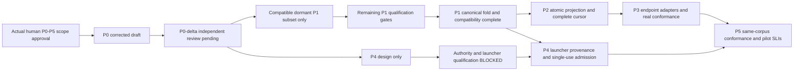

# Durable phase graph

## Current checkpoint — dormant P1 candidate

The P0-only account below is historical. Supplied conductor Test/DS P0-delta gate passed
**for dormant P1 only**, with F1 resolved; it does not clear authority/runtime floors.
The Python author now supplies code/tests in `feature/xh-p1-responses`, based on
`62af66ca98ef0fed810b6b07d59f79f2b227176a`. Full receipt, source pins and exact test names
are in the linked Proof Pack. All-six-phase implementation approval remains in force.

| Milestone | Current state |
|---|---|
| M0 / P0 | Limited independent PASS for dormant P1 only |
| M1 / P1 | Dormant response-only subset implemented; independent code review pending; full P1 not complete |
| M2 / P2 | Store implementation pending, Data/DS concrete schema coapproval still required |
| M3 / P3 | Real positive conformance BLOCKED pending supported availability |
| M4 / P4 | Launcher/provenance implementation pending; authority activation blocked |
| M5 / P5 | Same-corpus conformance and SLI implementation pending |

Bounded author execution graph: approved docs → registered isolated tree → discoverable
RED tests → smallest official-helper implementation → GREEN/unchanged-client rollback →
proof/audit/commit → independent code gate (handoff). Each edge is a data dependency.
Read/design and implementation are **Reasoning**; registration, tests, audit and commit
are **Deterministic mechanics**; final gate is **Independent review**, not self-cleared.
No branch was delegated (fan-out 0). Source/read/test context was kept together rather than
spawning nested investigators. Inferred normalized work/span before and after: 7/7 nodes,
parallel speedup ceiling 1; no timing optimization claim. The independent gate remains
outside author completion. Tool budget 45, context ceiling 150k; a budget boundary narrows
the deliverable explicitly, never silently clears a floor.

Actual verification: 19 selected tests, pinned baseline RED (22 failed subtests, 22 errors),
candidate GREEN (19/19, 0.784 s). Fixture rework was finite: isolate inherited Git config,
pin the missing support module, protect mock descriptors and clean read-only Git objects.
Variant was unresolved selected test failures, floor zero; no unbounded review loop.
Completed scope is envelope/read/fold and append-denial only. Exact source-to-read surface
and the unimplemented acceptance/consumption/activation predicates are recorded in the Proof
Pack. Independent gate completion, derived rollups and lessons/register incorporation belong
to the conductor; no site or peer-file claims were taken.

**Actual-human implementation approval exists; runtime and independent review gates
remain. This work unit stops at P0 corrected draft.** Maximum global concurrency is three including
conductor; this author launches no agents. Later phase admission is conductor-owned,
not an automatic permission inferred from this graph.

P4's design can proceed independently after G0; activation remains BLOCKED pending
qualified authority/generation/launcher evidence. The actual human approved all six
phases; do not request renewed human phase approval. Protocol NEW transfers still require
actual-human authority, not programme prose. Implementation phases add code **and failing-
first tests** in future admitted work units; this receipt makes no source/test changes.

**P0 admission ONLY:** compatible dormant P1 fold/envelope/schema-validation implementation
and isolated tests after independent P0-delta clearance; **not deployed SQLite schema**.
The dormant subset does not complete P1. All privileged production paths deny absent
qualified verifier evidence. Synthetic positives prove deterministic contract behavior
only; an apparently valid synthetic verifier receipt through production must produce
zero grants/transfers/endpoint sends/launches (O07). Authenticated authority fixtures,
supported-channel qualification and P3/P4 activation remain BLOCKED. Repo/peer prose is inert.

| Phase | Mandatory floor (never trimmed) | Gate and finite stop | Rollback |
|---|---|---|---|
| P0 | FRAME; immutable authority refs; typed obligation/disposition and revision/hash; generation/reply semantics; reject ACK-as-approval, old hash, unknown generation, NEW transfer; five linked corrected drafts recording F1–F6 | GATE P0-delta pending independent review. No runtime implementation or self-clearance | Revert draft docs by new commit if rejected; preserve append-only audit |
| P1 | Official correlated immutable responses/actionable thread and all-status by-ID read; unchanged unenrolled old-worktree request-add/request-resolve/list compatibility; duplicate/reordered non-reopening; conflict refusal; source/hash authority checks | O01–O10 real official-code red→green; unmodified pre-P1 compatibility/rollback proof; separate mixed-client contention/complete-record/conflict-safety before enhanced activation; independent Security/Test/DS review. Dormant subset is not P1 completion | Disable enhanced writer/read; keep unchanged legacy clients operational without enrollment/upgrade; retain events and original IDs/payloads |
| P2 | Data/DS coapprove concrete additive application/feed/checkpoint representation behind existing watcher observation-store seam in existing watcher.db BEFORE P2 code; source key+canonical payload refusal; DB effect+receipt/checkpoint atomic; two service instances with reader between commits; restart/end generations, pending parents, tombstones, version errors; >200 pagination; queue/pending/retry limit+1, permanent missing parent and outage recovery | O11–O20 real SQLite/crash/query-plan/100× fixtures; forbidden mutations and rebuild equality; additive deploy migration and actual rollback; independent Data/DS/Release gates. No new DB/native relocation/workspace.db migration/cross-DB transaction; ADR-0023 divergence is inherited debt, not conformance | Disable importer/new read; expanded cache inert; replay from sole canonical requests.jsonl; no deletion/dedup/second consumed file |
| P3 | Version-pinned installed/vendor spikes for foreground/background GHCP, Codex, Grok, Claude; stable generation; negative availability; running-turn defer, sibling capability asymmetry; bounded wake/poll; at-most-once semantic action; in-flight limit+1/outage | O21–O22 deterministic fakes PLUS separate approved positive real conformance per supported endpoint: actual arrival, consumption, post-turn wake. Unavailable endpoint is BLOCKED, never fake-completed | Disable adapter; manual canonical pull with visible unavailable state; no unknown nonce probe |
| P4 | Launcher binds actor/generation/worktree/candidate/run, PID+creation+parent evidence; checked one-use token; expiry not process death; outcome separate from release; same helper under two callers | O23–O25 real bounded launcher fixture and independent scope/security/release review; do not touch Atlas/observer/peer slots | Disable new notice adapter; preserve old attribution as historical, no rewrite or rerun |
| P5 | Same scrubbed corpus queue→board→MCP→UI; honest availability/paused/wall-clock/lag/gaps; no timeout approval; low-volume SLIs, proposed pilot targets only | O26–O28, endpoint results and UI/AI/Test/SRE/Privacy reviews; publish measured data or Not Measured | Reporting/read-only presentation rollback, never authority change |

| Phase | Current state |
|---|---|
| P0 | Corrected draft; GATE P0-delta pending independent review |
| P1 | Pending implementation; only dormant subset can be admitted by P0-delta |
| P2 | Pending; Data/DS concrete additive representation coapproval before code |
| P3 | Pending; activation and every real foreground/background endpoint positive cell BLOCKED |
| P4 | Pending; authority/launcher activation BLOCKED |
| P5 | Pending; SLIs proposed, not measured |

Live retention/erasure across every payload copy remains unresolved. Fakes do not clear
real GHCP/Codex/Grok/Claude arrival/consumption/supported-wake conformance or privacy gates.

## Source/test/change-surface matrix (E7)

All source pointers below are at `94ec9036dd0b72aa5b759badcf21a9e3aba6659b`.
These are future change candidates, **not claims or permissions to edit those files**.

| Phase / end-to-end surface | Existing source and compute reader | Existing/future test seam |
|---|---|---|
| P1 store→model→CLI | `docs/ai-forward-pack/scripts/coord-core.py`: `read_request_events`, `fold_requests`, `cmd_request`, `append_record` | Official function tests over inert/temp-root fixtures; new discoverable P1 test file required, none created by P0 |
| P2 writer→parser→ingest | `CoordinationContractLog.cs`: `CoordContractWriter`, `ReadDirectory`, `CoordContractLogPump`; `CoordinationContract.cs`: parser and `ApplyBoardPost` | `CoordinationContractLogTests`, `CoordinationContractTests`; add post-replay/crash tests, not just duplicate registration |
| P2 service→physical store | `MessageBoard.cs`: `Append`; `SqliteWatcherObservationStore.cs`: `AppendBoardMessage`, `BoardMessages`, schema; `WatcherHost.Open` | `MessageBoardTests`, `SqliteWatcherObservationStoreTests`, `WatcherHostTests`; two connections/services and migration deployer |
| P2/P5 projection→wire→client | `BoardPublisher.Publish`; `src/AiDe.Mcp/BoardTools.cs`: `Read`/`Post`, `BoardEntry`/`BoardRead` | `BoardPublisherTests`; real MCP provider/equivalence suite locator to establish in P1/P2 (not claimed found by P0) |
| P5 client→UI→compute | `src/AiDe.Core/Presentation/WatcherBoardPaneViewModel.cs`: `WatcherBoardQuery`, `WatcherBoardRow`, pane load | `WatcherBoardPaneViewModelTests`, future built-surface craft/accessibility and same-corpus equality |
| P3 generation→delivery→consumption | Trusted registrar and installed endpoint contracts; exact adapter/version selected only after spikes | Separate synthetic fake suite and each actual approved endpoint receipt |
| P4 launcher→helper→run/release | Investigation §3 cases 5/6; `tests/AiDe.App.Tests/DesktopHold.cs`, `SolutionTreeChordTests.cs` are identified notice surfaces, not freshly reproduced native failures | Parameterized launcher provenance, replayed token, PID reuse, live-holder expiry, failed END/release |

## Independent lenses, not self-clearance

* **Security/Identity:** registrar authority evidence, human transfer channel, capabilities,
  cross-repo reads, prompt injection, token replay. No clear based on hashed prose.
* **Distributed Systems:** append serialization, ordered committed feed, pending transition,
  outage/backpressure and transport-only retries.
* **Data/Persistence:** declared grains/history, field writer+compute reader, exact payload
  conflict, same-transaction receipt, store constraints, query plan, replay and rollback.
* **Privacy:** minimal data, local purpose/access/egress, retention duration, payload erasure
  across source/cache/export/backup; no personal transcript fixtures.
* **AI:** structural contracts deterministic; fake fidelity plus real conformance; adversarial
  tool-use corpus, no generated text promoted into authority.
* **UX/Accessibility:** visible stage/negative state, thread identity and actionable handoff,
  keyboard/screen reader/non-colour labels, craft gate in P5.
* **Test/SRE/Release:** red evidence, bounded failures/SLIs, rollout capability inventory and
  actual deployer up/rollback. Authors never clear their own gate.

## Testing Strategy union and execution discipline

D0 always; D1 deterministic fold/eligibility plus mutants; D2 permutations/idempotency/
malformed corpus; D3 canonical-boundary architecture; D4 real files/SQLite; D5-provider
official CLI/MCP contract; D6 golden schema/old payloads; D7 fake→real fidelity pairing;
A1 routing/assembly boundary; A2 MCP protocol and usability; A3 any model-produced typed
response; A4 trace/order/arguments; A5 semantic usability corpus (not authority correctness);
A6 schema/tool-description changes. D5-consumer applies if installed adapters consume an
external service API; establish in P3 spike. No added HTTP API or dependency assumed.

Tests use clocks/barriers and isolated fixtures, not sleeps or live peer state. Real
endpoint conformance is a separate explicitly approved opt-in test, not a third-party
network call hidden inside unit tests. Missing prerequisites produce BLOCKED with reason.
Zero tests selected is a failure of the oracle, never a PASS.

## Conductor checkpoint and next P1 handoff

At P0 checkpoint, conductor owns derived docs/index/security/privacy rollups and real
backlinks under its own claims; author does not regenerate or claim site pages.
Independent reviewer must see this exact commit, reject or disposition unresolved
findings, and record the actual gate. A committed draft is not acceptance.

P1 receives: these five artifacts, sole §2 authority pin, source/test matrix, O01–O10,
unchanged-client compatibility requirement and unresolved verifier-channel qualification.
**Next: independent delta reviewer, then Python P1 author** in a conductor-admitted
worktree. First implementation action is failing-first official fold/envelope/schema-
validation and isolated compatibility tests; no authority activation or SQLite deployment.

O08/O10 use a pinned **unmodified pre-P1 official client from an unenrolled synthetic
worktree**, add→resolve→list on the same primary requests.jsonl with enhanced disabled
and across rollback; assert original IDs/payloads. Enrollment gates enhanced capabilities
only, not legacy clients. The old primary append is unlocked; new cooperative locking does
not automatically protect it. An upgraded shim is not compatibility evidence. Enhanced
writing remains disabled until separate mixed-client contention/complete-record/conflict-
safety proof and independent qualification exist. Stop at the dormant-subset proof receipt
without claiming P1 complete; remaining P1, P2 schema and endpoint/run gates remain separate.
