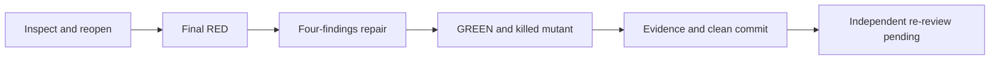
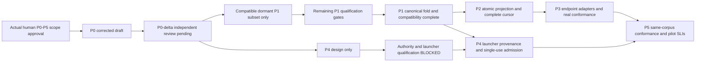
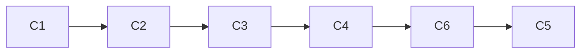

# Durable phase graph

## Current checkpoint — full P1 definition gate, 2026-09-17

The [canonical Proof Pack](../proof/cross-harness-coordination-proof-pack.md) records
the complete O01–O10 matrix at `9d82c4e088dbdde69626749de625386a1492a9c8`.
The four f410 fixes and later independently cleared mechanics remain resolved.
Current execution: **71 tests GREEN; 20/20 semantic mutants killed; zero errors**.
No source changes or new authority/provider are needed to restate that evidence.

| Milestone | Current state and exact remaining gate |
|---|---|
| P0 | Retained limited independent admission for dormant P1; actual-user P0–P5 implementation approval unchanged |
| P1 | Acceptance, consumption, immutable references/supersession, scoped proposals, full operation keys and response semantics pass synthetic oracles. **Full P1 BLOCK**: authenticated scoped positive, admitted-append original receipt, unchanged MIXEDCLIENT contention/complete-record/conflict safety, and current-pin cross-language qualification remain unproved. Enhanced append stays disabled |
| P2 | Conductor reports real SQLite/Data/DS staged candidate and 311-green receipt-recovery work atop `e3330489`; not merged into this branch and not inspected or changed here. Its owner retains remaining qualification/landing work |
| P3 | Qualified registrar-generation and authenticated decision-channel integration remain external work. Real installed foreground/background arrival/consumption/wake positives remain explicit, not replaced by synthetic P1 policy |
| P4 | Actual-human transfer and qualified launcher/run binding remain external; no grant or launch activation here |
| P5 | Same-corpus surfaces, hard states and measured SLIs remain with their owners; no new claim from this Python run |

Smallest next handoff: independent Test re-gate of the committed matrix, then the existing
writer-admission/DS owner resolves the MIXEDCLIENT positive seam and the Security/P3/P4
owner qualifies the human channel/generation source. This is **not a fresh user approval
request**. Do not invent an endpoint registry or admitted writer in a P1 fixture.

The serial receipt graph is grounding → current suite/mutations → mechanical path/matrix
correction → independent handoff. Author budget 30 tools, context 150k, fan-out zero.
The source stays pinned; the finite exit is an exact PASS/BLOCK matrix, not full runtime
activation. The sections below are retained historical checkpoints, not current status.

## Historical checkpoint — bounded P1 mechanics candidate

All **M0–M5 remain the approved programme goal**. This increment implements C02's
deterministic acceptance/consumption/proposal/reference mechanics without claiming C08
endpoint qualification. It has no circular P1→P3→P1 admission requirement.

| Milestone | Evidence and next gate |
|---|---|
| M0 / P0 | Limited dormant-code gate retained. Supplied independent Test/DS/Security four-fix PASS on exact `f4109e144d4c56d16b4548013e948d0ba1f50e36`, receipts 722/726, recorded verbatim in scope in Proof Pack |
| M1 / P1 | Official enhanced fold now reads standalone proposals, explicit revisions/supersession, all-required-peer exact acceptance and exact recipient consumption. Local real-Git integrity plus externally supplied trusted policy context; production context absent/DENY. 49 tests GREEN and nine selected guard mutants killed (767). **Next: independent Test/Security gate on committed candidate**, then unmet shared-vector/C# and mixed-client writer qualification. Full P1 not complete |
| M2 / P2 | **Data & Persistence and Distributed Systems schema approval before code.** Additive existing watcher.db cache behind current store seam only; real SQLite effect/receipt/checkpoint transactions, pagination, pending/retry bounds, crash/rebuild and migration/rollback proof owed |
| M3 / P3 | Real installed-harness/version spikes; authenticated peer→session lifecycle and decision-resolver integration; foreground/background arrival/consumption/post-turn-wake cells remain BLOCKED, never replaced by fakes |
| M4 / P4 | Actual-human NEW-transfer authorization and qualified launcher/candidate/session/generation/process/single-use run binding; no launcher, slots or run activation in P1 |
| M5 / P5 | Same-corpus queue/board/MCP/UI conformance, hard-state accessibility and measured cross-surface SLIs; no inferred targets promoted to measurements |

The small shared Python helper is project-neutral where the contract is already concrete.
It is not an authority database, cached token, generic framework or product adapter.
Synthetic policy is selected solely in test composition. Canonical data, env values,
CLI options and receipt strings cannot enable it in production. All acceptance paths
still confer **zero ownership/run/transfer/START rights**. Enhanced production append stays
disabled until unchanged-client contention/complete-record/conflict evidence is available.
Default legacy list/writer compatibility and unmodified `94ec9036` real-CLI rollback ran.

Execution graph: contract/grounding → failing-first tests → minimum helper + official
integration → finite boundary/guard evidence → clean candidate commit → independent review.
Nodes are reasoning, deterministic mechanics, then independent review; no nested agents.
Serial span equals work (five author nodes; normalized estimate, **Inferred**); widening
would buy no span reduction over shared source edits. Budget 45 calls / 150k context;
no re-budgeting. Remaining-finding count terminates each finite correction; budget stops
with a coherent candidate, never with self-cleared qualification.
Observed overhead: oversized initial read outputs, one zero-test runner correction,
one new-boundary correction and one surviving-generation-mutant test correction.
The Proof Pack names exact red/green/mutation receipts, pins, controls and unmet floors.

**Deferred upstream dependency is unchanged:** only **after verified P0–P5**, prepare the
explicitly requested AI-Forward upstream handoff in its own worktree. No upstream discovery
or edits now. Shared protocol/CLI mechanics may be reused; watcher/store/WPF/composition
adapters remain product-specific. Private/session/customer material never transfers.

## Historical checkpoint — dormant P1 four-finding repair

The Python author repaired independent F1–F4 on
`ec85de0be8713bbd20d2b2035df2c4c5bf4c8126` in the same officially reopened
`xh-p1-responses-b0d0` worktree/session. The linked Proof Pack is the record of
source/test SHA-256 pins, actual CLI receipts, meaningful RED and killed-mutant results.
**Independent re-review is pending; full P1 and every runtime activation remain uncleared.**

| Milestone | Current implementation / next required evidence |
|---|---|
| M0 / P0 | Limited PASS at `62af66ca` admits dormant P1 code only; not authority/runtime approval |
| M1 / P1 | F1 typed legacy conflict, F2 reserved-envelope refusal, F3 explicit collaboration CLI failure and F4 five independent correlation controls repaired. 27 tests GREEN; RED 21 subtest failures/0 errors; correlation mutant killed by 10 subtest failures. Next: independent re-review, then acceptance, consumption, proposal supersession/full immutable reference and authority verification, cross-language vectors, and unchanged mixed-client contention/complete-record/conflict qualification |
| M2 / P2 | Pending real SQLite service/store tests, source effect + receipt/checkpoint transaction, pagination, pending/retry bounds, crash/rebuild and additive migration/rollback; Data/DS coapprove before code |
| M3 / P3 | Pending installed-version/vendor spikes against real supported endpoints; each arrival/consumption/post-turn-wake positive cell remains BLOCKED until actual evidence, not fakes |
| M4 / P4 | Pending qualified launcher actor/generation/worktree/candidate/run binding, PID/creation/parent provenance, single-use admission and real bounded launcher proof |
| M5 / P5 | Pending same-corpus queue/board/MCP/UI conformance, hard-state accessibility and measured cross-surface SLIs; targets are not measurements |

### Finite repair graph and cost ledger

| Node | Capability | Input → exit condition | Dependency |
|---|---|---|---|
| R1 | Reasoning | Assigned tree, actual code and governing spec/design → contracts and official session reopened | None |
| R2 | Deterministic mechanics | Four findings → new tests observed failing against unchanged `ec85de0b` | R1 decision |
| R3 | Reasoning | Final RED → smallest source repair; no new runtime capability | R2 data |
| R4 | Deterministic mechanics | Fixed source → GREEN, actual CLI and pinned old-client rollback, guard-False mutant killed, pristine discovery GREEN | R3 data |
| R5 | Deterministic mechanics | Receipts → proof/plan/audit committed; edit claims released; session ended | R4 data |
| G1 | Independent review | Exact author commit → reviewer dispositions, not author approval | R5 data |

No nested agents; global conductor cap remains three. Per-author budget **35 tool calls**,
context ceiling **150k**. Shared source/test resources keep edits serial. Before/after
normalized work/span are **6/6 nodes, inferred**, width one, speedup ceiling one;
independent review stays outside author completion. No measured speedup claim.
Variant: unaddressed findings `{F1,F2,F3,F4}` → empty after R4; floor zero.
A budget firing stops with explicit evidence gaps, never silently clears a gate.
One fixture-only rework isolated append subcases before final RED. Several oversized
initial read outputs required narrowed reads; these were investigation overhead, not
extra product scope. Runtime tokens were not recorded. The audit start marker was set
at 17:54:38Z, after early reads/session reopen; its duration is not full-turn elapsed time.
The official closing audit records calls consumed through that append against the declared
budget; final lifecycle verification is reported separately if another call is needed.

### Deferred reusable-versus-product inventory — remaining design only

Actual-human approval covers P0–P5. No repeated phase permissions are requested.
The subsequent upstream AI-Forward push is an explicit user request **dependent on
verified P0–P5**, to be performed later from its own worktree. It is not authorized
work in this repair. No upstream repository was discovered, inspected or modified.

| Candidate boundary | Later disposition |
|---|---|
| Shared protocol, portable envelope validation, canonical fold, CLI contracts and synthetic compatibility controls | Keep project-neutral where demonstrated reuse exists; inventory for upstream only after P0–P5 verification |
| AI-DE watcher-store/SQLite integration, WPF projections and composition-root adapters | Keep product-specific and separate from shared contracts |
| Generic layers without a proven second use | Do not introduce speculative abstractions |
| Private/session/customer data, real transcripts, credentials or endpoint state | Exclude from any upstream handoff; use scrubbed synthetic contract fixtures |

Final programme handoff must name verified reusable artifacts, product adapter boundaries,
remaining gaps and evidence before the separately requested upstream push.

## Prior checkpoint — original dormant P1 candidate (historical)

The P0-only account below is historical. Supplied conductor Test/DS P0-delta gate passed
**for dormant P1 only**, with F1 resolved; it does not clear authority/runtime floors.
The Python author now supplies code/tests in `feature/xh-p1-responses`, based on
`62af66ca98ef0fed810b6b07d59f79f2b227176a`. Full receipt, source pins and exact test names
are in the linked Proof Pack. All-six-phase implementation approval remains in force.

| Milestone | Current state |
|---|---|
| M0 / P0 | Limited independent PASS for dormant P1 only |
| M1 / P1 | Dormant response-only subset implemented; independent code review pending; full P1 not complete |
| M2 / P2 | Store implementation pending, Data/DS concrete schema coapproval still required |
| M3 / P3 | Real positive conformance BLOCKED pending supported availability |
| M4 / P4 | Launcher/provenance implementation pending; authority activation blocked |
| M5 / P5 | Same-corpus conformance and SLI implementation pending |

Bounded author execution graph: approved docs → registered isolated tree → discoverable
RED tests → smallest official-helper implementation → GREEN/unchanged-client rollback →
proof/audit/commit → independent code gate (handoff). Each edge is a data dependency.
Read/design and implementation are **Reasoning**; registration, tests, audit and commit
are **Deterministic mechanics**; final gate is **Independent review**, not self-cleared.
No branch was delegated (fan-out 0). Source/read/test context was kept together rather than
spawning nested investigators. Inferred normalized work/span before and after: 7/7 nodes,
parallel speedup ceiling 1; no timing optimization claim. The independent gate remains
outside author completion. Tool budget 45, context ceiling 150k; a budget boundary narrows
the deliverable explicitly, never silently clears a floor.

Actual verification: 19 selected tests, pinned baseline RED (22 failed subtests, 22 errors),
candidate GREEN (19/19, 0.784 s). Fixture rework was finite: isolate inherited Git config,
pin the missing support module, protect mock descriptors and clean read-only Git objects.
Variant was unresolved selected test failures, floor zero; no unbounded review loop.
Completed scope is envelope/read/fold and append-denial only. Exact source-to-read surface
and the unimplemented acceptance/consumption/activation predicates are recorded in the Proof
Pack. Independent gate completion, derived rollups and lessons/register incorporation belong
to the conductor; no site or peer-file claims were taken.

**Actual-human implementation approval exists; runtime and independent review gates
remain. This work unit stops at P0 corrected draft.** Maximum global concurrency is three including
conductor; this author launches no agents. Later phase admission is conductor-owned,
not an automatic permission inferred from this graph.

P4's design can proceed independently after G0; activation remains BLOCKED pending
qualified authority/generation/launcher evidence. The actual human approved all six
phases; do not request renewed human phase approval. Protocol NEW transfers still require
actual-human authority, not programme prose. Implementation phases add code **and failing-
first tests** in future admitted work units; this receipt makes no source/test changes.

**P0 admission ONLY:** compatible dormant P1 fold/envelope/schema-validation implementation
and isolated tests after independent P0-delta clearance; **not deployed SQLite schema**.
The dormant subset does not complete P1. All privileged production paths deny absent
qualified verifier evidence. Synthetic positives prove deterministic contract behavior
only; an apparently valid synthetic verifier receipt through production must produce
zero grants/transfers/endpoint sends/launches (O07). Authenticated authority fixtures,
supported-channel qualification and P3/P4 activation remain BLOCKED. Repo/peer prose is inert.

| Phase | Mandatory floor (never trimmed) | Gate and finite stop | Rollback |
|---|---|---|---|
| P0 | FRAME; immutable authority refs; typed obligation/disposition and revision/hash; generation/reply semantics; reject ACK-as-approval, old hash, unknown generation, NEW transfer; five linked corrected drafts recording F1–F6 | GATE P0-delta pending independent review. No runtime implementation or self-clearance | Revert draft docs by new commit if rejected; preserve append-only audit |
| P1 | Official correlated immutable responses/actionable thread and all-status by-ID read; unchanged unenrolled old-worktree request-add/request-resolve/list compatibility; duplicate/reordered non-reopening; conflict refusal; source/hash authority checks | O01–O10 real official-code red→green; unmodified pre-P1 compatibility/rollback proof; separate mixed-client contention/complete-record/conflict-safety before enhanced activation; independent Security/Test/DS review. Dormant subset is not P1 completion | Disable enhanced writer/read; keep unchanged legacy clients operational without enrollment/upgrade; retain events and original IDs/payloads |
| P2 | Data/DS coapprove concrete additive application/feed/checkpoint representation behind existing watcher observation-store seam in existing watcher.db BEFORE P2 code; source key+canonical payload refusal; DB effect+receipt/checkpoint atomic; two service instances with reader between commits; restart/end generations, pending parents, tombstones, version errors; >200 pagination; queue/pending/retry limit+1, permanent missing parent and outage recovery | O11–O20 real SQLite/crash/query-plan/100× fixtures; forbidden mutations and rebuild equality; additive deploy migration and actual rollback; independent Data/DS/Release gates. No new DB/native relocation/workspace.db migration/cross-DB transaction; ADR-0023 divergence is inherited debt, not conformance | Disable importer/new read; expanded cache inert; replay from sole canonical requests.jsonl; no deletion/dedup/second consumed file |
| P3 | Version-pinned installed/vendor spikes for foreground/background GHCP, Codex, Grok, Claude; stable generation; negative availability; running-turn defer, sibling capability asymmetry; bounded wake/poll; at-most-once semantic action; in-flight limit+1/outage | O21–O22 deterministic fakes PLUS separate approved positive real conformance per supported endpoint: actual arrival, consumption, post-turn wake. Unavailable endpoint is BLOCKED, never fake-completed | Disable adapter; manual canonical pull with visible unavailable state; no unknown nonce probe |
| P4 | Launcher binds actor/generation/worktree/candidate/run, PID+creation+parent evidence; checked one-use token; expiry not process death; outcome separate from release; same helper under two callers | O23–O25 real bounded launcher fixture and independent scope/security/release review; do not touch Atlas/observer/peer slots | Disable new notice adapter; preserve old attribution as historical, no rewrite or rerun |
| P5 | Same scrubbed corpus queue→board→MCP→UI; honest availability/paused/wall-clock/lag/gaps; no timeout approval; low-volume SLIs, proposed pilot targets only | O26–O28, endpoint results and UI/AI/Test/SRE/Privacy reviews; publish measured data or Not Measured | Reporting/read-only presentation rollback, never authority change |

| Phase | Current state |
|---|---|
| P0 | Corrected draft; GATE P0-delta pending independent review |
| P1 | Pending implementation; only dormant subset can be admitted by P0-delta |
| P2 | Pending; Data/DS concrete additive representation coapproval before code |
| P3 | Pending; activation and every real foreground/background endpoint positive cell BLOCKED |
| P4 | Pending; authority/launcher activation BLOCKED |
| P5 | Pending; SLIs proposed, not measured |

Live retention/erasure across every payload copy remains unresolved. Fakes do not clear
real GHCP/Codex/Grok/Claude arrival/consumption/supported-wake conformance or privacy gates.

## Source/test/change-surface matrix (E7)

All source pointers below are at `94ec9036dd0b72aa5b759badcf21a9e3aba6659b`.
These are future change candidates, **not claims or permissions to edit those files**.

| Phase / end-to-end surface | Existing source and compute reader | Existing/future test seam |
|---|---|---|
| P1 store→model→CLI | `docs/ai-forward-pack/scripts/coord-core.py`: `read_request_events`, `fold_requests`, `cmd_request`, `append_record` | Official function tests over inert/temp-root fixtures; new discoverable P1 test file required, none created by P0 |
| P2 writer→parser→ingest | `CoordinationContractLog.cs`: `CoordContractWriter`, `ReadDirectory`, `CoordContractLogPump`; `CoordinationContract.cs`: parser and `ApplyBoardPost` | `CoordinationContractLogTests`, `CoordinationContractTests`; add post-replay/crash tests, not just duplicate registration |
| P2 service→physical store | `MessageBoard.cs`: `Append`; `SqliteWatcherObservationStore.cs`: `AppendBoardMessage`, `BoardMessages`, schema; `WatcherHost.Open` | `MessageBoardTests`, `SqliteWatcherObservationStoreTests`, `WatcherHostTests`; two connections/services and migration deployer |
| P2/P5 projection→wire→client | `BoardPublisher.Publish`; `src/AiDe.Mcp/BoardTools.cs`: `Read`/`Post`, `BoardEntry`/`BoardRead` | `BoardPublisherTests`; real MCP provider/equivalence suite locator to establish in P1/P2 (not claimed found by P0) |
| P5 client→UI→compute | `src/AiDe.Core/Presentation/WatcherBoardPaneViewModel.cs`: `WatcherBoardQuery`, `WatcherBoardRow`, pane load | `WatcherBoardPaneViewModelTests`, future built-surface craft/accessibility and same-corpus equality |
| P3 generation→delivery→consumption | Trusted registrar and installed endpoint contracts; exact adapter/version selected only after spikes | Separate synthetic fake suite and each actual approved endpoint receipt |
| P4 launcher→helper→run/release | Investigation §3 cases 5/6; `tests/AiDe.App.Tests/DesktopHold.cs`, `SolutionTreeChordTests.cs` are identified notice surfaces, not freshly reproduced native failures | Parameterized launcher provenance, replayed token, PID reuse, live-holder expiry, failed END/release |

## Independent lenses, not self-clearance

* **Security/Identity:** registrar authority evidence, human transfer channel, capabilities,
  cross-repo reads, prompt injection, token replay. No clear based on hashed prose.
* **Distributed Systems:** append serialization, ordered committed feed, pending transition,
  outage/backpressure and transport-only retries.
* **Data/Persistence:** declared grains/history, field writer+compute reader, exact payload
  conflict, same-transaction receipt, store constraints, query plan, replay and rollback.
* **Privacy:** minimal data, local purpose/access/egress, retention duration, payload erasure
  across source/cache/export/backup; no personal transcript fixtures.
* **AI:** structural contracts deterministic; fake fidelity plus real conformance; adversarial
  tool-use corpus, no generated text promoted into authority.
* **UX/Accessibility:** visible stage/negative state, thread identity and actionable handoff,
  keyboard/screen reader/non-colour labels, craft gate in P5.
* **Test/SRE/Release:** red evidence, bounded failures/SLIs, rollout capability inventory and
  actual deployer up/rollback. Authors never clear their own gate.

## Testing Strategy union and execution discipline

D0 always; D1 deterministic fold/eligibility plus mutants; D2 permutations/idempotency/
malformed corpus; D3 canonical-boundary architecture; D4 real files/SQLite; D5-provider
official CLI/MCP contract; D6 golden schema/old payloads; D7 fake→real fidelity pairing;
A1 routing/assembly boundary; A2 MCP protocol and usability; A3 any model-produced typed
response; A4 trace/order/arguments; A5 semantic usability corpus (not authority correctness);
A6 schema/tool-description changes. D5-consumer applies if installed adapters consume an
external service API; establish in P3 spike. No added HTTP API or dependency assumed.

Tests use clocks/barriers and isolated fixtures, not sleeps or live peer state. Real
endpoint conformance is a separate explicitly approved opt-in test, not a third-party
network call hidden inside unit tests. Missing prerequisites produce BLOCKED with reason.
Zero tests selected is a failure of the oracle, never a PASS.

## Conductor checkpoint and next P1 handoff

At P0 checkpoint, conductor owns derived docs/index/security/privacy rollups and real
backlinks under its own claims; author does not regenerate or claim site pages.
Independent reviewer must see this exact commit, reject or disposition unresolved
findings, and record the actual gate. A committed draft is not acceptance.

P1 receives: these five artifacts, sole §2 authority pin, source/test matrix, O01–O10,
unchanged-client compatibility requirement and unresolved verifier-channel qualification.
**Next: independent delta reviewer, then Python P1 author** in a conductor-admitted
worktree. First implementation action is failing-first official fold/envelope/schema-
validation and isolated compatibility tests; no authority activation or SQLite deployment.

O08/O10 use a pinned **unmodified pre-P1 official client from an unenrolled synthetic
worktree**, add→resolve→list on the same primary requests.jsonl with enhanced disabled
and across rollback; assert original IDs/payloads. Enrollment gates enhanced capabilities
only, not legacy clients. The old primary append is unlocked; new cooperative locking does
not automatically protect it. An upgraded shim is not compatibility evidence. Enhanced
writing remains disabled until separate mixed-client contention/complete-record/conflict-
safety proof and independent qualification exist. Stop at the dormant-subset proof receipt
without claiming P1 complete; remaining P1, P2 schema and endpoint/run gates remain separate.

## Bounded pre-runtime correction: artifact-class lease refusal (2026-09-17)

This is a prerequisite correction inside the approved programme, not a new runtime phase.
Goal: reconcile worker behavior and the official claim guard with the existing artifact registry.
Done when: concrete derived claims are refused without new lease events, compatibility controls
and a meaningful guard-removal mutant pass in isolated Git fixtures, and evidence is committed.
Not in scope: registry reinstallation, authored-site reclassification, glob-intersection redesign,
live claim experiments, historical lease cleanup, primary/P2 edits, or activation.
Tier: T2. Fan-out: 0, as directed. Main-line budget: 22 tool calls. Context ceiling: 150k.

| Node | Capability | Input / dependency | Exit |
|---|---|---|---|
| C1 | Reasoning | User findings; official classifier and dispatch | Identify eligibility gap without re-investigating the resolved handoff |
| C2 | Deterministic mechanics | C1 decision | Copied official CLI grants a derived lease; denial assertion is red |
| C3 | Reasoning | C2 evidence | Dispatch-only refusal, shared registry retained, malformed classification closed |
| C4 | Deterministic mechanics | C3 data | Concrete paths, compatibility, linked tree, and guard-removal oracle pass |
| C5 | Independent review | C4 evidence and exact commit | Parent/conductor dispositions rollout; no author self-clearance |
| C6 | Deterministic mechanics | C4 evidence | DC-163, this plan, canonical proof and own audit recorded; ordinary local commit |

Before/after: retain one tightly coupled chain; combine compatibility selectors into one runner.
No agent fan-out, no retries, no open-ended refinement loop. Tests enumerate a finite case set.
Inferred unit-cost model: six nodes, work and span both six, width one; there is no useful
parallel speedup to buy. This is not measured wall-clock cost. Re-plan only for a failed oracle;
the budget is a reporting boundary, not permission to remove a gate.

Mandatory surfaces: primary registry → shared-root resolution → normalized claim classification
→ stderr/exit status → absence of appended lease → future check/precommit readers. No schema,
UI, endpoint, or event format changes. D0/D1/D2/D4/D5-provider apply: real CLI/filesystem/Git,
boundary spellings, stable refusal codes and mutation. No external service, new dependency,
or model call is introduced. Existing registers retain union and derived artifacts regeneration.

Observed C4: 81 tests passed in 27.449 seconds, including 10 new tests and all 71 existing P1
tests. One new guard-removal mutant demonstrably grants and defeats the denial oracle; the
earlier 20 P1 mutants are unchanged historical evidence, not rerun claims. See the canonical
`docs/proof/cross-harness-coordination-proof-pack.md` for pins and the red/green split.
C5 remains independent; this local commit does not activate any P0–P5 capability.

**Worker contract before further runtime work:** use the authoritative registry, classify the
exact target, and lease only authored paths with TTL 300 for edit minutes; release before tests.
Do not lease register/derived paths. An old helper does not acquire this guard by publication of
a proof. Isolated linked-tree proof supports a pinned updated absolute CLI path as a possible
temporary rollout route; the foreground must select and verify its actual deployment. No primary
copy, hook, or worker installation was changed here. Broad overlapping wildcard claims remain
outside the concrete-path guarantee (DC-163).
