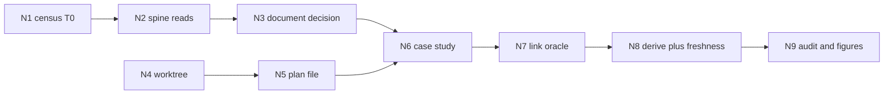

# Execution graph — journey case study

Prompt: produce an HTML case study of this repo’s journey from specification to implementation, grounded in the audit log and prompt history, linking specs, architecture and mockups. A full documentation-bundle regeneration was invited, not required.

Triage: planning applies. The work has a read loop, a decision that changes later nodes, and a verification gate. Tier T1.

The pack id `kb-graph-and-loop-engineering` is not an artifact in this repo’s docs graph, so this plan does not link it. The directives used are `.claude/knowledge/execution-graph-optimization.md` (GO1–GO19).

## Naive graph

Serial, in the order a cold reading suggests: read the whole ledger, every spec, every session note; run `/document` over the public C# surface; then write the HTML; then look at it.

That shape spends the span on a regeneration the repository already has (`docs/api/`, `docs/diagrams/`, `docs/index.html`, `docs/_site/index.html`, ledger entry `al-0388`). It would prove doc freshness this session did not need in order to tell the journey, and it would delay the page that was asked for.

## Floors kept

| Floor | Where it sits |
|---|---|
| Worktree before any write (WT1) | Before the plan file and the page |
| Claims counted from the ledger, not recalled | Census node, T0 |
| No claim that docs were re-verified against code | Copy rule on the page |
| Link oracle: every relative href resolves | After the page |
| Docs-graph derive for the new frontmatter | After the markdown exists |
| `docs-graph.py freshness` as the consistency check of the existing bundle | After derive. A red result is reported, not repaired into a silent regen |
| Audit entry with goal, done-when, tier (AL5, AL5b) | Last |
| Site ledger/artifact figures updated if those counts move | After the audit append, via `verify-site-figures.py --update` |

`/document`’s full definition of done is not a floor of this prompt. The invitation was “feel free”. Running it would be a different episode. The page is forbidden to talk as if that episode happened.

## Optimized graph

| Node | Capability | Goal | Exit | Tier |
|---|---|---|---|---|
| N1 | Deterministic mechanics | Count kinds, skills, prompts, dates from the two jsonl files | Script printed and the numbers below match it | T0 |
| N2 | Reasoning | Read the seed, spec opening, architecture status, site thesis, landmark ledger rows | Each chapter’s claim has a path or an `al-` id | T1 |
| N3 | Reasoning | Decide whether `/document` runs | Recorded: it does not. Existing bundle is linked. Freshness is the check | T1 |
| N4 | Deterministic mechanics | Own worktree on `feature/journey-case-study` | `coord-core.py worktree new` printed the path | T0 |
| N5 | Reasoning | This plan | File exists with floors and the veto note | T1 |
| N6 | Reasoning | HTML case study, explorer stub, proof note, nav and map links | Page states the corpus boundary | T1 |
| N7 | Deterministic mechanics | Every relative link resolves on disk | Checker exits 0. Oracle: a missing file fails the script | T0 |
| N8 | Deterministic mechanics | `docs-graph.py derive`, then `freshness` | Derive exits 0. Freshness result copied into the proof, pass or fail | T0 |
| N9 | Deterministic mechanics | Audit append, render, figure update | New ledger line; site figures match the script | T0 |

Edges: N1→N2 and N2→N3 are data edges. N3→N6 is a decision edge (the page’s documentation chapter changes if N3 flips). N4→N5→N6 is a real ordering constraint (no writes before the worktree). N7 depends on N6. N8 depends on the markdown. N9 depends on N8 because the artifact count must include the new docs. Incidental order removed: mockup reading does not wait on the change-log pass; both fed N2.

## Measures

Counted before this page was added, from the committed ledger at `88e0c33f`:

| Quantity | Value | Label |
|---|---|---|
| Audit rows | 796 | Verified, json parse |
| Change rows | 155 | Verified |
| Prompt entries | 132 | Verified |
| Distinct prompt strings | 71 | Verified, whitespace-folded |
| Multiplicity | 50×1, 16×2, 3×4, 1×6, 1×32 | Verified |
| August prompt entries / distinct | 78 / 22 | Verified, datetime before 2026-09-01 |
| September prompt entries / distinct | 54 / 49 | Verified |
| The 32-count sentence | “do the next steps you have listed provide the standard status and next steps tables afterwards” | Verified, all 32 sit in August |
| Sessions | 130 | Verified |
| Ledger span | 2026-08-23 to 2026-09-18 | Verified |
| Skill field counts | implement 290, execute-with-coordination 93, investigate 68, ui-design 32, specify 19, define-architecture 17, design-slice 14, optimize-graph 12, dream 11, collectknowledge 6, document 5 | Verified |

Work `T₁` and span `T∞` in hours were not measured ahead of the run. No similar “case study” episode is in the ledger, so a duration model would be invented. The closing audit entry records `duration_seconds` from the start marker instead.

## Concurrency

N1’s file reads were independent of each other. Width cap 4. No shared write. Join rule: a missing path is named and the chapter that needed it is not written. No product-code fan-out. No loop except “fix a link the checker rejects”, variant = number of failing hrefs, floor 0, cap 3, and a third failure stops for a human rather than editing around it.

## Disconfirm

Test Architect: the optimized plan does not re-prove that API comments match the code. That proof is not replaced by a softer sentence. The page is required to say the bundle was not regenerated this session. Freshness of the docs graph is still run, and its result is recorded. Author note: this veto was applied in the same session, not by a second person.

Simplifier: a second full essay in markdown does not earn its place. `docs/journey/index.md` is the explorer stub. The essay is the HTML.

SRE: the bottleneck of the naive plan is `/document` over a public surface the site figure lists in the thousands. That cost is from the skill’s own definition of done, not from a measurement of this run. It is labelled Inferred. Removing the node is justified because completeness of the asked page does not rise by regenerating it, and the honesty constraint above keeps rigor.

## Budget and degradation

If freshness fails, report the failure in the proof and on the page. Do not start `/document` to make it green. If a link target is missing, fix the href or delete it. Do not invent a page. If derive rejects frontmatter, fix the frontmatter. The worktree stays after the session until the branch is merged or explicitly cleaned up (WT6).

## Cost versus delivery

Planned nodes: 9. Executed: the same 9. Rework passes: 1. The prompt was first appended while the shell was still in the primary checkout; the two audit files there were restored with git checkout, and the prompt was logged again in this worktree.

Link oracle: 105 relative references, 0 missing. docs-graph.py validate: 0 defects, 546 artifacts. /document stayed off the path. Measured duration on the closing audit entry is 502.0 seconds from a start marker set after the grounding reads, so it does not cover the census. No second duration was invented to fill that gap.
