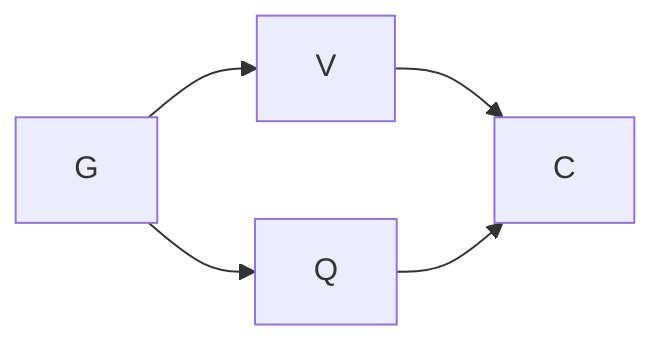

# Goal state and bounded graph

## Superseding completion — 2026-09-15

G, V, Q and C are complete on the isolated branch. Full required runner: 38/38 PASS at `3284acc55d906cdd5beb7e80527200b8bdf3f491`; independent Test Architect/Simplifier PASS at `3665e51f`. Core's exact corrections were consumed through the prescribed join. The peer holder explicitly released the conflicting audit leases; no expiry or bypass supplied consent. Owner O10 authorizes the final status reconciliation and Core handoff. Main publication of this continuation remains a separate Core action. See `docs/proof/ownership-qualification.md` for exact evidence and receipt reuse limits.

Actual work added a coordinated lease interruption and two Core-owned metadata corrections to the planned graph. Conductor call total is not reliably available after continuation; do not infer a measured total or claim the 35-call estimate was met. Reviewer 14/12-call overrun is recorded. Required checks and scope were preserved; the unresolved qualification obligations reached zero. Earlier planning and checkpoint statements below remain historical.

Goal: resolve the former shared-audit blocker and continue with the next isolated action.
Done when: current qualification is observed, the landed programme status is reconciled, and the obsolete section-2 prose is corrected by its owner or has an exact coordinated handoff.
Not in scope: product code, ownership decisions, Atlas/Grok work, cleanup, or Codex main publication.
Tier T1; fan-out cap 4 including Astra Owner and Conductor. Owner O8 approves this scope.

| Node | Work | Dependency | Exit / failure oracle |
|---|---|---|---|
| G | Read live resolutions, main ancestry and changed inputs | none | SHA ancestry and source inspected; stale records not treated as current |
| V | Independently review the published blocker fix | G | Test/Simplifier PASS; linked-tree liveness self-test can fail |
| Q | Qualify current branch using unchanged input receipts | G | source/tests/build inputs and TRX hashes match; full required gate runner passes |
| C | Close status and coordinate obsolete §2 prose | V + Q; new Core authority for §2 edit | committed proof; owner correction/handoff; no invented assignments |

Naive: reimplement the blocker and repeat the .NET run before discovering the fix is already published. Optimized: reuse the published fix and original receipts only after exact input checks. No rigor node removed. V and Q are read-only in separate worktrees; no shared authoring resource. At most one transient retry; a failing check is evidence, not a retry trigger. Partial review blocks C acceptance. Containment: own worktrees and exact documentation paths only. Loop variant: unresolved verification/correction obligations; two nondecreasing passes require diagnosis, never a waiver. No empirical speedup or token saving is asserted.

Budget (Inferred): Conductor 35 calls, reviewer 12 calls / 10 minutes / 10k tokens; no author until a new Core grant exists. Model allocation: Astra Owner/Conductor for scope; retained Sol high reviewer for bounded adversarial verification. Cost overruns are recorded, not retroactively enlarged. Periodic user updates use a task/description/status table.

Grounding reuses the previous complete constitution/workflow pass, DC-118 and DC-088 lessons, and the existing specification/design: no new architecture or ownership grammar. Read optimize-graph and execute-with-coordination definitions for this continuation. Referenced graph-and-loop knowledge directory was absent at the prior baseline; no invented traversal. Doctor observes 11 registry patterns and effective merge drivers; three shared regeneration markers are owed. Use the own-tree regeneration orchestrator; do not run a shared producer over primary as a shortcut.

Verified at grounding: main `0b3644f22f16dffee32bd9a9a7fb212ad1639508` contains candidate `f7fd470` via Claude landing `33e9ae7e` and blocker fix `553bb9bc`. Request `req-01M2JTCR30AJ256HJFZHZJNRPX` was resolved by Claude. Section 2 still says non-recursive/gap open; new request `req-01M2K0QEPYF0CEWHPBKYQ72GY6` asks its owner to correct only obsolete prose. The original Ruling 113 grant has lapsed.

Planned versus actual: G and V complete. Independent Test/Simplifier PASS; reviewer14/12calls, stale patch-context overrun recorded. Core supplied the §2 closure and two additional observed metadata-link repairs. OwnerO9 admitted exact frozen516f7d5a consumption into the isolated branch; diff inspected as three documentation files only. The join reached its commit checkpoint, then encountered a peer lease on register/derived audit artifacts. Core confirmed the boundary defect and requested holder release. Q awaits that explicit coordination action, then the full required runner. No code or ownership policy changed; no floor removed. The shared lease interruption is a measured dependency, not a reason to wait out TTL or bypass enforcement.
