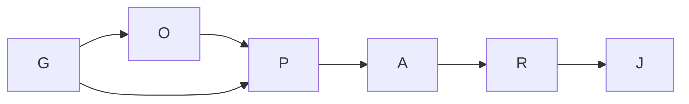

# Execution graph

## Superseding status — 2026-09-15

All bounded graph nodes are complete. Core published the original candidate at `33e9ae7e`; current qualification passed 38/38 required gates at `3284acc55d906cdd5beb7e80527200b8bdf3f491`. See [qualification proof](../proof/ownership-qualification.md). Earlier blocked checkpoints below remain historical. Publication of the continuation's documentation is a separate Core handoff; no Codex main push.

Goal, done-when, exclusions, budgets and surfaces are in the linked coordination plan. This is optimize-graph's one whole-programme pass.

| Node | Tier | Inputs | Exit oracle |
|---|---|---|---|
| G Ground/coordination | T1 | current code, §2, shared sessions/requests | effective layer observed, exact handoff, recursive census |
| O Owner decision | T1 | existing grammar and user goal | no ownership invention, explicit ambiguity handling |
| P Plan/design gate | T1 | G + O | independent Test PASS; scoped scan and preserved floors |
| A Author red/green | T1 | P and handoff | nested/identity/ambiguity/stale fixtures red then green |
| R Independent review | T1 | frozen A | mutations rejected, CLI state read, scope intact |
| J Join/proof | T1 | R | script checks, derived state, committed handoff |

Naive shape: same proof obligations with repeated grounding and multiple coupled authors. Optimized: one shared grounding record and one author; no gate removed. Six material nodes, width at most two useful tasks plus resident Owner, six deterministic proof/decision boundaries. Runtime estimate unavailable: no comparable verified cost sample identified. T1 and T-infinity are not measured at planning; with the serial implementation spine, width cannot shorten its dependency span. No speedup claim.

Five-part fan-out contract: total width <=4; at most one retry for a transport failure (never for failing tests); each branch exits with its specified evidence; partial receipts block the dependent join; failure remains within that branch's worktree. Author/reviewer run serially. Loop variant: unresolved required evidence items decreases to zero; two non-decreasing passes trigger diagnosis and re-plan. Cap never proves completion.

Re-plan on a refused lease, altered ownership semantics, new shared seam, failing independent gate, or stale baseline relevant to the changed tool. Never lower tests to regain progress.

Grounding: normative execution-graph-optimization instructions and DC-118 control half (b). The referenced docs/knowledge/graph-and-loop-engineering directory is absent at this baseline; no graph traversal or empirical speedup from it is claimed. Audit history shows shared log merge conflicts; one serialization point is retained for registers/derived outputs.

## Material-evidence re-plan: independent parser veto

Independent review of `18a4a19f` reported Test/Python BLOCK: five counterexamples for heading context, missing Path header, missing row delimiters, unrelated exact non-surface rows and indented section termination. Owner O7 confirms these are existing obligations, not new policy. The author must reproduce before repairing. The independent reviewer retains its veto.

This adds two material nodes and one rework pass; no added parallel implementer. I exit: observed failures and verified causal branches with disconfirmation. A2 exit: five red-to-green oracles plus all existing tests. R2 exit: independent Test/Python clearance, Simplifier/SRE results, original regression evidence retained. J is unchanged. Unresolved reproduced counterexamples must decrease from five to zero; two nondecreasing passes trigger diagnosis, not acceptance. Investigation budget is 12 calls/10 minutes, Inferred; token usage remains not recorded. No cost or speedup benefit is asserted for rework. The added boundary preserves the investigator/repair decision and independent hard veto. User authorization covers routine repair; O7 confirms scope and does not waive a reviewer veto.

## Planned versus actual

G, O and P completed: Core Rulings 113/114 resolve the tooling grant and the only newly discovered assignment gap; Owner confirmed T1; independent Test/Simplifier/Python/SRE plan receipts are recorded in the programme proof. Initial A completed at `18a4a19f` with 22 red-first failures and six mutants. R blocked five parser counterexamples; I and bounded repair closed them plus the broad `*.cs` sibling. Re-review exposed two required missing mutants; the final test-only repair at `676f63ed` brought the mutation set to eight. Final independent Test/Python/Simplifier/SRE/Data integrity PASS is recorded at reviewer `cbf288b8`.

J merged through the repository script at `7fdf6ab0`, checkpoint `df050caf`. The full mandatory runner passed 37/38 twice; the sole failure then was another session's uncommitted PRIMARY audit log. At the later check after `327528e2`, the primary finding cleared and the same gate reported Understanding Views spike logs, although coord lists that spike active. Requests `req-01M2JTCR30AJ256HJFZHZJNRPX` and `req-01M2JTQ5G3YVP0D81XBH2ZQK6E` record the successive observations. No gate was waived, no peer log edited, no push performed. The graph is blocked at J qualification on shared audit state, with the reviewed candidate preserved; silence is not consent and gate prose is not proof of abandonment.

Actual rework: five parser cases, one same-class broad-pattern case, then one two-mutant evidence-only completion. Every repaired obligation decreased the unresolved set; no cap was treated as acceptance. First repair 18/18 calls, final mutation unit 14/6 calls and 222 measured seconds, final review 16/16 calls. Stale script/patch assumptions caused the final estimate overrun. Token cost and a reliable whole-Conductor count are not recorded. Full runner repetition was necessary only because the join wrapper omitted the failed gate's name from its final eight output lines.

One author preserved the planned dependency spine. Model allocation: Astra Owner and Conductor for scope and decisions; Sol with high reasoning for the bounded Python author and independent adversarial reviewer. No second implementer or unnecessary extra lane was created. Author actual: 981 measured seconds at its audit close, final reported 58 calls versus 35 planned. This is an estimate overrun; it does not authorize more scope. Token cost is not recorded. Plan reviewer actual: 443 seconds, 25/25 calls.

Material evidence added a required join prerequisite: fresh-worktree mandatory gates require .NET runtime receipts despite no .NET changes. Owner O6 authorized a single non-updating receipt run. It completed with 3,743 executed tests passing, one existing nonexecuted test, unchanged baselines, and five terminal-host paths passing. This closes the observed receipt gaps without weakening the join. The global stranded-audit finding remains a peer coordination dependency, not permission to modify another session's records.
