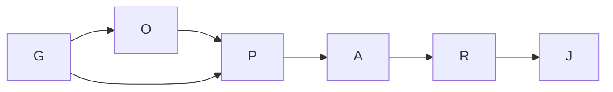

# Execution graph

Goal, done-when, exclusions, budgets and surfaces are in the linked coordination plan. This is optimize-graph's one whole-programme pass.

| Node | Tier | Inputs | Exit oracle |
|---|---|---|---|
| G Ground/coordination | T1 | current code, §2, shared sessions/requests | effective layer observed, exact handoff, recursive census |
| O Owner decision | T1 | existing grammar and user goal | no ownership invention, explicit ambiguity handling |
| P Plan/design gate | T1 | G + O | independent Test PASS; scoped scan and preserved floors |
| A Author red/green | T1 | P and handoff | nested/identity/ambiguity/stale fixtures red then green |
| R Independent review | T1 | frozen A | mutations rejected, CLI state read, scope intact |
| J Join/proof | T1 | R | script checks, derived state, committed handoff |

Naive shape: same proof obligations with repeated grounding and multiple coupled authors. Optimized: one shared grounding record and one author; no gate removed. Six material nodes, width at most two useful tasks plus resident Owner, six deterministic proof/decision boundaries. Runtime estimate unavailable: no comparable verified cost sample identified. T1 and T-infinity are not measured at planning; with the serial implementation spine, width cannot shorten its dependency span. No speedup claim.

Five-part fan-out contract: total width <=4; at most one retry for a transport failure (never for failing tests); each branch exits with its specified evidence; partial receipts block the dependent join; failure remains within that branch's worktree. Author/reviewer run serially. Loop variant: unresolved required evidence items decreases to zero; two non-decreasing passes trigger diagnosis and re-plan. Cap never proves completion.

Re-plan on a refused lease, altered ownership semantics, new shared seam, failing independent gate, or stale baseline relevant to the changed tool. Never lower tests to regain progress.

Grounding: normative execution-graph-optimization instructions and DC-118 control half (b). The referenced docs/knowledge/graph-and-loop-engineering directory is absent at this baseline; no graph traversal or empirical speedup from it is claimed. Audit history shows shared log merge conflicts; one serialization point is retained for registers/derived outputs.

Plan gate and actual cost/evidence: pending independent review and completion; see coordination plan for live status.
