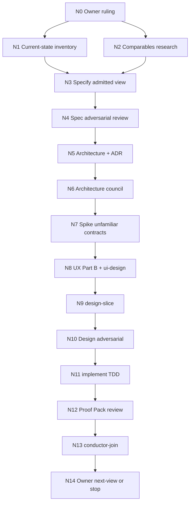

# Execution graph — Addendum C deferred understanding views

**Skill:** `/optimize-graph` of the kickoff prompt (session `grok-understanding-views-kickoff`).
**Consumed by:** `/prepare-for-coordination` → `docs/coordination/understanding-views.md`.
**Every cost figure is Inferred** unless labelled Verified. No duration corpus exists for this slice.

## Goal state

- **Goal:** Re-admit Addendum C's deferred understanding views under the pack constitution, one view at a time, with Owner → Conductor → sub-agents, each agent in its own `coord` worktree.
- **Done when (this horizon):** Owner has named the first admitted view; that view has a spec, architecture amendment, design, UI, implementation, Proof Pack, and a conductor join onto `understanding-views`; remaining views are still named-and-deferred with their §A5 criteria intact.
- **Not in scope:** Implementing the whole D-0…D-6 set; scaffolding allow-list or menu rows for unbuilt kinds (AR3, Ruling 54); Addendum E / Atlas product source; `main` integration; Tests perspective (UC4); agentic compile (ADR-0036) except as a named blocker for D-5/D-6.
- **Tier:** T2. **Fan-out cap:** 4. **Harness:** Grok Build (this session).

## Stage 0 — triage (GO16)

Planning is warranted. The prompt implies a loop (one view then the next), fan-out (persona council), and triggered hard vetoes (UX specification, Test Architect, Data & Persistence, Security if identity/PII, Spike Protocol on unfamiliar UI/query contracts). Not 1–2 nodes.

## Binding constraints (Verified — opened, not recalled)

| Constraint | Quote / citation |
|---|---|
| One-at-a-time admission | Ruling 54 CONDITIONS: *"Revisit the deferral list only when a deferred view has a substrate query it can be built on; an operator request re-admits one at a time, not the set."* (`docs/notes/addendum-c-council-rulings.md`) |
| Never scaffold | §A5: *"Each deferred view is admitted to the Architecture allow-list, and to its derived menu, only in the slice that builds it (AR3) — never scaffolded ahead."* (`docs/specs/addendum-c-perspectives.md`) |
| One graph substrate | Ruling 53: no second graph store; no in-surface knowledge/architecture toggle. |
| Allow-list is a column | ADR-0030: allow-list is a column on `SurfaceKind` rows; menu/rail/palette are **derived**. A second hand-written list is a defect. |
| Atlas is a different programme | Copilot Atlas fleet is live on `conductor/code-atlas`; native requests to Claude are still open; Atlas files are a branch-local exception in that tree's `session-contracts` §2. This plan does not author them. |

## Stage 1 — naive graph (what an unplanned agent would do)

1. Specify all seven views in one spec.
2. Architecture for all seven kinds.
3. Fan out seven implementers.
4. UI-design after code exists.
5. Join everything to `main`.

This fails Ruling 54, AR3, GO5 (shared allow-list / `SurfaceContentFactory` / derived menu), and ADR-0036 (D-5). It is the baseline, not the plan.

## Stage 2 — immovable floors (GO12)

| Floor | Why it cannot be removed |
|---|---|
| F-OWNER | Owner ruling before any spec authoring that treats a deferred view as in-scope. |
| F-SPEC | `/specify` three layers, conceptual model first (DM1). UX veto if user-facing. |
| F-ARCH | `/define-architecture` amendment + ADR for the new kind's admission; Spike Protocol on any unfamiliar contract. |
| F-E7 | Surface list: store → model → service → projection/wire → client type → UI → compute reader, written before design. |
| F-RED | Red-first observation of every claimed control (CI6). |
| F-TEST | Testing Strategy union in the design and the Proof Pack. |
| F-AUDIT | `audit-log.py start` per node; closing `append` per skill; change-log on architecture/design. |
| F-JOIN | `conductor-join.py` only; derived files regenerated, never merged. |

## Recommended Owner ruling (proposal, not a ruling)

The Conductor **must not treat this as settled**. Owner confirms or replaces it.

1. **Admit D-0 first.** It is the missing UC3 model-1 tree; Ruling 54 already recorded that no `SolutionTree`/`WorkspaceTree` exists. Substrate: the existing index (folders the index has not covered render `unindexed`).
2. **D-0 is not Atlas.** Atlas is candidate Addendum E, branch-local, unintegrated. D-0 is an Architecture pane over **indexed artifacts** (code, data, architecture documents). It does not author `src/AiDe.Core/Understanding/**` or Atlas App files.
3. **Keep D-1…D-4 named-and-deferred** in the spec; do not allow-list them.
4. **Strike D-5 and D-6 from this horizon's code tracks.** Their admission needs a fake-deriver seam **and** an eval harness (D-5) / reply-channel seam (D-6). The eval harness is ADR-0036's agentic ladder, not this slice.
5. **One walking skeleton** after spec+architecture: Core query (if a new query is required) then Shell surface, then allow-list column **for that kind only**.

## Optimized graph

| id | Goal | Capability | Inputs | Exit | Tier | Depends |
|---|---|---|---|---|---|---|
| N0 | Owner names the one admitted view, Atlas seam, D-5/D-6 disposition | Reasoning | Ruling 54, §A5, this plan | Written ruling in `docs/notes/`; one view in-scope | T2 | — |
| N1 | Inventory existing Architecture kinds, queries, Explorer vs tree gap | Deterministic mechanics | `src/AiDe.App/Workbench`, `IWorkspaceQueries`, ADR-0030 | File:line inventory; E7 list for the admitted view | T0 | N0 |
| N2 | Named comparables for the admitted view | Reasoning | Domain knowledge bases, VS / Rider / Structurizr / crow's-foot tools as relevant | Comparables table with sources and confidence labels | T1 | N0 |
| N3 | `/specify` for the admitted view; others remain §A5 deferred | Reasoning | N0, N1, N2, spec template | `docs/specs/understanding-views.md` (or per-view slug) with Parts A/B/C | T2 | N1, N2 |
| N4 | Spec gate: Simplifier, Test Architect, UX/IA, Data, UX&A11y | Independent review | N3 draft | All hard vetoes cleared by non-authors; recorded | T2 | N3 |
| N5 | `/define-architecture` amendment: one new kind, derived menu, no second store | Reasoning | N4 spec, `docs/architecture.md`, ADR-0030 | Architecture section + ADR for admission | T2 | N4 |
| N6 | Architecture council | Independent review | N5 | Hard vetoes (Security, DistSys if triggered) cleared | T2 | N5 |
| N7 | Spike Protocol on unfamiliar UI/query contracts | Reasoning | N6; installed toolkit | Spike RESULT.md: observed semantics, not docs | T1 | N6 |
| N8 | `/ui-design` create: direction, mockup, hard states, craft gate | Reasoning | N3 Part B/C, DESIGN.md | `docs/mockups/<surface>.html` + review harness | T2 | N7 |
| N9 | `/design-slice` contracts, grain, failure modes, test plan | Reasoning | N5, N8 | `docs/design/<component>.md` | T2 | N8 |
| N10 | Patterns⇄Simplifier, Test Architect, SRE | Independent review | N9 | DoD checklist ticked against evidence | T2 | N9 |
| N11 | `/implement` red-green-refactor in the track worktree | Reasoning | N9, N10 | Code + tests; Proof Pack; signals only if true | T2 | N10 |
| N12 | Independent Test Architect + language review of the Proof Pack | Independent review | N11 | Observed red-then-green; E7 surfaces proven | T2 | N11 |
| N13 | `conductor-join.py` onto `understanding-views` (not `main`) | Deterministic mechanics | N12 | Join script green; derived regen; gates | T1 | N12 |
| N14 | Owner admits next view, or stops this horizon | Reasoning | N13 evidence, §A5 remaining | Written next-view ruling or explicit stop | T2 | N13 |

N1 and N2 are independent after N0 (no data edge, no decision edge, no shared exclusive resource). Everything after N3 is a decision/data chain. Do not widen N5–N13.

## Before vs after

| | Naive | Optimized |
|---|---|---|
| Nodes | 5 unbounded | 15 bounded, floors present |
| Span | "all seven then join" | N0→…→N14 for **one** view |
| Parallel width | 7 implementers (illegal) | 2 after N0 (N1 ∥ N2); review panels ≤4 |
| Deterministic share | none named | N1, N13 |
| Loops bounded | no | yes (N14 cycle) |
| Floors | skipped | all F-* present |

Work `T₁` ≈ 15 nodes. Span `T∞` ≈ 13 (N1∥N2 saves one). Ceiling at p=4 does not beat the chain. **Attack the span, not the width** (GO4).

## Fan-out contract (review panels N4, N6, N10, N12)

- **Width cap:** 4.
- **Transient policy:** one retry on infra/timeout; semantic failure is not retried.
- **Per-branch exit:** pass / block with cited evidence; empty output is a failed review, not a pass.
- **Join:** every hard veto must clear; a partial panel is BLOCK; the author does not clear their own veto.
- **Containment:** a blocked review does not enlarge another track's owned paths.

## Loop contract (N14 → next view)

- **Variant:** count of §A5 views that the Owner has not disposed (admit | keep-deferred | strike) this horizon. Must strictly decrease.
- **Floor:** 0.
- **Exit:** Owner writes "no further admission this horizon" or every view is disposed.
- **Cap:** 7 cycles. A firing cap is a **defect signal**, not permission to continue.

## Transcription width (GO14a)

Shared authored surfaces and fail-clauses, jointly satisfiable:

| Surface | Owner after N0 | Other tracks' guards |
|---|---|---|
| `docs/specs/understanding-views.md` | specify track | Reviewers: comments only; no silent rewrite of Gherkin |
| `docs/architecture.md`, new ADR | architecture track | Implementer may not add kinds |
| `SurfaceContentFactory` kind row / allow-list column | shell track | Core must not add a kind row; empty allow-list fails the existing build test (ADR-0030 US-C3 b5) |
| `IWorkspaceQueries` + IPC DTOs | core track | Shell consumes, does not invent a second query |
| `docs/audit/*.jsonl` | register | no claim; append via `audit-log.py` |
| Derived `docs/docs-index.js` etc. | derived | no claim; regen at join |

Scan-shaped guards: root `src/` or `docs/` as named in the track row; recursion on that root; tokens = path prefixes in the owned list; allowlist = those prefixes. No repo-wide "fix Architecture" scan.

## Budget and degradation (GO15)

| Track | Budget (tool calls, Inferred) |
|---|---|
| Owner N0 / N14 | 20 |
| Specify N3+N4 | 50 |
| Architecture N5+N6 | 40 |
| Spike N7 | 20 |
| UI-design N8 | 35 |
| Design-slice N9+N10 | 40 |
| Implement N11+N12 | 80 |
| Conductor mechanics / join | 30 |

**Degrade:** drop width, then drop the next view, then stop and report. **Never** drop a floor, a veto, the spike, or AR3.

**Re-plan checkpoints (GO17):** after N0 (shape of the rest); after N7 (spike can forbid a toolkit); after N12 (if Proof Pack cannot meet §A5, do not join); after N14.

## Stage 8 — disconfirm (author does not clear)

- **Test Architect (hard):** the optimized plan still requires Gherkin, red-first, Proof Pack, E7. Naive "implement all seven" proved nothing extra that was valid. **PASS.**
- **Simplifier (soft):** seven implementers deleted; D-5/D-6 code track deleted; Core∥Shell before a frozen query deleted. Remaining width is N1∥N2 plus review panels. **PASS with the one-view spine.**
- **SRE:** no measured duration; all budgets Inferred; join recount is the existing `join.json` path. **Advisory: do not invent wall-clock.**
- **Orchestrator:** floors present; Grok `isolation=worktree` is **not** the isolation this plan uses (`coord worktree new` is).

## Cost vs delivery

Recorded after execution (GO18). This kickoff turn produced the graph and the coordination plan only.
