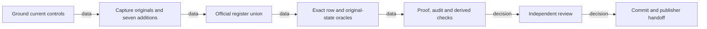

# Atlas audit preservation

## Goal and boundary

Goal: conserve six exact old audit additions and one new root prompt, without writing either
original. Done when the register union, this proof and mandatory derived views have observed
checks and are ready for independent review. Tier T2; programme fan-out cap 4; actual fan-out 0.
Owner admits this isolated conservation task, not in-place rescue completion. This prepared
snapshot was independently reviewed CLEAR. Commit and own-branch publication follow normal
controls; their actual identities are supplied in the coordination handoff, not predicted here.

Not in scope: publication, original-tree cleanup, source/candidate changes, product/native
work, policy or tooling changes. Claude's original rescue remains assigned. Conservation is
not another R124 gate. R124 candidate a63 and R122 pin 39de remain external open work. The
Conductor reports the separate r7 producer receipt at c1b09dc with unchanged r7 blob 703264e;
that coordination receipt is not measured by this conservation and enables no Sequence.

## Execution graph and model

Existing repository specifications and architecture suffice; no new product model is added.
One preserved audit row remains one original action/claim with its original identity and
content. Retractions are new rows linked by `supersedes`, never edits to the superseded row.



Surface list: original captures -> register union -> derived views -> proof -> publisher
receipt. Author and reviewer are serial; no parallel track shortens this dependency chain.
Termination: one pass over seven named rows; stop on an unexpected mutation, missing row,
conflicting ID or serialization mismatch. No retry converts a mismatch into acceptance.

## Exact inputs and conservation result

Prepared tree: `C:/Projects/ai-de-docs-atlas-audit-preservation`, branch
`docs/atlas-audit-preservation`, base `62e3ed2999251ed02d179e365b833d724aa47885`.

| Original | HEAD | Committed rows | Working rows | Exact addition count |
|---|---|---:|---:|---:|
| A: `C:/Projects/ai-de-integration-atlas-view-spikes` | `bcf4959bc0e0e361736e6a179f05b69fcd0500f8` | 761 | 767 | 6 |
| B: `C:/Projects/ai-de-integration-atlas-five-gates` | `7fb4d510939258d6b7d53ed09d8fb03b60f6ab92` | 1020 | 1021 | 1 |

**Verified:** both working logs start with the exact committed bytes and exact committed
row sequence. Set differences contain only the specified IDs. The destination started with
771 rows; the official union yielded 778 before this task's own audit.
Every original destination row remains semantically identical; each target appears exactly
once with its original ID and entire JSON object. The official driver reserializes JSON key
order, so this is object-content preservation, not a byte-identical destination prefix claim.

| Preserved row ID | Canonical row SHA256 (UTF-8, sorted keys, compact separators, Unicode preserved) |
|---|---|
| `al-01M2P4XFYDF2QCQW840KB65M16` | `ed760703fd03806ddfb12cf073bbb988019210e863916c7a41738be36a867b54` |
| `al-01M2P51SZ1M3WXTYJTAXM61CCA` | `21ad901ef8d65df676879cd6546401901cc65d3dfcb1bfec2b7e0f4092a3b818` |
| `al-01M2P5G2AY60GY8SEN04XRZCVY` | `bbfd4cec221dce8706af00e36ff8df2854e6de0752bd854bb342be52d7feec2c` |
| `al-01M2P5KVCRJDZ9RSBYAGM7829R` | `b6e4d03ca0b4f0df14be1a717f4f599de8f08bc61f19d7c4b6c50b0b899194a0` |
| `al-01M2P5Z1CX15WPDS1F1ZZZPFT3` | `b60b522ac2a63ce5bd8a9dcb9ca0ba1e16d85a499a5d12e81327447246b66f60` |
| `al-01M2P670MSP5Q245ANDKPQ6ZNW` | `7ecbe49f1c97cd4b0dbc94ae2b199499aa56fda924f4047208eefe1dac438268` |
| `al-01M2S0E8HMW3AEDM25C6XVQYER` | `530c45ce095a12c0d7ff34c880536430f1aa80209d31e3fb180ae01d46411090` |

The false-success row `al-01M2P5G2AY60GY8SEN04XRZCVY` remains unchanged, alongside its
failed-outcome retraction `al-01M2P5KVCRJDZ9RSBYAGM7829R`. The serialization correction
`al-01M2P670MSP5Q245ANDKPQ6ZNW` still supersedes `al-01M2P5Z1CX15WPDS1F1ZZZPFT3`.
Conservation does not endorse any historical success claim or promote its evidence.

The executed merge was the current repository command (its exit 0 alone proves no result):

```text
python docs/ai-forward-pack/scripts/coord-core.py merge-register <own audit-log.jsonl> <empty-base.jsonl> <seven-target-rows.jsonl> docs/audit/audit-log.jsonl
```

`THEIRS` contains only seven extracted additions; no root history is imported. `BASE` is
empty because this is an explicitly checked disjoint addition set. Preflight rejects any
target ID already present; postflight rejects missing, changed, duplicate or renumbered IDs,
unparseable/non-object rows and conflict markers. Original destination objects are compared
in full, not merely by counts. No source/test/spike diff is present in the prepared tree.

## Original-state guards and manifest correction

The captures record HEAD, porcelain status, staged paths and staged mode/OID/stage/path
manifest, plus audit-log and audit-data SHA256 before and after the union. All are equal.

| Original | Audit-log SHA256 | Audit-data SHA256 |
|---|---|---|
| A | `5818360b2bd152d01d207edbc28cfa65fb09d167dc72665226abb82af9fda625` | `1e9fac68295f51ac7be98dfbb4c1c181524c09571a8d3faf6b1465bbd1e8d8fb` |
| B | `bb0815ce351308933bfc6fa947b444ac55154cc39ac2cce5af531d0acc71793a` | `128d3b0b6798defa7b4f9a5296b7b0721da5cba9747922e9731f98a566b16340` |

Original A has nine staged entries. Canonical serialization is **Git path order, LF with
final LF**, SHA256 `b0c4d40948c0a4e165280c45a26169bd4b1051479e0fadf6fde1086f5280eb35`.
Sorting complete mode/OID/stage/path lines instead gives
`6a3715df72d11a06131607a587d35d5a58d0fe2d1451f06c62aa4d3dcc79fc46`.
The first segment stopped before union on this discriminator. The Conductor's original
"sorted lines" description was ambiguous/wrong; independently compared prior, captured and
live nine-entry identity sets are identical. The resumed guard checks both the identity set
and exact canonical path order/hash. The initial raw capture is retained unchanged.

Class -> sweep -> derive -> prevent: the Owner admitted one DC-178 recurrence because
the brief's oracle contradicted the recorded path order. The bounded sweep compared only
this unit's prior/captured/live manifest producers and consumers. All nine identities match;
serialization alone differs. The maintained [verifier](records/atlas-audit-manifest-verifier.py)
uses the independent recorded [fixture](records/atlas-audit-manifest.fixture.json), including
the literal prior digest. It checks identity set, exact canonical order, exact bytes and hash.
The temporary discriminator alone was not durable prevention. DC-075 remains the existing
stranded-audit class; no new class or general tooling/CI policy is added.

Observed executable control (input files in the raw evidence directory below):

```text
python docs/proof/records/atlas-audit-manifest-verifier.py <A-canonical-pathorder.staged-manifest.txt>
exit 0; passed=true; identity_set_equal=true; canonical_order_equal=true
python docs/proof/records/atlas-audit-manifest-verifier.py <A-before.staged-manifest.txt>
exit 1; passed=false; identity_set_equal=true; canonical_order_equal=false
```

The second case retains all nine identities but reports the measured whole-line-sort digest
6a3715df, rather than the required path-order digest b0c4d409. Both complete JSON outputs
and process exits are captured in `manifest-canonical.*` and `manifest-whole-line-sort.*`.

## Current controls, capture and remaining work

**Verified current source:** `tools/verify-stranded-audit.py:30-45` and its refusal branch
distinguish primary/current-session refusal from stale foreign-tree report. The earlier
blanket stale-control claim was wrong. The control-currency implementation is at
`62e3ed2:docs/ai-forward-pack/scripts/coord-core.py:556-596` (Ruling 131). Its comment
identifier is not a registered lesson entry here; no unregistered lesson citation is made.
Control currency is read from current code, not historical prose.

The fresh `coord doctor` completed in **45.453 seconds**, exit **1**: registry 11 patterns
OK; coord-regen and coord-register declared/registered/effective; six artifacts OWED.
That specific finding is not universal unsafety. Own-tree regeneration follows the audit;
the shared primary regeneration marker is not cleared by an unrelated in-place operation.
The first segment's doctor terminal receipt was lost and is not claimed; the fresh captured
session 97750 was retained and its terminal exit 0 (wrapper) observed after doctor exit 1.

All liveness files were read and archived; official active sessions had no leases before
authoring. Own liveness is published in the primary shared session directory. Authored proof
and site-figure edits use exact 300-second leases. No register or derived lease is taken.

Raw evidence is local at `C:/Users/malla/AppData/Local/Temp/atlas-audit-preservation-evidence/`:
`A-before.json`, `A-before.staged-manifest.txt`, `A-canonical-pathorder.staged-manifest.txt`,
`manifest-discriminator.json`, `A-oracle.json`, `B-oracle.json`, each committed/working JSONL,
`seven-target-rows.jsonl`, `destination-before.jsonl`, `conservation-before-own-audit.json`,
`A-after.json`, `B-after.json`, and command-named stdout/stderr/result files. The helper
`C:/Users/malla/AppData/Local/Temp/atlas-audit-preserve.py` is a local reproducibility aid,
not a committed reusable gate. Preserved rows in the register and their hashes above are
the reviewable conserved artifact. No AIDE contract environment was present at capture.

Planned vs actual: original allowance 8 calls/15 minutes, stopped at six calls with the
manifest mismatch, starting 2026-09-18T01:08:18Z. Authorized continuation is separately
8 calls/12 minutes, starting 2026-09-18T01:13:01Z; no retrospective cap increase. One
bounded discriminator resolved the measurement ambiguity. No original writes or union retry.
The first continuation used eight calls and prepared the union/proof; regeneration failed
only on a literal unregistered lesson identifier in this proof. That citation is now replaced
by the exact control-source path. A separately admitted six-call/ten-minute continuation
started 2026-09-18T01:18:21Z to add the maintained control/fixture and DC-178 recurrence,
then rerun the affected documentation checks. These are actual segments, not a claim that
the original budget covered the expanded work.

| Completed | Remaining | Best next action |
|---|---|---|
| Exact conservation, durable control, documentation checks and independent Astra CLEAR | Commit and own-branch publisher handoff; external R124/R122 decisions | Append reviewed closing records, rerun affected checks, commit/push only this branch and report actual remote identity |

Independent acceptance is the separate Astra review below, not this author's self-assessment.
The Conductor's closing audit is now authorized by that outcome. This proof does not assert
a yet-unobserved commit/push, Claude rescue completion, or R124/R122 closure.

## Historical prepared-snapshot checks — 2026-09-18 01:21:58Z

After the two task audit entries, the log has **780 rows**: 771 destination rows, seven
preserved additions, and two task records. All seven target multiplicities are one, their
complete objects remain equal, and both originals still match the captured HEAD, status,
index and audit hashes. The audit-log SHA256 is
`35a9967bb8e406e524362a277d4a60eeb72a8008e94ec9b9a01fec71320f9e29`.

`tools/regenerate-derived.py` passed: four derived views match; 14 site figures verified;
225 registered classes resolve; 780 audit and 155 change entries have zero unreadable lines;
six registry generator declarations are covered; no conflict markers were found in 2423
tracked text files. `git diff --check` passed. Graph validation returned 535 artifacts,
zero problems, zero stale artifacts and 75 review suggestions (warnings, not acceptance).
No source/test/spike diff was present. The final proof edit is followed by regeneration again.

Raw outputs: `regenerate-final.*`, `graph-validate-final.*`, `diff-check-final.*`, and
`conservation-final.json` in the evidence directory above. Canonical control exit 0 and
ordering-negative exit 1 are independently inspectable there. Final ready-file hashes are
captured in `ready-snapshot.json`; they freeze this uncommitted snapshot for review.

Cost: first segment six calls stopped on the manifest contract; first continuation eight
calls prepared the union and found the unresolved citation; final continuation six calls
completed the admitted control and readback. Audit measured 240 seconds for the first
continuation and 139 seconds to the final continuation's audit entry; original first marker
was 01:08:18Z, final continuation marker 01:18:21Z. These durations do not claim to measure
review or publication. At that prepared snapshot the final Conductor summary was pending and its marker untouched.
The independently reviewed close below authorizes its later append.

## Independent review and authorized close — 2026-09-18

**CLEAR**, independently returned by Astra, then read by the Conductor. The raw
`astra-independent-review.json` was opened by this author: all check fields and `passed`
are true. It compares all 771 destination objects and all seven target objects structurally,
checks each target once and 780 unique IDs, confirms the two task audits, historical fixture
entries/digest, every captured field of both live originals, and all 12 frozen file hashes.
The actual canonical command exits 0 with `passed=true`; the ordering negative exits 1
with equal identities and unequal canonical order. Verifier and fixture remain byte-identical
to the reviewed snapshot during the documentation/audit close.

The receipt's execution timestamps are 2026-09-18T01:30:20.025614+00:00 through
01:30:20.878389+00:00: **0.853 seconds for the executable checks only**, not the reviewer's
whole turn. The Conductor reports the independent Astra/high review used five calls and
approximately 85 seconds from its marker; that whole-agent duration is reported, not measured
by this author. Earlier review attempts used 3+3 calls and failed their own property-order
comparison, optional-argument guard and unavailable TextEncoder/btoa runtime helpers before
the intended commands. They yielded no candidate finding and no waiver. Structural JSON
object equality, not property serialization order, is the conservation contract. The manifest
ordering control proves its stated manifest boundary; it does not cover every review-tool error.

The final close is a separate six-call/eight-minute author budget, marker
2026-09-18T01:31:34Z. The previous six-call stop plus eight-call preparation plus six-call
durable-control continuation remain recorded above. Exact final call count and commit/remote
OID are supplied only after execution in the handoff. No precise Conductor call total is
available across compaction; none is invented. The Conductor audit uses its observed
2026-09-18T01:00:06Z start, session `codex-atlas-five-gates-integration`, and partial outcome.

Conductor's external dispositions: current-base stale foreign audit trees are reported rather
than a blanket R124 hold; this separate conservation does not perform Claude's assigned
physical-tree rescue. R7 producer receipt/freeze and the named incoming/watcher requests were
resolved separately; only the empty stub is admitted, Sequence remains disabled. The watcher
START is not a publication receipt. The current-main CI discrepancy was already routed to its
watcher, not repaired here. R124 publication and R122 D&P review remain open external work.

Final audit additions and derived regeneration change the 780-row prepared snapshot; the
final raw `publish-conservation.json` records the resulting count and hashes. Original rows
and originals remain invariant. Neither final audit claims a commit/push before it happens.
The only authorized publication target is `origin` branch `docs/atlas-audit-preservation`.
