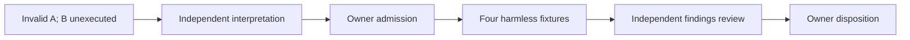
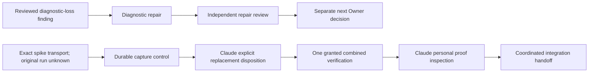

# Delivered independent design verdict

**Verified delivery; scoped review judgment:** foreground watcher
`copilot-main-watch-b0d0` resolved request `req-01M2NT8TTYERHMRAFEYJC3Y6TC`
with the final verdict of retained independent Test Architect
`48835411-7dc1-4fd1-ad85-9a27b7277679`, acting in T2 Adversary mode.
Direct delivery `req-01M2NV3TGZ058CQE3W5RS1D7NM` carries the same verdict;
the Conductor read it and resolved that notice as consumed. This is a faithful
Conductor record of the delivered external review, not a new Codex review.

Reviewed input:

- Commit: `ebfe076125a1200345b806519b733104b3e06ea7`.
- Path: `docs/investigations/atlas-p1-03-uia.md`.
- Blob: `3b6c8153018d1199e669cd519ba1c0bc65547a3d`.
- Tree: `C:/Projects/ai-de-investigation-atlas-p1-03-uia`.
- Root independently inspected the completed design delta and verified no
  `src/`, `tests/` or `tools/` change against `5406ea69`.

**Verdict: PASS-WITH-CONDITIONS; B1-B3 document-design veto cleared only.**

| Finding | Delivered clearance | Conditions retained |
| --- | --- | --- |
| B1 publication | Synchronous Content-to-status subscription; exactly one Background dispatcher tail verifies the full published state and disarms. The source ordering and referenced WPF notification contracts were reviewed. | Measure installed-runtime ordering, cancellation and teardown in actual controls. The noncapturing class registration is process-scoped; clear its scoped registry and never claim registration removal. |
| B2 identity/claim | Treatment association only. `uia_wpf_owner=not-recorded` is an interpretation limit. | No retained-owner, canonical-reproduction or P1-03 causal conclusion follows from the pair. |
| B3 custody | Serialized single handoff; one retained disposal task; failed pre-handoff disposal retains custody; explicit recovery; owner-only post-handoff disposal. | Prove all admitted cancellation races, reachability after failed release, original-error preservation and no competing disposal. |

The reviewer reported eight calls and no edits/tests. The original request specified
four calls/eight minutes; the delivered verdict supplies no revised call budget, so
this receipt makes no budget-compliance claim. Actual runtime controls, the two-arm
experiment and causal attribution remain unexecuted/unestablished. The earlier
qualification BLOCK `876acbfa` remains effective.

# Owner-confirmed preparation manifest

Goal: produce independently reviewable test-only diagnostic preparation.
Done when the exact design is implemented, meaningful headless controls have observed
red and green results, installed runtime identities and selected tests are recorded,
and an independent implementation reviewer clears all triggered conditions.
Not in scope: product changes, shown windows, live UIA, the paired experiment,
canonical qualification, automatic integration or main publication. Tier T2;
programme width at most four including Astra Owner and Conductor.

The Owner confirmed one Astra author, 24 calls/35 minutes/checkpoint 12, followed by
independent Test/SRE review, 12 calls/20 minutes/checkpoint 8. Astra is retained for
the WPF ordering and lease-custody semantics. Source authoring starts only after the
watcher grants the exact manifest in `req-01M2NWGFJG89QF0KFBA9W8YGF6`.

Prepared through the official worktree lifecycle:

- Tree `C:/Projects/ai-de-test-atlas-p1-03-uia-transition`.
- Branch `test/atlas-p1-03-uia-transition`.
- Session `codex-atlas-p1-03-transition-author`.
- Base `ebfe076125a1200345b806519b733104b3e06ea7`.
- Exact authored paths: existing
  `tests/AiDe.App.Tests/Workbench/Understanding/AtlasDaemonMainWindowProofTests.cs`,
  new `docs/proof/atlas-p1-03-uia-transition.md`, and status/evidence updates to the
  existing investigation. Official own audit/change and required derived records
  follow the repository mechanisms and exact short leases.

No production, project, shared STA, runner, Shell or wiring path is assigned.
The canonical native proof's selectors, returned results, assertions, waits and
cleanup must remain unchanged. Use the actual published observation contract,
one transfer of lease custody, and the same code path in both arms except their
declared loading-phase traversal. No peer refresh, alternate root, retry, sleep
or guessed readiness is permitted.

Preparation requests normal same-tree Debug compilation and only this test filter:

```text
FullyQualifiedName~AiDe.App.Tests.AtlasDaemonMainWindowProofTests.TransitionControl_|FullyQualifiedName~AiDe.App.Tests.AtlasDaemonMainWindowProofTests.NativeObserver_NonGui_
```

Inspect `--list-tests` and actual TRX names/counts/outcomes. Preserve the existing
21 non-GUI observer cases; derive the new count from the actual authored inventory.
Do not select the entire native class. Unshown controls use zero HWND and no live
UIA, Show, focus, captures or desktop input. They cannot establish successful
visible/Loaded publication; that remains a later shown-execution obligation.

# Experimental roster isolation

The Conductor identified that ordinary full-App discovery would also select the
two proposed `NativeTransition_` Facts. Their design requires separate fresh
processes and distinct receipt labels. The Owner therefore explicitly confirmed:

- Experimental Facts and supporting code remain in the isolated diagnostic branch.
- Do not merge that branch wholesale into the canonical/main candidate.
- Canonical native source remains reviewed `626d16a2`.
- Do not introduce implicit skips, runtime opt-in behavior, new projects or altered
  canonical filters to hide the additional roster.
- After the experiment, return the scaffolding's disposition to Owner.
- Proof/audit transport may use the existing exact-manifest mechanism without
  importing executable source.

Watcher addendum `req-01M2NWK8V83BCR3E4DBJ4HFGA9` records this narrower boundary.
It adds no demand for another review of the unchanged B1-B3 document.

# Execution graph and exit conditions

Document review is complete. Exact preparation grant -> isolated authoring and
red/green controls -> frozen source/Proof Pack -> independent implementation review
-> fresh checked slot on exact binaries -> two planned fresh-process arms ->
independent interpretation are the remaining serial dependencies. The r5 peer
freeze has no dependency on these native stages. Do not widen authoring while its
contract or ownership remains unresolved.

The variant is the set of unsatisfied evidence predicates, not retries or elapsed
time. A failed assumption returns to Owner; a refused lease requires coordination;
neither timeout nor silence is approval. No new shown execution is authorized here.

| Completed | Remaining | Best next action |
| --- | --- | --- |
| Delivered design clearance, Owner-settled manifest and isolated tree | Exact preparation grant, implementation controls/review, later execution grant | Consume the watcher's manifest disposition and dispatch the bounded author only when granted |

## Frozen transition preparation and independent review dispatch — 2026-09-16

Verified: watcher preparation request req-01M2NWGFJG89QF0KFBA9W8YGF6 is GRANTED;
the roster-isolation addendum req-01M2NWK8V83BCR3E4DBJ4HFGA9 is acknowledged.
Author c192a7eddab0d794712cd505994ce7858eea86d4 is committed in
C:/Projects/ai-de-test-atlas-p1-03-uia-transition. Conductor inspected the actual
Proof Pack, source, red/final TRXs and discovery inventory. Red:23executed/21pass/
2intended failures; final:43executed/43pass/0skip, exactly21old and22new controls.
The final discovered names equal the TRX population; no shown Facts are included.
Source SHA256914a755d84f82d381fc0c516ac4e0b2257c61cb256545a904e32da35052099bc.
Original methods through EOF compare unchanged after newline normalization.
The red source snapshot was not pinned; its actual failure results are preserved.

Root evidence snapshot: artifacts/atlas-five-gates/transition-source-handoff/,
including conductor-verification.json, red.trx, green-freeze.trx, list-tests.txt,
runtime.json, verification.json, frozen-source.cs and executable verify-handoff.py.
These are retained local artifacts, not implied committed payloads. Author proof:
c192a7ed:docs/proof/atlas-p1-03-uia-transition.md. Installed runtime was10.0.11;
the recorded loaded App/Test/WindowsDesktop identities were read. These identities
are not yet the complete future pair binary manifest.

Conductor caught an original-error masking risk in direct cleanup finally blocks.
The author used a shared failure-recording sequence and two executed controls;
their green results and primary exception identity assertions were inspected.
No cleanup red-first execution is claimed. DC-078 recurrence and DC-222 async
observation recurrence are recorded with those executable controls. Audit close
initially refused missing shortname and stopped; bounded administrative recovery
preserved source/runs. Actual author25/24calls and1430seconds, not budget compliance.
The missing own liveness record was created late and labelled as late; the handoff
validator now refuses missing liveness or missing required persisted audit fields.

Independent Astra review is dispatched in separately provisioned
C:/Projects/ai-de-review-atlas-p1-03-uia-transition, branch
review/atlas-p1-03-uia-transition, session codex-atlas-p1-03-transition-review,
basec192a7ed. Budget12calls/20minutes/checkpoint8, fanout0. Astra is right-sized for
WPF temporal semantics, lease custody races and error fidelity. Allowed receipt:
docs/proof/atlas-p1-03-transition-review.md plus own official records. Same selected
non-GUI filter only; no source repair, full-class selection, shown tests or live UIA.
Reviewer assesses B1-B3 implementation, testing-strategy union, original code,
emitted contract, arm symmetry and containment limits. Its verdict is pending.

The original graph's grant and author nodes are complete. Review -> exact runner/
binary manifest/containment -> fresh watcher slot -> two single fresh-process arms
-> independent interpretation remain serial. No new graph invocation is needed.
The exit oracle is satisfied evidence predicates, not repeated runs or elapsed time.
Root parsing is evidence inspection, not independent gate clearance. Root costs
were not separately bounded at this continuation; no retrospective cost-compliance
claim is made. Oversized read output was narrowed before relying on hidden fields.

Canonical source remains626d16a2; src/tests/tools are unchanged from5406ea69.
No experimental-source join, shown execution or publication happened. Main was
freshly checked atbcf4959bc0e0e361736e6a179f05b69fcd0500f8. P1-03 qualification
still fails; the five component repairs do not establish combined acceptance.
Grok r5 freeze is complete and has no remaining Codex ACK dependency. E1/E2 follow
the existing integration priority. Trees/raw evidence remain retained for review.

## Independent preparation CLEAR and next runner boundary — 2026-09-16

Verified: independent review1d46d651cd5b6356e05545115757ba7eb7ffbf45 clears
Test Architect/SRE/Simplifier for experiment-only preparation atc192a7ed.
Conductor read the whole committed receipt, source-backed disconfirmation and
actual independent TRX43/43/0, with identical population to author/discovery.
Receipt Git-byte SHA2569b15021378d7587572a1a918fa09eb54398aa402883cc627eb84d053c1b417c7;
working-file SHA256d2bda47ef6ae36efb54f9ca6e45300e25e1f3d1f9c3e0718dda22f6bde466dca.
The capture guard initially stopped before writes: Git stores LF, while the reviewed
working file has161CRLF line endings. Full normalized content equality and both
byte hashes were then measured and enforced; no substantive difference was hidden.
TRX SHA256254600d5f944c04104c38abe9ca06f570c4ef0390b1348dde01fcf21132470bc.
Both are snapshotted under artifacts/atlas-five-gates/transition-source-handoff/.
The speculative Completed-field mismatch was disconfirmed: actual Receipt.Save
serializes Completed && FailureCount==0. No change was needed for that concern.
Reviewer actual12/12tools, approximately362seconds; own regeneration passed.
Doctor separately reports11registry patterns/effective drivers and6global owed
regenerations; no global doctor-clearance or peer cleanup is claimed.

Owner conditionally admitted runner/binary preparation after this final CLEAR;
the condition is now met. Newly provisioned execution preparation tree:
C:/Projects/ai-de-test-atlas-p1-03-uia-pair, branch test/atlas-p1-03-uia-pair,
session codex-atlas-p1-03-pair-preparation, base1d46d651. One Astra author18calls/
25minutes/checkpoint10, independent runner/SRE8calls/15minutes, no fanout by leaves.
Allowed new script docs/proof/records/atlas-p1-03-uia-transition/run_pair.py and
docs/proof/atlas-p1-03-pair-preparation.md plus own official records only.
No test/product/shared-runner/STA/canonical-preflight edit. Exact watcher preparation
request req-01M2NYTSRKJZ22SS0KR0PBKAS6 was filed; its grant must be read before
dispatch. Source preparation CLEAR is not that grant or a shown-execution slot.

Owner contract: normal same-tree Debug App.Tests and Daemon builds, freeze only
after both; full consumed output/dependency/runtime-config and resolved SDK/testhost/
installed runtime identity manifests. Refuse additions, omissions or changes before
each arm and afterwards. Separate fresh processes, one exact Fact and unique label
each, no-build/no-restore, fixedAthenB and no retry/rebuild. Stream raw output;
interpret fixture validity, original-oracle outcome and cleanup separately.
Actual B loading Atlas/placeholder ancestry is required, not merely census-called.
External180seconds per arm plus at most30seconds for owned-process containment is
a new experimental circuit breaker, never a product timeout. Track creation-bound
runner/descendants and recorded daemon IDs; never kill by name. Missing ownership,
pins, unresolved cleanup or containment expiry stops the pair. Prove refusal and
containment with harmless subprocess controls before independent runner review.
A normally completed negative original oracle permits plannedB only when the
fixture and owned cleanup are valid. Forced daemon cleanup invalidates the arm.

The existing serial graph now has preparation review complete; runner/binary
preparation -> independent runner review -> fresh checked watcher slot -> fixed
pair -> independent interpretation remain. This refines the already planned node;
no renewed whole-programme optimize-graph run or new scope is needed. No shown
execution/main publication/source join occurred. P1-03 BLOCK remains; future
scaffolding disposition returns to Owner. Root retained all worktrees/raw evidence.

## Owner correction: preparation admission is already sufficient

The Owner checked b52c890d and expressly confirmed that its recorded admission,
conditioned on independent CLEAR, authorizes the exact branch-local proof script,
normal builds, manifests and harmless subprocess controls. CLEAR1d46d651 meets
that condition. Authority derives from the user-delegated programme and exact
Owner decision, not an absent ownership entry or watcher silence. The Conductor's
extra watcher-preparation approval gate was an erroneous transcription and is
withdrawn. This paragraph supersedes the earlier "grant must be read" condition.
Request req-01M2NYTSRKJZ22SS0KR0PBKAS6 preserves its original history and is resolved
by the Conductor as a preparation-status notice; no watcher approval is fabricated.
Exact paths,18/25minute author and8/15minute reviewer budgets, isolation and leases
remain. No shown arms/product/test/shared-runner/canonical/main action is admitted.
Independent runner review and a fresh checked watcher EXECUTION slot still gate
every experimental arm. No human response or extra preparation ACK is awaited.

## Profile-state amendment to runner preparation

Owner chose child-only WEBVIEW2_USER_DATA_FOLDER with fresh distinct owned profiles
outside immutable output roots, equal empty-start policy and explicit runtime-use
evidence. Complete output/runtime manifests retain added-file refusal; no profile
exclusion, product change or GUI probe is admitted. The concrete observed default
profile directory triggered a material optimize-graph replan in the programme plan.
Harmless containment work proceeds independently; profile-specific controls consume
the Owner decision. The amended graph and runner require independent Test/SRE
review before any fresh watcher slot. Original18/25minute author budget remains.
Missing knowledge-root/context-envelope findings are retained without expanding
this programme. No product cause, shown outcome or main readiness is claimed.

## Frozen pair runner and independent review — 2026-09-16

Verified candidate: 88035753581dd0bab5697e975b6ba1a53543e702 in the isolated
test/atlas-p1-03-uia-pair branch. Conductor read its complete Proof Pack,
actual two Debug build logs (zero warnings/errors), named10/10 harmless controls,
two intended red failures and owned timeout evidence. Timeout control records
three creation-bound identities, lifetime total3/active0, every retained handle
exited and an unrelated sentinel still alive. The earlier7/8 result failed because
job accounting reached zero before the retained handles signaled; the correction
waits on exact handles within the existing cleanup deadline.

Runner SHA2563e816170418907b5b6d624b6e1f6d29950e9e55754284bc1deb3b1356a3f487c;
manifest SHA256ed4f937ba886f57b186ea02b0fa9cf74135bbb7137d5938cf99942d210360314.
Manifest has11625files/1025roots and was frozen after both builds. Conductor ran
the supported full verify command independently and observed PINS-MATCH. Build
source remains1d46d651; src/tests/tools are unchanged between that source and the
runner candidate. Canonical programme source remains626d16a2 and unchanged from
the failed5406ea69 qualification. No experimental source was joined or admitted
to canonical/main. Raw inspected records are snapshotted locally under
artifacts/atlas-five-gates/pair-handoff/; they are not claimed committed payloads.

Author actual17/18calls and1169.24seconds, audit duration1126seconds:
al-01M2P0C59N1VXBZC02CE1DM4QX. Conductor read required audit fields and actual
clean status/own liveness. Author reports all six leases released and session ended.
Independent Astra review is provisioned at the exact candidate in
C:/Projects/ai-de-review-atlas-p1-03-uia-pair, branch review/atlas-p1-03-uia-pair,
session codex-atlas-p1-03-pair-review. Budget8calls/15minutes, no leaf fanout.
Strong reasoning is retained for process custody, cross-API identity and adversarial
evidence parsing. The author cannot clear these Test Architect/SRE/Simplifier gates.

Review targets include actual receipt schema/negative classification, failure
record persistence, complete input boundaries, short-lived process identity,
and the explicitly untested CIM creation-time correlation for actual WebView
runtime/profile consumption. Harmless controls only; no browser/native execution
is admitted during review. The material profile graph remains active; preparation
now exits to independent review, then an exact fresh watcher execution request.
No approval wait from the human or extra watcher preparation grant is introduced.
No slot is active, no native arm has run and P1-03 remains failed.

Operational corrections: the continuation's opening T1 label was wrong; the
existing native unit remains T2. One read-only coord check omitted identity and
returned NOT_CHECKED; it was not used as edit authority and was repeated with the
actual identity, returning ALLOW. Oversized evidence reads and PowerShell collection
count formatting produced truncated output; omitted content was not evidence.
Named bounded rereads recovered the required fields, and this capture validates
JSON object type and scalar counts before recording them. No retrospective root
budget-compliance claim is made. The existing execute marker closes at this handoff.

## Runner BLOCK and bounded Owner correction — 2026-09-16

Independent receipt 2ab2f0b2bb2ae17ddb9bed5da1da935742bc9873:docs/proof/atlas-p1-03-pair-review.md is BLOCK. Conductor read its
complete text and actual retained probes. Receipt Git-byte SHA256:
c7db15d872ffe87590f4f99c405a5afe983bbee48cc3b567b2baa78ffcf572a2.
Test Architect/SRE findings remain open; Simplifier found no complexity veto.
All ten existing controls also passed independently. The amended graph retained
its real dependencies, independent gates and finite variants; no graph defect
was found and no repeated whole-programme optimization was required.

Verified FR-PAIR-001: harmless process raw creation134340662446557014 versus
CIM134340662446557010. A later sample matched exactly; the defect is precision
dependent, not universal. Verified FR-PAIR-002: injected direct-identity decode
failure propagated without process.json, leaving a Job handle and two retained
process handles open; reviewer explicitly closed them. Flagged FR-PAIR-003:
cmd/git.exe is pinned while installed mingw64/bin/git.exe is absent; actual
downstream dependency consumption still needs measurement. Source inspection
also found that a stack substring is insufficient to classify an original
name-query assertion; emitted-schema classification controls remain required.
Inspected raw probes are retained in local pair-handoff/review-* snapshots.

Astra Owner read the BLOCK and admits one correction unit:16 author calls /
25minutes/checkpoint10, then8 independent-review calls /15minutes. This is a new
bounded unit, not retroactive enlargement of the original18-call preparation.
Official request req-01M2P0VQ6APR7BAG5CBH4ECK2X records the exact boundary.
New session codex-atlas-p1-03-pair-correction uses the ended preparation's isolated
tree under WT1a, preserving its frozen outputs. The same Astra author receives
only run_pair.py, its existing preparation Proof Pack and required own records.
No product/test/tools/shared-runner changes, build/test command, browser/native
execution or canonical/main publication is admitted.

Owner correction contract:
- Identity-record parse/read failures cannot bypass containment, independent
  Job/handle closure, observer shutdown or failure evidence. Preserve primary
  errors and record cleanup errors separately.
- Correlate browser CIM through the same retained Job-owned process handle.
  Require raw creation identity and a nonsignaled process before and after the
  query, plus matching PID and executable. Exit/unavailable/mismatch refuses;
  lossy CIM timestamps remain diagnostic and are never rounded authority.
- Measure harmless Git executable/dependency resolution; add only justified
  consumed mutable installation inputs to the freeze.
- Negative classification requires the exact supported assertion type and
  correlated failed original name-query. Provider, visibility and observer
  faults cannot qualify. Cover emitted-schema order, duplicates, correlation
  and cleanup with actual positive/negative controls.
- Fully verify the old manifest before editing; preserve it and its evidence.
  An explicit successor may change the runner pin and justified dependency
  additions only. Prove every old compiled/runtime input identical. No rebuild
  or silent refresh; unexpected difference returns for Owner disposition.

The independent hard veto is not overridden. Corrected source -> independent
rereview -> fresh watcher execution grant remains the critical path. No human
approval or extra watcher preparation ACK is awaited. Main freshly observed at
bcf4959bc0e0e361736e6a179f05b69fcd0500f8; GHCP retains publication. No native
experiment has run and the canonical P1-03 qualification remains failed.

Reviewer hit the original8-batch budget before administrative close. Conductor
admitted two administrative-only recovery batches without further probes or
source correction; the receipt preserves that overrun. The intermediate claim
of13 nested tools was corrected by the reviewer to10 across the first8 batches.
Root makes no retrospective budget-compliance claim. Historical outgoing r4
notice req-01M2NKJGEJQ2DR9FPKS9T9H403 was resolved as superseded by the already
frozen r5; r4 is never relabeled ACK and no additional peer response is required.

## Corrected runner independently CLEAR — 2026-09-16

Candidate d679e1567e2d74fa2ef85f1eddae6c44b6d5b758; independent receipt
8e60f415cbb12e3fa15ffe6d315b3b1d5f656e71:docs/proof/atlas-p1-03-pair-rereview.md.
Receipt Git-byte SHA256 6ff0bffd9a862562fb4665f313ea1bba0e75cae5c7a6026d5e14f7790eb62f68.
Conductor read the complete receipt and actual own16/16, nine refused independent
mutations, real retained-handle/CIM six-tick discrepancy, saved malformed-record
failure with zero open handles, and manifest/Git comparison. Test Architect,
SRE and Simplifier clear this preparation candidate; the older88035753 remains
historically BLOCK. No shown experiment or canonical qualification is established.

Author correction used16/16calls, audit984seconds at
al-01M2P1V9QXYWMGKAGRYNSS1XP5. Its red13 cases had10pass/2fail/1error;
corrected author and reviewer suites each pass16/16. Root independently ran full
successor verification: PINS-MATCH. Direct map comparison confirms11624 prior
non-runner inputs identical, no removals and exactly five measured Git additions.
The old manifest remains preserved; no rebuild or source/test/tools change occurred.
Current runner SHA25626567e7b408430ef29d4a44e6c60a1792cb2ddae9b23dd01393e1cc6ea3a3daa;
successor SHA256a58c5993e2a8ce0c30ca3ea38339da0f2faf5943a7d891d7b3cf6a42b51ba23c.
Raw inspected records are retained locally in pair-handoff; they are not claimed
committed payloads. Every future arm still checks current complete input pins.

Next: exact fresh watcher execution request for this candidate in the original
pair tree, session codex-atlas-p1-03-pair-execution/codex-astra-pair-executor.
Only one A then one B, fresh processes, Debug/no-build/no-restore, no retry;
180seconds per arm plus at most30seconds owned containment. Fresh profiles,
actual runtime/profile correlation, treatment ancestry and separate fixture/oracle/
cleanup validity remain mandatory. Missing proof/changed inputs/expiry/forced
cleanup stops the pair. Independent interpretation follows any actual run.
No experimental source joins canonical/main. P1-03 remains failed; GHCP publishes.

Watcher attribution request req-01M2P0PZJWAFSG343QCD8TH127 was resolved from this
Conductor's actual check-only transcript, preserved in pair-handoff/identity-check-only.json.
Anonymous decision history remains anonymous; the later ALLOW is not retroactive
validation. This was no authored-file mutation or new defect-ID allocation.

## Observed pair refusal and investigation decision — 2026-09-16

Verified: SLOT-CODEX-UIA-PAIR-01 executed once at d679e156. Executor receipt
f8ad3323c1989855916115b3b343c4fee99566b8:docs/proof/atlas-p1-03-pair-execution.md
and the actual wrapper, state, A process and stream records were read by Conductor.
A stopped after 1.063 seconds: Refused/PROCESS-IMAGE-MISSING, forced=true,
timed_out=false, Job total8/active0, seven recorded creation identities, retained
handles exited. B never launched. No TRX, native receipt, browser observation,
pixels or original-oracle result exists. Exit124 is not a timeout result here.
The failing PID and native error are absent; no Git/provider attribution is made.
Full pins passed before and after A; frozen source/runner/manifests did not change.
Outer PID21960, creation134340687798593356, ran21:46:19.862256–21:46:29.529898Z,
exit2. Root separately observed all eight recorded outer/sampled PIDs absent.

Actual watcher RELEASE on req-01M2P2Z0AC7Q6W7B06J21HTNM0 closes the consumed slot.
Root duplicate release request and incoming ACTION req-01M2P37ENMETGXD5QP46PQFP5W
were resolved against that disposition. No retry or new slot is granted.
Independent interpretation: 0d8da79160ec8ce3c18b7e857f5b6f3dda8d7f56:docs/proof/atlas-p1-03-pair-outcome-review.md.
The complete receipt is separately inspected before this record is committed;
its verdict is documentary, never native readiness or canonical qualification.
Git-byte SHA256: 1ff15a255ff59df983561ebd9750b67c7004a86c1410eab57101038272289952.
Raw local snapshots: artifacts/atlas-five-gates/pair-handoff/execution-result.json,
execution-state.json, execution-A-process.json and independent-pair-outcome-review.md.
These local raw snapshots are retained, not falsely described as committed payloads.

Astra Owner admits a separate non-GUI investigation after interpretation: eight
calls/fifteen minutes, checkpoint five, at most four planned harmless fixture cases.
Live image success; synchronized exit at the image boundary; injected query failure
showing diagnostic loss; failure containment/handle closure. Capture native error
immediately, retained PID/creation/Job membership, query result and separately timed
exit state. Reviewed runner, manifests, compiled outputs and product/test source
remain unchanged. No native execution, rebuild, identity waiver or repair is admitted.
An exit-race fixture cannot establish the historical missing process or cause.
Return observed distinctions, reproduction status and smallest supported correction;
if inconclusive, state the missing evidence and stop that unit. Owner decides next.
User's standing direction delegates routine phase decisions to Owner and watcher;
the investigate workflow does not create a renewed human-approval dependency.

Optimize-graph material re-plan: observed observer refusal adds investigation rather
than continuing the invalid A to B. Existing specification/architecture and identity
invariants remain authoritative. This is the investigate stage; no new product spec,
architecture or implementation is admitted. Surface list: owned child -> retained
process handle -> image query -> immediate error/exit observations -> finalization
-> raw fixture evidence -> independent interpretation -> Owner decision.

| Node | Input/dependency | Exit oracle | Budget |
| --- | --- | --- | --- |
| I: outcome review | Actual failed pair and frozen runner | Evidence limits and containment independently assessed | 8 calls/12 min |
| D: Owner decision | I and actual source/error | Exact bounded investigation admitted | 4 read batches/8 min |
| N: scratch investigation | I+D, frozen source | Four case dispositions and actual raw records, no maintained edits | 8 calls/15 min |
| J: independent findings review | N | Claims supported; no historical cause inferred from synthetic fixture | 6 calls/10 min |
| O: next Owner decision | J | Repair, alternative or park explicitly chosen | 3 read batches/6 min |



Decision/data edges are serial. Width stays one executing branch plus Conductor/Owner,
cap4; no parallel authors of the sampler. Inferred budget ceiling T1=Tinf=51minutes
for this five-node chain, not a predicted runtime; parallel ceiling0, so no additional
fan-out pays. Existing review was already active when Owner supplied conditional D.
Variant: unclassified cases (maximum4), then unreturned review/decision receipts;
each requires its oracle, no repeated sampling until green. A cap is a defect signal,
not acceptance. No automatic retry on failure; partial evidence joins only as a
finding. Independent Test Architect/SRE/Simplifier remain required; preservation,
audit and actual-result inspection floors are retained. Source transport stays
separate: do not join the experimental branch wholesale into canonical/main.

Actual executor cost:8/8 calls,377 seconds, audit al-01M2P36G5DGKXVY94B10A7T61X.
Conductor marker21:39:32 excludes earlier request preparation; duration comes from
the official close. Token/spend counts unavailable. A continued oversized help/read
batch was truncated; relied-on decision/source fields remained visible, unseen help
text supplied no claim. Missing not-yet-published reviewer liveness was reported to
the reviewer; it was not treated as proof of inactivity. No retrospective budget
compliance is asserted for Conductor. Main remains bcf4959b; P1-03 remains failed.

## Diagnostic-loss investigation reviewed; two bounded next lanes — 2026-09-16

Verified: investigator 5cdd01b868225b3c92a7c4b4fac368d4c62b78ce and independent
review 13c8070dfcb482d24b6fe147a33192bbf5ae8223 preserve the four-case finding. Root read the entire scratch spike,
actual summary/pin records, author proof delta and independent receipt. Live image
query succeeded; synchronized same-handle exit returned native31/signaled; deliberate
zero-capacity query while live returned122/nonsignaled. Both became the same bare
PROCESS-IMAGE-MISSING. Four fixtures ran once. The real run_owned case contained
total2/active0 and closed all proxy-tracked handles; direct-child evidence reconciled
2/2 identities. That is different from the historical7/8 gap. No historical cause,
missing eighth process, provider or Git attribution is established.

Independent Test Architect/SRE/Simplifier CLEAR is limited to interpretation and
diagnostic-only proposal suitability. FR-PI-001: the fourth fixture did not call
verify_process_result; rejection was source-inspected, not executed. FR-PI-002:
the scratch proxy captures the error, then makes native observation calls before
returning false; a future maintained-output control must preserve or deliberately
test that boundary. It must prove later error clobbering cannot replace the first
captured error. The owned_snapshot sibling requires a direct-path control.
Receipt Git-byte SHA256 aca3ad92bc464f965cdc8c9d3a43fdfc8d16c1b3341481b9eead7123c2404e11.
Author8/8 calls,416 audit seconds; reviewer6/6,350 audit seconds, approximately388
seconds through final close. Full11,630-file inventory matched before/after the
scratch run; no maintained source or compiled/runtime input changed.

Astra Owner chooses one diagnostic-only repair, ending at independent review:
12 author calls/18minutes/checkpoint8, then6 review calls/10minutes. Official
contract req-01M2P4X7X5184R9DN4C28X64W4; new registered session
codex-atlas-p1-03-image-diagnostics in the ended original prepared tree. Only
run_pair.py, existing preparation proof, own official records and ignored controls.
Both image boundaries retain pending PID/raw birth/observed membership, immediate
native error, separately timed later exit state and separate secondary failures.
Red-first controls inspect maintained serialized output and actually execute the
existing refusal verifier. No image-less observation becomes accepted identity;
population, containment, cleanup and no-retry behavior stay intact. Old manifests
are verified before edit and preserved. Any proposed successor changes only the
existing runner pin; compiled/runtime inputs stay unchanged and exact comparison
needs independent approval. No rebuild, native request, execution or source join.
Any later native request needs an explicit information-gain and stopping argument.

### R124 independent spike landing path

Root directly read original resolved requests, not only forwarding notices:
R122 admits DeclaredDeploymentContext as SPECIFIED only: exact declaration/template
hash and spans, closed missing/conflicting/expression vocabulary, declared-resource
grain, derived cross-declaration equality and not-recorded absence. E2 DDD/history
design and D&P review precede a separate implementation/home ruling; US-E8.b stays
open. R123 admits five-view G15 serialization only; UX review remains. No Color
repair is awaited; Type grammar source correction belongs to Claude/pack.

R124 on req-01M2KD3D85NBQXEN2BWPZQTAWE is now resolved and LIFTS Atlas-before-spikes
ordering. Required before landing: one combined coverage run, expected41tracked /
18solution /23outside /0exempt with actual elapsed/output, and Claude's personal
inspection of both named proof files. Existing Linux evidence is once-observed
compatibility, not CI coverage. R108 empty enumerated failing set remains required.
Core-first R126 groups1-2 have no text overlap: root directly observed zero diff
hunks in all three named tests. Groups3-4 remain held. Incoming notices were answered
with these boundaries; independent Core work is not held by this programme.

Owner admitted12calls/20minutes/checkpoint8 in a fresh main-based candidate:
C:/Projects/ai-de-integration-atlas-view-spikes, integration/atlas-view-spikes,
base bcf4959bc0e0e361736e6a179f05b69fcd0500f8 freshly checked local and advertised.
Official contract req-01M2P4HKY34MK41S0GKXW3WBJ0. Sol/high was chosen for deterministic
blob transport; no semantic authoring. Complete reviewed E1 source5d361f2a and
E2 source90189411 were staged as nine exact allowed paths, not whole branch merges.
The author reports staged source blob equality; independent candidate inspection
remains before handoff. Allowed source is the two named spike directories and two
matching proof files, plus official records; no src/tests/package/mockup changes.

The single combined coverage command was invoked. Its PowerShell wrapper buffered
output in memory; the exec call yielded after30.2seconds and the author emitted only
r.output, dropping the returned session identifier. No saved wrapper/log/PID/start
record existed. Outcome is UNKNOWN, not pass or fail. Root observed the nine staged
paths, no artifacts and no matching active coverage invocation at22:18:20Z; absence
is a scheduling observation, never retrospective exit proof. The rough author wall
clock estimate is unverified and not used. No terminal ID was guessed or test rerun.
Original12/12 unit closed partial as al-01M2P4XFYDF2QCQW840KB65M16, leases released.

Owner separately admits6calls/10minutes/checkpoint4 of evidence-capture preparation,
session codex-atlas-view-spikes-evidence, started22:20:38Z. Saved ignored wrapper
must persist command/cwd/pins/start/PID/streams/end/exit/measuredelapsed, then prove
durable completion with ONE harmless command beyond initial tool yield. No coverage
execution. Conductor must inspect it and request Claude, R124 gate owner, explicitly
reconcile ONE by granting one replacement; notify watcher. Before any granted run,
recheck source preservation and no matching active invocation. No exemptions or
repair expansion. The main-native experiment and all old manifests remain isolated.

Recovery returned6/6, audit al-01M2P51SZ1M3WXTYJTAXM61CCA. Root directly read the
saved wrapper and actual control: PID6864,22:22:15.499964–22:22:31.520885Z,
16.015seconds, exit0, both complete two-line streams. The returned terminal session
17015 was retained by the author. Wrapper SHA256de6bd6a87e65b324bfcd22bd23ebb546f4367773d5de88414afee0885f9819f0;
staged manifest SHA256b0c4d40948c0a4e165280c45a26169bd4b1051479e0fadf6fde1086f5280eb35.
No replacement coverage command ran. Root source review flags a remaining capture
dependency: reader threads write durable bytes, then mirror to tool stdout/stderr;
a mirror error can stop draining and is not propagated to main. This is an inferred
failure-path risk, not an observed truncated control. The normal control does not
establish independence from tool output. Owner is asked to admit direct-file
redirection without mirror threads and one yielding live-progress control before
any replacement request. No successful coverage or detached-capture verdict is made.

### Material execution-graph update and cost

New R124 evidence removes an incidental Atlas-before-spikes edge. Actual graph:



Native and spike source/output trees do not overlap. The three site derivative
leases remain a shared exclusive resource and close serially. Width cap4 including
Owner/Conductor; two executing branches maximum. No branch retries an oracle or
infers grants from elapsed time. Variants are unmet direct-path control obligations
for the diagnostic branch and unreturned capture/grant/coverage/proof receipts for
the spike branch. Each decreases only with actual evidence; a cap is a defect signal.
Failure returns to Owner with precise state. Partial evidence never admits integration.
Specification/architecture and prior independent spike source reviews are reused;
no E1/E2 product implementation or new ownership policy is created.

Inferred active preparation ceiling after decisions: diagnostic18+review10=28min;
capture6-call/10min unit runs independently. Known local work ceiling38min, span28,
parallel ceiling10 before unbounded external response times. These are budget models,
not runtime predictions. No optimization removes a veto, source preservation, actual
gate result, R124 personal inspection, audit or controlled join. The capture-wrapper
failure is new material evidence requiring this graph change, not repeated planning
without cause. Root's20-call continuation plan was exceeded by newly arrived rulings
and recovery work; budget compliance is not claimed. A separate administrative close
records it; no floor was waived. Exact model/token cost is not exposed.

Class -> sweep -> derive -> prevent: native diagnostic loss remains a pending
DC-078 recurrence/control obligation; current red fixtures reveal it, maintained
prevention is not yet installed. Output-only tool forwarding also lost gate state;
preserve full exec results and durable streams/result independently. The admitted
harmless yielding control must demonstrate recovery before a replacement request.
Five older consumed incoming notices were formally closed; newer R122/R123/R124/R126
dispositions were read and answered. Grok r5 remains frozen with no consumer ACK debt.
Main remains bcf4959b; no qualification, publication or new native clearance claimed.
