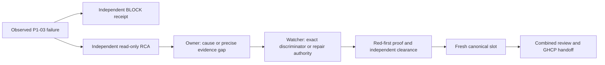

# Result: canonical qualification remains blocked

**Verified: App1258 executed,1257 passed,1 failed,0 skipped.** The sole failed test is
`AiDe.App.Tests.AtlasDaemonMainWindowProofTests.MainWindow_RealDaemonReplacement_AcknowledgesHealthyReleaseAndPreservesBorrowedClient`.
The completed TRX reports `Assert.NotNull() Failure: Value is null`. This is a known
failed test result, not a missing-TRX inference or a resource-containment abort.

Goal: qualify the frozen assembled candidate and move it toward GHCP handoff.
Done when: required canonical outcomes and independent review support foreground
acceptance, or a concrete failure has an Owner-approved resolution path. Not in scope:
ungranted product/selector/timeout changes, automatic retries, or Codex main publication.
TierT2; fan-out cap4 including Astra Owner and Conductor. User delegates ongoing execution
decisions to Owner and watcher; no further human confirmation is being awaited.

## Authority, execution and stop

Watcher grant `SLOT-CODEX-P1-03` is recorded on
`req-01M2NQAM1H1Y4DE75PRDEEWQZS` and `req-01M2NQAM367EJSZ292V9J58VZB`.
Both copies authorize one run, consumed once. Input/current source HEAD was
`5406ea69fc21f2cc765a329b4a99be28fc3583fb`; base/advertised main was
`bcf4959bc0e0e361736e6a179f05b69fcd0500f8`. Worktree:
`C:/Projects/ai-de-integration-atlas-five-gates`, branch `integration/atlas-five-gates`.
V3 wrapper SHA256 `a9470487e58d392be75015b1a6e9c194abddbba9ec7fb6225fffb8ac4c133be8`
ran the unchanged canonical `conductor-join.py --continue --no-push` path.

| Step | Observed outcome |
| --- | --- |
| Same-tree Debug preflight | Passed; exact input and three binary hashes recorded |
| Conflict marker / defect register | Passed;225 defect classes |
| Full App cohort | Completed1258/1257/1/0 executed/passed/failed/skipped |
| Core full/subsets and closing outcome check | No completed qualifying result; interrupted after App failure |
| Audit/regen/count commit, static gates, Release | Not reached by this canonical run |
| Main publication | Not attempted; foreground GHCP retains authority |

Owned canonical PID10088 began2026-09-16T18:31:35.240445Z. The completed App TRX was
written18:37:44.3970558Z. V3 detected its nonpass result and stopped its still-owned
runner tree. The recorded taskkill output identifies10088,21472 and the started next
dotnet descendants9976/18548/32236/17524/24016. It did not kill by process name.
END/RELEASE at18:37:45.442778Z is recorded in
`req-01M2NR5DWDDD8D6929HN66VV3N` and `req-01M2NR5DY6HGRD90AGQ4PDS4YH`.
All four qualification leases were explicitly released. Subsequent process readback
found no matching repo dotnet/testhost/AiDe processes. No retry occurred.

## Primary native failure and sampled state

The original first query for `Atlas files`, query1/batch1, returned null under the
proof-owned HWND853084/process21604 at18:37:32.1223591Z. It took51.8185ms. The original
owned-process assertion passed. The later same-root RuntimeId was[42,853084]; that
observation is after the query and is not simultaneous evidence.

The before-query WPF packet spans18:37:32.0680251Z–.0683703Z; after-query spans
18:37:32.2712458Z–.2716032Z. Both record the same current host3/content-reader4/view4,
attached to owned window5, loaded and visible, with two file roots, two outline rows
and one highlight. Each census visited383 WPF nodes without truncation/unavailable
state. Host State="loading" derives StatusText; the actual current child is an
AtlasReaderView. No private generation or view-to-lease authority is inferred.

The bounded UIA RawView census records100 nodes, depth cap12, Truncated=true and no
queued nodes remaining. It includes Code Atlas and `Loading Code Atlas.`. Its bounds
must be retained when interpreting absence; it is not an exhaustive whole-tree claim.
The Conductor inspected the actual member image: selected Answer member, highlighted
source, Back and bounds are visible. It is byte-identical to the successful one-case
diagnostic member image (SHA2565139c951d3b16a8718b06f3edcc4b8c268fb11ffb314ab8c4e5eec37d4b85d72).
Matching pixels and bracketing WPF state do not prove the provider state during FindFirst.

Native Completed=false/FailureCount4 comprises the recorded primary UI and test
exception propagation plus two forced-daemon-cleanup records. The exception points to
ObserveAutomationAsync line1082. Daemons32872 and35364 were subsequently reaped forced,
exit-1, with empty stderr. Cleanup is downstream evidence, not an established cause.
Historical P1-02 and the single-case pass remain intact; neither is rewritten as proof
of the new run's cause.

## Resource observation correction

At18:35:44Z testhost21604 working set was26,712,788,992 bytes. At18:36:06Z it was
27,405,004,800 bytes/private27,272,540,160; system free memory77,539,756KiB of
133,563,952KiB. These measurements establish consumption, not a leak or failure cause.
Actual verify-test-run.py buffers/discards subprocess console output and has no
cohort subprocess timeout; the V3 wrapper likewise has no outer timeout.

Owner admitted a prospective120-second observation checkpoint,40GiB private and16GiB
available-memory limits. The first persisted window sample was18:38:32.8246702Z,
after the failed-TRX stop. It correctly recorded the runner absent and completed TRX
present. **No resource-limit intervention occurred.** The obsolete asks
`req-01M2NR3ZFGWT4P2DPE7WYM0C29` and `req-01M2NR6W4ZBJEC8BD2N5RCH29D` were resolved
as superseded by the actual terminal result. The initial console projection of this
ordered-dictionary sample displayed null fields; the persisted JSON retained the real
values and was read directly. Console projection was corrected before any decision;
no missing field was treated as a successful identity check.

## Active graph and next bounded work

The programme optimize-graph remains active. New terminal evidence returns the
canonical node to diagnosis, not to an automatic retry:

Owner confirms an independent read-only RCA node:8calls/15minutes, checkpoint5, in
`C:/Projects/ai-de-investigation-atlas-p1-03-uia`; Astra was selected for temporal,
provider and STA reasoning. It compares query/root/observer relationships and concrete
cohort-state evidence; run-local identity numbers are not cross-run identifiers. Exit
is a supported cause or a precise remaining gap and smallest discriminating proposal.
No rerun, debugger attachment, source change, altered timeout/selector/cleanup or new
isolation policy is admitted. Any executable discriminator requires watcher scheduling
and exact scope. Independent combined reviewer remains separate from that investigator.

Investigation is incomplete. A provider-tree/lifecycle discrepancy is a lead; the
causal mechanism, necessary/sufficient discriminator and systemic repair are not yet
established. Class/sibling sweep and executable prevention follow the verified cause;
the existing observer and failed-TRX stop controls supplied this evidence. Budget/time
limits are circuit breakers, never evidence of correctness. Previous overruns remain
recorded; this run consumed exactly one qualification slot. Exact request/token cost is
not exposed. The native test failure, not memory growth, stopped canonical progress.

Completed: one canonical attempt, failure readback, owned stop, release and RCA dispatch.
Remaining: causal discrimination/repair, full canonical qualification, independent
combined clearance and foreground publication. Next: Owner/watcher disposition of the
independent RCA. Main is not updated by this checkpoint. Root retains generated
untracked `.artifacts/atlas-observer-controls/` and `.artifacts/d0-capture/` evidence;
no stash/reset/discard/cleanup is used. AIDE_CONTRACT_LOG is absent; no sink is invented.

## Raw evidence manifest

All paths below exist in the retained registered integration worktree.

- `artifacts/atlas-five-gates/qualification/atlas-five-gates-p1-03-5406ea69-20260916T1831Z/state.json` — SHA256 `5806606d53283c93cb2bfa4cf9b7b113bcc139af838418ebd3b3b4ecf35254f1`.

- `artifacts/atlas-five-gates/qualification/atlas-five-gates-p1-03-5406ea69-20260916T1831Z/00-AiDe.App.Tests.trx` — SHA256 `51d0a17a7a4d0e99bb4d72bd6a773e223782bed26b25278cf266af28cca527ac`.

- `artifacts/atlas-five-gates/qualification/atlas-five-gates-p1-03-5406ea69-20260916T1831Z/canonical.log` — SHA256 `8ea5212a65ae7de008c4b994ba38b4f58873f07adcc80feaf8c91c64137c1fa0`.

- `artifacts/atlas-five-gates/qualification/atlas-five-gates-p1-03-5406ea69-20260916T1831Z/preflight.log` — SHA256 `c2d78e25dd949805e4da8a957fafbb729f7ec8ab5f124b864d895d6f958764db`.

- `artifacts/atlas-real-daemon-window-proof/atlas-five-gates-p1-03-5406ea69-20260916T1831Z/receipt.json` — SHA256 `67f272836df38298d693240965df17415df6a8e72c3876a6120dc8390c5d00de`.

- `artifacts/atlas-real-daemon-window-proof/atlas-five-gates-p1-03-5406ea69-20260916T1831Z/mainwindow-member-normal-default.png` — SHA256 `5139c951d3b16a8718b06f3edcc4b8c268fb11ffb314ab8c4e5eec37d4b85d72`.

- `artifacts/atlas-five-gates/preflight/atlas-five-gates-p1-03-5406ea69-20260916T1831Z.json` — SHA256 `d4c325cc54e34532697d7e0b4736492284434090641d8b2981cf8943df3687f4`.

- `artifacts/atlas-five-gates/qualification/atlas-five-gates-p1-03-5406ea69-20260916T1831Z/resource-observations/20260916T183832824Z.json` — SHA256 `bf61e8527f33c94adaba85508c3ad4215681f463d4cd2470a77fd355ded4c64d`.

- `artifacts/atlas-five-gates/qualification/atlas-five-gates-p1-03-5406ea69-20260916T1831Z/resource-observations/owner-window.json` — SHA256 `6d8adab7d4ac683839e037c59570fda4b83e2279216d51111a538879c311f721`.

## Exact r5 ACK and diagnostic design checkpoint — 2026-09-16

Verified: Grok consumed the r4 deltas in req-01M2NSMA1BE6MNCTX0047HQBP8 and
published r5 at85b6a534ffd16c2b0890172231beaeb1f247e618, exact blob
a3cb0d63b911e85fb357e4273854ed7923f9b06a. The Conductor read the complete text and
its exact commit-to-blob identity. Independent Astra review found all four r4 text
corrections satisfied; its populated receipt is docs/proof/codex-d1-r5-consumer-review.md.
The Test Architect's documentary persistence condition is recorded separately from
product/runtime acceptance. No listing implementation or disabled-state runtime was tested.

Direct request req-01M2NSZB4T6B28MH44DKJSPXE6 uses exact from-role
codex-atlas-five-gates-integration and recipient grok-understanding-views-conductor.
Both contract and reason are exactly:
`CONSUMER ACK AS WRITTEN: r5 blob a3cb0d63b911e85fb357e4273854ed7923f9b06a`.
Incoming req-01M2NSMA1BE6MNCTX0047HQBP8 is resolved with the same exact line.
Root asserted the actual readback. Watcher copy req-01M2NT0GXTH48Z0V19VB1WHRM0
records the disposition. Producer same-blob ACK remains a separate freeze condition;
the consumer ACK alone does not prove bilateral freeze. R3 stays frozen, Grok authors
the mapping proposal, implementation/identity/API remain unadmitted, Sequence disabled.
The exact-role response addressed routing ambiguity; no dropped-delivery cause is claimed.

Owner confirmed T2 for the combined continuation, correcting the earlier T1 front matter.
Independent native design review of74e9976462e822ffcdf1808ba099915ee3a60c7f,
blob5e902f1cba8bf8270a0ed04b0c78f09f7b39c853, returned BLOCK for B1 completed UI
publication, B2 owner-identity versus association claim, and B3 cancellation/failed-release
custody. Natural-only activation differs from the canonical explicit ActivateAsync.
Owner admitted doc-only completion8calls/15min and independent rereview4calls/8min.

Author completion ebfe076125a1200345b806519b733104b3e06ea7 freezes investigation
blob3b6c8153018d1199e669cd519ba1c0bc65547a3d in the separate investigation tree.
Root inspected its full delta, final official audit and source equality against5406ea69.
B1 now proposes descriptor notification plus one dispatcher-tail predicate; B2 narrows
to treatment association with UIA owner:not-recorded; B3 defines custody and failure
recovery. A process-scoped Loaded class observer is proposed and still requires review.
The author has not cleared the original veto. Its final table's peer-held-commit wording
is stale: the exact peer RELEASE at19:02:27Z was observed, corrections/design committed,
all five leases released, tree clean. This status correction does not alter design bytes.

Local Owner followup and replacement spawn both returned `agent thread limit reached`.
No review was bypassed. Existing Owner direction supplied the r5 correction boundary;
its independent text review supported the Conductor's routine acceptance. The new native
mechanism remains unaccepted. Watcher request req-01M2NT8TTYERHMRAFEYJC3Y6TC seeks
external independent rereview of the exact completed blob. No human reply is awaited.

Graph update: r5 review -> consumer ACK -> producer ACK/freeze is independent of native
design completion -> independent rereview -> later exact authoring grant -> controls/review
-> separately scheduled paired diagnostic. Terminate each branch on its actual receipt;
capacity or call caps are defect signals, never approval. No executable/native/main grant
was added. Fresh remote main remains bcf4959bc0e0e361736e6a179f05b69fcd0500f8.

Planned versus actual: first native design reviewer4/4 operations; r5 reviewer4/4 shell
operations, duration unrecorded because no marker was written; its scope was read-only.
Native completion author9/8 operations, measured433seconds, overrun recorded. Root's
continuation had no new numeric call budget and a late19:02:11Z marker; no retrospective
cost compliance or whole-turn duration is claimed. Oversized reads were truncated; only
visible exact excerpts and actual readback support the claims. Failed guessed path/CLI
reads were corrected by discovery/help. The initially unbound coord tail refused rather
than checking; its identity-bound rerun supplied actual release evidence.

Completed: exact consumer ACK, independent receipt, committed doc-only design completion.
Remaining: producer ACK, independent native design rereview, eventual qualification/main.
Next: consume peer/watcher responses at their exact pins; no automatic test rerun.
