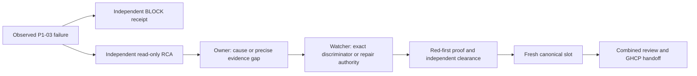

# Result: canonical qualification remains blocked

**Verified: App1258 executed,1257 passed,1 failed,0 skipped.** The sole failed test is
`AiDe.App.Tests.AtlasDaemonMainWindowProofTests.MainWindow_RealDaemonReplacement_AcknowledgesHealthyReleaseAndPreservesBorrowedClient`.
The completed TRX reports `Assert.NotNull() Failure: Value is null`. This is a known
failed test result, not a missing-TRX inference or a resource-containment abort.

Goal: qualify the frozen assembled candidate and move it toward GHCP handoff.
Done when: required canonical outcomes and independent review support foreground
acceptance, or a concrete failure has an Owner-approved resolution path. Not in scope:
ungranted product/selector/timeout changes, automatic retries, or Codex main publication.
TierT2; fan-out cap4 including Astra Owner and Conductor. User delegates ongoing execution
decisions to Owner and watcher; no further human confirmation is being awaited.

## Authority, execution and stop

Watcher grant `SLOT-CODEX-P1-03` is recorded on
`req-01M2NQAM1H1Y4DE75PRDEEWQZS` and `req-01M2NQAM367EJSZ292V9J58VZB`.
Both copies authorize one run, consumed once. Input/current source HEAD was
`5406ea69fc21f2cc765a329b4a99be28fc3583fb`; base/advertised main was
`bcf4959bc0e0e361736e6a179f05b69fcd0500f8`. Worktree:
`C:/Projects/ai-de-integration-atlas-five-gates`, branch `integration/atlas-five-gates`.
V3 wrapper SHA256 `a9470487e58d392be75015b1a6e9c194abddbba9ec7fb6225fffb8ac4c133be8`
ran the unchanged canonical `conductor-join.py --continue --no-push` path.

| Step | Observed outcome |
| --- | --- |
| Same-tree Debug preflight | Passed; exact input and three binary hashes recorded |
| Conflict marker / defect register | Passed;225 defect classes |
| Full App cohort | Completed1258/1257/1/0 executed/passed/failed/skipped |
| Core full/subsets and closing outcome check | No completed qualifying result; interrupted after App failure |
| Audit/regen/count commit, static gates, Release | Not reached by this canonical run |
| Main publication | Not attempted; foreground GHCP retains authority |

Owned canonical PID10088 began2026-09-16T18:31:35.240445Z. The completed App TRX was
written18:37:44.3970558Z. V3 detected its nonpass result and stopped its still-owned
runner tree. The recorded taskkill output identifies10088,21472 and the started next
dotnet descendants9976/18548/32236/17524/24016. It did not kill by process name.
END/RELEASE at18:37:45.442778Z is recorded in
`req-01M2NR5DWDDD8D6929HN66VV3N` and `req-01M2NR5DY6HGRD90AGQ4PDS4YH`.
All four qualification leases were explicitly released. Subsequent process readback
found no matching repo dotnet/testhost/AiDe processes. No retry occurred.

## Primary native failure and sampled state

The original first query for `Atlas files`, query1/batch1, returned null under the
proof-owned HWND853084/process21604 at18:37:32.1223591Z. It took51.8185ms. The original
owned-process assertion passed. The later same-root RuntimeId was[42,853084]; that
observation is after the query and is not simultaneous evidence.

The before-query WPF packet spans18:37:32.0680251Z–.0683703Z; after-query spans
18:37:32.2712458Z–.2716032Z. Both record the same current host3/content-reader4/view4,
attached to owned window5, loaded and visible, with two file roots, two outline rows
and one highlight. Each census visited383 WPF nodes without truncation/unavailable
state. Host State="loading" derives StatusText; the actual current child is an
AtlasReaderView. No private generation or view-to-lease authority is inferred.

The bounded UIA RawView census records100 nodes, depth cap12, Truncated=true and no
queued nodes remaining. It includes Code Atlas and `Loading Code Atlas.`. Its bounds
must be retained when interpreting absence; it is not an exhaustive whole-tree claim.
The Conductor inspected the actual member image: selected Answer member, highlighted
source, Back and bounds are visible. It is byte-identical to the successful one-case
diagnostic member image (SHA2565139c951d3b16a8718b06f3edcc4b8c268fb11ffb314ab8c4e5eec37d4b85d72).
Matching pixels and bracketing WPF state do not prove the provider state during FindFirst.

Native Completed=false/FailureCount4 comprises the recorded primary UI and test
exception propagation plus two forced-daemon-cleanup records. The exception points to
ObserveAutomationAsync line1082. Daemons32872 and35364 were subsequently reaped forced,
exit-1, with empty stderr. Cleanup is downstream evidence, not an established cause.
Historical P1-02 and the single-case pass remain intact; neither is rewritten as proof
of the new run's cause.

## Resource observation correction

At18:35:44Z testhost21604 working set was26,712,788,992 bytes. At18:36:06Z it was
27,405,004,800 bytes/private27,272,540,160; system free memory77,539,756KiB of
133,563,952KiB. These measurements establish consumption, not a leak or failure cause.
Actual verify-test-run.py buffers/discards subprocess console output and has no
cohort subprocess timeout; the V3 wrapper likewise has no outer timeout.

Owner admitted a prospective120-second observation checkpoint,40GiB private and16GiB
available-memory limits. The first persisted window sample was18:38:32.8246702Z,
after the failed-TRX stop. It correctly recorded the runner absent and completed TRX
present. **No resource-limit intervention occurred.** The obsolete asks
`req-01M2NR3ZFGWT4P2DPE7WYM0C29` and `req-01M2NR6W4ZBJEC8BD2N5RCH29D` were resolved
as superseded by the actual terminal result. The initial console projection of this
ordered-dictionary sample displayed null fields; the persisted JSON retained the real
values and was read directly. Console projection was corrected before any decision;
no missing field was treated as a successful identity check.

## Active graph and next bounded work

The programme optimize-graph remains active. New terminal evidence returns the
canonical node to diagnosis, not to an automatic retry:

Owner confirms an independent read-only RCA node:8calls/15minutes, checkpoint5, in
`C:/Projects/ai-de-investigation-atlas-p1-03-uia`; Astra was selected for temporal,
provider and STA reasoning. It compares query/root/observer relationships and concrete
cohort-state evidence; run-local identity numbers are not cross-run identifiers. Exit
is a supported cause or a precise remaining gap and smallest discriminating proposal.
No rerun, debugger attachment, source change, altered timeout/selector/cleanup or new
isolation policy is admitted. Any executable discriminator requires watcher scheduling
and exact scope. Independent combined reviewer remains separate from that investigator.

Investigation is incomplete. A provider-tree/lifecycle discrepancy is a lead; the
causal mechanism, necessary/sufficient discriminator and systemic repair are not yet
established. Class/sibling sweep and executable prevention follow the verified cause;
the existing observer and failed-TRX stop controls supplied this evidence. Budget/time
limits are circuit breakers, never evidence of correctness. Previous overruns remain
recorded; this run consumed exactly one qualification slot. Exact request/token cost is
not exposed. The native test failure, not memory growth, stopped canonical progress.

Completed: one canonical attempt, failure readback, owned stop, release and RCA dispatch.
Remaining: causal discrimination/repair, full canonical qualification, independent
combined clearance and foreground publication. Next: Owner/watcher disposition of the
independent RCA. Main is not updated by this checkpoint. Root retains generated
untracked `.artifacts/atlas-observer-controls/` and `.artifacts/d0-capture/` evidence;
no stash/reset/discard/cleanup is used. AIDE_CONTRACT_LOG is absent; no sink is invented.

## Raw evidence manifest

All paths below exist in the retained registered integration worktree.

- `artifacts/atlas-five-gates/qualification/atlas-five-gates-p1-03-5406ea69-20260916T1831Z/state.json` — SHA256 `5806606d53283c93cb2bfa4cf9b7b113bcc139af838418ebd3b3b4ecf35254f1`.

- `artifacts/atlas-five-gates/qualification/atlas-five-gates-p1-03-5406ea69-20260916T1831Z/00-AiDe.App.Tests.trx` — SHA256 `51d0a17a7a4d0e99bb4d72bd6a773e223782bed26b25278cf266af28cca527ac`.

- `artifacts/atlas-five-gates/qualification/atlas-five-gates-p1-03-5406ea69-20260916T1831Z/canonical.log` — SHA256 `8ea5212a65ae7de008c4b994ba38b4f58873f07adcc80feaf8c91c64137c1fa0`.

- `artifacts/atlas-five-gates/qualification/atlas-five-gates-p1-03-5406ea69-20260916T1831Z/preflight.log` — SHA256 `c2d78e25dd949805e4da8a957fafbb729f7ec8ab5f124b864d895d6f958764db`.

- `artifacts/atlas-real-daemon-window-proof/atlas-five-gates-p1-03-5406ea69-20260916T1831Z/receipt.json` — SHA256 `67f272836df38298d693240965df17415df6a8e72c3876a6120dc8390c5d00de`.

- `artifacts/atlas-real-daemon-window-proof/atlas-five-gates-p1-03-5406ea69-20260916T1831Z/mainwindow-member-normal-default.png` — SHA256 `5139c951d3b16a8718b06f3edcc4b8c268fb11ffb314ab8c4e5eec37d4b85d72`.

- `artifacts/atlas-five-gates/preflight/atlas-five-gates-p1-03-5406ea69-20260916T1831Z.json` — SHA256 `d4c325cc54e34532697d7e0b4736492284434090641d8b2981cf8943df3687f4`.

- `artifacts/atlas-five-gates/qualification/atlas-five-gates-p1-03-5406ea69-20260916T1831Z/resource-observations/20260916T183832824Z.json` — SHA256 `bf61e8527f33c94adaba85508c3ad4215681f463d4cd2470a77fd355ded4c64d`.

- `artifacts/atlas-five-gates/qualification/atlas-five-gates-p1-03-5406ea69-20260916T1831Z/resource-observations/owner-window.json` — SHA256 `6d8adab7d4ac683839e037c59570fda4b83e2279216d51111a538879c311f721`.
