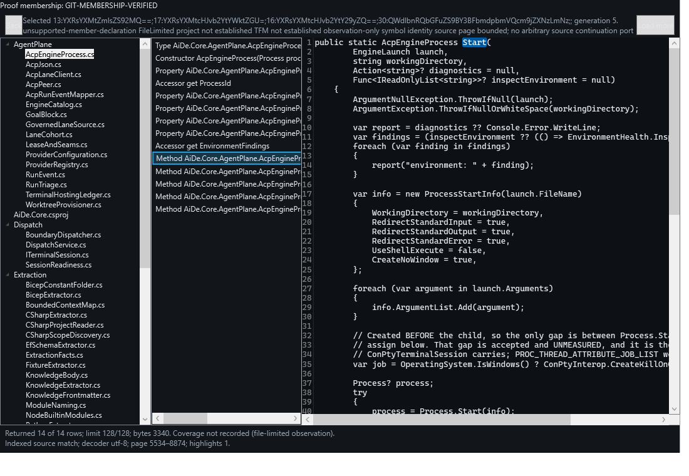

# Current evidence boundary

| Stage | State | Evidence / limit |
|---|---|---|
| Identity/binding first unit | Joined | `proof-code-atlas-identity-unit`; pure values, not filesystem or native behavior |
| Directory-enumeration investigation | Joined | `proof-code-atlas-enumeration-safety`; 29 passing cases, two NOT_PROVEN symlink cases; restricted ordinary-local evidence |
| F common foundation | Cleared and joined | Final worker `07d877ce`, Conductor pin `02695471`; 63 independently executed passing tests |
| E inventory producer | Repaired and joined | Candidate `c7f6caf9`, Conductor `d947fcee`; 95 producer tests and 110 combined F/E/D tests independently passed |
| D declaration producer | Repaired and joined | Candidate `0c426cd1`, Conductor `7584c0ae`; 78 independently executed passing tests |
| S source node | Cleared and joined | Candidate `97a23b06`, Conductor `720c847f`; 165 source-branch tests and 197 combined tests independently passed |
| Root bootstrap | Cleared and joined | `99d46eed` joined `41dc0501`; metadata-only, Complete alone supplies root identity; combined 225/225 |
| Q query service and continuation | Cleared and joined | `a06f31ab`/`e98b196e` joined `39dff3b7`/`bcbe8a47`; 272/272 independently executed Understanding cases |
| N native view and selection repair | Cleared and joined | Final `a8897914` joined `6583298e`; 45/45 independently executed, including own-HWND MTA UIA-client selection |
| Actual detached composition | Synthetic passed; joined | Runner `a0ffcee3` joined `cc67f7c6`; unchanged composed journey 45 PASS / 0 FAIL / 0 NOT_PROVEN; intended source mutation fails |
| Independent detached native journey | Scoped proof complete | Real-root 23 PASS; six synthetic-only N/A; independent bytes/spans, image, intended red and clean-after receipt complete |

## F common foundation

The original eight-file proposal `34a9e652` extracted the shared tuple encoder but did not
satisfy the frozen reading contract. The Conductor independently observed 53 passing tests and
still held the proposal on actual model gaps. Source-only and test reviews identified invalid
defaults, inconsistent bounds, an outline string/five-state source enum, forced numeric coverage,
failure observations requiring fabricated metadata, unknown-profile identity and unchecked
manifest membership.

The same writer produced `bac95e92` and `07d877ce`. Three retained semantic failures targeted:

- `Create_ReturnedRowsExceedLimitOrKnownTotal_Throws`
- `Create_ManifestContradictoryBinding_ThrowsEvenWhenPartial`
- `Create_NonMatchSourceProjectionWithText_ThrowsAndUnknownCoverageHasNoNumericFiction`

The final one-test red was
`Create_PublicSourceConstructorWithNonVerifiedStatus_Throws`. It detected a public
all-fields constructor that bypassed the state-specific factories; the corrected constructor
permits verified observations only.

Final code provides validated reference identities/requests/limits, typed immutable outline and
source projections, explicit unknown/withheld coverage, state-dependent source observations,
reserved-unknown profile handling and cross-reference/binding checks even for partial manifests.
These are passive model/port contracts. They do not implement root issuance, I/O, compiler
collection, queries or native UI.

### Independent execution

The Conductor ran the targeted Understanding test set against the candidate and then the joined
branch:

```powershell
dotnet test tests\AiDe.Core.Tests\AiDe.Core.Tests.csproj --no-restore --filter "FullyQualifiedName~AiDe.Core.Tests.Understanding" --logger "trx;LogFileName=<run>.trx" --results-directory <session-evidence-directory>
```

Both final runs executed **63 tests, 63 passed, zero failed/skipped**. Retained worker evidence:

- `TestResults/atlas-live-core-red/atlas-live-core-mutant-red.trx`: one failed codec golden mutant.
- `TestResults/atlas-live-core-phaseb-red/atlas-live-core-phaseb-semantic-red.trx`: three semantic failures.
- `TestResults/atlas-live-core-phasec-red/atlas-live-core-phasec-red.trx`: the constructor-escape failure.
- `TestResults/atlas-live-core-phasec-green/atlas-live-core-phasec-green.trx`: 63/63.

Parent outputs are retained in this session's `files/atlas-foundation-final` and
`files/atlas-foundation-joined` directories. The original reported missing-TRX finding was
withdrawn after direct absolute-path XML reads: ignored-file glob omission was not absence.

Data reviewer `91c51d36-21fc-4c00-8cf4-57fa50a1cb00` cleared the final constructor blocker;
Test Architect `e8c73a03-3fa2-4a77-8d17-68cdf80188b1` cleared the model-contract oracles.
The Conductor inspected the exact final guard and observed both final runs. No clearance is
promoted to producer or native behavior.

### Join and accounting

Candidate commits joined as `8808a1b2`, `b12c05c0`, `02695471`. A live F lease initially
refused the join; the actual worker released all eight leases and ended its coordination session
before the Conductor retried. The primary checkout was not used for Atlas integration.

The writer reported 32 calls against F's initial 18, followed by ten correction calls and four
constructor-close calls. These reported costs and the original overrun remain visible. Owner
turn 13 allocated a 96-call F/E/D ceiling; budgets are not retroactive acceptance.

## Producer pin and no-overlap contract

E and D both start at `02695471264cfe0ae29f9a5a2784070cdc0f11b4`, in separate registered
worktrees. E owns only inventory/directory-enumerator source and tests; D owns only declaration
observation source and tests. Neither edits frozen F files. The sole section-2 register carries
their exact grants, and the Conductor controls review and local merges.

The next evidence must demonstrate actual authorized file inventory and actual compiler
declarations/ranges from complete hash-bound inputs. Fake graph fixtures, display strings as
identity, fabricated project/TFM context, unbound source rereads and a supplied DTO collection
presented as a live native journey are not accepted substitutes.

## S bounded source node

S consumed the cleared F/D contracts and the explicit decoder bootstrap seam rather than adding
a second decoder. Candidate `97a23b06` changed only `AtlasSource.cs` and its dedicated tests.
The Conductor independently ran 165/165 in the source tree, read the exact mutant TRXs, and
joined the source commit as `720c847f`. The combined F/E/D/S run executed **197 tests, all passed**.

The directory-lease mutant produced one semantic failure when a mutation was no longer blocked.
The identity-sharing mutant produced four semantic failures: root/file replacements incorrectly
returned IndexedMatch instead of Changed. Final evidence is in
`TestResults/atlas-source-proof/atlas-source-final-20260912.trx`;
mutants are `atlas-source-mutant-directory-lease-20260912.trx` and
`atlas-source-mutant-identity-sharing-20260912.trx`. Compressed handoff wording caused an initial
filename ambiguity; direct reads of these exact files corrected it. No missing-artifact claim
survives that readback.

Security and Test cleared limited Core source-node incorporation: current grant/membership/
classification, expected manifest/root/file/hash binding, same-handle bounded bytes, strict decoder
reuse, request-local disposal, textless non-match projections, and bounded scalar-safe pages.
ReadUnstable coverage includes an explicitly injected early-EOF case, not a claimed native race.
No real workspace, UI/IPC/raw-grant exposure or broad symlink/race-free claim is inferred.

The author spent 37 leaf calls against 30, including eight author-run validations. Those are not
independent review; the separate reviewer/parent evidence above still ran. Q now consumes the
actual S API. Native proposal `e0fdb531` remains held for its separately authorized rendered
interaction repair; its seven fixture tests do not close the native journey.

## E inventory producer

The initial proposal `e54f21e1` passed 73 tests but was held on actual native/resource/policy
defects. Owner assigned the same four-file scope to a separate execution-capable Astra writer.
The old writer's leases were checked free; a remaining coordination registration was corrected
by that writer using the actual session-end command and state readback.

The replacement's first 30-call proposal retained 92 passing and three failing tests. The bounded
investigation `investigation-code-atlas-native-repair-controls` separated metadata-only handle
sharing from junction teardown. After Owner approval, the exact three failures passed, then all
95 targeted tests passed. The Conductor independently repeated 95/95 at `c7f6caf9`.

The fixed producer enforces current/expiring grants before and during work, expected native root
identity, same-handle metadata, operation-local resource state, bounded collection and descriptor
accounting, typed errors, actual parent keys, explicit known/non-Git/unavailable membership,
and zero returned source-content bytes for metadata results. Unknown membership does not become
authorization. Core keeps raw grant/session/root details; later UI/IPC projections must be redacted.

Security reviewer `3facf06b-883c-4039-a461-51b93a236f11` and Test Architect
`e8c73a03-3fa2-4a77-8d17-68cdf80188b1` cleared bounded candidate Core incorporation with the
ordinary-local/reparse-exclusion, grant-current predicate and private-grant conditions retained.
No symlink or universal race-free claim is made.

The two E commits joined as `5a4cdede` and `d947fcee`. The combined F/E/D run executed
**110 tests, 110 passed, zero failed/skipped**. Parent TRX is in this session's
`files/atlas-producers-joined`; candidate red/intermediate/final artifacts remain in the E
repair tree's `.e-repair-results` directory. Reported replacement expenditure is 30 + 6 leaf
calls, separate from the original E allowance and handoff overhead.

No live-user-workspace, source-content, query/receipt, native UI or E0 completion is asserted.

## D declaration producer

The initial two-file proposal `00a85823` passed 70 tests but was held after code review:
text-only tree mapping, traversal-dependent occurrence keys, uncapped/public buffers and nested
double traversal did not satisfy the frozen contract. The writer's reported 37 leaf calls against
24 remain an overrun, not 19 top-level calls substituted for leaf execution.

Owner authorized one 20-leaf correction. The Conductor read a response-only repair contract before
release. `0c426cd1` implements explicit syntax-tree/file/root/source binding with exact text/hash,
stable own-occurrence keys, an 8 MiB pre-clone limit, admitted BOM-directed decoding, internal
disposable source leases, source-only single traversal and deduplication before cap accounting.
FileLimited remains observation-only and does not become a real project/TFM claim.

The Conductor read seven retained semantic red failures:

- identical-content files remain distinct;
- wrong file/tree mapping rejects;
- unrelated earlier files do not change an occurrence key;
- oversized/BOM-less inputs reject;
- disposed source leases reject use;
- nested/exact-limit traversal is not charged for duplicates;
- unimplemented partial definitions keep their role and limitation.

Candidate and joined runs each executed **78 tests, 78 passed, zero failed/skipped**. The retained
red is `tests/AiDe.Core.Tests/TestResults/atlas-declarations-phaseb-red.trx`; parent results are
in this session's `files/atlas-declarations-repaired` and `files/atlas-declarations-joined`.
Data reviewer `91c51d36-21fc-4c00-8cf4-57fa50a1cb00` cleared the D data-contract blockers.

Commits joined as `0711be09` and `7584c0ae`. The repair was reported as 12/20 leaf calls.
No files outside the two-file grant changed. This proves a non-I/O declaration producer over
supplied bound inputs, not a project loader, filesystem authority, source reader, UI or E0 delivery.

## Q/N continuation and manifest seam

Q publishes a new immutable manifest after a new source observation. N must use that returned
token for subsequent member/file requests, and must not adopt tokens from stale, canceled,
non-match or faulted requests. Back retains the original issued receipt/binding. Inventory
continuation is a separate contract: Q supplies `NextOffset` only for further retained ordered
rows. A null continuation does not turn an unknown global denominator into complete coverage.

| Claim | Evidence and oracle | Red observed | Confidence / residual |
|---|---|---|---|
| Q preserves ordered retained paging, unknown/withheld totals and zero content bytes | Eleven new cases in `AtlasQueryServiceTests.cs:432-589`; old code lost continuation, changed the denominator, charged metadata as source bytes and reused offsets after rowset changes | `atlas-q-continuation-red-8e5a63af57274c3fa8c3a05811757101.trx`: 43 total, 32 passed, 11 failed | Verified component behavior; not a live native proof |
| Q file/member/different-file selection keeps immutable manifest identity and stable inventory | `Select_FileMemberDifferentFile_ChangesManifestIdentityWithoutChangingInventoryContinuation` asserts changed file token, same member token, original inventory row objects and refusal of the stale initial token | Included in Q continuation red | Verified Core fixture journey |
| N advances authority only for accepted current projections and consumes explicit continuation | `NativeReader_AcceptedFileMemberFileAndBack_AdvanceOnlyReturnedManifestTokens`, non-match/stale/restore and continuation cases | `atlas-native-seam-turn20-red-01.trx`: 38 total, 18 passed, 20 failed, no timeouts | Verified shown native fixtures; queries are fixtures here |
| Joined components preserve prior regressions | Conductor `files/atlas-query-native-joined/core.trx`: 272/272; `native.trx`: 38/38; zero skips at `bcbe8a47` | Earlier stage and seam falsifiers above | Verified joined component run, not real Q/native composition |

Q raw evidence remains in `C:\Projects\ai-de-atlas-live-reader-query\TestResults\atlas-query`.
Its final targeted run is `atlas-q-continuation-final-605103b098fd415cadfac97ecfe632a2.trx`;
combined is `atlas-q-continuation-understanding-58365e35aa5d4f349d91e5e7bdc86fa0.trx`.
N raw evidence remains in the native-repair tree's `TestResults/atlas-native-repair-astra`;
final is `atlas-native-seam-turn20-green-01.trx`.

GATE Q-continuation · 2026-09-13 · Security/Test + Conductor · exit criteria met:
targeted authorization/binding/redaction review, eleven semantic falsifiers, full test-diff
readback and 272/272 independent execution · verdict: PASS for component seam · vetoes: none.
The Test review's display-truncated diff was read in full by the Conductor; the limitation was
not silently treated as a completed review.

GATE N-continuation · 2026-09-13 · UX + Conductor · exit criteria met: accepted-only token,
receipt/history and authoritative continuation shown-window cases, twenty semantic failures
and 38/38 independent execution · verdict: PASS for fixture-native seam · vetoes: none.

No full WCAG, high-contrast, multi-DPI, performance, real-repository or shared-host claim follows.
The next proof must attach the actual query service to the actual shown native view. Owner
turn 21 permits only the runner's bounded `--prove` mode and proof-owned rendered capture.

## First actual composition run: partial, with a required failure

The runner author used actual Q composition and the shown native view. The Conductor read
`artifacts/atlas-reader-author/turn23-observed/evidence/summary.json` and relevant event rows
in the runner tree: **37 PASS, 1 FAIL, 7 NOT_PROVEN**. `back-focus` fails because the selected
member observation is null. It was already null in the recorded pre-different-file state.
Receipt, source observation/binding/manifest, cursor selection and focus/scroll checks pass.
The owned-window rendered capture exists; it is not a desktop screenshot.

The author also executed `--prove --oracle-fault source`, exiting one at the intended
`ASSERT-rendered-source`. This is source-oracle mutation evidence, not complete runner proof.
The seven subsequent checks were not reached, and no success-shaped total substitutes for them.
No real AI-DE root was read.

`investigation-code-atlas-outline-selection` records the source path, competing explanations,
Test's veto on weakening the expectation, and Owner turn 24's phased repair approval. The
native owner receives eight new leaves in its existing two files. The runner's ceiling becomes
26 (19 reported spent) and its continuation waits for the reviewed native fix. The original
failed receipt is retained; independent real-root proof remains open.

## Repaired composition and joined baseline

The native product fix remained SHA-256
`8B76E2BD85BF44651D5CC6D4F4F528A29585034C675EB12554735F7FDE243980`
through the separate test-oracle corrections. N final `a8897914` passed 45/45 in its tree and
in the Conductor's independent replay. The actual MTA UIA client observed its owned window,
zero-to-one selection, matching name and selection-container runtime IDs, and selected state.
The original UIA provider-null/cache diagnostics are retained, not mislabelled product defects.

Runner `a0ffcee3` then passed **45 required synthetic checks**, including the unchanged Back
focus/selection predicate, changed/unavailable source clearing, cancellation and pass-through.
Its source-fault run exits one specifically at `ASSERT-rendered-source`. The cancellation
oracle asserts the actual typed inventory contract: no files or continuation, unknown/absent
total, `atlas.query.canceled`, and no retained source/highlights. Test read that correction and
released the independent real-root phase.

Conductor joined runner `cc67f7c6`, built it with zero warnings/errors, and executed **272/272**
Core Understanding and **45/45** native tests with zero skips. This is the joined reader
implementation, not a merge into main. Primary later advanced to `6d3e281a` with CV-2;
the reader still declares its older baseline honestly. Both counterpart requests remain open.

### Independent-run boundary and recipe correction

The independent actor's first 15 leaves ran the authorized real-root journey successfully:
23 PASS, no FAIL or NOT_PROVEN, six synthetic-only checks N/A. External byte/UTF-16 and image/
post-clean checks were not yet complete. Its attempted semantic red hit
`SYNTHETIC-SCOPE-MUST-BE-NEW` because the Conductor recipe put green and red outputs beneath
one parent. That is a setup refusal, not the intended mutation failure.

Owner turn 31 extends this actor to 21 leaves for exactly those remaining checks and receipt.
The corrected command uses a genuinely new parent:
`<evidence-base>\semantic-red-isolated-20260913\evidence`.
The original collision evidence is retained; nothing is deleted to make the retry pass.
Synthetic runs must each have their own parent because the runner derives `synthetic-scope`
from that parent. This is the documented invocation boundary, not a source-code repair.

## Final independent scoped proof

Independent Test Architect `0c88d95c-b31d-4a0f-81a8-12208d822e80` completed the approved
read-only run and external checks. The Conductor read the final and machine receipts and
verified the copied capture's SHA-256. The real scope was **only `src/AiDe.Core`** in the
clean proof worktree at `bcbe8a47859984c1e93074efc65116908ebb7936`.
Reader implementation was `a0ffcee313e6c5a7a8910f151537786188ad996e`,
joined in the Conductor as `cc67f7c6`. Input revision and reader revision are distinct.

| Claim | Executed evidence / source | Oracle and red | Confidence / limit |
|---|---|---|---|
| The actual native reading path runs through Q, not supplied graph fixtures | Real summary: 23 PASS, zero FAIL/NOT_PROVEN; five requests, four selection/restore results and one inventory result; order select/file, select/member, select/different-file, restore | Missing composition, window/control, source, identity or Back evidence fails a required row; original Back row failed before N repair | Verified for this detached scope |
| Displayed source matches the approved bytes and UTF-16 ranges | Independent .NET byte/decoder/substring checks against selected files; hashes and spans below; no producer helper reused | Isolated source fault exits one at `ASSERT-rendered-source`; the earlier parent-collision failure is not counted | Verified for observed pages; FileLimited, not full-solution semantics |
| Back retains the original observation and binding | Returned file, manifest, byte hash, observation key, page span/hash equal the accepted member; issued receipt used; no fresh select | Original composed `back-focus` failed; repaired unchanged predicate passes | Verified for the observed path |
| Selection and focus agree with the source anchor | Restored `ListBoxItem` focus, outline key, source selection `31:5`, scroll `0`; native 45-test set independently observes current UIA client selection | Empty/wrong/missing/stale selection and wrong container/key fail named checks | Same-process, owned-window UIA client; not full assistive-technology conformance |
| Real input stayed read-only | After-run HEAD remains the approved `bcbe8a47`; tracked/untracked status entries `0` | Any status drift or revision mismatch fails the input boundary | Verified after this run |
| Failure cases clear source honestly | Independent synthetic 45 PASS; changed, unavailable, canceled, approval and membership cases are separate | Intended source-red failure retained; unknown totals are not fabricated zeros | Six synthetic-only real-mode rows stay N/A, never counted as real-root passes |
| The rendered surface contains the journey | Independent visual inspection of the committed capture below: selected file, selected `Start` method, source and highlighted name | Blank/missing panes or mismatched visible state would fail the observation | Visible viewport only; offscreen source, theme/DPI breadth and full WCAG unproved |

### Independently checked files and ranges

| Step | Relative file | Byte SHA-256 | Page / highlight |
|---|---|---|---|
| File | `AgentPlane/AcpEngineProcess.cs` | `90f332d6caf1463324481f62b8fc710a909c05b08f7ae4a131aa4c2d2ca08bb8` | UTF-8; initial page `0..11896` |
| Member | Same file, `AcpEngineProcess.Start` | Same original byte hash | UTF-16 `5534..8874` (3340 units); highlight `5565:5`, text `Start` |
| Different file | `AgentPlane/AcpJson.cs` | `ca3cd90369c39764768de9c426ea52c11e804e3d296ba420ffb65ab702691991` | UTF-8; page `0..903` |
| Back | Original `AcpEngineProcess.cs` observation | Same original byte hash | Same member page/highlight; page text SHA-256 `f209fcdf927b16cfd015368c5e65e0298926fe09f70cdafcad90a9ab4af50436` |

The issued member receipt was `atlas-receipt:a4d258da73e649e6ba8049ce107e7375`.
Restore used it and returned the original observation/manifest. A returned successor receipt
is not falsely described as an unchanged receipt token.

### Owned-window capture



This is a **rendered capture of the proof-owned window**, not a desktop screenshot.
Size: `1100 x 760`. SHA-256:
`caa6be91c75994416bfdfc47a28d2867c5ea76a31b8d1134c4733e570d469ab8`.
The visible source pane ends at the viewport; the capture does not prove offscreen content.

### Approval, binary pins and retained raw evidence

The external approval record's exact SHA-256 was
`2bcd31c78396b7bec129f2b64e1e3e12ad63de67e3c61f7c0447788f2f570880`.
Its session was `atlas-live-proof-gpt55`, policy `atlas-proof-readonly/v1`, decision
`atlas-owner-turn21-clean-core`, and expiry `2026-09-13T04:00:00Z`.
Independent freshness was checked at `2026-09-13T02:30:31.9678783Z`.
This historical approval must not be reused after expiry.

Verified executable SHA-256:
`ee33bc2a8137ba7b2d792f1ba7c5da30bb2307307eb285b1b3822cd04d103c7f`.
Runner DLL SHA-256:
`eb284d16cd3ae35cfb74718da8e845e6c2e2389056d6bf6280c76a7bed596438`.

Raw independent receipts are retained in this session's
`files/atlas-independent-proof/independent-final-receipt.json` and
`independent-machine-receipt.json`; real `summary.json`/`events.jsonl` and capture are under
`real`. The intended red is under
`semantic-red-isolated-20260913T023031990/evidence`. The colliding first red and synthetic
fixture directories remain as evidence; they were not deleted to manufacture success.
This committed section and PNG preserve the scoped result beyond those local run directories.

GATE independent-detached-reader · 2026-09-13 · independent Test Architect + Conductor readback ·
exit criteria met: real composition, independent byte/UTF-16/different-file checks, original
binding/receipt Back, visual inspection, intended red, fresh approval and clean-after state ·
verdict: PASS for the declared scope · vetoes: none.

## Reproducing the synthetic proof

From this branch, use a fresh **parent** for every run:

```powershell
$green = Join-Path $env:TEMP ("atlas-reader-green-" + [Guid]::NewGuid().ToString("N"))
dotnet run --project spikes\code-atlas-reader-candidate\CodeAtlas.ReaderCandidate.csproj -- --prove --output (Join-Path $green "evidence")

$red = Join-Path $env:TEMP ("atlas-reader-red-" + [Guid]::NewGuid().ToString("N"))
dotnet run --project spikes\code-atlas-reader-candidate\CodeAtlas.ReaderCandidate.csproj -- --prove --oracle-fault source --output (Join-Path $red "evidence")
```

Green must report all required checks passed. Red must fail specifically at
`ASSERT-rendered-source`; a build error or setup refusal proves nothing about that oracle.
These commands exercise a bounded detached proof harness, not the registered application's
sidebar or an interactive full Code Atlas workspace.

For a real scope, the runner requires `--approved` plus the root, external approval record and
digest, independently supplied decision/grant/workspace/root/policy/session/expiry fields, and
the expected commit. The exact historical command is retained in the independent receipt.
A new scope or expired approval requires a new recorded decision; a root string is not authority.

**Not accepted by this proof:** shared sidebar/host/IPC integration, normative Addendum E,
graph/tree pivot, class/sequence/domain/layered/Azure views, AI interpretation, full project
evaluation, broad platform/accessibility/performance coverage, or current main `6d3e281a`.
