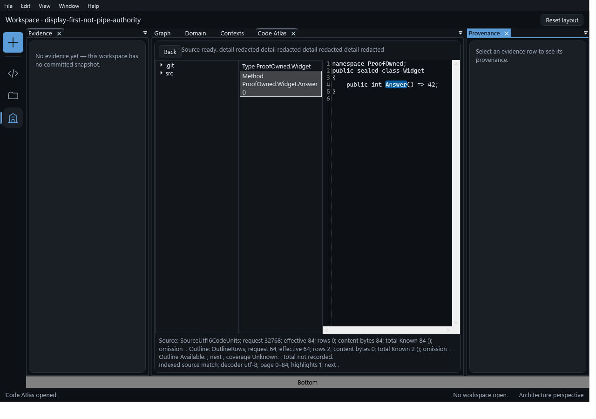
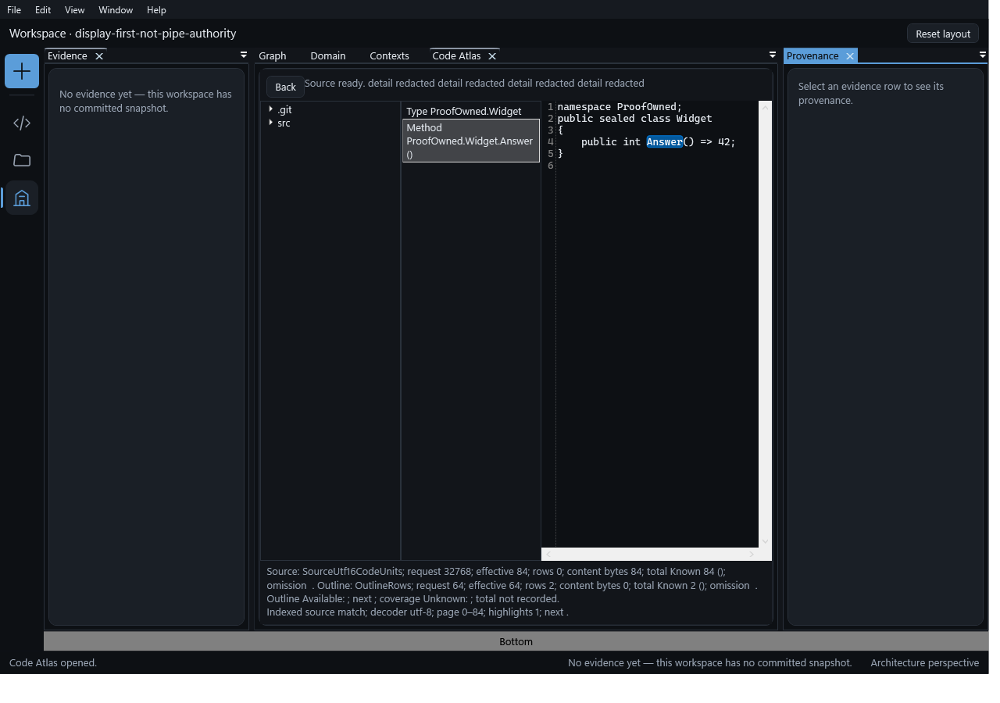
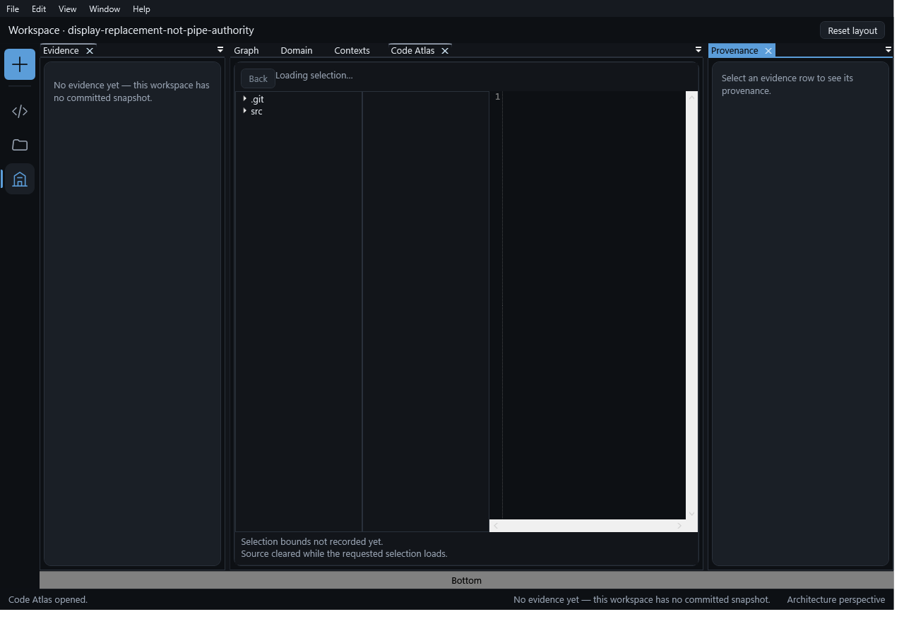

# Bounded E0 acceptance, not programme completion

Owner turn 63 accepts the observed real daemon-backed file/member/source/Back journey,
healthy acknowledged release, replacement and normal-default Center readability.
Conductor inspected the actual member-selected PNG, raw lifecycle/geometry receipt,
proof source and an independent parent replay.

This record does **not** register Addendum E as normative, authorize main integration or
push, or complete the wider Code Atlas programme. E1 static views, E2 domain/ER/layer/Azure,
E3 correspondence and E4 AI remain separate phases.

## Accepted scope and revisions

| Item | Observed identity |
|---|---|
| Product source in the proof tree | `f89822cb9d7a0388ba84a5ad650aee68f7e420db` |
| Initial independent proof commit | `2ab95e2b61818d828d5c36d3ac68b72632b906c4` |
| Normal-default readable proof commit | `6bb7646d7205fc60be2a9a0888e9c43ad106ff81` |
| Reviewed Center/wrapping implementation | `6591b5e94a6574bcb43035567e5743e12342f5f0`, joined as `dd84702b` |
| Authored proof surface | `tests/AiDe.App.Tests/Workbench/Understanding/AtlasDaemonMainWindowProofTests.cs` only |
| Independent input | Two separately owned synthetic Git repositories; `src/Widget.cs`, 84 UTF-8 bytes |
| Window | Actual MainWindow, 1280 x 900; normal Architecture/Code Atlas opener; no maximize |
| Source SHA-256 | `0B58B4CA02428A8671250B4C59019CC5D35E236111CE8BF9AB986783DAD48835` |
| Method declaration extent | UTF-16 start 55, length 26 |
| Identifier highlight | UTF-16 start 66, length 6; `Answer` |

Declaration extent and identifier highlight are different quantities. An earlier proof
assumption equated them; the final oracle checks each against the actual source bytes.

## Claim-to-evidence ledger

| Claim | Evidence and oracle | Confidence / boundary |
|---|---|---|
| Actual daemon/client/reader path, not fake Atlas data | The test launches the built daemon executable, connects actual `WorkspaceClient`, uses `CreateAtlasReader`, and wraps calls only to observe/forward unchanged results | Verified by source and executed run; owned synthetic repositories only |
| Returned and bound source match the owned file | File/member/Back page hashes and the reader's source hash equal the actual 84-byte file hash; declaration/highlight bounds are checked against that file | Verified for this fixture; not every language, file size or project profile |
| Default source and member label are visibly readable | Actual clipped source/glyph geometry plus parent inspection of the member-selected capture below | Verified at 1280 x 900; component geometry separately covers 1440 x 900 |
| Back preserves original binding and selection | Final receipt records `SameBinding=true`, `SameSelection=true`; assertions compare file/declaration and binding tokens | Verified native-Q path; no new authority granted by a receipt |
| Workspace replacement drains through healthy release | Both actual leases are healthy before disposal; forwarding wrappers await normal return from the real lease `DisposeAsync`; the established healthy path awaits `atlas.release` and server scope stop | Verified bounded acknowledgment path, not generic/terminal reader disposal |
| Replaced source does not remain visible | Old source clears before replacement await and stays clear after new selection and dispatcher idle | Verified tested replacement; deliberately held late-publication race not exercised by this window run |
| Old scope/foreign receipt is refused | Actual old/replacement client APIs throw their typed guards; receipt identifies the rejection layer | Verified **local client guard**, not a new server-rejection proof |
| Borrowed general clients survive window close | Two real query round trips succeed after close; proof owner subsequently disposes those clients | Verified query transport; a distinct command method was not invoked |
| Owned lifetimes end | Window closes after awaited ownership cleanup; owned dispatcher body completes; both daemons exit normally and fixtures are deleted | Verified observed paths; no stalled-kernel/general fault guarantee |
| Accessibility observation is scoped to the owned window | MTA UIA client starts from the owned HWND, checks process identity and named controls; no DesktopRoot/private-cache manipulation | Verified observation, not full WCAG or screen-reader certification |

The original clipped-default captures and source-property/UIA-only green were not accepted
as readable-pixel proof. Placement then went red for Right instead of Center and clipped
source; Center went red for the complete label; finite-width wrapping and actual glyph-run
oracles supplied the corresponding green evidence. The older wrong legacy stack-maximize
assertion and forced-cleanup outcomes remain retained as failed proof history.

## Actual readable geometry

All values below are WPF device-independent pixels from the normal-default real-window run.

| Quantity | Observation |
|---|---|
| Client bounds | 1265.333 x 862.667 |
| Code Atlas | Center, width 654.507; intended surface and logical focused stack match |
| Source text viewport | x 713.647, y 128.540, width 256.940, height 572.343 |
| Longest tested source line | width 228.500 |
| Highlight | x 827.897, y 173.860, width 45.700, height 15.107 |
| Selected label viewport | width 176 |
| Rendered wrapped glyph runs | Three; all finite, positive and inside clipping |
| Full text/accessibility | Rendered non-whitespace character hash matches full label; full accessible name preserved |
| Typography | Source and label 13 DIP; no trimming, font reduction or proof-only resizing |

Approved capture SHA-256:
`0A55507A2F367CAF0F19658E4DDC0B51E3D3082E1A9C31C6ACDCD25ED19295F2`.
Conductor read the original image, copied only this approved owned-window file, and
verified the destination hash is identical.

## Execution receipts and binary pins

The independent author run is `owner62-trx1/owner62-run1.trx`: one passed, zero failed.
Its raw `owner62-run1/receipt.json` records normal daemon exits 57944 and 50400, both zero,
and deleted fixtures. The proof author used 47 of 49 allocated calls at that checkpoint.

Conductor separately rebuilt and executed the proof under `ATLAS_PROOF_RUN=parent-owner62-verification`:
one passed, zero failed, with raw normal exits 48360 and 53416, both zero, healthy release
returns and deleted fixtures. Its independently inspected member image also shows the full
source, wrapped label and highlight. This parent replay ran in the proof checkout; the
current-Conductor-tree replay after joining was a separate closing check, completed
in the follow-up below.

| Author-run binary | SHA-256 |
|---|---|
| Daemon executable | `FAB7906DA6B700BE53977CFC5FD6B86E4470E16A407EBC11B63ACA59E153E974` |
| Daemon assembly | `D9FFB9F3BA2007FBD683E6178817D3CFA2BBA0A08B8533764F23B1C5A6B064B8` |
| Core assembly | `A70252A4B3BA0B0AE9F49B645047565DAC4E73A4C7B26484FAC6C0DEB92BBED1` |
| App assembly | `61808FEF99DF3536A5493C23870C49EE38277FD2517EF70311059830BE09801D` |
| Proof source | `E91ED164228218A85C2835BDFB24BAA1DEF238DB1EED70666E177703E5ABACDA` |

Machine-local raw evidence is retained under the independent proof worktree's
`artifacts/atlas-real-daemon-window-proof/`, including all earlier failed runs.
Parent TRX is retained in the session files at `atlas-real-window-parent/parent-real-window.trx`.
The committed record/capture above do not pretend those raw machine-local receipts are committed.

## Footer and current-checkout closure: Owner 67 conditions

The first footer follow-up failed because its selector required globally unique
status text: the evidence pane and footer legitimately show the same status.
The named-control correction then failed an overstrong ink-containment assertion.
Neither failure established a product-status defect. Both failed runs remain in
`owner63-*` / `owner64-*` evidence folders; forced cleanup is not a normal exit.

Before changing the ink predicate, the original predicate was retained in
`owner67-characterization`. The empty run contained exactly U+0020, cluster `[0]`,
glyph index `[2]`, and advance width `3.562` DIP. The revised proof exempts only
nonempty U+0020-only runs with empty ink, not arbitrary empty rectangles.
It still compares the displayed text with the legitimately refreshed active VM,
checks the `Workspace health` automation name and `StatusMessage` binding owner,
and requires every rendered nonwhitespace character plus every real ink rectangle.
The existing owned-HWND accessibility proof remains; this is not a new general
screen-reader certification.

The failure class is **geometry-only text proof without character coverage or
characterized no-ink handling**. The sweep covered the two footer checks and their
shared glyph helper, also used by the wrapped member proof. Derivation now uses
one `FooterAccepted` predicate. Its three negative controls remove the required
`N`, replace a nonwhitespace run's ink with `Rect.Empty`, and clip real ink while
the other rectangles still fit. All three are rejected for both workspace VMs.
These are mutations of measured observations, not fake runtime/query data.
Canonical defect-ID reconciliation remains with the Conductor; no number is guessed.

| Closing evidence | Observed result |
|---|---|
| Proof-only correction | `ac683dce2c29d182e31999e77ef0183e25ea07ba` |
| Conductor joins | `d4d84674`, `9b9f83d4`, `a8e09f355e6785e7b0f24b009cc64e7f9785fc54`; only the one proof test |
| Author full run | `owner67-trx1/owner67-run1.trx`: 1 passed, 0 failed; daemons 39032/29648 exited 0 |
| Parent alternate-checkout run | `conductor-owner67-trx/conductor-owner67.trx`: 1 executed, 1 passed, 0 failed/skipped |
| Parent repository and Git root | Both `C:\Projects\ai-de-conductor-code-atlas` |
| Parent assembly/binary roots | Executing App.Tests assembly and launched daemon both under that Conductor tree, not the old proof tree |
| Parent daemon exits | 38152 and 59056, both 0; process absence and owned-directory deletion read back |
| Both actual footers | Binding owner is the active VM; text equals legitimate `RefreshAsync` result: “No evidence yet — this workspace has no committed snapshot.” |
| Healthy releases and borrowed clients | Both real lease releases return normally; two borrowed-client queries succeed after window close |
| Parent raw receipt SHA-256 | `C007C5CA87A580F04A7F4FA4E8FA8839E2A51E9B525DFC8D9BD808004A3258D6` |

Parent rebuilt the Conductor App.Tests project, after building its own daemon, and
ran the whole test with `ATLAS_PROOF_RUN=conductor-owner67`. Raw receipt, captures
and TRX are retained under this checkout's
`artifacts/atlas-real-daemon-window-proof/`. Conductor read the changed source,
raw receipt and both author captures before joining, then inspected the new
Conductor member capture and checked roots, controls, lifecycle and hashes.

| Parent replay binary/source | SHA-256 |
|---|---|
| Daemon executable | `5062E37D8EEB1D798D72CA4E403E722AA58C40FA465BAC220E14ADD74E3C5FFB` |
| Daemon assembly | `F1E30BD4BE7311B9760A62603B156041513040E2E1587D49389F869D7652C2DA` |
| Core assembly | `F2E9C4E957603A82D3622705EA812D2119AD24CE76F357566513BC80F657F110` |
| App assembly | `D7F3992C90A21200B2A602FDA96C7B684B351B48400B9CD48A52A8501A52ADF9` |
| Proof source | `C9827383FB6A4375DDD225817F4EC0587E9742E2D52043F9317B789DA7813CB5` |

SHA-256: `344442E412A67DFE6D15D7A0E5CC5BD5CEA306B039E4CED67845DBD24348A9CF`.
The independently captured author and Conductor images have this same hash.

SHA-256: `34AA6DC0124A1C4176C88369CC87AA68782AAB771C8492B96FC04D0748B00AFB`.
This capture proves the replacement footer, **not settled replacement-source
pixels**: it visibly says “Loading selection.” The earlier capture is retained
above as historical accepted reader evidence, not current footer evidence.

GATE footer/current-checkout proof - Owner 67 conditions - observed met by the
Conductor source/receipt/pixel inspection and independent full replay. No product
status edit, blanket empty-ink exemption or wider acceptance is implied.

## Explicit exclusions

- **The initial footer exclusion is superseded only by the follow-up above.**
  No convenient status-string assignment or product-status fix was made.
- **Public same-live-scope idle barrier not established.** In-process request-correlated
  drain/Git-write evidence is separate from this out-of-process release acknowledgment.
- **Deliberately held late-publication race not exercised here.** Its dedicated Core
  counterexamples and repairs remain separate evidence.
- **Distinct command method not invoked.** Borrowed query transport usability is observed.
- **No broad workspace/viewport/accessibility claim.** This is the recorded fixture/window,
  not enterprise-scale class diagrams, every language or a general accessibility certification.
- **No normal profile-writing startup.** The proof uses the legitimate internal constructor
  with owned startup/configuration/resources and actual remote clients.

GATE E0 bounded reading/default readability - Owner turn 63 - ACCEPTED with the above
scope and exclusions. Proof-only joins, current-tree replay and durable capture are permitted;
main/push, normative Addendum E and programme completion are not.
