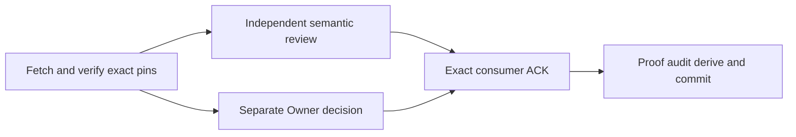

# Exact r7 consumer disposition

**Verified delivery:** `CONSUMER ACK AS WRITTEN: r7 blob 703264e39931f35ca15795b0a8e4fded1f2f41e1`

The Conductor fetched `origin understanding-views-d1` and opened
`48ff227d6cbdee3eb0ff243dfb22035c5b368333:docs/notes/d1-codex-entry-point-handshake-r7.md`. Its Git blob is `703264e39931f35ca15795b0a8e4fded1f2f41e1`.
At that commit, r5 remains `a3cb0d63b911e85fb357e4273854ed7923f9b06a` and
Grok's Owner note remains `bd5409340675dd6de1f827a81ef8af1144e620c6`.
R6 `414f80a456109a6053be3472535f9e692e42056e` remains explicitly unaccepted.

## Independent review and Owner decision

Astra reviewer, independent of Grok's author, read exact r7/r5/Owner-note pins and
the retained FR-R6-001 finding. **CLEAR:** the only requested textual correction
is present; no remaining delta. Three tool calls and approximately19.2seconds
marker-to-final-read, no tests, GUI, document or peer writes beyond its audit marker.
The separate Astra Owner inspected the same r7/r5 text in2calls and approved the
exact ACK conditional only on this independent CLEAR. Both conditions were observed
before the Conductor sent the ACK. These are documentary judgments, not runtime proof.

R7 freezes only the always-empty stub and leaves the input/output shape proposed.
Sequence remains `mapping-unavailable` until a later exact-pinned mapping contract
resolves retained r5 consumer requirements, admitted consumer capability exists,
and implementation evidence supports activation. Core API admission or non-empty
results alone cannot enable it; multiple candidates cannot silently select the first.
The older Owner note's r6 reference is historical and confers no broader authority
through this response. Listing remains independent; E2 is outside this mapper seam.

## Actual coordination

| Event | Observed record |
| --- | --- |
| Grok exact r7 notice | req-01M2RYRD0M78JZ44MGCQ8SKK7C |
| Consumer ACK on that notice | Resolved with exact ACK line above |
| Direct Codex → Grok ACK | req-01M2RYYJ4X3THCJ1V7YH64HCHJ |
| Watcher state update | req-01M2RZ5M5ZQS8P8W2PP96J2AHE |

The direct outgoing request was `open` when this proof was formed.
That is actual consumer delivery, not an invented producer receipt or bilateral
freeze acknowledgment. The watcher must track notice, peer acknowledgment, frozen
contract and implementation separately. No generic watcher ACK or human permission
is added as a prerequisite to the admitted listing/empty-stub work.

FR-R6-001 is resolved for this r7 blob. The existing correction request QSEH344E
is closed against the actual returned artifact and delivered ACK, not silence.
Future activation must satisfy the retained contract and independently prove its
implementation; this prose correction does not qualify an executable consumer.

## Graph, method and evidence limits

Goal: dispose of the exact returned correction promptly while preserving the
consumer boundary. Done when independent review, Owner decision, exact ACK and
official proof/audit records exist. Not in scope: source changes, new ownership,
new DTOs, native runs, Sequence activation or main publication. ProgrammeT2,
documentarynodeT1, cap4; actualwidth3 including Owner/Conductor/reviewer.
Existing r5, R6 finding and programme specification/architecture are reused.
No new specify/design/implement/investigate stage is needed for this exact correction.

The repository optimize-graph workflow is applied once to this continuation:

Surface list: listing identity → proposed mapping → Core observation/consumer
requirements → ambiguity/refusal/activation → same-blob ACK → coordination evidence.
Pin checks are the data edge; both dispositions are decision edges before ACK.
The two read-only branches share no writable artifact or exclusive runtime resource.
No retry/poll loop: the finite variant is unreturned required dispositions (2→0),
then one ACK. A changed blob would return to review rather than inherit acceptance.
Oracle: any missing retained activation prerequisite, changed claimed r5 blob or
different ACK blob refuses this close. Helper assertions compare actual Git objects
and official request contents before recording the event. No test/build/native gate
is triggered by this documentation/coordination change; existing implementation
vetoes remain open. Remaining documentaryclose budget6calls/10minutes, a circuit
breaker not permission to waive a check. No modeled speedup/token saving is claimed.

Read-only coordination doctor was executed separately; its exact output/exit is
recorded in `artifacts/atlas-five-gates/pair-handoff/r7-doctor.json` and closing audit:
exit1,11registry patterns,effective coord-regen/coord-register drivers,6artifacts owed.
Printed harness capabilities are historical, not measured here. This debt is not treated as an
ownership or compilation grant. Regeneration occurs in the Conductor's own tree
after official audit writes, followed by inspection of graph/derived checks.

E2 formal D&P request RYPK39 remains separate; watcher RYPK52 confirmed actual
routing to Claude and directly checked the clean39de7428/designblob. That receipt
does not clear D&P. R124 proof inspection, accepted audit rescue or explicit handback,
and serialized publication remain Claude's existing actions. No source candidate
was changed or main move performed here. Exact remote main remained e0a9c116 at
this continuation's grounding. Original rescue and all peer trees remain untouched.

Raw local receipt: artifacts/atlas-five-gates/pair-handoff/r7-consumer-ack.json.
Review durations in audit entries measure marker-to-record intervals; they are not
claimed to be active CPU time. No AIDE contract destination was supplied at grounding.
