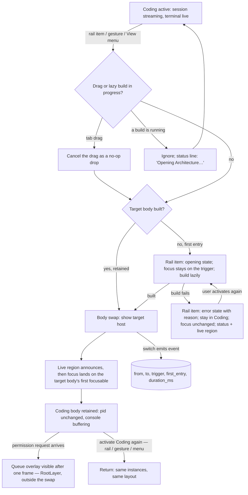
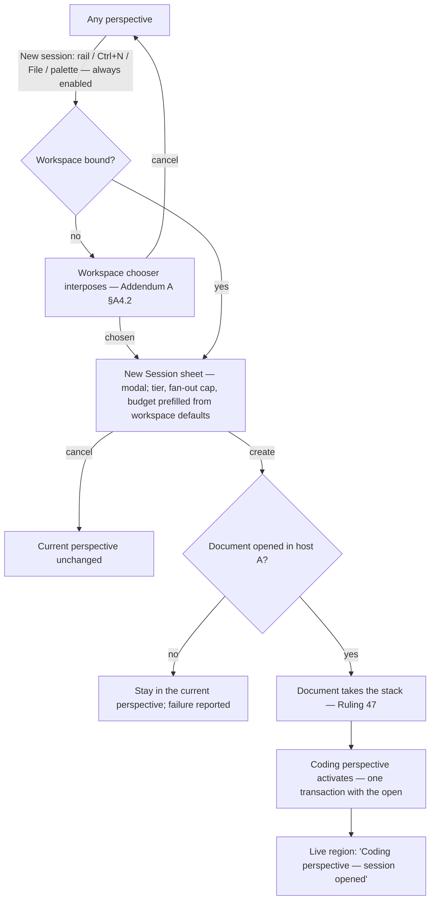
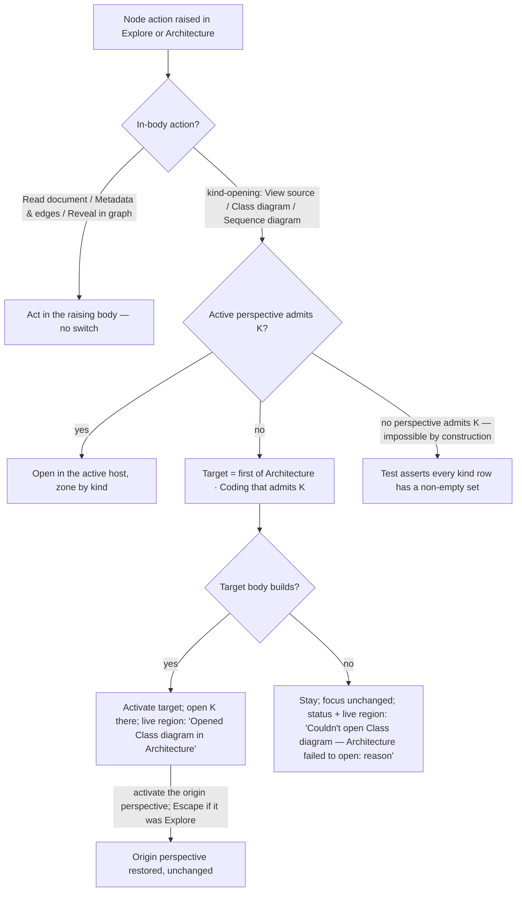
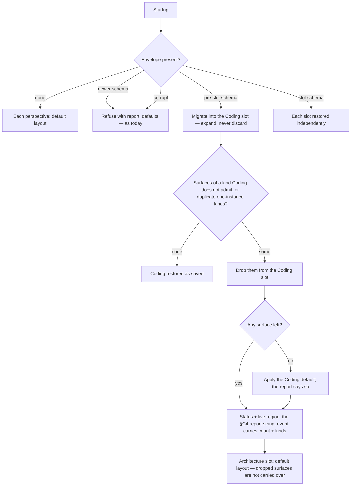
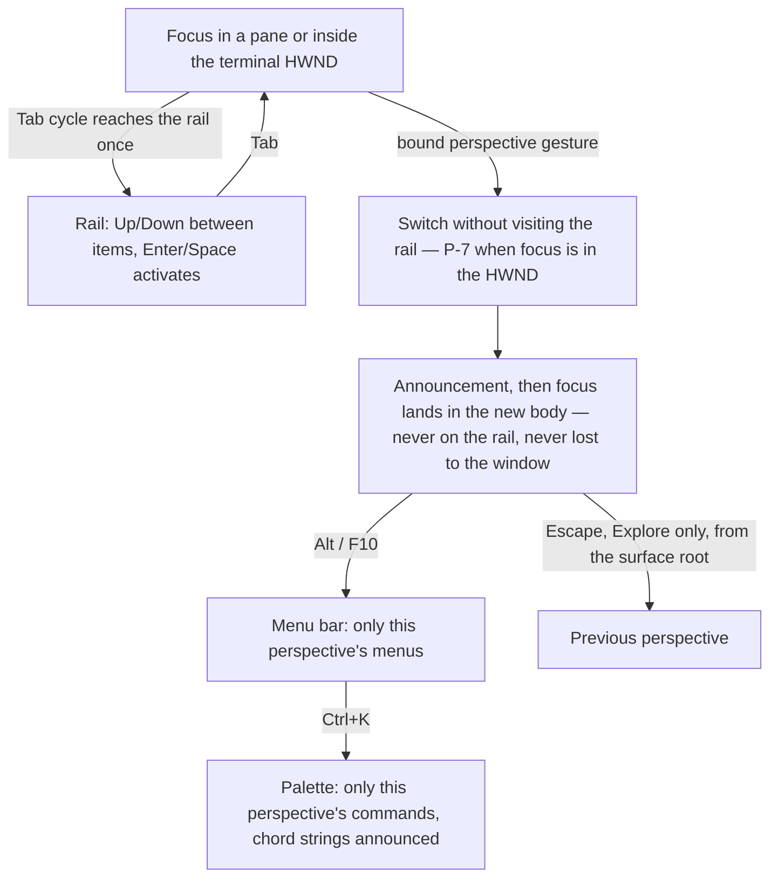

# Spec: Addendum C — Perspectives

- **Status:** In review (adversarial gate recorded at the end).
- **Tier (cost-of-error):** T2 — it reshapes the shell every other surface lives in; a wrong page
  one invalidates D1 (`/ui-design`), A1 (`/define-architecture`) and P1 (`/prepare-for-coordination`).
- **Author / date:** node S1 of `plan-addendum-c-modes`, session `addendum-c-chain`, 2026-09-11.
- **Authority:** normative for the perspective set, the rail, the allow-lists, the derived menu, the
  default layouts, the persistence slots, the Coding composer's target experience (§A8 US-C13) and
  the contrast NFR (§A9, §C7). **Addendum A's and B's text is not amended** (Ruling 51; the errata
  policy `note-conductor-spec-errata-policy`); where this document supersedes a clause of theirs it
  says so on page one with the clause quoted by line, attributed to the operator's own words; where
  it would merely conflict with an existing spec, the conflict is listed in §R as a finding for the
  Owner and the existing text stands until ruled. Reading order stays as `spec-conductor` states it.
- **Operator intent this serves:** the operator's instruction of 2026-09-11 17:17Z. **Two records
  exist and they differ:** the operator's own committed entry `al-01M28QJMWGJT5AK438M37KJ9ZT` is a
  664-character **paraphrase** (read on `main` **[Verified]** — it names the four use cases and the
  workflow, and carries none of the quoted phrases below); the **full text** was relayed verbatim by
  the conductor in S1's brief and is logged as `al-01M28W210Q8QGKK38QEQ0WR1EB` (session
  `addendum-c-chain`) so that every quotation in this document resolves to a committed record
  **[Verified — relayed text, logged; not the operator's own keystrokes]**. The Product Strategist
  caught the first draft labelling the phrases as verified against the paraphrase. The four use cases,
  in the operator's words from that record:
  > **Use Case 1: Agentic Coding** — "the primary model is the session construct we are working on
  > now; the secondary model is CLI instances in the tool (terminal); the third model is a hybrid …
  > The 80% case and where most of our calories must be spent is the primary model, which has to be
  > a seamless, joyful and extremely productive experience."
  > **Use Case 2: Knowledge Exploration and Visualization** — "open the graph and be able to search
  > or navigate in the graph; for any given node you should have the appropriate viewing surface …
  > The explorer should be the way you walk the graph to learn about knowledge, not how you think
  > of architecture."
  > **Use Case 3: Code and Architecture understanding** — "(1) a solution/tree view … (2) a graph
  > view … broad-based understanding that narrows to the specific: (1) the Domain Entities; (2) the
  > Entry Points … (3) the entire class diagram or data model (ERM or Entity Model) — this has to
  > scale, the current class diagram doesn't scale well; (4) the data flow from an entry point; (5)
  > the sequence diagram from a given entry point or a method; (6) the conceptual architecture:
  > layer and component diagrams derived from the code and from things like bicep."
  > **Use Case 4: Test coverage** — "not broached as yet; later."
  > "the side tool bar … should have icons for all of these use cases, and then we use the same
  > docking architecture BUT the things that can be viewed, docked are intrinsic to the context of
  > the use case — e.g. no sequence diagram in the agentic coding use case. The top menu bar options
  > should be contextually aligned to which use case the main window is in."

  Every "(n)" key used for UC3 in this document indexes that list. Two further operator entries bind the Coding perspective:
  `al-01M28T8C2WEVN4J0D10XQJMJAZ` (18:04Z — the composer verdicts) and
  `al-01M28TDX0G5RGHXKY5QTTFQMPH` (18:07Z — contrast), both read verbatim from the conductor's
  audit log **[Verified]**; they land on `main` with the conductor's branch.
- **Confidence labels:** every load-bearing claim carries **[Verified]** (file opened, tool run, or
  source fetched), **[Inferred]** (reasoned from evidence, not observed) or **[Flagged]** (unknown).
  A ruling number is a citation to `note-addendum-c-council-rulings` unless another note is named.
  Source citations are to this branch at `5d8d51e3` (level with `main`).

## Page one — vocabulary, the facts a spec written without them gets wrong, and the supersessions

### Vocabulary (Ruling 50)

Three words already carry three meanings in this repository. This table fixes them. **The bare word
"mode" is not used for the perspective concept anywhere in this document's normative text**; it
appears only inside the two qualified terms below and inside verbatim code or title citations.

| Term | Meaning | Scope | Where it is defined | Fate under Addendum C |
| --- | --- | --- | --- | --- |
| **Perspective** | The **use case the whole tool is in**: a task-scoped set of admitted surface kinds, a body, a derived menu contribution, a default layout and a persistence slot, selected from the activity rail. Exactly one is active. Set: **Coding · Explore · Architecture**; **Tests** is a reserved name with no row and no rail item (Ruling 54, AR3). | The shell | **This addendum** | Introduced. Realised as a *primary view mode* (row 3) — Ruling 52. |
| **Canvas mode** | One presentation of a **session document's output canvas**: **Console · Artifacts · Profiler · Board · Terminal** — five rows, per canvas, switchable instantly, splittable. | One session document | Addendum A §A6.1 (`ai-de-spec-addendum-a-session-experience.html:172-185`), R16 (`:238-244`); `CanvasModeCatalog.cs:21,46` **[Verified]** | **Unchanged.** Lives inside the session document, which lives inside the Coding perspective. Never appears on the rail. |
| **Primary view mode** | The shell's body-content swap: the body region the docking host occupies is presented as the projection of one value from a small closed set; the rail selects it; the non-active content is retained, never rebuilt. | The shell's body | ADR-0017 (`0017-primary-view-mode.md:79-98`); `ShellModeController.cs:6-11` **[Verified]** | **Retained and amended** (Ruling 52): the closed set becomes the perspective set; a body may be a docking host of its own. `ShellViewMode` is renamed only in the commit that implements Ruling 52 (Ruling 50). |

### The four page-one facts (Ruling 55)

- **(a) Five canvas modes, and "hybrid" is one of them.** Addendum A §A6.1 defines **five** canvas
  modes, Terminal included (`ai-de-spec-addendum-a-session-experience.html:174,183` **[Verified]**).
  The operator's third coding model — "some work in the session experience, some in CLI" — **is the
  Terminal canvas row**: observed lanes' live terminals for this session, embedded. It is not a new
  thing this addendum introduces. The row's id survives and the row re-registers when observed-lane
  binding exists (Ruling 45, `note-front-door-rulings-45-48`; `CanvasModeCatalog.cs:46-57`
  **[Verified]**).
- **(b) The per-perspective menu is derived, never a second hand-written list.** The menu bar's
  contribution is a function of the active perspective and the kinds it admits, in the way the
  Terminal menu's agent entries are already derived from `AgentReadinessProfiles`
  (`MainMenuBuilder.cs:89-96` **[Verified]** — the comment there says why a second list is wrong).
  Any table in this document that shows a menu is an **expected result the tests assert**, not a
  source anything reads. §B3 and §C3.
- **(c) "New session" is visible in every perspective and switches to Coding.** The rail's one
  primary action (AR2, `MainWindow.xaml:70-85` **[Verified]**) and `File → New Session` run the same
  catalog command (AR5). Creating a session from Explore or Architecture opens the document in the
  Coding host and activates Coding as one transaction. US-C5.
- **(d) The Coding default layout drops the "Explore" pane and resolves the Domain/Provenance
  duplication.** Today's default (`ZoneLayout.cs:132-153` **[Verified]**) mixes all three use cases in
  one host and carries two byte-identical Evidence panes plus a "Domain" tab wired to the wrong kind
  (`SurfaceContentFactory.cs:70-106` **[Verified]**). The Coding perspective's default layout is
  specified in §B4 with none of them; the owed *"two kinds render different content"* test lands in
  the same slice (US-C6). Contingent on INV-0006's zone/tree repair having merged (Ruling 55
  CONDITIONS) — the Coding default-layout node blocks on it and says so.

### A fifth fact the gate added: chords are announced, not bound

The catalog's `Ctrl+K, X` gestures are **strings the palette and the menu announce; none is bound as
a keystroke** — `KeyGestures.For` binds exactly four single-stroke gestures (Ctrl+PageDown,
Ctrl+PageUp, Ctrl+W, Ctrl+N) and yields nothing for a chord (`WorkbenchController.cs:778-806`
**[Verified]**); `Ctrl+K` alone opens the palette. Any copy in this addendum that instructs a
keystroke therefore names only a **bound** gesture, and every such string is derived from the binding
(US-C10). The four colliding chord strings (§A8 US-C10) are a discoverability defect in what is
announced, not a live keystroke conflict. **Until a chord handler exists, an unbound chord string is
shown and spoken nowhere** — not in the menu, not in a tooltip, and not by the palette (which today
speaks *"{Title}. {Gesture}."* for every row, `CommandPalette.cs:113-122,146` per the UX &
Accessibility reviewer **[Verified — reviewer-read]**); the string stays in the catalog row as data
(the uniqueness test still reads it), and the palette's role for an unbound command is to *run* it,
not to promise a key.

### Supersessions — the operator's composer verdicts (al-01M28T8C2WEVN4J0D10XQJMJAZ)

The operator used the composer during F5's gesture and gave three verdicts, in their own words
**[Verified — read from the conductor's audit log]**: *(1) "I could not see the entry areas"*;
*(2) "there are mandatory fields that should not be mandatory and should be options in settings, not
explicitly the template: budget, cap etc. are not intrinsic to the prompt, they are intrinsic to the
session settings"*; *(3) "the UX is super chunky — it does not feel like a chat conversation, and the
whole enter-in-text-boxes-and-see-the-render-below is awful from a UI/UX perspective."* Also observed:
*"Send refused with 'no write scope could be derived from this draft'."* These are the user's
decision, not a proposal. Where they contest a clause of Addendum A or B, the clause is **superseded
here, quoted by line** (the errata policy's form — the HTML stays byte-intact), and each row is
listed for the conductor so the Owner can **file it as a numbered ruling** (the Owner allocates the
number at filing — this document cites none until one exists, which is what
`verify-ruling-citations.py` enforces); the filing is a formality, the decision is made. Nothing else in A or B is touched.

| # | Superseded clause (verbatim, with its line) | What supersedes it | Proposed ruling (to file) |
| --- | --- | --- | --- |
| S-1 | Addendum A `:234` (R15 b2): *"a T2 goal block missing a CT19 field cannot send (field-level error)."* — as it applies to **fan-out cap, budget and tier** | Fan-out cap and budget are **session settings with defaults** (set in the New Session sheet and editable in session settings), never mandatory per-prompt fields; a goal block **inherits** them. **Tier is NOT a session setting** — the operator answered directly (Ruling 63, filed over Ruling 56's tier clause): *"tier [should] be decided by the compilation of the prompt … post-process it [to] decorate it with things like tier."* The compile step's design is open and the operator's; until it is specified, the fan-out value in session settings is a **ceiling** and the effective cap is the compiled tier's cap within it (CT19: 0 at T0, 2 at T1, the GO7 cap at T2) **[Inferred — the conductor's reconciliation, not the operator's word]**. No per-prompt override: the settings are *"intrinsic to the session settings"* (verdict 2), and a second place to set one quantity is derive-don't-store's defect (the Simplifier's finding). The gate on **goal / done-when / not-in-scope** stands (all three refused inline — NB-1 superseded B `:176`'s *warn*), but those are **derived and prefilled** from the conversation and confirmed by the send itself (US-C13), not typed into mandatory boxes. | **Ruling 56** (PR-A filed) — session-level settings |
| S-2 | Addendum B `:135` (B4 goal-block row): fields *"goal, done_when, not_in_scope, tier, fan_out_cap, budget"* | The template's *content* fields are goal, done_when, not_in_scope; **tier, fan_out_cap, budget move to the session's settings** and the compiled prompt carries the session's values (so the conductor receives the same CT19 block, sourced differently). | Ruling 56 |
| S-3 | Addendum B `:183` (B6): *"Template form rendering: typed fields from frontmatter … required markers, hints inline, mention chips work inside fields, validation gates send with field-level errors — the CT19 gating from A5/R15 is now the general case, since goal-block is a template."* | The composer's primary surface is a **conversation** — one prompt editor; a template's structure is rendered **as derived, prefilled structure inline** (a collapsible outline the operator confirms or edits), not a form of boxes above a render. Field-level validation survives as inline marks on that outline. | **Ruling 57** (PR-B filed) — the composer is a conversation |
| S-4 | Addendum B `:209` (R18 b4): *"Goal-block is re-based as template goal-block with zero behavior change to A5/R15 gating (regression-tested)."* | "Zero behavior change" no longer holds for the three session-setting fields (S-1/S-2); the regression tests re-scope to the content fields. | Ruling 56 |
| S-5 | Addendum B `:216` (R19 b2): *"Template picker renders any catalog template as a validated form; a required-field gap blocks send with a field-level error; view-compiled shows the exact outgoing text."* | "As a validated form" → as the inline derived structure of S-3; "required-field gap blocks send" stands for content fields only; "view-compiled shows the exact outgoing text" **stands**. | Ruling 57 |
| S-6 *(reaffirmed, not superseded)* | Addendum B `:184`: *"View compiled toggle shows exactly the text the conductor will receive. No hidden prompt assembly."* | **Kept as written** — a *toggle* is on demand. The as-built composer renders the compiled prompt **permanently** in a plain `TextBox` below the fields (`ComposerSurface.cs:25-27,77-107` **[Verified]**), which is what the operator saw; verdict (3) restores B:184's own words: compiled text **on demand** (collapsed by default; a preview — no diff, no summary, per §C4), never a permanently rendered block. | — (no ruling needed; a finding for the composer slice) |
| S-8 *[Inferred — an extension of verdict (3) to the conductor's round-trips, not the operator's words]* | Addendum B `:187` (B6): *"Conductor round-trips: the conductor may answer a free-form message with a drafted template (a filled change-order, a goal block) — it arrives as a reviewable form in the composer, exactly like an assist result."* | "As a reviewable form" → as the **inline derived structure** of S-3 laid over the reply's text in the composer; reviewable, editable, sent by the operator's explicit act. The rest of the clause (the ruling-request template auto-applied to Owner convenings) stands. | Ruling 57 |
| S-9 *(kept intact)* | Addendum B `:181` (B6): *"Shape control in the composer header: Free-form \| Template picker (searchable, grouped by intent, recents first). Per block; switching shapes preserves content …"* | **Not superseded.** The shape control stays in the composer header; choosing a template renders its fields as the inline derived structure (S-3), never as a form of boxes. The twelve built-in templates (B4) remain reachable from it. | — |
| S-7 *(kept intact)* | Ruling 42 (`note-front-door-rulings-41-42` §Ruling 42): the lease is **derived** from the goal block's mentions and never operator-typed; `LeaseDerivation.Patterns` derives from `@mentions` in the compiled text (`LeaseDerivation.cs:49-50` **[Verified]**) | **Not superseded.** The UX change is *how the mention is elicited and explained*: the refusal at `ComposerSurface.cs:289-292` **[Verified]** says a write scope could not be derived but not that **only an `@path` mention derives one** — US-C13 requires the message to say so and to offer the mention picker. Who computes the glob is unchanged. | — |

**Findings from the same entry, not specified here:** verdict (1) is a layout defect — the fields
squeezed into a ~200 px scroll region above a compiled `TextBox` that grows without bound — under
investigation on `investigate/composer-input`; this addendum cites it (§R row 19) and does not spec
the fix.

### Use case → perspective

| Use case (operator's words) | Perspective | Body | Build order (Ruling 54) |
| --- | --- | --- | --- |
| UC1 Agentic Coding — session primary; CLI secondary; hybrid third | **Coding** | today's docking host, unchanged in mechanism | 1st (layout + default), then the mechanism (2nd); the composer conversation (US-C13) is its own item now that Rulings 56/57 are filed |
| UC2 Knowledge Exploration and Visualization — "walk the graph to learn about knowledge, not how you think of architecture" | **Explore** | the full-window `ExplorerSurface` (graph + reader), unchanged | 3rd — unchanged |
| UC3 Code and Architecture Understanding — broad to specific: domain entities, entry points, class/ER model, data flow, sequence, conceptual layers | **Architecture** | a second allow-listed docking host | 4th — existing surfaces only; four views named-and-deferred (§A5) |
| UC4 Test Coverage — "not broached as yet; later" | *(Tests — reserved)* | none | **non-goal**; no rail item |

---

## Part A — Functional specification

*Owner: Product Strategist (peer). Governing model: ISO/IEC/IEEE 29148 + user stories with Gherkin
acceptance criteria; ISO 25010 NFRs; the conceptual domain model (DM1/DM4).*

### A1. Problem (solution-independent)

The workbench mixes three different jobs in one docking host. The default layout opens a knowledge
graph, an architecture diagram, two evidence lists, a terminal-session watcher, three fleet views, two
context/join surfaces and a terminal side by side (`ZoneLayout.cs:132-153` **[Verified]**). The
operator's report — *"the experience is very cluttered (rapidly) because it is mixing use cases in a
common set of docks"* — is the symptom. The cause is that **nothing in the shell knows which job the
operator is doing**, so nothing can constrain what is offered: every kind is openable everywhere
(`WorkbenchCommandCatalog.All` has no scoping field — `WorkbenchCommands.cs:24-30` **[Verified]** —
and the palette lists the whole catalog, `CommandPalette.cs:150-153` per the inventory
**[Verified]**), every command sits in one static menu (`MainMenuBuilder.cs:69-99` **[Verified]**),
and the rail has exactly one destination.

Inside the 80% case the same shape repeats one level down: the composer presents the goal block as a
**form** — every CT19 field a box, three of them session-level settings — above a **permanently
rendered** compiled prompt, and refuses a send with a message that does not say what would have made
it succeed. The operator's verdicts (page one) are the symptom; the cause is that the composer was
built as a template *form engine* where the job is a *conversation*.

The operator needs the tool to be **in one use case at a time**, with the surfaces, the menu and the
default arrangement fitted to that use case, and with the 80% case — agentic coding in the session
construct — *"seamless, joyful and extremely productive"*, which it cannot be while it shares its
docks with diagrams and evidence lists it never uses, or while its composer is a form.

### A2. Target users and jobs-to-be-done

One primary persona, the **operator** (the requesting technical lead, single person, often one
screen — inherited from `spec-knowledge-explorer-mode` §A and `spec-ai-native-ide` §Personas), doing
three distinct jobs on the same repository, serially, many times a day:

- **J1 — Drive agentic coding** (UC1, the 80% case): start a session, **talk to it** — compose as in
  a chat, with the goal block's structure appearing from what was written rather than demanded
  before it — watch the merged console, dispatch to a terminal, look at what the agent changed.
  *Success:* no surface that is not about this session or its terminals competes for the window;
  nothing that is a session setting is asked per prompt.
- **J2 — Learn what the repository knows** (UC2): open the graph, search or walk, read the artifact
  behind any node in its natural form. *Success:* the graph and the reader have the whole body.
- **J3 — Understand the code and its architecture, broad to specific** (UC3): from domain entities
  and entry points down to a class model, a data flow, a sequence; a conceptual layer view. *Success:*
  the structural views are all in one place and none of them is a terminal.

Evidence: the operator's own prompts (the three audit entries above) **[Verified — user input]**;
the rail's history (`MainWindow.xaml:108-119`, AR3 **[Verified]**) shows the *last*
multi-destination rail was pruned because its destinations were never built — so J1–J3 are admitted
here only where a body exists today (Ruling 54).

### A3. Core scenario

The operator opens AI-DE. The rail shows **New session** above three destinations — **Coding**,
**Explore**, **Architecture** — with Coding active. The body is the Coding host: an empty Center
inviting a session, the terminal-session watcher at left, a terminal below. They press **Ctrl+N**;
the sheet opens with the session's tier, fan-out cap and budget already at the workspace defaults;
they accept. The session document lands in the Center and takes the stack (Ruling 47). They **write
as in a chat**: *"Refactor the layout store's migration chain so a newer schema is refused with a
report; touch only @src/AiDe.Core/Workbench/."* The composer shows, inline beneath the text, the
goal block it derived — *Goal · Done when · Not in scope* — prefilled from the sentence, one click
to edit; the lease line reads *"Write scope: src/AiDe.Core/Workbench/** (from your mention)"*. They
send. The Console canvas mode streams. Mid-run they want to check a call chain: they activate the
Architecture rail item (or its bound gesture). The body swaps to the Architecture host — a
kind-filtered graph and the class model in the Center, Contexts and Joins beside them, Evidence and
Provenance at the sides — and its **View** menu now lists *New sequence diagram*; the **Terminal**
menu is gone. They open a sequence diagram from a member, read it, and activate the Coding rail item.
The session document is exactly where they left it; the terminal never stopped; the console kept
streaming; a permission request that arrived while they were in Architecture had already raised the
queue overlay. Later they activate Explore, walk two knowledge edges in the reader, and press Escape
to return to Coding.

### A4. In scope

- **The Perspective concept**, its closed set (Coding · Explore · Architecture), and the rule that
  exactly one is active. (Rulings 50, 52)
- **The rail** as the perspective selector, keeping AR1–AR3 and AR5. (Ruling 55c)
- **Per perspective:** the **allow-list** over the existing `SurfaceContentFactory.Kinds` rows
  (§A7, every kind named), the **derived menu contribution** (§B3), the **default layout** (§B4),
  the **persistence slot** and its migration rule (US-C9). (Rulings 52, 55)
- **The Coding perspective** = today's host with a new default layout, **and the composer's target
  experience as a conversation** (US-C13; page-one supersessions). (Rulings 54, 55d; operator entry
  `al-01M28T8C2WEVN4J0D10XQJMJAZ`)
- **The Explore perspective** = the full-window `ExplorerSurface`, unchanged in capability. (Ruling 52d, 53)
- **The Architecture perspective** = a second allow-listed docking host holding only surfaces that
  exist today: `classdiagram`, `sequence`, `contexts`, `joins`, the kind-filtered `canvas`, the
  Evidence pair, and `codeviewer` (so "View source" from an Architecture node stays in the reading
  host); plus the class-diagram scaling fix routed to US-U7 / US-K10–K11 on the substrate.
  (Rulings 53, 54; the Simplifier cut `search` — an unwired scaffold — and `diagnostics` from this
  set)
- **Command scoping** for the menu and the palette (the seam the inventory found missing, finding 8).
- **Keyboard:** bound single-stroke gestures for the three perspective commands; the uniqueness
  requirement over every announced gesture string (four collide today — US-C10); focus order and
  announcements on switch; the rule that copy never instructs an unbound keystroke.
- **Contrast (every perspective, every surface):** the token-only ink/ground NFR proven by a runtime
  census (§A9, §C7; operator entry `al-01M28TDX0G5RGHXKY5QTTFQMPH`).
- **Testability seams the stories require** (named in §A8 where a criterion needs one): the
  perspective set as a model the shell projects, constructible without `MainWindow`; a test-time row
  for the kinds list; a selection source for the Evidence pair. The *how* is `/design-slice`'s.

### A5. Out of scope — explicit non-goals

1. **Use Case 4 (Test Coverage).** No perspective, no rail item, no reserved layout beyond the
   reserved name "Tests". A rail item with nothing behind it is the defect AR3 removed (Ruling 54).
2. **Four understanding views, named and deferred** (Ruling 54) — each specified here only by the
   acceptance criterion that admits it later, so that "later" has a definition:
   - **D-1 Entry-points view.** *Admitted when:* Given an indexed workspace, When the view opens,
     Then every API surface, UX surface and CLI entry point in the index is listed as a node with its
     kind, And selecting one scopes the Architecture graph to the neighbourhood reachable from it,
     And an entry point the index could not classify is listed under "unclassified", never omitted
     silently.
   - **D-2 Data flow from an entry point.** *Admitted when:* Given a selected entry point, When the
     data-flow view renders, Then each read and write that crosses a bounded-context or persistence
     boundary is an edge with provenance (`EXTRACTED`/`INFERRED`), And an unresolvable step renders
     as a labelled gap, never as a verified edge.
   - **D-3 ER diagram (crow's-foot).** *Admitted when:* `spec-uml-erm-surfaces` US-U3 holds against
     a fixture schema (cardinality correct, keys shown, every M:N has an associative entity).
   - **D-4 Layer and component diagrams derived from code and from bicep.** *Admitted when:*
     `spec-uml-erm-surfaces` US-U1 holds at container and component level, And an infrastructure
     resource declared in a `.bicep` file appears as a container with its declaring file as
     provenance, And a code→infrastructure edge static analysis cannot resolve is marked inferred.
   - Also absent today and deferred the same way — **D-0 Solution/tree view** (UC3 model 1: "a
     solution/tree view of the code, data, architecture artifacts"). No tree type exists
     (`SolutionTree`/`WorkspaceTree` absent from `src/AiDe.App`, Ruling 54 BECAUSE **[Verified]**).
     *Admitted when:* Given a workspace, When the tree opens, Then code, data and architecture
     artifacts are listed by project and folder with a kind glyph, And activating an item reveals it
     in the Architecture graph or opens its source, And a folder the index has not covered is shown
     with an "unindexed" state. Ruling 54 named four; this fifth is a **finding for the Owner** (§R).
   Each deferred view is admitted to the **Architecture** allow-list, and to its derived menu, only in
   the slice that builds it (AR3) — never scaffolded ahead.
   - **D-5 The structure deriver** (US-C13's *derived and prefilled* lines). *Admitted when:* Given
     the fixture prose of US-C13 b2 and a fake deriver returning three known strings, the three lines
     carry those strings and the *derived* mark; Given no deriver, the lines are empty and editable;
     **And** an eval harness scores the real deriver on a fixture corpus (derived vs edited vs
     emptied per send, instrumented from the first slice) before it ships behind the seam. Until
     then the composer is a conversation with empty, editable lines.
   - **D-6 Conductor round-trips as derived structure** (S-8, US-C13 b8). *Admitted when:* a
     reply-channel seam exists and a fixture reply carrying a drafted `goal-block` template renders
     as derived lines with no form widget. Until then round-trips arrive as Addendum B `:187` says.
3. **No in-surface "knowledge / architecture" toggle** and no second graph store: one substrate,
   two surfaces (Ruling 53).
4. **No rename** of *canvas mode* or of `ShellViewMode` by this spec (Ruling 50); no amendment of
   Addendum A's or B's text (Ruling 51; page-one supersessions are quoted, not edited); no change to
   F5's exit evidence (Ruling 51).
5. **No new graph capability in Explore** (`spec-knowledge-explorer-mode` non-goal 1 stands) —
   including **no on-disk Explore store**: no split-ratio or last-node persistence exists today
   (grep of `ExplorerSurface.cs`, `LayoutPersistence.cs`, `ZoneLayoutStore.cs` for
   `SplitRatio`/`LastNode` — empty **[Verified]**); ADR-0017 names it as an amendment and this
   addendum *reserves* the slot (US-C9) without building the store.
6. **Not multi-window / tear-off** (inherits `spec-knowledge-explorer-mode` non-goal 3).
7. **Not a redesign of zones, docking, or session documents.** Zones (`spec-named-dock-zones`) and
   the session document (Addendum A §A4.4) are unchanged; a perspective is a constraint layered on
   a host, not a replacement of it.
8. **Not the second-host command-set question** (one `WorkbenchController` or two) — the Owner
   carried it to A1 (`note-addendum-c-council-rulings` §Residual).
9. **Not a chord-prefix (`Ctrl+K, X`) key handler.** Whether the shell ever binds chords is a
   separate decision (§R); this addendum only forbids copy that pretends they are bound.
10. **Not the composer's layout fix** (verdict 1 — `investigate/composer-input`) and **not the
    contrast census gate itself** (`investigate/contrast-census`): both are cited as findings and
    named as acceptance tests; neither is designed here. **Not a change to who computes the lease**
    (Ruling 42 intact).

### A6. Conceptual domain model

**Bounded context:** *Shell presentation* — the application layer that decides what fills the window.
It introduces **no domain aggregate** in the repository's evidence model (`conceptual-model-ai-native-ide`
is untouched); it introduces one presentation aggregate and its language. Written in domain terms —
no keys, no types, no tables.

**Ubiquitous language**

| Term | Definition | Kind |
| --- | --- | --- |
| **Perspective** | The use case the tool is in. Has an identity (its name), a **body**, an **allow-list**, a **menu contribution**, a **default layout**, a **slot**. | Entity |
| **Rail** | The activity rail: the one primary action (New session) above the perspective destinations. Holds destinations, never verbs (AR1/AR2). | Value object (a projection of the perspective set) |
| **Body** | What fills the body region while a perspective is active: a **docking host** (Coding, Architecture) or a **full-window surface** (Explore). | Value object |
| **Surface kind** | One row of `SurfaceContentFactory.Kinds` — a named thing the factory can build. Existing language; not redefined. | Entity (identity: the kind string) |
| **Allow-list** | The set of surface kinds a perspective admits into its body. Declared **as an explicit column on the existing descriptor rows** (Ruling 52c) — an explicit set per row, **no default value** — never a parallel list. | Value object |
| **Menu contribution** | The menu and palette entries derived from the active perspective's allow-list and body, joined with the perspective-independent entries. | Value object (derived) |
| **Default layout** | The arrangement a perspective's host shows when its slot is empty. | Value object |
| **Slot** | The persisted arrangement of one perspective, in the layout envelope. One per perspective. | Value object |
| **Entry verb** | A command that starts work — `session.new`, `terminal.new`, and the derived "New `<Harness>` session" rows — visible in every perspective under File and routed to Coding. | Value object |
| **Previous perspective** | One slot holding the perspective that was active before the current one; initialised to Coding at start. Read by Escape-from-Explore and by the return from a drill-to-node; nothing else. | Value object |
| **Session settings** | The session-scoped values Addendum A §A3 already names (backends, routing, autonomy, policy) **plus the fan-out ceiling and budget** (S-1/S-2, Ruling 56 as amended by Ruling 63) — set at the sheet from workspace defaults, editable for the session, inherited by every goal block. **Tier is not a session setting**: it is a decoration the **compile step** attaches to the compiled prompt (Ruling 63); how it is derived is **open until the compile step is specified** — the operator is specifying it. | Value object on the Session (Addendum A's aggregate) |
| **Derived structure** | The goal block's *Goal · Done when · Not in scope* as the composer derives and prefills them from the conversation text, shown inline for confirmation or edit. | Value object |
| **Canvas mode**, **Primary view mode** | As on page one. | existing |

**Aggregates and the one invariant each protects**

- **Perspective Set** (root: the shell's *active perspective*). **Invariant: exactly one perspective
  is active at any instant, and the body region shows exactly that perspective's body; every other
  perspective's body is retained, never rebuilt.** (ADR-0017's invariant, generalised — Ruling 52.)
- **Perspective Layout** (root: a perspective's *layout* — the arrangement in its host). **Invariant:
  every surface in a perspective's host is of a kind that perspective admits** — enforced at open, at restore, and at every layout
  mutation. A surface of an inadmissible kind never enters the host; one found in a restored
  envelope is dropped and reported (Ruling 52).
- *(unchanged, cited)* **Session** (Addendum A §A3): its invariant that a run's lease is derived from
  the goal block's mentions and never typed (Rulings 19, 42) is untouched by S-1…S-7.

**Realised as (a note, not the model):** the aggregates name invariants, not classes. In code they
are the existing `ShellViewMode` gaining a third value with `ShellModeController` keeping its shape
(79 lines today), the allow-list as one field on the existing `SurfaceKind` row, and the layout
service enforcing it — `/design-slice` must not reify two aggregate classes out of this section (the
Simplifier's finding). The code names in this section's table are citations of what exists, not
types the model prescribes.

**AI-integrated allocation:** the perspective mechanism uses no model. The composer's **derived
structure** may use the assist provider Addendum B §B5 already configures (R21) — an *Advisory*
tier: a derivation the operator confirms, never a gate that sends on its own. **No derivation of
any kind exists today** — grep of `src/AiDe.App/Workbench/Composer`, `src/AiDe.Core/Presentation/Composer`
and `src/AiDe.Core/Sessions` for `heuristic|infer|promote` finds nothing, and every `derive` hit is the lease
(`LeaseDerivation.cs`) or a doc comment — none derives the goal-block structure **[Verified — re-run at the gate's third pass]** (an
earlier draft of this paragraph said the composer "already has" heuristics; the Test Architect caught
the unmarked claim). **The deriver is therefore named-and-deferred as D-5 (§A5)**: the first composer
slice ships the conversation with **empty, editable** Goal / Done-when / Not-in-scope lines (a
Message shape unless the operator fills the two content lines on a T2 session); the deriver — a
*structure deriver* seam on the composer's configuration, backed by the assist provider — is
admitted only with its fake-deriver acceptance test **and an eval harness** (the AI Systems
Engineer's hard veto on a model-backed capability with no eval). The *target* experience (derived
and prefilled) is unchanged; its phasing is the Simplifier's finding and is put to the conductor.
No new archetype.

### A7. The allow-lists — every kind, every perspective

Rows are the eighteen descriptor rows of `SurfaceContentFactory.Kinds`
(`src/AiDe.App/Workbench/SurfaceContentFactory.cs:107-128` **[Verified]**). `ExplorerSurface`,
`NodeReaderView`, `CommandPalette`, `ComposerSurface`, `ConsoleSurface` and the New Session sheet are
**not kind rows** (they are shell views or live inside a row) and are governed by the rows or
perspectives that own them. **Explore admits no docked kind: its body is the full-window
`ExplorerSurface`, not a host (Ruling 52d)**, so its column is "—" by construction, not by omission.
The allow-list column is an **explicit set on every row with no default** — a row whose set is empty
fails the build test (US-C3), so an unreachable kind cannot be created by omission.

| Kind (row) | Builds | Coding (UC1) | Explore (UC2) | Architecture (UC3) | Instances | Basis |
| --- | --- | --- | --- | --- | --- | --- |
| `session-document` | one session: composer + canvas | **admits** (default: opens here) | — | — | many | Addendum A §A4.4; Ruling 55c |
| `terminal` | one live ConPTY session | **admits** (default: 1) | — | — | many | UC1 secondary model; Ruling 54 |
| `prompt` | staged prompt draft, transfer to a terminal | **admits** | — | — | many | UC1; `spec-editor-surfaces` |
| `sessions` | Loomkeeper watcher: live/inactive **terminal sessions** (its own empty state says "Open a Claude Code or GitHub Copilot session from the Terminal menu, and it appears here" — `SurfaceContentFactory.cs:315-341` **[Verified]**) | **admits** (default, captioned **"Terminal sessions"** — §R row 17) | — | — | one | UC1 secondary model; `note-addendum-c-coding-default-layout` |
| `board` | Loomkeeper message board | **admits** (caption "Message board") | — | — | one | as `sessions` |
| `leaderboard` | Loomkeeper scoring leaderboard | **admits** | — | — | one | as `sessions` |
| `ledger` | append-only episode ledger | **admits** | — | — | one | as `sessions` |
| `daydreams` | observed patterns / candidate lessons | **admits** | — | — | one | as `sessions`; today reachable from nowhere (in no default layout, no command — `ZoneLayout.cs:132-153`, `LayoutModel.cs:137-154`, `MainMenuBuilder.cs:69-99` **[Verified]**) — the derived menu (US-C4) makes it reachable by construction |
| `search` | breadth search (scaffold — no index wired, `SearchSurface.cs:18-22` per the inventory) | **admits** (it is openable there today) | — | — (a "New Search" row in a new menu for a scaffold that cannot search is the menu offering what cannot work; re-admit when an index is wired) | many | UC1 (find a session/terminal) |
| `codeviewer` | read-only source view | **admits** | — | **admits** (default: none; opened from a node — "View source" must not leave the reading host) | many | UC1 (inspect what the agent changed), UC3; §R row 7 |
| `diagnostics` | re-index coverage + daemon state | **admits** | — | — (no UC3 item needs it; one switch away) | one | UC1 |
| `canvas` | a windowed graph canvas instance | — | — | **admits**, node-kind filter fixed to code · data · architecture (default: Center "Graph") | one | Ruling 53 |
| `view` | Evidence list (master) | — | — | **admits** (default: Left "Evidence") | one | Ruling 55d; `SurfaceContentFactory.cs:70-106` |
| `inspector` | Evidence detail (Provenance) — **must render the selected row's detail, not a second copy of the list** (US-C6) | — | — | **admits** (default: Right "Provenance") | one | Ruling 55d |
| `classdiagram` | type-hierarchy cards (Phase 1, member-less) | — | — | **admits** (default: Center "Domain") | many | UC3 (1) domain entities, (3) class model; `spec-ai-native-ide` US-2; Ruling 54 |
| `sequence` | UML sequence from `calls_at` | — | — | **admits** | many | UC3 (5); Ruling 54 |
| `contexts` | bounded-context boxes + cross-context traffic | — | — | **admits** (default: Center) | one | UC3 (6) conceptual architecture; Ruling 54 |
| `joins` | code/schema/infra joins, Verified vs Inferred | — | — | **admits** (default: Center) | one | UC3 (2)/(6); **Ruling 54 named three existing surfaces and not this one** — admitted because it exists and renders (inventory §1); §R row 7 |

**Excluded by intent, not by oversight:** Coding admits no `classdiagram`, `sequence`, `contexts`,
`joins`, `canvas`, `view`, `inspector` (the operator: *"no sequence diagram in the agentic coding use
case"*; Ruling 54). Architecture admits no `terminal`, `prompt`, `session-document` or Loomkeeper
kind: it is a reading perspective; a terminal there would put a live process in a second host whose
no-rebuild behaviour is exactly what Ruling 52's CONDITIONS say is not yet proven **[Inferred —
the second host is an extension of ADR-0017, not a reading of it]**.

### A8. User stories and acceptance criteria (Gherkin — each names its falsifier and its oracle)

Traceability tags: `[UCn]` use case, `[Rn]` ruling, `[S-n]` page-one supersession, `[ARn]` rail
rule from `MainWindow.xaml`. Each criterion says whether its oracle is **headless** (a test in
`AiDe.Core.Tests` / `AiDe.App.Tests`) or a **runtime Proof Pack item** (§A13) — `MainWindow` cannot
be constructed in a test (`NewSessionPlacement.cs:20-22` **[Verified]**), so anything that lives
only in its XAML is proven at runtime and said so.

**US-C1 — The rail selects the perspective; one is active.** `[UC1–3] [R52] [AR1–AR3]`
- **Given** the perspective set — **a model the shell projects, constructible without `MainWindow`**
  (the seam this story requires) — **When** a headless test reads it, **Then** it has exactly three
  perspectives in the order Coding · Explore · Architecture, each with a non-null body factory and an
  accessible name ending in "perspective", and Coding is the initial active one (*falsifier:* a fourth
  entry; a null factory; a name without the suffix). The rendered rail (four interactive items, order,
  names, 44 × 44) is **runtime Proof Pack item P-1**.
- **Given** Coding is active, **When** the operator activates Architecture (rail click, Enter/Space
  on the focused rail item, its bound gesture, or the View menu), **Then** the active perspective is
  Architecture, the body region's content is the Architecture host object, and exactly one rail item
  is in the active state (*falsifier:* two active items; body content unchanged) — headless on the
  model + presenter; the pixels are P-1.
- **Given** any perspective is active, **When** the operator activates the *active* destination
  again (rail or gesture — one rule for all three), **Then** nothing happens and no event is emitted
  — a checked radio item does not un-check itself (the Simplifier's finding; the UX & Accessibility
  reviewer made the rail a radio group). The **previous perspective** (one slot, initialised to
  Coding) exists for Escape-from-Explore and the drill-to-node return only (*falsifier:* activating
  the active item switches anywhere or emits an event; after A→B→A the slot does not hold B).
- **Given** Explore is active and no in-surface control owns Escape, **When** Escape is pressed with
  focus anywhere in the Explore surface, **Then** the previous perspective is restored — **Escape
  reaches the perspective level only from the Explore surface root** (`spec-knowledge-explorer-mode`
  US-E1), never from a host (*falsifier:* Escape in Architecture switches perspective; Escape with the
  palette open switches instead of closing the palette; Escape during a move/resize flow —
  `WorkbenchCommands.cs:42,47` **[Verified]** — switches instead of cancelling).

**US-C2 — Switching retains, never rebuilds.** `[UC1] [R52] [ADR-0017]`
- **Headless identity, both hosts.** **Given** the presenter holds host A, host B and the Explore
  surface, **When** the active perspective cycles Coding → Architecture → Explore → Coding, **Then**
  the object shown for each is reference-identical to the one first created (`Assert.Same`, as
  `ExplorerModeTests` does for the two-valued presenter today) and no factory is invoked twice
  (*falsifier:* a second factory call; a new instance).
- **Runtime, the part identity cannot prove.** `ExplorerModeTests`' T1 uses a `Border` stand-in;
  it says nothing about a hidden `HwndHost` (the reviewer's finding **[Verified — file read]**). So:
  **P-2** a `TerminalSurface` in host A keeps its process id and scrollback across the cycle; **P-3**
  the Console canvas of a streaming session has a gap-free event sequence across the cycle; **P-4** a
  class diagram in host B keeps its selected node id and scroll offset across the cycle — this is the
  hidden-`HwndHost`-in-host-B probe Ruling 52's CONDITIONS name; A1's spike (two hosts under one
  presenter, unparent the one holding a `WebView2`, assert no `CoreWebView2` re-initialisation)
  is promoted into this criterion. If P-4 fails, Architecture's body becomes a non-docking composite
  and Ruling 52 is re-issued.
- **Given** a permission request arrives for a run while Architecture is active, **When** it is
  raised, **Then** the queue overlay is `Visible` after one `Background`-priority dispatcher frame
  regardless of the active perspective (Addendum A R16 b3, from canvas mode to perspective; the
  overlay is `RootLayer`, outside the swapped region) — headless if the overlay is owned by a
  presenter constructible without `MainWindow` (the seam), else **P-5** (*falsifier:* the overlay
  stays collapsed until Coding is re-entered).

**US-C3 — The allow-list gates open, move and restore; a routed open goes where it can open.**
`[UC1–3] [R52] [R54]`
- **Given** Coding is active, **When** any path attempts to place a surface of kind `sequence` in the
  Coding host (a command, a restore, a programmatic add), **Then** the host does not contain it and
  the attempt is reported (*falsifier:* a `sequence` surface in the Coding host after any operation)
  — headless on the layout service.
- **In-body node actions never route.** **Given** a node in the Explore reader or in the
  Architecture graph, **When** the operator picks "Read document", "Metadata & edges" or "Reveal in
  graph" (`NodeViewMenu.cs:38-89` **[Verified]**), **Then** the action acts in the *raising* body —
  Explore's own reader and canvas; Architecture's own canvas — and no perspective switch occurs
  (*falsifier:* "Reveal in graph" from Explore lands in Architecture's kind-filtered canvas, where a
  knowledge node cannot render, with success announced).
- **Kind-opening actions route in the order Architecture · Coding.** **Given** an admitted surface
  raises a kind-opening request ("View source" → `codeviewer`, "Class diagram", "Sequence diagram")
  for a kind the active perspective does not admit, **When** it fires, **Then** the shell activates the
  first perspective **in the routing order Architecture · Coding** that admits the kind (the requester
  is always a reading surface, so the reading host wins a shared kind — `codeviewer` from Explore
  opens in Architecture, not Coding), opens the surface there by its zone rule, and announces it
  (`note-addendum-c-inadmissible-kind-routing`; *falsifier:* "View source" from Explore opens in the
  Coding host; the request is dropped silently). **Return** is the ordinary switch: the operator
  activates the perspective they want (one action, rail or gesture); from Explore, Escape.
- **Given** the routing target's body fails to build, **Then** the active perspective is unchanged,
  focus stays where it was, and the status line and live region say *"Couldn't open Class diagram —
  Architecture failed to open: `<reason>`"* (*falsifier:* a switch to an empty body; silence).
- **Given** every kind row, **Then** each row's explicit allow-list set is non-empty (*falsifier:* an
  empty set — an unreachable surface, the `contexts`/`joins`/`daydreams` defect the inventory found)
  — headless over `Kinds`.

**US-C4 — The menu and palette are derived from the active perspective.** `[R55b]`
- **Given** each perspective in turn, **When** the menu is built, **Then** it equals the **literal
  expected table in §B3** for that perspective (entries and their menus), which is the oracle
  (*falsifier:* "New prompt draft" present in Architecture; "New sequence diagram" absent there; a
  Terminal or Window menu present in Explore) — headless (`MainMenuBuilder` builds from data today,
  `MainMenuTests` **[Verified]**).
- **Mutation test.** **Given** a test-time kind row admitted only by Architecture is appended to the
  kinds list (the seam: the list accepts a row the way `CanvasModeCatalog.Register` does), **Then**
  its "New/Show" entry appears in Architecture's View menu and palette and nowhere else, with no
  edit to the builder (*falsifier:* the entry appears in Coding; the builder needs an edit).
- **Given** any perspective, **When** the palette is opened, **Then** its rows are exactly the
  commands the menu bar offers in that perspective (there is no palette-only set; every command has a
  menu placement or is an entry verb) (*falsifier:* the palette lists `workbench.newClassDiagram`
  while Coding is active).

**US-C5 — New session from any perspective.** `[UC1] [R55c] [AR2] [AR5]`
- **Given** Architecture or Explore is active, **When** the operator activates New session (rail,
  `File → New Session`, Ctrl+N — the one bound entry gesture — or the palette), **Then** the sheet
  opens (it is modal, so no switch can occur while it is open); **And** on Create the session document
  opens in the Coding host and Coding becomes active **as one transaction, in that order** — the
  document exists before the switch, so a create failure leaves the operator in the perspective they
  were in with the failure reported, never in an empty Coding (*falsifier:* the document opens in the
  Architecture host; Coding is active with no document after a failed create); the document then
  takes the stack (Ruling 47).
- **Given** no workspace is bound, **When** New session is activated, **Then** the workspace chooser
  interposes (Addendum A §A4.2) — the item is **always enabled**; `workspace == null` →
  `IsEnabled == true` and the chooser opens (*falsifier:* a disabled New session item).
- **Given** the sheet opens, **Then** tier, fan-out cap and budget are shown **prefilled from the
  workspace defaults** as session settings (S-1/S-2), editable there and later in session settings,
  and the sheet still creates with one click on the defaults (Addendum A §A2 "one click on sensible
  defaults") (*falsifier:* a sheet that cannot create until a budget is typed).
- **Given** any perspective, **Then** the rail's New session item and `File → New Session` are
  present (*falsifier:* absent in Explore) — headless on the model + menu; P-1 for the pixels.

**US-C6 — The Coding default layout, and the two Evidence kinds render different content.**
`[UC1] [R55d]`
- **Given** an empty Coding slot, **When** the Coding host is shown, **Then** its surfaces are exactly
  those in §B4 (Center: none, with the empty state; Left: Terminal sessions; Bottom: one terminal;
  Right: empty), **And** no surface captioned "Explore", "Domain", "Provenance", "Graph", "Contexts",
  "Joins" or bare "Sessions" is present (*falsifier:* any of those captions in the Coding host) —
  headless on `WorkbenchLayout.Default()`'s successor.
- **Positive oracle for the pair.** **Given** the `view` and `inspector` kinds built against one
  store with rows R1…Rn, **When** R2 is selected in `view`, **Then** `inspector`'s visual tree
  contains the four `SelectAsync` detail sections and R2's id and contains no list of rows, while
  `view`'s contains a list of n rows and no detail section; **When** R3 is then selected, **Then**
  `inspector` changes to R3; **Given** no selection, **Then** `inspector` shows the §C4 empty copy
  verbatim (*falsifier — red today:* both trees are the same evidence list). The seam: the factory
  takes a **selection source** so the pair is testable without host B (`/design-slice`).
- **Given** INV-0006's zone/tree repair has not merged, **Then** this story's implementation node
  blocks and says so — it does not build the layout against a shell that mislabels zones
  (Ruling 55 CONDITIONS).

**US-C7 — Explore is unchanged.** `[UC2] [R52d] [R53] [R54]`
- **Given** Explore is active, **Then** `spec-knowledge-explorer-mode` US-E2 through US-E8 hold
  verbatim, with US-E1's "Workbench mode" read as "the previously active perspective" (§R row 1)
  (*falsifier:* any US-E test that passed before Addendum C fails after it, other than the planned
  reds in §A12).
- **Given** Explore, **Then** its body is the `ExplorerSurface` — not a docking host, and no dock
  zone rail is drawn around it (*falsifier:* a `ZoneRails` border in the Explore body) — headless on
  the presenter's content type.

**US-C8 — The Architecture perspective, existing surfaces only.** `[UC3] [R53] [R54]`
- **Given** an empty Architecture slot, **When** the Architecture host is shown, **Then** its
  surfaces are exactly those in §B4 (*falsifier:* a `terminal` or a `session-document` present) —
  headless.
- **Given** the Architecture graph, **When** its neighbourhood query is issued, **Then** a recording
  `FakeWorkspaceQueries` sees the kind filter `code · data · architecture` on every `GraphQuery` it
  receives (headless), and no second graph store exists (*falsifier:* a query without the filter; a
  second store type). Rendering of the filtered result is **P-6**.
- **Given** a type node in the Architecture graph, **When** the operator picks "View source", "Class
  diagram" or "Sequence diagram", **Then** the surface opens in the Architecture host with no
  perspective switch (*falsifier:* a switch for a kind Architecture admits).
- **Given** a model element in a class diagram, **When** the operator drills to its knowledge node
  (`spec-uml-erm-surfaces` US-U8), **Then** Explore becomes active with that node focused, and
  Escape from Explore's root (or the Architecture rail item / gesture) restores Architecture
  unchanged.
- **Given** a class diagram over a fixture whose type count M exceeds the surface's **declared
  render bound B** (a named constant on the surface; its value is `/design-slice`'s, the fixture's M
  is chosen above it), **When** it renders at the default zoom, **Then** the rendered node count N
  satisfies N ≤ B < M and the "showing N of M" string carries those two values, **And** every one of
  the M − N omitted types is reachable — by expanding the cluster that folded it (US-K11) or by the
  graph's search — in a bounded number of actions the fixture declares (*falsifier:* N = M; a string
  without the numbers; an omitted type with no path to it — bounded is not the same as navigable).
  The scaling fix routes to US-U7 / US-K10–K11 on the substrate (Ruling 53).

**US-C9 — Persistence: one slot per perspective; old envelopes migrate, never crash, never silently
drop.** `[R52] [ADR-0013 amendment]`
- **Given** a layout envelope saved before Addendum C (schema without slots), **When** the shell
  starts, **Then** the envelope is read into the **Coding** slot (expand, never discard —
  `ZoneLayoutStore.cs:103` discards on any version mismatch today, inventory finding 9
  **[Verified]**), **And** every surface in it whose kind Coding does not admit is dropped from the
  Coding slot, **And** the status line and the live region report the dropped surfaces by caption
  and kind and name the perspective that admits them (*falsifier:* a crash; a silent reset to
  default; a `classdiagram` surviving in the Coding slot) — headless on the store.
- **Given** the drop leaves **zero** surfaces, **Then** the Coding default layout is applied and the
  report says so (*falsifier:* an empty host with four empty zones).
- **Given** the envelope, **Then** it has host slots only (Coding, Architecture); Explore's
  in-process state is never written (*falsifier:* an Explore field).
- **Given** a one-instance kind appears twice in an envelope, **Then** the first is kept, the second
  dropped and reported (*falsifier:* two Diagnostics panes).
- **Given** the dropped surfaces, **Then** they are **not** carried into another perspective's slot
  (`note-addendum-c-persistence-slots`); Architecture starts from its default layout
  (*falsifier:* an Architecture slot populated from a Coding-era envelope).
- **Given** each host perspective, **When** its arrangement changes, **Then** only its own slot is
  written (debounced as today), and a restart restores each host slot independently (*falsifier:*
  switching perspective resets the other host's arrangement).
- **Given** Explore, **Then** its split ratio and last node are retained **within a run** across
  switches (`spec-knowledge-explorer-mode` US-E6, in-process); **no Explore slot exists in the
  envelope** — when Explore persistence lands, the existing migration chain adds it (non-goal 5)
  (*falsifier:* the split ratio resets after visiting Architecture within one run; an Explore field
  in the envelope under this addendum).
- **Given** an envelope from a newer schema, **Then** it is refused with a report, as today
  (`LayoutStore.cs:161-181` **[Verified]**), never partially applied.

**US-C10 — Keyboard: bound perspective gestures; unique announced gestures; copy never lies.**
`[U16] [WCAG 2.1.1]`
- **Given** the three perspective commands, **Then** each has a **single-stroke gesture that WPF
  binds** at window scope (headless: `KeyGestures.For` yields one `KeyGesture` for each, and the
  window's `InputBindings` contain it), and the gesture is free of every existing bound or announced
  gesture. **Proposal:** `Ctrl+1` · `Ctrl+2` · `Ctrl+3` (no digit gesture exists in the catalog
  **[Verified — computed over `WorkbenchCommands.cs` + `AgentReadinessProfiles.cs:106-107`]**), bound
  for both `D1…D3` and `NumPad1…NumPad3`; D1 confirms against Windows/Fluent conventions and may
  substitute (*falsifier:* a perspective command whose gesture `KeyGestures.For` does not bind — the
  DC-011 class the gate caught).
- **Given** the union of announced gesture strings — catalog ∪ derived harness rows ∪ derived
  open/show rows ∪ window `InputBindings` — **When** one collector reads them, **Then** no gesture
  string is announced for more than one command (*falsifier — red today:* `Ctrl+K, M` →
  `workbench.moveSurface` + `workbench.newClassDiagram`; `Ctrl+K, D` → `workspace.diagnostics` +
  `workbench.newPromptDraft` + `workbench.newDiagnostics`; `Ctrl+K, F` → `workbench.floatPane` +
  `workbench.newSearch`; `Ctrl+K, G` → `workbench.focusCanvas` + "New GitHub Copilot session" —
  `WorkbenchCommands.cs:40,50,126,182,187,192,207,223`, `AgentReadinessProfiles.cs:107`
  **[Verified — computed over the files]**). These are announced strings, not bound keys (page one,
  fifth fact); they mislead the palette and the menu, which is the defect.
- **Given** any tooltip, empty state, status message, menu label **or palette row** that names a
  keystroke, **Then** the string is **derived from the bound `KeyGesture`** and a command with no
  bound gesture shows and speaks **none** — the palette row reads *"{Title}"* alone until a chord
  handler exists (*falsifier:* a literal "Ctrl+K, 3" or "Ctrl+K, I" in copy; a palette row spoken
  as "New class diagram. Ctrl+K, M" while nothing is bound to it) — headless on the palette rows'
  accessible names.
- **Given** focus is inside the terminal's hosted HWND in Coding, **When** the Architecture gesture is
  pressed, **Then** Architecture becomes active — **runtime Proof Pack item P-7** (a keystroke inside
  an `HwndHost` may never reach WPF; `TerminalSurface.cs` shows no WPF key routing per the reviewer
  **[Inferred]**); the headless half asserts the binding exists at window scope.
- **Given** the rail has focus, **When** Up/Down are pressed, **Then** focus moves between rail items
  and Tab leaves the rail (roving tab-stop, `MainWindow.xaml:67-69,86-87` **[Verified]**) — P-1.

**US-C11 — Entry verbs are global and route to Coding.** `[UC1] [Addendum A §A4.1]`
- **Given** Explore or Architecture is active, **When** the operator runs `terminal.new` or a "New
  `<Harness>` session" row from the **File** menu or the palette (they are entry verbs, placed in File
  in every perspective — §B3 rule 1), **Then** the terminal opens in the Coding host's Bottom zone and
  Coding becomes active as one transaction (document first, then the switch — as US-C5), announced
  (*falsifier:* the terminal opens in the Architecture host; the row is absent from File in Explore;
  the row also appears under a Terminal menu — one placement only).

**US-C12 — Every switch is measured.** `[IO1–IO12]`
- **Given** any perspective switch, **Then** one structured event is emitted on the normal path with
  `from`, `to`, `trigger` (rail / gesture / menu / routed-open / escape),
  `first_entry` (true when the target body was built by this switch) and `duration_ms` — **start** =
  the command's invocation; **stop** = the first `Loaded`/`LayoutUpdated` of the new body after the
  presenter set its content (*falsifier:* a switch with no event; a duration without the two named
  edges).
- **Given** ≥ 20 retained (`first_entry == false`) switches on the reference machine, **Then** p95
  `duration_ms` ≤ 150 — **runtime Proof Pack item P-8**, never a unit assert (a timing assert in
  CI is the flake class D0). First-entry durations are recorded and reported, with no budget until
  measured (IO: model nothing).
- **Given** a drop-with-report at restore, **Then** the event carries the dropped count and kinds
  (*falsifier:* "not recorded" — acceptable only when no restore ran).

**US-C13 — The Coding composer is a conversation.** `[UC1] [S-1…S-7] [R15, R18, R19 as
superseded on page one] [Ruling 42 intact]`
- **Given** a session document opens, **When** the composer renders, **Then** the operator sees
  **one primary prompt editor** occupying the composer zone's height, with **no field boxes above or
  below it** and **no compiled prompt rendered** — the compiled prompt is reachable on demand (a
  "Compiled" disclosure, collapsed by default, showing exactly the outgoing text — Addendum B `:184`
  kept) (*falsifier:* a visible `TextBox` captioned "Compiled view" at rest; a `MinHeight` scroll
  region of fields above the editor — today's `ComposerSurface.cs:77-107` **[Verified]**). **Oracle —
  headless, STA**: the composer's visual tree at rest contains no `TextBox` named "Compiled prompt —
  exactly what will be sent" in the visible state and no `ComposerFieldDescriptor` widgets; the
  rendered height is P-12.
- **Shape rule (the Test Architect's N2).** `SpawnContract.Validate` requires all six goal-block
  fields for *any* block, tier-blind (`GoalBlock.cs:127-149` **[Verified]**), and an incomplete goal
  block opens nothing (`GovernedLaneSourceTests.AnIncompleteGoalBlockOpensNothing`). So: **a send
  whose derived structure is empty is a Message shape** (Addendum A R15 b2 "Message and Goal-block
  submission shapes") — no goal block is compiled; a send with a derived Goal and Done-when is a
  Goal-block shape carrying the session's tier, fan-out and budget. *Falsifier:* a T0 send with an
  empty structure yields a block `Validate` refuses. Headless.
- **Phasing (the Simplifier's finding):** the next bullet states the *target*; the first composer
  slice ships it with the deriver absent (D-5) — empty, editable lines — and the bullet's fake-deriver
  oracle is D-5's admission test.
- **Given** the operator types prose containing an objective (the fixture: *"Refactor the migration
  chain so a newer schema is refused with a report; touch only @src/AiDe.Core/Workbench/"*),
  **When** the draft settles (debounced), **Then** the composer shows the **derived structure** — Goal
  · Done when · Not in scope — **inline beneath the text, prefilled**, each line editable in place and
  marked *derived* until confirmed; **And** the structure never obscures or shrinks the editor below
  its declared minimum (*falsifier:* an empty Goal box demanding input before anything was written;
  the editor shrinking to make room). **Oracle — headless, STA** (`ComposerSurface` is constructible
  in a test: `TheComposerRendersItsFieldLevelErrorsTests.Build` **[Verified — reviewer-read]**): with
  a **fake deriver** returning three known strings, the three lines carry those strings and the
  *derived* mark (**red today** — no deriver seam exists); with **no deriver**, the lines are empty,
  editable, and carry the *"fill in, or add an assist provider in settings"* copy. The editor's
  rendered height at the startup width is **P-12**.
- **Given** a T2 session, **When** the operator sends with an empty Goal, Done-when or Not-in-scope
  after derivation, **Then** send is refused with an **inline mark on every gap at once** and a one-line
  reason per line — the CT19 discipline for *content* fields survives (S-1); **an empty Not-in-scope is
  refused inline, not warned** — `SpawnContract.Validate` refuses a blank boundary by design
  (`GoalBlock.cs:124-132`, *"CT19 requires the boundary to be written"*), so Addendum B `:176`'s
  *"or send will warn"* is superseded here (NB-1, gate pass 3)
  (*falsifier:* a send with no done-when on a T2 session succeeds; a modal error; two serial
  refusals for two gaps). **Send is the confirmation** of the derived lines — there is no separate
  confirm act; the *derived* marks clear on send (or on an inline edit), so a prompt at defaults is
  one action (§B7 zero per-prompt settings). **Oracle — headless.** The refusal half is **green
  today** (the form engine already refuses a gap); the **red-first half is the positive send**: a
  draft with Goal, Done-when **and Not-in-scope** filled and **no tier, fan-out or budget typed anywhere** sends, and
  the compiled block carries the session's tier — today it fails with *"'tier' is required"*
  (`ComposerSurface.cs:725-735` marks all six `Required: true` **[Verified — reviewer-read]**).
- **Given** the session's fan-out ceiling and budget are session settings (S-1/S-2) and **tier is
  attached by the compile step** (Ruling 63; derivation open), **When** the operator composes,
  **Then** none of the three is typed per prompt; the derived structure shows the two session values
  as **inherited** (a muted line *"fan-out ≤ 3 · budget from session"* that links to the
  session-settings affordance — **no per-prompt override**, verdict 2) and shows the tier as a
  **derived decoration on the compiled prompt** (*"T1 — derived"*, or *"tier: not derived yet"*)
  that the operator sees and confirms at send; **And** the compiled prompt carries the compiled
  tier and the session's values in the CT19 block
  the conductor already expects (*falsifier:* a mandatory Budget field in the composer; a compiled
  prompt missing the tier). **Oracle — headless** on the compiled text and the session settings
  model. The "T0 with fan-out" warning — **a requirement this addendum owns**; Addendum B `:169-176`
  shows it only as sample text inside a wireframe — fires against the session settings, not a
  per-prompt box.
- **Given** the operator sends a draft with no `@path` mention, **When** the lease cannot be derived,
  **Then** the refusal says **what derives a lease and how to add one** — *"Send needs a write scope.
  Mention the files or folders this run may write, as @path (for example @src/AiDe.Core/) — the
  lease is derived from your mentions."* — with the mention picker offered inline, and the lease is
  still computed only from mentions (Ruling 42, `LeaseDerivation.cs:49-50` **[Verified]**)
  (*falsifier:* today's text at `ComposerSurface.cs:289-292`, which names what to reference but not
  the `@path` syntax; a typed lease pattern accepted anywhere). **Oracle — headless** on the status
  string and on `LeaseDerivation.Patterns` being the only lease source.
- **Given** a draft with one or more `@path` mentions, **Then** the derived write scope is shown as
  one line under the structure (*"Write scope: src/AiDe.Core/Workbench/** — from your mention"*),
  updating as mentions change (*falsifier:* a lease shown only after a refused send). **Oracle —
  headless**; the live update is **green today** (`ComposerSurface.cs:405-410` re-derives on every
  render), so the red is the string itself — *"Write scope: … — from your mention"* — and its
  placement under the structure.
- **Deferred as D-6 (§A5):** the conductor's round-trips (Addendum B `:187`, S-8) arriving as
  derived structure. Its admission test is stated there; until it lands, no composer slice claims
  it.
- **Given** the operator picks a template from the shape control (Addendum B `:181`, S-9 — kept),
  **Then** the template's fields render as the inline derived structure, prefilled where the
  conversation text supplies a value and empty-editable where it does not; content fields gate the
  send inline; the shape badge on the send row names the template (*falsifier:* a form of boxes; a
  template whose fields are unreachable from the composer). **Oracle — headless:** the picker's
  selection reaches the surface's descriptor set and the rendered field names equal the template's.
- **Given** the rendered composer in the dark theme, **Then** every ink/ground pair in it (the
  editor, the derived structure, the write-scope line, the disclosure, the status line) is a
  `DESIGN.md` token pair meeting AA — proven by the census of §C7, which lists the composer explicitly
  (the operator's screenshot showed a white `TextBox` and dim captions here) (*falsifier:* a census
  failure row inside the session document). **Oracle — P-11**, with the composer named as a surface
  whose measured count must be ≥ 1.

### A9. Non-functional requirements (ISO/IEC 25010)

| Attribute | Requirement (measurable) |
| --- | --- |
| Performance efficiency | Retained perspective switch p95 ≤ 150 ms by US-C12's two named edges (P-8); first entry recorded separately; **no** graph query re-issued, no process restarted, no document re-created on switch (US-C2). Architecture and Explore bodies are created on first entry, then retained (ADR-0017 "lazy, then retained"). |
| Reliability | A failure to build one perspective's body leaves the other perspectives usable, the rail item in its error state with a reason, and focus where it was; restore never crashes on an old envelope (US-C9). |
| Security / privacy | N/A beyond the parents: no new data, egress, credential or trust boundary. The lease derivation is untouched (Ruling 42). Named so the absence is a decision (`plan-addendum-c-modes` Stage 2). |
| Usability | The operator reaches any admitted surface in ≤ 2 actions from its perspective (View menu → entry); a perspective switch is 1 action from anywhere (rail or bound gesture); every disallowed request has a visible outcome (routed or reported), never silence; in Coding, a prompt is sendable with **zero** per-prompt settings fields (US-C13). |
| Accessibility (hard floor) | WCAG 2.2 AA: rail items keyboard-activable with accessible names and a programmatic active state; the active item indicated by more than colour; a switch announces via the live region (SC 4.1.3) then lands focus predictably (SC 2.4.3); targets ≥ 44×44 (SC 2.5.8). §C5. |
| **Visual consistency — contrast (hard floor, every perspective, every surface)** | Operator directive `al-01M28TDX0G5RGHXKY5QTTFQMPH` **[Verified]**: *"stop putting dark fonts on dark backgrounds and light fonts on light backgrounds"*. **Every surface in every perspective — WPF and WebView2 pages alike — draws its ink and its ground from `DESIGN.md` tokens only, and every ink/ground pair meets WCAG 2.2 AA (4.5:1 text, 3:1 graphic) in both themes**, proven by a **runtime census over the composed visual tree** (WPF) and the composed DOM (WebView2), not by a per-site list. Basis: `ContrastFloorTests.cs` covers hand-picked pairings and its own remark names the class it did not close — *"coverage is per-element, so the next control regresses silently"* (`tests/AiDe.App.Tests/ContrastFloorTests.cs:276-286` **[Verified]**); the operator's screenshot shows dim-on-dark captions and status lines and a white `TextBox` in the dark UI across the session document. The census gate is being built on `investigate/contrast-census` and is **not designed here**; this NFR names it as the acceptance test (§C7). |
| Compatibility | WPF / .NET 10 desktop; AvalonDock hosts (ADR-0012); no new platform dependency; the second host reuses the existing docking library and zone model. |
| Maintainability | One closed perspective set + one presenter (ADR-0017's shape); the allow-list is an explicit column on the existing kind rows; the menu is derived — adding a kind to a perspective is editing one row, and a test proves the menu follows (US-C4 mutation test). |
| Functional suitability | US-C1…US-C13 with their falsifiers; completeness = every operator statement on page one lands in a story (the Product Strategist's traceability table, §Gate record). |
| Portability | N/A — a WPF desktop shell on Windows; no second platform is in scope for the perspective mechanism (`spec-ai-native-ide` §Archetype). |
| Observability | US-C12: switch and drop-with-report events; OpenTelemetry attribute names fixed in `/design-slice`. |

### A10. Boundary set (the test matrix downstream)

First run, no envelope · envelope with disallowed kinds (today's default, saved) · envelope whose
every surface is disallowed (→ default, reported) · a one-instance kind saved twice · envelope from a
newer schema · corrupt envelope ·
switch while a terminal is live · switch while a run is streaming · permission request during a
non-Coding perspective · rapid repeated switching (10 in 1 s) · activate the active item (no-op, no
event) · A→B→A then Escape from Explore (→ B) · switch requested during a lazy build (ignored, status line) ·
switch requested mid tab-drag (the drag is cancelled as a no-op drop first — the canvas is obscured
during a drag, `WorkbenchShell.cs:1262-1263` per the reviewer) · switch with the New Session sheet
open (impossible — modal) · create-session failure after the sheet (no switch, reported) · body build
failure, and a retry from the rail (no automatic retry loop — each retry is a user activation) ·
keyboard-only operation of rail, gestures and menus · a bound gesture pressed with focus inside the
terminal's HWND (P-7) · Escape with the palette open, during move/resize, and from an Architecture
pane (no switch in any of the three) · a kind-opening request from Explore for a shared kind
(`codeviewer` → Architecture) · an in-body action from Explore ("Reveal in graph" → Explore's own
canvas) · a kind admitted by no perspective (impossible by construction; test asserts) · a rail item
with no body factory (test asserts absence) · a duplicate announced gesture (test asserts absence) ·
narrow window in Explore (US-E8) · open-into-hidden-host ordering (New session from Architecture:
document added to host A while A is unparented, then Ruling 47's maximize, then the switch — the
order is fixed and tested) · INV-0006 not merged · **composer:** prose with no objective (structure
stays empty; the send is a Message shape with no goal block — never a block `Validate` refuses) · prose with an objective and no mention
(refusal names `@path`) · two mentions (two lease lines) · a mention with trailing punctuation
(`LeaseDerivation` strips it — `LeaseDerivation.cs:52-53`) · T0 session whose settings carry a fan-out cap
(warning on the inherited line) · compiled disclosure opened then edited (the disclosure updates; the editor does
not shrink) · no assist provider configured (lines empty and editable with the *"fill in, or add an assist provider in settings"* copy — US-C13's no-deriver oracle)
· **contrast:** the census run in dark and light, over every perspective with every default surface
open and the session document showing each canvas mode.

### A11. Comparables and user evidence (sourced)

| Claim | Source | Confidence |
| --- | --- | --- |
| Eclipse: *"A perspective defines the initial set and layout of views in the Workbench window… Perspectives control what appears in certain menus and toolbars… you will probably switch perspectives frequently."* — the exact shape: task-scoped view set + menu contribution + frequent switching. | https://help.eclipse.org/latest/topic/org.eclipse.platform.doc.user/concepts/concepts-4.htm (fetched 2026-09-11) | [Verified] |
| VS Code: the Activity Bar *"Lets you switch between views and gives you additional context-specific indicators"*; one view container is shown at a time in the Primary Side Bar. | https://code.visualstudio.com/docs/getstarted/userinterface (fetched 2026-09-11); the one-at-a-time behaviour is observed usage, not quoted | [Verified] for the quote; [Inferred] for one-at-a-time |
| Eclipse's *Confirm Perspective Switch* dialog when launching a debug session (the alternative to routing in US-C3). | recalled, not fetched | [Flagged] — dismissed in `note-addendum-c-inadmissible-kind-routing`; if adopted later, fetch the source first |
| Chat-first agent composers (Claude.app, Cursor's agent panel): one editor, structure surfaced as chips/attachments beneath the text, settings elsewhere. | recalled, not fetched | [Flagged] — the operator's verdict (3) is the evidence this addendum rests on; comparables are illustrative and D1 fetches them before imitating |
| The operator: clutter from mixed use cases; the 80% case is agentic coding; "no sequence diagram in the agentic coding use case"; the rail should carry the use cases; the top menu should follow the use case. | `al-01M28W210Q8QGKK38QEQ0WR1EB` (the relayed full text, logged); `al-01M28QJMWGJT5AK438M37KJ9ZT` (the operator's own paraphrase) | [Verified — relayed text, logged; the paraphrase confirms the four use cases and the shape] |
| The operator: the composer's three verdicts and the refused send. | audit entry `al-01M28T8C2WEVN4J0D10XQJMJAZ` | [Verified — user input] |
| The operator: dark fonts on dark backgrounds; a consistent palette. | audit entry `al-01M28TDX0G5RGHXKY5QTTFQMPH` | [Verified — user input] |
| The last multi-destination rail was deleted because its destinations were never built. | `MainWindow.xaml:108-119` (AR3) | [Verified] |
| Today's default layout mixes all three use cases and duplicates Evidence. | `ZoneLayout.cs:132-153`; `SurfaceContentFactory.cs:70-106` | [Verified] |
| The catalog has no perspective-scoping field; the palette lists the whole catalog; chords are announced, not bound. | `WorkbenchCommands.cs:24-30`; `CommandPalette.cs:150-153` (inventory §2); `WorkbenchController.cs:778-806` | [Verified] |
| The as-built composer: fields derived from `GoalBlockFields.All` including tier/fan-out/budget; the compiled prompt in a permanent `TextBox`; the refusal text names no `@path` syntax. | `ComposerSurface.cs:25-27,77-107,289-292,725-735` | [Verified] |

### A12. Existing controls this addendum turns red — by plan, not by accident

Red-first means the reds are named before the work (CI6). These pass today and fail under this
addendum for the stated reason; each implementation node re-scopes the test it names, in the same
change as the behaviour (test names **[Verified — files read]**):

| Test | Why it goes red | Re-scoped to |
| --- | --- | --- |
| `MainMenuTests.TheMenuCoversEveryCatalogCommand` | assumes one menu covers every command | every catalog command has a placement in ≥ 1 perspective's menu ∪ entry verbs (US-C4) |
| `MainMenuTests.EveryMenuItemShowsItsKeyboardChord` | it asserts a chord string on every item, bound or not | "every item with a **bound** gesture shows it; an item whose gesture is not bound shows none" (US-C10 b3) |
| `SurfaceContentTests.TheJoinsSurfaceIsBuilt_AndIsInTheDefaultLayout`, `TheSessionsSurface_IsInTheDefaultLayout`, `TheBoardSurface_…`, `TheLeaderboardSurface_…`, `TheLedgerSurface_…` | assert presence in one `Layout.Default()` (`LayoutModel.cs:130`) | "reachable from the derived menu of the perspective that admits it" + the per-perspective default tables of §B4 (US-C4, US-C6, US-C8) |
| `ExplorerModeTests.Toggle_FlipsModeAndRaisesModeChanged` (and its siblings on the two-valued presenter) | the set is three-valued; "toggle" becomes "activate a named perspective", and activating the active one is a no-op | US-C1's activation rule; Escape-from-Explore reads the previous-perspective slot |
| `TheComposerRendersItsFieldLevelErrorsTests.ARequiredFieldGapBlocksSendWithAFieldLevelErrorThatIsOnTheScreen` (asserts all six fields on screen); `TheComposerIsOneValidationMechanismTests.Ruling26b_TheFormEngineAndTheSpawnContractNameOneFieldSetForEveryInput` (form set == contract set); `GoalBlockTemplateTests.TheTemplatesFieldsAreTheSameSetAsGoalBlockFields` — **[Verified — files exist]** | tier / fan-out cap / budget are no longer per-prompt fields (S-1, S-2, S-4): the form set shrinks to the content fields while the contract set keeps six, sourced from session settings | content fields (goal, done-when, not-in-scope) gate a send inline; the contract's six are satisfied by content + session settings; **the new red-first test is the positive send** (US-C13 b3's oracle): a content-filled draft with nothing typed for tier/fan-out/budget sends and the compiled block carries the session's tier — fails today with "'tier' is required" |

### A13. Runtime Proof Pack items (named now, measured at the slice)

| Item | What is observed | Story |
| --- | --- | --- |
| P-1 | UIA walk of the rendered rail: four interactive items, order, accessible names, active state exposed as a checked/selected property, 44 × 44 targets, roving tab-stop | US-C1, US-C5, US-C10, §C6 |
| P-2 | `TerminalSurface` process id and scrollback before/after a full perspective cycle | US-C2 |
| P-3 | Console event sequence numbers gap-free across a cycle while a run streams | US-C2 |
| P-4 | Class diagram in host B keeps selection id and scroll offset across a cycle; no `CoreWebView2` re-initialisation for a hidden `WebView2` in host B (A1's spike, promoted) | US-C2, Ruling 52 CONDITIONS |
| P-5 | Permission overlay visible after one dispatcher frame while Architecture is active (if not headless) | US-C2 |
| P-6 | Architecture canvas renders only code/data/architecture nodes for a mixed fixture | US-C8 |
| P-7 | Perspective gesture pressed with focus inside the terminal HWND switches perspective | US-C10 |
| P-8 | p95 retained-switch `duration_ms` ≤ 150 over ≥ 20 switches; first-entry durations reported | US-C12 |
| P-9 | Screen-reader trace: announcement precedes focus move on switch, no double-speak; Escape from the Explore root returns | §C5 |
| P-11 | **Contrast census** over the composed visual tree of every perspective (defaults open; the session document in each canvas mode; the composer with derived structure and the compiled disclosure open) and over the WebView2 pages' composed DOM, in dark and light: zero ink/ground pairs below floor, zero non-token colours, **and a measured-pair count ≥ 1 for every named surface — a surface that measured zero is a failure row, never a pass** (the existing test guards the same way with `Assert.Equal(11, measured.Count)`); **mutation:** seeding one `Brushes.White` `TextBox` into the composer fixture must produce a census row. WebView2 pages report "not measured" until the census walks them — never a pass. | §A9, §C7, US-C13 |
| P-12 | The composer at the shell's startup width: the editor's rendered height ≥ its declared minimum with the derived structure and write-scope line visible without scrolling | US-C13 |
| P-13 | Keyboard trace across the WebView2 boundary: Tab and Shift+Tab move editor ↔ derived structure ↔ settings line ↔ write-scope ↔ compiled disclosure ↔ Send and back, with no trap in either direction; Escape inside the page never leaves the session document (`ComposerSurface.cs:355-356` today hands off Next only per the reviewer) | US-C13, §C5 SC 2.1.2 |

### A14. Applicable governance lenses

- [x] **Quality attributes / NFRs** — §A9.
- [x] **Threat model (STRIDE)** — walked: no identity, PII, money or irreversible action is added;
  the only new state is a presentation value and a layout slot; the lease derivation and its refusal
  are unchanged in *who computes what* (Ruling 42). **Not triggered**; recorded so the absence is a
  decision. Re-check at P1 if an implementation node adds a dependency.
- [x] **Privacy and data governance** — the layout envelope gains perspective slots; it holds no
  repository truth (`spec-ai-native-ide` US-9 premise) and no personal data. The derived structure
  may call the assist provider Addendum B already governs (R21) — no new egress. N/A beyond that.
- [x] **Accessibility** — applies, load-bearing: §C5, §C7; the UX & Accessibility veto.
- [x] **Performance budget** — §A9, US-C12.
- [x] **Release / rollback / migration** — the envelope migration is expand-only (US-C9); rollback
  = the previous build reads the pre-slot envelope untouched, because the migration writes a new
  schema version beside it rather than rewriting in place **[Inferred — the store's exact strategy is
  `/design-slice`'s; the requirement is that the pre-Addendum-C envelope is never destroyed by the
  migration]**. Session settings gain three fields with defaults — additive to `session.yaml`
  (Addendum A §A3), an old file reads with the workspace defaults. Addendum C code branches from
  `main` after F5 merges (Ruling 51).
- [x] **Observability** — US-C12.

---

## Part B — UX specification

*Owner: UX Researcher / IA (holds the veto on this part). Governing model: Garrett Structure +
Skeleton. Present: the change is entirely a user-facing surface.*

### B1. Personas and jobs-to-be-done (deepened)

The operator, one person, three jobs, serially. What each job needs the shell to **stop** doing:

- **J1 Coding:** stop offering diagrams and evidence lists beside the session, and **stop asking
  the prompt for what the session already knows**. The Center belongs to the session document
  (Addendum A §A2: *"The session opens as a document in the Workbench: composer pane left, output
  canvas right"*); inside it the composer is a conversation, not a form. The secondary model (CLI) is
  one terminal in the Bottom zone, the terminal-session watcher at left, and the entry verbs in File;
  the third model is the Terminal canvas mode inside the session — nothing on the rail.
- **J2 Explore:** stop competing with panes at all — the whole body (`spec-knowledge-explorer-mode`
  Problem). Nothing changes here except the rail item's neighbours.
- **J3 Architecture:** stop making the operator hunt: the structural views are in one host, broad
  (the kind-filtered graph, contexts) beside specific (class model, sequence from a member), with
  evidence and its provenance at the sides. Views that do not exist are not on the menu.

Constraints carried from the parents: one screen (US-E8); keyboard-first (US-9 accessibility);
confidence never by colour alone (US-K5); bare "session" means the user-facing container (Addendum A
§A3) — so the watcher of *terminal* sessions is captioned as such; ink and ground from tokens only,
readable in both themes (§A9).

### B2. Information architecture

**The rail** (56 px, left; `MainWindow.xaml:65-120`), top to bottom:

1. **New session** — the one primary action, accent-filled, above a separator (AR2). Runs
   `session.new` (AR5). Present and enabled in every perspective (Ruling 55c).
2. **Coding** — destination; active by default.
3. **Explore** — destination; the existing Explorer item, its accessible name changed from
   "Explorer mode" to "Explore perspective" (its glyph `IconExplore` is kept).
4. **Architecture** — destination.

No fifth item. "Tests" is a reserved name in the vocabulary table and nowhere else (AR3).

**Per perspective — what it is, what it admits, what it contributes**

| | Coding | Explore | Architecture |
| --- | --- | --- | --- |
| Body | docking host A (today's `WorkbenchShell` host) | `ExplorerSurface` (graph ‖ reader) | docking host B (new instance, same library, same zone model) |
| Admits (§A7) | session-document · terminal · prompt · sessions · board · leaderboard · ledger · daydreams · search · codeviewer · diagnostics | — (not a host) | canvas (kind-filtered) · view · inspector · classdiagram · sequence · contexts · joins · codeviewer |
| Menu contribution (§B3) | File (entry verbs, workspace, recents) · Edit (pane ops) · View (perspectives · open/show entries · tab navigation · dispute · status) · Window (pane ops) · Terminal (dispatch · New prompt draft) · Help | File · View (perspectives · focus canvas · status) · Help | File · Edit · View (perspectives · open/show entries · focus canvas · tab navigation · status) · Window · Help |
| Default layout (§B4) | Center: empty state → session documents · Left: Terminal sessions · Bottom: Terminal · Right: — | the Explorer's own split (in-process) | Center: Graph · Domain · Contexts · Joins (tabs) · Left: Evidence · Right: Provenance · Bottom: — (collapsed) |
| Slot | zone envelope A (the migrated pre-Addendum-C envelope) | none — in-process only (US-C9) | zone envelope B |
| Entry | rail item · bound gesture · View menu · a routed kind-open only Coding admits · an entry verb | rail item · gesture · View menu · a drill-to-node from Architecture | rail item · gesture · View menu · a routed kind-open (Architecture first) |
| Exit | any other destination (rail / gesture / View menu) | Escape from the surface root → previous · any other destination | any other destination |
| `workbench.resetLayout` | resets host A's slot only | n/a (absent) | resets host B's slot only |
| Window title suffix | " — Coding" | " — Explore" | " — Architecture" |

**The session document's composer (Coding; US-C13)** — the IA inside the 80% case:

| Region (top → bottom in the composer zone) | Content | Default state |
| --- | --- | --- |
| **Header: shape control** | Free-form \| Template picker (searchable, grouped by intent, recents first) — Addendum B `:181` kept (S-9); the session-settings affordance sits beside it | Free-form |
| **Editor** | the one prompt editor for the **current message** (rich, markdown-live, `@`-mention picker — Addendum A R15 b1 kept) | fills the zone; declared minimum height |
| **Derived structure** | *Goal · Done when · Not in scope*, prefilled from the text; each line editable inline; *derived* marks until confirmed; inline validation marks on a refused send | collapsed to one line until the text yields a structure; expands beneath the editor without shrinking it below its minimum |
| **Inherited settings line** | *"T2 · fan-out 3 · budget from session"* — a link to session settings, no per-prompt override | one muted line |
| **Write scope line** | *"Write scope: `<derived>` — from your mention"* or the elicitation text when none | one line |
| **Compiled disclosure** | *"Compiled prompt"* expander: exactly the outgoing text (Addendum B `:184`) | collapsed |
| **Send row** | Send (Ctrl+Enter), shape badge, provenance — unchanged from Addendum B `:173` | — |

**Where the conversation's earlier turns live:** the composer is the *current message* only. Prior
messages, the conductor's replies and every lane's output are the **Console canvas mode** of the same
session document (Addendum A §A6.1 — the merged stream, R16), and the sequence of blocks is the
**Score outline** (Addendum B `:186`). A conductor round-trip (S-8) lands in the composer as the next
message's draft. The thread is therefore the session document as a whole — composer (now) beside
canvas (before) — which is the `Layout:StreamingThread` §C1 names; nothing new is invented for it.

Session settings (fan-out ceiling, budget, backends, routing, autonomy, policy — **not tier**, Ruling 63)
live in the **New Session sheet** (prefilled from workspace defaults) and in a **session settings** affordance on the
session document's header — not in the composer.

**Labels that feed the glossary** (the repository has no glossary file yet — a finding, §R):
*perspective*, *rail*, *body*, *allow-list*, *slot*, *entry verb*, *routed open*,
*drop-with-report*, *previous perspective*, *terminal session* (Addendum A §A3, reused), *derived
structure*, *session settings*, *write scope*.

### B3. The menu derivation rule (Ruling 55b)

The menu bar in any perspective is the union of three sets, computed from data the shell already
holds — never a per-perspective tuple list (`note-addendum-c-menu-derivation-rule`):

1. **Perspective-independent entries.** `File`: the **entry verbs** — `session.new`, `terminal.new`,
   and the derived "New `<Harness>` session" rows (one placement, File, every perspective; they
   route to Coding — US-C11); `workspace.*`; Recent sessions; Recent workspaces. `View`: the three
   perspective entries (a radio group; the active one checked), `workbench.clearStatus`. `Help`:
   `workspace.diagnostics`, captioned **"Diagnostics report"** so it does not collide with the
   `diagnostics` surface's "Show Diagnostics".
2. **Body-conditional entries.** Present iff the active body is a docking host: `Edit` (move,
   resize), `Window` (float, collapse, maximize, close, lock, reset layout — scoped to the active
   slot), `View` tab navigation (next, previous, reorder). Present iff the active body contains a
   graph canvas: `View → workbench.focusCanvas`. Present iff Coding: `View → watcher.raiseDispute`
   (a Loomkeeper action) and the `Terminal` menu (`workbench.dispatchPrompt` and the `prompt` kind's
   opener "New prompt draft").
3. **Allow-list-derived entries.** For each kind the active perspective admits, one entry, named from
   the row: **"New `<Title>`"** for a many-instance kind, **"Show `<Title>`"** (focus if open, else
   open) for a one-instance kind (the *Instances* column of §A7). Placed under `View`, except the
   `prompt` kind (Terminal, above) and the `terminal` kind, whose opener *is* the entry verb
   `terminal.new` (File). Announced gestures come from the row; uniqueness is asserted (US-C10).

**Structurally inapplicable → absent; transiently unavailable → disabled with a reason.** A kind
the perspective does not admit is *absent* from the menu and the palette (MainMenuBuilder's own rule:
*"A menu offering something that cannot work teaches the user to distrust the menu"*,
`MainMenuBuilder.cs:129-130` **[Verified]**). A command that is admitted but cannot run right now (no
focused pane) is *disabled with a reason* (`spec-app-facelift` US-F4). New session is never disabled
(US-C5). The two states are never confused.

**Expected result — the literal oracle US-C4 asserts, not a source.**

| Perspective | File (entry verbs) | View — derived open/show | Terminal | Edit / Window |
| --- | --- | --- | --- | --- |
| Coding | New session · New terminal · New Claude Code session · New GitHub Copilot session | Show Terminal sessions · Show Message board · Show Leaderboard · Show Ledger · Show Daydreams · New Search · New Code viewer · Show Diagnostics | Dispatch prompt… · New prompt draft | present |
| Explore | (same) | *(none — not a host)* | *(absent)* | *(absent)* |
| Architecture | (same) | Show Graph · Show Evidence · Show Provenance · New Class diagram · New Sequence diagram · Show Contexts · Show Joins · New Code viewer | *(absent)* | present |

Top-level menu **names** are the design language's to fix (`DESIGN.md` §Menu & command system
names File · Edit · View · Graph · Model · Agents · Window · Help; the code has File · Edit · View ·
Window · Terminal · Help — `MainMenuBuilder.cs:76-98` **[Verified]**). This addendum fixes the
*derivation*; D1 fixes the names, and may place Architecture's derived entries under a "Model" menu
and Coding's Terminal entries under "Agents" without changing the rule. Finding, §R.

### B4. Default layouts

**Coding** (docking host A; Ruling 55d; `note-addendum-c-coding-default-layout`):

| Zone | Surfaces (kind) | Why |
| --- | --- | --- |
| Center | *(none)* — the empty state "No session open" with the first action (§C4) | The Center is the session's place (Addendum A §A2, Ruling 47). A tab strip of fleet views beside a session is the clutter named. |
| Left | Terminal sessions (`sessions`) | The watcher of observed terminal sessions — the secondary model's live list; explorer-like → Left (`spec-named-dock-zones` B2). Captioned with the qualifier Addendum A §A3 requires. |
| Bottom | Terminal — pwsh (`terminal`) | The secondary model, present by default as today. |
| Right | *(empty)* | As today. |

Admitted but not in the default: `board`, `leaderboard`, `ledger`, `daydreams`, `search`,
`codeviewer`, `diagnostics`, `prompt` — reachable from the derived View / Terminal menus.

**Explore:** no layout — the Explorer's split ratio and last node, in-process (US-C9).

**Architecture** (docking host B):

| Zone | Surfaces (kind) | Why |
| --- | --- | --- |
| Center | Graph (`canvas`, kind-filtered) · Domain (`classdiagram`) · Contexts (`contexts`) · Joins (`joins`) — four tabs, one visible | Documents → Center. "Domain" now names the surface US-2 specifies, not an Evidence list. The broad views (graph, contexts) and the specific (class model, joins) share the Center as tabs. |
| Left | Evidence (`view`) | The master half of the specified master-detail (`SurfaceContentFactory.cs:76-82`). |
| Right | Provenance (`inspector`) | The detail half — beside the master, not a sibling tab (which "cannot be master-detail, since only one tab is visible"). |
| Bottom | *(empty, collapsed)* | Diagnostics is a Show entry, not a default. |

Admitted but not in the default: `sequence` (opened from a member), `codeviewer` (opened from a node).

### B5. User flows

**Flow 1 — Switch perspective (happy · first entry · retain · failure · drag · recovery)**



**Flow 2 — New session from any perspective (happy · cancel · no workspace · create failure)**



**Flow 3 — A node action from a graph or reader surface**



**Flow 4 — Restore a pre-Addendum-C envelope (happy · disallowed kinds · all dropped · duplicates ·
newer schema · corrupt)**



**Flow 5 — Keyboard-only session**



**Flow 6 — Compose and send as a conversation (happy · no objective · no mention · T2 gap ·
inherited settings · compiled on demand)** — US-C13

```mermaid
flowchart TD
  A[Session document open: one editor, structure collapsed, compiled collapsed] -->|type prose| B{Draft settles: objective derivable?}
  A -->|shape control: pick a template — B:181 kept| T[Template fields render as the derived structure, prefilled from the text where possible]
  T --> E
  B -->|no| C[Structure stays one collapsed line; a T2 send will mark Goal and Done when]
  C -->|type more| B
  C --> E
  B -->|yes| D[Derived structure expands beneath the editor: Goal · Done when · Not in scope, marked derived]
  D -->|edit a line inline| D
  D --> E{@path mention present?}
  E -->|no| F[Write-scope line: elicitation text; Send → refusal names @path and offers the picker — Ruling 42 intact]
  F -->|add a mention| E
  E -->|yes| G[Write-scope line: 'src/…/** — from your mention']
  G -->|open Compiled disclosure| H[Exactly the outgoing text; no diff, no summary; editor does not shrink]
  H --> G
  G -->|Send Ctrl+Enter| I{T2 and a content field empty?}
  I -->|yes| J[Inline marks on every gap at once; one-line reason each; nothing sent]
  J -->|fix| D
  I -->|no| K[Sent: compiled prompt carries the session's tier · fan-out · budget in the CT19 block]
  K --> K2[Reply streams in the Console canvas; the block joins the Score outline]
  K2 -->|conductor answers with a drafted template — S-8| K3[Next message's draft: the reply's text with its derived structure inline]
  K3 --> D
  K2 -->|operator writes the next message| A
  A -->|session settings on the header| L[Edit fan-out ceiling / budget for the session; tier is compiled, not set here]
  L -->|re-validate the current draft| B
```

### B6. Wireframe-level structure (Skeleton)

```
+---------------------------------------------------------------------------+
| Menu bar — derived: File  Edit  View  Window  Terminal  Help   (Coding)   |
|                     File        View                   Help    (Explore)  |
|                     File  Edit  View  Window           Help    (Arch.)    |
+-----+---------------------------------------------------------------------+
| [+] | Title strip (workspace identity — <Perspective> · reset layout)     |
| --- +---------------------------------------------------------------------+
| [C] |  BODY — one of three, swapped, all retained                         |
| [E] |                                                                     |
| [A] |  Coding (host A)         Explore (surface)      Architecture (host B)|
|     |  +------+---------+      +---------+--------+   +------+------+----+ |
|     |  |Term. | Center: |      | GRAPH   | READER |   |Evid- |Graph |Prov| |
|     |  |sess- | session |      | search  | title  |   |ence  |Domain|en- | |
|     |  |ions  | docs /  |      | 2D/3D   | content|   |(view)|Ctxts |ance| |
|     |  |      | empty   |      | Fit     | meta   |   |      |Joins |(in-| |
|     |  |      | state   |      | canvas  | edges  |   |      |(tabs)|sp.)| |
|     |  +------+---------+      +---------+--------+   +------+------+----+ |
|     |  | Bottom: Terminal |                           | Bottom: (collapsed)|
+-----+---------------------------------------------------------------------+
| Status strip (live region · health · drop-with-report, wraps/ellipsis)    |
+---------------------------------------------------------------------------+
 [+] New session (accent, above the separator)   [C]/[E]/[A] destinations;
 active = 3px accent bar + accent glyph (the non-colour indicator is the bar)

 The session document (Center, Coding):
 +-------------------------------+------------------------------------------+
 | COMPOSER  Free-form ▾ · ⚙    | CANVAS  [Console] Artifacts Profiler …   |
 | +---------------------------+ |  (the thread: prior turns, replies,      |
 | | one editor (fills)        | |  merged stream …                         |
 | |                           | |                                          |
 | +---------------------------+ |                                          |
 | ▸ Goal · Done when · Not in   |                                          |
 |   scope  (derived, inline)    |                                          |
 |   T2 · fan-out 3 · budget —   |                                          |
 |   from session (link)         |                                          |
 |   Write scope: src/…/** —     |                                          |
 |   from your mention           |                                          |
 | ▸ Compiled prompt (collapsed) |                                          |
 | [Send Ctrl+Enter]  badge      |                                          |
 +-------------------------------+------------------------------------------+
```

### B7. UX acceptance criteria (falsifiable)

- **Reach:** any admitted surface in ≤ 2 actions from its perspective (View menu → entry); any
  perspective in 1 action from anywhere (rail item or bound gesture). *Falsifier:* a kind reachable
  only by a saved layout.
- **No dead end:** every flow above has a recovery path — build failure (activate again), routed
  open (activate the origin perspective; Escape from Explore), drop-with-report (the report names where to look), cancel
  (unchanged), create failure (stay, reported), refused send (the reason names the fix and offers
  it).
- **No silent outcome:** every disallowed, routed, ignored or failed request produces a status line,
  a live-region announcement, and an event. *Falsifier:* a dropped pane with no announcement.
- **Findability:** each rail item has a tooltip carrying its name and, if bound, its gesture, and an
  accessible name ending in "perspective"; the active item reads by more than colour.
- **Lossless:** switching never changes the non-active bodies' arrangement or instances (US-C2).
- **Zero per-prompt settings:** a prompt in a session at workspace defaults is sendable with no
  field other than the editor touched (US-C13). *Falsifier:* a required box outside the editor.
- **Consistency across surfaces (E7):** rail active state, menu contribution, palette rows, window
  title suffix and the status strip's perspective name all agree at every instant; a headless test
  reads the model, the built menu, the palette rows and the title string after a switch; P-1 reads
  the rendered rail. *Falsifier:* the menu shows Architecture's entries while the model says Coding.

---

## Part C — UI specification

*Owner: UX & Accessibility (holds the veto on this part). Gated behind Part B. Specified to
`ui-interaction-design.md` U1–U20 against `DESIGN.md`.*

### C1. UI Archetype Signature (the determinism selector)

- **Archetype:** the shell's own — `DESIGN.md` line 4 declares `Workbench { Type:OLTP; Arch:Desktop;
  Layout:MultiPanelWorkstation; Density:Compact; Nav:CommandPalette+Sidebar; … Feedback:Optimistic …
  }` **[Verified]** — nearest catalog rows **H1 · Windows Fluent Utility Shell**
  (`Nav:Sidebar+CommandPalette`, `x-platform:windows`) and **G6 · Multi-Panel Data Terminal**
  (`Layout:MultiPanelWorkstation`).
- **Signature (this addendum's contribution — the routing facet):**

```
PerspectiveShell {
  Type:OLTP; Arch:HubAndSpoke; Layout:MultiPanelWorkstation; Density:Compact;
  Nav:Sidebar+CommandPalette+TopBar; Viewport:DesktopBound; Input:KeyboardFirst+PrecisionPointer;
  Color:DarkAdaptive; Type:Utilitarian; Depth:SoftShadow; Sync:LocalFirst; Persistence:LocalDevice;
  Feedback:Instant+Confirmed; Motion:Micro; Pacing:Freeform; Transition:HardCut;
  A11y:WCAG_2.2_AA+ReducedMotion; x-platform:windows; x-framework:wpf;
}
```

- **Selection:** auto-selected from the JTBD — no UX template was named. **Rationale:** the job
  this addendum adds is *routing* — three task-scoped workspaces reached from one always-visible
  selector — which is the **hub-and-spoke** routing model (`Arch:HubAndSpoke`): the rail is the hub,
  each perspective a spoke, and the spokes are *read in parallel* (all three items are always
  visible, with their active state) but *entered serially* (exactly one body at a time). The body
  inside each spoke keeps its own signature: Coding and Architecture are `MultiPanelWorkstation`
  hosts (the shell's row); Explore is `spec-knowledge-explorer-mode`'s Spatial-Canvas × Master-Detail
  (C1×B2). **The composer inside the session document takes D1 · Generative Stream Thread as its nearest
  row** — the operator's verdict (3) stated as an archetype; its previous shape was an unnamed form
  wizard, which is why it felt "chunky". **Adopted from D1:** `Feedback:Generative` and the U13–U15
  obligations (§C5 AI-UX). **Not adopted, with rationale (G9):** `Layout:StreamingThread` — the
  thread is the session document as a whole (composer = the current message; the Console canvas and
  the Score outline hold the turns, §B2), not an auto-scrolling column with the input anchored
  beneath it; `Pacing`, `Persistence`, `Sync`, `Transition` stay the shell's (`Freeform`,
  `LocalDevice`, `LocalFirst`, `HardCut`) because the composer is a pane inside a `LocalFirst`
  workbench, not a hosted chat. D1's exemplars are direction evidence for the *feel* only. The shape of the task was checked against the grammar: a perspective switch is not a
  state machine (no locked order — `Pacing:Freeform`), not a funnel, and not a single-page view swap
  that hides the selector (which would be ADR-0017's rejected option B).
- **Deviations from the nearest rows and from the shell's own signature, with rationale (G9):**
  `Arch:HubAndSpoke` (H1/G6 say `SPA`; the shell says `Arch:Desktop`) — the routing is the thing
  being specified; `Nav:+TopBar` — the menu bar is a discovery path the facelift added (`DESIGN.md`
  §Menu & command system); `Depth:SoftShadow` — the facelift's islands; `Persistence:LocalDevice` —
  per `spec-ai-native-ide` §Archetype (`Session → LocalDevice`); `Feedback:Instant+Confirmed` (the
  shell says `Optimistic`) — a switch is instant and is *confirmed* by the live-region announcement;
  nothing about it is optimistic. `Type:OLTP` is kept from the shell (the earlier draft's `Hybrid` was
  an unrecorded deviation the gate caught).
- **Two findings for D1 (owner of `DESIGN.md`):** the file's declared signature uses `Arch:Desktop`,
  which is not a grammar value (§2 EBNF lists `SPA | MPA | … | Islands | Ext`; a novel value must be
  `x-Desktop`) — a syntactic defect in the design language's own header; and the facet `Type:` is
  used twice with different enums in the grammar itself (Category and Typography), which every
  signature in this repository inherits. Neither is fixed here (§R).

### C2. Medium and platform guidelines

Native desktop, WPF on Windows (UI-T4 triggered). Authoritative idioms, established from the sources
cited rather than recalled: the icon-only vertical activity bar with tooltips and UIA names (VS Code /
JetBrains idiom, already the rail's own comment `MainWindow.xaml:88-95`); the perspective as a
task-scoped view set with menu contribution (Eclipse, §A11); Fluent keyboard, focus and high-contrast
conventions (`DESIGN.md` §UI-T4 row). A web mockup produced by D1 is *direction evidence only*; native
PASS requires the runtime proof pack (catalog §H preamble; §A13).

### C3. Visual intent and tokens

**Experience qualities:** *fitted* (not cluttered), *predictable* (not surprising), *quiet* (not
decorated), *legible* (never dim-on-dark). The switch should feel like turning to a different bench
in the same workshop; the composer should feel like a conversation, not a form.

All values are `DESIGN.md` tokens (each named token checked present at `DESIGN.md:5-48`
**[Verified]**); no arbitrary values (U3). **Ink and ground are always a token pair** (§C7):

| Element | Token(s) |
| --- | --- |
| Rail background | `{colors.surface-sunken}` (as today: `SurfaceSunkenBrush`) |
| Rail glyphs | `{icon.md}` grid at `{icon.stroke}`; foreground `{colors.text-muted}` at rest, `{colors.text}` on hover/focus, `{colors.accent}` when active. **Icon set:** the one line set the facelift names; Coding and Architecture need two new registry entries beside `IconAdd` / `IconExplore` — D1 adds them to the registry, never inline |
| Active item | the **3 px `{colors.accent}` bar** (`ExploreAccentBar`) is the non-colour indicator, paired with the accent glyph; the raised pill `{colors.surface-raised}` at `{rounded.lg}` is decorative (1.15:1 against the sunken rail **[Verified — computed from `DESIGN.md:7-8`]**, so it carries no meaning). Under the high-contrast theme the bar maps to `SystemColors.Highlight`. |
| New session | `{colors.accent}` fill, `{colors.accent-contrast}` glyph — the accent fill is reserved for exactly this (AR2) |
| Focus ring | `{colors.focus}` 2 px, drawn as an **outer** ring against the sunken rail (9.9:1) — never inset on the accent-filled New session item, where `{colors.focus}` on `{colors.accent}` is 1.5:1 **[Verified — computed from `DESIGN.md:13,20`]** and would fail SC 1.4.11 |
| Rail item error badge | `{colors.danger}` badge + glyph + tooltip reason; exposed programmatically (§C4) |
| Menu items | the facelift's menu state matrix: default / hover / focus / disabled-with-reason / **checked** (the active perspective's radio) |
| Empty states | `{icon.lg}` glyph + one line + first-action button (`DESIGN.md` `state.not-declared` pattern) — never a heading over a muted paragraph |
| Status / report | status strip text `{colors.text}` on `{colors.surface}`; dropped-pane count uses the existing chip treatment, `{typography.weight-medium}`; long reports wrap or ellipsise with the full text in a tooltip |
| Composer editor | `{colors.text}` on `{colors.surface-raised}` (the island), never a system-default white `TextBox` |
| Derived structure, inherited-settings line, write-scope line | labels `{colors.text-muted}` **only where the measured pair meets 4.5:1 on its ground** — otherwise `{colors.text}`; the *derived* mark `{colors.inferred}` glyph + label (never colour alone); an inline validation mark `{colors.danger}` glyph + text |
| Compiled disclosure | `{typography.mono}` (`DESIGN.md:40` **[Verified]**); `{colors.text}` on `{colors.surface-sunken}` |

### C4. Key screens and the complete component state set (U9)

**The rail destination** (× 3) — rendered as a **radio-group item styled as the pill** (role +
checked state exposed through UIA; arrow keys move within the group; the accessible name is
constant, never suffixed with state): default · hover · focus (outer ring) · **checked/active** (bar +
accent glyph) · **opening** (first entry: the glyph gains a progress ring, status *"Opening
Architecture…"*, focus stays on the trigger until the body's first layout pass) · **error** (the body
failed to build: `{colors.danger}` badge, tooltip *"Couldn't open Architecture — `<reason>`. Activate
to try again."*, `AutomationProperties.ItemStatus` carrying the same text; activation retries) ·
disabled (never — a destination that cannot be entered is removed, AR3). Target 44 × 44 (SC 2.5.8).

**The New session item:** default · hover · focus · pressed. **Never disabled** — with no workspace
the chooser interposes (US-C5).

**The Coding Center, empty state:** *"No session open."* + button **New session** (with its bound
gesture, Ctrl+N) + a second line *"Or open a recent one from File → Recent sessions."* First-run and
after-close are the same state. **Loading:** a session restoring shows the document's own skeleton
(Addendum A). **Error:** the session document's own error state. **Overflow:** many documents →
tabs, as today.

**The composer (session document, Coding; US-C13)** — the editor is the WebView2 page; **the derived
structure, the inherited-settings line, the write-scope line, the compiled disclosure and the send
row are WPF controls outside the WebView2**, so `ItemStatus`, `ExpandCollapse` and the WPF focus
order apply to them directly:
- *Editor:* **loading** (the WebView2 page mounts asynchronously — `ComposerSurface.cs:51-53` — so
  the island shows a text skeleton and Send is disabled with the reason *"Editor starting…"*) ·
  default · focus · **empty** (placeholder in voice: *"What should this session do? Mention the
  files it may write as @path."*) · attaching · read-only (while a send is in flight) · overflow
  (scrolls within its declared minimum-or-larger height; never collapses below it) · **error**
  (*"Editor couldn't start — `<reason>`."* + button **Retry**; the session document stays open).
- *Send row:* default · in flight (read-only editor, progress in the row) · **send failed**
  (*"Couldn't send — `<reason>`. Your draft is kept."* + **Try again**; the draft persists per
  US-ED7).
- *Derived structure:* **collapsed** (one line: *"Goal · Done when · Not in scope — will appear as you
  write"*) · **derived** (prefilled, each line with the *derived* mark) · **confirmed** (mark cleared
  on edit or explicit confirm) · **invalid** (inline `{colors.danger}` mark on the offending line with
  the reason, e.g. *"A T2 session needs Done when."*) · loading (assist provider deriving: a
  one-line skeleton, never a spinner over the editor) · unavailable (no provider: the lines are empty
  and editable, marked *"fill in, or add an assist provider in settings"*).
- *Inherited settings line:* default (*"T2 · fan-out 3 · budget from session"*, the text is a
  link to session settings) · **warning** (*"T0 with fan-out 3 — change it in session settings"*,
  the warning US-C13 owns, sourced from session settings). No override state: the settings have one
  home.
- *Write-scope line:* **none** (*"Write scope: none yet — mention the files this run may write as
  @path"*) · derived (*"Write scope: src/AiDe.Core/Workbench/** — from your mention"*) · multiple
  (one line per pattern) · refused-send (the line gains the danger mark and the refusal text below).
- *Compiled disclosure:* an `Expander` whose accessible name is *"Compiled prompt"* (the chevron
  is decoration, never in the name; state via the `ExpandCollapse` pattern): collapsed · expanded
  (exact outgoing text — no diff, no summary: B `:184`'s words) · stale
  (text changed since last open — the header says *"updated"*).
- *Inline controls* (the session-settings link, Add a mention, the derived-line edit affordances):
  targets ≥ 24 × 24 (SC 2.5.8 minimum) with the 44 × 44 comfortable size where the row allows.
- *Send refusal (no write scope):* *"Send needs a write scope. Mention the files or folders this run
  may write, as @path (for example @src/AiDe.Core/) — the lease is derived from your mentions."* +
  button **Add a mention** (opens the picker at the caret).

**The Architecture Center, empty state** (all documents closed): *"No view open."* + button **Show
Graph** + a second line *"Or open Domain, Contexts or Joins from the View menu."* **Loading:** the
graph's indexing state (inherited); the class diagram's own loading. **Error:** a view's own error;
the host build failure is the rail item's error state above. **Degraded:** "showing N of M" on the
graph and the class model (US-C8).

**Evidence / Provenance:** Evidence — default (list) · loading · empty (*"Nothing indexed yet. Run
Index from the File menu."* — no keystroke named, because none is bound) · error. Provenance —
**empty: *"Select an evidence row to see its provenance."*** · default (the four detail sections) ·
error (*"This row's provenance couldn't be read."*).

**The drop-with-report status** (plural forms as shown; singular *"1 pane … isn't"*): *"3 panes from
your saved layout aren't available in Coding — Domain (class diagram), Graph, Contexts. Architecture
opens with Graph, Domain, Contexts and Joins; open anything else from its View menu."* Persists until
dismissed (the status strip's own close control, keyboard-reachable) or the next layout write; also
announced once. When everything was dropped: *"Your saved layout had no panes Coding can show, so
Coding opened with its default layout."*

**Build-failure status line:** *"Couldn't open Architecture — `<reason>`."* **Routed-open failure:**
*"Couldn't open Class diagram — Architecture failed to open: `<reason>`."* **Ignored switch during a
build:** *"Opening Architecture… (still building)."*

**The window title:** *"`<workspace>` — `<Perspective>` — AI-DE"*.

**The menu bar:** per-perspective composition (§B3), the View menu's perspective radio group with the
active one checked, and no menu whose every item would be absent.

### C5. Motion, copy, accessibility, performance

- **Motion (U10):** the body swap is `Transition:HardCut` — no slide; the region is the same
  rectangle and a slide across three destinations reads as travel that did not happen. The active
  bar/glyph change uses `{motion.fast}` (150 ms, `{motion.ease}`). The derived structure expands with
  `{motion.base}` (200 ms) beneath the editor, never moving the editor's top edge. Under reduced
  motion: instant, same announcement (`DESIGN.md` §Motion). Note: `spec-knowledge-explorer-mode`
  specified `Transition:Slide` for Explorer's entry; with three destinations a single slide direction
  has no meaning, so this addendum sets HardCut for every switch — a **conflict surfaced**, not
  silently overridden (§R).
- **Copy (U11), in voice, load-bearing strings:** rail tooltips *"Coding — Ctrl+1"*, *"Explore —
  graph & reader — Ctrl+2"*, *"Architecture — Ctrl+3"* — **each keystroke text is derived from the
  bound `KeyGesture` and rendered from the key's display name (so an AZERTY layout shows its own
  label)**; if D1 substitutes a gesture the copy follows; accessible names *"Coding perspective"*,
  *"Explore perspective"*, *"Architecture perspective"*; announcements *"Coding perspective"* /
  *"Architecture perspective — 4 panes"* / *"Opened Class diagram in Architecture"*; the empty states,
  the report, the failure strings and the composer strings in §C4.
- **Accessibility (U16, hard floor — WCAG 2.2 AA):**
  - **SC 2.1.1 / 2.4.3** — every switch is keyboard-reachable two ways (rail roving tab-stop; a bound
    gesture). On switch, the announcement is queued **first**, then focus lands on the new body's
    first focusable element (Coding: the active document's editor or, if none, the Left zone's active
    tab; **Explore: the search box — the first non-canvas focusable, so entry never lands inside the
    ADR-0015 canvas trap; the canvas is reached by `workbench.focusCanvas` or Tab**; Architecture: the
    Center's active tab) — never on the rail, never lost to the window; on a failed switch focus does
    not move. P-9 proves the ordering with a screen-reader trace.
  - **SC 2.1.2** — no new trap: Explore's canvas keeps ADR-0015's boundary `focus.leave` routing;
    entry lands outside it. The composer editor is a WebView2 (`ComposerSurface.cs:16`); its focus
    handoff today is Next-only (`ComposerSurface.cs:355-356` per the reviewer), so **P-13** traces
    Tab and Shift+Tab across the boundary in both directions and Escape inside the page.
  - **SC 4.1.2** — the active destination is exposed as a checked/selected radio item, not as a name
    suffix; the error state is exposed via `ItemStatus`; the derived lines are labelled editable
    fields with their *derived* / *invalid* state in `ItemStatus`.
  - **SC 4.1.3** — a live-region announcement on every switch, routed open, ignored switch, failure,
    drop-with-report and refused send, independent of motion.
  - **SC 1.4.1 / 1.4.11** — the active item is the bar + accent glyph, not colour alone; the derived
    and invalid marks are glyph + text; non-text contrast ≥ 3:1 (`{colors.accent}` on `{colors.surface}`
    is 6.3:1 and on `{colors.surface-raised}` 5.7:1 **[Verified — reviewer computed]**; the focus
    ring is outer, §C3).
  - **SC 1.4.3** — every text pair ≥ 4.5:1 in both themes, proven by the census (§C7).
  - **SC 2.5.8** — 44 × 44 targets (existing).
  - **SC 2.4.7** — the focus ring is visible on rail items and menu items.
  - **Escape:** reaches the perspective level only from the Explore surface root (US-C1); it keeps
    every existing role elsewhere (cancel move/resize, close the palette, leave the canvas, close
    the compiled disclosure).
  - **Gestures:** the three perspective gestures are **bound** single strokes (US-C10); the `Ctrl+K,
    X` chord strings stay unique as catalog data but are neither shown nor spoken anywhere until a
    chord handler binds them; no copy and no palette row names an unbound keystroke.
- **Performance (U17):** retained switch p95 ≤ 150 ms (P-8); no rebuild (US-C2); the drop-with-report
  path never delays the first paint of the Coding host by more than the report's own string
  formatting; the derived structure's derivation, when a deriver exists (D-5), runs off the UI thread and never blocks
  typing (the assist provider's latency is Addendum B's budget).
- **Craft floor (CD1–CD20):** the shell is XAML and **no gate scans it** (inventory §6 **[Verified]**).
  `ui-craft-gate.py` over D1's mockup is `/ui-design`'s own Stage-3 floor, not a proof this spec
  claims (the Simplifier's finding); the built XAML's craft is *not measured* — finding, §R.
- **AI-UX (U13–U15; the composer only):** the derived structure is a **Governor** (Shape-of-AI —
  a draft the operator reviews before the action, the action plan made visible); the *derived* mark
  on each line is a **Trust Builder → Disclosure** (what the system produced versus what the
  operator wrote); the editor placeholder is the **Wayfinder** (it helps construct the first prompt)
  — names per shapeof.ai as fetched by the reviewer on 2026-09-11 **[Verified — reviewer-read]**.
  HAX: G1 "make clear what the system can do" and G2 "how well" (the marks), **G9 "support efficient
  correction"** (edit in place, never a modal) and — with D-5, not before — **G11 "make clear why
  the system did what it did"** (each derived line names the sentence it was derived from, on
  hover/focus). A wrong
  derivation is a first-class state; the send is always the operator's explicit act (US-ED6 kept);
  the compiled disclosure is the trust builder ("no hidden prompt assembly", Addendum B `:184`).

### C6. UI acceptance criteria (falsifiable)

- The rail has exactly four interactive items in the stated order; each has an accessible name, a
  tooltip with its bound gesture where one exists, and a 44 × 44 target — P-1 (*falsifier:* a UIA
  walk finds a fifth, or an item with an empty name).
- After any switch, exactly one destination has `ExploreAccentBar`-style bar `Visibility == Visible`
  and the accent glyph brush, and the radio group reports exactly one checked item — headless on the
  projection where the bar/brush/checked state is data, P-1 for the pixels (*falsifier:* two bars; a
  checked item whose bar is collapsed).
- Every empty state and failure string named in §C4 renders its copy verbatim (plural forms
  included) and its first-action control is keyboard-reachable (*falsifier:* a blank Center; a
  heading over muted prose; "1 panes").
- Every keystroke shown in copy equals the display string of a bound `KeyGesture` (*falsifier:* a
  literal chord string in any tooltip or empty state).
- The composer at rest shows no field boxes and no compiled text; the derived structure, the
  inherited-settings line and the write-scope line are visible without scrolling at the startup
  width — P-12 (*falsifier:* a "Compiled view" `TextBox` at rest; the editor below its minimum).
- All text and non-text pairs meet AA against `DESIGN.md` tokens and `design-lint.py --strict`
  stays clean (*falsifier:* an off-token colour; a failing pair) — the census (P-11) is the oracle;
  the mockup's craft-gate run belongs to `/ui-design`.
- **The contrast census (§C7) passes over every perspective and the composer, in both themes** —
  P-11 (*falsifier:* one row below floor; one non-token brush).
- Under reduced motion no transition runs and every announcement still fires (*falsifier:* an
  announcement gated on an animation completing).
- The window title and the status strip carry the active perspective's name after a switch —
  headless on the title string (*falsifier:* a stale title after a gesture switch).

### C7. The contrast census — the acceptance test for every Part C requirement that adds or restyles a surface

The operator's directive (`al-01M28TDX0G5RGHXKY5QTTFQMPH` **[Verified]**): *"We still have lots of
cases of dark/hard-to-read font colors against the tool background. We need a consistent color palette
that works consistently, and to stop putting dark fonts on dark backgrounds and light fonts on light
backgrounds."* The screenshot names the instances: the Compiled view label, the Lease/status lines,
the "Attaching files is off" line, the Graph/Terminal tab captions dim on dark, and the compiled
`TextBox` as a white box in a dark UI.

**What this addendum requires (the control, not the fix):**
- **Tokens only.** Every ink (text, glyph, stroke) and every ground (surface, island, control
  background) in every perspective's every surface — WPF and the WebView2 pages (canvas, composer)
  alike — resolves to a `DESIGN.md` token. A system-default brush (a white `TextBox`, a `SystemColors`
  text brush outside the high-contrast theme) is a defect.
- **Pairs meet AA in both themes.** Every rendered ink/ground pair meets 4.5:1 for text and 3:1 for
  graphics and UI components, in dark and in light (and the high-contrast theme maps to system
  colours by rule). **The light theme has a rule and no values today** — `DESIGN.md:121` says
  *"inverted roles, same semantics"* and `DESIGN.md:5-48` declares dark values only **[Verified]** —
  so the light run of the census is **"not measured until D1 declares the light token values"**; it
  blocks on that declaration and never reports a plausible pass (§C7's own rule).
- **Proven by a census, not a list.** The acceptance test is a **runtime census over the composed
  visual tree** (WPF: every `TextBlock`/`TextBox`/glyph against the ground actually behind it, walking
  the tree at runtime; WebView2: the composed DOM's computed colours) run over every perspective with
  its default surfaces open, the session document in each canvas mode, and the composer with the
  derived structure and the compiled disclosure open — because `ContrastFloorTests.cs` checks a
  hand-picked pairing list and its own remark names why that is not enough: *"coverage is
  per-element, so the next control regresses silently"* (`ContrastFloorTests.cs:276-286`
  **[Verified]**). The census is P-11; it is being built on `investigate/contrast-census` and its
  design is **not** this addendum's.
- **Interim floor until the census lands.** Every surface this addendum adds or restyles appends
  its ink/ground pairs to `ContrastFloorTests`' pairing list, each row labelled *census-pending*, in
  the same change; the census supersedes the list when it walks that surface. A slice is never
  blocked on the investigation, and never unmeasured while waiting for it.
- **A census that measured nothing passed nothing.** Every named surface must report a measured
  pair count ≥ 1; zero is a failure row (P-11). A surface the census cannot walk yet (the WebView2
  half until the investigation lands) reports *not measured* — never a plausible pass.
- **The register travels with the census.** `ContrastFloorTests` carries a deviation register
  (`ContrastFloorTests.cs:265` per the reviewer); P-11 carries the same register, and every entry in
  it is a dispositioned finding, not a silent exemption. Known today: `{colors.syntax-comment}`
  (`#5A6472`, `DESIGN.md:35`) measures 3.05–3.18:1 on the dark grounds **[Verified — reviewer
  computed]** and fails the first code node the composer or the code viewer renders — a token to
  re-tone or disposition, D1's (§R row 23).
- **Scope rule for D1 and every slice after it:** any Part C requirement in this addendum or its
  successors that **adds or restyles a surface** names the census as its acceptance test; a slice
  that adds a surface the census does not walk has not landed.

---

## R. Reconciliation — conflicts surfaced, findings for the Owner (not acted on)

A conflict with an existing spec is **surfaced here and left standing** until ruled; nothing below
is silently overridden by this addendum. (Page one's supersessions are the exception: they are the
operator's own decisions, quoted by line, awaiting filing as rulings.)

| # | Where | Conflict or finding | Proposed disposition (for the Owner) |
| --- | --- | --- | --- |
| 1 | `spec-knowledge-explorer-mode` US-E1, §A model, Part C | Its closed set is "Workbench \| Explorer" and exit "returns to Workbench mode"; Part C sets `Transition:Slide`; the rail tooltip names `Ctrl+Shift+G`; its empty-state copy names `Ctrl+K, I`, which is not bound. | Read "Workbench" as the Coding perspective and "returns to Workbench" as "returns to the previous perspective"; HardCut for every switch; bound gesture per US-C10; copy derived from bindings. Amend that spec's text in the slice that implements Ruling 52 — not here. |
| 2 | `spec-knowledge-explorer-mode` non-goal 4 / residual "fate of the docked graph pane" | Left to `/ui-design`. | Resolved by Rulings 53/55d: the bare `canvas` moves to Architecture (kind-filtered); Coding has no graph pane. Confirm. |
| 3 | `spec-knowledge-exploration` Part B IA | Its top bar carries "the view selector (graph / UML class / UML component / ERM)" — an in-surface structural-view selector. | Ruling 53 bans an in-surface knowledge/architecture toggle; UML/ER views are Architecture kinds. Either the selector becomes a routed kind-open to Architecture (US-C3) or the Owner rules the selector stays inside Explore. **Not decided here.** |
| 4 | `spec-uml-erm-surfaces` Part B IA | "A left rail lists available model views grouped by kind (C4 / UML / ERM)" — one Model surface with an internal catalog, vs. this addendum's per-kind dock surfaces (`classdiagram`, `sequence`, `contexts`, `joins` are rows today). | Admit the existing kinds now; a Model-catalog surface, if built, is a new kind admitted in Architecture when it exists. Reconcile at D1/A1. |
| 5 | `DESIGN.md` §Menu & command system vs `MainMenuBuilder.cs:76-98` | The design language names File · Edit · View · Graph · Model · Agents · Window · Help; the code has File · Edit · View · Window · Terminal · Help. | D1 fixes the top-level names; the derivation rule (§B3) is name-independent. |
| 6 | Addendum A §A4.1 vs code | A4.1: "File → New Terminal Session … one menu item away"; code places `terminal.new` and the harness rows under `_Terminal`. | US-C11 makes them entry verbs in File in every perspective, honouring A4.1 as written; the Terminal menu keeps dispatch and the prompt draft. Confirm; Addendum A's text untouched (Ruling 51). |
| 7 | Ruling 54's list | Names three existing Architecture surfaces (`classdiagram`, `sequence`, `contexts`); this addendum also admits `joins` (exists, UC3 (2)/(6)) and `codeviewer` (so "View source" from an Architecture node does not leave the reading host) — the Simplifier cut `search` (an unwired scaffold) and `diagnostics` (no UC3 item) from the set; the Solution/tree view (UC3 model 1) is a fifth absent view, deferred as D-0. | Confirm the two admissions and D-0. |
| 8 | Loomkeeper kinds | `sessions` · `board` · `leaderboard` · `ledger` · `daydreams` serve fleet/terminal observation, not UC1–4 as the operator worded them (inventory §1). Admitted to Coding, only `sessions` in its default (`note-addendum-c-coding-default-layout`). `daydreams` is reachable from nowhere today. | Confirm the placement, or name a home. |
| 9 | Evidence master-detail | `view`/`inspector` leave Coding for Architecture (Left/Right); the selection channel between them is a `/design-slice` decision the SCF comment names; the pair needs a selection-source seam to be testable without host B (US-C6). | Confirm that Provenance is not a Coding surface. |
| 10 | Gesture strings | Four announced chord strings, nine commands (US-C10) — the inventory recorded two chords, five commands; **and none of the `Ctrl+K, X` chords is bound as a keystroke** (`WorkbenchController.cs:778-806`), so the palette and menu announce keystrokes that do nothing. | Uniqueness test red-first; D1 decides whether a chord-prefix handler is ever built (non-goal 9 here) or the announced strings are re-labelled as palette shortcuts. |
| 11 | ADR-0017 | Still `status: proposed` (inventory finding 5) while implemented on `main`; Ruling 52 amends it. | A1 records the amendment and the status. |
| 12 | `spec-conductor` README | Addendum B (`ai-de-spec-addendum-b-prompt-templates.html`) is in the directory and in `note-addendum-b-ratification` but has no row in the README's table. | Documentation steward adds the row; not this node's scope. |
| 13 | Glossary | No `docs/knowledge/glossary.md` exists; §B2's labels have nowhere to land (V14). | Create at `/document` or the next `/collectknowledge`. |
| 14 | `spec-editor-surfaces` | "still lacks" framing is stale — both kinds are built (inventory finding 7). | Status update by its owner. |
| 15 | Craft gate | No XAML scan; the rail and menus ship with no craft floor unless D1's mockup is gated (its own Stage 3). | D1 gates the mockup; a XAML-scanning gate is a separate proposal. |
| 16 | `DESIGN.md` signature | `Arch:Desktop` is not a grammar value (§C1). | D1 (owner of `DESIGN.md`) corrects to a grammar value or `x-Desktop`. |
| 17 | Addendum A §A3 naming rule vs the `sessions` row | The kind captioned "Sessions" in today's default lists Loomkeeper-observed **terminal sessions** (`SurfaceContentFactory.cs:315-341`), while bare "session" must mean the user-facing container. Two meanings of the word on the 80% first screen. | This addendum captions it "Terminal sessions" in the Coding default (§B4). Confirm; the row's kind string `sessions` is not renamed (Ruling 18's one-letter-away hazard). |
| 18 | ADR-0017's Explore slot | ADR-0017 names an on-disk slot for the Explorer's split ratio and last node; none is built (non-goal 5). This addendum neither builds nor reserves it (the Simplifier cut the reservation — the migration chain adds a field when the store lands). | Confirm; the store is a later Explore slice. |
| 19 | Composer layout defect (operator verdict 1) | The composer's fields are squeezed into a ~200 px scroll region above a compiled `TextBox` that grows without bound (`ComposerSurface.cs:77-107`); *"I could not see the entry areas."* Under investigation on `investigate/composer-input`. | Cited, not specified. US-C13's target layout makes the defect structurally impossible (no field region, compiled collapsed); the investigation owns the interim fix. |
| 20 | **Supersessions S-1…S-5 (page one)** | R15 b2 (A:234), the goal-block template row (B:135), B6's form rendering (B:183), R18 b4 (B:209), R19 b2 (B:216) — superseded by the operator's verdicts (2) and (3). | **Filed as Rulings 56 (PR-A: tier, fan-out cap and budget are session settings) and 57 (PR-B: the composer is a conversation; S-8 admitted under D-6)** — `note-addendum-c-council-rulings` |
| 21 | Lease refusal copy (Ruling 42 intact) | The refusal at `ComposerSurface.cs:289-292` does not say that only an `@path` mention derives a lease. | US-C13 fixes the copy and offers the picker; the derivation is untouched. No ruling needed. |
| 22 | Contrast (operator directive) | Dim-on-dark captions and status lines; a white `TextBox` in the dark UI; `ContrastFloorTests.cs` is per-element by its own admission. The census gate is on `investigate/contrast-census`. | §A9/§C7 name the census as the acceptance test; the gate's design is the investigation's. |
| 23 | `{colors.syntax-comment}` | `#5A6472` measures 3.05–3.18:1 on every dark ground — below the 4.5:1 text floor for the first code node rendered (reviewer-computed). | D1 re-tones the token or dispositions it in the register; P-11 carries the register. |
| 24 | Light theme values | `DESIGN.md:121` states the light rule ("inverted roles") and declares no light values; the census's light run has nothing to measure. | D1 declares the light token values; until then "not measured". |

## Flagged risks and residual unknowns

- **[Flagged] The second docking host's no-rebuild behaviour** (Ruling 52 CONDITIONS): P-4 is the
  probe; if it fails, Architecture's body becomes a non-docking composite. Cheapest probe: A1's spike
  — two AvalonDock hosts under one `ContentControl`, unparent one holding a `WebView2`, assert no
  `CoreWebView2` re-initialisation.
- **[Flagged] A bound gesture from inside the terminal HWND** (P-7): if keystrokes never leave the
  hosted HWND, the rail is the only door from a focused terminal; then the terminal surface must
  forward the perspective gestures — a `/design-slice` decision.
- **[Flagged] INV-0006 merge state** gates US-C6 (Ruling 55 CONDITIONS). Probe: `git log` for the
  zone/tree repair before the Coding default-layout node starts.
- **[Inferred] Envelope migration strategy** (§A14 release lens): the requirement is stated; the
  store's version step is `/design-slice`'s.
- **[Flagged] Whether one `WorkbenchController` serves both hosts** — the Owner's residual, carried
  to A1.
- **[Inferred] `Ctrl+1/2/3`** as perspective gestures — free today, proposed, D1's to fix.
- **[Flagged] The kind filter's expressiveness** (Ruling 53 CONDITIONS): if the projection's node-kind
  set cannot express "code · data · architecture only", that is a substrate finding to fix first.
- **[Flagged] Flow 3 has no live source today**: the Explorer canvas is not bound to the "Open as…"
  handler (`BindCanvas` binds docked canvases only, per the UX-IA reviewer **[Inferred — not
  independently re-verified]**), so the routing rule's first real exercise is at the slice.
- **[Flagged] Derivation quality of the goal-block structure** (US-C13): with no assist provider there is
  no derivation at all and every line is empty (D-5); the state is designed (empty, editable)
  but the hit rate is unmeasured — instrument it (derived vs edited vs emptied per send) from the
  first slice.
- **[Flagged] The census's WebView2 half**: computing composed DOM colours through the host is the
  investigation's to prove; until it lands, WebView2 pages are "not measured", never assumed clean.

## Gate record

`GATE spec-addendum-c-perspectives · 2026-09-11 · authored by S1 (Product Strategist lead) ·
adversaries: UX Researcher/IA (Part B veto), UX & Accessibility (Part C veto), Test Architect
(hard), Simplifier (soft), Product Strategist (peer review) · loop variant: unresolved Blocker
findings, floor 0, cap 2.`

**Pass 1 (three veto holders, concurrent, read-only) — all three vetoes HELD.**
- *UX Researcher/IA — Blocker:* the routing rule "first admitting perspective in rail order" sent a
  shared kind (`codeviewer`) from Explore to Coding and routed in-body graph actions to a canvas that
  cannot show a knowledge node; no build-failure branch; "Escape" undefined for a host. *Majors:* the
  `sessions` caption collides with Addendum A's naming rule; all-dropped restore undefined. *Minors:*
  re-activate rule inconsistent across rail/gesture; drag/build races; sheet modality; `terminal.new`
  placed twice; §R7 incomplete; label collisions; title suffix missing from the wireframe.
- *UX & Accessibility — Blocker:* the `Ctrl+K, X` chords are announced, never bound
  (`WorkbenchController.cs:778-806`), so every keystroke the copy instructed was inert. *Majors:*
  Escape model incoherent between Parts B and C; chord entry to Explore landed in the canvas trap;
  `{colors.disputed}` is not a token; focus ring 1.5:1 on the accent item; no opening state; active
  state as a name suffix; false and incomplete copy. *Minors:* Architecture empty state without a
  first action; two unrecorded signature deviations; pill contrast decorative; announcement/focus
  race; digit-key layouts; report overflow.
- *Test Architect — Blockers:* the no-rebuild criterion re-ran a `Border` stand-in test as proof for
  a hidden `HwndHost`; rail/overlay/title/status criteria had no seam (`MainWindow` is not
  constructible in a test). *Majors:* timing budget without edges; a negated oracle for the Evidence
  pair; a tautological menu-derivation test; unplanned reds in four existing tests; US-C11 contradicted
  §B3; New session enabled-state contradiction; unbounded "showing N of M"; "previous" undefined;
  Explore restart persistence was new capability; boundary gaps. *Minors:* gesture collector scope;
  WebView2-only oracles; defaulted allow-list column; "one event cycle".

**Between passes, two operator directives arrived via the conductor and were folded into this
revision** (Stages 0–3 and gate pass 1 had completed): the composer verdicts
(`al-01M28T8C2WEVN4J0D10XQJMJAZ` → page-one supersessions S-1…S-7, US-C13, Flow 6, §C4 composer
states, §C5 AI-UX) and the contrast directive (`al-01M28TDX0G5RGHXKY5QTTFQMPH` → §A9 NFR row, §C7,
P-11). Both are the operator's own words; neither is a proposal.

**Resolution of pass 1 in this revision:** US-C3 rewritten (in-body actions never route; kind-opens
route Architecture · Coding; failure branch; return = re-activate); US-C1 defines the
previous-perspective slot and Escape's single scope; US-C10 requires bound single-stroke gestures and
derived copy; §A8 names a headless or runtime oracle per criterion and §A13 lists the runtime Proof
Pack items; §A12 lists the planned reds; US-C6 has a positive oracle and a seam; US-C12 has start/stop
edges and a p95 over n; US-C11 and §B3 agree (entry verbs in File); US-C5 fixes always-enabled and
one transaction; US-C9 covers all-dropped, duplicates, the reserved Explore slot; §C3/§C4/§C5 fix the
token, the ring, the states, the copy and the focus landing; `sessions` captioned "Terminal
sessions" (§R row 17).

**Pass 2 (the cap) — the three veto holders re-reviewed the revision, then the Simplifier and the
Product Strategist reviewed it.**
- *UX Researcher/IA:* pass-1 findings 1–8, 10 RESOLVED, 9 PARTIAL then resolved; no new Blocker.
  **VETO CLEARED** with conditions, all applied: the shape control kept (S-9), the thread located
  (§B2), S-8 added and the `:180` citation corrected to `:187`, Flow 6 edges (no-objective exit,
  template branch, turn 2, re-validation), not-in-scope warns, Send is the confirmation, one refusal
  marks every gap, bare "sessions" removed from §B2, B `:174` re-cited as sample text.
- *UX & Accessibility:* pass-1 findings 2–14 RESOLVED, 1 PARTIAL then resolved (palette rows speak
  no unbound chord; §A12 row reads "bound only"); no new Blocker. **VETO CLEARED** with conditions,
  all applied: composer editor loading/error and send-failed states; the light theme "not measured
  until D1 declares values"; the interim `ContrastFloorTests` floor; the deviation register and
  `syntax-comment` (§R 23); D1 recorded as the composer's nearest row with non-adopted facets;
  Shape-of-AI names corrected (Governor / Trust Builder → Disclosure / Wayfinder) and HAX G9, G11;
  P-13 (Tab/Shift+Tab across the WebView2 boundary); region ownership stated; the expander's
  accessible name; 24 × 24 inline targets; `typography.mono` verified; the accent ratios by ground.
- *Test Architect:* pass-1 findings 1–5, 7–13, 15 RESOLVED; 6 and 14 PARTIAL then resolved. **One
  NEW Blocker (N1): this document's own unmarked false claim** that the composer "already has"
  derivation heuristics — none exists (grep, **[Verified]**). Corrected; the seam, the fake-deriver
  oracle and the null-deriver state named; N2 (a T0 send with an empty structure is a Message shape,
  `SpawnContract.Validate` being tier-blind) and N3 (the three composer tests named in §A12 with the
  red-first positive send) applied; N4 (census measured-count ≥ 1 and a mutation), N5 (the
  reply-channel bullet deferred as D-6), N6 (every US-C13 bullet labelled headless / P-n), N7 (§A11
  wording) applied. **The Test Architect's veto stands HELD on the record: its clearing conditions
  were applied in text after its pass-2 report and a third review pass would exceed the loop's cap
  of 2.** The cap firing is reported to the conductor as a defect signal — the new material
  (two operator directives) entered the loop between passes — with the residual that the Test
  Architect has not confirmed N1–N3 as applied. Not self-cleared.
- *Simplifier (soft veto):* **HELD on two Majors, both applied:** (1) the structure deriver — a
  model-backed capability with no implementation and no eval — is **deferred as D-5** with its
  fake-deriver acceptance test and an eval-harness requirement; the first composer slice ships
  empty, editable lines, the *target* (derived and prefilled) unchanged — this phasing is put to the
  conductor as a judgement on the coordinator's relayed directive; (2) the **per-prompt override of
  session settings is cut** (the operator: *"intrinsic to the session settings"*). Advice taken: the
  diff expander cut; `search` and `diagnostics` cut from Architecture's allow-list; "re-activate
  restores previous" cut (activating the active item is a no-op; `previous` serves Escape and the
  drill return only); the reserved Explore slot cut; b8 deferred as D-6; P-10 dropped (the mockup
  craft gate is `/ui-design`'s own floor); US-C13 ordered after PR-A/PR-B are filed; a "realised as"
  note so `/design-slice` reifies no aggregate classes. Carried with rationale: the *entry verb*
  term (one glossary word for File placement in every perspective); the three-set menu rule (rule 2
  may become a per-command column at design time — the oracle is unchanged); US-C7 as a story.
  **SOFT VETO: conditions (a) and (b) applied; not re-confirmed (cap).**
- *Product Strategist (peer):* **ACCEPT WITH CHANGES**, all applied: **F1** — the operator's
  committed entry `al-01M28QJMWGJT5AK438M37KJ9ZT` is a paraphrase; the relayed full text is now
  logged as `al-01M28W210Q8QGKK38QEQ0WR1EB` and the labels corrected, the four use cases quoted once
  on page one; **F2** — tier is an inference from "etc.", labelled, and put to PR-A as a question;
  **F3** — a reach criterion on the bounded class diagram; **F5** — the "realised as" note and the
  Perspective Layout root; **F6** — Functional-suitability row, Portability N/A with reason; **F7**
  — S-8 labelled Inferred; **F8** — URLs; **F9** — §R reordered. Requirements it found with no
  operator statement behind them: US-C10 b2/b3 (announced-gesture uniqueness — a gate finding kept
  as a control, because the palette speaking a dead chord is DC-011), US-C12 (the IO standing bias),
  the Loomkeeper kinds' home (§R 8, for the Owner).

**Verdict at the cap: PASS-WITH-CONDITIONS on Parts B and C (both vetoes cleared); Part A's
Test-Architect hard veto and the Simplifier's soft veto are HELD-CONDITIONS-APPLIED, un-reconfirmed
— the conductor decides whether to spend a third pass.** Authors did not self-clear any veto. The
spec stays `in-review` until the Test Architect confirms N1–N3 and the Owner files PR-A/PR-B.

**Pass 3 (bounded, spent by the conductor on the cap's defect signal — the new material was two
operator directives, not a stuck loop).** Scope: TA N1–N3; Simplifier (a), (b). Read-only reviewers,
concurrent.
- *Simplifier:* **(a) CONFIRMED** (D-5 `:322-327`, US-C13 `:721-723`, `:404-408`; no other story
  needs the deriver; the target is phased, not redefined — and the phasing is within the spec's
  remit: it is forced by the AI Systems Engineer's standing veto on a model-backed capability with
  no eval, not a re-reading of the operator). **(b) CONFIRMED** (`:751`, `:1170`, `:1233`, `:1372`;
  no per-prompt override survives anywhere). One leftover from the diff-expander cut (`:171`, Flow 6
  node H) — swept in this revision. **SOFT VETO CLEARED.**
- *Test Architect:* **N2 CONFIRMED** (`SpawnContract.Validate`, `GoalBlock.cs:127-155`, no branch on
  tier — Verified); **N3 CONFIRMED** (all three tests exist; the positive send can fail —
  `ComposerSurface.cs:725-735` builds every descriptor `Required: true`). **N1 HELD** on two
  sentences: (a) the `[Verified]` grep at §A6 returned four `derive` hits (`LeaseDerivation.cs`,
  two doc comments, `SessionId.cs`) — none load-bearing, but a Verified label on a check that fails
  is N1's own class recurring; (b) §A10's boundary row and the residual bullet still assumed a
  heuristic deriver. **NEW BLOCKER NB-1:** *"an empty Not-in-scope warns and does not block"* had no
  path to green — `Validate` refuses a blank boundary by design (`GoalBlock.cs:124-132`,
  `GovernedLaneSourceTests.AnIncompleteGoalBlockOpensNothing`), so the positive-send test either
  filled the field and proved nothing about the warn clause, or left it empty and could not pass.
  Smallest fix taken: Not-in-scope is the **third gating content field**; Addendum B `:176`'s *warn*
  is superseded here. N6 partial: the template-picker bullet had no oracle label — added.
  **Resolution applied by the conductor (not the author) exactly as prescribed:** §A6 grep sentence
  now states what the grep returns; §A10 row and the residual bullet name the null-deriver state;
  US-C13 refuses all three content gaps inline and the positive send fills all three; §A12's row and
  S-1 agree; the template-picker bullet carries *Oracle — headless*. **Veto status: HELD pending the
  TA's bounded re-confirmation of these substitutions** (a fourth read of five sentences, not a fourth
  pass). Authors did not self-clear.
- *Test Architect, bounded re-read of the five substitutions:* N1(a) **CONFIRMED** (grep re-run:
  `heuristic|infer|promote` exit 1; six `derive` hits, all the lease or doc comments); N1(b)
  **CONFIRMED** (`:831-832`, `:1613-1614`, `:1467`); NB-1 **CONFIRMED** — the positive send now has a
  path to green against `GoalBlock.cs:131-157`, and no "Not-in-scope warns" survives in Parts A–C
  (the `NotInScope` check sits at `:133`, one line past the `:124-132` cited — citation precision,
  not a hold); N6 **CONFIRMED** (the picker oracle fails on `change-order`'s five fields if
  `ForTemplate` does not replace the descriptors); the record above **CONFIRMED** against the diff.
  **HARD VETO CLEARED.** Runtime Proof Pack items (§A13) stay named-now-measured-at-the-slice, where
  the Test Architect re-convenes.

**Verdict after pass 3: all four vetoes cleared (UX-IA, UX-A11y at pass 2; Simplifier, Test
Architect at pass 3). Status moves to `accepted` when the Owner files PR-A / PR-B and rules on
§R rows 3, 7, 8, 9, 17 — the spec cites numbers only after they exist.**
