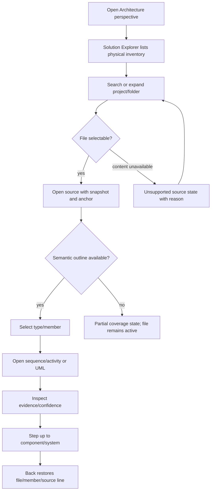
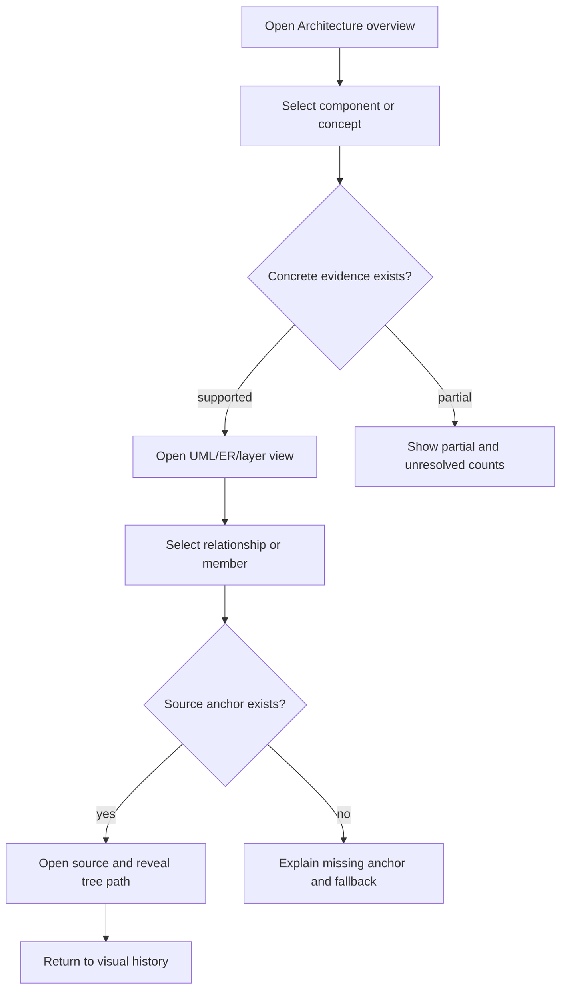
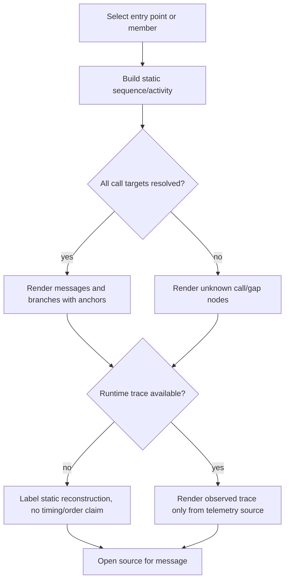
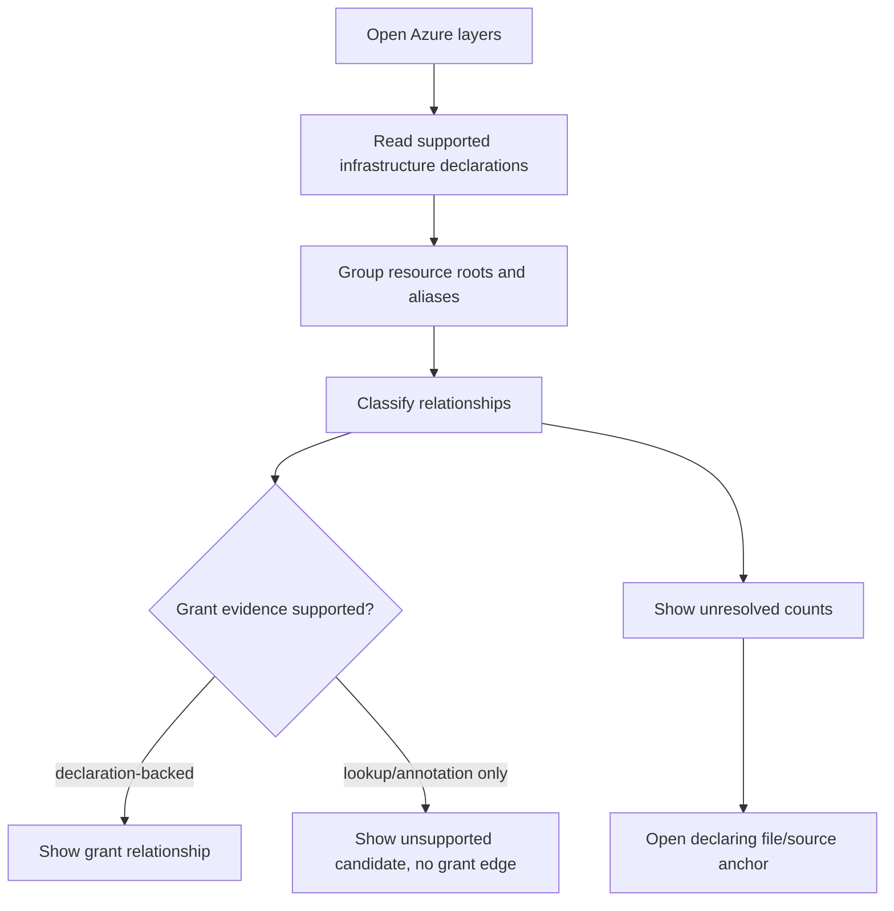
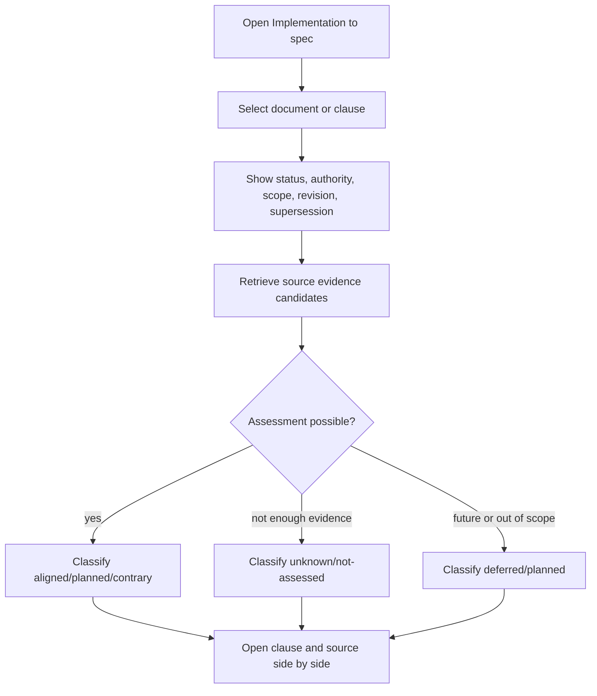
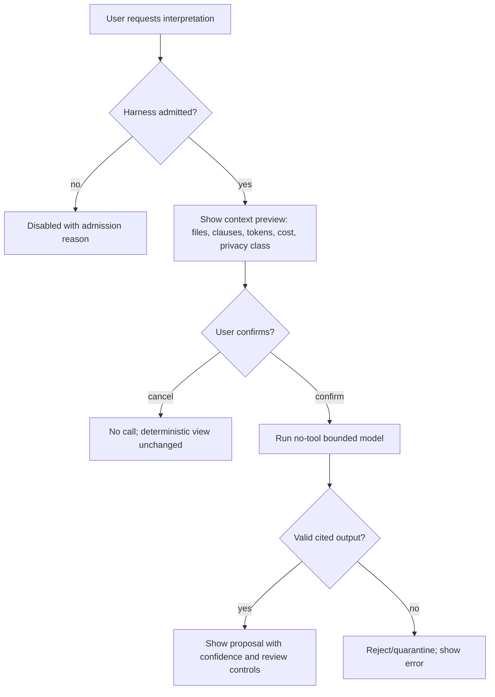

# Spec: Addendum E — Code and Architecture Understanding (Code Atlas)

- **Status:** Draft candidate. **Not accepted. No gate self-cleared.**
- **Tier (cost-of-error):** T2 — this admits user-facing Architecture surfaces, evidence/authority semantics, model-assisted interpretation, privacy-sensitive repository content and misleading-compliance risks.
- **Author / date:** `atlas-spec-gpt55`, 2026-09-12.
- **Reservation:** Owner Astra's durable note `note-atlas-next-addendum` admits candidate Addendum E **conditional on registration**. The current registered maximum addendum is still **D** until Core/Claude/Conductor acknowledgement lands. This file remains a draft and reserves no global authority until registration and gates complete.
- **Upstream:** Addendum C (`spec-addendum-c-perspectives`), UML/ERM surfaces (`spec-uml-erm-surfaces`), Architecture (`architecture`), and the pending provenance note `note-code-atlas-proposal-provenance`.
- **Base evidence:** durable note `note-atlas-reference-custody` records current main tree `b0e092b5` and proposal `1065a851` as observed by the executor **[Verified by note read; the Owner did not independently verify Git state]**. The proposal input was read locally from `C:\Projects\ai-de-proposal-code-atlas\docs\proposals\code-atlas\README.md`, `index.html`, and `mockup.template.html` **[Verified by local read]**. The proposal branch is private input, not merged history. This spec does not copy TheTerrace raw source, fixture JSON, screenshots or session quotes into the delivery tree.
- **Delivery stance:** the user wants the full eventual implementation through the fleet, not another toy mockup. This draft therefore specifies the real product contract and marks unadmitted or unproven capabilities as planned, deferred, unknown or blocked.
- **Metadata stance:** this remains `type: spec`. Any supporting delivery ledger or plan must use a registry-known document type because the installed docs graph rejects `type: plan`.
- **K0 contract grounding:** `proof-code-atlas-contract-grounding` supplies source-only and targeted-test facts. Its corrected barrier/probe section is recorded by K0 correction `0d5218a` **[Verified by user report]**; the currently readable contracts worktree also contains the updated barrier and Roslyn probe section **[Verified by local read]**. K0 does **not** admit its earlier type-only minimal slice; the Conductor rejected that slice as incompatible with the Owner-required physical inventory and addressable-member journey.

Every load-bearing claim is labelled **[Verified]** (opened / fetched / observed), **[Inferred]** (reasoned from evidence), or **[Flagged]** (unknown or pending). This is a candidate spec, so the gate record is intentionally **PENDING/BLOCKED**, not pass.

## Grounding path and evidence ledger

| Claim | Evidence | Confidence |
|---|---|---|
| Addendum C defines exactly three active Perspectives — Coding, Explore and Architecture — and reserves Tests. Architecture is the home for code and architecture understanding. | `docs/specs/addendum-c-perspectives.md` frontmatter and §Use case → perspective; D-0…D-4 are named deferred understanding views. | [Verified] |
| Addendum C D-0…D-4 cover Solution/tree, entry-points, data flow, ER and layer/component views; D-5/D-6 are composer/compile concerns, not Code Atlas concerns. | `docs/specs/addendum-c-perspectives.md` §A5. | [Verified] |
| `spec-uml-erm-surfaces` already requires read-only derived C4/UML/ER views, provenance, notation correctness, bounded curation and drill to source. | `docs/specs/uml-erm-surfaces.md` Part A/B/C. | [Verified] |
| Architecture keeps the WPF shell + WebView2 host, the Architecture docking host, bounded projections, provenance and Addenda C/D decisions. | `docs/architecture.md`, especially §Addenda C and D. | [Verified] |
| The proposal demonstrates a repository-backed direction: full tracked-file inventory, file-first and visual-first journeys, altitude transitions, TheTerrace-scaled counters and a standalone WebView2-style mockup. | Local proposal README, index and template. | [Verified as proposal evidence, not production capability] |
| Visual Studio and VS Code use familiar file/project explorers beside editors; this validates the file-first entrance as an expected developer pattern. | Microsoft Learn "What Are Visual Studio Solutions and Projects?" and VS Code "User interface", fetched 2026-09-12. | [Verified] |
| Bicep is a declarative language for Azure resource deployment; Azure topology claims can be grounded in `.bicep` declarations, but deployed runtime state remains separate. | Microsoft Learn "What is Bicep?", fetched 2026-09-12. | [Verified] |
| Windows apps should follow Fluent/Windows design guidance across input and form factors. | Microsoft Learn "Design Windows apps overview", fetched 2026-09-12. | [Verified] |
| Current method/member extraction contracts are not settled by this worker. | The user assigned separate contract work and instructed this spec not to duplicate deep source research. | [Flagged] |
| The six Owner framing notes are durable accepted docs in the conductor branch at `b1acd4df`. | `note-atlas-next-addendum`, `note-atlas-development-models`, `note-atlas-delivery-horizon`, `note-atlas-lane-admission`, `note-atlas-reference-custody`, `note-atlas-identifier-discipline` read from `C:\Projects\ai-de-conductor-code-atlas`. | [Verified] |
| K0 verified the current source-only contracts and targeted Core baseline: .NET SDK `10.0.303`, Roslyn `4.14.0`, and 79 targeted Core tests passing. | `proof-code-atlas-contract-grounding` Runtime/package and Commands sections. | [Verified] |
| K0 Store/IPC evidence is separate from the 79-test Core baseline: 40 Store/IPC tests executed separately. | User-provided gate input, 2026-09-12. | [Verified by parent report; exact report join pending] |
| K0 found the current Core seams are source/store/IPC/native-source-only for Atlas purposes: `has_member` values are display strings, no independent method/member node identity exists, `Interaction` is type-level, and `NodeContent` for indexed types is not complete physical inventory. | `proof-code-atlas-contract-grounding` Contract table, Barriers and "Conductor disposition". | [Verified] |
| K0's synthetic Roslyn 4.14 probe found documentation IDs distinguish overloads, constructors, properties and accessors, but collide across project/scope; partial types have multiple source locations; missing declaration IDs resolve to null. | `proof-code-atlas-contract-grounding` §Roslyn synthetic-source probe and §Updated barrier. | [Verified] |
| Data lens requirements: current `NodeContent` reads live file bytes and lacks indexed/current hash binding; stale-writer fencing is per extraction scope, not whole-workspace coherence; stable logical identities must be distinct from revision-bound declaration/content/span records. | User-provided Data lens findings, 2026-09-12. | [Verified as reviewer requirement; no schema/native approval] |

## Page one — what Addendum E decides

Addendum E admits the **Code Atlas** as the Architecture perspective's repository-understanding surface. It does **not** create a fourth perspective. It fills Addendum C's D-0…D-4 gap with a source-backed product contract:

1. A **physical Solution/files inventory** is complete and first-class, independent of semantic analysis coverage.
2. File-first and visual-first users can enter different views and still arrive at the **same repository identity**.
3. Every view states its **altitude**: system → component → type → member → source.
4. Concrete UML, ER, layer/component, Azure and implementation↔spec views are **evidence-grounded projections**, not editable source models and not compliance verdicts.
5. Optional model interpretation is admitted only through an approved bounded harness with context preview, no tool authority, no private-corpus shipping and an eval gate before its output can influence a user-facing claim.
6. Authority uncertainty is never silently cleared by AI. Audit/session/commit records are **carriers**, not authority. Authority requires a trusted actor/provenance plus appropriate human authorization or accepted Owner/Conductor delegation, scope, acceptance/effective order and supersession. The root human owner needs no fictional delegation; their direct accepted decision is authority.
7. The current K0 facts are a **design barrier**, not a scope cut: physical inventory and addressable member identity must be designed and admitted before E-0 implementation. A type-only or indexed-node-only slice cannot close the Owner journey.
8. **E-0 cannot downgrade.** It requires real physical inventory, including unsupported/unindexed files, plus independently addressable type/member-to-source navigation. It therefore needs new inventory/file-source and structured member-identity contracts before implementation.

**Owner Astra initial rulings folded into this draft from durable notes:**

- **[Verified: `note-atlas-next-addendum`]** Candidate Addendum E is admitted only **conditional on registration**. The whole vision stays inside Architecture, with the existing three Perspectives and one graph substrate. C D-4 carries the explicit amendment: **"A Bicep resource is not automatically a C4 software container."**
- **[Verified: `note-atlas-development-models`]** The development Astra/GPT fleet does not replace the runtime headless-Claude/subscription contract and does not genericize the prompt compiler. Prompt compilation remains Addendum D's contract.
- **[Verified: `note-atlas-delivery-horizon`]** Architecture must cover all stages, but the first implementation horizon is only the integrated deterministic C# walking skeleton: **file → type/member → actual source**. Later semantic/behavior, data/Azure, comparison/decision and governed-AI stages each need their own design, exit criteria and Owner admission before implementation.
- **[Verified: `note-atlas-lane-admission`]** Until Core/Claude acknowledgement, work is limited to uncontested registered docs and read-only seam analysis; no product source edits are authorized.
- **[Verified: `note-atlas-reference-custody`]** Delivery starts from clean main; proposal `1065a851` remains a local reference. Only reviewed safe summaries and independently safe test material may enter delivery artifacts.
- **[Verified: `note-atlas-identifier-discipline`]** The Conductor records semantic note IDs now and allocates any numeric ruling, ADR or defect id only through the repository allocator/checks. This draft cites no guessed global numbers.

## Part A — Functional specification

### A1. Problem

AI-DE's Architecture perspective is intended for code and architecture understanding, but Addendum C currently leaves the key understanding views as D-0…D-4 deferred criteria. A graph-only or semantic-sample mockup cannot meet the user's need: developers must inspect the real repository shape, traverse from files to symbols and behavior, inspect architecture and deployment evidence, and compare implementation with governing specifications without losing source identity or authority context.

The product problem is: **a developer needs a trustworthy, scalable way to understand a codebase from both physical files and architectural abstractions, while seeing exactly what is known, unknown, inferred, planned, contrary or deferred.**

### A2. Conceptual domain model

The model is stated before the UX/UI. It is domain language only; storage shape, indexes and migration details belong to `/define-architecture` and `/design-slice`.

#### Bounded contexts

| Bounded context | Responsibility | Excluded |
|---|---|---|
| **Repository Evidence Inventory** | Captures repository snapshots, physical files, source anchors, coverage disclosures and extractor evidence. | Runtime observation, model interpretation and compliance judgement. |
| **Code Atlas Views** | Presents bounded views over the same evidence: Solution tree, overview/concept map, UML, ER, layer/component, Azure, sequence/activity, source and correspondence. | Editing code, changing diagrams as source, building a second graph store. |
| **Static Behavior Reconstruction** | Describes method-level entry points, call sites, decisions and data-flow edges as static evidence with confidence. | Runtime order, timing, frequency or causality unless observed by telemetry. |
| **Architecture Resource Model** | Names declared Azure/service resources and relationships from supported evidence. | Granting permissions by lookup or annotation; doubling aliases as separate roots; asserting deployed health. |
| **Specification Correspondence** | Maps implementation evidence to specification clauses and decisions with authority/status/scope. | Compliance percentages, AI-cleared authority, or treating missing evidence as absence. |
| **Bounded Interpretation Harness** | Lets an approved model propose labels, explanations or candidate mappings under strict bounds. | Tool authority, private corpus egress, unreviewed model-created facts. |

#### Ubiquitous language

| Term | Meaning |
|---|---|
| **Repository snapshot** | A git revision plus inventory metadata and per-file identity used by a Code Atlas view. |
| **Physical inventory** | The complete supported file/path inventory for a snapshot. It exists whether or not semantic extraction covers a file. |
| **Semantic extraction** | Parsed symbols, members, relationships or declarations derived from supported languages/tools. Its coverage is explicitly bounded. |
| **Altitude** | The abstraction level of a view: system, component, type, member or source. |
| **Source anchor** | A repository-relative path plus revision and location range. It never stands for a runtime event. |
| **Evidence claim** | A statement the Atlas can show, with source, extraction method and confidence. |
| **Relationship kind** | The typed meaning of an edge: declares, contains, calls, reads, writes, configures, grants, deploys, depends-on, realizes, contradicts, plans, supersedes or defers. |
| **Unknown** | A labelled gap in supported evidence. It is not silently promoted to inferred or verified. |
| **Supported capability declaration** | A visible statement of which extractor, language, relationship kind and view capability is supported for this snapshot. |
| **Mapping assessment** | A correspondence state between source evidence and a governing clause: aligned, planned, contrary, unknown, deferred or not-assessed. |
| **Authority reference** | A human/Owner/Conductor/spec decision reference with trusted actor/provenance, scope, acceptance/effective order and supersession. Audit, session and commit records carry that reference; they are not authority by themselves. Timestamp orders the reference; it does not create authority. |

#### Entities and value objects

| Kind | Name | Notes |
|---|---|---|
| Entity | RepositorySnapshot | Identity persists across views for one captured revision. |
| Entity | Artifact | A repository file or document with path identity. |
| Entity | CodeElement | A system/component/type/member/source-line identity extracted from an Artifact. |
| Entity | StructuredMember | An independently addressable logical type member identity with scope/project, target framework, symbol kind and documentation id when present. Display signature, revision and source spans are records about the identity, not the identity itself. It is not parsed from `has_member`. |
| Entity | WorkspaceManifest | The coherence record for an indexed workspace view: scope revisions, content hashes where authorized, extraction status and whether the view is coherent, mixed, partial or last-successful. |
| Entity | DeclarationRecord | A revision-bound declaration observation for a logical type/member, with source span(s), hash binding and extractor version. |
| Entity | SourceContentRecord | A revision-bound source content observation for an authorized file, with content hash, read time, cap/shortfall and source of bytes. |
| Entity | AtlasView | A projection opened by a user with entry style, altitude, lens, selection and history. |
| Entity | RelationshipClaim | A typed relationship between elements, artifacts, resources or clauses. |
| Entity | ResourceDeclaration | A named service/resource declaration from supported infrastructure evidence. |
| Entity | SpecificationClause | A requirement, decision, note, ADR or spec section with status and authority. |
| Entity | DecisionRecord | An authority-bearing decision or request with scope and supersession. |
| Entity | InterpretationRun | A bounded model proposal over previewed context. |
| Value object | SourceAnchor | `path + revision + optional range`. |
| Value object | ScopeQualifiedSymbolId | Stable logical symbol identity: `language + project/scope + target framework + symbol kind + semantic id`. Roslyn documentation id is only one component because K0 observed cross-scope collisions. Revision and spans belong to DeclarationRecord history, not the natural identity. |
| Value object | FileLogicalId | Stable logical file identity from authorized workspace root and repository-relative path. Revision, content hash and source bytes belong to SourceContentRecord history, not the natural identity. |
| Value object | ConfidenceLabel | `Verified`, `Inferred`, `Flagged`, `Unsupported`. |
| Value object | CoverageDisclosure | Complete/partial/unsupported counts and omitted reasons. |
| Value object | Altitude | `system`, `component`, `type`, `member`, `source`. |
| Value object | MappingState | `aligned`, `planned`, `contrary`, `unknown`, `deferred`, `not-assessed`. |
| Value object | RelationshipProvenance | extractor/tool/document/human source plus method and timestamp. |
| Value object | ResourceAlias | Alternative names for one ResourceDeclaration root. |
| Value object | CapabilityStatus | `supported`, `partial`, `unsupported`, `blocked`, `deferred`. |

#### Aggregates and invariants

| Aggregate root | Protects this invariant |
|---|---|
| **RepositorySnapshot** | A physical file/path inventory is complete for the supported snapshot and remains independent of semantic coverage. A missing semantic node never hides a file. |
| **Artifact** | A file's path, revision and hash identity are preserved across tree, source, diagram, breadcrumb and export views. |
| **CodeElement** | Type/member/source identities are not collapsed into filenames or labels. Partial, generated, nested or unresolved elements carry that status. |
| **StructuredMember** | A member identity is stable across display changes and distinguishes overloads, constructors, properties/accessors and partial declarations/implementations. `has_member` display text is never parsed as identity. |
| **WorkspaceManifest** | A workspace view declares its coherence state. Mixed scope revisions, partial extraction, live-byte source reads and last-successful fallback are visible states, never silently described as one coherent snapshot. |
| **DeclarationRecord** | A moved span or changed file content creates a new revision-bound observation for the same logical symbol; it does not mutate the logical identity. |
| **SourceContentRecord** | Source shown to the user is either bound to the indexed/current hash state or explicitly labelled live/unknown/stale. Path safety alone is not snapshot consistency. |
| **AtlasView** | Altitude transitions preserve selection history and never fabricate a lower-altitude representation when evidence is unavailable. |
| **RelationshipClaim** | Every relationship has a typed predicate, source/provenance, confidence and unknown handling. Runtime order is not inferred from static call order. |
| **ResourceDeclaration** | Resource roots and aliases are not doubled. Grants, network/config/runtime relationships exist only from supported declaration/evidence kinds; no grant is created by lookup name or comment annotation alone. |
| **SpecificationClause** | Document status, authority, scope, revision and supersession are visible before any implementation mapping is assessed. |
| **DecisionRecord** | Authority requires trusted actor/provenance plus appropriate human authorization or accepted Owner/Conductor delegation, scope, acceptance/effective order and supersession. Audit/session/commit are carriers only. The root human owner's direct accepted decision needs no fictional delegation. AI may summarize or propose; it cannot clear uncertainty. |
| **InterpretationRun** | A model proposal is bounded by an approved context preview, no tool authority, no private-corpus shipping, output validation and an eval gate before admission. |

### A3. Target users and jobs-to-be-done

| Persona | Job-to-be-done | Evidence |
|---|---|---|
| **File-first developer** | Start where code editors normally start: solution/project/folder/file. Open a real file, inspect symbols, then step up to type, behavior and architecture without losing the file identity. | Visual Studio and VS Code docs establish the familiar explorer/editor pattern **[Verified]**; proposal demonstrates the desired file-first path **[Verified as proposal]**. |
| **Visual-first architect** | Start at system/component maps, then narrow to concrete UML, members, call sites and source evidence. | Addendum C UC3 and `spec-uml-erm-surfaces` require Architecture model views and drill-to-source **[Verified]**. |
| **Reviewer / spec owner** | Compare implementation evidence with requirements and decisions without a misleading pass/fail percentage. | Existing specs emphasize status/authority/supersession; user explicitly requires planned/contrary/unknown/deferred states **[Verified]**. |
| **Cloud/runtime architect** | See named Azure/service declarations, layers and relationship semantics without invented deployed resources. | Bicep docs define declarations as source for Azure resources **[Verified]**; proposal requires Azure refinement **[Verified as proposal]**. |
| **AI-assisted explorer** | Ask for interpretation only when the product shows the bound context, cost/limits and that the result is a proposal. | UI AI guidance U13–U15 and Addendum D's no-tool compile discipline inform the boundary **[Verified]**. |

### A4. Core scenario

A developer opens the Architecture perspective for a workspace. They choose **Solution Explorer**, expand real projects and folders, open a file, inspect its declared type and member outline, select a method, switch to a bounded sequence/activity view for that method, inspect each static call-site claim with confidence and unknowns, step up to the component/layer and Azure declaration view, then compare the selected implementation evidence with a governing spec clause. Every step preserves the same snapshot, source anchor, selection history and authority trail. Unsupported or partial evidence is visible and recoverable, not replaced by invented analysis.

### A5. In scope

1. **D-0 Solution/tree view admitted as a real physical inventory view.** The tree lists code, data, architecture and document artifacts by project/folder/path even when semantic coverage is absent.
2. **D-1 Entry-points view.** Entrypoints are declared from supported evidence with kind and confidence; unclassified candidates are listed separately.
3. **D-2 Method-level data/call flow.** Static entrypoint/call-site sequence and activity views show source anchors, confidence and unknowns, not inferred runtime order.
4. **D-3 ER and domain/entity views.** ER/class/data views refine `spec-uml-erm-surfaces` and stay notation-correct, read-only and source-grounded.
5. **D-4 Layer, component and Azure declaration views.** Views show logical layers, components and named service declarations with typed relationships and unresolved counts.
6. **Implementation↔spec correspondence.** Views map source evidence to clauses, document authority, status, scope, supersession and mapping state.
7. **Decision provenance.** Human/Owner/Conductor decision references are displayed with scope, carrier, effective order and timestamps. Audit/session/commit carriers are never shown as authority by themselves.
8. **Optional model interpretation.** Admitted only through the bounded harness in this spec.
9. **Full E7 surface list for this feature:** evidence store/projection model → extraction contracts → query/projection service → Architecture host/wire → client view models/types → WPF/WebView2 UI → compute readers for identity, coverage, relationships, mapping states and authority.

### A6. Out of scope / explicit non-goals

1. **No product implementation in this spec.** No code, schema, extractor or UI implementation is authored here.
2. **No fourth Perspective.** Inherits Addendum C's three Perspectives only; Code Atlas lives in Architecture.
3. **No redesign of Coding, Explore or Composer.** Addendum D D-5/D-6 belong to conversation compile, not Code Atlas.
4. **No runtime conductor provider-contract change.** Astra/GPT5.5 is the development fleet, not a product provider contract.
5. **No private corpus shipping.** The private proposal and any private source corpus remain on their branches and machines. Product artifacts cannot embed raw private source, fixture JSON, screenshots or session quotes.
6. **No compliance percentage.** Implementation↔spec views use explicit mapping states and evidence, not a misleading percent complete.
7. **No grants by lookup, label or annotation.** A grant relationship requires supported declaration/evidence.
8. **No fabricated runtime traces.** Static sequence/activity views never claim observed order, frequency, latency or success.
9. **No complete semantic-coverage claim until contracts prove it.** Physical inventory completeness and semantic extraction coverage are separate disclosures.

### A7. Reconciliation with Addenda C and D

| Existing item | Under Addendum E | Disposition |
|---|---|---|
| Addendum C D-0 Solution/tree view | Becomes Code Atlas's physical inventory and Solution Explorer contract. | Admitted by this draft, pending Owner acceptance. |
| Addendum C D-1 Entry-points view | Becomes a supported-capability view with unclassified/unsupported buckets. | Admitted by this draft, pending extractor contract. |
| Addendum C D-2 Data flow from entry point | Becomes static method-level sequence/activity/data-flow with confidence and unknowns. | Admitted as static only; runtime order remains out of scope. |
| Addendum C D-3 ER diagram | Refines `spec-uml-erm-surfaces` ER/domain requirements. | Admitted; notation gate remains with UML/ERM expert. |
| Addendum C D-4 Layer/component from code and Bicep | Becomes logical layer/component plus Azure service declaration views. | Admitted; no deployed-state claim. |
| Addendum C D-5 structure deriver | Prompt/Composer compile capability. | Out of scope; Addendum D owns it. |
| Addendum C D-6 conductor round-trips | Prompt/Composer compile/reply capability. | Out of scope; Addendum D owns it. |
| Addendum C Architecture allow-list | Code Atlas uses the Architecture host and admits only Architecture reading surfaces. | Refines, not replaces. |
| Architecture Addenda C/D | Existing WPF/WebView2 shell, bounded projections and evidence posture stand. | No provider or runtime-conductor change. |

**Quoted amendment for C D-4:** "A Bicep resource is not automatically a C4 software container." Addendum E may use Bicep declarations as evidence for Azure/resource and deployment relationships; it must not map a resource declaration to a C4 software container unless a separate software-system/container/component rule establishes that mapping with code or architecture evidence.

### A8. Supported capability declarations

Every Code Atlas view renders a capability disclosure before or beside the content. Minimum fields: `snapshot`, `physical_inventory`, `semantic_coverage`, `supported_languages`, `supported_relationships`, `unsupported_files`, `omitted_nodes`, `truncated_edges`, `unresolved_counts`, `model_interpretation_status`.

| Capability | Initial status | Admission rule |
|---|---|---|
| Physical tracked-file inventory | Design barrier | Requires a new inventory/file-source contract with authorized visibility, scope, revision/coherence, path identity, supported/unsupported/unindexed status, exclusion reason, source availability, content cap and shortfall. K0's indexed `NodeContent` seam is insufficient because indexed types are not a complete file inventory. |
| Source view with anchors | Design barrier | Current `NodeContent` is authority-side, path-confined and capped for indexed nodes but reads live bytes and lacks indexed/current hash binding. A file-source contract must serve actual source with hash/coherence state, or explicit live/stale/unavailable/unsupported states. |
| C# type/member extraction | Design barrier | Requires a structured member-identity contract with stable logical identity separated from revision-bound spans, overloads, constructors, properties/accessors and partials. Roslyn 4.14 documentation IDs are usable components but not globally unique; `has_member` strings are UML display payloads, never durable member IDs. |
| UML class/member relationships | Partial | Only supported relationship kinds render; unresolved relationships are gaps. |
| Method sequence/activity | Later-stage only | K0 verifies `Interaction` is type-level and method nodes do not exist. Full method-sequence reconstruction is not part of E-0; it waits for E-1 design/admission after member/method identity exists. |
| ER/domain view | Partial | Requires schema/conceptual evidence and `spec-uml-erm-surfaces` notation gates. |
| Azure declaration view | Partial | Bicep/resource declarations and source-backed config references only; deployed state is unknown. |
| Implementation↔spec mapping | Planned | Requires clause authority model and review workflow; no percentage. |
| Model interpretation | Deferred | Requires approved harness, context preview, no tools, eval and human review. |

### A9. User stories and acceptance criteria

**US-E1 — Physical inventory is complete and separate from semantic coverage.**
- **Given** a repository snapshot with supported tracked-file input, **When** Code Atlas opens the Solution/tree view, **Then** every authorized visible included path appears exactly once with project/folder/file identity, and every excluded or policy-hidden category appears in an honest limitation disclosure with reason where policy permits metadata.
- **Given** a file with no semantic extraction, **When** the user selects it, **Then** the file remains visible and selectable, and the view states "semantic coverage unavailable" without substituting another file or symbol.
- **Given** a generated, migration, vendored or unsupported file, **When** it is listed, **Then** its category is visible and does not count as hand-authored semantic coverage unless the extractor supports that category.
- **Given** an unsupported or unindexed file, **When** the user searches or browses the physical inventory, **Then** the file is still addressable as a file record with revision, path, source availability and reason semantic operations are disabled.
- **Given** a file is indexed and then edited without re-indexing, **When** the source view opens, **Then** it labels the source as live/current/stale/unknown from manifest/hash evidence and never claims snapshot consistency from path safety alone.

**US-E2 — File-first users can climb from file to architecture and return.**
- **Given** a file selected in the tree, **When** the user selects a type or member outline item, **Then** the active selection becomes that CodeElement and the source anchor, file path and snapshot stay visible.
- **Given** a C# member with overloads, accessors, constructors or partial declarations, **When** the user selects it, **Then** the selection includes a structured member identity containing scope/project, target framework, symbol kind and semantic id when present, plus revision-bound source span record(s) and display signature; it is not parsed from `has_member`.
- **Given** a member's span moves between revisions, **When** Code Atlas compares selections, **Then** the logical member identity is stable and the declaration/source records show old and new spans as history.
- **Given** a selected member with supported relationship evidence, **When** the user opens sequence/activity, **Then** the member appears as the entry node and every message/decision has a source anchor or an explicit unknown.
- **Given** the user steps up to component/system and presses Back, **Then** the previous file, symbol, source line, branch and scroll position are restored.

**US-E3 — Visual-first users can descend to concrete source.**
- **Given** the Architecture overview, **When** the user selects a component, concept-map node, UML class, relationship or sequence message, **Then** the inspector shows its evidence and offers source drill-down when a source anchor exists.
- **Given** a visual element without a source anchor, **When** it is selected, **Then** the UI states why source is unavailable and names the next supported altitude, not an invented source file.
- **Given** the user reveals the active file, **When** the tree is visible, **Then** the tree selection matches the visual element's artifact identity.

**US-E4 — Altitude and identity are explicit.**
- **Given** any view, **When** it renders, **Then** it shows the current altitude from `system → component → type → member → source`.
- **Given** a transition between altitudes, **When** evidence exists at both levels, **Then** the same RepositorySnapshot and selection identity are preserved in breadcrumb, tree, diagram, inspector and source.
- **Given** a transition where lower-level evidence is unsupported, **When** the user descends, **Then** the app shows an unsupported state with the missing capability and offers a supported fallback.

**US-E5 — Bounded maps and concrete UML are both available.**
- **Given** a system/component overview, **When** node or edge counts exceed the declared bound, **Then** the view folds or elides content with exact shown/omitted counts and a route to search or expand omitted items.
- **Given** a concept map, **When** it renders, **Then** it uses responsibility/relationship labels and confidence; it does not claim concrete fields or operations.
- **Given** a UML class view, **When** it renders a supported type, **Then** class compartments show fields/properties, operations, visibility, signatures and relationship types only where supported evidence exists.
- **Given** a relationship is inferred or ambiguous, **When** it renders, **Then** the visual treatment and inspector label distinguish it from extracted evidence without relying on color alone.

**US-E6 — Method-level sequence/activity views are static and honest.**
- **Given** a supported method entry point, **When** the sequence view renders, **Then** each call-site/message lists participant, predicate, source anchor, evidence kind and confidence.
- **Given** a branch, exception path, cancellation path or unknown call target, **When** the activity view renders, **Then** it shows a decision/gap node with the static condition and confidence.
- **Given** no runtime trace was observed, **When** any sequence/activity view renders, **Then** it states "static reconstruction — not observed runtime order" and shows no timing/frequency claims.
- **Given** async/cancel/error paths exist in supported evidence, **When** the view renders, **Then** cancellation/error nodes are shown or counted as unresolved.

**US-E7 — Domain, ER, layer and component views are grounded in supported evidence.**
- **Given** domain/entity evidence is supported, **When** the domain view opens, **Then** entities, value objects, aggregates and invariants cite source/spec evidence and carry confidence.
- **Given** ER evidence is supported, **When** ER renders, **Then** crow's-foot cardinality, keys and associative entities follow `spec-uml-erm-surfaces` US-U3.
- **Given** layer/component evidence is supported, **When** the layer view renders, **Then** each layer/component relationship has a typed source and unsupported edges are listed.
- **Given** a conceptual architecture clause conflicts with source evidence or is only target-state, **When** the view renders, **Then** the clause is labelled by status/scope and not presented as current implementation.

**US-E8 — Azure/service declarations are named, typed and not doubled.**
- **Given** a supported infrastructure declaration, **When** the Azure/service view renders, **Then** it shows the service family/type, logical layer, declaration file, source anchor and relationship kind.
- **Given** two declarations/aliases refer to the same resource root, **When** the view renders, **Then** they collapse under one root with aliases, not two resources.
- **Given** a relationship is a deployment dependency, parent/child, network rule, configuration reference, grant or runtime use, **When** it renders, **Then** the relationship kind is explicit and unresolved counts are symbolic and visible.
- **Given** a grant is suggested only by lookup name, comment or annotation, **When** extraction runs, **Then** no grant edge is created; the candidate is listed as unsupported/unknown.
- **Given** an example service such as AKS or Cosmos DB is absent from evidence, **When** the view renders, **Then** it is absent or labelled absent, not inserted from vocabulary.

**US-E9 — Optional model interpretation is bounded and non-authoritative.**
- **Given** model interpretation is not admitted, **When** the user opens Code Atlas, **Then** no model explanation is shown as product capability and deterministic views still work.
- **Given** an admitted harness is available, **When** the user asks for interpretation, **Then** the UI shows a context preview with files/clauses/tokens/cost bounds before the call.
- **Given** the model returns output, **When** validation succeeds, **Then** the output is labelled as a proposal with citations to existing evidence and no tool authority.
- **Given** the model asks for a tool, invents a source, exceeds bounds, omits citations or attempts to clear authority uncertainty, **When** validation runs, **Then** the output is rejected or quarantined and the deterministic view remains unchanged.
- **Given** no eval has admitted a model interpretation class, **When** a slice attempts to expose it, **Then** the build gate blocks or the feature stays hidden.

**US-E10 — Implementation↔spec views show states, not compliance percent.**
- **Given** a spec/document clause and source evidence, **When** the correspondence view renders, **Then** it shows document id, status, authority, scope, revision and supersession before mapping state.
- **Given** a mapping is computed, **When** the correspondence view renders, **Then** it binds source revision, clause revision, governing rule/version, decision references, coverage basis and extractor/model origin to the assessment.
- **Given** mapping evidence exists, **When** it is assessed, **Then** the state is exactly one of `aligned`, `planned`, `contrary`, `unknown`, `deferred` or `not-assessed`, with reason and source.
- **Given** missing evidence, **When** the view renders, **Then** missing is `unknown` or `not-assessed`, never proof of absence.
- **Given** target-state architecture and current code differ, **When** the view renders, **Then** target-state clauses are not shown as failed implementation unless their authority/scope says they apply now.
- **Given** a user exports the view, **When** the export is produced, **Then** it includes state counts and evidence, not a compliance percentage.

**US-E11 — Decision provenance keeps authority explicit.**
- **Given** a decision reference, **When** it appears in Code Atlas, **Then** it shows source type, authorizing actor class, scope, acceptance/supersession status and timestamp.
- **Given** a timestamped note without authority, **When** it appears, **Then** the timestamp orders it but does not promote it to accepted authority.
- **Given** AI proposes a decision summary, **When** it is displayed, **Then** it is labelled as a summary/proposal and cannot clear unknown authority.
- **Given** a human accepts an AI proposal, **When** the result is stored or displayed, **Then** the system records a new annotation/decision record with human authority and preserves the AI origin; it never promotes the AI-origin text into an extracted or observed fact.
- **Given** contradictory decisions apply, **When** the view renders, **Then** the conflict is surfaced and the user can open each source.

**US-E12 — Privacy, minimization and provenance protect private corpora.**
- **Given** a private source repository or proposal corpus, **When** Code Atlas writes product artifacts, **Then** raw source bodies, fixture JSON, screenshots and session quotes are not committed unless explicitly authorized and classified.
- **Given** a view needs evidence, **When** it persists or exports data, **Then** it stores the minimum source anchor/provenance required, not unnecessary raw content.
- **Given** a model interpretation is requested, **When** the context preview includes private or sensitive content, **Then** the user can cancel, and the call cannot proceed unless the approved processing class permits it.

**US-E13 — Negative, partial, cancel, malformed, hostile and unsupported cases are first-class.**
- **Given** no workspace is indexed, **When** Code Atlas opens, **Then** it shows an empty/needs-index state with next action and no fake data.
- **Given** extraction is running, **When** the user navigates, **Then** previously valid views show stale/refreshing state and remain readable.
- **Given** extraction fails, **When** the view opens, **Then** the error has a stable code, affected scope and recovery action.
- **Given** a malformed source file or unsupported language, **When** selected, **Then** the physical file is shown and semantic features are disabled with reason.
- **Given** hostile content in a repository file, spec or model response, **When** it is displayed, **Then** it is inert data and cannot invoke tools, commands or navigation without explicit product action.
- **Given** the user cancels a refresh or model interpretation, **When** cancellation completes, **Then** partial results are marked partial/cancelled and not promoted.

### A10. Non-functional requirements (ISO/IEC 25010)

| Attribute | Fixture / decision | Metric | Threshold | Protocol / gate |
|---|---|---|---|---|
| Functional suitability | E-0 approved real-workspace fixture with authorized in-scope files, unsupported files and C# overload/partial cases. | US-E clause pass/fail. | 100% of E-0 subset rows in §Acceptance matrix pass; later-stage rows remain `not-admitted`, not skipped. | Test matrix below; no current-implementation/red-run claim in this draft. |
| Performance efficiency | TheTerrace-class fixture (≈2,500 authorized visible paths) or Owner-approved equivalent before implementation. | Tree open p95, tree filter p95, retained view switch p95, UI-thread responsiveness. | Open ≤ 2 s p95; filter ≤ 150 ms p95; retained switch ≤ 150 ms p95; no UI-thread block over the design-approved frame budget. | Measured native run required before E-0 acceptance. If fixture size changes, Owner/design decision required before implementation. |
| Reliability | Fixtures: index→edit-without-reindex, mixed scope A-new/B-old, unsupported file, extraction failure, refresh cancel. | State correctness. | View shows `current`, `live-changed`, `stale`, `mixed`, `partial`, `last-successful`, `unsupported` or `cancelled` as applicable; no stale view shown as coherent. | Store/IPC/native proof path; manifest/coherence oracle. |
| Security | Fixtures in §A12 boundary table. | Negative-oracle pass/fail. | 100% reject or inert-render as specified. | Security gate before acceptance. |
| Usability | E-0 real native journey over a selectable workspace. | Completion and recovery steps. | File → type/member → actual source → Back completes by keyboard and pointer; unsupported/unindexed files remain visible within authorized visibility. | Manual + automated UI proof path. |
| Compatibility | Windows WPF + WebView2 Architecture host. | Runtime/platform proof. | Works in existing Architecture perspective with no Coding/Explore/Composer redesign. | Claude/Core seam acknowledgement and native proof required. |
| Maintainability | Contract fixtures for inventory/file-source/member identity. | One owner per contract, one identity rule. | No parsing `has_member`; no path-only snapshot claim; no duplicated graph substrate. | Design review before source admission. |
| Portability | Windows-first local workspace. | Egress and dependency count. | Deterministic E-0 has no cloud/model dependency; private corpus not exported/persisted without separate authorization. | Privacy/security gate. |
| Accessibility | Native E-0 UI fixture. | Keyboard/UIA/contrast/list alternative. | WCAG 2.2 AA; all controls named; diagram/source alternatives navigable. | UX/accessibility gate. |
| Observability | Normal-path E-0 runs. | Duration, counts, coherence state, omissions, errors. | Every run emits extraction/read durations, path counts, unsupported counts, hash/coherence state, shortfall and stable error codes; missing values emit `not recorded`. | Instrumentation gate; no invented region/cost terms. |

### A11. Boundary set

| Boundary | Required behavior |
|---|---|
| Empty repository / no supported files | Empty state; no fake graph. |
| Large repository / wide folder | Virtualized tree; bounded diagrams; exact shown/omitted counts. |
| Unsupported language/file | Physical file remains; semantic commands disabled with reason. |
| Generated/migration/vendor files | Visible category; separate coverage counts. |
| Partial extraction | Partial badge, unresolved counts, stale/refreshing state. |
| Malformed source or Bicep | Error node with source scope and stable code. |
| Hostile source/model text | Rendered inert; no tool or navigation authority. |
| Source changed after snapshot | Stale state; refresh action; source anchors remain tied to old snapshot. |
| Mixed workspace coherence | Manifest state says `mixed`, `partial` or `last-successful`; no view claims one coherent workspace revision unless the manifest proves it. |
| Missing source body under policy | No substituted source; state says unavailable. |
| Inferred relationship | Distinct visual + textual label; inspector explains basis. |
| Unknown authority | Cannot be cleared by AI; audit/session/commit are carriers only, not authority. Authority requires trusted actor/provenance plus appropriate human authorization or accepted delegation, scope, acceptance/effective order and supersession. |
| Cancellation | Cancelled state and partial disclosure; no promotion to complete. |
| Model unavailable/quota | Deterministic views work; model interpretation disabled with reason. |
| Private corpus export | Block or redact per processing class; raw private content not committed. |

### A12. Normative security and trust-boundary table before acceptance

This table is acceptance-blocking. It names logical policy responsibilities, not required production class signatures.

| Boundary | Untrusted input | Trusted-side policy owner | Allowed output | Rejection condition | Named negative oracle |
|---|---|---|---|---|---|
| File/source open | Path, symlink, stale source anchor, workspace-relative URI | Repository Evidence Inventory policy | SourceContentRecord bound to authorized FileLogicalId, snapshot/hash/span/coherence state, cap and shortfall | Path escape, symlink escape, TOCTOU hash mismatch, mutable old-anchor substitution, policy-forbidden metadata | `SEC-E0-PATH-ESCAPE-SYMLINK-TOCTOU` |
| Source export | Selected files/spans and manifest | Reference custody + Privacy/Data Governance | Minimal export with source revision, hashes, ranges and classification | Raw private fixture/source/session export without explicit separate authorization, classification and scanning | `SEC-E0-RAW-PRIVATE-EXPORT` |
| WebView2 render | Repository text, Markdown, HTML-like text, URI strings, model output | Architecture presentation policy | Inert DOM/text, allow-listed navigation commands only | Script execution, host-object bridge, direct SDK bridge, untrusted URI navigation, command URI execution | `SEC-E0-HOSTILE-HTML-URI` |
| Model context preview | Files, clauses, source ranges, decisions, user prompt | Bounded Interpretation Harness + Privacy/Data Governance | ModelContextManifest: exact source hashes/ranges, redaction, destination, processing class, retention, budget and confirmation | Unknown term, missing hash/range, missing processing class/retention/budget, invented region/cost, no confirmation | `SEC-E4-MODEL-CONTEXT-MANIFEST` |
| Model output validation | Proposed explanation, mapping, citation, tool request | Bounded Interpretation Harness validator | Quarantined proposal with citations to previewed evidence and no tool authority | Invented citation, cited source outside preview, tool request, authority-clearing claim, schema failure | `SEC-E4-INVENTED-CITATION-TOOL` |
| Decision/authority display | Audit entry, session message, commit, note, model summary | Specification Correspondence + DecisionRecord policy | DecisionRecord or annotation showing origin, evidence confidence, review disposition and authority separately | False audit/session authority, missing actor/provenance, missing scope, missing acceptance/effective order, unresolved conflict hidden | `SEC-E3-FALSE-AUTHORITY` |
| Human acceptance of AI proposal | AI-origin proposal plus human action | DecisionRecord policy | New human annotation/decision record preserving AI origin and review disposition | Promoting AI-origin text into extracted/observed fact or upgrading evidence confidence because a human accepted it | `SEC-E3-AI-ORIGIN-NOT-UPGRADED` |
| Infrastructure/grant view | Bicep, config, comments, names, annotations | Architecture Resource Model policy | Typed declaration/config/network/grant/runtime relationship with evidence and unresolved counts | Grant by lookup/name/comment/annotation alone; Bicep resource mapped automatically to C4 software container | `SEC-E2-NO-GRANT-BY-LOOKUP` |

### A13. Applicable governance lenses

- **Quality attributes / NFRs:** Applies. Budgets are listed in §A10 and must become measured gates.
- **Threat model:** Applies. WebView2, model interpretation, hostile repository content and authority display are trust boundaries.
- **Privacy & data governance:** Applies. Repository source, proposals, session/audit references and model context are work data; minimize and preview.
- **Accessibility:** Applies. Native WPF/WebView2 and diagrams require keyboard, UIA, textual alternatives and WCAG 2.2 AA.
- **Performance budget:** Applies. Physical inventory, virtualization, bounded diagrams and extraction latency require measurement.
- **Release / rollback / migration:** Applies for future data stores and extractor contracts; not implemented by this draft.
- **Observability:** Applies. Extraction/view/model/error measurements must emit on the normal path.
- **Supply chain:** Applies if external parser/rendering/model libraries are introduced; not decided here.

### A14. AI-integrated allocation

- **LOA archetype:** Primary remains **F — Copilot Aside Hot Path** for AI-DE. Deterministic extraction, identity preservation, authority, grants, mapping states, bounds and UI routing are T0. Optional interpretation is an aside that proposes explanations and mappings.
- **Provider contract:** Development use of Astra/GPT models in this fleet does **not** alter the runtime product contract. AI-DE's runtime conductor remains the existing headless-Claude/subscription path unless a separate accepted spec/architecture change amends it.
- **Prompt compiler boundary:** Addendum E does not genericize the Addendum D prompt compiler. Any model used for Code Atlas interpretation is a bounded Architecture-reading aid, not a compiler provider.
- **Tier allocation:**
  - T0: physical inventory, source anchors, relationship validation, map bounds, authority/mapping-state rules, grant rejection, exports.
  - T1/T2: deterministic ranking/label suggestions only if measured need beats deterministic baseline.
  - T3: optional model interpretation through the approved harness only; no tool authority; context preview; citations required; eval before admission; human review before any interpretation becomes a persisted claim.

### A15. Comparables and evidence

| Claim | Source | Confidence |
|---|---|---|
| A project/solution explorer is a familiar developer entry point. | Microsoft Learn Visual Studio Solutions/Projects, fetched 2026-09-12. | [Verified] |
| A left explorer with editor area and persisted layout is a familiar code-workbench pattern. | VS Code User Interface docs, fetched 2026-09-12. | [Verified] |
| Azure infrastructure declarations can be grounded in Bicep files, but declarations are not deployed runtime observations. | Microsoft Learn Bicep overview, fetched 2026-09-12. | [Verified] |
| Windows app UX should follow Fluent/Windows guidance for look, feel, input and form factors. | Microsoft Learn Windows app design overview, fetched 2026-09-12. | [Verified] |
| C4/UML/ER views must be derived, read-only, notation-correct and provenance-labelled. | `spec-uml-erm-surfaces`. | [Verified] |
| The real-product direction includes a complete file inventory plus curated semantic examples from a private TheTerrace snapshot. | Private proposal README/mockup. | [Verified as proposal evidence; not a product claim] |

## Part B — UX specification

### B1. Personas and jobs-to-be-done

| Persona | Context | Success from the user's side |
|---|---|---|
| File-first developer | Uses IDE/file explorer muscle memory and wants concrete source first. | Finds a file, a member and its surrounding architecture without re-searching or losing the source line. |
| Visual-first architect | Starts with system/component concepts and narrows into proof. | Moves from overview to UML/sequence/source while every edge remains evidenced and bounded. |
| Spec reviewer | Needs to know whether code realizes a requirement now, later, or not at all. | Opens a clause and sees aligned/planned/contrary/unknown/deferred evidence with authority context. |
| Cloud architect | Reads deployment/resource declarations and their links to code. | Sees real service declarations, aliases and typed relationships without invented services. |

### B2. Information architecture

| Region | Contents | Purpose |
|---|---|---|
| **Perspective rail** | Existing Addendum C rail, Architecture active. | No new Perspective. |
| **Solution Explorer pane** | Solution/project/folder/file tree, filters, coverage badges, unsupported states, reveal-active-file. | File-first entrance and physical inventory proof. |
| **Main work area** | Tabs/lenses: Overview, Entry points, Concept map, UML class, ER/domain, Sequence, Activity, Layer/component, Azure, Implementation↔spec, Source. | Visual-first and task-specific reading. |
| **Altitude breadcrumb** | System → component → type → member → source, plus Back/history. | Keeps abstraction explicit and reversible. |
| **Evidence inspector** | Source anchors, relationship basis, confidence, coverage, authority, unresolved counts and actions. | Stops diagrams from becoming unsupported claims. |
| **Capability disclosure** | Snapshot, supported extractors, bounds, omissions, privacy/model status. | Makes partial capability visible before the user trusts the view. |

### B3. User flows

#### Flow 1 — File-first source-to-architecture



#### Flow 2 — Visual-first overview-to-source



#### Flow 3 — Method-level behavior with uncertainty



#### Flow 4 — Azure declaration and relationship review



#### Flow 5 — Implementation to specification correspondence



#### Flow 6 — Model interpretation with preview and rejection



### B4. Wireframe-level structure

```text
┌──────────────────────────────────────────────────────────────────────────────┐
│ Rail: Coding | Explore | Architecture(active)                               │
├───────────────┬───────────────────────────────────────────────┬──────────────┤
│ Solution      │ Breadcrumb: System › Component › Type › Member │ Evidence     │
│ Explorer      │ Tabs: Overview Entry UML ER Sequence Azure Spec │ Inspector    │
│ - solution    │                                               │ - source      │
│ - projects    │  Main canvas/editor/source                    │ - confidence  │
│ - folders     │  Bounded diagram OR source view OR table       │ - coverage    │
│ - files       │                                               │ - authority   │
│ Outline       │ Status: snapshot, bounds, omissions, model     │ - actions     │
└───────────────┴───────────────────────────────────────────────┴──────────────┘
```

### B5. UX acceptance criteria

| Criterion | Trace |
|---|---|
| File-first reaches source → member → sequence/activity → source anchor → Back in one continuous history. | US-E2, Flow 1 |
| Visual-first reaches overview → component → UML/ER/layer → source without losing tree reveal. | US-E3, Flow 2 |
| Every view states snapshot, altitude, coverage and evidence confidence. | US-E4, B2 |
| Every failure/partial/unsupported path has an explicit recovery or fallback. | US-E13, all flows |
| Implementation↔spec never shows a compliance percent and always exposes authority/status before mapping. | US-E10, Flow 5 |
| Model interpretation cannot run without preview, admitted harness and user confirmation. | US-E9, Flow 6 |

## Part C — UI specification

### C1. UI Archetype Signature

- **Archetype:** **G6 · Multi-Panel Data Terminal**, adapted to a native code-understanding workstation.
- **Signature:** `DataTerminal { Type:DSS; Arch:SPA; Layout:MultiPanelWorkstation; Density:UltraDense; Nav:CommandPalette+Sidebar; Viewport:DesktopBound; Input:KeyboardFirst+PrecisionPointer; Color:HighContrast+DarkAdaptive; Type:MonospaceTechnical; Depth:Flat; Sync:LocalFirst; Persistence:Session; Feedback:Instant+Confirmed; Motion:None; Pacing:Freeform; Transition:HardCut; A11y:WCAG_2.2_AA+HighLegibility; x-platform:windows; x-framework:wpf-webview2; }`
- **Selection:** auto-selected from the JTBD. The dominant job is an expert, linked, multi-panel reading task with file tree, source, diagrams and evidence panes. It is closer to a technical data terminal than a form, dashboard or chat surface.
- **Facet deviations:** `Sync:LocalFirst` replaces G6's real-time polling because deterministic views are local workspace projections; `Nav:Sidebar` is added because Addendum C's Perspective rail and Solution Explorer are fixed.

### C2. Medium and platform guidelines

- **Medium:** native Windows desktop shell (WPF) with WebView2-hosted diagram/source surfaces.
- **Guidelines:** Microsoft Fluent/Windows app design guidance; AI-DE `DESIGN.md` tokens; WPF keyboard/UIA expectations; WebView2 content treated as inert projection documents.
- **Native acceptance:** a web mockup can guide direction only. Native acceptance requires WPF/WebView2 proof for keyboard focus, UIA names/roles, high-DPI, multi-monitor sizing, reduced motion and theme/high-contrast modes.

### C3. Visual intent and tokens

- **Qualities:** familiar, concrete, dense, reversible, evidence-forward, calm under uncertainty.
- **Opposites to avoid:** toy, vague, poster-like, compliance-theatre, graph hairball, chat-first, source-obscuring.
- **Token posture:** use existing AI-DE `DESIGN.md` tokens. New semantic tokens may be proposed only for confidence/provenance/category states and must include dark/light/high-contrast contrast checks.
- **Encoding:** confidence and state use icon/label/shape plus color; color alone is forbidden.

### C4. Key screens and complete states

| Screen / component | Required states |
|---|---|
| Solution Explorer | default, loading, empty/no-index, stale, error, filtered-zero, unsupported file, selected file, generated/vendor category, keyboard focus, overflow path. |
| Source viewer | source available, source unavailable by policy, large file truncated with continuation, stale source, malformed file, active source anchor, copied/exported anchor. |
| Overview/concept map | default bounded, empty, loading, too-large folded, partial extraction, error, inferred-edge selection, keyboard list alternative. |
| UML/ER/layer diagrams | rendered, notation error, unsupported relationship, folded/omitted, stale, empty, selected element, textual alternative. |
| Sequence/activity | static reconstruction, unknown call target, error branch, cancellation branch, no runtime trace, observed trace available, malformed control flow. |
| Azure layers | declarations present, no declarations, alias collapse, unresolved relationships, unsupported grant candidate, absent service vocabulary, declaration-source open. |
| Implementation↔spec | no docs indexed, authority unknown, aligned, planned, contrary, deferred, not-assessed, superseded clause, side-by-side source/clause. |
| Model interpretation | disabled, preview, pending, cancelled, rejected/quarantined, proposal shown, cost/quota unavailable, privacy blocked. |

### C5. Motion, copy, accessibility and performance

- **Motion:** hard cuts for view switches; no graph animation required for comprehension. Reduced motion is identical or simpler.
- **Copy examples:** "Static reconstruction — not observed runtime order." "Semantic coverage unavailable for this file." "Showing 80 of 312 types; 232 folded by package." "Grant not shown: no supported declaration evidence." "Authority unknown — needs Owner/Conductor/audit source." "Model interpretation rejected: cited source not in context preview."
- **Accessibility:** WCAG 2.2 AA; keyboard path through rail, tree, tabs, diagram alternative list, inspector and source; visible focus; UIA names for WPF controls; WebView2 diagrams expose accessible titles/descriptions and a synchronized list/table.
- **Performance:** tree/list virtualization; bounded diagram rendering; source truncation with continuation; extraction and model calls off UI thread; normal-path telemetry readbacks for the budgets in §A10.

### C6. AI-UX requirements

Applicable HAX and Shape-of-AI patterns:

- **HAX G1/G2:** UI states what model interpretation can and cannot do, with known support status.
- **HAX G7/G8/G9:** interpretation is easy to invoke, cancel, dismiss and correct.
- **HAX G10/G11:** uncertainty scopes output; reasons and citations are visible.
- **HAX G16/G18:** consequences, cost and capability changes are disclosed.
- **Patterns:** Trust builders (citations, provenance, limitations), Governors (preview, confirm, reject), Identifiers (AI output styling), Wayfinders (suggested questions only after deterministic selection).

### C7. UI acceptance criteria

- Every interactive control is reachable by keyboard and has an accessible name.
- Every diagram has a text/list alternative that exposes the same selectable elements and relationship confidence.
- Confidence, authority and mapping states are never encoded by color alone.
- All complete states in §C4 are represented in the design and future tests.
- The UI can show a full physical inventory and partial semantic extraction at the same time without contradiction.
- The model interpretation preview must show context and bounds before any model call.
- High contrast and dark mode meet token-level contrast floors; light mode values are measured before acceptance.

## Traceability matrix

| Functional story | UX flow(s) | UI surfaces |
|---|---|---|
| US-E1 | Flow 1 | Solution Explorer, capability disclosure |
| US-E2 | Flow 1 | Tree, source viewer, outline, sequence/activity, breadcrumb |
| US-E3 | Flow 2 | Overview, UML/ER/layer diagrams, inspector, source viewer |
| US-E4 | Flows 1–3 | Altitude breadcrumb, status/capability disclosure |
| US-E5 | Flow 2 | Concept map, UML, folded diagram state |
| US-E6 | Flow 3 | Sequence/activity views, inspector |
| US-E7 | Flow 2 | Domain, ER, layer/component |
| US-E8 | Flow 4 | Azure layers |
| US-E9 | Flow 6 | Model interpretation preview/proposal |
| US-E10 | Flow 5 | Implementation↔spec |
| US-E11 | Flow 5 | Decision provenance inspector |
| US-E12 | Flows 5–6 | Export, preview, provenance |
| US-E13 | All flows | Empty/loading/error/partial/cancel/hostile states |

## Acceptance test matrix — draft oracles, no current-run claim

Each Gherkin clause below has a positive fixture, falsifying fixture, expected result/oracle, execution mode and intended proof path. This matrix is a requirement, not a claim that current implementation passed or that a red run has happened.

| Clause | Positive fixture | Falsifying fixture | Expected result / oracle | Mode | Intended suite / proof path |
|---|---|---|---|---|---|
| US-E1.a | Authorized workspace with visible code/docs/generated files | Missing authorized path or duplicate path | Every authorized in-scope path exactly once; policy-hidden categories disclosed where allowed | Auto | E0 inventory contract tests |
| US-E1.b | Unsupported language file selected | File hidden because semantic extractor unsupported | File remains selectable; semantic unavailable state shown | Auto | E0 inventory/source tests |
| US-E1.c | Generated, migration, vendor files | Category hidden or counted as hand-authored semantic coverage | Category visible; separate coverage counts | Auto | E0 inventory coverage tests |
| US-E1.d | Unsupported/unindexed file in tree | No addressable file record | File record has path/revision/source availability/disabled semantic reason | Auto | E0 inventory tests |
| US-E1.e | Index, edit file without reindex | Source shown as snapshot-consistent from path safety | `live-changed`/`stale`/`unknown` from manifest/hash evidence | Auto | E0 file-source hash tests |
| US-E2.a | File with supported type/member | Selecting outline loses file/snapshot | CodeElement plus file path/source anchor/snapshot visible | Auto | E0 native journey test |
| US-E2.b | Overloads, constructors, accessors, partials | Selection derived from `has_member` display string | Structured member identity plus revision-bound span records | Auto | E0 member-ID contract tests |
| US-E2.c | Same member, moved span across revisions | New logical member identity created by moved span | Logical id stable; declaration records show old/new spans | Auto | E0 moved-span fixture |
| US-E2.d | Member with supported relationship evidence | Sequence treats missing evidence as verified | Entry node shown; every message has anchor or unknown | Auto/manual | E1 later behavior proof |
| US-E2.e | Step up then Back | Back loses file/member/scroll/history | Previous file, member, source line, branch and scroll restored | Auto/manual | E0 native journey test |
| US-E3.a | Visual component with source anchor | Inspector lacks evidence/source action | Evidence visible; source drill-down offered | Auto/manual | E1 visual journey |
| US-E3.b | Visual element without source anchor | Invented file offered | Missing-source reason and supported fallback shown | Auto | E1 visual negative |
| US-E3.c | Reveal active file | Tree reveals different artifact | Tree selection matches artifact identity | Auto | E0/E1 integration |
| US-E4.a | Any Atlas view | Missing altitude label | Current altitude displayed | Auto | E0 UI state test |
| US-E4.b | Transition with evidence both levels | Snapshot/selection identity changes silently | Same snapshot and identity across breadcrumb/tree/diagram/source | Auto | E0/E1 identity test |
| US-E4.c | Unsupported lower level | Lower representation fabricated | Unsupported state with missing capability and fallback | Auto | E0 unsupported test |
| US-E5.a | Diagram above declared bound | Hairball or no omitted counts | Fold/elide with shown/omitted counts and expand/search route | Auto/manual | E1 bounded diagram |
| US-E5.b | Concept map | Concrete fields/operations claimed | Responsibility labels only, confidence shown | Manual/auto | E1 concept-map oracle |
| US-E5.c | Supported UML type | Missing fields/ops or unsupported members fabricated | Compartments show only supported fields/ops/visibility/signatures | Auto/manual | E1 UML fixture |
| US-E5.d | Inferred/ambiguous relationship | Rendered as extracted or color-only | Visual + text label distinguishes confidence | Auto/manual | E1 relationship fixture |
| US-E6.a | Supported method entry | Message without participant/predicate/anchor/confidence | Each message lists all required evidence fields | Auto/manual | E1 sequence fixture |
| US-E6.b | Branch/exception/cancel/unknown target | Gap omitted | Decision/gap node shown with static condition/confidence | Auto/manual | E1 activity fixture |
| US-E6.c | No runtime trace | Timing/order/frequency shown | "Static reconstruction" copy and no timing/frequency | Auto | E1 negative runtime claim |
| US-E6.d | Async/cancel/error evidence | Cancel/error paths hidden | Nodes shown or unresolved count increments | Auto/manual | E1 behavior fixture |
| US-E7.a | Supported domain evidence | Entity/invariant lacks source/spec evidence | Domain view cites evidence and confidence | Manual/auto | E2 domain proof |
| US-E7.b | ER fixture | Wrong cardinality/key/M:N | Crow's-foot, keys and associative entity correct | Auto/manual | E2 UML/ERM gate |
| US-E7.c | Layer evidence | Untyped or unsupported edge rendered | Typed source edge or unsupported list | Auto/manual | E2 layer proof |
| US-E7.d | Target architecture vs current source | Target shown as current failure | Status/scope label prevents current-implementation overclaim | Manual | E2/E3 review fixture |
| US-E8.a | Bicep/resource declaration | Missing service family/source anchor | Service type, layer, declaration file, anchor, relationship kind | Auto/manual | E2 Azure proof |
| US-E8.b | Resource aliases | Same root doubled | One root with aliases | Auto | E2 alias fixture |
| US-E8.c | Mixed relationship kinds | Deployment/config/grant/runtime conflated | Explicit kind and unresolved counts | Auto/manual | E2 relationship fixture |
| US-E8.d | Grant by name/comment only | Grant edge created | Candidate listed unsupported/unknown; no grant edge | Auto | `SEC-E2-NO-GRANT-BY-LOOKUP` |
| US-E8.e | Absent example service | AKS/Cosmos inserted from vocabulary | Absent service omitted or labelled absent | Auto/manual | E2 absent-service fixture |
| US-E9.a | Interpretation not admitted | Model capability visible as product | No model explanation shown; deterministic views work | Auto | E4 admission gate |
| US-E9.b | Admitted harness | Call starts with no preview | Context preview with files/clauses/tokens/cost bounds | Auto/manual | `SEC-E4-MODEL-CONTEXT-MANIFEST` |
| US-E9.c | Valid model output | Output persisted as fact | Proposal label, citations, no tool authority | Auto/manual | E4 validator |
| US-E9.d | Tool request/invented source/out-of-bounds | Output accepted | Rejected/quarantined; deterministic view unchanged | Auto | `SEC-E4-INVENTED-CITATION-TOOL` |
| US-E9.e | No eval admission | UI exposes model feature | Build/admission gate blocks or feature hidden | Auto | E4 eval gate |
| US-E10.a | Clause + evidence | Mapping shown before authority/status/scope | Document id/status/authority/scope/revision/supersession first | Auto/manual | E3 comparison proof |
| US-E10.b | Computed mapping | Missing source/clause revision or rule version | Source rev, clause rev, rule/version, decisions, coverage, origin bound | Auto | E3 mapping contract |
| US-E10.c | Assessable evidence | State outside allowed enum or missing reason | One allowed state with reason/source | Auto | E3 state fixture |
| US-E10.d | Missing evidence | Missing becomes proof of absence | `unknown` or `not-assessed` | Auto/manual | E3 unknown fixture |
| US-E10.e | Target-state clause | Future target shown as failed current requirement | Status/scope prevents false failure | Manual | E3 target-current fixture |
| US-E10.f | Export | Compliance percent emitted | State counts/evidence only; no percent | Auto | E3 export test |
| US-E11.a | Decision reference | Carrier shown as authority | Actor/provenance/scope/acceptance/supersession visible | Auto/manual | `SEC-E3-FALSE-AUTHORITY` |
| US-E11.b | Timestamped note without authority | Timestamp promotes authority | Timestamp orders only; authority unresolved | Auto/manual | E3 authority fixture |
| US-E11.c | AI decision summary | Summary clears unknown authority | Proposal label; unknown remains | Auto | E3/E4 authority negative |
| US-E11.d | Human accepts AI proposal | AI origin upgraded to extracted/observed fact | New human annotation/decision; AI origin preserved | Auto/manual | `SEC-E3-AI-ORIGIN-NOT-UPGRADED` |
| US-E11.e | Contradictory decisions | Conflict hidden | Conflict surfaced; each source opens | Auto/manual | E3 conflict fixture |
| US-E12.a | Product artifact write | Raw private source/fixture/session copied | Block unless explicitly authorized/classified/scanned | Auto/manual | `SEC-E0-RAW-PRIVATE-EXPORT` |
| US-E12.b | Persist/export evidence | Unneeded raw content stored | Minimal anchors/provenance only | Auto/manual | E0/E3 privacy proof |
| US-E12.c | Private model preview | Call proceeds without permitted processing class | User can cancel; policy blocks if class disallows | Auto/manual | E4 privacy gate |
| US-E13.a | No workspace indexed | Fake demo data shown | Empty/needs-index state and next action | Auto | E0 deterministic subset |
| US-E13.b | Extraction running/stale | Stale content shown as current | Stale/refreshing while readable | Auto | E0 deterministic subset |
| US-E13.c | Extraction failure | No code/scope/recovery | Stable code, affected scope, recovery action | Auto | E0 deterministic subset |
| US-E13.d | Malformed/unsupported file | File hidden or semantic controls enabled | Physical file shown; semantic disabled with reason | Auto | E0 deterministic subset |
| US-E13.e | Hostile repository text | Script/tool/navigation executes | Inert rendering; no tool/navigation authority | Auto | `SEC-E0-HOSTILE-HTML-URI` |
| US-E13.f | Refresh cancelled | Partial promoted to complete | Partial/cancelled disclosure; no promotion | Auto | E0 deterministic subset |
| US-E13.g | Model unavailable/quota | Deterministic Atlas blocked | Deterministic views work; model disabled with reason | Auto/manual | E4 later model subset |

**E-0 US-E13 deterministic subset:** workspace/index loading, stale, unsupported/malformed files, hostile repository text and refresh cancellation. **E-4 model subset:** model unavailable/quota and all interpretation preview/validation cases.

## Delivery phases — vertical, not toy

Only **E-0** is in the first implementation horizon. It must be an integrated deterministic C# walking skeleton from file to type/member to actual source. E-1 through E-4 are intentionally specified so architecture can cover the whole vision, but they are not silently admitted for implementation and they are not declared done by E-0. K0's current-source facts make E-0 a contract/design barrier first: `has_member` display strings are not IDs, and `NodeContent` for indexed types is not physical inventory.

| Phase | Delivers | Gate |
|---|---|---|
| **E-0 Physical Atlas walking skeleton — first horizon only** | Deterministic C# source identity path: physical inventory/file-source contract, workspace manifest/coherence state, structured addressable C# type/member contract, source viewer with real source anchors, selection history and Back. Unsupported/unindexed files remain visible within authorized visibility. | First design admits physical inventory, file-source/hash/coherence and member-ID contracts; permitted pre-design evidence includes one synthetic Roslyn 4.14 documentation-ID/span probe and isolated existing store/IPC suites. Red oracles: index→edit-without-reindex, mixed scope A-new/B-old, unsupported file, overload/partial member, moved span. Then US-E1/E2/E4/E13 run on an approved real workspace fixture; actual source opens; no semantic completeness, behavior, data, Azure, comparison or AI claim. |
| **E-1 Concrete static code views — later admission required** | Broader type/member extraction contract, bounded UML/class, method sequence/activity with confidence/unknowns. | Separate `/design-slice`, contract worker output, exit criteria and Owner admission; US-E5/E6. |
| **E-2 Domain/ER/layer/Azure views — later admission required** | ER/domain/layer/component/Azure declaration views with resource aliases and typed relationships. | Separate design plus `spec-uml-erm-surfaces` gates; C D-4 amendment enforced; US-E7/E8. |
| **E-3 Implementation↔spec and decision provenance — later admission required** | Clause authority/status/scope/supersession model and mapping states. | Separate design and Owner admission; US-E10/E11, no percent. |
| **E-4 Optional interpretation — later admission required** | Bounded no-tool model interpretation with preview, eval and rejection path. | Separate AI/privacy/security design, eval admission and Owner admission; US-E9/E12. |

## Flagged risks and residual unknowns

| Risk / unknown | Cheapest next contract or decision |
|---|---|
| Addendum E number is conditionally admitted but not registered. | Core/Claude/Conductor acknowledgement of `E` registration before any acceptance or source implementation. |
| `note-code-atlas-proposal-provenance` exists in the conductor branch but has not joined this branch. | Join the note id and verify the typed edge before acceptance. |
| Native seam remains open. | Claude/Core seam acknowledgement and lane carve-outs before source edits; until then only uncontested docs and read-only seam analysis. |
| Numeric ruling/ADR/DC ids are not allocated here. | Conductor uses repository allocator/checks; this spec links semantic note ids only. |
| Method/type/member extraction contract is separate and not settled here. | Accept or reject the contract worker's declared symbol/relationship model before E-1. |
| K0 report has a report-only correction pending. | Use its observed facts and exact citations, not its rejected type-only recommendation, until the corrected report joins. |
| Current `has_member` and `Interaction` seams cannot satisfy member-level journey. | Design and admit member/method identity and source-span contract before E-0 implementation. |
| Current `NodeContent` seam cannot satisfy physical inventory. | Design and admit real physical inventory contract before E-0 implementation. |
| Roslyn documentation IDs are not globally unique. | Member identity must include scope/project and target framework; revision and span semantics for overloads and partials are DeclarationRecord history, not natural identity. |
| Contract probes may inform design but do not admit code. | Gate acceptance needs probe/store/IPC results for any claimed contract; no product code admission before Core/Claude acknowledgement. |
| Data lens supplied invariants, not DTO/schema/migration/native approval. | Treat the requirements above as gate inputs; schema and native design still need their own owner approvals. |
| Physical inventory source of truth needs final policy: `git ls-files`, workspace index, exclusions and generated/vendor categories. | `/design-slice` data contract with fixture and exclusions. |
| Initial performance budgets are inferred from product intent, not measured in AI-DE. | Measure E-0 fixture runs; revise budgets only with evidence. |
| Private corpus handling needs formal processing-class policy for model interpretation. | Privacy/Data Governance + Security gate before E-4. |
| Azure declarations vs deployed runtime state could be confused. | UI copy and tests must preserve declaration/current-runtime distinction. |
| Authority conflicts and supersession rules are hard to automate. | Owner/Conductor decision model and fixture set with contradictory clauses. |
| UI archetype G6 is adapted, not exact. | UX/Accessibility and native desktop review must confirm the linked workstation shape. |

## Draft gate record

`GATE specify-addendum-e-code-atlas · 2026-09-12 · author atlas-spec-gpt55 · adversaries required: Product Strategist, Data & Persistence Architect, UX Researcher/IA, UX & Accessibility, Test Architect, Security & Identity, Privacy/Data Governance, AI Systems Engineer, SRE, Simplifier · criteria met by repaired draft: three layers present, conceptual model first, US-E stories, UX flows, UI archetype, reconciliation and risks, full clause matrix, NFR metrics/protocols, trust-boundary table, authority-carrier correction, and E-0 non-downgrade barriers · verdict: READY FOR RE-REVIEW BUT STILL PENDING/BLOCKED — Addendum E is conditionally admitted but not registered; Core/Claude/native seam acknowledgement is pending; Conductor provenance note has not joined this branch; adversaries have not reviewed this repair; extraction/inventory/member contracts unresolved; later phases lack their required designs/admissions · vetoes: not cleared by author.`

---

**Handoff:** → Core/Claude/Conductor registration of Addendum E and provenance note join, then `/define-architecture` or `/design-slice` for **E-0 only**. No product source edit is authorized before registration. Later stages require separate design, exit criteria and Owner admission; E-4 model interpretation waits for eval and privacy/security gates.
