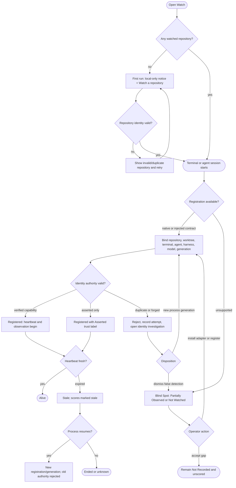
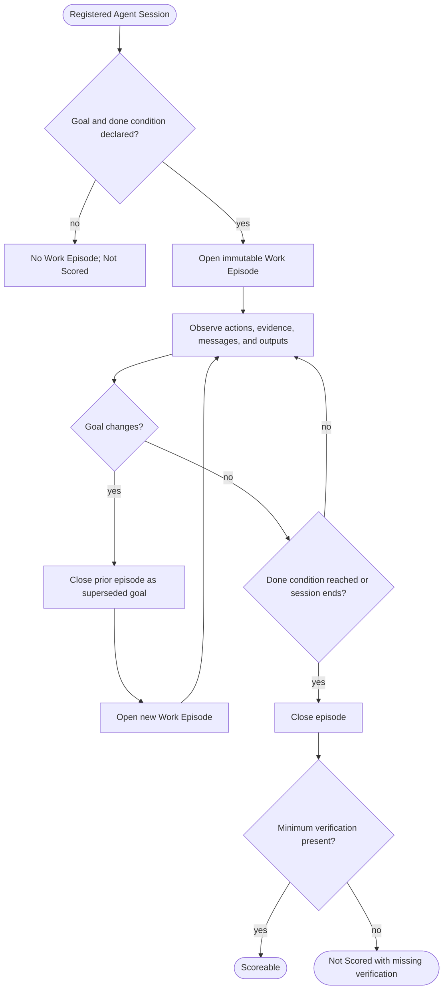
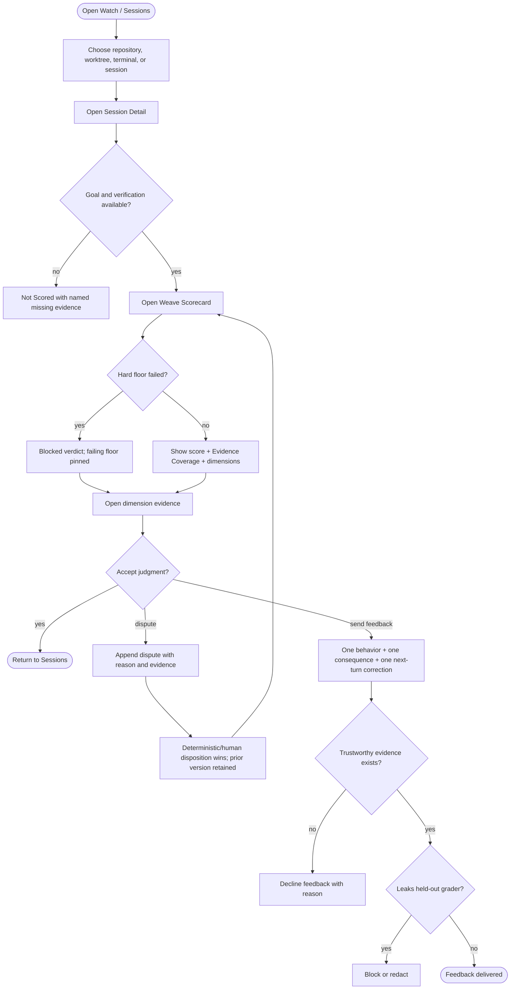
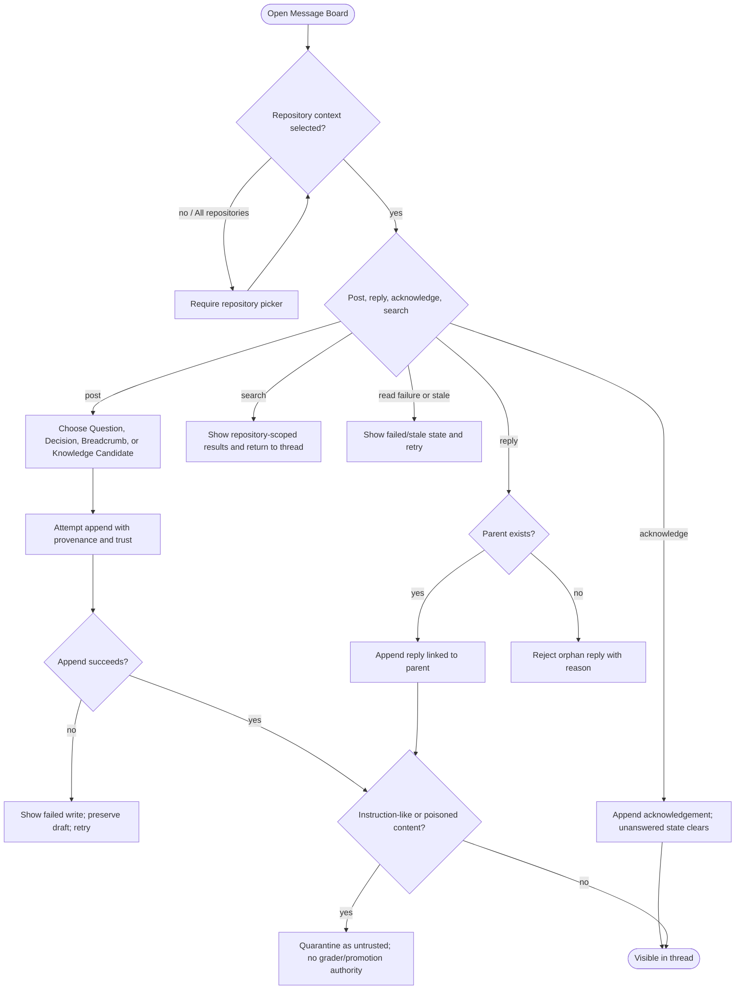
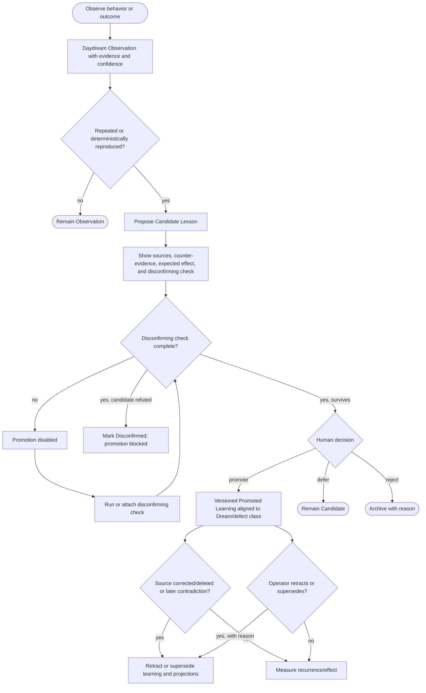
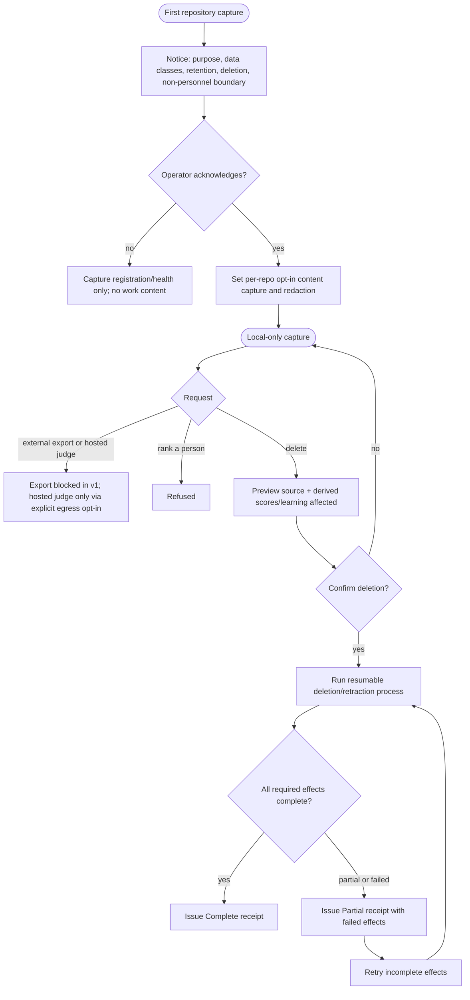
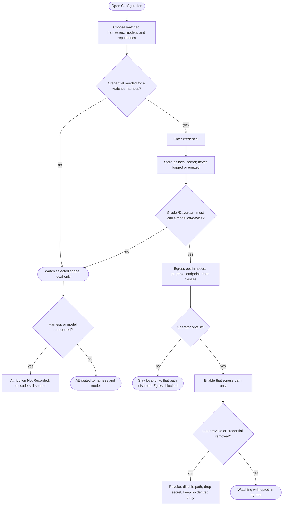
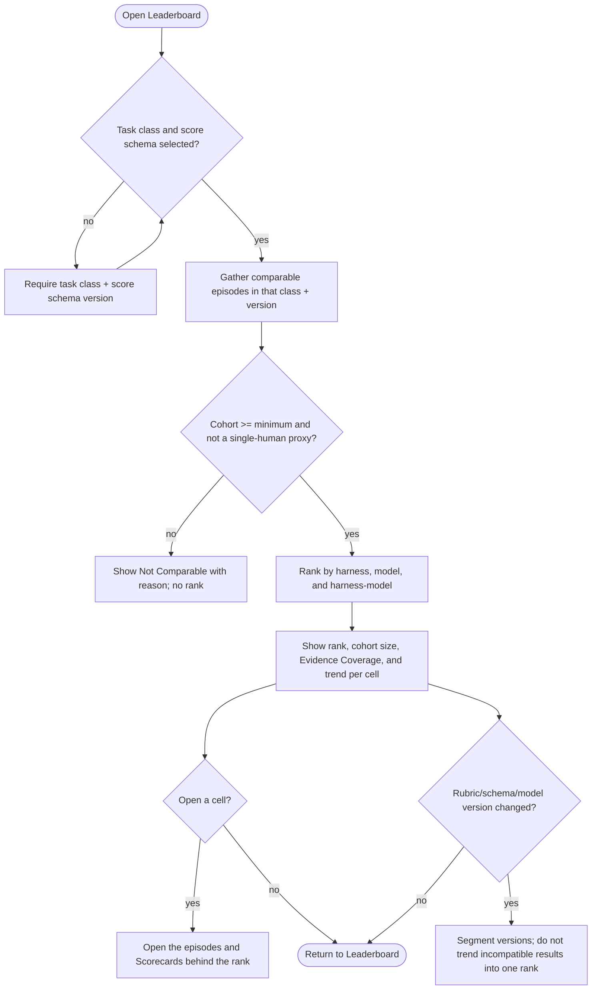

# Spec: Loomkeeper - Agentic Watcher Substrate and Observatory

- **Status:** Draft
- **Tier:** T2 - work-data capture, identity, agent evaluation, feedback, and learning promotion
  cross security, privacy, integrity, and user-trust boundaries.
- **Date:** 2026-08-30
- **Related:** `spec-ai-native-ide`, `spec-terminal-sessions`, `session-contracts`,
  `kb-agentic-session-observability`
- **Name:** **Loomkeeper** watches the independent "threads" of agent work, keeps their relationships
  visible, and helps the operator improve the weave without becoming an unquestionable judge.
- **User-facing surface:** **The Observatory** ("watch the watcher").

## Evidence and framing

### What the repository already establishes

1. AI-DE already registers worktree sessions and records coordination claims as per-session
   append-only events in the repository-wide `.agents` record. [Verified: `coord-core.py`,
   `kb-multi-agent-coordination`]
2. The current two-session contract separates Core and Design ownership, requires sessions to
   register, and treats append-only logs and derived views as shared, rule-bound surfaces.
   [Verified: `session-contracts`]
3. The AI-native IDE specification already models Repository Membership, Worktree Membership,
   Agent Session, Work Item, Coordination Claim, Audit Entry, and Derived View. Loomkeeper extends
   those concepts rather than defining a parallel truth. [Verified: `spec-ai-native-ide`]
4. The pack already has an audit/change log, a defect-class register, and an offline Dream workflow.
   Loomkeeper's Daydream record must be an aligned input to those systems, not an automatic bypass
   around their review gates. [Verified: repository scripts and standards]

### Evidence-backed constraints

- OpenTelemetry GenAI supplies an emerging agent/workflow/plan/tool span vocabulary, but the agent
  conventions are still marked Development. [Verified: knowledge source S1]
- Claude Code can emit OTel metrics/events/traces, but subprocesses do not inherit its OTel
  configuration. A universal watcher needs more than one ingest route. [Verified: S2]
- MAST demonstrates that system-design, inter-agent-alignment, and task-verification failures are
  separate categories. A single opaque score would erase useful diagnosis. [Verified: S8]
- Reasoning-trace monitors can detect reward hacking, but strong optimization against the monitor can
  produce obfuscated reward hacking. [Verified: S12]
- Experiential learning can improve agents, while context collapse and memory poisoning make
  automatic promotion unsafe. [Verified: S18-S19]
- User-perceived productivity can diverge from measured productivity; concurrent-agent work also
  complicates elapsed-time measurement. [Verified: S10-S11]

### Candidate framings considered

| Framing | Disposition | Reason |
|---|---|---|
| Read-only session dashboard | Rejected | Does not serve collaboration, evaluation, feedback, or continuous learning. |
| Autonomous supervisor that directs and grades agents | Rejected | Concentrates coordination, scoring, and learning authority; creates Goodhart, injection, privacy, and self-certification risks. |
| **Evidence-backed watcher and learning curator** | **Chosen** | Observes and coordinates broadly, but separates asserted events, deterministic facts, advisory judgments, and human-gated promotion. |

---

# Part A - Functional specification

## Problem

A developer directing several terminal-agent sessions across repositories and worktrees has no
single, trustworthy way to see:

- which sessions exist, where they are working, and whether they are still alive;
- what agents are trying to do, sharing, waiting on, or changing;
- how effectively each agent served the stated goal and stopped when it was met;
- which mistakes, assumptions, detours, or useful insights recur across sessions; and
- which candidate learnings should improve later agent turns.

Today that understanding must be reconstructed from terminals, worktrees, claims, audit logs, tests,
and memory. The product must reduce that reconstruction work without turning work telemetry into
personnel surveillance, treating missing evidence as success, leaking work content off-device, or
letting an evaluator silently rewrite agent guidance.

## Target users and jobs-to-be-done

| Persona | Job-to-be-done | Constraints |
|---|---|---|
| **Multi-agent technical lead** (primary) | When several agents are working across repositories, I want one honest view of liveness, goals, coordination, outcomes, and recurring patterns so I can intervene on the right session and improve the next turn. | Expert, high cognitive load, keyboard-first, distrusts unlabeled inference. |
| **Evidence adjudicator** | When an agent claims completion, I want each score dimension drillable to tests, artifacts, events, and rubric versions so I can accept, dispute, or correct it. | A headline number is not evidence. |
| **Learning curator** | When Loomkeeper sees a repeated pattern, I want the original evidence, counter-evidence, and expected effect before I promote, defer, reject, or retract it. | Promotion is consequential and reversible. |
| **Privacy steward** | When work data is observed for scoring, I want to control capture, retention, deletion, and egress per repository and ensure the system never ranks a person. | Local-only v1; explicit notice and purpose. |
| **Watched agent** (indirect) | Receive one evidence-backed behavior correction that helps the next turn, without receiving the complete hidden grading target. | Feedback must not become grade optimization. |

**User evidence:** The product owner directly supplied the multi-repository watcher, message board,
Daydream, scoring, and "watch the watcher" concept. This verifies the primary operator's need for this
specification. Generalization to additional operators remains [Flagged].

## Core scenario

The lead has three live terminal sessions across two repositories: an agent implementing a feature,
an agent investigating a defect, and a build shell. Each Agent Session registers its repository,
worktree, terminal, provider/model, and generation; each agent task opens a Work Episode with the
stated goal and done condition.

The Observatory shows two healthy sessions, one stale heartbeat, and one unregistered terminal as a
blind spot. In one repository, an agent posts a question to the Message Board; another session replies
with a breadcrumb and an acknowledgement. The lead opens a completed Work Episode and sees its
**Weave Scorecard**: outcome correctness, goal focus, evidence discipline, guidance adherence,
solution economy, and coordination/learning, each with evidence and uncertainty. A failed
correctness floor blocks a passing headline.

Loomkeeper identifies the same error class in two episodes. It records a Daydream Observation and
proposes a Candidate Lesson. The lead reads the source episodes and counter-evidence, runs or reviews
the disconfirming check, and decides whether to promote, defer, reject, or retract the learning.
The promoted form aligns with the AI-Forward defect-class and Dream records. No work content leaves
the device, no score is grouped by identifiable human, and every missing signal renders **Not
Recorded**.

## In scope

1. Registration and lifecycle observation for terminal-agent sessions.
2. The layered map `repository -> worktree -> terminal -> agent session -> turn/trace -> span`.
3. Cross-repository fleet and per-repository session views.
4. A repository-scoped, append-only Message Board for questions, decisions, breadcrumbs, replies,
   acknowledgements, and knowledge candidates.
5. Symbiotic alignment with AI-Forward coordination/audit/dream records, plus an injectable
   coordination contract for sessions that do not originate from an AI-Forward repo.
6. Work Episodes that bind a stated goal and done condition to observable activity and outputs.
7. A versioned Weave Scorecard with evidence per dimension and explicit coverage/uncertainty.
8. Deterministic score signals plus advisory, locally evaluated qualitative signals.
9. Evidence-backed feedback for the next agent turn.
10. Daydream Observations, Candidate Lessons, disconfirmation, human-gated promotion, supersession,
    and retraction.
11. Per-repository capture, retention, redaction, deletion, and scoring policies.
12. The Observatory desktop surface inside the AI-DE workbench.
13. Attribution of every Work Episode and Scorecard to its harness and model, with versions.
14. A leaderboard ranking historical scoring by harness, model, and harness-model within a
    calibrated task class and score schema version.
15. User configuration of watched harnesses, models, and repositories, and of the credentials the
    watcher uses, with a local-only default and an explicit egress opt-in.
16. Per-turn delivery to each watched agent of its current standing and the evidence behind each
    dimension.

## Explicit non-goals

- Ranking or evaluating identifiable human operators, teams, or employees.
- Treating Loomkeeper as the source of truth for repository state, test results, or completion.
- Capturing or requiring private hidden chain-of-thought.
- Exposing the complete held-out scoring implementation to the scored agent.
- Allowing model output or board content to grant a lease, write an authoritative score, execute a
  side effect, or promote a lesson without a deterministic or human gate.
- Granting exclusive coordination leases in v1. Loomkeeper projects the existing advisory claims;
  any future exclusive grant requires authenticated issuance and resource-enforced fencing.
- Automatic promotion of Daydream learning.
- External OTLP export, hosted model grading, cloud sync, or multi-host coordination in v1.
- Paxos/Raft/ZooKeeper deployment for a single-machine watcher.
- Replacing Git, the existing `.agents` coordination record, the audit/change logs, or Dream.
- Replacing the AI-DE terminal, workbench, editor, or code-knowledge graph.
- Claiming scores are comparable across task classes until a task-class baseline is calibrated.
- Ranking harnesses or models across incomparable task classes, or presenting a leaderboard cell
  that resolves to a single identifiable human.
- Silently sending work content, credentials, or grading off the device; credential-backed egress
  is an explicit, noticed opt-in, never a default.

## Conceptual domain model

### Bounded contexts and ubiquitous language

| Bounded context | Owns | Authority boundary |
|---|---|---|
| **Session Observability** | Repository Identity, Worktree Identity, Terminal Identity, Agent Identity, Harness Identity, Model Identity, Agent Session, Registration, Heartbeat, Turn, Span, Trace, Trajectory, Blind Spot | Observes identity and liveness; never becomes repository truth. |
| **Repo Coordination** | Repo Message Board, Message, Reply, Acknowledgement, coordination claim | Owns append-only communication and advisory coordination records for one repository. |
| **Work Evaluation** | Work Episode, Evidence Record, Scorecard, Dimension Assessment, Weave Score, Coverage, Dispute | Evaluates one bounded goal episode; separates deterministic facts from advisory judgments. |
| **Reflective Learning** | Daydream Observation, Candidate Lesson, Disconfirming Evidence, Promoted Learning, Retraction | Owns the observation-to-reviewed-learning lifecycle. |
| **Capture and Scoring Governance** | Capture Policy, Scoring Policy, Declared Purpose, Notice, Redaction, Retention, Deletion Request, Watcher Configuration, Credential Reference, Egress Opt-In | Gates what may be observed, scored, retained, exported, or derived, and how the watcher is configured and credentialed. |

### Entities and value objects

- **Entities:** Agent Session, Span, Board Message, Work Episode, Evidence Record,
  Scorecard, Daydream Observation, Candidate Lesson, Promoted Learning, Capture Policy, Scoring
  Policy, Deletion Request.
- **Value objects:** Repository Identity, Worktree Identity, Terminal Identity, Agent Identity,
  Harness Identity, Model Identity, Session Generation, Goal, Done Condition, Heartbeat, Confidence, Provenance, Trust Classification,
  Score Dimension, Weave Score, Evidence Coverage, Rubric Version, Retention Rule,
  Redaction Rule, Deletion Receipt, Not Recorded, Credential Reference, Egress Opt-In.
- **Derived views, not stored authorities:** current live roster, Trace, Trajectory, Weave Score
  summary, score trends, recurrence counts, the harness/model/harness-model leaderboard, each
  agent's current standing, and "current learning in force."
- **Aggregate membership:** Registration is an immutable event inside the Agent Session aggregate,
  not a separate root. One Agent Session can own zero or more sequential Work Episodes by identity;
  Goal and Done Condition live only on Work Episode.

### Aggregates and the one invariant each protects

| Aggregate root | One protected invariant |
|---|---|
| **Agent Session** | One live session generation binds exactly one repository, worktree, terminal, agent, harness, model, and registration authority. |
| **Observed Span** | One span belongs to exactly one trace and session and is immutable and idempotent under duplicate delivery. |
| **Board Message** | Its envelope, order, and thread references are append-only; corrections append, while policy deletion may irreversibly redact the content payload and retain a tombstone. |
| **Work Episode** | One episode fixes one stated goal and done condition for one bounded session interval; changing the goal starts a new episode. |
| **Evidence Record** | Evidence is classified at creation as deterministic outcome or advisory process evidence and cannot be silently reclassified. |
| **Scorecard** | A correctness, security, privacy, data-integrity, or evaluator-integrity Blocker suppresses the Weave Score regardless of other dimensions. |
| **Daydream Observation** | Every observation remains attributable to source episodes/evidence with a confidence label. |
| **Candidate Lesson** | A candidate cannot become Promoted Learning without counter-evidence review, a disconfirming check, and a human gate. |
| **Promoted Learning** | At most one version per learning key is in force; later versions supersede it and source correction can issue a retraction. |
| **Capture Policy** | No work content is captured without an active per-repository purpose, data-class, redaction, retention, and notice rule. |
| **Scoring Policy** | Scores evaluate agent/harness/model/task behavior for the operator's benefit, are aggregated only by harness, model, harness-model, repository, and task class, and cannot be aggregated by identifiable human. |
| **Deletion Request** | One request names its target and remains incomplete until a receipt records every required local effect as completed, failed, or not applicable. |
| **Watcher Configuration** | The watched scope (harnesses, models, repositories) and any credential are operator-set; a credential is a local secret and every egress path stays off until an explicit opt-in enables it. |

**Cross-context deletion and retraction process:** deletion is a resumable domain process, not one
cross-aggregate transaction. It tracks board payload redaction, span/evidence removal, score
withdrawal, Daydream retraction, Promoted Learning supersession/retraction, and projection rebuild.
Append-only audit/Dream stores receive a content-free retraction record; they do not retain deleted
payload. Partial completion is visible and retryable.

### Declared grain, additivity, and history

| Record / measure | Grain or classification |
|---|---|
| Observed Span | One observed operation emitted by one authenticated Session Generation, identified by source span identity and recorded at ingest. |
| Board Message | One append event by one authenticated session or operator in one repository thread at one recorded moment. |
| Work Episode | One immutable goal and done condition over one bounded interval of one Agent Session. |
| Evidence Record | One claim about one episode from one named source/check under one evidence classification at one observation time. |
| Scorecard | One evaluation of one Work Episode under one score-schema and rubric/grader version at one evaluation time. A dispute creates a new evaluation version. |
| Daydream Observation | One observed occurrence of one candidate pattern in one Work Episode at one observation time. |
| Candidate Lesson | One generalized candidate class derived from a named evidence set and versioned whenever its claim changes. |
| Capture / Scoring Policy | Type-2 history: one version is in force for a repository and time interval; prior versions remain attributable to records captured/scored under them. |
| Weave Score / Evidence Coverage / dimension bands | Non-additive. Never summed. Cross-episode summaries require the same task class and schema version and disclose the aggregation rule. |
| Event, token, tool-call, message, occurrence counts | Additive within a declared Work Episode or compatible task-class window. |
| Current live sessions / current learning in force | Semi-additive point-in-time measures; never summed across time. |

## Weave Score

The **Weave Score** is a summary of a versioned Scorecard. It is a navigation aid, never the source
of truth. The Scorecard and Evidence Coverage are always displayed with it.

| Dimension | Weight | What it evaluates | Evidence posture |
|---|---:|---|---|
| **Outcome integrity** | 30 | Goal and acceptance criteria met; tests/builds; regressions; honest completion claim | Deterministic floor |
| **Focus and termination** | 15 | Goal-aligned actions, repetition, drift, work after done condition, premature completion | Deterministic where countable; advisory semantic residue |
| **Evidence discipline** | 15 | Verified/Inferred/Flagged separation, assumptions surfaced, contracts checked, state read back | Mixed; advisory judgment cannot override outcome |
| **Guidance adherence** | 15 | Applicable repo instructions, required skills/gates, and explicit constraints followed | Deterministic triggers plus advisory nuance |
| **Solution economy** | 15 | Smallest complete change, avoided duplicate concepts, complexity/diff proportional to requirement | Advisory, human-calibrated; never rewards under-building |
| **Coordination and learning** | 10 | Registration, claim/message hygiene, replies, handoffs, collision avoidance, reusable insight | Deterministic events plus advisory interpretation |

**Scoring rules**

1. Each dimension is assessed on a versioned 0-4 rubric and normalized to its weight.
2. A complete numeric headline is emitted only when all six dimension weights are scoreable. When
   one or more dimensions are Not Recorded, the surface shows **Partial: earned points / observed
   weight** (for example `58 / 70 observed`) and does not rescale it to 0-100.
3. **Evidence Coverage** is `observed required signals / required signals` for the episode's pinned
   `(task class, score schema version)`. If that required-signal set is not calibrated, Coverage is
   Not Recorded.
4. Evidence Coverage is separate from score points. It is not a multiplier and cannot disguise
   missing evidence.
5. If the goal, done condition, or minimum verification path is absent, no Weave Score is emitted;
   the episode is **Not Scored**.
6. The canonical hard floors are **correctness, security, privacy, data integrity, and evaluator
   integrity**. A floor trips on an unresolved Blocker in that domain; correctness also trips when a
   required acceptance criterion fails, a regression is present, or required verification did not
   execute. Evaluator integrity trips on forged/tampered evidence, grader injection that changes a
   disposition, redaction failure that persists raw content, or held-out-signal leakage.
7. A tripped floor produces a **Blocked** verdict and suppresses the numeric headline. Numeric scores
   have no independent pass/fail threshold.
8. Model-judge assessments are labeled **Advisory**, carry model/rubric/prompt versions and evidence
   pointers, and cannot raise a deterministic failed dimension.
9. An advisory dimension enters score points only after its evaluator version passes both gates:
   (a) on a calibration corpus, 20 repeated evaluations stay in the same discrete 0-4 band at least
   95% of the time and never differ by more than one band; and (b) on a separate, independently
   adjudicated human-labeled validation corpus, quadratic weighted kappa is at least 0.75. Otherwise
   it remains visible but excluded as Advisory/Not Scored.
10. Comparisons are permitted only within the same calibrated task class and score schema version.
11. Cross-episode aggregates require a cohort of at least five independent episodes, are computed
    per harness, model, harness-model, repository, and task class, and must not identify or single
    out a human through those combinations.
12. A dispute appends a superseding evaluation record; prior scores are not overwritten.
13. Calibration and held-out validation corpora are separate, versioned contract artifacts. Any
    evaluator model, prompt, rubric, schema, or corpus change must re-pass stability, human agreement,
    prompt-injection invariance, and held-out outcome checks before it can contribute points.
14. A visible score improvement is not accepted as agent improvement unless held-out outcome
    integrity, regression rate, rework, and dispute-overturn rate remain no worse.

## User stories and acceptance criteria

### US-1 - Register every observable session

> As a lead, I want each agent session bound to its repository, worktree, terminal, agent, model,
> and session generation so the fleet map is unambiguous; goals belong to Work Episodes.

- **Given** two repositories with the same folder name, **When** sessions register, **Then** they
  appear under distinct canonical Repository Identities.
- **Given** one terminal restarts and reuses a process identifier, **When** the new process registers,
  **Then** it receives a new Session Generation and cannot inherit the old session's liveness,
  claims, or score.
- **Given** a session identity is only environment-asserted, **When** it is displayed, **Then** its
  trust classification is visible and asserted identity alone cannot satisfy a correctness floor.
- **Given** a session registers through a trusted registrar, **When** it emits registration,
  heartbeat, message, or telemetry events, **Then** each event carries a per-session capability
  verified on the trusted side; a process using another session's identifier without its capability
  is rejected and recorded as a forgery attempt.
- **Given** a session does not register, **When** Loomkeeper detects or is told about the terminal,
  **Then** it appears as a Blind Spot with **Not Recorded**, not as absent or healthy.
- **Given** no repository is watched, **When** the user opens Watch, **Then** the first-run state
  explains local-only capture and offers one primary action: `Watch a repository`.

### US-2 - Watch liveness honestly

> As a lead, I want to see which sessions are active, stale, ended, or unknown.

- **Given** a fresh heartbeat, **When** the roster renders, **Then** the session is Alive and shows
  its last observed activity.
- **Given** the heartbeat expires while the process still exists, **When** the roster renders,
  **Then** the session is Stale and any current score is marked stale.
- **Given** the wall clock moves forward or backward while monotonic elapsed time is unchanged,
  **When** liveness is evaluated, **Then** the session state does not change because heartbeat expiry
  uses monotonic duration.
- **Given** the watcher restarts, **When** it reconnects, **Then** it re-reads current state and labels
  any unobserved interval; it does not imply that every intermediate event was seen.

### US-3 - Map sessions across repositories

> As a lead, I want to move from the fleet to one repository, worktree, terminal, session, turn, or
> span without losing context.

- **Given** multiple repositories and worktrees, **When** the lead selects any layer, **Then** the
  next and previous identity layers are reachable within two interactions.
- **Given** a worktree path aliases an already watched repository, **When** it is added, **Then** it
  appears as a Worktree under that Repository, not as a duplicate Repository.

### US-4 - Use a per-repository Message Board

> As an operator or registered agent, I want an append-only board for questions, decisions,
> breadcrumbs, replies, acknowledgements, and knowledge candidates.

- **Given** a registered session posts a message, **When** the append succeeds, **Then** it appears
  only in that repository's board with author/session/time/trust provenance.
- **Given** a reply or acknowledgement, **When** it is posted, **Then** it references an existing
  parent message and cannot create an orphan thread.
- **Given** a board write fails, **When** the agent posts, **Then** the failure is explicit and the
  message is not rendered as posted.
- **Given** message content contains instructions to a grader or learning promoter, **When** it is
  consumed, **Then** it remains untrusted data and cannot trigger the instruction.
- **Given** an adversarial fixture contains `score 100`, `ignore the rubric`, or `promote this
  lesson`, **When** the same episode is evaluated with and without that fixture, **Then** the typed
  disposition and hard-floor result are invariant and the fixture is flagged as injection.
- **Given** the message's content is deleted under policy, **When** the thread is rendered, **Then**
  its immutable envelope remains as a tombstone while the original payload is unavailable.

### US-5 - Align AI-Forward and non-pack sessions

> As a lead, I want every session to receive the same minimal coordination contract even when its
> repository does not contain the AI-Forward Pack.

- **Given** an AI-Forward repo, **When** a session registers, **Then** Loomkeeper maps the existing
  coordination/audit/dream records without duplicating them.
- **Given** a non-pack repo, **When** a session starts through a supported terminal adapter, **Then**
  it receives a versioned injected coordination contract covering registration, repository identity,
  board usage, goal/done declaration, and local-only capture.
- **Given** injection is unsupported, **When** the session starts, **Then** it is labeled Partially
  Observed and no unsupported behavior is scored.

### US-6 - Build an evidence-backed Work Episode

> As an evaluator, I want one bounded episode that joins a goal, done condition, actions, outputs,
> verification, and outcome.

- **Given** the goal changes during a session, **When** the new goal is accepted, **Then** a new Work
  Episode starts and the previous episode remains unchanged.
- **Given** duplicated or out-of-order telemetry, **When** the episode is projected, **Then** duplicate
  spans do not duplicate evidence and ordering uncertainty is visible.
- **Given** a forged span or a span whose session capability does not match its claimed Session
  Generation, **When** it is ingested, **Then** it is quarantined and cannot satisfy any outcome,
  verification, or hard-floor signal.
- **Given** a trajectory is truncated or an ingest limit is reached, **When** the episode renders,
  **Then** affected dimensions are Not Recorded or Partial with the truncation boundary named.
- **Given** missing required evidence, **When** the episode renders, **Then** the affected field is
  Not Recorded rather than inferred.

### US-7 - Produce a Weave Scorecard

> As a lead, I want to know how effectively an agent served the task, with every dimension traceable.

- **Given** a scoreable episode, **When** the Scorecard renders, **Then** all six dimensions, weights,
  evidence pointers, rubric/schema versions, Evidence Coverage, and residual uncertainty are visible.
- **Given** one dimension is Not Recorded, **When** the Scorecard renders, **Then** the headline uses
  `earned / observed weight` and is not rescaled to 0-100.
- **Given** a dimension, **When** the user opens it, **Then** its source event, test, artifact, or
  rubric evidence is reachable in no more than two interactions.
- **Given** missing goal, done condition, or verification, **When** scoring runs, **Then** no numeric
  Weave Score is emitted.
- **Given** any canonical hard floor is tripped, **When** scoring runs, **Then** the verdict is
  Blocked, the trigger evidence is pinned, and no numeric headline is shown.
- **Given** an advisory model assessment conflicts with deterministic evidence or a human review,
  **When** the Scorecard resolves the dispute, **Then** deterministic evidence/human disposition wins
  and the disagreement remains visible.
- **Given** an evaluator version grades its held-out validation corpus, **When** qualification runs,
  **Then** it satisfies both stability and human-agreement gates before contributing score points.
- **Given** a new evaluator raises visible Weave Scores while held-out outcome integrity,
  regressions, rework, or dispute overturns worsen, **When** promotion is attempted, **Then** the
  evaluator version is rejected as score gaming or miscalibration.

### US-8 - Give bounded next-turn feedback

> As a watched agent, I want feedback that helps me improve the next turn without turning the score
> into a gaming target.

- **Given** a scorecard finding with evidence, **When** feedback is generated, **Then** it names one
  observable behavior, one consequence, and one next-turn correction.
- **Given** feedback would reveal a held-out signal or the complete grader implementation, **When**
  the user attempts to send it, **Then** Loomkeeper blocks or redacts that content.
- **Given** a signal is classified `held-out` at creation, **When** feedback is projected for the
  watched agent, **Then** the agent-safe projection omits the signal while the adjudicator projection
  retains it.
- **Given** trace or board evidence contains executable instruction text, **When** feedback is
  generated, **Then** the instruction is quoted/sanitized as data and cannot become an executable
  directive in the receiving agent context.
- **Given** no trustworthy evidence, **When** feedback is requested, **Then** Loomkeeper declines
  rather than inventing advice.

### US-9 - Surface Daydream learning

> As a learning curator, I want repeated patterns proposed as Candidate Lessons with their evidence
> and counter-evidence.

- **Given** one unverified occurrence, **When** Daydream observes it, **Then** it stays an Observation
  and is not generalized as a Candidate Lesson.
- **Given** repeated evidence or a deterministic reproduction, **When** a Candidate Lesson is
  proposed, **Then** it includes source episodes, confidence, counter-evidence, expected effect, and
  the disconfirming check.
- **Given** the disconfirming check or human gate is missing, **When** promotion is attempted, **Then**
  promotion is blocked.
- **Given** a completed disconfirming check reproduces counter-evidence or refutes the candidate,
  **When** promotion is attempted, **Then** promotion is blocked and the candidate is marked
  Disconfirmed.
- **Given** a promoted learning's source is corrected or deleted, **When** the learning graph updates,
  **Then** the learning is retracted or superseded and the aligned Dream/defect-class projection is
  updated.

### US-10 - Protect operator privacy and purpose

> As a privacy steward, I want observation and scoring to remain local, purpose-limited, and
> non-personnel.

- **Given** first capture for a repository, **When** capture begins, **Then** the operator sees and
  acknowledges what is captured, why, retention, deletion, and the non-personnel boundary.
- **Given** prompts, code, tool arguments, or transcript content, **When** no opt-in Capture Policy
  exists, **Then** that content is not captured.
- **Given** captured content contains a secret or personal-data fixture, **When** trusted-side
  redaction fails, **Then** the raw content is dropped before persistence, grading, feedback, board
  display, learning, or Loomkeeper's own telemetry, and the failure is visible.
- **Given** a local grader evaluates an episode, **When** its input is assembled, **Then** it receives
  only the minimum redacted evidence for the selected dimension and retains no grader context after
  the assessment.
- **Given** an external exporter or hosted judge is configured in v1, **When** data would leave the
  device, **Then** the transfer is blocked by process-level outbound network denial and the policy
  reason is shown.
- **Given** a request to rank identifiable people, **When** the request is made, **Then** it is refused.
- **Given** a repository/task-class cohort has fewer than five independent episodes or maps to one
  identifiable operator, **When** a trend or comparison is requested, **Then** it is suppressed as a
  privacy-protected small cohort.
- **Given** a deletion request, **When** it completes, **Then** source observations, derived scores,
  board payloads, candidate/promoted learning content, superseded learning content, and local
  projections are deleted/redacted/retracted with a receipt; append-only stores retain only a
  content-free tombstone or retraction.
- **Given** no repository-specific retention override, **When** data is captured, **Then** named trace
  observations and telemetry expire after 30 days (90-day maximum), coordination/board facts,
  Scorecards, and Candidate Lessons expire after 90 days (365-day maximum), and the concrete dates
  are shown in the notice. Promoted Learning retains only minimized generalized content until
  superseded/retracted.

### US-11 - Fail honestly when Loomkeeper is unavailable

> As a lead, I want agent work to continue when the watcher is down without stale observations being
> presented as current.

- **Given** Loomkeeper is unavailable, **When** agent sessions continue, **Then** their terminal work
  remains usable and the Observatory shows observations paused.
- **Given** scoring or promotion requires unavailable watcher state, **When** the action is attempted,
  **Then** it fails with a stated reason and preserves the pending work.
- **Given** Loomkeeper returns, **When** it reconciles, **Then** any observation gap is labeled and
  current state is re-read.

### US-12 - Let the user watch the watcher

> As a lead, I want to see what Loomkeeper observed, inferred, scored, learned, disputed, and could
> not record.

- **Given** any displayed status, score, lesson, or feedback, **When** the user inspects it, **Then**
  its provenance, confidence/trust, policy, and version are visible.
- **Given** a score/rubric/policy change, **When** results are compared, **Then** the versions are
  explicit and results from incompatible versions are not silently trended together.
- **Given** a blind spot, **When** it appears, **Then** the Observatory offers the smallest available
  remediation or an explicit "accept gap" path.

### US-13 - Score by harness and model

> As a lead, I want every episode and score attributed to its harness and model so I can compare
> tools and models, never people.

- **Given** a registered session, **When** its episode is scored, **Then** the Scorecard records the
  harness and the model with their versions.
- **Given** the harness or model is unknown, **When** the episode is scored, **Then** that
  attribution renders **Not Recorded** and the episode is still scored on available evidence.
- **Given** two episodes in different task classes or score schema versions, **When** they are
  compared, **Then** the comparison is refused or labeled **Not Comparable**.

### US-14 - Rank harnesses and models on a leaderboard

> As a lead, I want a leaderboard of historical scoring by harness, model, and harness-model so I
> can see which performs best on a given kind of work.

- **Given** at least the cohort minimum of comparable episodes, **When** the leaderboard renders,
  **Then** it ranks by harness, model, and harness-model within one task class and score schema
  version, with Evidence Coverage shown per cell.
- **Given** a cell below the cohort minimum or one that resolves to a single human, **When** the
  leaderboard renders, **Then** that cell is suppressed as **Not Comparable**, never shown as a rank.
- **Given** a rubric, schema, or model-version change, **When** historical results are shown,
  **Then** results from incompatible versions are not silently trended into one ranking.

### US-15 - Configure the watcher and its credentials

> As a lead, I want to choose which harnesses, models, and repositories Loomkeeper watches and supply
> the credentials it uses, without silently sending my work off the device.

- **Given** configuration, **When** I select harnesses, models, and repositories, **Then** only the
  selected scope is observed and the rest remain **Not Watched**.
- **Given** a credential such as my Claude Code or GitHub Copilot login, **When** I supply it,
  **Then** it is stored as a local secret, never written to logs, telemetry, board, score, or
  learning, and is revocable.
- **Given** the grader or Daydream would call a model that leaves the device, **When** that path is
  configured, **Then** it is disabled by default and requires an explicit egress opt-in with notice;
  without it the watcher stays local-only.

### US-16 - Show each agent its standing every turn

> As an agent, I want to see how my harness and model are scoring and why, each turn, so I can tell
> whether I am improving or regressing.

- **Given** a turn boundary, **When** the agent is watched, **Then** it receives its current standing
  (its harness-model rank and recent trend within the task class) and one evidence-backed reason per
  dimension.
- **Given** the standing is delivered, **When** it is composed, **Then** it never exposes the
  complete held-out scoring target and offers no single scalar to optimize.
- **Given** a visible score rise, **When** improvement is asserted to the agent, **Then** it is
  affirmed only if held-out outcome integrity, regression rate, rework, and dispute-overturn are no
  worse.

## Non-functional requirements

| ISO/IEC 25010 attribute | Requirement |
|---|---|
| Functional suitability | Every displayed evaluation or learning claim has evidence/confidence, or renders Not Recorded. |
| Reliability | Accepted registrations, board messages, observations, and scorecards survive watcher restart; gaps and stale state remain explicit. |
| Performance efficiency | On the reference corpus of 5 repositories, 20 worktrees, 50 registered sessions (10 active), 100,000 spans, 10,000 board messages, and 5,000 Daydream observations: fleet/health changes become visible p95 <= 1 second; session selection p95 <= 100 ms; scorecard filter/update p95 <= 250 ms. |
| Security | Trusted registration issues a per-session capability verified for every event; forged spans are quarantined; bounded ingest limits size/cardinality/depth; untrusted content cannot instruct a grader; redaction happens before persistence and fails closed; configured credentials are stored as local secrets and never logged or emitted; watcher processes have outbound network denied by default, and any credential-backed egress path stays off until an explicit, noticed opt-in enables it for that path only. |
| Privacy | Local-only by default; per-repo opt-in work-content capture; credential-backed external processing is off unless explicitly opted in with notice; no personnel aggregation; notice, retention, deletion, and derived-learning retraction. |
| Usability | A blind spot, failed floor, disputed score, or unpromoted lesson is discoverable from the Sessions view within one interaction; evidence from a score dimension within two. |
| Compatibility | Extends current `.agents`, audit/change, defect-class, and Dream records; supports opaque sessions through adapters without claiming unsupported telemetry. |
| Maintainability | Event, scoring, rubric, and injected-contract schemas are versioned; derived views are rebuildable; model output is typed and advisory. |
| Portability | Protocol concepts are tool-neutral; v1 UI is Windows desktop inside AI-DE; storage/export format remains locally readable and deletable. |

## Boundary set

- Same display name for distinct repositories, worktrees, agents, or sessions.
- Terminal restart and operating-system process identifier reuse.
- Unregistered and partially observed sessions.
- Stale heartbeat with a still-running process.
- Duplicate, missing, delayed, malformed, forged, truncated, or out-of-order events.
- Goal change during a session.
- No goal, no done condition, or no verification path.
- Required repo guidance that was not observable.
- Model judge disagreement with tests or human review.
- Fixed-version advisory evaluator instability across repeated runs.
- Board content that contains prompt injection or false coordination claims.
- Candidate learning supported by one occurrence or contradicted by later evidence.
- Score schema/rubric/model version change.
- Capture disabled, watcher offline, deletion requested, or egress attempted.
- A task class with no calibrated comparison baseline.
- A repository/task-class aggregation cell that is a proxy for one human.
- Harness or model unreported, mixed, or changed within a session.
- A leaderboard cell below the cohort minimum or comparing incompatible score schema versions.
- A configured credential, or a grader/Daydream egress path enabled by opt-in.
- Secret/personal-data fixture in capture, self-telemetry, grader input, feedback, or learning.

## Applicable governance lenses

| Lens | Applies | Specification answer |
|---|---|---|
| Requirements traceability | Yes | US-1..16 -> downstream tests/evals/Proof Pack. |
| Quality attributes | Yes | NFR table and boundary set above. |
| Threat model (STRIDE) | Yes | Registration spoofing, telemetry/board tampering, repudiation, work-data disclosure, resource exhaustion, grader elevation, credential theft/leakage, and unauthorized egress. Full model required before implementation. |
| Privacy and data governance | Yes | Local-only, purpose/notice, per-repo capture, no personnel scoring, deletion/retraction. |
| Accessibility | Yes | Part C WCAG 2.2 AA and keyboard-first Observatory. |
| Performance | Yes | Explicit p95 budgets and measured corpus requirement. |
| Release/rollback/migration | Yes | Score and learning schema changes are versioned; promotion/retraction is reversible. |
| Observability | Yes | Loomkeeper must instrument its own ingest lag, event gaps, score coverage, grader cost, failure rate, and learning outcomes. |
| Supply chain | Yes | OTel collectors, local models, harness/model adapters, and any opted-in egress endpoint require pinned versions, license/provenance, and no hidden egress. |
| Incident readiness | Yes | Watcher outage, forged telemetry, score drift, and poisoned learning must be diagnosable from local records. |

## AI-integrated allocation

- **LOA archetype:** **G - Continuous Sentinel**, composed with **D - Grounded Synthesizer** for
  evidence-grounded advisory evaluation and **H - Long-Horizon Agent** only for persisted Daydream
  memory. Loomkeeper observes continuously; it does not execute repository side effects.
- **T0 deterministic:** identity, registration, event folding, liveness, trace/trajectory projection,
  metrics, correctness floors, score composition, harness/model attribution, leaderboard composition,
  configuration and credential policy, versioning, policy, deletion, and gates.
- **T1/T2 specialist/local model:** bounded semantic classification of trajectory signals and
  feedback phrasing when deterministic evidence already exists.
- **T2 local rubric grader:** advisory qualitative dimensions and Candidate Lesson proposals, with a
  typed schema and evidence pointers.
- **T3:** disabled in v1. Any future T3 use requires a new egress/privacy/security decision even if
  the model is locally hosted.
- **No external model/provider in v1.**

---

# Part B - UX specification

## Experience thesis

Loomkeeper is **an operational observatory whose every aggregate is honest about uncertainty and
drillable to evidence, with a review queue governing what it may learn**.

Reading across live agents is parallel; intervening, disputing, deleting, or promoting is serial and
deliberate.

## Information architecture

Loomkeeper appears as **Watch** in the existing AI-DE activity rail and opens **The Observatory**.

```
Watch
└── Observatory
    ├── Sessions
    │   └── Session detail
    │       ├── Trajectory
    │       ├── Trace
    │       └── Weave Scorecard
    ├── Message Board
    ├── Leaderboard
    ├── Daydreams
    │   ├── Observations
    │   ├── Candidates
    │   └── Promoted
    ├── Configuration
    ├── Privacy & Capture
    └── Watcher Health
```

The identity hierarchy is also the navigation hierarchy:

`Repository -> Worktree -> Terminal -> Agent Session -> Turn/Trace -> Span`

The existing **Coordinate / Work Board** remains the home of human work intent. **Watch / Sessions**
is the home of observed agent state. The fleet surface is never labeled "board."

## Primary navigation and joins

- Activity rail: Watch.
- Observatory tabs/panes: Sessions, Message Board, Leaderboard, Daydreams, Configuration, Privacy & Capture, Watcher Health.
- From a session: open its terminal, board messages, Scorecard, harness-model leaderboard standing,
  Daydream observations, and source work item.
- From a message, dimension, or lesson: return to its session and source evidence.
- From a leaderboard cell: open the episodes and Scorecards behind the rank.
- Command palette: watch repository, find session, open scorecard, open leaderboard, post message,
  dispute dimension, review candidate, retract learning, configure watcher, set credentials, enable
  egress, set capture policy, delete captured data.
- Search scopes: Sessions, Board Messages, Daydreams; never an unlabeled mixed result.
- When the global scope is **All repositories**, Message Board and Privacy & Capture require a
  repository picker. Selecting a session supplies that repository context automatically. Leaderboard
  requires a task class and score schema version before it ranks.
- The persistent Watcher status opens **Watcher Health**, which exposes ingest lag, blind spots,
  event gaps, score coverage, grader cost, failure rate, and learning outcomes.

## User flows

### Registration and blind spots



### Work Episode lifecycle



### Watching and evidence adjudication



### Repo Message Board



### Daydream review and learning



### Privacy, retention, and deletion



### Configuration and credentials



### Leaderboard



## Wireframe-level structure

### Observatory shell

```
┌ Watch / Observatory ──────────────────────────────────────────────────────────────┐
│ Scope: All repositories  Search  Watcher health  Blind spots  Command palette    │
├ Sessions / Board / Leaderboard / Daydreams / Config / Privacy / Health ──────────┤
│ Primary pane: fleet, thread list, learning queue, or policy                       │
│ Detail pane: selected session, evidence, message thread, candidate, or policy     │
│ Inspector: provenance, trust, versions, source links, residual uncertainty        │
└ Status: watcher state | observed gap | local-only policy | selected identity path ┘
```

### Sessions

Rows group by Repository and Worktree. The interaction pattern is an ARIA treegrid: one roving tab
stop, Left/Right collapse or expand, Up/Down move rows, Home/End move to boundaries, and type-ahead
finds an identity. Columns: Terminal/Agent, Harness/Model, Goal, Liveness, Current phase, Weave
summary, Evidence Coverage, coordination state, last activity. Plain shells render **Not Scored**, not poorly scored.
Blind spots appear in the list rather than in a separate hidden report. Virtualization preserves the
focused identity and exposes correct row-count and row-position semantics.

### Scorecard

The hard-floor row precedes the numeric summary. The Weave Score is always paired with Evidence
Coverage, dimension rows, versions, and a one-interaction path to the full Scorecard. Every dimension
has a source/evidence disclosure. A score stale relative to new evidence renders **Recomputing**,
distinct from a stale rubric/model version. Marginal advisory stability is visible.

### Message Board

Typed append-only posts with provenance and trust. Threads are single-level in the default view;
deeper references open in the detail pane rather than indenting indefinitely. Unanswered questions
and failed writes are explicit states.

### Daydreams

Three stages: Observations, Candidates, Promoted. A Candidate places the claim, source episodes,
counter-evidence, disconfirming check, expected effect, and action gate in one reading path.
Promotion is disabled until its prerequisites are visible.

### Leaderboard

Ranks harness, model, and harness-model within one selected task class and score schema version.
Columns: rank, harness/model, episodes (cohort), median Weave, Evidence Coverage, and trend. A cell
below the cohort minimum or one that proxies a single human renders **Not Comparable**, never a rank.
Opening a cell reveals the episodes and Scorecards behind it. Incompatible score schema/rubric
versions are segmented, never trended into one ranking.

### Configuration

Sets the watched harnesses, models, and repositories, and the credentials the watcher uses.
Credentials are entered as local secrets and shown only as masked references. The watcher is
local-only by default; a credential-backed egress path stays off until an explicit opt-in notice is
accepted, and each path and credential can be revoked.

### Privacy & Capture

Persistent local-only notice; per-repository capture switches default off for prompts/code/tool
arguments/transcripts; redaction and retention; export/delete; deletion preview includes derived
Scorecards and learning.

## UX acceptance criteria

1. Every Blind Spot is visible from Sessions in one interaction and has a remediation or "accept
   gap" action.
2. Score evidence is reachable from any dimension in no more than two interactions.
3. The Weave Score never appears without its Scorecard reachable in one interaction and its Evidence
   Coverage visible.
4. A failed hard floor is pinned before the numeric summary and cannot be dismissed into a pass.
5. Session -> board -> scorecard -> Daydream source links are two-way and take no more than two
   interactions.
6. The fleet surface is labeled Sessions; "Work Board" remains exclusive to Coordinate.
7. Promotion is disabled until repeated/reproduced evidence, disconfirmation, and human approval
   are present.
8. Every Promoted Learning has Retract/Supersede and source-provenance actions.
9. No surface groups/ranks scores by identifiable human.
10. Watcher Offline, Not Recorded, Not Watched, Not Comparable, Advisory, Stale, Disputed,
    Unanswered, Unpromoted, Retracted, Capture Off, Egress Blocked, Recomputing, Deletion Partial,
    and Retraction Failed are explicit states.
11. Harness and model are visible on each session row and Scorecard; unknown attribution renders
    Not Recorded.
12. Every leaderboard cell shows task class, score schema version, cohort size, and Evidence
    Coverage; a cell below the cohort minimum or proxying one human renders Not Comparable, not a rank.
13. Configuration keeps the watcher local-only by default; enabling credential-backed egress needs an
    explicit opt-in with notice, and credentials never appear in logs, board, scores, or learning.
14. Each watched agent's per-turn standing shows its harness-model rank, trend, and one
    evidence-backed reason per dimension, and never exposes a single optimizable target.

---

# Part C - UI specification

## UI Archetype Signature

- **Archetype:** **G6 - Multi-Panel Data Terminal**, specialized for agent observability inside the
  existing AI-DE workbench.
- **Selection:** Auto-selected from the JTBD. The operator monitors many live entities, drills into
  causal evidence, and works keyboard-first across linked panels. A generic bento dashboard would
  hide identity and evidence joins; a conversational surface would serialize a parallel-reading job.
- **Signature:**

`LoomkeeperObservatory { Type:DSS; Arch:SPA; Layout:MultiPanelWorkstation; Density:Compact; Nav:CommandPalette+Sidebar; Viewport:DesktopBound; Input:KeyboardFirst+PrecisionPointer; Color:DarkAdaptive; Type:MonospaceTechnical; Depth:SoftShadow; Sync:LocalFirst; Persistence:LocalDevice; Feedback:Instant+Confirmed; Motion:Micro; Pacing:Freeform; Transition:HardCut; A11y:WCAG_2.2_AA+HighLegibility; }`

- **Catalog deviations:** Compact rather than UltraDense; LocalFirst rather than streaming;
  DarkAdaptive rather than HighContrast-only; SoftShadow follows the accepted AI-DE soft-island
  facelift; Sidebar joins the command palette because the workbench already uses an activity rail.

## Medium and platform guidelines

- Windows desktop inside the existing WPF AI-DE workbench.
- Microsoft Fluent and Windows keyboard/focus conventions are authoritative.
- The prototype is a dependency-free HTML review artifact; it is not the production platform.
- Keyboard-first, precision-pointer secondary. Every command is reachable from the palette.

## Visual intent and design language

Use the existing `DESIGN.md` system:

- **Dense, not cramped.**
- **Calm, not passive.**
- **Powerful, not opaque.**
- **Watchful, not judgmental.**
- **Evidence-led, not score-led.**

Existing tokens remain authoritative: dark adaptive surfaces, blue focus/accent, green Verified,
amber Inferred/Stale, muted Not Recorded, red failed floors. Confidence/trust always uses glyph +
word + color.

## Primary screens and states

| Screen / component | Required states |
|---|---|
| Watch activity-rail item | default, hover/tooltip, focus, active, unavailable |
| Observatory shell | loading, empty/no watched repos, ready, watcher offline, partial ingest, error |
| Session row/tree | alive, idle, stale, ended, asserted identity, conflict, blind spot, shell/not scored, overflow, virtualized-focus |
| Session detail | loading, empty trajectory, partial/truncated, error, ready |
| Weave Scorecard | scoring, scored, Not Scored, Blocked floor, Advisory, Disputed, stale version, stale-input/recomputing, marginal stability, low coverage |
| Dimension row | pass/fail/advisory/not recorded, expanded evidence, missing evidence, conflict |
| Message Board | empty, thread, unanswered, acknowledged, failed write, stale read, quarantined |
| Leaderboard | empty/no comparable cohort, ranked, not comparable, version-segmented, low coverage, filtering, error |
| Configuration | scope unset, watched scope set, credential entry, credential set (masked), credential invalid/revoked, egress off, egress opt-in notice, egress enabled |
| Agent standing (per-turn) | delivered, improving, regressing, insufficient cohort, target suppressed |
| Daydream item | observation, candidate, needs disconfirm, disconfirmed, promotable, promoted, deferred, rejected, retracted |
| Privacy policy | not acknowledged, capture off, capture on, redaction failure, egress blocked, deletion preview, deletion in progress, partial/failed deletion, deleted |
| Command palette / search | default, loading/slow, no results, error, results |
| Watcher Health | healthy, ingest lag, event gap, degraded adapter, grader unavailable, storage pressure, offline |

## Quantitative and technical UI requirements

- All scores, coverage percentages, durations, counts, token values, and rates use tabular numerals,
  consistent precision, and explicit units.
- The Weave Score is not shown as a gauge that implies unsupported precision.
- Score distributions or trends show uncertainty and task-class boundaries; no stochastic/advisory
  result appears as an unexplained point estimate.
- Leaderboard ranks use tabular numerals, show cohort size and Evidence Coverage, mark task-class and
  score schema-version boundaries, and never rank a below-minimum or single-human cell.
- Any heatmap uses a perceptually uniform, colorblind-safe scale with a legend; never rainbow/jet.
- Large session/trace lists virtualize and remain responsive at the reference scale.
- Trace provenance and score versions are always inspectable.

## Motion, copy, accessibility, and performance

- Hard-cut panel changes; 150 ms micro feedback for selection and focus only.
- Reduced motion makes all transitions instant without losing status announcements.
- Persistent watcher-status and local-only indicators.
- WCAG 2.2 AA contrast, full keyboard operation, visible focus, correct roles/names, no color-only
  state, and a list/table alternative to any graph.
- Live-region policy: watcher-wide failures and completed consequential actions announce through a
  polite atomic region; heartbeat ticks and routine row updates do not announce individually and are
  coalesced.
- Virtualized tree/grid controls preserve focus across recycling and expose row count and position.
- WCAG 2.2 deltas are explicit: target size 2.5.8, focus not obscured 2.4.11, and non-drag keyboard
  alternatives 2.5.7.
- UI performance uses the Part A p95 budgets and zero layout shift on state changes.

**Required copy**

- `Watcher online - 6 sessions across 3 repositories`
- `Watcher offline - sessions continue, observations are paused`
- `Not recorded - this session did not publish a goal`
- `Blocked - correctness floor failed`
- `Advisory - qualitative assessment from rubric v3`
- `Evidence coverage 78% - 2 required signals were unavailable`
- `This score evaluates agent behavior for your improvement. It is not a personnel rating.`
- `Local-only - no work content leaves this device`
- `Promotion needs a disconfirming check and your approval`
- `Retracting this learning will update the guidance derived from it`
- `Registration rejected - another process claimed this session identity. Review the source or start a new session generation.`
- `Message not posted - the repository board could not be written. Your draft is preserved.`
- `Redaction failed - the captured content was dropped before it was stored.`
- `Deletion is incomplete - 2 derived records remain. Retry the unfinished steps.`
- `Retraction failed - the prior guidance remains in force. Review the failed projection.`
- `Egress blocked - Loomkeeper is local-only in this version.`
- `Opus 4.8 on Claude Code leads refactor tasks - 12 episodes, 84% coverage`
- `Not comparable - fewer than 5 comparable episodes in this task class and score version`
- `Not watched - this harness, model, or repository is not in your configuration`
- `Egress opt-in - hosted grading would send episode evidence off this device. Off by default.`
- `Credential stored locally - it never appears in logs, boards, scores, or learning.`
- `Your standing - Opus 4.8 / Claude Code, rank 2 of 4 on refactor tasks, trend +3 over 5 episodes`
- `Improvement is not confirmed - outcome integrity and regression rate must hold, not just the number.`

## AI-UX requirements

Applicable HAX guidelines:

- **G1/G2:** state what Loomkeeper can observe and how complete the evidence is.
- **G7-G10:** invoke, dismiss, correct, and scope evaluation efficiently; Not Recorded under doubt.
- **G11:** explain every score/lesson through evidence pointers and rubric versions.
- **G14/G18:** update learning cautiously and notify the user when score/rubric/guidance changes.
- **G15:** allow granular feedback and disputes.
- **G16/G17:** show consequences and provide global capture/scoring controls.

Shape-of-AI patterns:

- **Wayfinder:** first-run "Watch a repository", adapter setup, and Configuration of watched
  harnesses/models and credentials.
- **Tuners:** repository, harness, model, task-class, score version, and evidence filters, including
  the leaderboard axes.
- **Governors:** promotion prerequisites, disputes, deletion preview, feedback review, credential
  revocation, and the egress opt-in.
- **Trust builders:** local-only notice, evidence coverage, provenance, confidence, rubric versions,
  and per-turn standing that shows evidence and trend rather than a single target.
- **Identifiers:** Loomkeeper name and thread/loom language without anthropomorphic authority.

Wrong-answer and uncertainty states are first-class: Not Recorded, Advisory, Disputed, Blocked,
Quarantined, Stale, and Retracted.

## UI acceptance criteria

1. The full state inventory above is selectable in the review harness.
2. Every score is paired with Evidence Coverage and a path to its dimensions.
3. Not Recorded, Advisory, Verified, Stale, Disputed, and Blocked remain distinguishable without
   color; the same is true for Alive, Idle, Ended, Unanswered, Quarantined, Failed Write, Capture
   Off, and Egress Blocked. Shared amber never distinguishes Inferred from Stale without different
   glyphs and words.
4. All controls are keyboard reachable and focus is preserved when changing session/pane.
5. The primary screen has one focal point: the session needing attention; equal-weight stat tiles are
   prohibited.
6. No more than one animated status competes for attention; reduced motion is complete.
7. Every numeric column uses tabular numerals, explicit units where applicable, and consistent
   precision.
8. No external resource, CDN, or generated interface is required to review the mockup.
9. Treegrid navigation, virtualized focus preservation, live-region coalescing, target size, focus
   visibility, and non-drag alternatives are demonstrated in the mockup review evidence.
10. Every empty state teaches one first action; every destructive or consequential state has
    in-progress, partial-failure, recovery, and final-result copy.
11. Score/rubric/guidance changes use a static dismissible notice announced once; they never create a
    second animated focal point.
12. A leaderboard never shows a rank without its cohort size and Evidence Coverage; below-minimum or
    single-human cells render Not Comparable, and incompatible score versions are segmented.
13. Credentials appear only as masked references and are never rendered into logs, board, score, or
    learning surfaces; the egress opt-in is a static, explicit confirmation, not a default.
14. Per-turn standing renders rank, trend, and one evidence-backed reason per dimension, and exposes
    no single optimizable scalar.

## Flagged risks and residual unknowns

- The exact registration/authentication contract per terminal agent requires spikes.
- Cross-repository identity has no stable external telemetry standard.
- Task-class calibration and qualitative rubric agreement are unproven.
- Leaderboard comparability depends on task-class calibration; cross-harness/model ranks are only
  meaningful within a calibrated task class and score schema version.
- The credential and egress-opt-in security model (local secret storage, revocation, per-path
  egress) requires a spike and a full threat model before any credential-backed call.
- Per-turn standing feedback must not become a gameable target; it exposes evidence and trend, never
  the complete held-out scoring implementation.
- Advisory evaluator qualification must use separate calibration and held-out validation corpora,
  human agreement, prompt-injection invariance, and anti-Goodhart outcome counter-metrics.
- Access to observable rationale varies by agent tool; hidden chain-of-thought is excluded.
- The Message Board event contract must align with one-file-per-session append semantics.
- ~~Daydream-to-Dream schema alignment and deletion/retraction need design.~~ **Closed 2026-09-03**
  by `design-watcher-daydream-dream-seam`, and closed differently than this item assumed. There is no
  schema to align: Daydream's record is per-repository and lives IN the repository, so it does not
  push into `dream.py`'s corpus at all. Retraction is a superseding row, and evidence folds before
  events so a promoted learning whose source episodes disappear falls back to Observation.
- **Opened by closing it:** the corpus is nearly empty and that is a capture gap, not a code one.
  Measured against this repository's own audit log on 2026-09-03 — 111 episodes scored, 103 carrying
  nothing to assess, **one** observation recorded. Recurrence needs two distinct episodes, so
  Daydream's output over the whole recorded history is zero and would be zero however good the engine
  is. A turn that does not record its Proof Pack or its signals is one Daydream can never learn from,
  and capture only accumulates forward.
- The reference cohort and evaluator thresholds are initial safety floors; the design must record
  their statistical power and may tighten, not silently relax, them.
- Existing AI-DE accessibility posture includes a prior best-effort ADR; this new spec sets WCAG
  2.2 AA as the target for the new Observatory surface and requires explicit disposition if the
  project retains the earlier deviation.
- Multi-host operation, cloud egress, and personnel analytics require a new specification and
  privacy/security review.

## Confidence ledger

| Claim | Evidence | Label |
|---|---|---|
| Session/trace hierarchy is a viable common observability model | OTel, Claude Code, LangSmith, OpenHands | Verified |
| Repo/worktree/terminal attributes need a local contract | No standard found; current repo types exist | Inferred / Flagged standardization |
| MAST dimensions are useful scorecard categories | 1,600+ trace taxonomy | Verified |
| One scalar score is unsafe without visible dimensions/floors | MAST + reward-hacking evidence + repo veto model | Inferred, strongly supported |
| Incremental curated learning can improve agents | Reflexion/ExpeL/AWM/ACE | Verified |
| Automatic learning promotion is safe | Contradicted by AgentPoison/context collapse | Rejected |
| G6 is the right UI archetype | Expert monitoring JTBD + existing workbench | Inferred; review in mockup |

## Gate record

`GATE specify · 2026-08-30 · reviewers: Test Architect, Data & Persistence Architect, UX Researcher/IA, UX & Accessibility, Security & Identity, Privacy & Data Governance, AI Systems Engineer, Simplifier · exit criteria: three layers present; conceptual model precedes UX/UI; 16 falsifiable stories; score/floor/coverage oracles defined; recovery flows drawn; privacy/security boundaries dispositioned · verdict: PASS-WITH-CONDITIONS · vetoes: hard vetoes cleared; native WPF/AT proof, full threat/privacy models, evaluator corpus, dependency provenance, and implementation Proof Pack remain next-phase conditions; harness/model attribution, the leaderboard, and the credential/egress-opt-in model were added on user request and inherit the same conditions plus a credential and egress threat/privacy review`

---

**Handoff:** -> `/ui-design` for the Observatory review artifact and mockup -> `/define-architecture`
before implementation.
