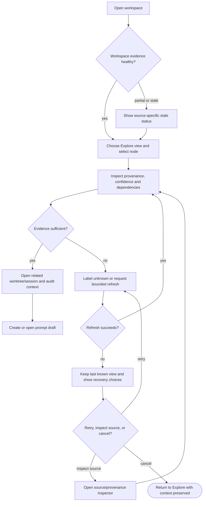
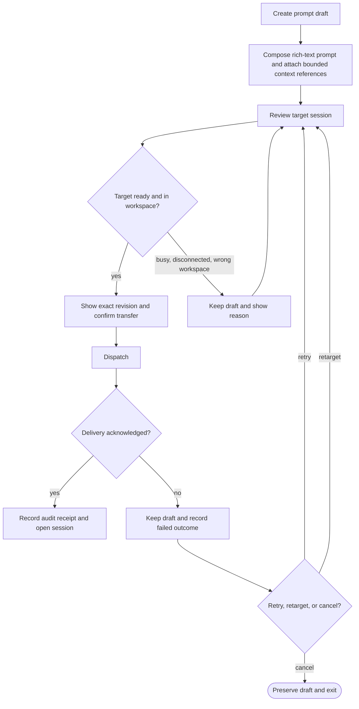
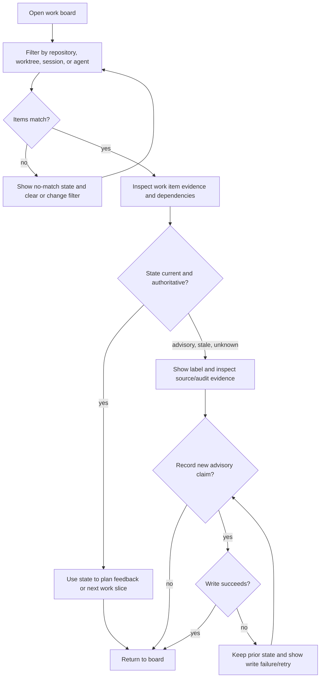
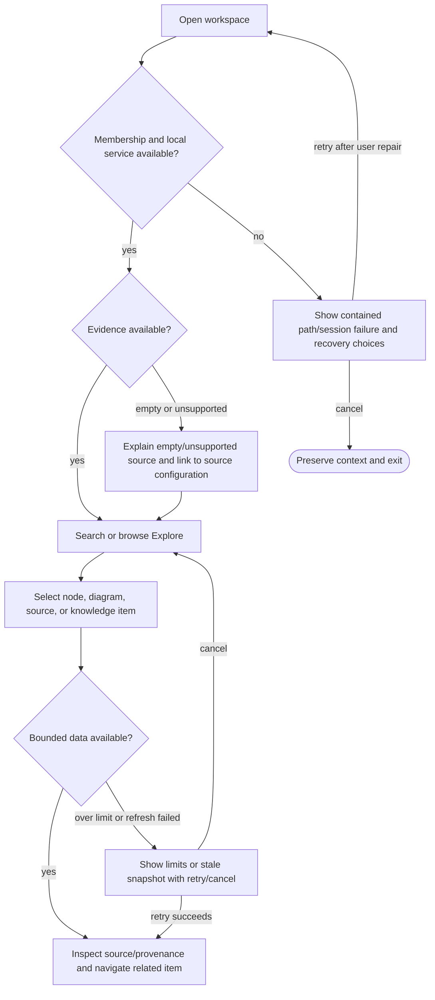
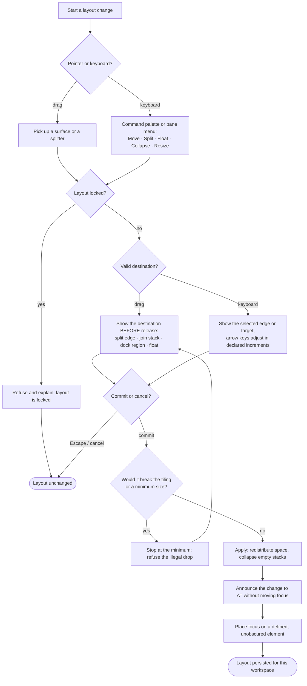
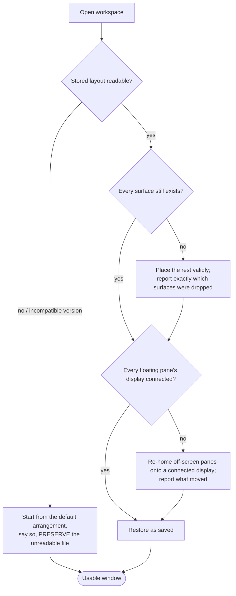
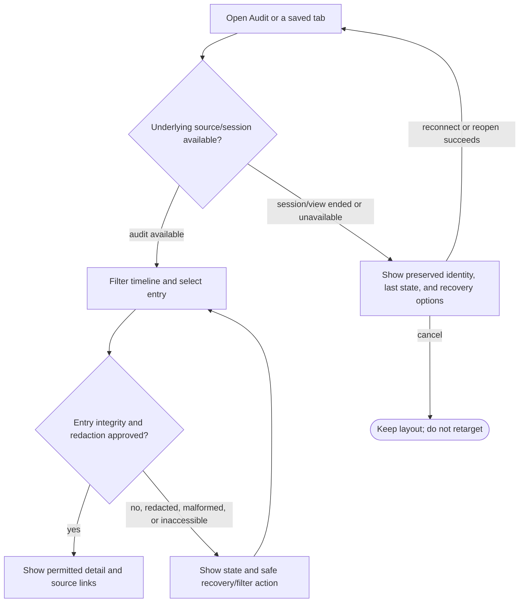

# AI-native IDE — Product specification

- **Status:** In review
- **Tier:** T2 — local work data, multi-agent coordination, agent prompt dispatch, and derived
  views cross privacy, integrity, and user-trust boundaries.
- **Seed:** [AI-Native IDE — Architecture Sketch](../knowledge/seed-material/ai-native-ide-architecture-sketch.md)
- **Grounding path:** `spec-ai-native-ide -> knowledge-hub -> {seed-ai-native-ide-sketch,
  code-knowledge-graphs, code-and-infra-extraction, mcp-and-agent-integration,
  multi-agent-coordination, ai-native-ide-shell, diagram-generation,
  domain-modeling-and-erm, microservice-interaction-visualization}`.

## Evidence and framing

### Verified constraints from current project knowledge

1. **Code-derived views, not editable diagrams, are the product boundary.** The knowledge hub
   records that the durable thesis is *code authoritative; diagrams and visualizations are
   derived views*.[^knowledge-hub]
2. **Every extracted relationship needs provenance and confidence.** Static analysis cannot
   resolve all DI, routing, ORM, dynamic infrastructure, or runtime relationships; an extracted
   view must distinguish asserted artifact facts, inferred relationships, and runtime
   observations.[^knowledge-hub]
3. **The graph store is an open decision.** The seed's Kuzu choice is invalidated because the
   project knowledge records Kuzu as archived and finds no direct replacement satisfying every
   original constraint.[^knowledge-hub]
4. **Coordination claims are not locks.** A lease without a fencing token accepted by the resource
   is advisory for efficiency, not mutual exclusion.[^knowledge-hub]
5. **MCP integration must accommodate a stateless current protocol and uneven client hooks.**
   The universal coordination signal is a repository/workspace event path; a particular CLI's
   hook support is an accelerator, not a prerequisite.[^knowledge-hub]

### Candidate comparables and reusable capability sources

| Capability | Candidate / comparable | Evidence and constraint | Confidence |
|---|---|---|---|
| Rich-text prompt composition | [Tiptap](https://github.com/ueberdosis/tiptap) | MIT-licensed, headless editor toolkit with extension points; candidate for rich prompt documents rather than a required implementation choice. | Verified |
| Block-oriented authoring | [BlockNote](https://github.com/TypeCellOS/BlockNote) | Its core and advanced packages have different licences; reuse requires package-level licence review. | Verified |
| Hosted terminal UX | [xterm.js](https://github.com/xtermjs/xterm.js) and [node-pty](https://github.com/microsoft/node-pty) | MIT repositories used as a browser-terminal reference; suitability must be spiked against the selected host. | Verified |
| Interactive graph panes | [React Flow / xyflow](https://github.com/xyflow/xyflow), [AntV G6](https://github.com/antvis/G6) | MIT candidates with different interaction-versus-scale trade-offs; no renderer is selected by this specification. | Verified |
| Generated diagrams | [Mermaid](https://github.com/mermaid-js/mermaid), [D2](https://github.com/terrastruct/d2), [Structurizr DSL](https://github.com/structurizr/dsl) | Existing project knowledge already treats diagram DSL as a projection concern. | Verified |
| Canvas and graph-navigation inspiration | [Obsidian](https://obsidian.md/), [Graphify](https://graphify.com/), [VS Code](https://code.visualstudio.com/), [Eclipse Theia](https://theia-ide.org/) | User-requested interaction references. Obsidian is a knowledge-navigation reference, not a required dependency; Graphify remains an on-device code-graph reference. | Verified (user request / project knowledge) |
| **Dockable multi-pane workbench** | [VS Code custom layout](https://code.visualstudio.com/docs/configure/custom-layout) · [Eclipse Workbench layout](https://help.eclipse.org/latest/topic/org.eclipse.platform.doc.user/reference/ref-23.htm) · [Photoshop panels](https://helpx.adobe.com/photoshop/desktop/get-started/learn-the-basics/dock-undock-panels.html) · [Premiere Pro panels](https://helpx.adobe.com/premiere/desktop/get-started/tour-the-workspace/dock-group-undock-panels.html) | User-requested exemplars. Capability matrix in **§Workbench exemplar evidence**; all four share drag-to-dock with drop feedback, tabbed stacking, floating windows, splitter resize, pane maximize, cross-region move, named layouts, and a reset command. | Verified (official docs) |

### Workbench exemplar evidence

The four exemplars agree on a **table-stakes floor** and disagree in ways that are themselves
instructive. Every claim below is from official documentation (sources in the comparables row).

| Capability | VS Code | Eclipse | Photoshop | Premiere |
|---|---|---|---|---|
| Drag-to-dock with live drop-target feedback | ✔ | ✔ five named drop cursors | ✔ blue drop zones | ✔ docking vs grouping zones |
| Tabbed stacking; reorder within the stack | ✔ | ✔ "tabbed notebook" | ✔ panel groups | ✔ drag tabs horizontally |
| Floating / detached window | ✔ | ✔ always-on-top | ✔ | ✔ Ctrl-drag |
| Splitter resize | ✔ | ✔ sashes | ✔ any panel edge | ✔ + 4-way at 3-group intersection |
| **Ganged resize — panes never overlap** | ✔ main window | ✔ sash tiling | ◑ docks tile, floats overlap | ✔ **explicit, 4 separate statements** |
| Maximize / zoom one pane | ✔ | ✔ `Ctrl+M` | ✔ double-click tab | ✔ `` ` `` |
| Collapse / minimize to icon or trim | ◑ | ✔ **Trim Stacks** | ✔ **icon docks** | ✘ |
| Move a surface between regions | ✔ incl. keyboard | ✔ | ✔ | ✔ |
| Named / saveable layouts | ◑ Profiles | ✔ **Perspectives** | ✔ Workspaces | ✔ 16 task workspaces |
| Reset to default | ✔ `resetViewLocations` | ✔ | ✔ | ✔ Reset to Saved Layout |
| Prevent docking mid-drag / cancel drag | ✘ | ✘ | ✔ Ctrl / **Esc** | ✔ Ctrl |
| Lock the layout | ◑ scoped | ✘ | ✔ **Lock Workspace** | ✘ |
| **Keyboard-operable resize** | ◑ no default keys; **broken in floating windows** | ✔ **`Alt+-` → Size → arrows** | ✘ | ✘ |

**What this establishes for AI-DE.**
1. **Ganged resize is a contract, not a nicety.** Premiere states it four separate ways — dock a
   panel and every sharing group resizes; close one and neighbours reclaim the space. The user never
   hunts for a pane hidden behind another. AI-DE adopts this as an invariant (US-9).
2. **Eclipse's `Alt+-` → *Size* → arrow-keys is the only proven keyboard resize in the field**, and
   Eclipse is the only exemplar with a complete keyboard layout story. AI-DE adopts the pattern.
3. **Eclipse's maximize/restore preserves user intent:** un-maximizing restores only the stacks that
   *maximize itself* minimized; stacks the user minimized deliberately stay minimized.
4. **A named layout is a mode, not furniture.** All four let a saved layout carry more than geometry
   (Photoshop captures shortcuts and menus; Premiere captures monitor configuration). Photoshop's
   *Capture* checkboxes — the user chooses which axes the layout owns — are the best design.
5. **The category's accessibility is poor, and that is the opportunity.** Photoshop's own conformance
   report rates SC 2.1.1 Keyboard **"Does Not Support"**; Premiere documents "limited support" for
   screen readers; VS Code's keyboard resize has no default binding and is disabled outright in
   floating windows. **No exemplar documents announcing a layout change to assistive technology.**
   AI-DE is under a WCAG 2.2 AA obligation and therefore cannot copy the category here — US-9's
   accessibility criteria are deliberately stronger than every exemplar.

[^knowledge-hub]: [`docs/knowledge/index.md`](../knowledge/index.md), “The four findings that
change the plan” and “Cross-cutting design implications,” compiled 2026-08-23.

---

# Part A — Functional specification

## Problem

A developer directing several coding agents across worktrees has no single, trustworthy way to
see how the repository's implemented architecture, domain model, data model, runtime flows,
coordination activity, prompts, audit history, and work backlog relate. Code, infrastructure,
and session artifacts exist, but the human must reconstruct their relationships manually across
terminals and disconnected tools. The product must reduce that reconstruction work without
making visual models a competing source of truth.

## Target users and jobs-to-be-done

| Persona | Job-to-be-done | Constraints |
|---|---|---|
| **Primary: multi-agent technical lead** | When directing concurrent coding sessions, I want to inspect derived architectural and work-state evidence so that I can give precise feedback without re-reading every file or terminal transcript. | Works across repositories and isolated worktrees; needs fast keyboard and terminal access; cannot trust an unlabeled inferred relationship. |
| **System/domain architect** | When assessing a change, I want to traverse domain, data, infrastructure, and flow views from the same source evidence so that I can find cross-boundary consequences. | Needs provenance, confidence, and a path back to source files. |
| **Coding-agent operator** | When preparing work for an agent, I want to compose, retain, and deliberately dispatch a prompt to the intended ready session so that unfinished thinking is not lost or sent to the wrong session. | Prompt dispatch is consequential but must remain user-confirmed. |

**User evidence:** The product owner directly supplied the eight required scenarios and the
multi-session workflow on 2026-08-24. This verifies the primary user’s reconstruction,
coordination, prompt-staging, and feedback needs for this specification. Independent usability
research with additional operators remains **Flagged** and is required before claiming that the
chosen interaction model generalizes beyond the product owner.

## Core scenario

The technical lead opens one local workspace that contains several repositories and active
agent worktrees. They select a domain aggregate, inspect its source provenance, see its persisted
data and service/infrastructure relationships, switch to an observed process flow, identify the
worktree/session currently changing a dependent component, read its audit prompt and response,
refine a staged feedback prompt, and explicitly send that prompt to the intended ready terminal
session. Every visual claim remains traceable to a repo artifact, a runtime observation, or a
clearly labeled human-authored coordination record.

## Scope

### In scope

- A local workspace that groups repositories, worktrees, agent sessions, and derived knowledge.
- Visual, navigable derived views for:
  - logical and as-built architecture from code and infrastructure artifacts;
  - class/domain models, including hierarchy, recognized entity models, aggregate roots, and
    confidence where a stereotype is inferred;
  - entity-relationship models from schema artifacts;
  - data/process flow as sequence and activity diagrams, with runtime observations distinguished
    from static derivations;
  - cross-service, cross-library, and infrastructure dependencies;
  - repository knowledge as an inspectable graph and hierarchy;
  - cross-agent coordination, session/worktree state, and work slices/tasks;
  - audit prompts and responses.
- A **dockable multi-pane workbench**: the user arranges terminals, visual views, prompt drafts and
  inspectors into resizable, dockable, floatable panes; saves and switches named layouts; and
  operates every one of those actions from the keyboard. Tabs are *part of* this model, not an
  alternative to it — several surfaces share one dock slot and are navigated by tabs.
- Rich-text prompt drafts that are staged until an explicit transfer to a ready session.
- Derived graph updates as repository/worktree artifacts and coordination evidence change.
- Reuse evaluation of existing open-source capabilities before building equivalent features.

### Out of scope

- Replacing a general-purpose source-code editor or owning code editing as a primary workflow.
- Hand-authoring or hand-editing implementation architecture, ERM, class, or flow diagrams.
- Claiming perfect semantic extraction for all languages, frameworks, dynamic DI, or runtime paths.
- Cloud synchronization, multi-user graph mutation, or autonomous cross-repository code changes.
- Treating advisory coordination claims as a correctness lock.
- Selecting a graph database, desktop framework, diagram renderer, terminal component, or extractor
  implementation; those are `/define-architecture` decisions after spikes.

## Conceptual domain model

### Bounded contexts and ubiquitous language

The product deliberately separates authorities instead of putting all durable concepts in one
model:

| Bounded context | Authority and integration language |
|---|---|
| **Workspace Registry** | Defines the local inspection scope and contains repository/worktree membership. It supplies stable workspace identities to all other contexts. |
| **Evidence and Projection** | Receives immutable source or runtime **evidence assertions** and derives relationship **claims** and non-authoritative views. It never creates facts by user editing. |
| **Agent Operations** | Owns terminal-session lifecycle, prompt drafts/revisions, dispatch attempts, and delivery receipts. It publishes session identity and readiness; it does not infer work completion. |
| **Work Coordination** | Owns human work intent and advisory coordination claims. It derives a work-state assessment from evidence; it does not store a second independent completion status. |
| **Audit Reading** | Reads repository-owned audit records through a versioned, privacy-filtered reader. It does not claim an audit record is authentic until its integrity state is known. |

A **workspace** is a local inspection scope. A **derived view** is a non-authoritative visual
projection. An **evidence assertion** is one immutable statement by one extractor or runtime
observer about one normalized relationship at one artifact revision/observation time. A
**relationship claim** groups compatible assertions about the same normalized subject, predicate,
and object. **Provenance** identifies the assertion source. **Evidence origin** is `Static` or
`Runtime`; **verification status** is `Verified`, `Inferred`, or `Unverified`; the two are never
collapsed into one confidence word. A **prompt draft** is user-authored and revisioned content not
yet dispatched. A **work item** is a human-owned work intention. A **work-state assessment** is
derived from coordination evidence. A **coordination claim** is advisory, never an exclusive lock.

### Entities, value objects, aggregates, and history

| Kind | Concept | Definition / invariant |
|---|---|---|
| Aggregate | **Workspace Registry** (root: Workspace) | Contains `RepositoryMembership` and `WorktreeMembership`. **Invariant:** a canonical, trusted-side repository/worktree identity has at most one membership in the workspace; foreign or path-escaped membership is rejected. Other contexts refer to the workspace and membership by identity only. |
| Entity | Repository Membership | A registered repository identity and approved root. |
| Entity | Worktree Membership | A registered worktree identity, repository membership, and branch state. |
| Aggregate | **Relationship Claim** (root: Relationship Claim) | Represents one normalized subject–predicate–object relationship in one workspace. **Invariant:** every displayed claim has one or more compatible, attributable evidence assertions; no assertion means `not recorded`, not a claim. An assertion may have an `Unverified` verification status. Correction creates a superseding assertion rather than overwriting prior evidence. |
| Entity | Evidence Assertion | **Grain:** one extractor/observer assertion about one normalized relation at one artifact revision or observation time. Static and runtime assertions may corroborate or conflict. |
| Value object | Provenance | Artifact/revision, source location, extractor/observer, observation time, and integrity state. |
| Value object | Evidence Origin / Verification Status | Non-overlapping classifications of acquisition and validation. |
| Aggregate | **Agent Session** (root: Agent Session) | Owns the session lifecycle and its current worktree-membership reference. **Invariant:** at one moment, an active session references zero or one active worktree; readiness is an attributed session-generation state, not a name match. |
| Aggregate | **Prompt Draft** (root: Prompt Draft) | Owns immutable revisions and dispatch attempts. **Invariant:** a delivery attempt binds exactly one immutable revision, workspace, target session identity/generation, and user dispatch key. A Prompt Revision’s grain is one saved revision of one draft at one user-recorded moment; correction creates a later revision and preserves the former revision’s identity. |
| Entity | Delivery Receipt | **Grain:** one daemon command outcome for one dispatch key. Its outcome is `PtyWriteAccepted`, `Rejected`, `TimedOut`, `Failed`, `DeliveryUnknown`, or `NotRecorded`; duplicate use of the same key cannot create a second command receipt. `PtyWriteAccepted` is terminal-byte acceptance, not agent acceptance. Terminal-stream delivery is one at-most-once attempt, so an unknown outcome requires explicit human-confirmed resend. |
| Aggregate | **Work Item** (root: Work Item) | Owns the declared slice, dependencies, and assigned identity references. **Invariant:** user intent is distinct from a derived Work-State Assessment; no stored “done” field may override evidence. |
| Entity | Work-State Assessment | **Grain:** one assessment of one work item from a named evidence set at one time. It is `Planned`, `Active`, `Blocked`, `Done`, `Conflicted`, `Stale`, or `Unknown`; `Conflicted`, `Stale`, and `Unknown` override a success-shaped status. |
| Entity | Coordination Claim | **Grain:** one append-only advisory assertion by one session/user about one work-item or resource scope at one recorded time. It identifies author, workspace, evidence basis, validity/expiry, and optional superseded claim; it cannot itself exclude other work. |
| Entity | Audit Entry | **Grain:** one source audit record, read in source order with integrity/redaction state. It is append-only except for access-controlled redaction overlays or retention deletion. |
| Entity | Derived View | A saved query/filter/layout preference. It is never an implementation fact and is rebuildable from its inputs. |
| Aggregate | **Workbench Layout** (root: Layout) | The arrangement of the workspace window. **Invariant:** the layout is always a *complete, non-overlapping tiling* of the window — every region is owned by exactly one dock stack, and a resize or a removal redistributes space rather than leaving a gap or an overlap. Floating windows are outside the tiling and are the only surfaces permitted to overlap. **A layout never contains repository truth**; it is user preference and is rebuildable from its default. |
| Entity | Layout Node | One node of the layout tree: either a **split** (an orientation plus two or more children with proportional sizes) or a **dock stack** (a leaf). A split with fewer than two children collapses into its parent — an empty region cannot persist. |
| Entity | Dock Stack | One leaf region holding one or more surfaces navigated by tabs. It carries its own state: docked · floating · collapsed · maximized · hidden. **Invariant:** a stack with zero surfaces does not exist — removing the last surface destroys the stack and collapses its parent split. |
| Entity | Surface | One thing the user works in — a terminal session, an Explore view, a prompt draft, an inspector, the work board, the audit timeline. It belongs to exactly one dock stack at a time, is reorderable within that stack, and is movable to another. **A surface's identity, workspace binding and its own loading/error/empty state are independent of where it is docked.** |
| Entity | Named Layout | A user-saved arrangement, identified by a name the user chose. It declares **which axes it captures** (pane geometry always; optionally the open surface set and the active workspace filter) so switching layouts is a deliberate mode change rather than an unpredictable reset. Built-in named layouts may be restored to their original definition. |
| Value object | Drop Target | A candidate destination computed during a move: a stack edge (split), a stack's tab area (join), a region edge (dock), or none (float). It is presented to the user **before** the move commits. |

All evidence assertions, prompt revisions, delivery receipts, work-state assessments, and audit
entries are append-only facts. There are no additive business measures in this specification.
Their current representations are derived deterministically from recorded history; corrections and
redactions carry a new attributable event rather than silently rewriting a claim.

### Domain model acceptance criteria

- **Given** a derived node or edge, **when** a user inspects it, **then** the product shall show
  its provenance and confidence, or shall label the fact `not recorded`.
- **Given** a user changes a visual representation, **when** the view is refreshed, **then** no
  hand edit shall persist as an implementation fact; only its saved query, filter, or layout
  preference may persist.
- **Given** a coordination claim is expired or lacks resource-enforced fencing evidence, **when**
  it is displayed, **then** it shall be labeled advisory and shall not prevent another session
  from working.
- **Given** an extractor emits a duplicate assertion for the same source revision, **when** it is
  ingested, **then** the resulting relationship claim shall remain idempotent and retain source
  provenance instead of duplicating its displayed relationship.

## Functional user stories and acceptance criteria

### US-1 — Inspect implemented architecture

**As a technical lead, I want architecture views generated from code and infrastructure artifacts
so that I can understand logical and as-built relationships without drawing a parallel model.**

- **Given** a workspace contains supported code and infrastructure artifacts, **when** I open an
  architecture view, **then** I can filter and expand services, components, libraries, and
  infrastructure relationships and inspect provenance/confidence for each displayed relationship.
- **Given** a source or infrastructure relationship cannot be resolved, **when** the view is
  generated, **then** it is omitted or labeled `Inferred`; it is never displayed as verified.
- **Given** an extracted source artifact changes, **when** its supported extraction completes,
  **then** an affected open derived view reports the artifact revision it represents or explicitly
  reports a stale/failed refresh. An approved fixture manifest defines the expected nodes, edges,
  filter result, and affected-view set.

### US-2 — Understand domain and data models

**As an architect, I want class and ERM views that relate domain concepts to code and data
evidence so that I can identify aggregates, entities, value objects, hierarchy, and persistence
relationships.**

- **Given** a supported codebase has recognized domain stereotypes or configured conventions,
  **when** I open a domain view, **then** I can distinguish aggregate roots, entities, value
  objects, plain types, and class hierarchy with a confidence label for every classification.
- **Given** schema artifacts contain tables, columns, and foreign keys, **when** I open an ERM
  view, **then** I can navigate relationships and inspect the source artifact behind them.
- **Given** an aggregate-to-table link cannot be established, **when** I inspect either side,
  **then** the product shall show it as an unjoined or inferred relationship rather than
  fabricate a link.
- **Given** an approved classification fixture contains positive, negative, ambiguous, and
  unsupported stereotypes, **when** its domain view is generated, **then** every type shall match
  the fixture’s classification or `Unverified` state and no inferred persistence link shall be
  promoted to verified.

### US-3 — Understand process and dependency flow

**As a technical lead, I want sequence/activity views and cross-boundary dependency navigation so
that I can reason about the impact and behavior of a change.**

- **Given** static artifact evidence supports a local process, **when** I select that process,
  **then** I can inspect a generated activity view with source provenance.
- **Given** a recorded runtime trace exists for a named scenario, **when** I open its sequence
  view, **then** runtime-observed calls are visually distinct from static relationships.
- **Given** I select a node, **when** I request its impact, **then** I receive a bounded,
  navigable dependent-neighborhood result or an explicit size-limit response. The response shall
  publish the applied node, edge, and context-byte limits, returned count, omitted count, and
  continuation action; it shall not silently load an unbounded workspace graph into a pane or
  agent context.

### US-4 — Navigate repository knowledge

**As a technical lead, I want graph and hierarchy navigation over repository knowledge so that I
can inspect decisions, terms, specifications, code facts, and their links in one place.**

- **Given** a workspace contains knowledge artifacts, **when** I use graph or hierarchy mode,
  **then** a versioned knowledge fixture defines the expected search, type/repository/confidence
  filters, bounded-neighbor expansion, backlinks, and source-location results.
- **Given** a knowledge node has no source, owner, link, or freshness information, **when** it
  is shown, **then** the missing evidence is visible as a health finding.

### US-5 — Coordinate sessions and worktrees

**As a multi-agent operator, I want to see active sessions, worktrees, claims, and work items on
one board so that I can avoid duplicate work and direct the next slice deliberately.**

- **Given** one or more sessions/worktrees emit coordination evidence, **when** I open the work
  board, **then** I can see each work item’s status, associated session, agent, worktree,
  repository, dependencies, and evidence timestamp.
- **Given** the state is incomplete, stale, or only advisory, **when** it is rendered, **then**
  the board shall show `unknown`, `stale`, or `advisory` rather than a success-shaped status.
- **Given** a user filters by a session or repository, **when** the board updates, **then** it
  shall not mutate task ownership or coordination state merely because the visual grouping
  changed.
- **Given** no evidence, stale evidence, contradictory claims, a failed evidence read, or a
  failed claim write, **when** the work board is displayed, **then** its work-state assessment
  shall respectively be `Unknown`, `Stale`, `Conflicted`, or an explicit failed-write/read state;
  the fixture’s deterministic precedence table is the oracle.

### US-6 — Stage and dispatch prompts deliberately

**As a coding-agent operator, I want rich-text prompt drafts in workspace tabs so that I can
prepare feedback and send the reviewed content to the intended ready CLI session.**

- **Given** I create a prompt draft, **when** I edit, format, or link repository context, **then**
  it remains a draft until I explicitly choose a target session and confirm transfer.
- **Given** I choose a target session, **when** the session is not ready, unavailable, or belongs
  to a different workspace, **then** transfer is blocked with an actionable explanation and the
  draft remains intact.
- **Given** I confirm a transfer to a ready session, **when** dispatch completes, **then** the
  product records the prompt revision, target session, timestamp, and delivery outcome in the
  audit trail without exposing credentials or unrelated prompt content.
- **Given** a session changes generation, becomes unavailable, a supported adapter reports
  `AgentAccepted` late, or receives a
  repeated delivery request, **when** dispatch is attempted or retried, **then** the product shall
  revalidate the immutable draft-revision/workspace/session-generation binding and return the
  documented idempotent command outcome without silently retargeting. A `DeliveryUnknown` outcome
  shall never trigger an automatic terminal resend; a human must confirm a new dispatch command.

### US-7 — Inspect audit history

**As a technical lead, I want to browse prompts and responses across sessions and worktrees so
that I can recover context and base feedback on what actually happened.**

- **Given** a repository follows the AI-Forward audit directive, **when** I select an audit
  entry, **then** I can inspect its prompt, response/summary, session, artifacts, outcome, and
  available duration without treating a missing measurement as zero.
- **Given** I search or filter audit history, **when** no matching or accessible entry exists,
  **then** the product shows an explicit empty or permission/error state rather than an empty
  success result.
- **Given** an audit entry includes sensitive content excluded by policy, **when** it is rendered,
  **then** the product redacts it according to the repository’s stored redaction state and
  identifies that content is redacted.

### US-8 — Work in one workspace chrome

**As a coding-agent operator, I want terminal tabs and independently configurable visual/prompt
tabs in one workspace so that I can inspect evidence and send contextual feedback without losing
the working session.**

- **Given** I open multiple surfaces in one or more dock stacks, **when** I switch among their tabs,
  reorder them within a stack, or move one to another stack, **then** each surface preserves its
  declared workspace context and its own loading/error/empty state — a surface's identity and state
  are independent of where it is docked.
- **Given** a terminal session ends or a view’s source becomes unavailable, **when** I return to
  its tab, **then** the tab reports the terminal/view state and offers a non-destructive recovery
  path; it does not silently attach to a different session.

### US-9 — Arrange the workbench

**As a multi-agent technical lead, I want to resize, dock, float, hide and stack the workbench's
panes and save the arrangements I use, so that I can put the evidence I need for the task in front
of me at once — and I want every one of those actions available from the keyboard.**

*The layout is user preference, never repository truth: nothing in this story may alter an
evidence assertion, and any layout may be discarded and rebuilt from its default without data loss.*

**Arranging**

- **Given** two panes share a boundary, **when** I drag that boundary, **then** both panes resize
  together and the workbench remains a complete, non-overlapping tiling — no gap appears and no pane
  is hidden behind another. Panes respect a declared minimum size; a drag that would violate it stops
  at the minimum rather than collapsing the pane.
- **Given** I drag a surface over the workbench, **when** a valid destination is under the pointer,
  **then** the product shows me *which* destination will be used **before I release** — split (which
  edge), join an existing stack, dock to a region, or float — and pressing **Escape cancels the move
  with the layout unchanged**.
- **Given** I drop a surface onto a stack's tab area, **when** the move completes, **then** it joins
  that stack as a tab; **given** I drop it onto a stack's edge, **then** the region splits and a new
  stack is created.
- **Given** I remove the last surface from a stack, **when** the move completes, **then** the empty
  stack is destroyed and its space is redistributed to its siblings — an empty region never persists.
- **Given** a pane is floating, **when** I move it, **then** it may overlap other panes and may be
  positioned on any connected display; **docked panes may never overlap.**

**Hiding, collapsing, maximizing**

- **Given** I maximize a pane, **when** I restore it, **then** the previous arrangement returns —
  and panes I had **deliberately** collapsed or hidden before maximizing **stay** collapsed or
  hidden. Restoring undoes what maximizing did, not what I did.
- **Given** I collapse a stack, **when** it is collapsed, **then** the surfaces it contains remain
  discoverable and re-openable by name; collapsing hides a pane without erasing the knowledge that
  it exists.
- **Given** I hide a whole region, **when** I reveal it again, **then** its previous contents and
  proportions return.

**Named layouts**

- **Given** I save the current arrangement under a name, **when** I later select that name, **then**
  the saved arrangement is applied, and the product states **which axes the layout captured** (pane
  geometry, and optionally the open surface set and workspace filter) so the change is predictable.
- **Given** I have modified a named layout, **when** I choose to reset it, **then** it returns to the
  arrangement last saved under that name; **given** it is a built-in layout, **then** reset returns
  it to its original shipped definition.
- **Given** any arrangement at all, **when** I invoke *Reset workbench layout*, **then** the default
  arrangement is restored — this command is always reachable and never requires editing a file.

**Persistence and recovery**

- **Given** I arrange the workbench and close the application, **when** I reopen the same workspace,
  **then** my arrangement returns, including floating panes and the display each was on.
- **Given** a saved layout references a surface that no longer exists, or a display that is no longer
  connected, **when** the layout is restored, **then** the product reports what it could not restore
  and places the remaining surfaces in a valid arrangement — it never silently drops a surface and
  never restores a pane off-screen.
- **Given** a stored layout is unreadable or was written by an incompatible version, **when** the
  workspace opens, **then** the product starts from the default arrangement, says so, and preserves
  the unreadable file rather than overwriting it.

**Keyboard and assistive technology (WCAG 2.2 AA — deliberately stronger than every exemplar)**

- **Given** any layout operation that can be performed by dragging — dock, move, split, join,
  reorder, resize, float — **when** I use only the keyboard, **then** an equivalent command exists
  and is reachable from the command palette. *(SC 2.5.7 Dragging Movements. Photoshop and Premiere
  fail this; AI-DE must not.)*
- **Given** I am resizing a pane by keyboard, **when** I select the edge to move, **then** that edge
  is **visibly indicated** and the arrow keys move it in declared increments. *(Adopted from Eclipse's
  `Alt+-` → Size → arrows, the only proven keyboard resize among the exemplars.)*
- **Given** a layout operation completes — dock, move, float, collapse, maximize, hide, layout switch,
  reset — **when** it completes, **then** the change is **announced to assistive technology without
  moving focus**. *(SC 4.1.3 Status Messages. No exemplar documents this; it is a requirement here.)*
- **Given** focus is in a surface, **when** that surface is moved, floated, collapsed or hidden,
  **then** focus lands on a defined, visible element and is **never left on an obscured or destroyed
  element**. *(SC 2.4.3, and SC 2.4.11 Focus Not Obscured — floating always-on-top panes are the
  specific hazard.)*
- **Given** keyboard focus is anywhere in the workbench, **when** I cycle panes, **then** focus moves
  predictably between stacks and the focused pane is visibly indicated.
- **Given** I lock the layout, **when** I then drag within the workbench, **then** the arrangement
  does not change. *(Adopted from Photoshop's Lock Workspace — an accessibility control for imprecise
  or unintended pointer input, not merely a stylus convenience.)*

## Verification contract and boundary traceability

This is a **pre-implementation verification plan**, not a claim that code or a Proof Pack already
exists. `/implement` must turn each row into red-first evidence and attach the resulting Proof
Pack; a pre-implementation requirement cannot truthfully claim red-observed execution.

| Requirement area | Fixture / input | Oracle | Boundary cases |
|---|---|---|---|
| US-1 architecture | Versioned supported-artifact corpus and expected graph manifest. | Exact normalized node/edge/provenance set, filter/expand result, and stale/failed refresh state. | Empty, unsupported, changed, malformed, and hostile artifact. |
| US-2 domain/data | Stereotype and schema fixtures. | Expected hierarchy/classification/link state; absent/ambiguous link cannot become verified. | Positive, negative, ambiguous, convention-only, and absent persistence link. |
| US-3 flow/dependency | Static-process fixtures and named trace fixtures. | Origin-specific relation semantics and published bounded-result response. | No trace, trace conflict, over-limit query, async/message path. |
| US-4 knowledge | Graph/frontmatter fixture. | Search/filter/neighborhood results plus required health fields. | Missing source, dangling link, stale, orphan, no match. |
| US-5 coordination | Clock-controlled event/claim fixture. | Work-state precedence and no mutation from a visual filter. | No event, expired claim, contradiction, reader/write failure, concurrent update. |
| US-6 prompt dispatch | Session-state and acknowledgement protocol fixture. | Immutable binding and one delivery receipt per dispatch key. | Busy, wrong workspace, generation change, timeout, reject, duplicate retry. |
| US-7 audit | PII-scrubbed versioned audit fixtures. | Reader state, redaction, duration-unavailable, and access behavior. | Missing, malformed, summary-only, redacted, untrusted, unavailable. |
| US-8 workspace tabs | Stable tab/session identity fixture. | No cross-workspace/session attachment and defined recovery transition. | Ended, replaced, disconnected, stale view, restored layout. |
| US-9 workbench layout | Deterministic layout-tree fixtures (nested splits, multi-surface stacks, floating panes, a saved named layout, a layout referencing a missing surface, a layout referencing a disconnected display, a corrupt layout file). | Tiling invariant holds after every operation (no gap, no overlap, no empty stack); the tree after a scripted operation sequence equals the expected tree exactly; restore reports precisely what it could not restore. | Minimum-size violation, last surface removed from a stack, maximize→restore with a pre-existing deliberate collapse, missing surface, missing display, unreadable/incompatible layout file, locked layout. |
| US-9 layout accessibility | Keyboard-only operation script; AT announcement capture. | Every drag-reachable operation has a keyboard equivalent that produces the **same** resulting tree (SC 2.5.7); each completed operation emits an announcement without moving focus (SC 4.1.3); focus after move/float/collapse/hide is on a defined, unobscured element (SC 2.4.11). | Resize at a minimum-size boundary, floating pane, collapsed stack, layout switch, reset, locked layout. |

The refresh performance oracle uses an approved fixture manifest, a documented hardware/OS and
warm/cold setup, at least 30 measurements, start/end events, p95 calculation, and a report of
failures and outliers. No benchmark result is represented as verified before that run.

## Non-functional requirements — ISO/IEC 25010

| Attribute | Requirement |
|---|---|
| Performance efficiency | Phase 1 shall refresh an affected fixture-derived view with p95 under 500ms on its approved corpus. Phase 2 shall refresh an affected supported C# view with p95 under 2 seconds on the agreed reference repository. Larger-graph navigation budgets are **Flagged** until the graph-store spike measures a representative corpus. |
| Reliability | A failed extraction, trace import, terminal connection, or audit read shall preserve the last successfully identified view state and visibly identify it as stale or failed. |
| Security | Workspace-local credentials, terminal tokens, and agent environment secrets shall not be rendered, indexed, written into prompts, or recorded in views/audit surfaces. Prompt dispatch is user-confirmed. |
| Usability | A keyboard-capable primary user shall reach any core visual surface, the work board, audit history, and prompt draft from the workspace navigation without relying on a pointer-only interaction. **This extends to arranging the workbench: every layout operation reachable by dragging shall have a keyboard equivalent producing the same result (SC 2.5.7).** |
| Compatibility | The initial product is Windows-desktop-first and must preserve repository/worktree isolation. Other platforms are explicitly out of scope until a later spec. |
| Maintainability | Extractors and visual projections shall have independently testable artifact contracts; no view is the authoritative store of its source fact. |
| Portability | Workspace data and saved user layout/query preferences shall have a documented export/recovery path before the product stores irreplaceable user knowledge. **A stored workbench layout shall carry a version and shall degrade to the default arrangement — never to a broken window — when it cannot be read.** |
| Functional suitability | Every displayed relationship shall disclose provenance and confidence; absence of evidence shall remain explicit. |

## Boundary set

- Empty repository, empty knowledge graph, first-run workspace, no audit log, and no active
  session.
- Unsupported language/infrastructure artifact and partially extractable project.
- Deleted, dirty, stale, or inaccessible worktree; active session with no coordination event.
- Large graph query or excessive impact neighborhood.
- Missing, malformed, redacted, or legacy audit entry.
- Prompt draft with a disconnected, busy, wrong-workspace, or terminated target session.
- Concurrent workspace refreshes and contradictory advisory claims.
- Layout at its limits: a pane dragged below its minimum size; the last surface removed from a stack;
  a deeply nested split; a floating pane on a display that is later disconnected; a saved layout
  naming a surface that no longer exists; an unreadable or version-incompatible layout file; a
  maximize/restore cycle over panes the user had already collapsed deliberately; a locked layout.
- Hostile repository content that attempts to influence an agent through names, generated diagrams,
  logs, source comments, or retrieved content.

## Governance lenses

| Lens | Applies | Specification response |
|---|---|---|
| Requirements traceability | Yes | Each user story has falsifiable criteria and maps to Parts B/C flows/screens. |
| Quality attributes | Yes | ISO 25010 requirements and performance budget above. |
| Threat model (STRIDE) | Yes | Terminal, MCP, prompt dispatch, repository content, local service, and visual rendering are trust boundaries; a detailed threat model is required before implementation. |
| Privacy and data governance | Yes | Repository work data, prompts, audit entries, and agent output are minimized, local-first by default, redacted on display where recorded, and never sent to a model/provider without a separately established basis. |
| Accessibility | Yes | Part C requires WCAG 2.2 AA and keyboard access. |
| Performance | Yes | Derived-view refresh target stated; graph-store and rendering targets await measured spikes. |
| Release / rollback | Yes | Workspace metadata and generated projections need a backwards-compatible, exportable migration and recovery path. |
| Observability | Yes | Refresh/extraction, graph-query, prompt-transfer, and view-failure state need source-attributed, privacy-safe telemetry. |
| Supply chain | Yes | Candidate dependency adoption requires licence, maintenance, provenance, and vulnerability review. |
| Incident readiness | Yes | Operators must see stale/failing extractors, disconnected sessions, and failed dispatches without inspecting logs manually. |

### Security and trust-boundary requirements

| Boundary / STRIDE concern | Requirement and falsifiable control |
|---|---|
| Workspace registration and path containment | Registration and every later use shall resolve trusted-side canonical filesystem identity, reject path escape/junction/symlink replacement and foreign-workspace references, and revalidate identity before privileged action. Fixtures shall attempt aliases, links, and TOCTOU replacement. |
| Terminal process → renderer | Terminal output is untrusted data. Non-display terminal control effects, unsafe hyperlinks, clipboard writes, and terminal-originated host actions are disabled or require explicit user initiation; output size/rate limits have an observable overload state. |
| Prompt dispatch | Confirmation and delivery bind immutable draft revision, workspace, target session identity/generation, and dispatch key. Delivery revalidates those values immediately before transfer and records an integrity-verifiable idempotent receipt. |
| MCP server and tool calls | Enrollment is default-deny; each endpoint identity, transport, server, and tool capability is explicitly approved. Tool authorization is evaluated at the tool boundary using the requesting workspace/user scope. Tool output and retrieved content are data, never instructions for a later action. |
| Repository, diagram, rich text, and source rendering | Analysis and rendering do not execute repository content or hooks. Parsers validate format and enforce input/resource limits. Renderers sanitize active content, unsafe URI schemes, scripts, external fetches, and hostile SVG/markup. Negative fixtures must remain inert. |
| Audit evidence | An audit record exposes source, integrity, ordering, access, and redaction state before it is treated as authoritative; redaction occurs before indexing, search, rendering, export, or model attachment. |
| Dependencies | Adoption evidence includes authoritative origin, exact version/lock, licence compatibility, SBOM, and no known-exploitable shipped transitive CVE. |

Every STRIDE threat discovered during `/design` is mitigated by a deterministic control, transferred
to a named human decision, or explicitly accepted with rationale and residual risk. Each
mitigation has a negative test observed red before the implementation is accepted.

### Privacy and data governance requirements

| Data category | Purpose and default | Retention / deletion requirement |
|---|---|---|
| Source-derived facts and provenance | Local workspace inspection only; retain normalized facts and source references, not arbitrary source/terminal text. Unknown classification is denied from prompt/context attachment. | Rebuildable from repositories. Workspace deletion purges indexes, caches, and saved projections, then records a deletion receipt. |
| Terminal output and scrollback | Display only in the live terminal. It is never automatically indexed, attached to prompts, or copied into audit/telemetry. | Ephemeral; discarded when the terminal closes unless the user explicitly exports it. |
| Prompt drafts, revisions, and delivery receipts | User-authored prompt composition and user-confirmed transfer. The product does not silently add graph/audit/terminal content. | Drafts persist locally until explicit deletion; deletion removes local revisions and context attachments. Receipts retain minimum opaque identifiers/outcome needed for audit until workspace deletion or configured retention expiry. |
| Repository audit records | Read-only inspection of an already-authoritative repository audit record, subject to source integrity/redaction state. The product does not make a second full-text copy by default. | Reader indexes only approved minimized metadata. Unclassified/redaction-unknown entries cannot be full-text indexed, exported, or attached to prompts. |
| Runtime traces, coordination claims, and work assessments | Bounded local inspection and debugging. | Retention is named per workspace before capture; deletion propagates to projections, caches, exports, and backups with a recorded outcome. |
| Telemetry | Health and performance only. Allowlisted fields use rotating opaque identifiers; no paths, prompts, responses, source snippets, terminal output, credentials, or direct personal/work identifiers. | Configured finite retention; tests seeded with PII/secrets must prove none reaches logs, traces, metrics, or export. |

The initial product is **egress-deny by default**: it does not invoke a model provider or send
workspace-derived context outside the local device. Launching or transferring a user-authored
prompt to a locally selected agent session is explicit user action only after the session is
classified as `LocalOnly`. `ExternalProcessing` and `UnknownProcessing` block rich
prompt/context transfer in version 1. The linked [privacy review](../security/ai-native-ide-privacy-review.md)
defines workspace-owner authority, repository-policy precedence, retention/deletion/export
rights, LINDDUN dispositions, and source-audit fail-closed behavior. Existing repository audit
logs may themselves contain unsafe historical content; the IDE shall not treat their existence as
a governance basis or remedy.

## AI-integrated allocation

- **Product archetypes:** Long-Horizon Agent support (H) and Tool-Mediated Constructor (C) at
  the agent integration boundary; Grounded Synthesizer (D) only for bounded workspace context
  queries.
- **Tier allocation:** T0 parses, graph queries, routing, diagram projection, provenance,
  dispatch confirmation, and deterministic validation. T1/T2 may rank/search bounded context.
  T3 is optional only for assistant explanation or synthesis, never for extraction truth,
  relationship authorization, diagram source of record, or prompt dispatch.
- **Non-determinism guard:** model output can annotate or propose; deterministic policy and
  explicit user confirmation gate every consequential action.

---

# Part B — UX specification

## Personas and experience qualities

The primary user is an expert operator working under cognitive load with multiple live sessions.
They arrive **investigative and time-constrained**, not exploratory-for-its-own-sake. The
experience must be **dense, not cramped; calm, not passive; powerful, not opaque**. The user needs
parallel reading of evidence and serial entry of commands/prompts.

## Information architecture

| Area | Contents | Primary labels |
|---|---|---|
| Workspace | Repository/worktree/session context and current health. | Workspace, Repositories, Worktrees, Sessions |
| Explore | Derived visual evidence. | Architecture, Domain, Data, Flows, Dependencies, Knowledge |
| Coordinate | Intent and work state across agents. | Work board, Claims, Slices, Conflicts |
| Compose | Human-authored, staged feedback. | Prompt drafts, Context, Target session |
| Audit | Durable history. | Timeline, Prompts, Responses, Artifacts, Decisions |

Each visual node inspection exposes the same evidence order: **what it is → confidence/provenance
→ related nodes → source/artifact location → available actions**. Global search accepts an explicit
scope selector: **Source artifacts** are code/infra/schema facts, **Knowledge** is linked
specifications/terms/notes, and **Audit decisions** are immutable log/decision records. This
protects recognition over recall and prevents a graph from becoming a visual-only dead end.

## User flows

### Inspect an architectural relationship and provide feedback

### Stage, review, and dispatch a prompt

### Coordinate work across worktrees

### Open a workspace, explore evidence, or recover

### Arrange the workbench (drag path and keyboard path converge)

### Restore a layout that cannot be fully honoured

### Search audit history and recover a tab/session

## Wireframe-level structure

- **Workspace shell (dockable workbench):** vertical primary navigation; a **layout tree** of
  resizable regions filling the window between the navigation and the status strip; a status strip
  showing workspace/extractor/session health plus the active named layout. The tree's leaves are
  **dock stacks**, each holding one or more **surfaces** navigated by a tab strip — terminals,
  visual views, prompt drafts and inspectors are all surfaces and none is privileged over another.
  Default arrangement: navigation left, a primary stack centre, an inspector stack right, a
  terminal stack below the primary. **Every region in the default arrangement can be resized,
  re-stacked, floated, collapsed or hidden** — the default is a starting point, not a frame.
- **Explore view:** query/search and filters above; graph/diagram canvas in the central region;
  accessible node list/tree alternative; persistent inspector to the side.
- **Work board:** board/list toggle, filters, and a card/list presentation where each work item
  visibly identifies its session, agent, worktree, repository, evidence age, and dependencies.
- **Prompt studio:** tabbed rich-text document, context-reference strip, target-session selector,
  explicit dispatch preview, and delivery status.
- **Audit view:** timeline/list, filters, selected-entry detail with prompt, response/summary,
  artifacts, duration, and redaction/staleness state.

## UX acceptance criteria

- A user can reach an Explore view, a prompt draft, a work-board item, and an audit entry from the
  workspace navigation using the keyboard.
- Every primary flow above has a specified stale, unavailable, error, or recovery branch; no
  unavailable evidence appears as a clean empty result.
- A selected graph node exposes its provenance and confidence before any action that dispatches
  context based on it.
- A work item card/list row identifies its session and worktree without requiring hover-only
  content or visual color alone.
- Prompt transfer requires a readable final revision and explicit user confirmation.

---

# Part C — UI specification

## UI archetype signature

- **Archetype:** **B1 · Keyboard-Velocity GUI** composed with the **`MultiPanelWorkstation` layout**
  (the G-series workstation skeleton), with embedded C1 spatial graph and B3 telemetry/health views
  where their job requires them.
- **Signature:** `Workbench { Type:OLTP; Arch:SPA; Layout:MultiPanelWorkstation; Density:Compact;
  Nav:CommandPalette+Sidebar; Viewport:DesktopBound; Input:KeyboardFirst+PrecisionPointer;
  Color:DarkAdaptive; Type:Utilitarian; Depth:Flat; Sync:LocalFirst; Persistence:LocalDevice;
  Feedback:Optimistic; Motion:Micro; Pacing:Freeform; Transition:HardCut;
  A11y:WCAG_2.2_AA; }`
- **Selection:** Auto-selected from the dominant JTBD: an expert must rapidly navigate and
  coordinate many sessions and evidence surfaces, so keyboard velocity is the right *feel*.
  But the **structural** facet is a user-arranged workstation, not a fixed master-detail —
  the operator's core job is to put several kinds of evidence side by side and rearrange them per
  task, which `Layout:MasterDetail` cannot express. Graph and diagram panes retain their own
  domain-appropriate interaction patterns inside this shell rather than forcing every task into one
  view.
- **Corrected facets (2026-08-26).** This signature previously read `Layout:MasterDetail;
  Persistence:Session`. Both were wrong for a dockable workbench and are superseded:
  - `Layout:MasterDetail` → **`Layout:MultiPanelWorkstation`.** A master-detail skeleton is a fixed
    two-region arrangement; US-9 requires an arbitrary user-arranged tree of resizable, dockable
    stacks. Building a workbench against a MasterDetail signature would regress the generated shell
    toward the mean — exactly the failure the archetype grammar exists to prevent.
  - `Persistence:Session` → **`Persistence:LocalDevice`.** US-9 requires arrangements to survive
    application restart, including floating panes and their displays. Session persistence cannot
    satisfy that, and the prior spec already carried this as an unresolved facet deviation.
  - **Not adopted from G6 (Multi-Panel Data Terminal):** `Density:UltraDense`, `Nav:CommandPalette`
    alone, `Color:HighContrast`, `Motion:None`, `Sync:Polling+Multiplayer`. G6 shares this layout
    skeleton but is a real-time streaming trading terminal; AI-DE is neither streaming nor
    multiplayer, and its density and motion posture stay B1's.
- **Facet deviation:** `Persistence:LocalDevice` covers the workbench layout, named layouts and
  session context, stored per workspace on this device only — never synchronised. Durable prompt
  drafts, audit records, and coordination evidence have their own explicit retention and export
  policies and are **not** part of the layout.

## Medium and platform guidelines

- **Primary medium:** Windows desktop workspace application with embedded visual surfaces and
  terminal tabs.
- **Guidelines:** Microsoft Fluent 2 and Windows keyboard/focus conventions for the shell; the
  Windows Terminal and VS Code interaction patterns are comparable references for tab, split,
  terminal, command-palette, and status feedback behavior.
- **Secondary accessibility surface:** every graph/diagram canvas must provide a keyboard-operable
  tree/list and source inspector equivalent.

## Visual intent and design language

- **Intent:** technical, calm, high-signal, and dense without looking like a generic dashboard.
  Opposites: noisy, decorative, cramped, or opaque.
- **Design language:** `DESIGN.md` does not yet exist; `/design` shall produce it before visual
  implementation. It shall define primitive, semantic, and component tokens; light, dark, and
  high-contrast semantic modes; typography; density; motion; and contrast audits.
- **Token discipline:** no raw visual values or copy placeholders in production UI components.
  The design-language inward linter and implementation-facing token/craft control shall be part
  of the implementation proof.

## Key screens and complete states

| Screen | Focal point | Required states |
|---|---|---|
| Workspace / terminals | Current session and its workspace identity | ready, busy, disconnected, ended, recovery available |
| Explore graph/diagram | Selected evidence node and inspector | loading, empty graph, partial/stale graph, extraction failure, node unavailable, bounded-result limit |
| Work board | Work-item state with session/worktree assignment | no work items, advisory/stale state, filter no-match, conflicting claims, update failure |
| Prompt studio | Reviewed prompt revision and target-session confirmation | empty draft, dirty/saved, ready target, busy target, disconnected target, delivery pending, delivered, failed |
| Audit explorer | Selected durable entry and its provenance | loading, empty/no-log, redacted, malformed/legacy entry, source unavailable |

### Component-state and accessibility contract

| Component | States / transitions | Keyboard and accessibility contract |
|---|---|---|
| Navigation, tab strip, panes | default, selected, dirty, loading, disconnected, closed, restored; opening/closing/reordering a tab restores focus to the triggering control or selected pane. | Semantic tab/list roles, current item state, labelled close/reorder controls, predictable focus order, keyboard shortcuts discoverable from a command palette. |
| **Dock stack** | docked · floating · collapsed · maximized · hidden · **drag-source** (being moved) · **drop-target** (candidate destination, showing *which* destination) · **at-minimum** (resize refused) · **locked** (layout frozen). Single-surface stacks still show their tab strip, so the surface is always nameable and closable. | The stack is a labelled group with an accessible name; its surfaces are a tab list; every state change is announced without moving focus; the focused stack is visibly indicated. |
| **Pane splitter** | default · hover · **keyboard-selected edge (visibly indicated)** · dragging · at-minimum · locked. | Reachable and operable by keyboard: select an edge, move it in declared increments with the arrow keys, commit or cancel. Exposes its position to assistive technology. |
| **Layout switcher** | default · open · applying · **reporting a partial restore** (a surface or display was unavailable) · error (unreadable layout, started from default). | Named layouts selectable by keyboard; the applied layout and the axes it captured are announced; a partial restore names exactly what could not be restored. |
| Graph/diagram canvas and equivalent list | loading, empty, partial, stale, over-limit, selected, unavailable, error/retry; selection and filtering synchronize with the equivalent list. | Pointer-independent node traversal, named nodes/edges/provenance, focusable selection, source-link activation, and no graph-only action. |
| Prompt editor and context references | empty, dirty, validation error, context blocked/removed, ready/busy/disconnected target, review, confirmation, pending, acknowledged, timed-out, rejected, failed. | Semantic rich-text editing surface; labelled context and target controls; confirmation dialog traps focus, states consequence, and restores focus on cancel/result. |
| Terminal | starting, ready, busy, disconnected, ended, output-overload, recovery. | Keyboard-native input; terminal status has accessible non-visual announcement; untrusted output cannot cause host actions. |
| Filters, command palette, work board, and retry controls | default, focus, no-match, loading, stale, failure, retrying, disabled, success, long-content/overflow. | Accessible names, roles, values, live status where changed, target size meeting WCAG 2.2 AA, and no color-only indication. |

## Motion, copy, accessibility, and performance

- **Motion inventory:** tab selection (150ms ease-out), local pane layout changes (200ms
  ease-out), and delivery-status changes (immediate status announcement plus optional 150ms
  indicator) are the only animated moments. Motion never blocks input; reduced-motion substitutes
  are immediate state changes with the same announcement.
- **Copy:** write concise, evidence-first status messages. Examples: `Graph is stale — Bicep
  extraction failed. View last successful snapshot`; `Session is busy — prompt remains staged`;
  `Relationship inferred from naming convention; inspect source`.
- **Accessibility:** meet WCAG 2.2 AA. The future `DESIGN.md` must measure text/non-text contrast
  in light, dark, and high-contrast modes. Automated checks and documented NVDA keyboard traces
  cover focus order/restoration, names/roles/value changes, target sizes, and graph/list
  equivalence.
- **Performance:** meet the Part A p95 refresh requirement. On the approved benchmark corpus,
  initial selected-view render shall be p95 under 2 seconds; node selection/focus response p95
  under 100ms; filter result update p95 under 250ms. Each result reports corpus revision,
  measurement environment, N, cancellation, and degraded-result behavior. Graph and diagrams
  degrade by bounded neighborhoods, filtering, summarization, and explicit size-limit states,
  never by silently omitting relationships.

## AI interaction

- **Applicable HAX guidelines:** G1/G2 (state capability and limits), G7–G11 (invoke, dismiss,
  correct, scope under uncertainty, and explain), G15–G18 (feedback, consequence, global
  control, and change notification).
- **Shape-of-AI patterns:** Wayfinders for prompt-start templates; Tuners for bounded context and
  target-session selection; Governors for dispatch preview/confirmation and pause/retarget;
  Trust builders for provenance, confidence, audit receipts, and explicit AI disclosure.
- **Wrong-answer and unsafe-context path:** users can remove a context reference, revise a draft,
  cancel a staged transfer before confirmation, and view the extraction confidence. The product
  never presents an AI-generated explanation as a verified repository fact.

## UI acceptance criteria

- Every key screen and component implements the applicable state/transition contract above; an
  automated state fixture and dependency-free review harness render each state before
  implementation approval.
- `DESIGN.md` defines primitive, semantic, and component tokens plus measured AA contrast in
  light, dark, and high-contrast modes before UI implementation begins.
- All controls, terminal actions, graph-node operations, and prompt dispatch paths are keyboard
  operable with the declared focus/role/name/value contract and meet WCAG 2.2 AA.
- A graph canvas and its equivalent hierarchy/list expose the same selected-node identity,
  provenance, navigation actions, and result-limit state.
- A user sees a prompt draft’s exact target session identity/generation, workspace, final
  revision, and dispatch consequence before confirmation; the product distinguishes
  `PtyWriteAccepted`, authenticated `AgentAccepted` (only where a supported adapter exists),
  unknown downstream outcome, inferred content, and verified repository fact.
- The interface renders `not recorded`, `Inferred`, `Observed`, `stale`, and `redacted` as
  semantically distinct visible states without relying on color alone.
- **The workbench remains a complete, non-overlapping tiling after every layout operation.** Only
  floating panes may overlap, and only deliberately.
- **A move shows its destination before it commits**, and `Escape` cancels it with the layout
  unchanged.
- **Every drag-reachable layout operation has a keyboard equivalent that produces an identical
  resulting layout** (SC 2.5.7), and each is discoverable from the command palette.
- **Keyboard resize visibly indicates the edge being moved** before the arrow keys move it.
- **Every completed layout operation is announced to assistive technology without moving focus**
  (SC 4.1.3), and focus after a move, float, collapse or hide lands on a defined, unobscured element
  (SC 2.4.11).
- **A layout that cannot be fully restored says exactly what was lost** and still produces a valid
  arrangement; an unreadable layout falls back to the default, says so, and preserves the original
  file.

---

## Flagged risks and residual unknowns

| Risk / unknown | Why it matters | Cheapest resolving action |
|---|---|---|
| Graph-store choice | The original Kuzu choice is invalid and candidate stores trade query model, embedding, licence, and .NET support. | Spike representative graph size, query patterns, update latency, export, and licence using two viable candidates. |
| Extraction fidelity | Some architecture/domain relationships are structurally invisible or convention-derived. | Define an extractor confidence contract and measure coverage/false joins on a reference repository. |
| Terminal host control | Terminal stream behavior and accessibility affect the shell’s viability. | Prototype two host/control candidates against an actual agent CLI and screen-reader/keyboard checks. |
| Prompt editor licence and data model | Rich-text candidate packages differ in extension licensing and export semantics. | Spike Tiptap and one higher-level candidate with prompt revisions, context references, and safe plain-text transfer. |
| Audit response representation | Repositories may record summaries rather than full response text, or redact sensitive fields. | Define an audit-reader contract against representative AI-Forward audit logs. |
| Coordination truthfulness | Existing claims cannot guarantee exclusion without resource-level fencing. | Specify advisory UI semantics first; identify each actual write resource that would require fencing before claiming exclusivity. |
| Scale and refresh budget | No representative node/edge count or graph interaction budget has been measured. | Benchmark the Phase 0 extractor corpus before selecting storage or renderer. |
| **Accessible docking has no proven precedent** | US-9's accessibility criteria are stronger than **every** exemplar: Photoshop's own conformance report rates SC 2.1.1 "Does Not Support"; Premiere documents no keyboard docking at all; VS Code's keyboard resize has no default binding and is disabled in floating windows; and **none of the four documents announcing a layout change to assistive technology**. Only Eclipse's `Alt+-` → Size → arrows is a proven keyboard resize. We are ahead of the field, which means no pattern to copy and no library that supplies it. | Prototype the keyboard layout-command set (move · split · float · collapse · resize) plus AT announcements against a real screen reader **before** committing the workbench phase. Verify Eclipse's and VS Code's actual announcement behaviour with NVDA first — a working precedent would let us copy rather than invent. |
| **Layout persistence across upgrades** | Arrangements are user data the product has promised an export/recovery path for; a layout format without a version has no migration hook and cannot degrade safely. | Wrap whatever the chosen shell library serializes in an owned, versioned envelope from the first release, and test restore against a mutated and an unreadable file. |
| Personal/work data | Repository files, prompts, audits, and terminal output may contain sensitive data. | Complete STRIDE and privacy review before implementation; establish local retention/redaction and any model egress basis. |

## Confidence ledger

| Claim | Evidence | Disconfirmation / limit | Label |
|---|---|---|---|
| Derived visual views must not become editable implementation truth. | Project knowledge hub’s derived-views conclusion. | User preferences/query layouts may persist, but do not alter Artifact Facts. | Verified |
| Kuzu cannot be adopted merely because the seed selected it. | Knowledge hub records its archival and the failed replacement criteria. | A future store spike can select another behind an interface. | Verified |
| Coordination leases are advisory without fencing. | Project coordination research, summarized by the knowledge hub. | A particular resource may provide fencing; that requires evidence. | Verified |
| Tiptap is a viable rich-text candidate. | Official repository and licence. | Candidate has not been tested against prompt dispatch/revision needs. | Verified for availability; Flagged for fit |
| A keyboard-velocity shell best fits the primary operator job. | JTBD analysis and B1 catalog posture. | User can override the selected archetype after reviewing this spec. | Inferred |

## Gate record

`GATE specify · 2026-08-26 (US-9 workbench amendment) · UX Researcher/IA, UX & Accessibility, Test Architect, The Simplifier, Data & Persistence Architect · criteria: layout conceptual model (tree → stack → surface) with the non-overlapping-tiling invariant; falsifiable arrange/hide/named-layout/persistence/accessibility criteria; exemplar matrix sourced from official docs; archetype facets corrected to Layout:MultiPanelWorkstation + Persistence:LocalDevice; UX flows cover the drag path, the keyboard path, and partial restore · verdict: PASS-WITH-CONDITIONS · vetoes→resolution: UX Researcher/IA PASS (drag and keyboard paths converge on one flow); Data & Persistence PASS (layout is preference, never repository truth, and is rebuildable); Simplifier PASS-WITH-CONDITIONS — accepts the capability set as table-stakes evidenced across four exemplars, but holds that named layouts and collapse-to-icon are the two most deferrable pieces if the workbench phase overruns; UX & Accessibility PASS-WITH-CONDITIONS and Test Architect PASS-WITH-CONDITIONS — both conditional on the SC 2.5.7 / 4.1.3 / 2.4.11 criteria being proven red-first against a real screen reader, since no exemplar demonstrates them and no library supplies them.`

`GATE specify · 2026-08-24 · Test Architect, Data & Persistence Architect, UX Researcher/IA, UX & Accessibility, Security & Identity, Privacy & Data Governance · criteria: conceptual model, functional fixture/oracle matrix, UX recovery flows, accessibility/state contract, STRIDE controls, and LINDDUN-lite review present · verdict: PASS-WITH-CONDITIONS · vetoes→resolution: Data & Persistence PASS; UX Researcher/IA PASS; Security, Privacy, UX & Accessibility, and Test Architect clear the specification gate subject to their named pre-implementation evidence gates.`

---

**Handoff:** `/define-architecture` after resolving the graph-store, extraction-fidelity, terminal-host,
prompt-editor, audit-reader, privacy, and coordination spikes.
