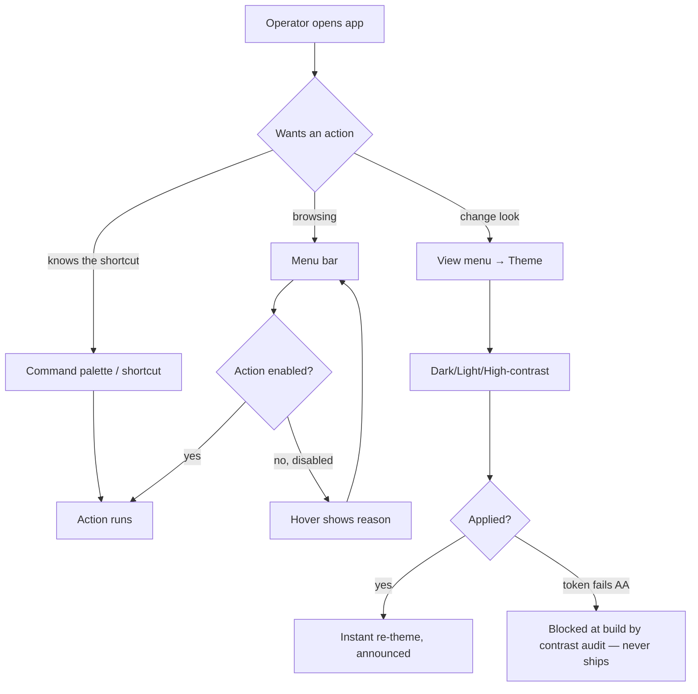

# Application Facelift — styling, icons & menu system

- **Tier:** T1 (presentation change; no new domain concept, no data/identity surface). The a11y floor keeps it above T0.
- **Grounding path:** `spec-app-facelift → spec-ai-native-ide → knowledge-hub`; evidence from
  `kb-wpf-modern-ui-styling` and `kb-ai-native-ide-shell`; builds on the existing `DESIGN.md` and
  `docs/design/phase-1-walking-skeleton.md`.

## Part A — Functional (what & why)

**Problem (solution-independent).** The current shell is deliberately *strict-flat and boxy* (1px borders, no
shadows, radii 3–8px) — correct for an evidence-first workbench, but it reads as dated next to contemporary
IDEs (JetBrains New UI / Islands, VS Code). The user wants a **modern, softer look** — rounded/soft edges,
gentle elevation — plus a **consistent icon system** and a **discoverable menu system**, *without* losing the
density, calm, or accessibility that make the workbench usable under cognitive load.

**Core scenario.** An expert operator opens AI-DE and immediately reads it as a modern, calm, professional tool:
panes are soft "islands" with subtle separation, the focused pane is obvious, actions are discoverable via a
menu bar and command palette with legible icons — and none of this has cost them a single row of evidence
density or a single contrast point.

**Personas / JTBD.** *The operator* (primary) — directs several agent sessions, reads provenance under load;
wants the tool to *feel* current and *stay* legible. *The newcomer* — needs to discover what the app can do
(menus, command palette, iconography) without memorising shortcuts.

**Non-goals.** (1) No change to what the panes *contain* or to the evidence model. (2) No move off WPF/AvalonDock.
(3) No light-mode-first redesign (dark remains default). (4) Not a full re-theme of the graph/editor pane
*interiors* (those are web-rendered; this spec covers the WPF frame — see the airspace constraint).

**Conceptual domain model.** **N/A — this feature introduces no domain concept.** It changes presentation
tokens, an icon registry, and a menu/command surface; the domain model (`conceptual-model-ai-native-ide`) is
untouched. The one new *presentation* concept — a **Command** (id, label, icon, shortcut, enabled-predicate) —
is a UI construct, specified in Part B/C, not a domain aggregate.

**User stories & acceptance criteria (Gherkin, falsifiable).**

- **US-F1 — Soft islands.** *As an operator, I want panes to read as soft, subtly-elevated islands so the app
  feels modern.*
  - `Given the workbench, When it renders, Then each docked pane has a corner radius ≥ {rounded.lg} and a resting elevation shadow, And the window itself has Windows-11 DWM rounded corners and system shadow.`
  - `Given a custom-chromed window, Then AllowsTransparency is False (DWM shadow/corners preserved) — verified by the wpf-styling-expert's clears-when.`
  - `Given any docked pane, Then no DropShadowEffect is applied over an HwndHost/WebView2 pane interior (airspace).`
- **US-F2 — Focused pane obvious.** `Given several panes, When one has focus, Then it carries a 1px accent island border AND an accessible-name announcement — focus is never colour alone.`
- **US-F3 — Icon system.** `Given any toolbar/menu/status action, Then its icon comes from one consistent icon set at one grid size, And every icon-only control has an accessible name and tooltip.`
- **US-F4 — Menu system.** `Given the operator, When they open the menu bar (or press the command-palette key), Then every primary action is discoverable with its label, icon, and shortcut, And a disabled action states why on hover.`
- **US-F5 — Density preserved.** `Given the facelift, When measured against the pre-facelift screen, Then list-row height, tab-strip height, and controls-per-screen are unchanged (softness added via radius/elevation/space-rhythm, not by growing everything).`
- **US-F6 — Contrast preserved.** `Given any softened/greyed token, Then body text still meets WCAG 2.2 AA (≥4.5:1) — softening never drops below the floor (the DESIGN.md contrast audit fails the gate otherwise).`
- **US-F7 — Themes.** `Given dark / light / Windows-high-contrast, Then the soft-islands treatment carries the same semantic roles, And confidence is glyph+word+colour in every mode.`

**ISO 25010 NFR checklist.** Usability — primary (the point). Performance efficiency — no regression to the
DESIGN.md budget (node-select→render p95 <100ms); shadows budgeted+cached so GPU stays flat. Accessibility
(usability sub) — WCAG 2.2 AA, hard floor. Maintainability — one token system, one icon registry, one command
registry; no per-control magic values. Compatibility — Windows 10/11 (DWM corners degrade gracefully on 10;
Mica gated on .NET-10/Win-11 availability). Reliability/Security/Portability — N/A (no new surface).

## Part B — UX specification (how it works)

**IA.** The chrome gains two discoverable surfaces over the existing command palette: a **menu bar**
(File · Edit · View · Graph · Model · Agents · Window · Help) grouping every command, and a **status/quick-action
strip**. The command palette (Cmd/Ctrl-K) remains the power path; the menu is the *discovery* path. Labels feed
the glossary.

**User flows (happy + alternate/error/recovery).**

**Wireframe-level structure (Skeleton).** Title bar (custom-chromed, DWM-rounded) with app menu + window
controls → menu bar row → the AvalonDock island field (panes as soft cards with 8–12px gutters) → status strip.
Icons sit left-of-label in menus, centered in icon-only toolbars, always with a name.

**UX acceptance.** `Every primary command is reachable from the menu bar in ≤2 steps`; `every disabled action
has a specified reason string`; `theme switch is instant and announced (US-F7)`.

## Part C — UI specification (how it looks)

**Archetype Signature (evolution of the existing).** The app stays the **Workbench / MultiPanelWorkstation**
(`ui-archetype-catalog.md` G6-adjacent / B-series operational), but three facets evolve:
`Depth: Flat → SoftShadow` (resting elevation on island panes), `rounded.lg 8px → 10–12px` (softer),
and `Nav: CommandPalette+Sidebar → CommandPalette+Sidebar+MenuBar`. **JTBD→archetype rationale:** the job is
still dense operational record-work (reading is parallel), so the archetype does not change *kind* — only its
surface softens toward the JetBrains-Islands register the operator recognises as modern. Deviations recorded
per grammar G9.

**Specified to `ui-interaction-design.md` U1–U20**, against `DESIGN.md` (extended by the `/ui-design` run):
- **Tokens** — new/adjusted: `rounded.lg` → 10px, a `rounded.island` (12px), an `elevation.resting`
  (blur 8, opacity .10) and `elevation.raised` (blur 16, opacity .16), an `icon` size scale (16/20/24), and a
  `menu` surface token. No arbitrary values (U3).
- **Complete component states** (U9) — menu item (default/hover/focus/disabled-with-reason/checked), pane island
  (docked/focused/floating/collapsed/at-minimum/locked — carried from the existing DESIGN.md), icon button
  (default/hover/focus/active/disabled), all with empty/loading/error where they present data.
- **Icon system** — one set (recommend a permissive line set, e.g. Fluent System Icons — MIT), single stroke
  weight, 20px default grid, always paired with an accessible name.
- **Motion** (U10) — softness must **not** re-introduce layout animation: the DESIGN.md rule "layout is
  structure, not narrative; 0ms" holds. New motion is limited to hover/press micro-feedback (150ms) and theme
  crossfade; reduced-motion → instant.
- **Copy** (U11) — real menu labels and disabled-reason strings drafted in `/ui-design`.
- **WCAG 2.2 AA + performance budget** (U16/U17) — the contrast audit at the token layer is the gate; the
  shadow budget keeps GPU flat.
- **Design-language doc** — `DESIGN.md` exists; `/ui-design` extends it with the soft-islands tokens, the icon
  registry, and the menu/command state matrix.

## Comparables & evidence
- **JetBrains New UI / Islands (2025.3)** — rounded, subtly-elevated, spatially-separated tool windows; the
  reference target. *(Verified, `kb-wpf-modern-ui-styling` [W18].)*
- **VS Code / Zed** — restrained chrome, strong focus rings, command palette + menu coexistence. *(Verified.)*
- **The existing DESIGN.md** — the flat baseline this evolves; its confidence-not-colour-alone and contrast-audit
  rules are carried forward unchanged.

## Governance lenses
Accessibility (applies — hard floor, WCAG AA), Performance (applies — shadow/GPU budget), Maintainability
(applies — token/icon/command registries). Threat model / Privacy / Release — N/A (no new data or surface).

## Residual risk & flagged unknowns
- **Mica availability** on the target .NET/Windows is Flagged (`kb-wpf-modern-ui-styling` — verify .NET-10 status).
- Whether the operator community accepts *any* softening of a deliberately-flat tool — the JetBrains classic-UI
  backlash is the cautionary data point; mitigate by keeping density identical and offering the change as the
  default of an evolving, not replacing, design language.

## Gate record
`GATE spec-app-facelift · 2026-08-29 · Product Strategist + wpf-styling-expert + UX Researcher/IA (peers) / Simplifier + Test Architect + UX & Accessibility + wpf-styling-expert (adversaries) · exit: criteria falsifiable; density+contrast preserved as criteria; airspace honoured · verdict: PASS-WITH-CONDITIONS (Mica flagged) · vetoes: none unresolved`
