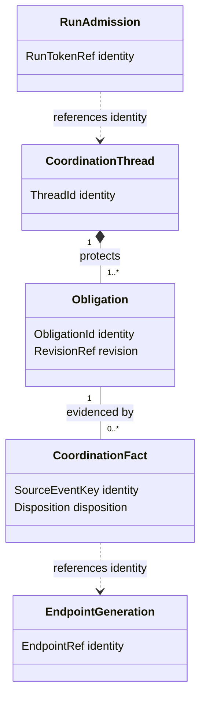

# Cross-harness coordination

Current [Proof Pack](../proof/cross-harness-coordination-proof-pack.md);
historical plural-path capture receipts remain historical, not newly qualified.

**P0 CORRECTED DRAFT — T2 — GATE P0-delta pending independent review.**
Original Data & Persistence draft; Python phase-specific correction records independent F1–F6.
The actual human approved implementation of P0–P5; this receipt executes P0 only.
That approval does not give protocol users automatic authority. No new work transfer,
run, slot or ownership reassignment follows from this document. The approved all-six-phase
goal is unchanged; later phases need their evidence gates, not renewed human phase approval.

## 1. FRAME, before the contract

Three distinct failures need distinct observations:

1. **Response visibility:** an answer exists but an open-only request list does not show
   its correlation or disposition. “Unanswered” is a derived question, not a transport fact.
2. **Transport delivery:** accepted bytes, projected bytes, an endpoint queue, arrival in
   the correct conversation, recipient consumption and supported post-turn wake are different.
3. **Execution authority:** even a consumed, affirmative answer cannot mint an ownership
   grant, transfer, run token or permission to cross a boundary.

The source investigation (all 580 lines read) is the approved repair boundary, not proof
that C# replay or any real endpoint has passed. Do not repeat the old timeline investigation.

### Alternatives tested against source

| Framing | Evidence | P0 disposition |
|---|---|---|
| Board canonical, queue a transport | US-4 has a board, but ADR-0020 explicitly rejects a second coordination ledger; the parser has no request-add/request-resolve cases | Reject for these coordination threads; would require an unauthorized source migration |
| Approved request canonical, board a projection | Investigation §4; ADR-0020; Loomkeeper §§4/6 say AI-Forward sessions reuse coord-core | Select; one official append path, not a queue/board dual-write |
| Transport wake alone fixes the wait | Existing fold represents only open/resolved; wake cannot express exact-hash acceptance | Insufficient, but endpoint conformance remains a P3 floor |
| Coordination grants replace ownership register | Conflicts with session-contracts §2 and actual-human restriction | Reject; reference authority, never duplicate it |

**Bounded store ruling:** coordination application/feed/checkpoint caches are additive
behind the **existing watcher observation-store seam in the existing `watcher.db` used
by WatcherHost/MCP**. `requests.jsonl` is the sole canonical coordination source. No new
DB, native relocation, `workspace.db` migration or cross-DB transaction is in scope.
The physical-placement divergence from ADR-0023 is inherited architecture debt, **not
claimed conformant**. Data/Persistence and Distributed Systems must coapprove the concrete
additive representation before P2 code; resolving that inherited debt is not added work.

## 2. Part A — conceptual domain model

**Bounded context:** repository-local cross-harness coordination. The native Message
Board, ownership authority and process scheduler are adjacent contexts, not children
of a giant “session” aggregate.

**Ubiquitous language:** an *obligation* is an explicitly requested response or action;
a *disposition* is a typed semantic answer; a *proposal revision* identifies immutable
content; an *acceptance* applies only to that revision; a *generation* is one registered
conversation incarnation; a *receipt* attests only its named stage; a *grant reference*
points to existing authority; a *run token* is checked one-use admission, not a lease.
“ACK” is not a synonym for acceptance.

| Entity / aggregate root | One invariant protected | Identity-only references |
|---|---|---|
| Coordination thread | A response can change only its named obligation/revision, never create acceptance by inference | Repository, proposal revision, sender/recipient generation, authority reference |
| Endpoint generation | Evidence of one incarnation cannot attest consumption by another | Registered actor and harness binding |
| Run admission | At most one run consumes a checked token | Candidate, grant reference, executor generation |
| Projection application (technical consistency unit) | One source event has at most one durable effect, with its receipt committed together | Canonical source-event identity |

Value objects: RepositoryIdentity, SourceEventKey, ObligationId, RevisionRef,
AuthorityRef, EndpointRef, CanonicalPayloadDigest, Cursor, DurationWithClock,
ProcessIdentity. Prefer these immutable values over independently mutable primitives.
An append modifies one thread aggregate; routing and run admission react separately.
Projection receipts/checkpoints are persistence metadata, not a second domain authority.

This is a conceptual class view, not a promise to persist each box as a table.
Logical/physical trace, grains, history and readers are in the [design](../design/cross-harness-coordination.md).

## 3. Rights and attestations

| Fact or right | Authorized attester | What it does NOT imply |
|---|---|---|
| Canonical append receipt | Official append tooling | SQLite visibility, power-loss durability, delivery or approval |
| Transport accepted / queued | Bound adapter | Arrival or consumption |
| Correct-generation arrival | Adapter evidence from registered endpoint | Understanding or semantic agreement |
| Consumed / triaged | Recipient generation, authenticated receipt | Acceptance, execution, ownership |
| Response | Assigned responder for named obligation | Positive agreement; negative answers still remove unanswered |
| Proposal accepted | Every required authorized peer, same immutable revision | Scope grant, NEW transfer, slot or START |
| Execution eligibility | Deterministic checks over current referenced authority and prerequisites | Authority created by the check itself |
| START | Launcher using checked one-use token | Success or release |
| Outcome | Executor/launcher with run evidence | Resource release |
| RELEASE | Scheduler/operator after holder reconciliation | Deletion of outcome/history |

`session-contracts.md §2` remains the **sole ownership authority**. Explicit scoped grants
must reference that authority and authenticated decisions; **NEW transfers require the
actual human**, not an Owner persona, model text, silence, timeout, quota exhaustion,
expired edit lease, budget exhaustion or a “resolved” legacy request.

## 4. Testable acceptance criteria

| ID | Required behavior | Phase / oracle |
|---|---|---|
| C01 | Correlated response appears on initiating thread and all-status by-ID read; negative response is not acceptance | P1 / O01–O03 |
| C02 | Exact revision + hash + required peers only; old-hash, ACK-only, unknown generation and unauthorized NEW transfer fail closed; synthetic positive controls confer no production authority | P1 / O04–O07; qualified authority gate remains BLOCKED |
| C03 | Unchanged, unenrolled old-worktree clients retain official request-add/request-resolve/list on the same primary `.agents/requests.jsonl`, without enrollment or upgrade; original IDs/payloads survive | P1 / O08–O10; enhanced activation requires separate mixed-client proof |
| C04 | Duplicate stable source key yields same receipt/effect; different payload is refused, not last-write-wins | P1/P2 / O09, O11 |
| C05 | Effect and receipt/checkpoint are atomic; restart/replay and two writers cannot lose a cursor-visible fact | P2 / O11–O15 |
| C06 | Late/missing parents, tombstones and unsupported versions survive restart as explicit dispositions; >200 backlog is complete | P2 / O16–O19 |
| C07 | Queue/pending/retry/in-flight limit+1 and outage recovery preserve already accepted obligations | P2/P3 / O20–O21 |
| C08 | Every supported foreground/background endpoint proves generation, arrival, consumption and supported post-turn wake on the installed harness | P3 / O22 |
| C09 | Actor/run attribution is launcher-owned; token checked once; expiry cannot stand in for holder death | P4 / O23–O25 |
| C10 | Same corpus yields same obligations across queue, board, MCP and UI; gaps, availability and pauses are honest | P5 / O26–O28 |

Acceptance criteria name required future evidence; no row is reported passed here.

### P0 admission is dormant, not activation

Only after independent P0-delta clearance may P1 implement compatible **dormant Python
fold/envelope/schema-validation and isolated tests**. This admission is not a deployed
SQLite schema, enhanced writing, authority adapter, endpoint send or launcher activation,
and the dormant subset does not complete P1. Enrollment gates **enhanced capabilities
only**; no legacy client is disabled. Enhanced writing stays disabled until coexistence
with unchanged legacy clients is proved, including contention, complete records and
conflict safety; a cooperative lock cannot automatically protect old unlocked appends.

All privileged production paths deny absent qualified verifier evidence, including an
apparently valid synthetic verifier receipt submitted through the production entrypoint:
O07 requires **zero grants, transfers, endpoint sends and launches**. Synthetic positives
prove deterministic contract behavior only. Authenticated authority fixtures, supported-
channel qualification and P3/P4 activation remain BLOCKED; repo/peer prose remains inert.

## 5. Non-goals and interaction requirements

No new dependencies; no Atlas bug repair, peer slot manipulation, observer changes,
nonce probing, process termination, destructive compaction, second consumed file,
native-board migration, full/native/App qualification or unrestricted human transcript capture.

The user reads an actionable thread with original question, latest response, exact revision,
outstanding obligation, next actor/checkpoint and distinct authority status. Provide all-status
by-ID retrieval and cursor-complete paging, not “newest 200” as proof of completion.
Empty, unavailable, failed, paused, unknown generation, partial/gapped, pending parent,
tombstoned, superseded and rejected are distinct states. A visible “Accepted” must say
**which stage**; use “Queued; consumption not recorded” and “Changes requested; not accepted.”
Surface keyboard/screen-reader equivalents, non-colour-only status and reduced-motion
behavior under existing WPF/G6 tokens. P5 must complete visual/UX craft review; P0 creates no UI.

## 6. Service objectives — PROPOSED pilot, not measured guarantees

Append p95 <=1 s (local monotonic accept-to-result); projection p95 <=30 s (one
observer measuring canonical-to-visible); delivery at next supported turn boundary,
overdue after 2 wall-clock minutes; triage on resumed turn within 5 **available**
execution minutes. Semantic answer checkpoint is negotiated per obligation.
Capture wall-clock elapsed, paused duration, availability denominator, lag and gaps
separately. No percentile has been measured. No timeout grants acceptance or authority.

## 7. Status

| Completed in this receipt | Remaining | Best next action |
|---|---|---|
| P0 corrected draft recording independent F1–F6 | GATE P0-delta pending independent review; P1 pending implementation; P2–P5 pending | Independent delta reviewer, then conductor-admitted Python P1 author for dormant subset only |

Live retention/erasure across every payload copy is unresolved. Foreground/background
GHCP, Codex, Grok and Claude positive arrival/consumption/supported-wake conformance
remains BLOCKED pending supported availability; fakes do not clear it. Proposed SLIs
remain unmeasured; docs index and security/privacy rollups remain conductor-owned/pending.
