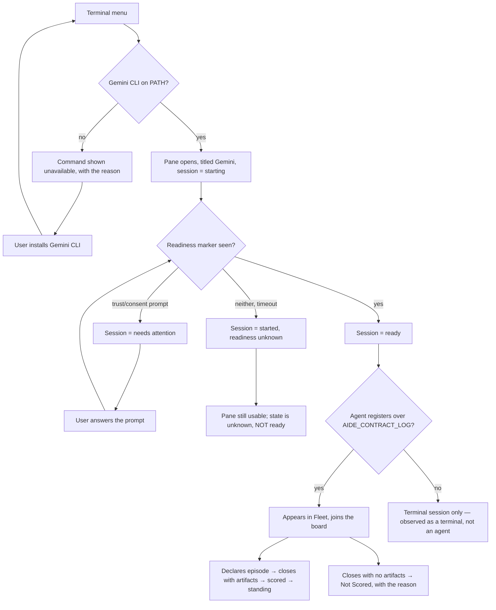

# A Gemini CLI agent session, on par with Claude Code and GitHub Copilot

**Status: draft — not built.** Gemini CLI is **not installed on this machine**, so every claim about
its actual command-line behaviour below is marked as an assumption with the check that settles it.
Nothing here asserts what the tool does.

---

## Part A — Functional

### The problem, stated without a solution

AI-DE can host a coding agent in a terminal pane and observe it: the session registers, appears in
the fleet, posts to the repository's message board, declares Work Episodes, and is scored. Today that
is true for exactly **two** harnesses, and each was added by editing three hard-coded dictionaries in
C#. The product's own framing — that it observes *agents*, not one vendor's agent — is currently a
claim its code does not support.

The underlying problem is not "we want Gemini". It is that **adding a harness is a code change in
three unrelated places, with no single declaration of what a harness is**, and nothing fails when one
of the three is missed. Gemini is the first case that exercises it; the ones after it are the reason
to care.

### Why now

Three separate things landed this week that only pay off with more than one non-Claude harness:
harness/model scoring segmentation, the harness-neutral coordination contract, and a gate asserting
each harness's instruction root carries the Proof Pack capture rule. That gate already **declares
Gemini CLI as a pending harness** and fails the moment `GEMINI.md` appears without the instruction —
so the repository has already written down an intention it has not met.

### Personas and jobs

| Persona | Job to be done |
|---|---|
| **Multi-agent technical lead** (primary, from `spec-ai-native-ide`) | Run Claude Code, Copilot and Gemini side by side on one repository and compare how they work — which means all three must be observed *the same way*, or the comparison is between the harnesses and the instrumentation at once. |
| **Evaluator** (from `spec-agentic-watcher-substrate` US-13/US-14) | Rank harnesses on evidence. A harness that cannot register produces no episodes, so it cannot be ranked, so its absence reads as "no data" rather than "not supported". |
| **Maintainer adding harness #4** | Add a harness without reading three files to discover what a harness is. |

### Core scenario

A user with Gemini CLI installed opens **Terminal → New Gemini session**. A pane opens titled
"Gemini", the CLI starts, AI-DE detects when it is ready for input, and the session appears in the
Fleet pane beside the Claude Code and Copilot sessions — same columns, same liveness, same board.
The agent reads `AIDE_AGENT_PROTOCOL`, registers itself over `AIDE_CONTRACT_LOG`, declares an
episode, closes it naming its Proof Pack, and receives a standing. Nothing in that sentence is
Gemini-specific, and that is the point.

### Non-goals — explicit

- **Not** a Gemini-specific feature surface. No Gemini-only pane, setting, or capability.
- **Not** bundling or installing Gemini CLI. If it is not on PATH the command is unavailable, exactly
  as for the other two.
- **Not** changing the scoring model, leaderboard, or standing. A third harness is new *data* for
  those, not a new mechanism.
- **Not** an abstraction for arbitrary CLIs. The unit is *an agent harness AI-DE can observe*, not
  "any program".
- **Not** MCP, tool-calling, or in-process integration. This is a terminal session like the others.

### The conceptual domain model

**No new domain concept is introduced**, and saying so is the finding rather than a formality.
`HarnessIdentity` already exists as a value object (name + version) and is already a scoring axis.
Gemini is an **instance** of an existing concept.

What *is* wrong today is that the concept has **no single representation**. A harness is currently
defined by agreement between three maps that nothing joins:

| Where | What it holds | Keyed by |
|---|---|---|
| `AgentReadinessWatcher.KnownAgents` | readiness regex | executable name |
| `AgentReadinessWatcher.KnownAttention` | attention/trust-prompt regex | executable name |
| `AgentReadinessProfiles.KnownHarness` | harness id, display name, keyboard gesture | executable name |

They share a key by convention. A harness present in one and absent from another is not an error
anywhere — it silently produces a session that launches but is never detected ready, or is detected
but has no harness identity and so scores as *Not Recorded*.

**Ubiquitous language, unchanged and reused:** *Harness* (the agent program), *Agent Session* (one
harness running in one terminal, in one worktree), *Work Episode*, *Registration*, *Standing*.

**The aggregate and its invariant.** *Supported Harness* is the aggregate; its root is the executable
name; and the invariant it protects is: **a supported harness has a readiness marker, a harness
identity, and a display name — or it is not offered.** Today no code holds that invariant. This spec
requires that it be held in one place, because otherwise adding harness #4 re-runs this defect.

### User stories and acceptance criteria

**US-G1 — Launch parity.**

> As a technical lead, I open a Gemini session the same way I open the other two.

- **Given** Gemini CLI is on PATH, **When** I invoke **New Gemini session**, **Then** a terminal pane
  opens titled "Gemini" and the CLI is launched in the workspace directory.
- **Given** Gemini CLI is **not** on PATH, **When** I open the Terminal menu, **Then** the command is
  shown unavailable with the reason, **and** invoking it never opens a pane that silently fails.
- **Given** three sessions of different harnesses are open, **When** I look at the tabs, **Then** each
  is distinguishable by name without opening it.

**US-G2 — Readiness is observed, not assumed.**

- **Given** a Gemini session is starting, **When** the CLI has not yet accepted input, **Then** the
  session reports *starting*, not *ready*.
- **Given** the CLI has rendered its input prompt, **When** the readiness marker matches, **Then** the
  session reports ready **within one poll interval**.
- **Given** the CLI presents a trust/consent prompt, **When** it is on screen, **Then** the session
  reports *needs attention* rather than *ready* — because a session waiting on a human is not a
  session doing work, and scoring cannot tell those apart afterwards.

**US-G3 — A harness is declared once.**

- **Given** a new harness is added with a readiness marker but **no** harness identity, **When** the
  build runs, **Then** it **fails** naming the missing field.
- **Given** a supported harness, **When** anything asks for its readiness marker, its identity, or its
  display name, **Then** all three come from **one declaration**.
- *Falsifiable by construction:* delete any one field of the Gemini declaration and a test must go
  red naming that field. If none does, this criterion is not met.

**US-G4 — A Gemini session enlists for coordinated work.**

- **Given** a launched Gemini session, **When** it registers over `AIDE_CONTRACT_LOG` with the
  required attributes, **Then** it appears in the Fleet pane with `service.name` = `gemini-cli` and
  trust **Verified**.
- **Given** it registers with a **worktree** path as its repository, **When** registration is
  processed, **Then** the repository is corrected to the repository, a notice is written to
  `<AIDE_CONTRACT_LOG>/registration/<session>.json`, and it lands on the **same board** as sessions in
  other worktrees of that repository. *(Already built — this criterion asserts the third harness
  inherits it, not that it is new.)*
- **Given** it declares and closes a Work Episode naming a committed `docs/proof/` path, **When** the
  watcher tick runs, **Then** the episode is scored on that evidence and a standing is written to
  `<AIDE_CONTRACT_LOG>/standing/<session>.json`.
- **Given** it closes an episode naming **no** artifacts, **Then** the verdict is **Not Scored with
  its reason** — never a low score.

**US-G5 — The harness is actually told the conventions.**

- **Given** `GEMINI.md` exists, **When** `verify-capture-instruction.py` runs, **Then** it passes only
  if that file carries `episode.artifacts` and `AIDE_CONTRACT_LOG`.
- **Given** `GEMINI.md` does **not** exist, **Then** the gate reports Gemini as **pending** and does
  not fail. *(Current behaviour — asserted here so it is not "fixed" later by inventing the file.)*
- **Given** a Gemini session starts in a workspace, **When** it reads `AIDE_AGENT_PROTOCOL`, **Then**
  it finds the coordination protocol document, harness-neutrally and with no Gemini-specific work.

### Assumptions about Gemini CLI — every one to verify, none asserted

Gemini CLI is not installed here. These are the load-bearing unknowns, each with the check that
settles it. **A1–A3 must be settled before implementation begins**; they decide whether this design
holds at all.

| # | Assumption | How to settle it | If false |
|---|---|---|---|
| **A1** | The executable is `gemini` on PATH. | `gemini --version` in a plain shell. | The registry key changes; nothing else. |
| **A2** | It renders a stable, matchable input prompt when ready. | Launch under the terminal, capture the rendered screen, derive the marker from it. | Readiness detection needs a different signal (e.g. process/pty state); US-G2 is at risk and the design changes. |
| **A3** | It honours inherited environment variables. | Launch it with `AIDE_CONTRACT_LOG` set and have it print the value. | The whole coordination half needs another channel; this spec is blocked. |
| **A4** | It presents a first-run trust/consent prompt. | Observe first launch in a fresh workspace. | The attention pattern is omitted rather than invented — an unused pattern is worse than none. |
| **A5** | It reads `GEMINI.md` from the workspace root as its instruction file. | Confirm against Google's published docs, then verify empirically. | The instruction root changes; `verify-capture-instruction.py`'s declared path changes with it. |
| **A6** | It can append to a file mid-session (to write contract lines). | Ask a running session to append a JSONL line and read it back. | Registration needs a different mechanism; US-G4 is at risk. |

**A2 and A4 cannot be answered from documentation** — a readiness marker is tuned against a *rendered
screen*, which is why the existing two were derived that way. Copying Claude's marker because the
prompts "look similar" is the guess this table exists to prevent.

### Open decision — the keyboard gesture

`Ctrl+K, A` is Claude Code (inherited from the removed generic "new agent" command) and `Ctrl+K, G` is
GitHub Copilot. **`G` is taken, and Gemini's obvious letter is `G`.** Options: `Ctrl+K, M`
(ge**m**ini), `Ctrl+K, E`, or no chord at all — the menu item alone. Recorded as an open decision
rather than resolved, because a chord is muscle memory and reassigning `Ctrl+K, G` would silently
change what a user's fingers already do.

### ISO 25010 NFRs

| Attribute | Requirement |
|---|---|
| **Functional correctness** | A session reports ready only when the CLI accepts input. |
| **Reliability** | A missing/failing Gemini CLI degrades to an unavailable command, never a broken pane. |
| **Maintainability** | Adding harness #4 is one declaration; a partial one fails the build. |
| **Security** | No new trust boundary: same terminal, same env contract, same registration path. Terminal bytes never enter logs, telemetry or the fact store. |
| **Observability** | A launch decision is recorded; a readiness timeout is distinguishable from a failure to start. |
| **Portability** | The declaration carries no Gemini-specific code path. |

### Governance lenses

| Lens | Applies | Answer |
|---|---|---|
| Threat model | Yes, lightly | No new boundary; the agent is already trusted to run in a terminal. Registration is already capability-guarded. |
| Privacy | Yes | Unchanged: terminal bytes are never captured. Registration records identity, not content. |
| Accessibility | Yes | Menu item and tab inherit existing patterns; no new control type. |
| Performance | Yes | Readiness polling adds one more watched session; existing budget applies. |
| Release/rollback | Yes | Additive. Removing the declaration removes the command. |
| Observability | Yes | Launch decision recorded (existing `TerminalStart` diagnostics). |

---

## Part B — UX specification

### Information architecture

The command belongs in the **Terminal** menu beside its two siblings — the grouping is *how a session
is started*, not *which vendor*. A separate "AI" or "Gemini" menu would make the third harness a
different kind of thing than the first two, which is exactly the framing this spec rejects.

### User flow — happy, alternate, error, recovery

**The two paths that matter most are the ones that are not failures.** `H` (readiness unknown) and
`K` (never registers) are both *legitimate states a user will hit*, and both must be
distinguishable from success and from breakage. A session that never registers is a working
terminal — it is simply not an observed agent, and the Fleet pane must say that rather than showing
nothing.

### UX acceptance criteria

- Every state in the flow above is reachable and distinguishable in the UI; none renders as blank.
- A session that started but was never detected ready reports **readiness unknown**, never *ready* and
  never *failed*.
- A user can tell, without opening a pane, whether a session is a plain shell or an agent — and if an
  agent, which harness.
- The unavailable-command path names **why** (not on PATH) rather than being greyed out silently.

---

## Part C — UI specification

**Archetype: B-series operational (record list), inherited — not newly selected.** This change adds a
*row* to surfaces that already exist (the Terminal menu, the tab strip, the Fleet pane); it
introduces no new screen. Selecting a fresh archetype for it would be inventing a surface the feature
does not need.

- **Tokens.** Menu item, tab label and Fleet row use the existing `DESIGN.md` token set. No new
  colour, spacing or type token is introduced; a third harness that needed one would indicate the
  first two were special-cased.
- **Component states.** The Terminal menu item has enabled / unavailable-with-reason states. The tab
  has starting / ready / needs-attention / readiness-unknown / ended. The Fleet row additionally has
  *registered* vs *terminal-only*.
- **Copy, in voice.** "Gemini CLI was not found on your PATH." — not "Error: gemini not found".
- **Accessibility.** WCAG 2.2 AA inherited; harness state is conveyed by text, not colour alone —
  three harnesses make a colour-only encoding unreadable sooner than two.
- **No Gemini branding.** The display name is "Gemini", consistent with "Claude Code" and "GitHub
  Copilot".

---

## Evidence and comparables

| Comparable | What it does | Confidence |
|---|---|---|
| **AI-DE's own Claude Code + Copilot sessions** | The only true comparable: two harnesses in the same product, same seams. Read from the source this session. | **Verified** |
| **VS Code terminal profiles** | Named launch configurations declared as data, discovered dynamically rather than hard-coded per program. | **Inferred** — the pattern is well known; not re-verified here. |
| **Gemini CLI's own behaviour** | — | **Flagged** — not installed; see A1–A6. |

## Residual risk

1. **A2 (readiness marker) is the one that can invalidate the design.** If Gemini renders no stable
   prompt, readiness needs a different signal and US-G2 changes shape.
2. **A3/A6 (environment and file append) gate the coordination half entirely.** If either is false,
   Part A's US-G4 is blocked and Gemini is a terminal session that is not an observed agent — which
   is a legitimate but much smaller feature.
3. **The single-declaration refactor (US-G3) touches the two existing harnesses.** It is the right
   fix and it is not free: it changes code paths that currently work.

## Gate record

| Lens | Verdict | Note |
|---|---|---|
| **The Simplifier** | PASS with a caution | US-G3 (single declaration) is scope beyond "add Gemini". Kept because adding the third harness *through* the existing three-map arrangement would knowingly reproduce a defect whose signature is already documented. Caution recorded: if US-G3 grows past one declaration type plus its validation, it is a separate slice. |
| **Test Architect** | PASS | Every criterion names an input that makes it fail; US-G3 states its own falsification explicitly. **Hard veto not raised** — but note US-G1/G2 cannot be *executed* until A1–A4 are settled, so they are testable-in-principle today and testable-in-fact only after the spike. |
| **Data & Persistence Architect** | PASS | No new concept, no new persistence, no migration. The aggregate and its invariant are named. |
| **UX Researcher / IA** | PASS | Flow covers happy, alternate, error and recovery; the two non-failure states (readiness unknown, terminal-only) are explicitly required to be distinguishable. |
| **UX & Accessibility** | PASS | No new component type; state conveyed by text not colour. |
| **Security & Identity** | PASS | No new trust boundary or capability. |

**Authors did not clear their own veto:** the Simplifier's caution on US-G3 is recorded rather than
dismissed, and remains the one scope decision an owner may reverse.

## Handoff

→ **Spike A1–A6 first** (`spike-protocol.md`). This spec is not implementable until A2, A3 and A6 are
settled; a spike is hours and guessing is a rewrite.
→ then `/design-slice` for the single-declaration harness registry (US-G3).
