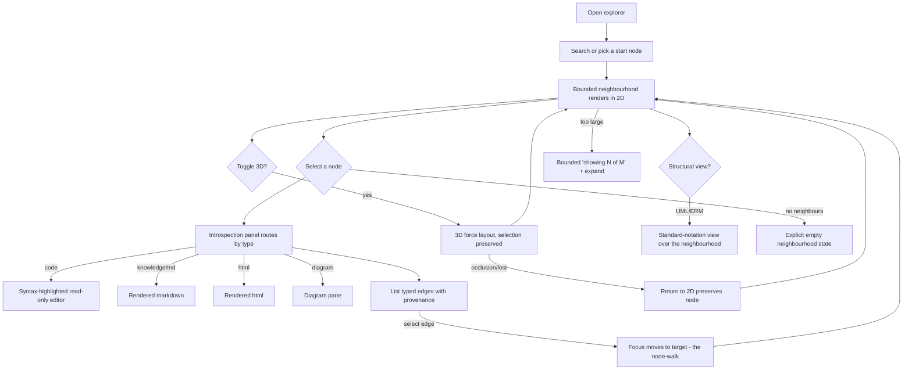

# Knowledge Exploration Surface

- **Tier:** T1 (read-only exploration over already-governed local artifacts; no new write surface). The
  provenance-correctness and a11y floors keep it above T0.
- **Grounding path:** `spec-knowledge-exploration → spec-ai-native-ide → knowledge-hub`; evidence from
  `kb-graph-experience-and-visualization`, `kb-editor-and-content-rendering-surfaces`, `kb-diagram-generation`,
  `kb-code-knowledge-graphs`; domain from `conceptual-model-ai-native-ide` (Evidence & Projection).

## Part A — Functional (what & why)

**Problem.** AI-DE accumulates knowledge across *every* artifact in the repo — code, the `docs/knowledge`
bases, specs, architecture, ADRs, decision notes, and generated artifacts (diagrams, proofs, audit). Today
these are separate files; there is no single surface to **traverse across all of them** and understand how a
piece of code connects to the knowledge that informed it. The user wants one explorable graph where they can
**walk any node to any related node**, see each node **in its natural representation**, and toggle between
**2D and 3D**.

**Core scenario (the node-walk).** An operator selects a C# file node → reads its code syntax-highlighted in an
editor view → follows a `documents`/`implements` edge to the design that specified it (rendered markdown, not
raw markup) → follows a `tested-by` edge to its proof → toggles to 3D to see the neighbourhood's shape → toggles
back to 2D where betweenness/community metrics reveal the bridge nodes. Every edge shows *how it was known*
(Verified/Inferred/Flagged). Nothing misleads.

**Personas / JTBD.** *The operator* — "help me understand how this part of the system connects to everything
that governs it, without grepping." *The reviewer* — "show me the code↔knowledge gaps (documentation with no
implementation, risk with no governance)."

**Non-goals.** (1) Not an editor of the graph — exploration is read-first; edits flow to the source artifacts,
then regenerate (the derived-view rule). (2) Not a replacement for the Docs Explorer's file view — this is the
*graph* surface. (3) 3D is a mode, not the default. (4) Not a whole-graph dump — always a bounded neighbourhood.

**Conceptual domain model (reuses the existing model — no new aggregate).** The surface reads the existing
**Evidence & Projection** context (`conceptual-model-ai-native-ide`). Ubiquitous language it presents:
- **Node** — a repo artifact projected into the graph: `code` (C# file/symbol), `knowledge`, `spec`,
  `architecture`, `adr`, `design`, `decision-note`, `diagram`, `proof`, `audit`. Each has a **natural
  representation** (its renderer).
- **Edge** — a typed **relationship claim** carrying **provenance/confidence** (`EXTRACTED/INFERRED/AMBIGUOUS`
  from the code graph; `implements/refines/depends-on/tested-by/documents/uses-term` from the docs graph).
- **Neighbourhood** — the bounded sub-graph shown around a focus node (never the whole graph).
- **Projection** — a derived view (2D layout, 3D layout, a UML/ER view); read-only by invariant.

No new invariant is introduced; the surface honours the existing ones (a projection is derived; a relationship
claim carries ≥1 attributable assertion).

**User stories & acceptance criteria (Gherkin, falsifiable).**

- **US-K1 — One graph over all artifacts.** `Given the repo, When the explorer opens, Then nodes exist for code, knowledge, specs, architecture, ADRs, designs, decision-notes, diagrams, proofs and audit, And a node of each type is reachable from at least one other by a typed edge.`
- **US-K2 — Bounded neighbourhood (no hairball).** `Given a focus node, When the graph renders, Then only its bounded N-hop neighbourhood is shown (default N≤2), And "expand" reveals more on demand — the whole graph is never rendered at once (kg-visualization-ux-expert clears-when).`
- **US-K3 — Node introspection in natural form.** `Given a selected node, When the introspection panel opens, Then a markdown/knowledge node renders as formatted markdown (not raw markup), an html node renders as html, And a code node renders in a syntax-highlighted read-only editor.`
- **US-K4 — Traverse by typed edge.** `Given a node's introspection panel, Then its outgoing and incoming typed edges are listed, And selecting an edge moves focus to the target node (the node-walk).`
- **US-K5 — Provenance shown, never laundered.** `Given any edge, When rendered, Then its provenance/confidence is shown by glyph+label (Verified/Inferred/Flagged), never colour alone, And an INFERRED edge is visually distinct from an EXTRACTED one.`
- **US-K6 — 2D/3D toggle.** `Given the graph, When the operator toggles representation, Then it switches between a 2D layout and a 3D force layout preserving selection and neighbourhood, And 2D is the default.`
- **US-K7 — UML/ERM-grounded views.** `Given a set of nodes, When the operator picks a structural view, Then relationships are shown in standard UML (class/component) or ERM (crow's-foot) notation, valid per the uml-erm-modelling-expert's clears-when.`
- **US-K8 — Layout stability.** `Given a neighbourhood, When one node is added/removed, Then existing node positions are preserved (pinned by stable id) so the reader's mental map survives.`
- **US-K9 — Empty/degraded states.** `Given a node with no neighbours, Then the graph shows an explicit empty neighbourhood ("no linked artifacts"), not a blank success; Given a graph too large to lay out at the requested depth, Then a bounded, labelled "showing N of M" state renders.`
- **US-K10 — Aggregated overview is the default; the whole raw graph is never loaded.** `Given no focus node (the explorer just opened), When the graph renders, Then it shows a BOUNDED entry — either the most important nodes (ranked by degree/betweenness, domain nodes preferred over framework primitives, dropped nodes counted) OR an aggregated view (communities / packages / namespaces as super-nodes) — never the raw whole graph, And the omitted count is reported ("showing N of M"), And the client never issues a "give me the whole graph" request. (This supersedes the current no-root = whole-graph behaviour, which violates US-K2 and does not scale — INV-0003.)`
- **US-K11 — Semantic zoom / level-of-detail.** `Given a large graph, When zoomed out, Then nodes are aggregated into cluster/super-nodes (community, package, namespace) with bundled edges; When zoomed in or a cluster is expanded, Then its members are fetched on demand and rendered. Detail scales with zoom and focus, not with project size, so a 10^4–10^6-node project stays responsive.`
- **US-K12 — Every query is bounded to the transport by construction.** `Given any graph request, Then its response is sized to fit one IPC frame or is streamed across frames, so no request can overflow the transport and close the connection; Given a request that would exceed the bound, Then a labelled "too large — narrow your focus / zoom in" state renders, never an opaque transport failure (INV-0003 defect B).`

**ISO 25010 NFR.** Performance — neighbourhood render p95 <1s at N≤2 on the approved corpus; **overview
and every request are bounded to a size that fits the IPC transport regardless of project size (US-K12), so
render/transfer cost scales with the viewport, not the repository**; 2D uses a WebGL/
Canvas renderer sized to the graph (Sigma.js/Cytoscape.js), 3D uses 3d-force-graph; both bounded. Usability —
the node-walk is the core. Accessibility — WCAG 2.2 AA; the graph has a keyboard-navigable node list alternative
and screen-reader node/edge summaries (a canvas is not operable by pointer alone). Reliability — a failed
renderer degrades to the node-list, never a blank. Security/Privacy — reads only already-local, already-governed
artifacts; no new egress (a GraphRAG query is bounded — no whole-subgraph to a model).

## Part B — UX specification (how it works)

**IA.** The explorer is a **master-detail-plus-canvas**: a left **search/filter + node-type facet** rail, a
central **graph canvas** (2D default, 3D toggle), and a right **introspection panel** that routes by node type.
A top bar carries the 2D/3D toggle, the depth control, the metric overlay selector (none/betweenness/community/
gap), and the view selector (graph / UML class / UML component / ERM). Labels feed the glossary.

**User flows (happy + alternate/error/recovery).**

**Wireframe structure.** Left rail (search, type facets, saved views) · centre canvas (graph, with a legend for
provenance + metric) · right introspection panel (header: node id/type/owner; body: the natural renderer; footer:
typed-edge list with provenance glyphs). The introspection panel is the **node-introspection router** from the
knowledge base — it is the load-bearing new component.

**UX acceptance.** `Every node type has a specified natural renderer`; `every edge row shows provenance`;
`the empty neighbourhood and the too-large states are specified`; `keyboard: a node list mirrors the canvas and
every canvas action has a keyboard equivalent`.

## Part C — UI specification (how it looks)

**Archetype Signature.** A **Spatial-Canvas × Master-Detail hybrid** — `ui-archetype-catalog.md` **C1
(Unbounded Spatial Canvas)** for the graph + **B2 (Master-Detail)** for the introspection panel.
**JTBD→archetype rationale (auto-selected):** the dominant job is *spatial exploration of a network with focused
reading of one node* — a canvas job (parallel spatial reading) wrapped around a detail job (serial reading of the
selected node), so the C1×B2 hybrid fits where a pure dashboard (B3) or a form (A) would not. Signature (starting
point): `Type:Hybrid; Arch:SpatialUnbounded; Layout:SpatialCanvas+MasterDetail; Density:Compact;
Nav:Sidebar+FloatingContext; Viewport:DesktopBound; Input:PrecisionPointer+KeyboardFirst; Color:DarkAdaptive;
Depth:SoftShadow; Sync:LocalFirst; Feedback:Instant; Motion:Micro; Pacing:Freeform; A11y:WCAG_2.2_AA;`.

**Triggered standards.** **UI-T1 (`technical-ui-design.md`)** fires — this is an expert surface working with a
structured graph: any metric encoded on a scalar (betweenness heat) uses a **perceptually-uniform colormap with
a legend, never rainbow/jet** (TQ3); provenance is a categorical encoding (glyph+label). **UI-T3** partially — a
GraphRAG query surface fronts a model; retrieval is bounded and results carry provenance (U13–U15).

**Specified to U1–U20 against `DESIGN.md`:**
- **Renderers** — 2D: Sigma.js/Cytoscape.js (WebGL) in the shared WebView2 pane; 3D: 3d-force-graph; per-node:
  Monaco/AvalonEdit (code), Markdig.Wpf or HTML-in-WebView2 (md/html), the diagram pane (diagrams).
- **Complete states** (U9) — graph: default/loading(skeleton)/empty-neighbourhood/too-large/error; node panel:
  loading/rendered/unsupported-type/error; every edge row: provenance glyph.
- **Provenance legend** — always visible; Verified/Inferred/Flagged as glyph+word+colour (DESIGN.md rule).
- **Motion** — layout is 0ms (DESIGN.md); only selection/hover micro-feedback; reduced-motion → instant.
- **Copy** — "No linked artifacts for this node.", "Showing 40 of 312 — expand to load more.", "This node type
  has no preview.", drafted in `/ui-design`.
- **WCAG 2.2 AA** — canvas has a keyboard node-list twin + SR summaries; contrast per DESIGN.md audit.
- **Reference `DESIGN.md`** for the token system (extended with a provenance-legend + metric-legend token set in
  `/ui-design`).

## Comparables & evidence
- **Obsidian graph + InfraNodus/New-3D-Graph** — 2D/3D, network-science metrics, node navigation.
  *(Verified, `kb-graph-experience-and-visualization` [GX12][GX13].)*
- **Knowledge Canvas** — navigate + introspect + chat over a knowledge graph (discontinued — design for mortality).
  *(Verified, [GX18].)*
- **The node-introspection router** — the base's load-bearing new piece, realized here as Part B's right panel.

## Governance lenses
Accessibility (hard floor), Performance (bounded neighbourhood budget), Observability (graph-render telemetry).
Privacy (applies — reads local governed artifacts only; bounded retrieval, no whole-subgraph egress).
Threat model — minimal (read-only local); a WebView2 pane is a trust boundary (`ai-native-ide-shell`).

## Residual risk & flagged unknowns
- The node-count at which the 2D/3D pane stops being usable is **unmeasured** (spike — `kb-graph...` open-question).
- Whether md/html/code render *inside* the WebView2 graph pane or in a separate WPF panel is a `/design` decision
  (airspace + one-environment trade — `kb-editor-and-content-rendering-surfaces`).
- **Implementation currently violates US-K2/US-K10 (INV-0003).** `CanvasGraphViewModel` with no focus loads
  the *whole* graph (`WholeGraphAsync`, 5,000-node cap), which overflowed the 1 MiB IPC frame on TheTerrace
  (~2,813 nodes / 8,602 edges) and closed the connection (`ipc.transport_closed`). Fixing it is a cross-session
  change: **Core owns** the bounded/aggregated query API (a "graph overview" that returns ranked-important or
  community-aggregated nodes, and neighbourhood queries bounded/streamed to the transport — US-K12) and the
  daemon returning a legible `PayloadTooLarge` error instead of closing; **Design owns** the default-view UX
  (aggregated overview instead of a whole-graph load, US-K10) and the semantic-zoom / LOD rendering (US-K11).
- **Aggregation source (flagged):** community/package/namespace super-nodes (US-K11) need a server-side
  aggregation the projection does not yet expose; the graphify/community-detection primitives (kb bases) are the
  natural source — a `/design` + Core decision.

## Gate record
`GATE spec-knowledge-exploration · 2026-08-29 · Product Strategist + kg-visualization-ux-expert + uml-erm-modelling-expert + UX Researcher/IA (peers) / Simplifier + Test Architect + kg-visualization-ux-expert + UX & Accessibility (adversaries) · exit: bounded-neighbourhood, provenance-shown, natural-render, 2D-default all criteria; empty/too-large states specified · verdict: PASS-WITH-CONDITIONS (node-count knee flagged) · vetoes: none unresolved`
`GATE spec-knowledge-exploration/scaling · 2026-08-30 · kg-visualization-ux-expert (peer) / Simplifier + Test Architect (adversaries) · added US-K10 (aggregated overview default, never whole-graph), US-K11 (semantic zoom/LOD), US-K12 (every query bounded to transport) after INV-0003 · verdict: PASS-WITH-CONDITIONS (Core-owned query API + aggregation source flagged) · vetoes: none unresolved`
