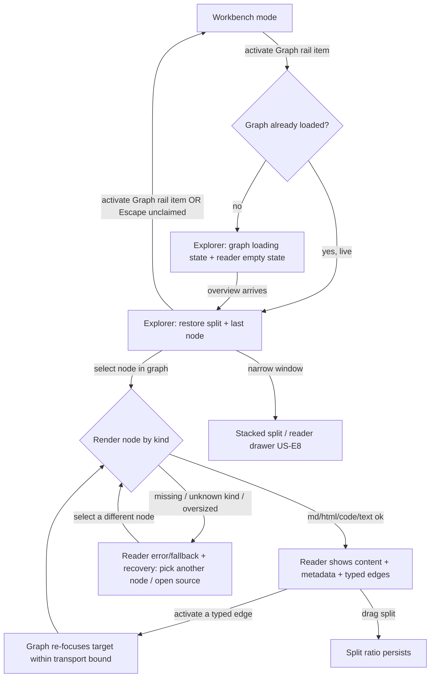

# Knowledge Explorer — full-window dual-pane mode

> **Reconciliation (grounding).** This spec **refines** `spec-knowledge-exploration`, it does not
> restate it. That spec already establishes: **US-K3** (a selected node renders in its natural form —
> markdown/knowledge as formatted markdown, html as html, code in a syntax-highlighted read-only
> editor), **US-K4** (the node-walk — a node's typed edges are listed and selecting one moves focus),
> the **core scenario** (select a C# node → read it → walk an edge), and the **Archetype Signature**
> (a Spatial-Canvas × Master-Detail hybrid, C1×B2 — a graph "master" and a detail/reader). **What this
> spec adds is a presentation decision only:** that this master-detail is presented as a **dedicated
> full-window mode** entered from the activity rail, taking the whole workbench body, rather than as
> one AvalonDock pane competing with the terminal/domain/provenance panes. No new graph capability,
> no new domain aggregate. Where the two specs would conflict, the parent's functional capability
> wins and this spec governs only the presentation.

## Part A — Functional (what & why)

### Problem (solution-independent)
The knowledge exploration surface — the graph plus the reader that renders a selected node's contents
— is today one **dock pane** among several (it shares the workbench with the workspace tree, the
terminal, domain and provenance panes). On a **laptop / single monitor** that is cramping: to read a
node's rendered markdown or its code *and* keep the graph visible enough to pick the next node to walk
to, the operator has to shrink every other pane, and even then the two halves of the one activity —
*see the shape* and *read the thing* — fight for the same small area. The operator needs a way to give
the **whole window** to exploration when they are in "understand how this connects" mode, and to
return to their working layout, untouched, when they are done. (This is a presentation gap, not a
capability gap — the reader and the node-walk already exist.)

### Personas / JTBD
- **The operator** (inherited from `spec-knowledge-exploration`): *"help me understand how this part
  of the system connects to everything else, and let me read the actual artifact behind any node
  without losing my place in the graph."* The refining context here: **they are often on one screen**,
  so the surface must not assume a second monitor to be usable.

### Core scenario
The operator clicks the **Graph** icon on the activity rail → the workbench body is replaced by a
**full-window dual-pane surface**: the graph and its search/controls on one side, a **reader** on the
other → they select a node in the graph → the reader renders it in its natural form (rendered markdown
/ rendered html / syntax-highlighted code / plain text + the node's metadata and its typed edges) →
they select one of the reader's edges to **walk** to the neighbour (the graph re-focuses and the reader
follows) → they press the Graph icon again (or Escape) to **exit**, and the previous workbench layout
returns exactly as it was.

### Non-goals
1. **No new graph capability.** The reader (US-K3), the node-walk (US-K4), per-kind rendering, 2D/3D,
   provenance, overview/LOD (US-K10/K11) are all inherited — this spec neither adds nor changes them.
2. **Not a graph editor** (parent non-goal: exploration is read-first).
3. **Not multi-window / tear-off.** A detached second window for the reader is a plausible future for
   multi-monitor users but is **out of scope here** (flagged in Residual risk).
4. **Not a replacement for the docked graph pane by fiat.** Whether the docked pane is removed,
   retained, or becomes a "pop out to Explorer" affordance is a UX decision (Part B), not assumed here.
5. **Not a change to the workbench layout model for non-graph panes** — the terminal/domain/provenance
   panes and their persistence are untouched; the mode swaps the *body*, it does not restructure the
   dock.

### Conceptual domain model (one new *view-state* concept; no new domain aggregate)
This is a presentation refinement, so it introduces **no domain aggregate** (the graph/artifact model
is unchanged and owned by `spec-knowledge-exploration`). It introduces exactly one **ubiquitous-language
term** at the application/view layer:

- **Primary view mode** — the shell's body is in exactly one of a small closed set of **modes** at a
  time. Today there is effectively one (**Workbench** — the AvalonDock docking host). This spec adds
  **Explorer** (the full-window dual-pane graph+reader surface). The mode is a **value** the shell
  holds; switching mode swaps what fills the body; the non-active mode's state is **retained, not
  destroyed** (exiting Explorer must not rebuild the workbench, and entering it must not rebuild a
  live graph/terminal). The rail is the mode selector.
- **Reader** — the detail half of the Explorer surface: given a node, it renders that node's *content*
  in its natural form plus its *metadata* and its *typed edges*. (Its rendering rules are US-K3/K4;
  this spec names it as a first-class component because the mode composes it beside the graph.)

The **invariant** the mode protects: *a live surface is never rebuilt by a mode switch* — entering or
leaving Explorer preserves the graph's loaded neighbourhood/selection and the workbench's panes and
their processes (a terminal in the workbench keeps running while Explorer is open). This is the same
class of invariant as DC-029 (reconcile, don't rebuild) applied at the mode level.

### User stories (falsifiable Gherkin)

- **US-E1 — Enter/exit Explorer from the rail.** `Given the shell is in Workbench mode, When the
  operator activates the Graph rail item (click or keyboard), Then the body is replaced by the Explorer
  surface and the Graph rail item shows as active; And When the operator activates it again (or presses
  Escape while no in-surface control has captured Escape), Then the shell returns to Workbench mode with
  the previous layout intact.`
- **US-E2 — Full-window body takeover, rail persists.** `Given Explorer mode is active, Then the
  Explorer surface fills the entire workbench body (the region the docking host occupied), And the
  activity rail, menu bar, title strip and status strip remain present, so the operator can always
  switch mode and always sees workspace/health state.`
- **US-E3 — Dual-pane composition: graph | reader.** `Given Explorer mode is active, Then the surface
  is split into a graph region (the graph canvas + its search and view controls) and a reader region,
  And the split is draggable, And its ratio persists across mode switches and app restarts.`
- **US-E4 — Select-in-graph → render-in-reader.** `Given Explorer mode is active and a node is selected
  in the graph, Then the reader renders that node per US-K3 (rendered markdown / rendered html /
  syntax-highlighted read-only code / plain text) together with the node's metadata (id, kind, context,
  provenance) and its typed edges per US-K4.`
- **US-E5 — Walk from the reader.** `Given the reader is showing a node with typed edges, When the
  operator activates one of those edges, Then the graph re-focuses on the target node (the node-walk,
  US-K4) and the reader follows to the target, And the graph's neighbourhood updates within the
  transport bound (US-K12).`
- **US-E6 — Mode state is distinct and restored.** `Given the operator has set a split ratio and
  focused a node in Explorer, When they leave and re-enter Explorer, Then the split ratio and the
  last-focused node are restored (the graph is not reloaded from scratch if it is still live).`
- **US-E7 — Both panes have real empty/loading/error states.** `Given Explorer is entered with no node
  selected, Then the reader shows an explicit "select a node to read it" empty state (not a blank); And
  Given the graph is still indexing/loading, Then the graph region shows its loading state and the
  reader its empty state; And Given a node whose content cannot be rendered (missing artifact, unknown
  kind, oversized), Then the reader shows a labelled error/fallback with a recovery affordance, never a
  blank success.`
- **US-E8 — Ergonomic responsiveness (the single-monitor motivation).** `Given a narrow window (below a
  stated width threshold), Then the split may present stacked (graph over reader) or the reader may be
  a collapsible drawer, so both halves stay usable on one screen; And Given a wide window, Then the
  default side-by-side (vertical split) is used.`

### Non-functional requirements (ISO/IEC 25010 checklist)
- **Usability** *(the point of the feature)* — at the default window width (≥ 1180px, the shell's
  startup width) both the graph region and the reader region are simultaneously at least a stated
  minimum usable size (e.g. graph ≥ 480px wide, reader ≥ 360px wide) with no other pane competing.
  **Testable.**
- **Performance efficiency** — entering/leaving Explorer is a view swap, not a rebuild: the mode
  switch completes within a small budget (target < 150 ms perceived) and **does not** re-issue the
  graph query or restart workbench processes if they are live (US-E6 invariant). **Testable** via the
  no-rebuild control (mode-level DC-029 analogue).
- **Reliability** — a failure to render one node in the reader does not tear down the graph or the
  mode; the reader degrades to its error state and the graph stays interactive (US-E7).
- **Accessibility** *(hard floor)* — WCAG 2.2 AA: the Graph rail item is keyboard-activable with an
  accessible name; on entering Explorer focus lands predictably (the graph region); **the operator can
  move keyboard focus from the graph to the reader and back** — the canvas keyboard trap (ADR-0015)
  must route a boundary Tab **into the reader pane**, not out of the app, while Explorer is active; the
  reader's content (rendered markdown/code) is reachable and its edges are keyboard-activable; Escape
  exits the mode only when no in-surface control owns Escape (search box, etc.). **Testable.**
- **Maintainability** — the mode concept is one closed enum + one body-content swap; the Explorer
  surface composes the *existing* graph and reader components rather than forking them.
- **Compatibility / Portability** — WPF/.NET 10 desktop; no new platform dependency; the surface reuses
  the WebView2-hosted canvas (ADR-0015) and the existing code/markdown rendering path.
- **Security / Privacy** — N/A beyond the parent: read-only over local repository artifacts; no new
  trust boundary, no PII, no egress.
- **Functional suitability** — covered by US-E1…E8.

## Part B — UX specification (how it works)

**Information architecture.**
- **Entry:** the activity rail gains (or repurposes) a **Graph** item; it is a **mode toggle**, not a
  pane-opener. Its active state uses the existing rail active treatment (3px accent bar + raised pill).
- **The Explorer surface** has two regions:
  - **Graph region** (the "master"): a header strip with **search**, the **2D/3D toggle**, **Fit**, and
    the **overview/zoom** controls (all already in the canvas), and the graph canvas itself.
  - **Reader region** (the "detail"): a header (node title + kind + provenance glyph), a **content
    area** that renders by kind (rendered markdown / rendered html / syntax-highlighted code / plain
    text), a **metadata** block (id, context, review state where applicable), and a **typed-edges**
    list (outgoing/incoming) that is the walk affordance.
- **Exit:** the same rail item (toggle off) and Escape (when unclaimed) return to Workbench.
- **Labels** feed the glossary: *Explorer mode*, *Reader*, *walk* (verb), *primary view mode*.

**User flows (happy + alternate + error + recovery).**



**Wireframe-level structure (Skeleton, no visual styling).**

```
+------------------------------------------------------------------+
| Menu bar                                                         |
+----+-------------------------------------------------------------+
| R  |  Title strip (workspace identity · reset layout)            |
| a  +-------------------------------------------------------------+
| i  |  EXPLORER BODY (fills where the docking host was)           |
| l  | +--------------------------+ | +--------------------------+ |
|    | | GRAPH REGION             | | | READER REGION            | |
| [G]| |  search · 2D/3D · Fit    |‖| |  <title> · kind · prov.  | |
| [C]| |  ┌────────────────────┐  |‖| |  ── content (by kind) ── | |
| [Co]| |  │   graph canvas     │  |‖| |  metadata                | |
| [A]| |  └────────────────────┘  |‖| |  typed edges (walk)      | |
|    | +--------------------------+ | +--------------------------+ |
+----+-------------------------------------------------------------+
| Status strip (live region · health)                             |
+------------------------------------------------------------------+
        ‖ = draggable vertical split (US-E3); [G]=Graph mode item (active)
```

**UX acceptance criteria.**
- The operator reaches a node's **rendered content in ≤ 2 actions** from Workbench (activate Graph item
  → select a node).
- **Every flow has a recovery path:** a reader render failure offers "select another node" / "open the
  source artifact"; an oversized graph shows the "narrow your focus" state (US-K12), not a blank.
- **Exit is lossless:** leaving Explorer always returns the exact prior Workbench layout; entering never
  disturbs it.
- **Findability:** the Graph rail item has a tooltip and accessible name; its active state is visible by
  more than colour (the accent bar).

## Part C — UI specification (how it looks)

**Archetype Signature (recorded; the determinism selector).** The composite is the parent's
**Spatial-Canvas × Master-Detail** taken to the **body scale as a dedicated mode**:

```
KnowledgeExplorerMode {
  Type:Hybrid; Arch:SPA; Layout:MasterDetail; Density:Comfortable;
  Nav:Hidden; Viewport:FluidResponsive; Input:KeyboardFirst+PrecisionPointer;
  Color:DarkAdaptive; Type:Utilitarian; Depth:Flat; Sync:LocalFirst;
  Persistence:Session; Feedback:Instant; Motion:Micro; Pacing:Freeform;
  Transition:Slide; A11y:WCAG_2.2_AA;
}
```
Deviations from the catalog **B2 Master-Detail** (`ui-archetype-catalog.md`), noted per grammar G9:
`Nav:Hidden` (the mode chrome is minimal — the rail is the only nav, and it lives outside the surface),
the **master is a spatial canvas** (C1) rather than a list, and `Transition:Slide` because the mode
**slides in** over the body. **JTBD→archetype rationale:** the job is *spatial exploration of a network*
(the master) *paired with focused reading of the selected artifact* (the detail) — the exact shape
JetBrains "Find Usages / Structure + editor" and VS Code's outline-to-editor use; a pure dashboard (B3)
or a form (A) would not fit, and a single dock pane (the status quo) forces the two halves to compete.

**Specified to `ui-interaction-design.md` (U1–U20), against `DESIGN.md` tokens.**
- **Medium & platform (UI-T4 triggered — native desktop WPF).** Fluent/desktop idioms are authoritative
  (established from the source, not recalled): a mode toggle in an activity rail is the VS Code / JetBrains
  activity-bar idiom (U12 — familiar then novel); the split uses a standard draggable splitter.
- **Tokens (U3/U20).** All colour/spacing/radius/type reference `DESIGN.md`; no arbitrary values. The
  Explorer body uses the same surface tokens as the workbench so the mode switch is not a visual jolt;
  the split gutter uses the border token; the reader header uses the raised-surface token.
- **Key regions & the complete component-state set (U9)** — each region ships **all** its states:
  - **Graph region:** default / loading (indexing) / empty ("nothing indexed yet — run Index…") /
    error (transport-too-large → "narrow your focus", US-K12) / overflow (showing N of M) — **inherited
    from the canvas, already built.**
  - **Reader region:** **default** (content rendered) / **empty** ("Select a node to read it") /
    **loading** (skeleton matching the content shape — a code skeleton for code, text lines for prose)
    / **error** ("This node's source couldn't be read." + retry / open source) / **unsupported-kind
    fallback** ("No rich view for a `<kind>` node — showing its metadata and edges") / **overflow**
    (a very long file or a huge markdown doc scrolls within the reader; the pane never grows the window).
  - **Mode chrome:** the active rail item state (accent bar + raised pill), and the **exit** affordance.
- **Motion (U10, DX19).** The mode **slides in** (200–260 ms, ease-out) and out; the reader content
  cross-fades on node change (120 ms). **All motion collapses to instant under `prefers-reduced-motion`**;
  **no layout shift** on mode switch (the body region is the same rectangle).
- **Real in-voice copy (U11, drafted here).** Reader empty: *"Select a node to read it."* Reader
  unsupported: *"No rich view for a `<kind>` node — showing its metadata and edges."* Reader error:
  *"This node's source couldn't be read. Pick another node, or open the source artifact."* Rail tooltip:
  *"Explorer — graph & reader (Ctrl+Shift+G)"* (chord flagged for `/design`).
- **Accessibility (U16 — hard floor, and the load-bearing interaction).** WCAG 2.2 AA. The **critical
  a11y contract** the mode must satisfy, on top of the canvas keyboard trap (ADR-0015): while Explorer is
  active, a boundary **Tab out of the graph canvas routes focus into the reader region** (and Shift-Tab
  from the reader's first control returns to the graph), so the two panes form **one keyboard cycle
  inside the mode** rather than the canvas trapping focus or ejecting it from the app. Entering Explorer
  lands focus in the graph region; Escape exits the mode only when no in-surface control (the search box)
  owns Escape. The reader's typed-edge list is a keyboard-navigable list; activating an edge walks. This
  interaction is the single highest-risk part and is called out for `/design` and a focus-integration
  test (the P2-FOCUS analogue at the mode level).
- **Performance budget (U17).** Mode switch < 150 ms perceived; no graph reload / no process restart on
  switch; reader render of a typical artifact < 100 ms, a large file streamed/virtualised so the pane
  stays responsive.
- **Not triggered:** **UI-T1** (this is not a quantitative/expert-analytics surface — the graph is
  technical but governed by the parent spec; the reader leans on the existing code editor), **UI-T2** (no
  generated imagery), **UI-T3** (this surface does not itself front a model).
- **Design language.** Written against the project `DESIGN.md`; if a token the reader needs (e.g. a code
  gutter colour) is absent, it is added in `/ui-design`/`/design`, not invented at build time.

## Comparables & evidence
- **VS Code** — the activity bar is a **mode selector** (Explorer / Search / SCM / Run / Extensions),
  each taking the side region; the editor + a peeked reference is the master-detail reading pattern.
  *(Verified — established desktop-IDE idiom; the rail in `MainWindow.xaml` already follows it.)*
- **JetBrains (IDEA/Rider)** — "Find Usages" / Structure tool windows paired with the editor; the
  diagram view opens as a dedicated full-window surface with a details side. *(Inferred from common
  usage; the specific behaviour to imitate is the full-window diagram + details.)*
- **Obsidian graph view** — opens as its own full-pane surface with the note reader beside it; the direct
  analogue of this mode. *(Inferred.)*
- **User evidence** — the requesting operator, on a laptop/single monitor, reports the docked graph pane
  competes with reading a node's contents; the dual-pane full-window mode is the requested remedy.
  *(Verified — user input, this session.)*

## Governance lenses (Engineering Governance checklist)
- **Accessibility** — *applies, load-bearing:* the graph↔reader keyboard cycle and the canvas-trap
  routing (above). Owned by UX & Accessibility.
- **Performance** — *applies:* the no-rebuild mode switch budget.
- **Quality attributes / usability** — *applies:* the simultaneous-min-size criterion.
- **Threat model / Privacy / Security** — *N/A:* read-only local artifacts, no new surface.
- **Observability** — *minor:* a mode-switch event is worth a structured log line for support.
- **Release/rollback** — *applies (small):* the mode is additive and toggleable; the docked graph pane
  can remain as a fallback during rollout.

## Residual risk & flagged unknowns
- **The canvas-trap ↔ reader focus routing is the riskiest piece** and is not yet designed — it changes
  how ADR-0015's boundary `focus.leave` is consumed while Explorer is active. Flagged for `/design` +
  a focus-integration test; a wrong design here strands keyboard focus or ejects it from the app.
- **Fate of the docked graph pane** (remove / retain / "pop out to Explorer") is a UX call deferred to
  `/ui-design`; both can coexist during rollout.
- **Multi-window / tear-off reader** (multi-monitor operators) is out of scope; if it becomes a
  requirement it is a separate spec (a detached reader window is a different lifecycle).
- **Reader for non-md/html/code kinds** (a proof, an audit entry, a diagram node) — US-K3 covers the
  three named forms; the fallback (metadata + edges) covers the rest, but a richer per-kind reader (e.g.
  a rendered Mermaid diagram for a diagram node) is a flagged future enhancement.
- **Contract touch for the reader** — the reader needs the node's *content* and *metadata*, which the
  current `CanvasNode` (`Id, Label, Kind, IsRoot, Context`) does not carry; fetching content on selection
  is a Core query (like `GraphOverview`), coordinated in `/define-architecture`.

## Gate record
`GATE spec-knowledge-explorer-mode · 2026-08-30 · Product Strategist + UX Researcher/IA (peers) / Simplifier + Test Architect + UX & Accessibility (adversaries) · refines spec-knowledge-exploration (reuses US-K3/K4, the node-walk, the C1×B2 archetype); adds the full-window presentation mode (US-E1–E8) and the graph↔reader keyboard-cycle a11y contract · verdict: PASS-WITH-CONDITIONS (the canvas-trap↔reader focus routing and the reader content-fetch contract are flagged for /design; docked-pane fate deferred to /ui-design) · vetoes: none unresolved — UX-specification veto cleared (flows cover happy/alternate/error/recovery); accessibility floor stated as testable criteria`
