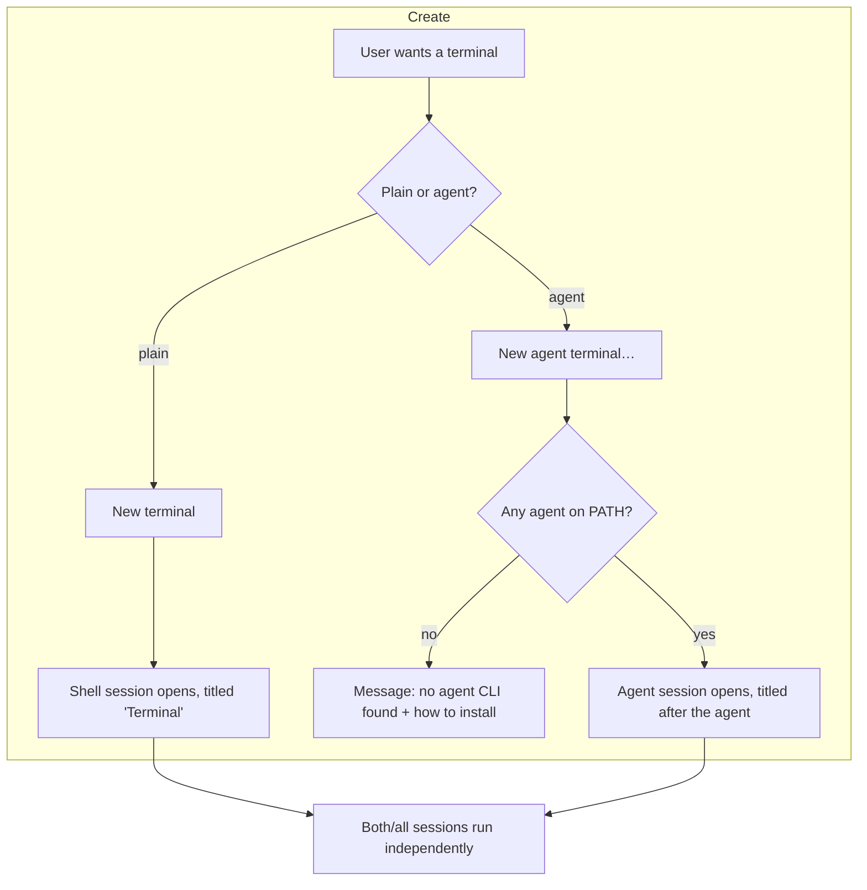
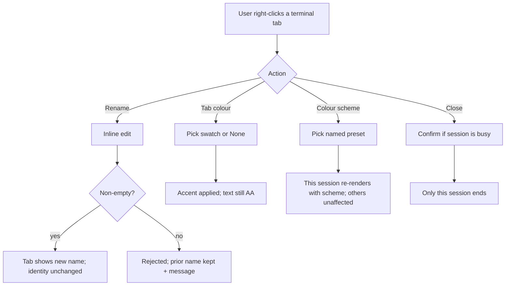
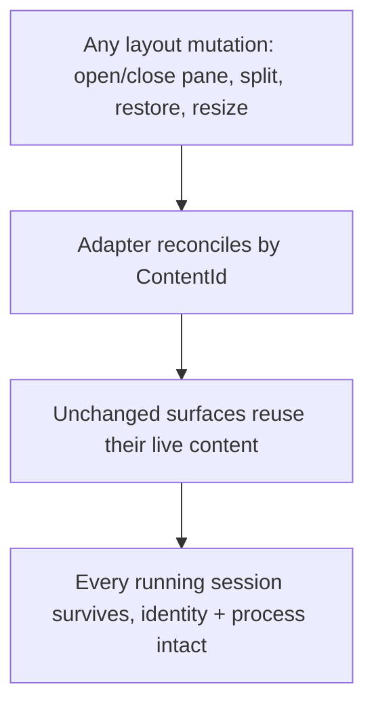

# Multiple terminal sessions — lifecycle, rename, tab colour & colour schemes

## Part A — Functional (what & why)

### Problem (solution-independent)

A user runs long-lived, stateful work inside terminal panes — a Copilot CLI session in one, a
plain shell in another, an agent in a third. Today the workbench cannot hold more than one such
session safely, cannot create a plain terminal, and cannot tell one terminal from another:

1. **Sessions are destroyed by unrelated actions.** Opening a second terminal — or *any* layout
   mutation — terminates every already-running terminal, losing whatever the user had running
   (verified root cause: INV-0002 / DC-029; `WorkbenchAdapter.Render()` rebuilds every pane on each
   mutation and the ConPTY kill-on-close job kills the replaced process).
2. **There is no "plain terminal".** The only create action is "New agent terminal", which launches
   the first agent CLI on PATH and names the tab after it ("claude") — so a user who wants a shell
   gets an agent-flavoured tab that is neither clearly a shell nor a working agent.
3. **Terminals are indistinguishable.** They cannot be renamed, cannot be visually tagged, and share
   one appearance, so a user with three open cannot tell at a glance which is Copilot, which is a
   build shell, and which is a scratch prompt.

The underlying need: **hold several independent terminal sessions at once, keep each alive until the
user closes it, and make each one identifiable and customizable.**

### Personas & jobs-to-be-done

| Persona | Job-to-be-done |
|---|---|
| **Multi-agent technical lead** (primary; from `spec-ai-native-ide`) | Run several concurrent sessions — an agent CLI, a build shell, a scratch shell — side by side, keep each running while I rearrange panes, and tell them apart instantly. |
| **Single-shell user** | Open one plain terminal quickly, without being handed an agent I didn't ask for. |

### Core scenario

Open a plain **Terminal** (a shell). Open a second **Terminal**; the first keeps running. Start
Copilot in the second and rename its tab "copilot"; give it a coloured tab. Open an **agent
terminal** as a third. Split the layout and open an evidence pane — **all three terminals keep
running, unchanged**. Pick a warmer ANSI colour scheme for the scratch shell so it reads
differently from the others.

### Explicit non-goals

- Terminal *panes within one terminal* (tmux/split-inside-a-pane). Multiplexing is at the **dock**
  level (separate panes), not inside a single terminal.
- Remote/SSH terminals; terminal profiles that sync across machines.
- A full custom-theme editor. Colour schemes are **a small set of named presets plus a tab
  accent** — not an arbitrary 16-swatch editor in v1 (see NFR / residual risk).
- Saved/restored *scrollback* across restarts (separate concern; `TerminalScreen` is viewport-only,
  `simplify:` marked).

### Conceptual domain model (Agent Operations bounded context)

*The model is the highest-priority decision and is written in domain terms only — no keys, types, or
storage. It corrects the model error that produced DC-029: a terminal session is an **entity with a
durable identity**, not a disposable rendering of a surface.*

**Ubiquitous language**

| Term | Meaning |
|---|---|
| **Terminal Session** | One live terminal — a running child process, its screen, and its readiness. Has an identity that persists for its whole life, independent of how or where it is rendered. |
| **Session Kind** | **Shell** (a plain shell — the default) or **Agent(name)** (a named agent CLI). A Shell session is never labelled with an agent name. |
| **Terminal Collection** | The set of open Terminal Sessions in a workspace. |
| **Display Name** | The user-facing tab label. Defaults to a kind-derived name ("Terminal", or the agent name); the user may **rename** it. Renaming never changes the session's identity. |
| **Tab Colour** | An optional accent applied to a session's tab, chosen by the user, to distinguish it visually. A *secondary* channel — never the only way to tell sessions apart. |
| **Colour Scheme** | The ANSI-16 + foreground/background palette a session renders with, chosen from named presets. |
| **Readiness** | Whether a session (esp. an Agent session) has reached its prompt and can be dispatched to. Unchanged by this spec; stated so the model is whole. |

**Entities vs value objects**

- **Entity — Terminal Session.** Identity persists through render, rename, recolour, move, and
  workspace-layout change. Two sessions are never the same even if identically named.
- **Value objects** — Session Kind, Display Name, Tab Colour, Colour Scheme. Defined by their
  attributes, swappable on a session without changing its identity.

**Aggregate — Terminal Collection** (root)

- **The one invariant it protects:** *a Terminal Session's identity and its running process are
  created and destroyed only by explicit user intent (open / close that session). No operation on
  the collection, on the layout, or on any other session may destroy a session's identity or kill
  its process.*
- This invariant is exactly what DC-029 violated: a layout mutation rebuilt and thereby destroyed
  every session. Making it an aggregate invariant is the model-level fix; the render reconcile
  (INV-0002 Phase 1) is its enforcement.

### User stories & acceptance criteria (falsifiable)

**US-1 — A plain terminal, on demand.**
> As a user, I want a "New terminal" action that opens a plain shell, so I get a terminal without an
> agent.
- **Given** the command palette/menu, **When** I invoke **New terminal**, **Then** a Shell session
  opens titled "Terminal" (or the shell name), **and** no agent CLI is launched.
- **Given** no agent CLI is installed, **When** I invoke **New terminal**, **Then** it still
  succeeds (a shell needs no agent).

**US-2 — Sessions survive unrelated actions (the fix).**
> As a user, I want my running terminals to keep running when I do anything else, so I never lose a
> session I set up.
- **Given** a running Terminal Session, **When** I open another terminal, **Then** the first
  session's identity and process are **unchanged** (same process, still running).
- **Given** a running Terminal Session, **When** any layout mutation occurs (open/close another
  pane, split, restore a workspace, resize the window), **Then** every existing session's identity
  and process are **unchanged**. *(This is the necessary+sufficient falsification of DC-029: on
  today's code the process is killed; after the reconcile fix it survives.)*
- **Given** two running sessions, **When** I close one, **Then** only that session's process ends;
  the other is untouched.

**US-3 — Distinct, explicit create actions.**
> As a user, I want "New terminal" and "New agent terminal" to be clearly separate.
- **Given** the menu, **Then** **New terminal** (plain shell) and **New agent terminal…** (named
  agent) are distinct, differently-titled commands, and neither is worded as the other.
- **Given** New agent terminal with agents installed, **When** I invoke it, **Then** it lets the
  agent be chosen (or names the tab after the chosen agent), and a Shell session is never labelled
  with an agent name.

**US-4 — Rename a terminal.**
> As a user, I want to rename a terminal tab so I can label what it's for.
- **Given** a session, **When** I rename it to a non-empty string, **Then** the tab shows the new
  name **and** the session's identity and process are unchanged.
- **Given** a rename to empty/whitespace, **Then** the rename is rejected and the prior name kept
  (with a stated, humane message).

**US-5 — Colour a terminal's tab.**
> As a user, I want to tag a tab with a colour to tell terminals apart.
- **Given** a session, **When** I pick a tab colour from the offered set, **Then** the tab shows
  that accent **and** the tab text still meets contrast AA against it (US-8).
- **Given** a session with a tab colour, **Then** the colour is a *secondary* cue — the Display
  Name remains the primary distinguisher (never colour alone).

**US-6 — Choose a terminal's colour scheme.**
> As a user, I want to set the colour scheme (ANSI palette) of a session so its content reads
> differently.
- **Given** a session, **When** I pick a named colour-scheme preset, **Then** that session renders
  its output with that scheme, **and** other sessions are unaffected (scheme is per-session).
- **Given** any offered preset, **Then** its foreground meets contrast AA against its background.

**US-7 — Customization persists with the session/workspace.**
> As a user, I want a renamed/coloured terminal to keep its look while it's open.
- **Given** a renamed/recoloured/re-schemed session, **When** the layout re-renders for any reason,
  **Then** the name, tab colour, and scheme are retained (they are session state, not render state).

**US-8 — Accessibility floor.**
- Tab text meets **WCAG 2.2 AA** contrast against every offered tab colour and every scheme
  background; sessions are distinguishable **without** relying on colour (name + optional icon);
  rename and colour actions are keyboard-reachable.

### ISO/IEC 25010 NFR checklist

| Attribute | Requirement / N/A |
|---|---|
| Functional suitability | The eight stories above; the aggregate invariant holds under every layout mutation. |
| Reliability | No session is lost except by explicit close; a session that fails to start shows failure in-pane (existing behaviour) rather than crashing the workbench. |
| Performance efficiency | Opening/closing/renaming a terminal is O(1) in the number of open sessions; a layout mutation does **not** restart any surviving session (no re-spawn cost). |
| Usability | Create/rename/colour/scheme are discoverable from the tab context menu and the command palette; primary distinguisher is the name. |
| Compatibility | Colour schemes address the ANSI-16 vocabulary already tokenised in `App.xaml` (`TerminalAnsi0..15`). |
| Security | No new trust boundary; rename/colour are local UI state. Agent-vs-shell distinction preserves the readiness/dispatch gate (a Shell is not dispatchable). |
| Maintainability | The render adapter reconciles by key (removes DC-029's rebuild-the-world); session state lives on the session, not the render tree. |
| Portability | N/A (Windows/WPF host). |

---

## Part B — UX specification (how it works)

### Information architecture

- **Two create commands**, clearly separated in the **Terminal** menu and command palette:
  **New terminal** (plain shell; a common shortcut, e.g. Ctrl+K, T) and **New agent terminal…**
  (named agent; existing Ctrl+K, A).
- **Per-tab context menu** on every terminal tab: **Rename**, **Tab colour ▸** (a small swatch
  set + "None"), **Colour scheme ▸** (named presets), **Close**.
- **Tab strip**: each terminal is a document tab showing an optional colour accent, the terminal
  icon, the Display Name, and a readiness/activity indicator (existing).
- Labels feed the glossary: *Terminal Session*, *Shell terminal*, *Agent terminal*, *Tab colour*,
  *Colour scheme*.

### User flows

### Wireframe-level structure

- Terminal document tab: `[colour accent bar] [terminal icon] [Display Name] [activity dot] [×]`.
- Tab context menu: Rename / Tab colour ▸ / Colour scheme ▸ / Close.
- Colour picker: a compact row of ~6–8 accent swatches + "None"; keyboard-navigable.
- Colour-scheme submenu: named presets (e.g. *Default*, *Warm*, *Cool*, *High-contrast*), each a
  one-line label with a tiny preview swatch strip.
- Empty state (no terminals open): a quiet prompt — "No terminals open. New terminal (Ctrl+K, T)."

### UX acceptance criteria

- A user reaches a plain terminal in **one** action (New terminal).
- Every flow above has a specified recovery path (no agent found; empty rename; busy-close
  confirmation).
- No session-destroying action is reachable except **Close** on that specific tab.

---

## Part C — UI specification (how it looks)

### Archetype

**JTBD → archetype:** managing several concurrent, long-lived, individually-identifiable working
sessions in a tabbed workspace is a **B-series operational** job (record/throughput management),
realised here as the workbench's existing **tabbed document pane** (AvalonDock) — nearest catalog
row **B2 · Enterprise Master-Detail** (a tabbed operational surface), specialised to a terminal
tab-strip. **Archetype Signature (deviations noted):** `Type:OLTP; Arch:SPA; Layout:MasterDetail;
Density:Compact; Nav:ContextMenu+CommandPalette; Input:KeyboardFirst+PrecisionPointer;
Color:DarkAdaptive; Feedback:Confirmed; Motion:Micro; Pacing:Freeform; A11y:WCAG_2.2_AA`. This is a
small customization surface layered on the shipped facelift, not a new screen.

### Tokens & design language

References the shipped `App.xaml` token system (the facelift): terminal ground/ink (`TerminalAnsi0..15`,
sunken surface), accent `#5B9DD9`, `SurfaceChrome` rounded island treatment, and the icon system
(`IconTerminal`). Tab-colour swatches and colour-scheme presets are drawn from / harmonised with
these tokens — no arbitrary hex. (No separate `DESIGN.md` yet; the App.xaml token set is the Surface
system these criteria are written against.)

### Key screens & component states

- **Terminal tab** states: default, hover, focus (visible ring), **active/running** (activity dot),
  **attention/waiting-on-user** (existing readiness cue), **renaming** (inline edit), **error**
  (failed to start — shown in-pane), **with tab colour** (accent bar), **without** (neutral). All
  meet AA.
- **Tab colour picker**: swatch default/hover/focus/selected + "None"; each swatch shows a
  selected state; keyboard-navigable.
- **Colour-scheme submenu**: preset default/hover/focus/checked; a tiny preview strip per preset.
- **Empty state**: the quiet "New terminal" prompt.
- Motion: **Micro** only (tab select, menu open); honours `prefers-reduced-motion` (instant).
- Real copy: "New terminal", "New agent terminal…", "Rename", "Tab colour", "Colour scheme",
  "Close", "No agent CLI was found on PATH…", "No terminals open. New terminal (Ctrl+K, T)."

### UI acceptance criteria (falsifiable)

- Tab text meets **contrast AA** against every offered tab colour and every scheme background
  (checked at the token layer).
- Sessions are distinguishable **without colour** (name + icon carry the meaning; colour is
  additive).
- Every component state above is present (no colour-only, no missing empty/error/renaming state).
- All customization actions are keyboard-reachable; the picker and submenu are operable without a
  mouse.
- Motion collapses to instant under reduced-motion.

---

## Comparables & evidence

| Product | What it does here | Confidence |
|---|---|---|
| **VS Code integrated terminal** | Multiple independent terminals in a list/tabs; per-terminal rename; per-tab colour ("Change Colour"); terminal profiles; a terminal is never killed by opening another. The canonical reference for this exact feature set. | Verified (widely documented behaviour) |
| **Windows Terminal** | Named tabs, per-tab colour, per-profile colour schemes (ANSI-16 + fg/bg) selectable per session. Direct precedent for the colour-scheme model. | Verified |
| **JetBrains IDE terminal** | Multiple terminal tabs, rename, split; sessions persist across tool-window operations. | Inferred |
| **xterm.js / node-pty** (already cited in `spec-ai-native-ide`) | Browser-terminal reference; MIT. | Verified |

The reconcile-by-key fix mirrors keyed reconciliation in retained-mode UI (React/virtual-DOM,
AvalonDock's own `ContentId`): reuse unchanged nodes, add new, remove gone — never rebuild the
world.

## Governance lenses

| Lens | Applies? | Answer |
|---|---|---|
| Requirements traceability | Yes | Stories US-1..8 → acceptance criteria → tests (US-2 is the DC-029 control). |
| Quality attributes | Yes | ISO 25010 table above. |
| Threat model (STRIDE) | Low | No new trust boundary; the Shell-vs-Agent distinction preserves the dispatch/readiness gate (a Shell is not dispatchable). |
| Privacy | N/A | No personal data; rename/colour are local UI state. |
| Accessibility | Yes | US-8 + Part C AA criteria; UX & Accessibility veto. |
| Performance budget | Yes | Layout mutation must not re-spawn surviving sessions; O(1) create/close. |
| Release/rollback | Yes | The reconcile fix is behaviour-preserving for a single terminal; multi-terminal is additive. |
| Observability | N/A (existing readiness signalling unchanged). |

## Residual risk & flagged unknowns

- **Ownership split (flagged):** the **lifecycle fix** (reconcile-by-`ContentId` in
  `WorkbenchAdapter.Render()`) and the **"New terminal" command** are **Core-owned** (session
  lifecycle, command catalog). **Rename / tab colour / colour-scheme UI** is **Design-owned**. The
  spec covers both; implementation must be coordinated and claimed accordingly.
- **Colour-scheme scope (flagged):** v1 offers **named presets**, not a full 16-swatch editor
  (non-goal). A future arbitrary-palette editor is deferred.
- **Persistence depth (flagged):** whether rename/colour/scheme persist across app restarts (vs only
  while open) depends on the per-workspace layout store (`LayoutStore`); v1 requires persistence
  *while open* (US-7); cross-restart persistence is a Core layout-store decision to confirm in
  `/design`.
- **Busy-close confirmation (flagged):** whether closing a *running agent* session prompts for
  confirmation — recommended, to be confirmed in `/design`.

## Gate record

- **GATE spec · draft · authored (Copilot design session)** — three layers present; conceptual model
  settled before UX/UI; functional criteria falsifiable (US-2 is the DC-029 control observed failing
  today); UX flows cover happy + error + recovery; UI archetype recorded (B2, deviations noted) and
  specified to WCAG AA; comparables sourced. **Verdict: PASS-WITH-CONDITIONS** — the Core/Design
  ownership split and the three flagged unknowns to be resolved in `/design`. Authors did not
  self-clear a hard veto; no identity/PII/data surface. Adversarial review to run at `/design`.
