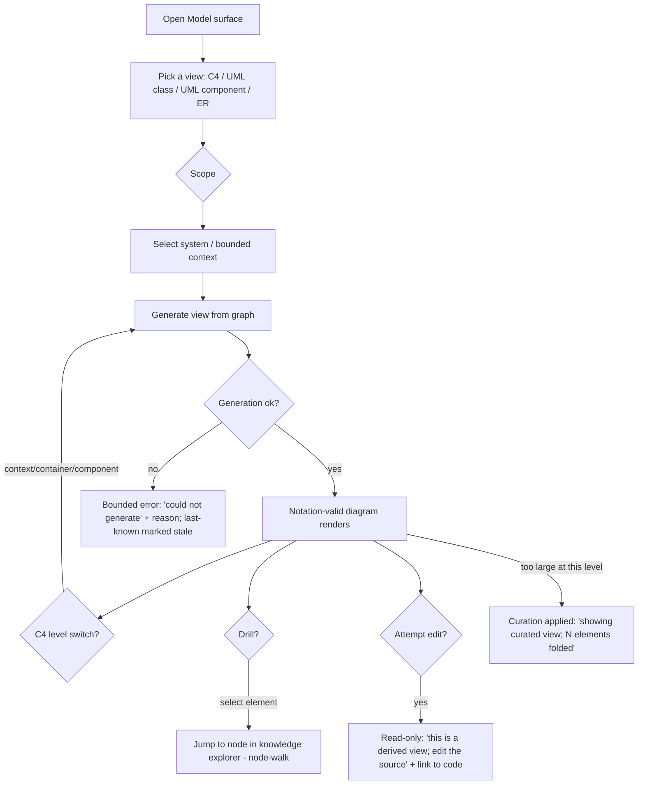

# UML & ERM Surfaces

- **Tier:** T1 (read-only derived views; notation-correctness and the derived-view rule are the load-bearing
  constraints). Above T0 for the correctness veto and a11y floor.
- **Grounding path:** `spec-uml-erm-surfaces → spec-ai-native-ide → knowledge-hub`; evidence from
  `kb-uml-mde-and-4gl`, `kb-domain-modeling-and-erm`, `kb-diagram-generation`; composes with
  `spec-knowledge-exploration` (the graph these views project from).

## Part A — Functional (what & why)

**Problem.** The original spec establishes that AI-DE renders **code-derived views, not editable diagrams**, and
that *the models are views of the abstract syntax, not the source of truth* (SysML v2 position). This spec makes
**UML and ERM first-class surfaces** — not incidental Mermaid embeds, but polished, notation-correct,
navigable diagram surfaces generated **from the repo graph**: C4 (context/container/component), UML class and
component and sequence diagrams over the code graph, and **ER diagrams** over the data model (EF Core mappings,
the conceptual model). The emphasis is **first-class artifacts with highly polished visualization** that build
off the graph.

**Core scenario.** A reviewer opens the **Model** surface, picks *ER diagram* for a bounded context → a valid
crow's-foot ER diagram renders (correct cardinality, keys, associative entities) generated from the schema/graph
→ they switch to *UML class* for the same context → a notation-valid class diagram renders → they drill from a
class into its code (handoff to the knowledge-exploration node-walk) → nothing is editable in the diagram; a
change is made in code and the diagram regenerates.

**Personas / JTBD.** *The architect/reviewer* — "show me this system's structure and its data model in the
notation I already read, correctly, and always current with the code." *The newcomer* — "give me the C4 context
before the component detail."

**Non-goals.** (1) **No editable diagrams** — the derived-view rule is absolute (the failure that killed CASE/
MDA). (2) No L4/code-level over-generation ("often not worth the effort"). (3) Not a general drawing tool. (4)
Not a re-implementation of the graph explorer — these are *structural views* that compose with it.

**Conceptual domain model (no new aggregate — presents existing).** Ubiquitous language of the modelling surface:
- **Model view** — a derived, read-only projection of the repo graph into a standard notation: `c4-context`,
  `c4-container`, `c4-component`, `uml-class`, `uml-component`, `uml-sequence`, `er-diagram`.
- **Model element** — a projected node (a container, component, class, entity) with its **stereotype**.
- **Model relationship** — a projected typed edge rendered in the view's notation (UML association/aggregation/
  composition/dependency; ER crow's-foot cardinality), carrying provenance.
- **Grain/level** — the C4 level or the aggregate boundary the view is scoped to.

Invariants honoured: **a model view is derived and read-only** (the project's load-bearing rule); a UML/ER
relationship's notation must match the true graph relationship (the uml-erm-modelling-expert's veto); the C4
hierarchy is enforced (a Component cannot call a Person).

**User stories & acceptance criteria (Gherkin, falsifiable).**

- **US-U1 — C4 levels.** `Given a system, When the operator selects a C4 level, Then a valid C4 diagram renders at that level (context/container/component), And illegal edges (e.g. a Component calling a Person) are impossible — the generator enforces the hierarchy (prefer Structurizr over raw Mermaid where C4 correctness matters).`
- **US-U2 — UML notation validity.** `Given a class/component view, When it renders, Then relationships use correct UML notation (association/aggregation/composition/dependency, multiplicity), matching the repo graph, valid per the uml-erm-modelling-expert clears-when.`
- **US-U3 — ER correctness.** `Given a bounded context's data model, When the ER view renders, Then cardinality is correct crow's-foot, keys are shown, And every many-to-many has an explicit associative entity (no silent M:N).`
- **US-U4 — Derived, read-only.** `Given any model view, When the operator attempts to edit an element, Then the diagram is read-only and directs them to the source (code/model); a change made in source regenerates the view (MODEL-VIEW-EDITABLE is impossible).`
- **US-U5 — Generated from the graph, current.** `Given a code/schema change, When the view is next opened (or on regeneration), Then it reflects the change; a diagram claiming a relationship the graph lacks is a defect (model↔reality drift).`
- **US-U6 — Provenance carried.** `Given a projected relationship that is INFERRED (e.g. a DI or ORM edge static analysis could not fully resolve), When rendered, Then it is visually marked as inferred, not shown as an extracted fact.`
- **US-U7 — Level-appropriate, not over-generated.** `Given a large system, When a component view is requested, Then curation applies (fold/elide per policy) so the diagram is readable — no complete auto-generated component graph nobody can read.`
- **US-U8 — Drill to code / knowledge.** `Given a model element, When selected, Then the operator can drill to the underlying node in the knowledge-exploration surface (the node-walk), And back.`
- **US-U9 — Layout stability & polish.** `Given a regenerated view, When a small change occurs, Then node positions are preserved by stable id (mental map), And the rendering meets the polish floor (consistent spacing, legible labels, no overlaps at the target size).`

**ISO 25010 NFR.** Usability/polish — the point (first-class, polished). Performance — view render p95 <2s at the
container level on the approved corpus; commit the *generated DSL* (Structurizr/Mermaid), not the rendered SVG,
until byte-determinism is measured (`kb-diagram-generation`). Maintainability — one generation pipeline from the
graph; one notation authority. Accessibility — WCAG 2.2 AA; a diagram carries a text/structured alternative
(Mermaid `accTitle`/`accDescr`; the model as a navigable list). Reliability — a generation failure renders a
bounded error, never a stale-shown-as-current diagram.

## Part B — UX specification (how it works)

**IA.** A **Model catalog → view** master-detail: a left rail lists available model views grouped by kind (C4 /
UML / ERM) and by bounded context/scope; the centre renders the selected view; a top bar carries the C4-level
switch, the scope selector, and the "drill to graph" action. Composes with — does not duplicate — the
knowledge-exploration surface (a model view is a *structural projection* of the same graph).

**User flows (happy + alternate/error/recovery).**

**Wireframe structure.** Left: model-view catalog (kind → scope). Centre: the diagram (rendered from generated
DSL), with a provenance legend and a scope/level breadcrumb. Right (optional): the selected element's summary +
"open in graph" + "open source". A read-only banner is present on every view.

**UX acceptance.** `Every view states its kind, scope, and C4 level`; `every view has a visible read-only
affordance and a drill-to-source path`; `the generation-failure and too-large-curated states are specified`.

## Part C — UI specification (how it looks)

**Archetype Signature.** **B2 Master-Detail** (catalog → view) with a **diagram render surface**. Not a canvas
(the diagram is generated and laid out, not freely spatial). **JTBD→archetype rationale (auto-selected):** the
job is *select a structural view and read it* — a record-management/browse job (B-series), not spatial
exploration (C) or entry (A). Signature: `Type:DSS; Arch:SPA; Layout:MasterDetail; Density:Comfortable;
Nav:Sidebar+Breadcrumb; Viewport:DesktopBound; Input:PrecisionPointer+KeyboardFirst; Color:DarkAdaptive;
Depth:SoftShadow; Sync:LocalFirst; Feedback:Confirmed; Motion:None; Pacing:Freeform; A11y:WCAG_2.2_AA;`.

**Triggered standards.** **UI-T1 (`technical-ui-design.md`)** fires — expert structural surface: dense-with-
hierarchy (TQ1), legible labels/notation, provenance as categorical encoding. Layout stability (TQ8/reactive-
recompute analogue) matters — pin positions by id.

**Specified to U1–U20 against `DESIGN.md`:**
- **Generation** — the pipeline is `graph query → projection model → DSL → render`. **Structurizr** for C4
  (enforces the model), **Mermaid** for class/ER/sequence embedded rendering (MIT, in-pane), per
  `kb-diagram-generation`. Commit the DSL, not the SVG (until determinism measured).
- **Complete states** (U9) — view: default/generating(skeleton)/empty(no elements at scope)/too-large-curated/
  generation-error/stale; element: selected/inferred-marked. **Read-only banner always present.**
- **Notation** — UML per UML 2.5.1; ER crow's-foot; C4 per c4model.com. The uml-erm-modelling-expert's veto
  gates notation validity.
- **Provenance** — inferred relationships (DI/ORM/dynamic) visually marked (dashed + "inferred" label), never
  shown as extracted facts (glyph+label, not colour alone).
- **Motion** — 0ms for layout (DESIGN.md); reduced-motion → instant.
- **Copy** — "Derived view — read-only. Edit the source to change it.", "Could not generate the container view:
  <reason>. Showing the last generated view (stale).", "Showing a curated view — 24 low-level elements folded.",
  drafted in `/ui-design`.
- **WCAG 2.2 AA** — each diagram carries `accTitle`/`accDescr` and a navigable element list; contrast per DESIGN.md.
- **`DESIGN.md`** referenced; `/ui-design` adds an inferred-relationship token and a read-only-banner token.

## Comparables & evidence
- **Structurizr** — the C4 reference implementation; model/views separation = derived views. *(Verified, `kb-diagram-generation` [S13-17].)*
- **Mermaid C4 vs Structurizr** — Mermaid will let a Component call a Person; Structurizr enforces. *(Verified.)*
- **SysML v2 / the models-as-product graveyard** — why derived-and-read-only is the survival condition.
  *(Verified, `kb-uml-mde-and-4gl`.)*
- **EF Core → ER** — the extractable data-model bridge. *(Verified, `kb-domain-modeling-and-erm`.)*

## Governance lenses
Accessibility (hard floor + diagram alternatives), Performance (generation budget, commit-DSL-not-SVG),
Maintainability (one generation pipeline), Observability (generation telemetry + staleness). Privacy/Threat —
minimal (read-only local; a WebView2 render pane is a trust boundary). Release — regeneration on change; PlantUML
(if ever used) runs with a non-default security profile (`kb-diagram-generation` finding #4).

## Residual risk & flagged unknowns
- **SVG byte-determinism** unresolved (`kb-diagram-generation` #5) — gates committing rendered output; commit DSL.
- **Layout stability** across regenerations has no free solution (#6) — pin by id or accept re-teaching; a
  first-class polish requirement, not incidental.
- Whether ER is generated from EF Core mappings, the conceptual model, or both is a `/design` decision.

## Gate record
`GATE spec-uml-erm-surfaces · 2026-08-29 · Product Strategist + uml-erm-modelling-expert + kg-visualization-ux-expert + Data & Persistence + UX Researcher/IA (peers) / Simplifier + Test Architect + uml-erm-modelling-expert + UX & Accessibility (adversaries) · exit: notation-validity, derived-read-only, C4-enforcement, provenance, layout-stability all criteria · verdict: PASS-WITH-CONDITIONS (determinism + layout-stability flagged) · vetoes: none unresolved`
