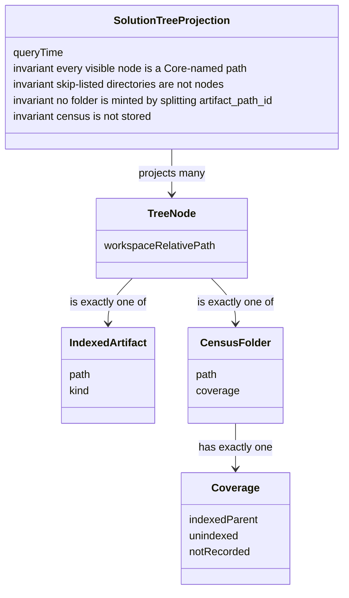

# Spec: Understanding views — D-0 Solution tree

- **Status:** Draft (adversarial gate is N4; authors do not self-clear).
- **Tier (cost-of-error):** T2 — it admits the first understanding view onto the Architecture
  allow-list later; a wrong grain makes every later view navigate a lie.
- **Author / date:** N3 `/specify`, session `understanding-views-specify`, 2026-09-14.
- **Authority:** Owner ruling `note-understanding-views-owner-ruling` (admit D-0 only);
  N1 disposition `note-understanding-views-owner-n1-disposition` (census grain — **this**
  grain, not the two-clause draft); Addendum C §A5 (admitted-when and AR3); ADR-0030
  (allow-list column; derived menu).
- **Grounding path:** `spec-addendum-c-perspectives` §A5 D-0 → `note-understanding-views-owner-ruling`
  → `note-understanding-views-n1-inventory` (STOP-BEFORE-N5) → `note-understanding-views-owner-n1-disposition`
  (census admitted) → `note-understanding-views-n2-comparables` → `adr-0030-perspective-registry-and-allow-lists`
  → `adr-0017-primary-view-mode`. Conflict surfaced, not overridden: N0's two-clause model cell
  is **superseded** by the N1-disposition grain (indexed-parent folders). Live schema has no
  `artifact_dim` (`conceptual-model-ai-native-ide` still names one — drift, not this spec's
  table). N2's specify-handoff still said the two-clause grain; this spec follows the later
  disposition. **[Verified]** from those artifacts, not from memory of `src/`.

<!-- ONE spec, THREE layers. Functional → UX → UI. Conceptual model before both surfaces. -->

## Quoted authorities (DC-189 — trigger sentences, not paraphrases)

These sentences govern this spec. Later slices quote them; they do not thin them.

**D-0 admitted-when** (`spec-addendum-c-perspectives` §A5):

> Given a workspace, When the tree opens, Then code, data and architecture artifacts are listed by project and folder with a kind glyph, And activating an item reveals it in the Architecture graph or opens its source, And a folder the index has not covered is shown with an "unindexed" state.

**Grain** (`note-understanding-views-owner-n1-disposition`):

> One tree node is exactly one Core-named workspace-relative path: **either** one indexed artifact (a file/document resolved from latest assertions) **or** one census folder (a directory Core observed). Skip-listed directories are not nodes. A census folder’s coverage is `indexed-parent` | `unindexed` | `not-recorded`.

**AR3** (`spec-addendum-c-perspectives` §A5):

> Each deferred view is admitted to the **Architecture** allow-list, and to its derived menu, only in the slice that builds it (AR3) — never scaffolded ahead.

**Allow-list and derived menu** (ADR-0030 Decision 2–3):

> Add an explicit `Perspectives` column to the App's `SurfaceKind` row — a non-defaulted `IReadOnlySet<string>` of perspective ids

> an empty set fails the build test

> menu, palette, rail and routing are derived from the join of those two row sets — never a second hand-written list

**DC-022** (`IWorkspaceQueries` remarks on `SearchContentAsync` / `NodeContentAsync`):

> The App must not read workspace files: two authorities on what a file contains disagree the first time one resolves a path differently (DC-022), and file access belongs on the side of the boundary that can confine it to the workspace.

**No second graph store** (`spec-addendum-c-perspectives` §A5 item 3):

> No in-surface "knowledge / architecture" toggle and no second graph store: one substrate, two surfaces (Ruling 53).

**Use Case 4 / Tests** (`spec-addendum-c-perspectives` §A5 item 1):

> Use Case 4 (Test Coverage). No perspective, no rail item, no reserved layout beyond the reserved name "Tests". A rail item with nothing behind it is the defect AR3 removed (Ruling 54).

---

## Part A — Functional specification
*What the product must do and why. ISO/IEC/IEEE 29148 + user stories with Gherkin. Owner: Product Strategist.*

### Problem

An operator who is trying to **understand a workspace** cannot see which code, data and architecture
artifacts the index actually covers, grouped the way they already think (project and folder). The
Architecture graph shows neighbourhoods of nodes. The Explore body is a full-window graph+reader
(ADR-0017). Neither lists artifacts by project and folder. Neither can show a folder the index has
not covered as an explicit state. Absence today looks like emptiness, which is a lie: skip-listed
build output, unindexed source folders, and census shortfalls are different facts. The operator
needs an honest navigator over what Core has named, so they can jump to the graph neighbourhood or
the source of one artifact without pretending the tree is a second file manager or a second graph.

This is not a request for a control toolkit, a stored folder table, or Atlas.

### Target users & personas

- **Primary — Architect / reviewer (Architecture perspective).** Job: find a code, data or
  architecture artifact by project and folder, see whether that folder is indexed, and activate it
  to read structure (graph) or source. Success: they never take silence for coverage.
- **Secondary — Operator returning from Coding.** Job: switch to Architecture and locate the
  artifact an agent just touched, without leaving the reading host.
- **Not this horizon — Test author, composer deriver, Atlas user.** No Tests perspective; no D-5/D-6;
  no Atlas paths.

JTBD (primary): *When I am understanding this workspace, help me list what the index covers by
project and folder, show me what it has not covered, and take me to the graph or the source of one
item — without hiding gaps or inventing folders.*

### Core scenario

The operator is in **Architecture** with a workspace open. They open the **Solution tree**. Core
returns a query-time census of directories joined to latest-generation indexed artifacts. The tree
lists those Core-named paths by project and folder, each indexed artifact with a kind glyph. A
census folder that has joinable indexed artifacts is an **indexed-parent**. A census folder that is
not skip-listed and has zero joinable indexed artifacts shows **Unindexed** (word + glyph). A
skip-listed directory (example: `bin`) is **not a node**. A census shortfall shows **Not recorded**,
never a complete-looking empty tree. The operator activates an indexed artifact: the Architecture
graph shows its neighbourhood (`GraphAsync` / `DescribeAsync`) **or** source opens
(`NodeContentAsync` / admitted `codeviewer`). No third reveal path. No Atlas type.

If this path works end to end, D-0 is worth building. Everything else in this spec protects that
path from looking complete when it is not.

### Conceptual domain model (DM1 / DM4 — before UX/UI)

**Bounded contexts.** The payload lives in **Evidence and Projection** (existing:
`conceptual-model-ai-native-ide`). The surface lives in **Shell presentation** (Addendum C §A6).
This spec introduces **no stored aggregate** and **no folder fact table**. Census is query-time
disk-now, derived (DM7). The conceptual model’s `artifact_dim` is **not** realised this horizon
(N1: live schema has none). Do not mint one to make the tree look complete.

**Ubiquitous language** (one word, one meaning — seeds the glossary)

| Term | Definition | Kind |
|---|---|---|
| **Solution tree** | The Architecture-pane navigator this spec admits (D-0). Not Explorer. Not Atlas. | Presentation entity (identity: the one instance in Architecture) |
| **Tree node** | Exactly one Core-named workspace-relative path. | Entity (identity: that path) |
| **Indexed artifact** | A file or document resolved from latest-generation assertions (joined via `declared_at` / scope location). | Entity |
| **Census folder** | A directory Core observed at query time. Folder identity comes from the census, never from splitting `artifact_path_id`. | Entity |
| **Coverage** | On a census folder only: `indexed-parent` \| `unindexed` \| `not-recorded`. Exactly one. | Value object |
| **Indexed-parent** | A census folder with one or more joinable indexed artifacts under it. | Coverage value |
| **Unindexed** | A census folder **not** on the skip list, with **zero** joinable indexed artifacts. Rider “no index”, not VS Code hide. | Coverage value |
| **Not-recorded** | Census shortfall: IO, permission, or cap. Never a fake folder. Never a complete-looking empty tree. | Coverage value |
| **Skip-listed directory** | A directory the **one** surviving Core skip set names. **Not a node.** Not unindexed (the index is not supposed to cover it). Not not-recorded (the skip is known). | Not in the tree |
| **Skip set** | One existing Core skip policy the census consumes. Not a fourth `HashSet`. Not VS Code `files.exclude`. Architecture unifies today’s disagreeing lists. | Value object (existing policy) |
| **Kind glyph** | The visible kind of an indexed artifact (code / data / architecture, plus file kind). Colour is never the only signal (`DESIGN.md`). | Value object |
| **Disclosure** | An honest shortfall the tree must show (Python/TS per-file not recorded; omitted-by-cap count). | Value object |

**Grain (declared before any column):** one tree node is exactly one Core-named workspace-relative
path — **either** one indexed artifact **or** one census folder. Skip-listed directories are not
nodes. Two people given this grain and a real workspace produce the same node set.

**Not the grain:** one node = indexed artifact OR unindexed folder only — that erases indexed-parent
folders and forces illegal path-splits to nest files. **Not the grain:** `OverviewAsync` clusters
(identifier-prefix groups, `MaxClusters` omission, no unindexed). **Not the grain:** `GraphAsync`
nodes (no path, caps omit nodes, no folders).



**Aggregates and the one invariant each protects**

- **Solution tree projection** (root: the query-time projection for the open workspace).
  **Invariant:** every visible node is a Core-named workspace-relative path; skip-listed
  directories are not nodes; a census folder carries exactly one coverage value; folders are
  never invented by splitting `artifact_path_id`; unresolvable assertion paths are
  **not-recorded**, not guessed folders; the App does not walk disk.
- **Perspective Layout** (existing, Addendum C §A6). **Invariant:** every surface in
  Architecture’s host is of a kind Architecture admits. D-0’s kind enters that set **only** in
  the slice that builds it (AR3).
- **Scope Snapshot** (existing evidence aggregate). Untouched. Indexed artifacts are latest
  assertions under the committed generation; this spec does not rewrite extractors.

**Python / TypeScript / Bicep honesty (this horizon)**

- Python and TypeScript extractors store `request.ScopeId` as `Provenance.ArtifactPathId` with
  null source location — **not a file path**. This spec does **not** rewrite extractors.
- Those **scopes** appear as indexed **folders** (the scope directory).
- Per-file `.py` / `.ts` artifacts are **not recorded**. No fake file rows from a second walk.
- Bicep filename-only paths resolve via scope location; never treat the filename as a folder;
  else **not-recorded**.

**Durable representation.** Out of this spec (architecture). Binding constraint: **no stored
census / `folder_dim` this horizon**; **no second graph store**.

### In scope / Out of scope (explicit non-goals)

**In (this horizon, D-0 only)**

- The Solution tree as an Architecture-pane navigator over the declared grain.
- Query-time Core census + latest indexed artifacts, App-must-not-read (DC-022).
- Hard states: empty, loading, unindexed, not-recorded, error, no-workspace — plus Python/TS
  disclosure and skip-omission as a named rule.
- Activate → existing `GraphAsync` / `DescribeAsync` **or** `NodeContentAsync` / admitted
  `codeviewer`.
- The **requirement** that the later building slice add **one** `SurfaceKind` row with
  Architecture in its `Perspectives` column, and that the menu pick it up by derivation
  (ADR-0030). This specify turn does **not** add that row.
- D-1…D-6 kept in this document with §A5 admitted-when **copied**, not paraphrased.

**Out (non-goals — load-bearing)**

1. **D-1…D-6 are not built this horizon.** They stay named-and-deferred. Admitted-when, copied
   from `spec-addendum-c-perspectives` §A5 (DC-189):

   - **D-1 Entry-points view.** *Admitted when:* Given an indexed workspace, When the view opens,
     Then every API surface, UX surface and CLI entry point in the index is listed as a node with its
     kind, And selecting one scopes the Architecture graph to the neighbourhood reachable from it,
     And an entry point the index could not classify is listed under "unclassified", never omitted
     silently.
   - **D-2 Data flow from an entry point.** *Admitted when:* Given a selected entry point, When the
     data-flow view renders, Then each read and write that crosses a bounded-context or persistence
     boundary is an edge with provenance (`EXTRACTED`/`INFERRED`), And an unresolvable step renders
     as a labelled gap, never as a verified edge.
   - **D-3 ER diagram (crow's-foot).** *Admitted when:* `spec-uml-erm-surfaces` US-U3 holds against
     a fixture schema (cardinality correct, keys shown, every M:N has an associative entity).
   - **D-4 Layer and component diagrams derived from code and from bicep.** *Admitted when:*
     `spec-uml-erm-surfaces` US-U1 holds at container and component level, And an infrastructure
     resource declared in a `.bicep` file appears as a container with its declaring file as
     provenance, And a code→infrastructure edge static analysis cannot resolve is marked inferred.
   - **D-5 The structure deriver** (US-C13's *derived and prefilled* lines). *Admitted when:* Given
     the fixture prose of US-C13 b2 and a fake deriver returning three known strings, the three lines
     carry those strings and the *derived* mark; Given no deriver, the lines are empty and editable;
     **And** an eval harness scores the real deriver on a fixture corpus (derived vs edited vs
     emptied per send, instrumented from the first slice) before it ships behind the seam. Until
     then the composer is a conversation with empty, editable lines.
   - **D-6 Conductor round-trips as derived structure** (S-8, US-C13 b8). *Admitted when:* a
     reply-channel seam exists and a fixture reply carrying a drafted `goal-block` template renders
     as derived lines with no form widget. Until then round-trips arrive as Addendum B `:187` says.

   AR3 (quoted above) still holds: no allow-list row, no derived-menu entry, no scaffold for
   D-1…D-6 until the slice that builds that view.

2. **Use Case 4 (Test Coverage).** Quoted above. No Tests perspective, no rail item, no Tests
   layout. This programme does not open a Tests track.
3. **Not Atlas / not Code Atlas.** Forbidden: `src/AiDe.Core/Understanding/**`; Atlas App/spike
   files; `session-contracts.md` as a D-0 seam. D-0 is an Architecture-pane tree over indexed
   artifacts.
4. **No second graph store** (Ruling 53; quoted). Activate uses the existing Architecture graph
   or source. Do not author a parallel model for the tree.
5. **Not ADR-0017 Explorer.** Explorer is the full-window Explore body (graph+reader). D-0 does
   not replace it, subsume it, or live in Explore.
6. **Not a workspace file manager.** No tree CRUD (add/rename/delete) as the primary job. No
   drag/drop of files. No VS Code `files.exclude` hide. No Rider File System view copy.
7. **Not `OverviewAsync` / `GraphAsync` as the tree query.** Wrong grain (N1). Architecture
   specifies **one new** `IWorkspaceQueries` method + IPC operation. Do not reuse `overview` /
   `graph`.
8. **Not a stored census / `folder_dim` / folder facts this horizon.** Query-time only.
9. **Not App-side directory walk** (DC-022).
10. **Not splitting `artifact_path_id` into folder nodes.**
11. **Not a fourth skip `HashSet`.** Census consumes one existing Core skip set. Architecture
    names the survivor if today’s lists disagree (`CSharpScopeDiscovery.Skip`,
    `UnanalysedLanguages.Skip`, extractor skips — N1). This spec names the *rule*, not a new list.
12. **Not rewriting Python / TypeScript / Bicep provenance** to complete the tree.
13. **Not allow-list or menu rows in this specify turn.** AR3: the row lands in the slice that
    builds D-0. This spec forbids a hand-written menu entry at any time (ADR-0030).
14. **Not freezing the tree toolkit** (WPF `TreeView` vs anything else). N7 Spike Protocol.
15. **Not query name, DTO, cap values, glyph-to-kind mapping.** Architecture + spike.
16. **Not default-layout choreography as a blocker.** Reachability from Architecture is required;
    whether the tree is in the default Left zone is design-slice. Do not replace `canvas`.
17. **Not D-5 / D-6 implementation, composer kinds, or ADR-0036 compile-ladder work.**
18. **Not joining `main`.** Join target is `understanding-views`.
19. **Not architecture ADRs, spike, mockup (`ui-design` is N8), or `src/` in this turn.**
20. **Not adding graph capability in Explore** (`spec-knowledge-explorer-mode` non-goal 1).

### User stories & acceptance criteria (testable)

Each criterion is falsifiable. Oracle: headless Core/App test against a fixture workspace, plus a
rendered-surface / query test where the story says so. Duration SLOs are **recorded, not asserted
in CI** (ADR-0029; DC-107). Caps are architecture’s; this spec requires **disclosure**, not a
number.

**US-T1 — As an architect, I want artifacts listed by project and folder with a kind glyph, so that I can find what the index covers.**
- **Given** a workspace with at least one joinable indexed artifact under a census folder **When** the Solution tree opens **Then** that artifact is a tree node under that folder **And** the node shows a kind glyph **And** the glyph is not the only signal of kind (word or accessible name accompanies it).
- **Given** two indexed artifacts whose resolved paths sit in different census folders **When** the tree opens **Then** they are not siblings under a path-split invented folder; each sits under the census folder Core observed for that path.
- **Falsifier:** `OverviewAsync` clusters as rows; files nested by splitting `artifact_path_id`; a node without a kind glyph; kind by colour alone.

**US-T2 — As an architect, I want indexed-parent folders to exist as nodes, so that files have a real parent without illegal path-splits.**
- **Given** a census folder with one or more joinable indexed artifacts under it **When** the tree opens **Then** that folder is a node with coverage `indexed-parent` **And** it is not labelled Unindexed **And** the indexed artifacts appear under it.
- **Falsifier:** only files appear (parents erased); parent labelled Unindexed; parent invented by splitting a path that Core did not observe as a directory.

**US-T3 — As an architect, I want a folder the index has not covered shown as Unindexed, so that I do not take silence for coverage.** *(§A5 unindexed; Rider “no index”)*
- **Given** a workspace whose Core census includes directory `docs/` **And** `docs/` is not on the surviving skip set **And** zero latest-generation indexed artifacts join under `docs/` **When** the Solution tree opens **Then** `docs/` is a tree node **And** its coverage is `unindexed` **And** the node shows the word “Unindexed” and a glyph **And** the node is not omitted.
- **Falsifier:** `docs/` missing; `docs/` labelled only not-recorded; `docs/` looking like an empty success; a skip-listed directory shown as Unindexed (that is US-T4’s row, and it must not pass here).

**US-T4 — As an architect, I want skip-listed directories omitted, so that build output is not flooded in as “unindexed”.** *(distinct from US-T3)*
- **Given** a workspace containing directory `bin/` whose name is on the surviving Core skip set **And** `bin/` has files on disk **When** the Solution tree opens **Then** `bin/` is not a tree node **And** no node for `bin/` carries coverage `unindexed` or `not-recorded`.
- **Given** the same workspace as US-T3 **When** a test asserts skip-omission and unindexed together **Then** `bin/` is absent **And** `docs/` is present as Unindexed — two different outcomes, one fixture.
- **Falsifier:** `bin/` appears as Unindexed; `bin/` appears as Not recorded; `bin/` appears as indexed-parent; skip implemented as VS Code-style hide with no named rule.

**US-T5 — As an architect, I want census shortfall shown as Not recorded, so that a failed walk never looks like an empty workspace.**
- **Given** the census cannot observe a directory because of IO, permission, or payload cap **When** the Solution tree opens **Then** the shortfall is disclosed as coverage `not-recorded` **And** a cap cause includes an omitted count **And** the tree does not render a complete-looking empty success **And** no fake folder is invented for the unobserved path.
- **Falsifier:** silent omission; empty tree that looks complete; a guessed folder from a path split; the shortfall labelled only Unindexed (US-T3 must fail that input; US-T5 must pass it).

**US-T6 — As an architect, I want Python/TypeScript scopes disclosed as indexed folders without fake per-file rows, so that the tree does not look complete for those languages.**
- **Given** a Python or TypeScript scope whose assertions store `ScopeId` as `ArtifactPathId` **When** the tree opens **Then** the scope directory appears as an indexed folder **And** no per-file `.py` / `.ts` artifact nodes are minted from a second walk **And** a disclosure that per-file artifacts are not recorded is present on the rendered surface (query test + rendered-surface test).
- **Falsifier:** fake `.py`/`.ts` rows; scope folder missing; disclosure absent while such scopes exist; the tree looking complete for those languages.

**US-T7 — As an architect, I want Bicep filename-only provenance resolved via scope location, so that a filename is never treated as a folder.**
- **Given** a Bicep assertion whose `artifact_path_id` is a filename only **And** the scope location resolves it to a census folder **When** the tree opens **Then** the artifact is a file node under that folder **And** the filename is not a census folder.
- **Given** the same filename-only provenance **And** the scope location cannot resolve it **When** the tree opens **Then** the path is **not-recorded** **And** no folder is invented from the filename.
- **Falsifier:** a folder named for the `.bicep` file; a guessed parent from string split; silent drop without not-recorded.

**US-T8 — As an architect, I want activating an indexed artifact to reveal it in the Architecture graph or open its source, so that the tree is a navigator not a third store.**
- **Given** an indexed artifact node in the Solution tree **When** I activate it to reveal structure **Then** the Architecture graph shows that artifact’s neighbourhood via existing `GraphAsync` / `DescribeAsync` **And** no Atlas type is loaded **And** no second graph store is written.
- **Given** an indexed artifact node **When** I activate it to open source **Then** content is fetched via `NodeContentAsync` and shown in admitted `codeviewer` **And** the App does not read the file (DC-022).
- **Given** a census folder node **When** I activate it **Then** the folder expands or collapses **And** no graph node is invented for that folder **And** no third reveal path runs.
- **Falsifier:** a new IPC “treeReveal”; Atlas `Understanding/**`; App `File.Read*`; folder activation fabricating a graph entity.

**US-T9 — As an operator, I want empty, loading, error and no-workspace to be distinct, so that I know what to do next.**
- **Given** no workspace is open **When** Architecture shows the Solution tree **Then** the no-workspace state is shown with the copy in Part C **And** the tree is not an empty success.
- **Given** a workspace is open **And** the tree query is in flight **Then** the loading state is shown.
- **Given** a workspace is open **And** the census-plus-join returns zero nodes and no not-recorded shortfall **Then** the empty state is shown **And** it is not labelled Unindexed (Unindexed is a folder coverage, not the whole tree).
- **Given** the tree query fails (daemon/IPC error) **When** the surface would render **Then** the error state is shown with a Retry path **And** Retry re-enters loading.
- **Falsifier:** no-workspace looking like empty; empty looking like unindexed; error looking like empty; loading with stale nodes presented as current without a stale mark.

**US-T10 — As an operator, I want the Solution tree reachable only as an Architecture kind whose menu entry is derived, so that AR3 and ADR-0030 hold.**
- **Given** the slice that builds D-0 has not landed **When** a headless test reads `SurfaceContentFactory.Kinds` **Then** there is no Solution-tree kind row (this specify turn adds none).
- **Given** the slice that builds D-0 **When** it admits the kind **Then** Architecture is in that row’s `Perspectives` column **And** the View menu/palette gain “Show `<Title>`” by `PerspectiveMenu.For` with **no** edit to a hand-written list **And** Coding and Explore do not admit the kind.
- **Given** a test-time kind row admitted only by Architecture (existing US-C4 mutation) **Then** that contract still holds after D-0’s row exists.
- **Falsifier:** a menu string for an unbuilt kind; a second list; Explore or Coding admitting the tree; scaffolding D-1…D-6 rows “for later”.

**US-T11 — As a reviewer, I want the tree query to be a new Core projection, so that Overview/Graph are not abused and the App does not walk disk.**
- **Given** the D-0 query **When** it runs **Then** it is one new `IWorkspaceQueries` method with a new IPC operation **And** it is not `overview` or `graph`.
- **Given** that query **When** it needs directories **Then** Core performs the census **And** the App process does not enumerate workspace directories to build nodes.
- **Falsifier:** App `Directory.Enumerate*`; handler mapped to `overview`/`graph`; a second SQLite graph.

**US-T12 — As an operator, I want a bounded payload that degrades honestly, so that a large workspace does not silently drop folders.**
- **Given** the projection hits its cap **When** the tree renders **Then** omitted-by-cap is disclosed as not-recorded / omitted count **And** never silent.
- **Falsifier:** truncated tree with no omitted count; cap as a plausible complete tree.

**US-T13 — As an operator, I want the Solution tree not to be Explorer, so that I still have a file-agnostic reading mode.**
- **Given** Architecture is active with the Solution tree open **When** I switch to Explore **Then** the Explore body is still the ADR-0017 graph+reader **And** the Solution tree is not that body.
- **Falsifier:** D-0 replacing Explorer; D-0 hosted as Explore’s full-window surface.

### Non-functional requirements (ISO/IEC 25010 checklist)

| Attribute | Requirement (measurable) |
|---|---|
| Functional suitability | US-T1…T13 hold against the fixture matrix in Boundary set. A green that cannot distinguish US-T3/T4/T5 is a failed suite, not a pass. |
| Performance efficiency | Payload is capped; omitted-by-cap is disclosed (US-T12). Latency is **emitted and recorded** on the normal path (IO1); **no CI test asserts a duration under a constant** (ADR-0029 / DC-107). Cap values are architecture’s. |
| Reliability | Query failure → error + Retry (US-T9). Census IO/permission → not-recorded, not a crash-shaped empty tree (US-T5). |
| Security | App must not read workspace files to build the tree (DC-022). No new identity, PII collection, or irreversible action. Tree shows workspace-relative paths already in Core’s authority. STRIDE: information disclosure of skip-listed dirs is prevented by US-T4; spoofing a folder via path-split is prevented by the grain. |
| Usability | Unindexed / not-recorded / skip-omission are distinct in the UI (word + glyph). Empty, loading, error, no-workspace each have specified copy and a next action. Deepened in Part B. |
| Compatibility | Native Windows WPF shell (`DESIGN.md` `x-platform:windows; x-framework:wpf`). No web-only tree. High-contrast theme uses the same semantic roles. |
| Maintainability | One skip set consumed, not copied. One new query, not a fork of Overview. Menu derived (ADR-0030 mutation test remains the oracle). |
| Portability | N/A — desktop Windows workstation product. |
| Accessibility | WCAG 2.2 AA on the tree: name, role, value for every node; coverage is not colour-only; 2px `{colors.focus}` ring; keyboard move/activate. Native UIA proof is N8/implement (native-client-ui-design); this spec requires the names. |

### Boundary set

The test matrix. Each row is a distinct oracle.

| # | Input | Required outcome | Distinct from |
|---|---|---|---|
| B1 | Workspace with indexed files under observed folders | Indexed artifacts + indexed-parent folders | B3, B6 |
| B2 | Census dir, not skipped, zero joinable artifacts (`docs/`) | Node + `unindexed` | B3, B4 |
| B3 | Skip-listed dir with files on disk (`bin/`) | **No node** | B2, B4 |
| B4 | IO/permission/cap shortfall | `not-recorded` + omitted count if cap | B2, B5, B6 |
| B5 | No workspace | No-workspace copy | B6 |
| B6 | Workspace, zero nodes, no shortfall | Empty copy | B2, B4, B5 |
| B7 | Query in flight | Loading | B6 |
| B8 | IPC/daemon failure | Error + Retry | B4, B6 |
| B9 | Python/TS ScopeId provenance | Indexed folder + disclosure; no `.py`/`.ts` file nodes | B1 looking complete |
| B10 | Bicep filename-only, resolvable | File under scope folder | B11 |
| B11 | Bicep filename-only, unresolvable | not-recorded; filename ≠ folder | B2 |
| B12 | Activate indexed artifact | Graph neighbourhood **or** codeviewer | Folder expand |
| B13 | Hostile/malformed path in an assertion | not-recorded; no invented folder | B1 |

### Comparables & user evidence (sourced)

From `note-understanding-views-n2-comparables` (official docs opened this programme). Recalled-from-memory rows are not used.

| Claim | Source | Confidence |
|---|---|---|
| Unindexed must be a visible state (yellow / “no index”), never silent hide | JetBrains Rider Explorer help: [Project tool window](https://www.jetbrains.com/help/rider/Project_Tool_Window.html); N2 row 2 | **Verified** — strongest unindexed analog |
| VS Code Explorer `files.exclude` is omission, not an unindexed glyph — must not be copied | [VS Code UI / Explorer](https://code.visualstudio.com/docs/getstarted/userinterface); N2 row 4a | **Verified** |
| Grain is project/folder/artifact with kind glyphs, not graph clusters | VS Solution Explorer [Use Solution Explorer](https://learn.microsoft.com/en-us/visualstudio/ide/use-solution-explorer); Rider; C# Dev Kit [project management](https://code.visualstudio.com/docs/csharp/project-management) | **Verified** |
| Architecture-pane tree ≠ workspace file explorer (Solution view vs File System view) | Rider help (same URL); ADR-0017 Explorer is the other job | **Verified** |
| IntelliJ Excluded ≠ unindexed (deliberate ignore vs not-yet-indexed) | [Content roots / Excluded](https://www.jetbrains.com/help/idea/content-roots.html); N2 lesson 5 | **Verified** comparable; **Inferred** mapping to our coverage enum |
| Structurizr tree is a model hierarchy, not a workspace census; no unindexed-folder badge | [Explorations](https://docs.structurizr.com/ui/explorations/) | **Verified** gap |
| Activate reveals elsewhere; IDE trees do not keep a second architecture graph | VS / Rider / Eclipse open the editor; Structurizr projects one model | **Verified** / **Inferred** mapping to `GraphAsync`/`DescribeAsync` vs `NodeContentAsync` |
| Operator need: list coverage by project/folder and see gaps | Addendum C §A5 D-0 admitted-when (product requirement); UC3 model 1 | **Verified** as specified need; **Flagged** as no new field study this turn |
| Exact VS “on disk but not in project” chrome today | N2 residual | **Flagged** — not required to admit D-0 if Rider lesson is adopted |

**Must not copy:** editable tree CRUD; hiding unknown folders; file-system tree as the Architecture surface; second authored graph; `OverviewAsync` clusters as rows (N2 anti-pattern table).

### Applicable governance lenses

- [x] Quality attributes / NFRs — ISO 25010 table above.
- [x] Threat model (STRIDE) — no identity/PII/money/irreversible action. Integrity: two authorities on disk (DC-022). Information disclosure: skip-listed dirs must not re-enter as Unindexed. Tampering: no path-split folders. Elevation: none new. **Security reviews DC-022 at N4 / N5.**
- [x] Privacy & data governance — workspace-relative paths already under Core; no new egress; App does not read files.
- [x] Accessibility — WCAG 2.2 AA; native UIA proof later; colour never the only coverage signal.
- [x] Performance budget — cap + honest omit; latency recorded not CI-asserted (ADR-0029).
- [x] Release / rollback / migration — no schema this horizon; allow-list row is expand in the building slice; AR3 forbids the row before the surface exists.
- [x] Observability — tree query emits duration, node counts, omitted count, coverage counts, error code; degrade to “not recorded”, never a plausible wrong number (IO1/IO8).

### AI-integrated allocation

- **Archetype:** none. D-0 uses no model.
- **Tier allocation:** N/A. LOA does not apply. (D-5’s deriver remains deferred with its own eval-harness admitted-when.)

---

## Part B — UX specification
*How it works — Structure + Skeleton. Owner: UX Researcher / Information Architect.*

### Personas & jobs-to-be-done (deepened)

**Architect / reviewer.** Expert, dense, keyboard-first, already in Architecture. They know VS/Rider trees. They distrust a clean empty pane. Success from their side: “I can see what is indexed, what is not, and I can jump to the graph or the file. I can tell `bin` was skipped on purpose, `docs` is unindexed, and a permission failure is not an empty repo.”

**Operator from Coding.** Same person, different moment. They switched perspective to understand an artifact. They will look for a navigator beside the graph. They must reach the tree without guessing (findability ≤ 2 steps from Architecture: default pane or View → Show Solution tree).

Evidence: N2 comparables (Verified) + §A5 admitted-when (Verified requirement). No new interview this turn — labelled **Inferred** on preference of Left vs View-menu-only; **Verified** on the need for unindexed-as-state.

### Information architecture

**Categorization.** One surface: Solution tree. Nodes are paths, not graph clusters, not Explorer resources, not Structurizr model elements.

**Hierarchy.** Workspace root (implied) → census folders nested by the paths Core observed → indexed artifacts under the folder they join to. Coverage is an attribute of a folder node, not a parallel tree.

**Navigation.** Host: Architecture docking host (Addendum C body = DockHost). Entry: derived “Show Solution tree” (and default-layout inclusion if design-slice so decides). Sibling surfaces: Graph (`canvas`), Evidence (`view`), diagrams. Explore remains a different perspective. Coding does not host this tree.

**Labeling** (glossary seeds)

| UI label | Means |
|---|---|
| Solution tree | This surface |
| Unindexed | Coverage `unindexed` |
| Not recorded | Coverage `not-recorded` |
| (no node) | Skip-listed — there is no label because there is no node |
| Open a workspace to see its solution tree. | No-workspace |
| Reading the workspace tree… | Loading |
| No indexed artifacts or folders to show. | Empty |
| Could not read the workspace tree. | Error |
| Python and TypeScript files are not listed individually. The scope folder is indexed. | US-T6 disclosure |

Do not label skip-listed directories “hidden” or “excluded” — those words are IntelliJ/VS Code’s and they mean something else (N2 lesson 5).

### User flows (happy + alternate + error + recovery)

```mermaid
flowchart TD
  start([Operator in Architecture]) --> ws{Workspace open?}
  ws -->|no| nows[No-workspace: Open a workspace to see its solution tree.]
  nows --> openWs[Operator opens a workspace]
  openWs --> ws
  ws -->|yes| load[Loading: Reading the workspace tree…]
  load --> q{Census plus join}
  q -->|IPC or daemon error| err[Error: Could not read the workspace tree.]
  err --> retry[Retry]
  retry --> load
  q -->|zero nodes and no shortfall| empty[Empty: No indexed artifacts or folders to show.]
  q -->|payload| tree[Tree of Core-named paths]
  tree --> py{Python/TS scopes present?}
  py -->|yes| disc[Disclosure: files not listed individually]
  py -->|no| nodes
  disc --> nodes[For each Core-named path]
  nodes --> kind{What is it?}
  kind -->|skip-listed directory| skipX[Not a node — omit]
  kind -->|census folder, zero joinable artifacts, not skipped| unidx[Unindexed word plus glyph]
  kind -->|census folder, joinable artifacts| parent[Indexed-parent folder]
  kind -->|census shortfall| nr[Not recorded plus omitted count if cap]
  kind -->|indexed artifact| art[Kind glyph plus name]
  parent --> expand[Expand or collapse]
  art --> act{Activate}
  act -->|reveal structure| graph[Existing GraphAsync / DescribeAsync neighbourhood]
  act -->|open source| src[NodeContentAsync then codeviewer]
  graph --> done([Goal: understand this artifact])
  src --> done
  unidx --> done2([Goal: coverage is honest])
  nr --> done2
```

Findability: from Architecture, the tree is one Show command or an already-open pane — not buried in settings. Dead ends forbidden: error without Retry; not-recorded without words; skip-listed dirs reappearing as Unindexed.

### Wireframe-level structure (Skeleton)

Low fidelity on purpose. Toolkit unfrozen (N7). Arrangement, not chrome.

```
Architecture host
+------------------+---------------------------+
| Solution tree    | Graph / diagrams          |
| [filter later]   | (existing canvas)         |
|                  |                           |
| v src            |                           |
|   v App          |                           |
|     Program.cs   |  neighbourhood or         |
|   v docs         |  codeviewer on activate   |
|     Unindexed    |                           |
|   (bin omitted)  |                           |
| Not recorded (N) |                           |
|                  |                           |
| disclosure line  |                           |
+------------------+---------------------------+
```

- Tree is a **navigator column** beside the existing graph, not a replacement of `canvas`.
- Coverage marks sit on the folder row (word + glyph), not in a status bar only.
- Disclosure line is visible when Python/TS scopes exist; absent when they do not (test can fail).
- Hard states replace the tree body (empty / loading / error / no-workspace), they do not draw a fake root.

Default zone (Left vs Right vs extra pane) is **design-slice**. This skeleton records the job: navigator beside reveal, not a second Explorer window.

### UX acceptance criteria (falsifiable)

- **UX-1.** From Architecture, the operator reaches the Solution tree in ≤ 2 steps (Show command, or it is already in the layout). *Falsifier:* only reachable from Coding or a settings page.
- **UX-2.** Every flow in the diagram has a specified recovery: no-workspace → open workspace; error → Retry; not-recorded → still a tree plus disclosure; loading → result or error.
- **UX-3.** US-T3, US-T4 and US-T5 are visually distinguishable: Unindexed is a labelled node; skip-omission is absence of that node; Not recorded is a labelled shortfall. A colour-only distinction fails.
- **UX-4.** Activating an indexed artifact does not navigate to Explore and does not open Atlas. Reveal stays in Architecture (graph or `codeviewer`).
- **UX-5.** Folder activate never feels like a failed file open: it expands/collapses; it does not show Error.
- **UX-6.** Python/TS disclosure is next to the tree, not only in Diagnostics (Diagnostics is Coding-only today — N1). *Falsifier:* disclosure only on a surface the Architecture operator cannot see.

---

## Part C — UI specification
*How it looks — Surface + U1–U20. Owner: UX & Accessibility. Gated on Part B.*

### UI Archetype Signature (the determinism selector)

- **Archetype:** B1 · Keyboard-Velocity GUI
- **Signature:** `KeyboardVelocity { Type:OLTP; Arch:SPA; Layout:MasterDetail; Density:Compact; Nav:CommandPalette+Sidebar; Viewport:DesktopBound; Input:KeyboardFirst+PrecisionPointer; Color:DarkAdaptive; Type:Utilitarian; Depth:Flat; Sync:ServerStrict; Persistence:Session; Feedback:Confirmed; Motion:Micro; Pacing:Freeform; Transition:HardCut; A11y:WCAG_2.2_AA+HighLegibility; x-platform:windows; x-framework:wpf; }`
- **Selection:** **auto-selected from the JTBD** — the user named no UX template. Dominant job is high-velocity navigation of indexed artifacts in an expert IDE (browse → activate), which maps to B-series operational / Keyboard-Velocity, not a wizard (A), canvas (C — that is the existing graph), feed (D), or authoring (E).
- **Why not H2 Native File/Object Workbench:** H2’s codegen posture is file CRUD (rename/delete/drag-drop). N2 forbids copying that. D-0 is a read-only navigator.
- **Why not B2 Enterprise Master-Detail:** B2 is admin tables and bulk actions, not an IDE tree.
- **Why not C1:** the Architecture graph already is the spatial surface; the tree must not become a second canvas.
- **Composes with** `DESIGN.md` `PerspectiveShell` (native Windows WPF multi-panel workstation) for tokens, density, and shell nav. Facet deviations from stock B1: `Sync:ServerStrict` and `Feedback:Confirmed` (honest Core query, not optimistic LocalFirst); `x-platform:windows; x-framework:wpf`; no CRUD.

Full visual design is `/ui-design` (N8) then `/design-slice`. This layer records intent and falsifiable UI criteria.

### Medium(s) & platform guidelines

- **Medium:** native desktop (WPF).
- **Guidelines:** Windows / Fluent conventions; pack `native-client-ui-design` (UIA, keyboard, High Contrast, DPI). An HTML mockup is direction only; native PASS needs runtime proof. Mockup is **N8**, not this turn.

### Visual intent & tokens

Reference `DESIGN.md` (U3a). No arbitrary values.

| Role | Token |
|---|---|
| Tree ground | `{colors.surface}` / `{colors.surface-raised}` |
| Primary node name | `{colors.text}` |
| Coverage / disclosure / not recorded | `{colors.text-muted}` |
| Unindexed mark (word + glyph; colour third) | `{colors.inferred}` / `{colors.stale}` — never colour alone |
| Not-recorded / omitted | `{colors.text-muted}` or `{colors.stale}` per DESIGN.md “Absence is a state” |
| Error | `{colors.danger}` |
| Selection / accent ground | `{colors.accent}` with **only** `{colors.accent-contrast}` as ink |
| Focus ring | 2px `{colors.focus}` |
| Separators | `{colors.border}` (decorative); control bounds `{colors.border-strong}` |
| Type | `{typography.ui}` for chrome; `{typography.mono}` only for paths if shown as paths |
| Density | Compact (`{spacing.scale}`) |
| Icon size | `{icon.sm}` / `{icon.md}` |

Experience qualities: **dense, not cramped; honest, not optimistic; calm, not ornamental.** Opposite of: empty-success chrome, colour-only badges, file-manager toolbars.

### Key screens & complete component states

**Screen 1 — Solution tree (navigator).** Focal point: the selected path. Hierarchy: folder structure first, coverage marks second, disclosure third.

| Component | States required (U9) |
|---|---|
| Tree | default, loading, empty, error, no-workspace, populated, not-recorded shortfall, Python/TS disclosure present/absent |
| Folder node | default, hover, focus, selected, expanded, collapsed, `indexed-parent`, `unindexed`, disabled N/A |
| Artifact node | default, hover, focus, selected, activating, disabled N/A |
| Skip-listed dir | **no component** — absence is the state |
| Disclosure line | present (when US-T6 applies), absent (when it does not) |
| Retry | default, focus, pressed, disabled while in-flight |

**Screen 2 — Reveal (existing).** Graph neighbourhood or `codeviewer`. This spec does not restyle them. It requires they are the only activate targets.

First-run: same as empty/no-workspace, not a coach-mark tour (YAGNI). Overflow: virtualize; cap + omitted count (US-T12).

### Motion, copy, accessibility & performance

- **Motion:** Hard-cut between loading and result (`Transition:HardCut`). Expand/collapse may use `{motion.fast}` / `{motion.base}` **gated on `prefers-reduced-motion` / Windows animation setting**. No skeleton that looks like a complete tree.
- **Copy (in-voice, load-bearing):**
  - Unindexed: `Unindexed`
  - Not recorded: `Not recorded`
  - Cap: `Omitted (N)` with N the omitted count
  - No-workspace: `Open a workspace to see its solution tree.`
  - Loading: `Reading the workspace tree…`
  - Empty: `No indexed artifacts or folders to show.`
  - Error: `Could not read the workspace tree.` Action: `Retry`
  - Python/TS: `Python and TypeScript files are not listed individually. The scope folder is indexed.`
- **WCAG 2.2 AA:** node name + coverage in the accessible name; role tree/treeitem; keyboard Up/Down/Left/Right/Enter; contrast per DESIGN.md ink×ground matrix (runtime census remains the oracle); coverage not colour-only; hit target for expanders not below the compact density floor already used in the shell.
- **Performance:** bounded payload; virtualize large trees (architecture/spike). No CI duration assertion.

### AI-UX

N/A — D-0 is not an AI-facing surface. No HAX / Shape-of-AI obligations here.

### UI acceptance criteria (falsifiable)

- **UI-1.** Empty, loading, error, no-workspace, unindexed, and not-recorded are each a specified visual state with the copy above. *Falsifier:* one generic blank pane for all six.
- **UI-2.** Unindexed and not-recorded each combine a word and a glyph; colour is never the only signal (`DESIGN.md` principle 2).
- **UI-3.** Skip-listed directories have no row to style (US-T4). A greyed `bin` row fails.
- **UI-4.** All interactive targets use token colours from `DESIGN.md`; no off-token hex in the tree chrome (craft detector floor at ui-design).
- **UI-5.** Focus is a 2px `{colors.focus}` ring, visible in light, dark, and High Contrast.
- **UI-6.** Selected row on `{colors.accent}` uses only `{colors.accent-contrast}` ink.
- **UI-7.** Reduced motion: no expand animation; state still changes.
- **UI-8.** Python/TS disclosure copy is present in the tree surface when such scopes exist (rendered-surface test).
- **UI-9.** Native UIA tree pattern exposes coverage in Name or HelpText so a screen reader can distinguish US-T3 from US-T5 without colour.

---

## Flagged risks & residual unknowns

| Unknown | Severity | Confidence | Cheapest next probe |
|---|---|---|---|
| Which single skip set survives (`CSharpScopeDiscovery` vs `UnanalysedLanguages` vs TS extractor) | Major for US-T4 fixtures | **Flagged** | Architecture unifies; spec tests bind to the survivor, not a fourth list |
| Query name, DTO, cap values | Major for implementers, not for this grain | **Flagged** | N5 architecture + spike; must still disclose omit |
| Tree toolkit (WPF TreeView vs alternative) | Major for N7, not for acceptance | **Flagged** | Spike Protocol; do not freeze here |
| Glyph-to-kind map | Minor | **Flagged** | Design-slice; UI-2 still requires word+glyph |
| Default layout inclusion vs View-menu-only | Minor | **Inferred** (comparables put the tree left) | Design-slice; UX-1 still requires ≤ 2 steps |
| Whether a later horizon stores a census after measured bounds fail | Out of horizon | **Flagged** | Owner validation on N1 disposition: numbers, not a stored-census fait accompli |
| VS “on disk but not in project” chrome | Nit | **Flagged** (N2) | Not required if Rider lesson holds |
| Atlas `session-contracts` §2 text not in this worktree | Seam | **Flagged** (Owner) | Path ban still holds |
| V16 inbound of this new spec is empty; Addendum C’s D-0 paragraph is now implemented-by this spec | Minor (graph hygiene) | **Inferred** | Conductor/N4: `docs-graph.py flag --changed spec-addendum-c-perspectives` or a review-suggested on that node — this turn does not edit Addendum C’s body (quote, don’t amend) |

**Residual risk:** a later slice “completes” Python/TS by walking files in the App or minting fake rows. That re-opens extractor grain and is **out** unless Owner admits a separate slice. **Residual risk:** skip-omission implemented as hide-without-a-rule (VS Code). US-T4 exists to fail that.

---

## Gate record

`GATE specify · 2026-09-14 · authoring: Product Strategist (this node, fan-out 0) · criteria met: three layers present; conceptual model before UX/UI; core scenario; explicit non-goals including D-1…D-6 quoted from §A5; Gherkin US-T3/T4/T5 distinct; comparables sourced; ISO 25010 walked; archetype auto-selected from JTBD · verdict: **pending N4** · vetoes→resolution: authors did **not** self-clear (BoK §II.3 D3).`

**Who must attack at N4 (do not skip):**

| Lens | Why | Veto |
|---|---|---|
| **The Simplifier** | Scope/gold-plating: default-layout, toolkit, glyph map, stored census, extractor rewrite | Soft |
| **The Test Architect** | Every Gherkin must have an input that fails it; US-T3/T4/T5 must be three oracles | Hard on unverifiable claims |
| **Data & Persistence Architect** | Grain, no stored census, no `artifact_path_id` split, one skip set, DM7 | Hard on unmodelled concept |
| **UX Researcher / IA** | Flow integrity, findability, unhappy paths, IA labels | UX-specification veto |
| **UX & Accessibility** | State completeness, tokens, WCAG 2.2 AA, colour-not-only | UI veto |
| **Security & Identity Architect** | DC-022 App-must-not-read; no second authority on disk | Hard if identity/PII — here integrity of file access |

N5 `/define-architecture` does not start until N4 records a pass or an Owner-overridden soft veto. A spec with collapsed unindexed/skip/not-recorded is, in practice, a **blocking** finding for the Test Architect and the Data Architect.

---

**Handoff:** → `/define-architecture` (N5) for one ADR: D-0 kind admission + the census query (or two ADRs if kind and query must split). Then Spike Protocol (N7, toolkit), `/ui-design` (N8, mockup), `/design-slice`, core-query, shell-surface (one allow-list column; derived menu), Proof Pack, `conductor-join.py` onto `understanding-views` — not `main`. Do not start D-1…D-6. Do not author `src/` from this spec turn.
