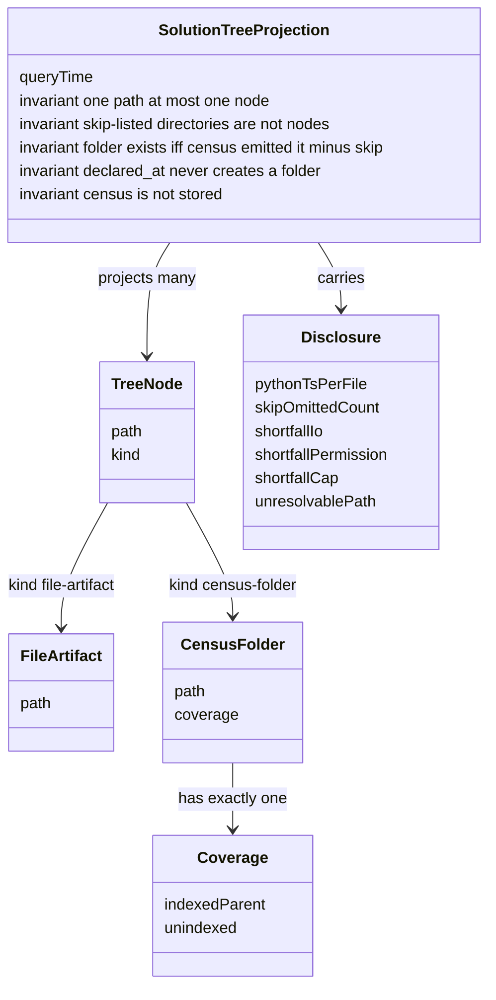

# Spec: Understanding views — D-0 Solution tree

- **Status:** Draft (N4 BLOCKED then repaired this turn; authors do **not** self-clear;
  status is not accepted).
- **Tier (cost-of-error):** T2 — it admits the first understanding view onto the Architecture
  allow-list later; a wrong grain makes every later view navigate a lie.
- **Author / date:** N3 `/specify`, session `understanding-views-specify`, 2026-09-14.
- **Authority:** Owner ruling `note-understanding-views-owner-ruling` (admit D-0 only);
  N1 disposition `note-understanding-views-owner-n1-disposition` (census grain — **this**
  grain, not the two-clause draft); Addendum C §A5 (admitted-when and AR3); ADR-0030
  (allow-list column; derived menu).
- **Grounding path:** `spec-addendum-c-perspectives` §A5 D-0 → `note-understanding-views-owner-ruling`
  → `note-understanding-views-n1-inventory` (STOP-BEFORE-N5) → `note-understanding-views-owner-n1-disposition`
  (census admitted) → `note-understanding-views-n2-comparables` → `adr-0030-perspective-registry-and-allow-lists`
  → `adr-0017-primary-view-mode`. Conflict surfaced, not overridden: N0's two-clause model cell
  is **superseded** by the N1-disposition grain (indexed-parent folders). Live schema has no
  `artifact_dim` (`conceptual-model-ai-native-ide` still names one — drift, not this spec's
  table). N2's specify-handoff still said the two-clause grain; this spec follows the later
  disposition. **[Verified]** from those artifacts, not from memory of `src/`.

<!-- ONE spec, THREE layers. Functional → UX → UI. Conceptual model before both surfaces. -->

## Quoted authorities (DC-189 — trigger sentences, not paraphrases)

These sentences govern this spec. Later slices quote them; they do not thin them.

**D-0 admitted-when** (`spec-addendum-c-perspectives` §A5):

> Given a workspace, When the tree opens, Then code, data and architecture artifacts are listed by project and folder with a kind glyph, And activating an item reveals it in the Architecture graph or opens its source, And a folder the index has not covered is shown with an "unindexed" state.

**Grain** (`note-understanding-views-owner-n1-disposition`):

> One tree node is exactly one Core-named workspace-relative path: **either** one indexed artifact (a file/document resolved from latest assertions) **or** one census folder (a directory Core observed). Skip-listed directories are not nodes. A census folder’s coverage is `indexed-parent` | `unindexed` | `not-recorded`.

**N4 grain close (this spec — does not thin the quote):** Owner “indexed artifact” is this spec’s **file-artifact**. Owner “census folder” is **census-folder**. Node identity is the pair `(path, kind)` with `kind ∈ {file-artifact, census-folder}`. Folder **Coverage** is only `indexed-parent` | `unindexed`. Owner’s `not-recorded` is **Disclosure** (projection shortfall), never a census-folder coverage value and never a reason to mint a folder.

**AR3** (`spec-addendum-c-perspectives` §A5):

> Each deferred view is admitted to the **Architecture** allow-list, and to its derived menu, only in the slice that builds it (AR3) — never scaffolded ahead.

**Allow-list and derived menu** (ADR-0030 Decision 2–3):

> Add an explicit `Perspectives` column to the App's `SurfaceKind` row — a non-defaulted `IReadOnlySet<string>` of perspective ids

> an empty set fails the build test

> menu, palette, rail and routing are derived from the join of those two row sets — never a second hand-written list

**DC-022** (`IWorkspaceQueries` remarks on `SearchContentAsync` / `NodeContentAsync`):

> The App must not read workspace files: two authorities on what a file contains disagree the first time one resolves a path differently (DC-022), and file access belongs on the side of the boundary that can confine it to the workspace.

**No second graph store** (`spec-addendum-c-perspectives` §A5 item 3):

> No in-surface "knowledge / architecture" toggle and no second graph store: one substrate, two surfaces (Ruling 53).

**Use Case 4 / Tests** (`spec-addendum-c-perspectives` §A5 item 1):

> Use Case 4 (Test Coverage). No perspective, no rail item, no reserved layout beyond the reserved name "Tests". A rail item with nothing behind it is the defect AR3 removed (Ruling 54).

---

## Part A — Functional specification
*What the product must do and why. ISO/IEC/IEEE 29148 + user stories with Gherkin. Owner: Product Strategist.*

### Problem

An operator who is trying to **understand a workspace** cannot see which code, data and architecture
artifacts the index actually covers, grouped the way they already think (project and folder). The
Architecture graph shows neighbourhoods of nodes. The Explore body is a full-window graph+reader
(ADR-0017). Neither lists artifacts by project and folder. Neither can show a folder the index has
not covered as an explicit state. Absence today looks like emptiness, which is a lie: skip-listed
build output, unindexed source folders, and census shortfalls are different facts. The operator
needs an honest navigator over what Core has named, so they can jump to the graph neighbourhood or
the source of one artifact without pretending the tree is a second file manager or a second graph.

This is not a request for a control toolkit, a stored folder table, or Atlas.

### Target users & personas

- **Primary — Architect / reviewer (Architecture perspective).** Job: find a code, data or
  architecture artifact by project and folder, see whether that folder is indexed, and activate it
  to read structure (graph) or source. Success: they never take silence for coverage.
- **Secondary — Operator returning from Coding.** Job: switch to Architecture and locate the
  artifact an agent just touched, without leaving the reading host.
- **Not this horizon — Test author, composer deriver, Atlas user.** No Tests perspective; no D-5/D-6;
  no Atlas paths.

JTBD (primary): *When I am understanding this workspace, help me list what the index covers by
project and folder, show me what it has not covered, and take me to the graph or the source of one
item — without hiding gaps or inventing folders.*

### Core scenario

The operator is in **Architecture** with a workspace open. They open the **Solution tree**. Core
returns a query-time census of directories joined to latest-generation file-artifacts. The tree
lists `(path, kind)` nodes. A census-folder with joinable file-artifacts under it, or whose path
is a scope `declared_at`, is **indexed-parent**. A census-folder that is not skip-listed, has no
joinable file-artifacts, and is not a `declared_at` path shows **Unindexed** as a non-expanding
leaf. A skip-listed directory (example: `bin`) is **not a node**; the tree shows a skip-omission
count. A projection shortfall is **Disclosure** (`Not recorded` / `Omitted (N)`), never a folder
state. Primary activate on a file-artifact is **View source**; secondary is **Reveal in graph**.
No third reveal path. No Atlas type.

If this path works end to end, D-0 is worth building. Everything else in this spec protects that
path from looking complete when it is not.

### Conceptual domain model (DM1 / DM4 — before UX/UI)

**Bounded contexts.** The payload lives in **Evidence and Projection** (existing:
`conceptual-model-ai-native-ide`). The surface lives in **Shell presentation** (Addendum C §A6).
This spec introduces **no stored aggregate** and **no folder fact table**. Census is query-time
disk-now, derived (DM7). The conceptual model’s `artifact_dim` is **not** realised this horizon
(N1: live schema has none). Do not mint one to make the tree look complete.

**Ubiquitous language** (one word, one meaning — seeds the glossary)

| Term | Definition | Kind |
|---|---|---|
| **Solution tree** | The Architecture-pane navigator this spec admits (D-0). Not Explorer. Not Atlas. | Presentation entity (identity: the one instance in Architecture) |
| **Tree node** | Exactly one pair `(path, kind)` with `kind ∈ {file-artifact, census-folder}`. Path is Core-named, workspace-relative. One path yields at most one node. | Entity (identity: that pair) |
| **File-artifact** | A file or document resolved from latest-generation assertions (joined via scope location). **Directory-valued assertions are not file-artifact nodes** (Python/TS `ScopeId`, a `declared_at` directory, any assertion whose resolved path is a directory Core observed). | Entity |
| **Census-folder** | A directory Core’s query-time census **emitted**, minus the skip set. Folder identity comes only from that emission. Splitting `artifact_path_id` does not mint one. `declared_at` does not mint one. | Entity |
| **Coverage** | On a census-folder only, exactly one of `indexed-parent` \| `unindexed`. Not-recorded is not Coverage. | Value object |
| **Indexed-parent** | Coverage of a census-folder that has one or more joinable **file-artifact** descendants **or** whose path equals a scope `declared_at`. Widened so a Python/TS scope directory is not unindexed. | Coverage value |
| **Unindexed** | Coverage of a census-folder that is not skip-listed, has **zero** joinable file-artifact descendants, and is **not** a `declared_at` path. Rider “no index”, not VS Code hide. The node is a **non-expanding leaf** (no child rows). | Coverage value |
| **Disclosure** | Projection shortfall or honesty line on the **tree**, not a node kind. Includes: Python/TS per-file not recorded; skip-omission count; census IO; permission; cap omit; unresolvable assertion path. User-facing shortfall word: `Not recorded`. | Value object |
| **Skip-listed directory** | A directory the **one** surviving Core skip set names. **Not a node.** Not unindexed. Not a Disclosure kind of its own — counted in the skip-omission disclosure. | Not in the tree |
| **Skip set** | One existing Core skip policy the census consumes. Not a fourth `HashSet`. Not VS Code `files.exclude`. Architecture unifies today’s disagreeing lists. | Value object (existing policy) |
| **Kind glyph** | Visible kind of a file-artifact (code / data / architecture, plus file kind). Colour is never the only signal (`DESIGN.md`). | Value object |
| **View source** | Primary activate on a file-artifact. Existing Architecture action (`NodeViewKind.Source`). | Interaction |
| **Reveal in graph** | Secondary activate on a file-artifact. Existing Architecture action (`NodeViewKind.GraphNeighbourhood`). | Interaction |

Do not use the unglossed phrase **“indexed folder”**. Say census-folder with coverage indexed-parent.

**Grain (declared before any column):** one tree node is exactly one `(path, kind)` with
`kind ∈ {file-artifact, census-folder}`. Two people given this grain and a real workspace produce
the same node set.

**Root: in.** The workspace root is a census-folder node whenever a workspace is open. Its path is
the empty workspace-relative path `""`. The skip set does not omit the root. Coverage uses the same
function. Tree-level Disclosures attach to tree chrome, not as extra nodes.

**Folder existence.** A census-folder node exists **iff** the census emitted that directory and the
skip set does not name it. `declared_at` never creates a folder. Unresolvable assertion paths never
create a folder.

**One path → at most one node.** If the census emitted `P` as a directory, `P` is a census-folder
and is not a file-artifact. Directory-valued assertions are not file-artifact nodes. Many assertions
that resolve to the same file path collapse to one file-artifact node.

**Coverage function** (census-folder `P` only):

- `indexed-parent` iff at least one file-artifact joins under `P` (child or descendant) **or** some
  scope’s `declared_at` equals `P`.
- `unindexed` otherwise.

**Not the grain:** one node = file-artifact OR unindexed folder only — that erases indexed-parent
folders and forces illegal path-splits. **Not the grain:** Coverage includes not-recorded.
**Not the grain:** `OverviewAsync` clusters. **Not the grain:** `GraphAsync` nodes.



**Aggregates and the one invariant each protects**

- **Solution tree projection** (root: the query-time projection for the open workspace).
  **Invariant:** every visible node is a `(path, kind)` pair as grained above; skip-listed
  directories are not nodes; a census-folder carries exactly one Coverage value from the function
  above; folders are never invented by splitting `artifact_path_id` or from `declared_at`;
  projection shortfalls are Disclosure, not Coverage; the App does not walk disk.
- **Perspective Layout** (existing, Addendum C §A6). **Invariant:** every surface in
  Architecture’s host is of a kind Architecture admits. D-0’s kind enters that set **only** in
  the slice that builds it (AR3).
- **Scope Snapshot** (existing evidence aggregate). Untouched. File-artifacts are latest
  assertions under the committed generation; this spec does not rewrite extractors.

**Python / TypeScript / Bicep honesty (this horizon)**

- Python and TypeScript extractors store `request.ScopeId` as `Provenance.ArtifactPathId` with
  null source location — **not a file path**. This spec does **not** rewrite extractors.
- Iff the census emitted the scope’s `declared_at` directory, that census-folder has coverage
  **indexed-parent** (the `declared_at` widening). It is not unindexed and not a Disclosure
  shortfall.
- Zero file-artifact nodes with extensions `.py` / `.ts` are minted from a second walk.
- Disclosure copy (exact): `Python and TypeScript files are not listed individually. The scope folder is indexed.`
- Bicep filename-only paths resolve via scope location onto an existing census-folder; never treat
  the filename as a folder; else Disclosure `Not recorded`, no node.

**Durable representation.** Out of this spec (architecture). Binding constraint: **no stored
census / `folder_dim` this horizon**; **no second graph store**.

### In scope / Out of scope (explicit non-goals)

**In (this horizon, D-0 only)**

- The Solution tree as an Architecture-pane navigator over the declared grain.
- Query-time Core census + latest file-artifacts, App-must-not-read (DC-022).
- Hard states: empty, loading, unindexed (leaf), error, no-workspace, stale-while-refresh — plus
  Python/TS disclosure, skip-omission **count**, and named Disclosure shortfalls (IO / permission / cap).
- Activate on a file-artifact: primary **View source**, secondary **Reveal in graph** (existing
  Architecture actions). No third reveal path.
- The **requirement** that the later building slice add **one** `SurfaceKind` row with
  Architecture in its `Perspectives` column, and that the menu pick it up by derivation
  (ADR-0030). This specify turn does **not** add that row.
- D-1…D-6 kept in this document with §A5 admitted-when **copied**, not paraphrased.

**Out (non-goals — load-bearing)**

1. **D-1…D-6 are not built this horizon.** They stay named-and-deferred. Admitted-when, copied
   from `spec-addendum-c-perspectives` §A5 (DC-189):

   - **D-1 Entry-points view.** *Admitted when:* Given an indexed workspace, When the view opens,
     Then every API surface, UX surface and CLI entry point in the index is listed as a node with its
     kind, And selecting one scopes the Architecture graph to the neighbourhood reachable from it,
     And an entry point the index could not classify is listed under "unclassified", never omitted
     silently.
   - **D-2 Data flow from an entry point.** *Admitted when:* Given a selected entry point, When the
     data-flow view renders, Then each read and write that crosses a bounded-context or persistence
     boundary is an edge with provenance (`EXTRACTED`/`INFERRED`), And an unresolvable step renders
     as a labelled gap, never as a verified edge.
   - **D-3 ER diagram (crow's-foot).** *Admitted when:* `spec-uml-erm-surfaces` US-U3 holds against
     a fixture schema (cardinality correct, keys shown, every M:N has an associative entity).
   - **D-4 Layer and component diagrams derived from code and from bicep.** *Admitted when:*
     `spec-uml-erm-surfaces` US-U1 holds at container and component level, And an infrastructure
     resource declared in a `.bicep` file appears as a container with its declaring file as
     provenance, And a code→infrastructure edge static analysis cannot resolve is marked inferred.
   - **D-5 The structure deriver** (US-C13's *derived and prefilled* lines). *Admitted when:* Given
     the fixture prose of US-C13 b2 and a fake deriver returning three known strings, the three lines
     carry those strings and the *derived* mark; Given no deriver, the lines are empty and editable;
     **And** an eval harness scores the real deriver on a fixture corpus (derived vs edited vs
     emptied per send, instrumented from the first slice) before it ships behind the seam. Until
     then the composer is a conversation with empty, editable lines.
   - **D-6 Conductor round-trips as derived structure** (S-8, US-C13 b8). *Admitted when:* a
     reply-channel seam exists and a fixture reply carrying a drafted `goal-block` template renders
     as derived lines with no form widget. Until then round-trips arrive as Addendum B `:187` says.

   AR3 (quoted above) still holds: no allow-list row, no derived-menu entry, no scaffold for
   D-1…D-6 until the slice that builds that view.

2. **Use Case 4 (Test Coverage).** Quoted above. No Tests perspective, no rail item, no Tests
   layout. This programme does not open a Tests track.
3. **Not Atlas / not Code Atlas.** Forbidden: `src/AiDe.Core/Understanding/**`; Atlas App/spike
   files; `session-contracts.md` as a D-0 seam. D-0 is an Architecture-pane tree over indexed
   artifacts.
4. **No second graph store** (Ruling 53; quoted). Activate uses the existing Architecture graph
   or source. Do not author a parallel model for the tree.
5. **Not ADR-0017 Explorer.** Explorer is the full-window Explore body (graph+reader). D-0 does
   not replace it, subsume it, or live in Explore.
6. **Not a workspace file manager.** No tree CRUD (add/rename/delete) as the primary job. No
   drag/drop of files. No VS Code `files.exclude` hide. No Rider File System view copy.
7. **Not `OverviewAsync` / `GraphAsync` as the tree query.** Wrong grain (N1). Architecture
   specifies **one new** `IWorkspaceQueries` method + IPC operation. Do not reuse `overview` /
   `graph`.
8. **Not a stored census / `folder_dim` / folder facts this horizon.** Query-time only.
9. **Not App-side directory walk** (DC-022).
10. **Not splitting `artifact_path_id` into folder nodes.**
11. **Not a fourth skip `HashSet`.** Census consumes one existing Core skip set. Architecture
    names the survivor if today’s lists disagree (`CSharpScopeDiscovery.Skip`,
    `UnanalysedLanguages.Skip`, extractor skips — N1). This spec names the *rule*, not a new list.
12. **Not rewriting Python / TypeScript / Bicep provenance** to complete the tree.
13. **Not allow-list or menu rows in this specify turn.** AR3: the row lands in the slice that
    builds D-0. This spec forbids a hand-written menu entry at any time (ADR-0030).
14. **Not freezing the tree toolkit** (WPF `TreeView` vs anything else). N7 Spike Protocol.
15. **Not query name, DTO, cap values, glyph-to-kind mapping.** Architecture + spike.
16. **Not default-layout choreography as a blocker.** Reachability from Architecture is required;
    whether the tree is in the default Left zone is design-slice. Do not replace `canvas`.
17. **Not D-5 / D-6 implementation, composer kinds, or ADR-0036 compile-ladder work.**
18. **Not joining `main`.** Join target is `understanding-views`.
19. **Not architecture ADRs, spike, mockup (`ui-design` is N8), or `src/` in this turn.**
20. **Not adding graph capability in Explore** (`spec-knowledge-explorer-mode` non-goal 1).

### User stories & acceptance criteria (testable)

Each criterion is falsifiable. Duration SLOs are **recorded, not asserted in CI** (ADR-0029; DC-107).
The production cap value is architecture’s; tests inject a **test-overridable cap**.

**Composed fixture F\*** — one real-disk workspace used by US-T2, US-T3, US-T4, and one US-T5 shortfall:

| On disk | Role |
|---|---|
| A census directory containing at least one joinable file-artifact (e.g. `src/` + a file the fixture extractor indexes) | indexed-parent |
| `unindexed_probe/` — not skip-listed, zero joinable file-artifacts, not a `declared_at` path. **Not `docs/`.** | unindexed leaf |
| `bin/` with files on disk, name on the surviving skip set | omitted node + skip-count |
| One shortfall arranged at query time via a Core seam (US-T5a IO, US-T5b permission, or US-T5c cap) | Disclosure |

Three observable outcomes on F\* (plus the indexed-parent context): `unindexed_probe` is Unindexed; `bin` is absent and skip-count ≥ 1; the arranged shortfall’s Disclosure is present.

**Oracle for US-T3 and US-T5a–c:** (1) the tree-query DTO **and** (2) a **headless visual-tree walk** of the Solution tree surface. A query-only green is not a pass.

**US-T1 — As an architect, I want file-artifacts listed by project and folder with a kind glyph, so that I can find what the index covers.**
- **Given** F\* **When** the Solution tree opens **Then** the joinable file-artifact is a `kind=file-artifact` node under the census-folder the census emitted for its resolved path **And** UIA Name contains that file’s kind word.
- **Given** two file-artifacts whose resolved paths sit in different census-folders **When** the tree opens **Then** each sits under the census-folder Core emitted for that path (no path-split parent).
- **Given** two latest-generation assertions that resolve to the same file path **When** the tree opens **Then** exactly one `kind=file-artifact` node exists for that path.
- **Given** a directory-valued assertion whose resolved path equals a census-emitted directory **When** the tree opens **Then** that path is a census-folder node **And** it is not also a file-artifact node.
- **Failing input:** `OverviewAsync` clusters as rows; parents minted by splitting `artifact_path_id`; two nodes for one path; a directory-valued assertion rendered as a file-artifact; UIA Name without kind.

**US-T2 — As an architect, I want indexed-parent census-folders as nodes, so that files have a real parent without illegal path-splits.**
- **Given** F\*’s indexed-parent directory **When** the tree opens **Then** that census-folder node has coverage `indexed-parent` **And** the file-artifact nodes appear under it.
- **Failing input:** only file-artifacts appear; parent coverage `unindexed`; parent invented from a path the census did not emit.

**US-T3 — As an architect, I want a folder the index has not covered shown as Unindexed, so that I do not take silence for coverage.** *(§A5 unindexed; Rider “no index”)*
- **Given** F\* **When** the Solution tree opens **Then** the query DTO contains `unindexed_probe` as `kind=census-folder` coverage `unindexed` **And** a headless visual-tree walk finds a row whose visible text includes `unindexed_probe` and `Unindexed` **And** that row has **zero child rows** (non-expanding leaf).
- **Failing input:** `unindexed_probe` missing; coverage `indexed-parent`; row labelled `Not recorded`; expandable empty children; skip-listed `bin` shown as Unindexed (that fails US-T4, not this row).

**US-T4 — As an architect, I want skip-listed directories omitted and counted, so that build output is neither flooded nor silently hidden.** *(distinct from US-T3)*
- **Given** F\* **When** the Solution tree opens **Then** no node has path `bin` **And** tree chrome shows the exact copy `N skip-listed directories omitted` with N ≥ 1.
- **Failing input:** `bin` row present (including greyed); skip-count absent (silence); skip-count copy on a `bin` row; `unindexed_probe` used as the skip example.

**US-T5a — As an architect, I want a census IO shortfall disclosed, so that a failed walk never looks like an empty workspace.**
- **Given** F\* **And** the Core census IO seam is arranged to fail for a named relative path that is not `unindexed_probe` or `bin` **When** the Solution tree opens **Then** Disclosure includes `Not recorded` with cause IO **And** no census-folder node exists for the unobserved path **And** a headless visual-tree walk shows that Disclosure **And** `unindexed_probe` remains Unindexed (US-T3 still holds).
- **Failing input:** silent drop; a minted folder for the unobserved path; the IO shortfall labelled `Unindexed`; query-only pass without visual-tree walk.

**US-T5b — As an architect, I want a permission shortfall disclosed.**
- **Given** F\* **And** the Core census permission seam denies a named directory **When** the Solution tree opens **Then** Disclosure includes `Not recorded` with cause permission **And** that directory is not a node **And** a headless visual-tree walk shows that Disclosure.
- **Failing input:** denied directory appears as Unindexed; no Disclosure; fake folder.

**US-T5c — As an architect, I want a cap shortfall disclosed.**
- **Given** F\* **And** the **test-overridable cap** is set below F\*’s uncapped node count **When** the Solution tree opens **Then** Disclosure includes exact copy `Omitted (N)` with integer N > 0 **And** a headless visual-tree walk shows that copy **And** the tree is not presented as complete.
- **Failing input:** truncation with no `Omitted (N)`; cap treated as Coverage `unindexed`; production cap hard-coded so the test cannot arrange the shortfall.

**US-T6 — As an architect, I want Python/TypeScript scopes as indexed-parent census-folders without fake per-file rows, so that the tree does not look complete for those languages.**
- **Given** a workspace whose census emitted a directory `P` **And** a Python or TypeScript scope has `declared_at` equal to `P` **And** assertions store `ScopeId` as `ArtifactPathId` **When** the tree opens **Then** `P` is a census-folder with coverage `indexed-parent` **And** zero `kind=file-artifact` nodes have extensions `.py` or `.ts` **And** the rendered surface contains the exact copy `Python and TypeScript files are not listed individually. The scope folder is indexed.`
- **Failing input:** `P` coverage `unindexed`; `P` treated as Disclosure `Not recorded`; fake `.py`/`.ts` file-artifact rows; disclosure copy absent or paraphrased; `declared_at` minting `P` when the census did not emit it.

**US-T7 — As an architect, I want Bicep filename-only provenance resolved via scope location, so that a filename is never treated as a folder.**
- **Given** a Bicep assertion whose `artifact_path_id` is a filename only **And** the scope location resolves it onto an existing census-folder **When** the tree opens **Then** the artifact is a file-artifact node under that census-folder **And** no census-folder path equals that filename.
- **Given** the same filename-only provenance **And** the scope location cannot resolve it **When** the tree opens **Then** Disclosure includes `Not recorded` **And** no node is minted from the filename.
- **Failing input:** a census-folder named for the `.bicep` file; a guessed parent from string split; silent drop with no Disclosure.

**US-T8 — As an architect, I want primary View source and secondary Reveal in graph on a file-artifact, so that the tree is a navigator not a third store.**
- **Given** a file-artifact node **When** I invoke **View source** (primary: Enter) **Then** content is fetched via `NodeContentAsync` and shown in admitted `codeviewer`.
- **Given** a file-artifact node **When** I invoke **Reveal in graph** (secondary: Ctrl+Enter) **Then** the Architecture graph shows that artifact’s neighbourhood via existing `GraphAsync` / `DescribeAsync`.
- **Given** View source fails (NodeContent shortfall or IPC error) **When** the reveal surface would show content **Then** that surface shows error copy with **Retry** **And** Retry re-invokes `NodeContentAsync` **And** the tree selection is unchanged.
- **Given** Reveal in graph fails **When** the graph would show the neighbourhood **Then** the graph shows error with **Retry** **And** Retry re-invokes `GraphAsync` / `DescribeAsync` **And** the tree selection is unchanged.
- **Given** an indexed-parent census-folder **When** I press Right or Enter **Then** it expands or collapses **And** View source and Reveal in graph do not run.
- **Given** an unindexed census-folder **When** I press Enter, Right, or Left **Then** it stays a leaf **And** no child rows appear **And** View source and Reveal in graph do not run.
- **Failing input:** a third reveal IPC; folder activation opening source or fabricating a graph entity; unindexed folder expanding empty children; activate error with no Retry.

**US-T9 — As an operator, I want empty, loading, error, no-workspace, and stale-while-refresh to be distinct, so that I know what to do next.**
- **Given** no workspace is open **When** Architecture shows the Solution tree **Then** the no-workspace copy in Part C is shown.
- **Given** first open of the tree (no prior payload) **And** the query is in flight **Then** the loading copy is shown.
- **Given** a populated tree **When** a refresh starts **Then** the previous rows remain visible marked `Stale` until the new payload arrives (stale-while-refresh).
- **Given** a workspace is open **And** the census-plus-join returns zero nodes and no Disclosure shortfall **Then** the empty copy is shown **And** the one next action is **Show Graph** (existing Architecture `canvas` Show).
- **Given** the tree query fails (daemon/IPC error) **When** the surface would render **Then** the error copy is shown with **Retry** **And** Retry re-enters loading.
- **Failing input:** no-workspace using empty copy; empty labelled Unindexed; empty with no Show Graph action; refresh blanking to loading; error without Retry.

**US-T10 — As an operator, I want the Solution tree reachable only as an Architecture kind whose menu entry is derived, so that AR3 and ADR-0030 hold.**
- **Given** the slice that builds D-0 has not landed **When** a headless test reads `SurfaceContentFactory.Kinds` **Then** there is no Solution-tree kind row (this specify turn adds none).
- **Given** the slice that builds D-0 **When** it admits the kind **Then** Architecture is in that row’s `Perspectives` column **And** the View menu/palette gain “Show `<Title>`” by `PerspectiveMenu.For` with **no** edit to a hand-written list **And** Coding and Explore do not admit the kind.
- **Given** a test-time kind row admitted only by Architecture (existing US-C4 mutation) **Then** that contract still holds after D-0’s row exists.
- **Failing input:** a menu string for an unbuilt kind; a second list; Explore or Coding admitting the tree; scaffolding D-1…D-6 rows.

**US-T11 — As a reviewer, I want the tree query to be a new Core projection, so that Overview/Graph are not abused and forbidden APIs are not used.**
- **Given** the D-0 query **When** it runs **Then** it is one new `IWorkspaceQueries` method with a new IPC operation that is not `overview` or `graph`.
- **PROBE-APP-ENUM.** **Given** the App process handles a Solution tree open on F\* **When** the query and first render complete **Then** the App process has not invoked `Directory.EnumerateFileSystemEntries`, `EnumerateDirectories`, `EnumerateFiles`, `GetDirectories`, `GetFiles`, or `GetFileSystemEntries` on the workspace root or any descendant. (Core census inside the Core process is allowed.)
- **PROBE-ATLAS.** **Given** the Solution tree open **Then** no loaded type has namespace prefix `AiDe.Core.Understanding` **And** no loaded type is sourced from `src/AiDe.Core/Understanding/`.
- **PROBE-FILE-READ.** **Given** View source on a file-artifact **Then** the App process has not invoked `File.ReadAllText`, `File.ReadAllBytes`, `File.Open`, or `File.OpenRead` on that workspace path (content comes from `NodeContentAsync`).
- **Failing input:** App directory walk; handler mapped to `overview`/`graph`; Atlas `Understanding` type loaded; App file read to fill a node.

**US-T12 — Cap disclosure is US-T5c.** (No separate criterion; US-T5c is the cap oracle.)

**US-T13 — As an operator, I want the Solution tree not to be Explorer, so that I still have a file-agnostic reading mode.**
- **Given** Architecture is active with the Solution tree open **When** I switch to Explore **Then** the Explore body is still the ADR-0017 graph+reader.
- **Failing input:** D-0 replacing Explorer; D-0 hosted as Explore’s full-window surface.

### Non-functional requirements (ISO/IEC 25010 checklist)

| Attribute | Requirement (measurable) |
|---|---|
| Functional suitability | US-T1…T13 hold against F\* and the Boundary set. A green that cannot distinguish US-T3 / US-T4 / US-T5a–c is a failed suite. |
| Performance efficiency | Payload is capped; omitted-by-cap is US-T5c. Latency is **emitted and recorded** on the normal path (IO1); **no CI test asserts a duration under a constant** (ADR-0029 / DC-107). Production cap is architecture’s; tests inject a test-overridable cap. |
| Reliability | Query failure → error + Retry (US-T9). Census IO/permission → Disclosure, not a crash-shaped empty tree (US-T5a/b). Activate failure → Retry on the reveal surface (US-T8). |
| Security | App must not read workspace files to build the tree (DC-022). PROBE-APP-ENUM, PROBE-ATLAS, PROBE-FILE-READ. No new identity, PII collection, or irreversible action. STRIDE: skip-listed dirs must not re-enter as Unindexed (US-T4); path-split folders forbidden by the grain. |
| Usability | Unindexed / skip-count / Not-recorded Disclosure are distinct (word + glyph). Empty’s one next action is Show Graph. Deepened in Part B. |
| Compatibility | Native Windows WPF shell (`DESIGN.md` `x-platform:windows; x-framework:wpf`). No web-only tree. High-contrast theme uses the same semantic roles. |
| Maintainability | One skip set consumed, not copied. One new query, not a fork of Overview. Menu derived (ADR-0030 mutation test remains the oracle). |
| Portability | N/A — desktop Windows workstation product. |
| Accessibility | WCAG 2.2 AA on the tree: name, role, value for every node; coverage is not colour-only; 2px `{colors.focus}` ring; keyboard move/activate. Native UIA proof is N8/implement (native-client-ui-design); this spec requires the names. |

### Boundary set

The test matrix. Each row is a distinct oracle.

| # | Input | Required outcome | Distinct from |
|---|---|---|---|
| B1 | F\* indexed-parent directory | census-folder coverage `indexed-parent` + file-artifact children | B3, B6 |
| B2 | F\* `unindexed_probe/` | census-folder coverage `unindexed`, non-expanding leaf | B3, B4 |
| B3 | F\* `bin/` | **No node**; skip-count ≥ 1 | B2, B4 |
| B4a | Core census IO seam fail | Disclosure `Not recorded` cause IO; no minted folder | B2, B5, B6 |
| B4b | Core census permission seam deny | Disclosure `Not recorded` cause permission; no node | B2 |
| B4c | Test-overridable cap below node count | Disclosure `Omitted (N)` N>0 | B2, B6 |
| B5 | No workspace | No-workspace copy | B6 |
| B6 | Workspace, zero nodes, no Disclosure shortfall | Empty copy + Show Graph | B2, B4 |
| B7 | First open, query in flight | Loading | B6, B7s |
| B7s | Refresh of populated tree | Stale-while-refresh | B7 |
| B8 | IPC/daemon failure | Error + Retry | B4, B6 |
| B9 | Python/TS `declared_at` = census-emitted `P` | `P` coverage `indexed-parent`; zero `.py`/`.ts` file-artifacts; exact US-T6 copy | B2, B4 |
| B10 | Bicep filename-only, resolvable | file-artifact under existing census-folder | B11 |
| B11 | Bicep filename-only, unresolvable | Disclosure `Not recorded`; filename ≠ folder | B2 |
| B12 | File-artifact Enter | View source (`NodeContentAsync` / `codeviewer`) | Folder expand |
| B12b | File-artifact Ctrl+Enter | Reveal in graph | B12 |
| B12c | View source / Reveal failure | Error + Retry on that surface | B8 |
| B13 | Hostile/malformed assertion path | Disclosure; no invented folder | B1 |
| B14 | PROBE-APP-ENUM / PROBE-ATLAS / PROBE-FILE-READ | Fail if forbidden API or Atlas type used | — |

### Comparables & user evidence (sourced)

From `note-understanding-views-n2-comparables` (official docs opened this programme). Recalled-from-memory rows are not used.

| Claim | Source | Confidence |
|---|---|---|
| Unindexed must be a visible state (yellow / “no index”), never silent hide | JetBrains Rider Explorer help: [Project tool window](https://www.jetbrains.com/help/rider/Project_Tool_Window.html); N2 row 2 | **Verified** — strongest unindexed analog |
| VS Code Explorer `files.exclude` is omission, not an unindexed glyph — must not be copied | [VS Code UI / Explorer](https://code.visualstudio.com/docs/getstarted/userinterface); N2 row 4a | **Verified** |
| Grain is project/folder/artifact with kind glyphs, not graph clusters | VS Solution Explorer [Use Solution Explorer](https://learn.microsoft.com/en-us/visualstudio/ide/use-solution-explorer); Rider; C# Dev Kit [project management](https://code.visualstudio.com/docs/csharp/project-management) | **Verified** |
| Architecture-pane tree ≠ workspace file explorer (Solution view vs File System view) | Rider help (same URL); ADR-0017 Explorer is the other job | **Verified** |
| IntelliJ Excluded ≠ unindexed (deliberate ignore vs not-yet-indexed) | [Content roots / Excluded](https://www.jetbrains.com/help/idea/content-roots.html); N2 lesson 5 | **Verified** comparable; **Inferred** mapping to our coverage enum |
| Structurizr tree is a model hierarchy, not a workspace census; no unindexed-folder badge | [Explorations](https://docs.structurizr.com/ui/explorations/) | **Verified** gap |
| Activate reveals elsewhere; IDE trees do not keep a second architecture graph | VS / Rider / Eclipse open the editor; Structurizr projects one model | **Verified** / **Inferred** mapping to `GraphAsync`/`DescribeAsync` vs `NodeContentAsync` |
| Operator need: list coverage by project/folder and see gaps | Addendum C §A5 D-0 admitted-when (product requirement); UC3 model 1 | **Verified** as specified need; **Flagged** as no new field study this turn |
| Exact VS “on disk but not in project” chrome today | N2 residual | **Flagged** — not required to admit D-0 if Rider lesson is adopted |

**Must not copy:** editable tree CRUD; hiding unknown folders; file-system tree as the Architecture surface; second authored graph; `OverviewAsync` clusters as rows (N2 anti-pattern table).

### Applicable governance lenses

- [x] Quality attributes / NFRs — ISO 25010 table above.
- [x] Threat model (STRIDE) — no identity/PII/money/irreversible action. Integrity: two authorities on disk (DC-022). Information disclosure: skip-listed dirs must not re-enter as Unindexed. Tampering: no path-split folders. Elevation: none new. **Security reviews DC-022 at N4 / N5.**
- [x] Privacy & data governance — workspace-relative paths already under Core; no new egress; App does not read files.
- [x] Accessibility — WCAG 2.2 AA; native UIA proof later; colour never the only coverage signal.
- [x] Performance budget — cap + honest omit; latency recorded not CI-asserted (ADR-0029).
- [x] Release / rollback / migration — no schema this horizon; allow-list row is expand in the building slice; AR3 forbids the row before the surface exists.
- [x] Observability — tree query emits duration, node counts, omitted count, coverage counts, error code; degrade to “not recorded”, never a plausible wrong number (IO1/IO8).

### AI-integrated allocation

- **Archetype:** none. D-0 uses no model.
- **Tier allocation:** N/A. LOA does not apply. (D-5’s deriver remains deferred with its own eval-harness admitted-when.)

---

## Part B — UX specification
*How it works — Structure + Skeleton. Owner: UX Researcher / Information Architect.*

### Personas & jobs-to-be-done (deepened)

**Architect / reviewer.** Expert, dense, keyboard-first, already in Architecture. They know VS/Rider trees. They distrust a clean empty pane. Success from their side: “I can see what is indexed, what is not, and I can jump to the graph or the file. I can tell `bin` was skipped on purpose (count, no row), `unindexed_probe` is Unindexed, and a permission failure is Not recorded.”

**Operator from Coding.** Same person, different moment. They switched perspective to understand an artifact. They will look for a navigator beside the graph. They must reach the tree without guessing (findability ≤ 2 steps from Architecture: default pane or View → Show Solution tree).

Evidence: N2 comparables (Verified) + §A5 admitted-when (Verified requirement). No new interview this turn — labelled **Inferred** on preference of Left vs View-menu-only; **Verified** on the need for unindexed-as-state.

### Information architecture

**Categorization.** One surface: Solution tree. Nodes are paths, not graph clusters, not Explorer resources, not Structurizr model elements.

**Hierarchy.** Workspace root **in** (census-folder path `""`) → census-folders nested by paths Core emitted → file-artifacts under the folder they join to. Coverage is an attribute of a census-folder. Unindexed census-folders are leaves. Tree-level Disclosures sit in chrome, not as nodes.

**Navigation.** Host: Architecture docking host (Addendum C body = DockHost). Entry: derived “Show Solution tree” (and default-layout inclusion if design-slice so decides). Sibling surfaces: Graph (`canvas`), Evidence (`view`), diagrams. Explore remains a different perspective. Coding does not host this tree.

**Labeling** (glossary seeds)

| UI label | Means |
|---|---|
| Solution tree | This surface |
| Unindexed | Coverage `unindexed` |
| Not recorded | Disclosure shortfall (IO / permission / unresolvable path) |
| `Omitted (N)` | Disclosure cap shortfall |
| `N skip-listed directories omitted` | Skip-omission count; N ≥ 1 when F\* `bin/` exists. Not a `bin` row. |
| View source | Primary activate (file-artifact) |
| Reveal in graph | Secondary activate (file-artifact) |
| Show Graph | Empty state’s one Architecture-reachable next action |
| Open a workspace to see its solution tree. | No-workspace |
| Reading the workspace tree… | Loading (first open) |
| Stale | Refresh in flight on a populated tree |
| No indexed artifacts or folders to show. | Empty |
| Could not read the workspace tree. | Tree query error |
| Could not open source. | View source error |
| Could not reveal in graph. | Reveal in graph error |
| Retry | Recovery for tree query, View source, and Reveal in graph errors |
| Python and TypeScript files are not listed individually. The scope folder is indexed. | US-T6 disclosure (exact) |

Do not label skip-listed directories “hidden” or “excluded” — those words are IntelliJ/VS Code’s and they mean something else (N2 lesson 5). Do not say “indexed folder”.

### User flows (happy + alternate + error + recovery)

```mermaid
flowchart TD
  start([Operator in Architecture]) --> ws{Workspace open?}
  ws -->|no| nows[No-workspace: Open a workspace to see its solution tree.]
  nows --> openWs[Operator opens a workspace]
  openWs --> ws
  ws -->|yes| prior{Prior payload?}
  prior -->|no| load[Loading: Reading the workspace tree…]
  prior -->|yes| stale[Rows stay, marked Stale]
  load --> q{Census plus join}
  stale --> q
  q -->|IPC or daemon error| err[Error: Could not read the workspace tree.]
  err --> retry[Retry]
  retry --> load
  q -->|zero nodes and no Disclosure| empty[Empty copy]
  empty --> showG[Show Graph]
  q -->|payload| tree[Tree of path-kind nodes plus chrome Disclosures]
  tree --> skipDisc[N skip-listed directories omitted if N greater than 0]
  tree --> py{Python/TS scopes present?}
  py -->|yes| disc[Exact US-T6 copy]
  py -->|no| nodes
  disc --> nodes[For each node]
  nodes --> kind{kind}
  kind -->|census-folder unindexed| unidx[Unindexed leaf — no children]
  kind -->|census-folder indexed-parent| parent[Expand or collapse]
  kind -->|file-artifact| art[Kind glyph plus name]
  art --> act{Activate}
  act -->|Enter View source| src[NodeContentAsync then codeviewer]
  act -->|Ctrl+Enter Reveal in graph| graph[GraphAsync / DescribeAsync]
  src -->|error| srcErr[Could not open source]
  srcErr --> srcRetry[Retry] --> src
  graph -->|error| graphErr[Could not reveal in graph]
  graphErr --> graphRetry[Retry] --> graph
  src -->|ok| done([Goal: understand this artifact])
  graph -->|ok| done
  unidx --> done2([Goal: coverage is honest])
  skipDisc --> done2
```

Findability: from Architecture, the tree is one Show command or an already-open pane. Dead ends forbidden: error without Retry; skip-omission without a count; unindexed folder that expands; empty without Show Graph.

### Wireframe-level structure (Skeleton)

Low fidelity on purpose. Toolkit unfrozen (N7). Arrangement, not chrome.

```
Architecture host
+------------------+---------------------------+
| Solution tree    | Graph / diagrams          |
| chrome:          | (existing canvas)         |
|  N skip-listed…  |                           |
|  Omitted (N)     |                           |
|  US-T6 copy      |                           |
|                  |                           |
| v src            | Enter: View source        |
|     Program.cs   | Ctrl+Enter: Reveal in graph|
|   unindexed_probe|                           |
|     Unindexed    |                           |
|   (no bin row)   |                           |
+------------------+---------------------------+
```

- Tree is a **navigator column** beside the existing graph, not a replacement of `canvas`.
- Coverage marks sit on the census-folder row (word + glyph). Unindexed rows have no expander children.
- Skip-omission is chrome count, not a `bin` row and not silence.
- Python/TS copy is chrome; absent when no such scopes (test can fail).
- Hard states replace the tree body (empty / loading / error / no-workspace). Empty offers **Show Graph** only.

Default zone (Left vs Right vs extra pane) is **design-slice**. This skeleton records the job: navigator beside reveal, not a second Explorer window.

### UX acceptance criteria (falsifiable)

- **UX-1.** From Architecture, the operator reaches the Solution tree in ≤ 2 steps (Show command, or it is already in the layout). *Failing input:* only reachable from Coding or a settings page.
- **UX-2.** Every flow in the diagram has a specified recovery: no-workspace → open workspace; tree error → Retry; View source error → Retry; Reveal in graph error → Retry; empty → Show Graph; loading/stale → result or error.
- **UX-3.** US-T3, US-T4 and US-T5a–c are visually distinguishable: Unindexed is a labelled **leaf** node; skip-omission is **no row plus** `N skip-listed directories omitted`; Not recorded / `Omitted (N)` is chrome Disclosure. Colour-only fails.
- **UX-4.** View source and Reveal in graph stay in Architecture. They do not navigate to Explore and do not open Atlas.
- **UX-5.** Indexed-parent Enter/Right expands or collapses. Unindexed Enter/Right does not expand and does not show Error.
- **UX-6.** Python/TS disclosure is tree chrome, not only Diagnostics (Coding-only today — N1). *Failing input:* disclosure only on a surface the Architecture operator cannot see.
- **UX-7.** Empty state’s only next action is **Show Graph**. *Failing input:* empty with no action, or with Retry as the only action (that is the error state).

---

## Part C — UI specification
*How it looks — Surface + U1–U20. Owner: UX & Accessibility. Gated on Part B.*

### UI Archetype Signature (the determinism selector)

- **Archetype:** B1 · Keyboard-Velocity GUI
- **Signature:** `KeyboardVelocity { Type:OLTP; Arch:SPA; Layout:MasterDetail; Density:Compact; Nav:CommandPalette+Sidebar; Viewport:DesktopBound; Input:KeyboardFirst+PrecisionPointer; Color:DarkAdaptive; Type:Utilitarian; Depth:Flat; Sync:ServerStrict; Persistence:Session; Feedback:Confirmed; Motion:Micro; Pacing:Freeform; Transition:HardCut; A11y:WCAG_2.2_AA+HighLegibility; x-platform:windows; x-framework:wpf; }`
- **Selection:** **auto-selected from the JTBD** — the user named no UX template. Dominant job is high-velocity navigation of indexed artifacts in an expert IDE (browse → activate), which maps to B-series operational / Keyboard-Velocity, not a wizard (A), canvas (C — that is the existing graph), feed (D), or authoring (E).
- **Why not H2 Native File/Object Workbench:** H2’s codegen posture is file CRUD (rename/delete/drag-drop). N2 forbids copying that. D-0 is a read-only navigator.
- **Why not B2 Enterprise Master-Detail:** B2 is admin tables and bulk actions, not an IDE tree.
- **Why not C1:** the Architecture graph already is the spatial surface; the tree must not become a second canvas.
- **Composes with** `DESIGN.md` `PerspectiveShell` (native Windows WPF multi-panel workstation) for tokens, density, and shell nav. Facet deviations from stock B1: `Sync:ServerStrict` and `Feedback:Confirmed` (honest Core query, not optimistic LocalFirst); `x-platform:windows; x-framework:wpf`; no CRUD.

Full visual design is `/ui-design` (N8) then `/design-slice`. This layer records intent and falsifiable UI criteria.

### Medium(s) & platform guidelines

- **Medium:** native desktop (WPF).
- **Guidelines:** Windows / Fluent conventions; pack `native-client-ui-design` (UIA, keyboard, High Contrast, DPI). An HTML mockup is direction only; native PASS needs runtime proof. Mockup is **N8**, not this turn.

### Visual intent & tokens

Reference `DESIGN.md` (U3a). No arbitrary values.

| Role | Token |
|---|---|
| Tree ground | `{colors.surface}` / `{colors.surface-raised}` |
| Primary node name | `{colors.text}` |
| Coverage / disclosure | `{colors.text-muted}` |
| Unindexed mark (word + glyph; colour third) | `{colors.unverified}` — **not** `{colors.inferred}` or `{colors.stale}` |
| Not-recorded Disclosure | `{colors.unverified}` (DESIGN.md “Not Recorded”) + word `Not recorded` |
| Cap / skip-count Disclosure | `{colors.text-muted}` |
| Stale-while-refresh | `{colors.stale}` + word `Stale` |
| Error | `{colors.danger}` |
| Selection / accent ground | `{colors.accent}` with **only** `{colors.accent-contrast}` as ink |
| Focus ring | 2px `{colors.focus}` |
| Separators | `{colors.border}` (decorative); control bounds `{colors.border-strong}` |
| Type | `{typography.ui}` for chrome; `{typography.mono}` only for paths if shown as paths |
| Density | Compact (`DESIGN.md`: 28px list rows, 24×24 target — **not** 44px rail rows) |
| Icon size | `{icon.sm}` (16px) inside the 28px row; the **hit rect is the full row** |

Experience qualities: **dense, not cramped; honest, not optimistic; calm, not ornamental.** Opposite of: empty-success chrome, colour-only badges, file-manager toolbars.

### Key screens & complete component states

**Screen 1 — Solution tree (navigator).** Focal point: the selected path. Hierarchy: folder structure first, coverage marks second, disclosure third.

| Component | States required (U9) |
|---|---|
| Tree | default, loading, empty, error, no-workspace, populated, stale-while-refresh, skip-count present/absent, cap omit present/absent, Python/TS disclosure present/absent, IO/permission Disclosure present/absent |
| Census-folder indexed-parent | default, hover, focus, selected, expanded, collapsed |
| Census-folder unindexed | default, hover, focus, selected; **not** expanded/collapsed (leaf) |
| File-artifact | default, hover, focus, selected, activating |
| Skip-listed dir | **no component** — counted in chrome only |
| Retry | default, focus, pressed, disabled while in-flight |
| Show Graph (empty only) | default, focus, pressed |

**Screen 2 — Reveal (existing).** `codeviewer` (View source) or graph neighbourhood (Reveal in graph). Error+Retry states on those surfaces are required (US-T8).

First-run: same as empty/no-workspace, not a coach-mark tour (YAGNI). Overflow: virtualize; cap + `Omitted (N)` (US-T5c).

### Motion, copy, accessibility & performance

- **Motion:** Hard-cut between loading and result (`Transition:HardCut`). Expand/collapse of **indexed-parent** rows may use `{motion.fast}` / `{motion.base}` **gated on `prefers-reduced-motion` / Windows animation setting**. Unindexed rows do not animate expand. No skeleton that looks like a complete tree.
- **Copy (in-voice, load-bearing):**
  - Unindexed: `Unindexed`
  - Not recorded: `Not recorded`
  - Cap: `Omitted (N)` with N the omitted count
  - Skip-omission: `N skip-listed directories omitted` (absent when N = 0)
  - No-workspace: `Open a workspace to see its solution tree.`
  - Loading: `Reading the workspace tree…`
  - Stale: `Stale`
  - Empty: `No indexed artifacts or folders to show.` Action: `Show Graph`
  - Tree error: `Could not read the workspace tree.` Action: `Retry`
  - View source error: `Could not open source.` Action: `Retry`
  - Reveal in graph error: `Could not reveal in graph.` Action: `Retry`
  - Python/TS (exact): `Python and TypeScript files are not listed individually. The scope folder is indexed.`
- **Dual-activate chords** (tree focused; do not steal Coding’s composer Ctrl+Enter): **Enter** = View source; **Ctrl+Enter** = Reveal in graph. Right/Left expand or collapse **indexed-parent** only.
- **Hit rect:** the full **28px** row is the target (≥24×24). Do **not** inflate rows to 44px (rail size). Do not leave a 16px chevron as the only hit target (`DESIGN.md` compact list rows).
- **WCAG 2.2 AA / UIA:** role tree/treeitem; Name **includes kind and coverage** (file-artifact: kind word; census-folder: `indexed-parent` or `Unindexed`); keyboard Up/Down/Left/Right/Enter/Ctrl+Enter; contrast per DESIGN.md ink×ground matrix; coverage not colour-only.
- **Performance:** bounded payload; virtualize large trees (architecture/spike). No CI duration assertion.

**N4 UX & Accessibility conditions (recorded here; not extra 44px rows):** stale-while-refresh; dual-activate chords Enter / Ctrl+Enter; UIA Name includes kind + coverage; hit rect = full 28px row (≥24×24), not 16px chevron; unindexed token `{colors.unverified}` not inferred/stale.

### AI-UX

N/A — D-0 is not an AI-facing surface. No HAX / Shape-of-AI obligations here.

### UI acceptance criteria (falsifiable)

- **UI-1.** Empty, loading, error, no-workspace, unindexed, Not-recorded Disclosure, and stale-while-refresh are each a specified visual state with the copy above. *Failing input:* one generic blank pane for all of them.
- **UI-2.** Unindexed uses `{colors.unverified}` plus the word `Unindexed` plus a glyph. Using `{colors.inferred}` or `{colors.stale}` for Unindexed fails.
- **UI-3.** Skip-listed directories have no row. Silence (no skip-count when N ≥ 1) fails. A greyed `bin` row fails.
- **UI-4.** All interactive targets use token colours from `DESIGN.md`; no off-token hex in the tree chrome (craft detector floor at ui-design).
- **UI-5.** Focus is a 2px `{colors.focus}` ring, visible in light, dark, and High Contrast.
- **UI-6.** Selected row on `{colors.accent}` uses only `{colors.accent-contrast}` ink.
- **UI-7.** Reduced motion: no expand animation; state still changes.
- **UI-8.** Python/TS disclosure copy is present in the tree surface when such scopes exist, exact string (US-T6).
- **UI-9.** UIA Name of a census-folder includes coverage (`Unindexed` or `indexed-parent`). UIA Name of a file-artifact includes its kind word. A Name that is only the path fails.
- **UI-10.** Hit rect of each row is the full 28px height and at least 24×24. A 16px chevron-only target fails. A 44px row fails.
- **UI-11.** Enter on a focused file-artifact invokes View source. Ctrl+Enter invokes Reveal in graph. Either chord doing the other action fails.

---

## Flagged risks & residual unknowns

| Unknown | Severity | Confidence | Cheapest next probe |
|---|---|---|---|
| Which single skip set survives (`CSharpScopeDiscovery` vs `UnanalysedLanguages` vs TS extractor) | Major for US-T4 fixtures | **Flagged** | Architecture unifies; spec tests bind to the survivor, not a fourth list |
| Query name, DTO, cap values | Major for implementers, not for this grain | **Flagged** | N5 architecture + spike; must still disclose omit |
| Tree toolkit (WPF TreeView vs alternative) | Major for N7, not for acceptance | **Flagged** | Spike Protocol; do not freeze here |
| Glyph-to-kind map | Minor | **Flagged** | Design-slice; UI-9 still requires kind in UIA Name |
| Default layout inclusion vs View-menu-only | Minor | **Inferred** (comparables put the tree left) | Design-slice; UX-1 still requires ≤ 2 steps |
| Whether a later horizon stores a census after measured bounds fail | Out of horizon | **Flagged** | Owner validation on N1 disposition: numbers, not a stored-census fait accompli |
| VS “on disk but not in project” chrome | Nit | **Flagged** (N2) | Not required if Rider lesson holds |
| Atlas `session-contracts` §2 text not in this worktree | Seam | **Flagged** (Owner) | Path ban still holds |
| Census IO / permission seam shape | Major for US-T5a/b implementers | **Flagged** | Architecture names the test double; this spec requires it is Core-arranged |
| V16 inbound of this spec | Minor (graph hygiene) | **Inferred** | Conductor: flag Addendum C; do not amend its body |

**Residual risk:** a later slice “completes” Python/TS by walking files in the App or minting fake rows. That re-opens extractor grain and is **out** unless Owner admits a separate slice. **Residual risk:** skip-omission implemented as hide-without-a-rule (VS Code). US-T4 exists to fail that.

---

## Gate record

`GATE specify · 2026-09-14 · authoring repair after N4 BLOCK · Product Strategist (fan-out 0) · repair: grain closed to (path, kind); Coverage minus not-recorded; US-T5a/b/c; fixture F*; View source vs Reveal in graph; skip-count disclosure; unindexed leaves; empty Show Graph; Part C UX&A conditions · verdict: **pending N4 re-review** · authors did **not** mark status accepted (BoK §II.3 D3).`

**N4 first-pass (recorded, not self-cleared):**

| Lens | First-pass | Repair in this file |
|---|---|---|
| **Data & Persistence Architect** | BLOCK | `(path, kind)`; Coverage = indexed-parent \| unindexed; not-recorded → Disclosure; folder iff census minus skip; `declared_at` does not mint; directory-valued assertions ≠ file-artifact; root in; “indexed folder” deleted |
| **Test Architect** | BLOCK | US-T5a/b/c with Core arrange; F\*; visual-tree walk on T3/T5; US-T6 indexed-parent + exact copy; PROBE-*; vacuous Ands removed |
| **UX Researcher / IA** | BLOCK | Primary View source / secondary Reveal in graph; activate error arrows; skip-count; unindexed leaves; empty Show Graph |
| **UX & Accessibility** | PASS-WITH-CONDITIONS | Stale-while-refresh; Enter/Ctrl+Enter; UIA Name kind+coverage; 28px full-row hit rect; `{colors.unverified}` for Unindexed |
| **The Simplifier** | (advisory) | Toolkit, default layout, cap value still out |
| **Security & Identity Architect** | DC-022 | PROBE-APP-ENUM / PROBE-FILE-READ / PROBE-ATLAS |

N5 `/define-architecture` does not start until N4 records a pass or an Owner-overridden soft veto. This repair does not clear that gate.

---

**Handoff:** → `/define-architecture` (N5) for one ADR: D-0 kind admission + the census query (or two ADRs if kind and query must split). Then Spike Protocol (N7, toolkit), `/ui-design` (N8, mockup), `/design-slice`, core-query, shell-surface (one allow-list column; derived menu), Proof Pack, `conductor-join.py` onto `understanding-views` — not `main`. Do not start D-1…D-6. Do not author `src/` from this spec turn.
